# Companion screens

450×600 portrait, judged at 1×. The shared rules are in the [style guide](README.md). Every screen here uses the same frame.

## The frame

- **HUD, rows 0–31, ink.** Left to right: reach grid; Shield plates; pod slots, with the crate count beside them; the partner's face on its teal ring. Then Energy, Data and Essence as 16 px icons with 2× numbers; Call's slot in teal when Call means something here; the world turn ("T7" with a small sun). At the far right, battery and radio.
- **View, rows 32–563 (532 px).** One picture to act on. Margins 6–8 px.
- **Bottom line, rows 564–599 (36 px), ink.** Three parts split by 1 px muted rules: `✓ verb · ← where` | the place and its survey (mist, the only part that shrinks) | conditions (1–3 bolts with ◀ or ▶, a fog patch with its drift). ✓ is an orange cap with the verb in orange, ← a grey cap. A read-only screen draws no ✓ cap.
- **Panels.** *Ink*: dark fill, a darker line, a lighter top bevel. *Paper*: warm cream, a brown line, a white top bevel, a darker foot. Radius 4 px; drop shadow from the dark table at (+2, +3).
- **Focus.** Orange corner brackets; the focused row or card lifts 2 px.

<table><tr><td valign="top">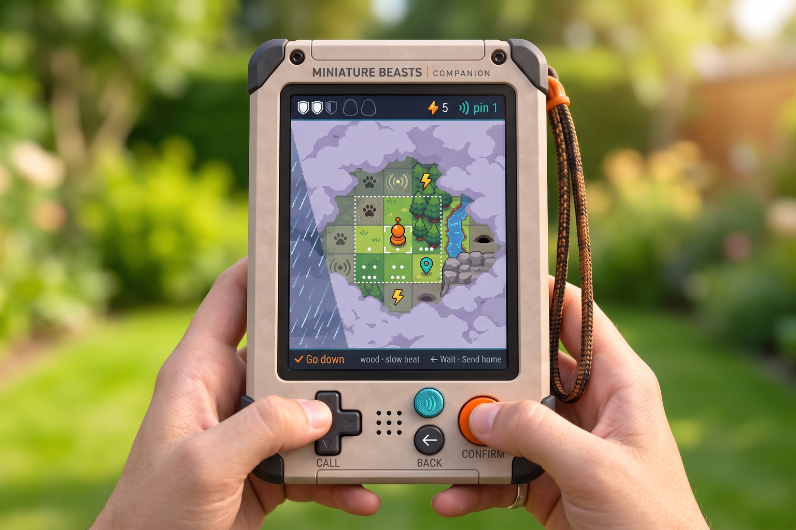 <em>companion-map-hands. Approved concept, generated. Take the HUD's weight and the bottom line's calm; its strings are not specs.</em></td></tr></table>

### Moving a screen onto the frame

The screens were first laid out on a smaller frame: HUD 0–25 (its rule on row 25), view 26–565, bottom line 566–599. Three rules move every screen onto this one. Nothing moves sideways: every x stays as it is.

1. **The HUD's contents move down 3 px. Nothing in it changes size.** The 6 px the HUD gains is padding, 3 above and 3 below, so every element stays centred on the HUD's middle row. Type stays 2×, icons stay 14–16 px, the Shield plates stay 6×12 and the partner's ring stays 14×6.
2. **The bottom line's contents stay on their rows.** Its 2 extra px go above the text, between the rule and the capitals.
3. **The view's contents move down 6 px with the view's top.** Anything placed up from the view's foot is placed from 564 instead of 566, so it moves up 2 px. The screens below that break this rule say so.

All rows below are at 1×, top-left origin. "Rows a–b" includes both rows.

#### The HUD at 32

| Element | Was | Now |
| --- | --- | --- |
| Fill and rule | ink rows 0–24, 1 px `night` rule on row 25 | ink rows 0–30, 1 px `night` rule on row 31 |
| Title (screens away from the field) and the mist note at the right | 2× at y 6 | 2× at y 9: capitals on rows 9–22 |
| Reach grid, 5×5 | 3×3 dots at a 4 px pitch from y 3; 1 px frame rows 1–23 | dots from y 6; frame rows 4–26 |
| Reach grid, 9×9 | 2×2 dots at a 3 px pitch from y 0; frame sides only, rows 0–24 | dots from y 3 (rows 3–28); a full 1 px frame, all four sides, rows 1–30. It fits now, so it is drawn whole |
| The reach-done tick | top at y 17 | top at y 20 |
| Shield plates | each 6×12 at y 7, its dark outline 8×14 at y 6 | plates at y 10, outlines at y 9 |
| Pod slots | at y 3; the catch flash 18×22 at y 2 | slots at y 6; flash at y 5 |
| Crate count | icon 16×14 and number at y 6 | at y 9 |
| Partner | token 12×12 at y 7, teal ring 14×6 at y 18, name at y 6 | token at y 10, ring at y 21, name at y 9. When the 24 px HUD ring face lands it sits at y 4 (rows 4–27) |
| Energy, Data, Essence | icons 14×14 and numbers at y 6; the gain flash panel at y 4, 18 high | icons and numbers at y 9; flash at y 7 |
| World turn | sun 11×11 at y 7, "T7" at y 6, the turn flash panel at y 3, 20 high | sun at y 10, "T7" at y 9, flash at y 6 |
| Battery 15×9, radio 9×9 | at y 8 | at y 11 |

The hit warning under the HUD ("Shield 2/3", ink panel with a coral line) belongs to the view and follows rule 3: panel (4, 35, 112, 22), text at y 39.

#### The bottom line at 36

| Element | Was | Now |
| --- | --- | --- |
| Fill and rule | ink rows 566–599, 1 px `night` rule on row 566 | ink rows 564–599, 1 px `night` rule on row 564 |
| Text (✓ part, ← part, the middle) | 2× at y 576, set 10 px below the line's top | 2× at y 576, set 12 px below the line's top: capitals on rows 576–589, descenders to 593 |
| Dividers | 1 px `slate`, rows 574–593, from the line's top + 8, height line − 14 | the same rows, 574–593: from the line's top + 10, height line − 16 (20 px) |
| Conditions (1–3 bolts, ◀ ▶, the fog patch) | placed from y 574 (line top + 8); bolts at 575 | the same rows: placed from line top + 10 |
| Left pad, ✓ · ← spacing, divider x | 8 px, as built | unchanged |

That leaves 11 rows of ink between the rule and the capitals, and 6 under the descenders.

#### The view at 32–564, screen by screen

| Screen | Rule | The result |
| --- | --- | --- |
| Reach view | Already placed from the view's top: +6 | Tier 1 (5×5 at 78 px): the reach on rows 36–425, its dashes on rows 34–35 and 426–427. The band at y 434: the flag at (12, 436), the head-home words at (30, 438), the survey line at (12, 462). The inset (6 px a cell, 96×120) at (344, 437), its frame (341, 434, 102, 126): its last row is 559. Tier 2 (9×9 at 48 px): the reach on rows 36–467, the band at y 476, the inset (4 px a cell, 64×80) at (376, 479), its frame (373, 476, 70, 86), last row 561. A message in the band keeps the band's width and ends by row 547: up to five lines at tier 1, three at tier 2 |
| Full map, start map, Full map from the expedition choice | A new rect, see [Map tiles](#map-tiles) | The ink frame (13, 34, 424, 528), the map (17, 38, 416, 520): +2, not +6 |
| Place | Placed from the view (the camera keeps the pawn in the middle third of 532 rows) | No fixed rows to move. The pod-swap chooser is placed up from the foot: (6, 460, 438, 98), was 462. The hit frame and the Wait ripple run on the view's edges, rows 32–563. Name tags keep to x 6–444, y 38–558, as set in [Place](#place) |
| Menu | +6, and the menu starts below a top message box | Over the field: rows 44 high, 250 wide, 8 px from the side away from the pawn: x 192 when the pawn's screen x is 225 or less, x 8 when it is more. Six rows make it 284 high (rows × 44 + 20). Over a place: the card (192 or 8, 40, 250, 284), rows 40–323, its shadow to 327, while the message box is at the foot or no message shows; while the box is at the top, the card starts 8 px under the box's foot, y 60 + lines × 20: (·, 80, 250, 284) under one line, (·, 100, 250, 284) under two, (·, 120, 250, 284) under three, last row 403. The box never moves for the menu. Over the map: the card (192 or 8, 40, 250, 284), rows 40–323, always; the message there is in the reach view's band (y 434 at tier 1, 476 at tier 2), below the card. Everywhere else: the card (60, 116, 330, rows × 62 + 20), was y 110; five rows end at 446. The darkening fills rows 32–563 |
| Probe | +6 | "Probe" at y 40; plates (12×22) at (24, 64); the two lines at y 60 and 82; Energy row at y 108; the tier 2 note panel (18, 130, 414, 26); "On the map" at y 172; legend rows from y 190 at an 18 px pitch, the 14th ending on row 440; the four stone tiles 34×34 at y 442, labels at 479; "Field guide" at y 500; species tokens (24 + 138*i*, 518, 130, 40), last row 557, 6 px over the line |
| Cargo, in the field | +6 | Counters (22 + 138*i*, 42, 130, 40); "Pods" at y 94; pod panels (24 + 130*i*, 114, 122, 36); "This expedition" at y 162; met tiles 42×42 at y 182; the reach line at y 238; the Head home card (95, 268, 260, 50); the seal preview from y 332 at a 22 px pitch; "The sealed bay" at y 406; crates (24 + 140*i*, 428, 130, 66); the foot line at y 510 |
| Cargo, at home | +6 | "In the hold" at y 42; counters at y 62; pod panels at y 110; "The sealed bay" at y 166; crates at y 190; the bay line at y 272; the Probe line at y 316; docked or away at y 342; the note from y 386 at 22; the world turn at y 476 |
| Mibis (the list as built) | +6 | The first card (20, 42, 410, 64), a 72 px pitch. The scroll keeps the focused card's foot at y 526, 38 px over the line, as before. The roster in [Care and the carried set](#care-and-the-carried-set) replaces this list with its own rects, which are already on this frame |
| Active mibi | The rects in [The active mibi screen, with care](#the-active-mibi-screen-with-care), now | Stage (24, 40, 402, 280), was (24, 36, 402, 276); the mibi's box at (97, 52), was 44; its shadow 180×22 at (135, 296), was 280; ◀ ▶ at y 172, was 166; name at y 332, was 324; the stage chip at y 331; species and ability at y 370; status at y 396, a 22 px pitch; page dots at y 452, the ring 10×10 at y 450. The species moments move with the mibi's box (+8): the Tuikis glow at (75, 60), the Loika's paws at y 78, the Untuva's puffs centred on (225, 178), the Tuikis sparks and the chirp +8 (the chirp's top at y 100) |
| Head home | +6, and every line clipped | The outcome at y 46; the lines below keep their steps (34 after the outcome, 24 a line, 34 after a group, 84 for the bay). Every line is clipped at 410 px, so nothing passes x 432. World-turn lines stop when the next would start below y 506 (was 500). The bay-full and Probe-broke lines are fixed below |
| Expedition choice | +6, and the message box rule below | The strip at y 40; Weather (20, 64, 410, 84); Deep ground (20, 158, 410, 84); the partner card (20, 252, 410, 92); the inset 96×120 at (24, 360); the words beside it at y 362, 386, 410, the last-start flag at (136, 436), the at-home line at y 464. Docked: the panel (70, 512, 310, 26), its words at y 517. Away with crates sealed: the panel (70, 494, 310, 48), its words at y 500 and 520 |
| New world | +6 | The question at y 136; the warning at y 182 and 204; the two choices (75, 266, 300, 54) and (75, 346, 300, 54), the brackets 7 px outside |
| No mibi yet | +6 | The dotted pod centred on (225, 196); "No mibi yet" at y 276; the two lines at y 320 and 342; the bay line at y 378 |
| Message box | Placed from the view's foot or top | At the foot, its foot on row 555 (8 px over the line): its top is 556 − height, was 558 − height. At the top, its top at y 40, was 34. The pawn test is unchanged: the box goes to the top when the pawn's screen y + 20 passes the low box's top. Width, 20 px line pitch and three lines at most as built: (225 − w/2, y, w, lines × 20 + 12), w the widest line + 26. With the menu open over a place, the box keeps its place and the menu starts under it, see Menu |

The developer panel beside the screen is not part of the 450×600 face and does not move.

#### Map tiles

The world map stays 16×20 cells at 26 px a cell, 416×520. With its 4 px ink frame it is 424×528, which leaves 4 rows of the 532: the frame sits 2 px under the HUD (rows 34–561) and 2 px over the bottom line. So the map is placed from the view's top + 6 (y 38), not from the HUD's foot + 10: at the new HUD that would put the frame's last row on 565, inside the bottom line. On the start map a good start's sign tag (26×20, set 12 px above its cell) on the top row would lose 6 px under the HUD; its top is held at y 34.

The reach view's 78 px and 48 px cells and both insets fit as given above. In a place, 48 px tiles give 9.4 columns and 11.1 rows of the view.

#### Faults the move fixes

- **Head home, bay full.** "A break would lose them · dock to free the bay." runs from x 22 off the screen's right edge (measured to x 449, no margin). The line now reads `A break would lose them.` (x 22–243). The amber bay line under the crates already says to dock. Every Head home line is clipped at 410 px, as above.
- **Menu over a place, message at the top.** With the pawn low the message box goes to the top, (21, 40, 408, 52) for two lines, and the menu card (192, 40, 250, 284) under it loses its first entry, Leave this place. The card now starts 8 px under the box (Menu, above): (192, 100, 250, 284) under two lines.
- **Head home, the Probe broke.** `Dock at the Station: it mends the Probe free.` is 414 px and the 410 px clip cuts it. The line reads `Docking mends the Probe free.` (272 px, x 22–293), the copy already taken on the care branch: the Companion docks in the Caddy, never at the Station.
- **Expedition choice, docked.** Pressing ✓ while docked writes a two-line message (`Docked · lift the Companion at the Station to explore`) whose box, rows 506–557 on the old frame, covers the "Docked · lift at the Station" panel (rows 506–531) whole. While a message shows on the expedition choice, neither the docked panel nor the sealed-crates panel is drawn: the message box takes the view's foot as on every screen (rows 504–555 for two lines), and the panel comes back with the next press. The message says the same thing, and the strip and the bottom line keep the rest.

**Pass when**
- [ ] The HUD's rule is on row 31 and its capitals on rows 9–22, on every screen.
- [ ] The bottom line's rule is on row 564 and its capitals on rows 576–589.
- [ ] Nothing of the view is drawn on rows 0–31 or 564–599.
- [ ] No line of text in the view passes x 442.
- [ ] No panel overlaps another panel or the message box.
- [ ] The full map's frame is whole, rows 34–561.

---

## Expedition choice

**Purpose.** Choose this expedition's kind. **Reads first:** the focused card and what it promises.

- **Composition.** "Expedition 4" at 3×, top left. Under it a quiet 2× strip: world turn, Probe tier, Shield. Two full-width paper cards (about 434×120), each with a 96 px round painted vignette at the left, the name at 3× and one 2× hint. A gated card dims through the fade table and shows what opens it (a digger's paw), never a bare lock. Below: the partner card, the mibi with you as a 64 px HiBit face on its teal ring, name and stage. At the foot: the whole-world inset and "Explored N of 320".
- **Lively / quiet.** Lively: the focused card's vignette (a bolt flickers, a burrow glints) and the partner's idle. Quiet: the strip, the inset, the other card.
- **Light and weather.** No weather on the screen. Each vignette carries its own, lit from the top left.
- **Palette.** Paper cards on ink. Vignettes use full ramps: blue and violet storm cloud, yellow bolt; warm soil and a dark mouth for the burrow.
- **Type.** 3× title and card names; 2× hints and strip.
- **Chrome.** Paper cards, orange brackets, ✓ `Choose Weather`, `← menu`. Call's slot is empty.
- **Motion.** Focus slides in 110 ms; vignettes 2 frames at 2–4 Hz.

**Pass when**
- [ ] The two kinds are told apart by their vignettes alone.
- [ ] A gated kind shows what opens it.
- [ ] The partner reads as that individual (volume, eyes, markings) at 64 px.
- [ ] Docked, Start reads "Lift to explore", dimmed, with the reason.
- [ ] No more than two type sizes in the view.

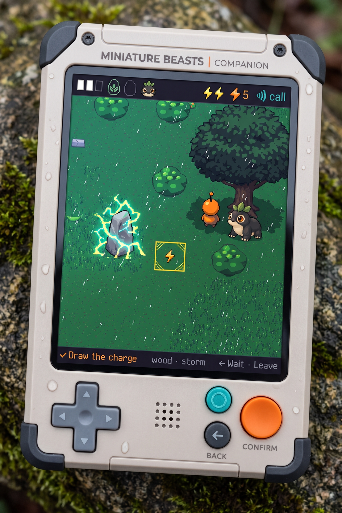

*companion-storm: the storm light the Weather vignette carries. Approved concept, generated. No approved art for this screen yet.*

---

## Start map

**Purpose.** Pick where the expedition starts. **Reads first:** the glints, then the dotted range square around the focused cell.

- **Composition.** The whole map at 26 px a cell (416×520), centred. Unseen land under the cloud bank. The focused cell in orange brackets with the 5×5 range square dotted around it. Glints as four-point stars on good starts.
- **Lively / quiet.** Lively: glints twinkle, the focus moves. Quiet: cloud and land.
- **Light and weather.** Daylight from the top left. A storm already over the map shows as its diagonal rain sheet.
- **Palette.** Cloud in lavender-grey with a lit rim; land in its own ramps, seen cells through the fade table.
- **Type.** Nothing on the map. The bottom line names the cell: `✓ Start here · ← back | meadow · slow beat`.
- **Chrome.** Bottom line only; no panels over the map.
- **Motion.** Glints 2 frames at 2 Hz; the range square moves with the focus in one step.

**Pass when**
- [ ] The glints are the brightest things in the view.
- [ ] The range square reads as "this far" before any text.
- [ ] Cloud has volume and a lit rim; no flat grey slabs.
- [ ] Nothing is written on the map.
- [ ] The cell under focus is legible at 26 px: wood, meadow, rock, water.

*companion-map-hands: the cloud bank and lit rim the start map shares. Approved concept, generated.*

---

## Map (full)

**Purpose.** The whole world during an expedition, from the menu. **Reads first:** the pawn, then the start flag.

- **Composition.** 16×20 cells at 26 px. Cloud over unseen land: big heaps, lit on the side facing explored land, darker away from it. Seen cells faded. Visited cells in full colour, in quarters (dotted, nearly, whole). Signs at 16 px: paw, beat, bolt (hollow for a warm stone), pin, gate, outpost flame (big, medium, small, dark hut), beacon, skull, start flag. The pawn at 16 px with a 1 px dark silhouette. The range square dashed.
- **Lively / quiet.** Lively: the rain sheet, outpost flames, the pawn. Quiet: land and cloud.
- **Light and weather.** One diagonal rain sheet over the storm's columns; cells under it storm-dark, toward blue.
- **Palette.** As the reach view, at a smaller scale. Signs keep their colours: yellow bolt, teal pin, orange flag.
- **Type.** None on the map. The bottom line names your cell and the one ahead.
- **Chrome.** HUD and bottom line only.
- **Motion.** Rain drifts 1 px per action; flames 2 frames at 4 Hz; the pawn steps one cell in 110 ms.

**Pass when**
- [ ] The pawn and the flag are found in under a second.
- [ ] Fog, seen and visited are told apart without colour.
- [ ] Signs keep one silhouette at every size.
- [ ] The outpost's flame size reads at 16 px.
- [ ] No sign covers the pawn.

---

## Reach view

**Purpose.** Walk the Probe's reach. The default map in an expedition. **Reads first:** the pawn and the cell it faces.

- **Composition.** The 5×5 reach at 78 px a cell (390 px), centred; 9×9 at 48 px at tier 2. Only explored and seen cells show ground, cut from the place's real tiles. Everything else is one cloud bank of large heaps, lapping unevenly over the island's edge. A band below the reach: the flag with the way home and "Explored N of M in reach" at the left, the whole-world inset at the right.
- **Lively / quiet.** Lively: the rain sheet, the cloud's lit rim, the pawn, flames. Quiet: ground, band, inset.
- **Light and weather.** The island sits in a bright clearing; cloud lit on the side facing it, shaded below. Rain is one clean diagonal sheet of pale streaks with a straight soft edge, no cells drawn under it.
- **Palette.** Lavender-grey cloud from the violet and cool neutral ramps; ground in its own ramps; seen cells faded; unsurveyed quarters under the Bayer dot.
- **Type.** Nothing on the cells. The band in 2×.
- **Chrome.** Dashes frame the reach; orange brackets on the pawn's cell.
- **Motion.** Clouds drift 1 px per action; rain leans with the storm's heading; the pawn walks 3 frames.

**Pass when**
- [ ] Reads like the concept at arm's length: a lit island in soft, layered cloud.
- [ ] Signs are 24 px, large and simple, in corner slots; never over the pawn.
- [ ] The pawn is 48 px with a 2 px dark silhouette and reads on every ground.
- [ ] Only explored and seen cells show terrain.
- [ ] The cloud is built from drawn pieces, not circles.
- [ ] The inset and band never cover the reach.

<table><tr><td valign="top"> <em>companion-map-hands: the north star. Approved concept, generated. Its range square is 3×3; the reach is 5×5.</em></td>
<td valign="top">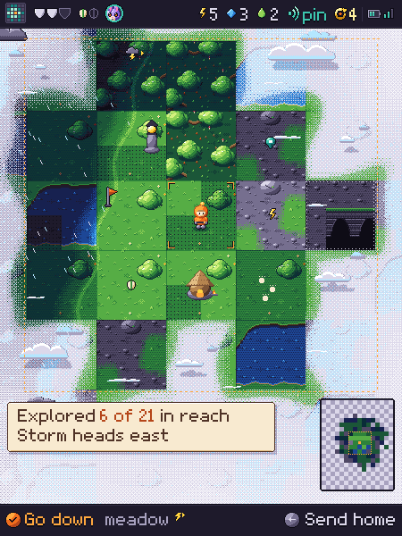 <em>Reach view, 450×600 at 1×. Accepted as passable, to be refined.</em></td></tr></table>

---

## Place

**Purpose.** Act in a place: walk, gather, meet creatures. **Reads first:** the pawn and what it faces.

- **Composition.** 48 px tiles, about 9 across and 11 down. The camera keeps the pawn in the middle third. The partner on its teal ring with a name tag; creatures with their bubbles (`?` blue, `!` red, fruit, `…`). The message box at the foot of the view, or at the top when the pawn is in the lower third.
- **Lively / quiet.** Lively: creatures and their routines, water, flames, a charged stone's crackle, rain. Quiet: the ground and the veil.
- **Light and weather.** Daylight from the top left; trees cast shade down-right. **Storm:** every colour through the dark table toward blue, slanted rain with the storm's heading, a charged stone in blue-white crackle, a warned strike as a yellow tile outline only. **Fog bank:** colours washed toward pale bone, white puffs only over the fogged part, a soft round edge of sight. **Veil:** ground one step darker with night dots, a 16 px dithered edge. Cave: dark with a lantern circle. The pawn and mibis are never darkened.
- **Palette.** Grass, warm earth and cool stone ramps; storms go blue, never brown-grey; red only for danger and fruit.
- **Type.** Only the name tag and bubbles in the view; everything else in the message box and the bottom line.
- **Chrome.** Message box (paper), name tag (ink with a pointer).
- **Name tag placement.** The specimen is the spotlight: a name tag never covers a creature. The **clear zone** is the token's whole 48 px cell plus any pixel drawn outside it (a sprout or ear above the head, the teal ring at the feet), plus 4 px. The tag (22 px tall) goes, in this order, to the first position that stays inside the view (x 6–444, y 38–558) and covers no other creature's or token's clear zone, the pawn, the HUD, the bottom line or the message box, and never sits over the warned cell or a sign (the warned ring is the one signal the player must read):
  1. **Below:** centred on the cell, its top 4 px under the clear zone's foot, pointer up.
  2. **Right:** its left edge 4 px right of the clear zone, centred on the cell's middle row, pointer left.
  3. **Left:** the mirror of right, pointer right.
  4. **Above:** centred on the cell, its foot 4 px over the highest drawn pixel (the sprout tip, not the cell's top), pointer down.
  5. **Below, slid sideways** inside the view until clear, the pointer kept on the cell's centre. If nothing is clear, the tag is not drawn until a position clears.
- **Motion.** Idle 2 frames at 2 Hz; walk 3 frames, 150 ms a step; the Call ring 3 frames over 300 ms, its last contour held a moment; a hit is a 260 ms 3 px shake.

**Pass when**
- [ ] The pawn reads at once in sun, storm, fog and veil.
- [ ] Shelter reads as shelter: overhangs, caves, a lit outpost. A tree never looks like one.
- [ ] A charged stone, a warm stone and a warned strike are told apart at 1×.
- [ ] Fog reads as fog: pale and soft, not lavender.
- [ ] Creature tokens keep volume, eyes and markings at tile size.
- [ ] One clear light direction across tiles, sprites and shadows.

<table><tr><td valign="top"> <em>companion-storm: the north star for a place. Approved concept, generated. Take the green, the rain, the crackle and the warned tile; not the tree as shelter.</em></td>
<td valign="top">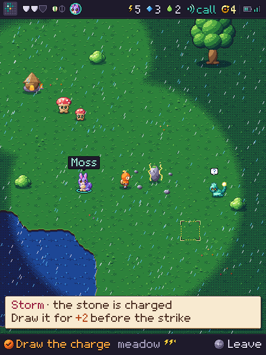 <em>Place in a storm, 450×600 at 1×. Accepted as passable, to be refined.</em></td></tr></table>

---

## Menu

**Purpose.** The field menu behind the ← key. **Reads first:** the focused entry.

- **Composition.** A paper card at the lower right, above the bottom line, about 260 px wide. Rows 40 px: a 16 px icon and a 2× label. A dimmed entry gives its reason in the bottom line ("Start · about 2 cells"). A rule before New world. The view stays visible behind, darkened through the dark table.
- **Lively / quiet.** Lively: the focused row only. Quiet: everything else; the world behind holds still.
- **Light and weather.** The view behind keeps its weather, one step darker. The card is lit from the top left like any object.
- **Palette.** Paper on a darkened view; orange for focus; dimmed rows through the fade table.
- **Type.** 2× labels; no title.
- **Chrome.** Paper card, focused row lifted in orange brackets. Bottom line: `✓ Wait one action · ← close`.
- **Motion.** The card rises in 110 ms; focus moves in one step. After Wait the menu stays open.

**Pass when**
- [ ] The focused entry is found without reading.
- [ ] The pawn stays visible behind the card.
- [ ] Each entry has its own icon shape.
- [ ] A dimmed entry says why, in the bottom line.
- [ ] One way out (← close).

*The view the menu darkens, never hides. Accepted as passable, to be refined. No approved art for the menu yet.*

---

## Message box

**Purpose.** One note that stays until the next action. **Reads first:** its first words.

- **Composition.** Paper, the view's width less 8 px margins, up to three 2× lines (about 80 px). At the foot of the view, or at the top when the pawn is low; never over the pawn's row.
- **Lively / quiet.** Quiet. It appears at once and waits.
- **Light and weather.** None; it is paper over the world.
- **Palette.** Brown body text on cream; the lead word in its role colour: red for a warning, orange for an action, teal for Call.
- **Type.** 2×, 22 px pitch. Key glyphs (✓ ← )))) drawn as the key caps in their colours.
- **Chrome.** Paper panel, drop shadow.
- **Motion.** None beyond appearing. Under reduced motion, the same.

**Pass when**
- [ ] Reads in one glance; three lines at most.
- [ ] Never covers the pawn or the thing being discussed.
- [ ] Never clips a word.
- [ ] The key it names is shown as that key.
- [ ] Play language, no numbers but prices.

*Message box at the foot of a place. Accepted as passable, to be refined.*

---

## Cargo

**Purpose.** What the hold carries, what Head home will seal, and the bay. **Reads first:** the pods carried.

- **Composition.** "Cargo" at 3×. The hold: each pod as a 64 px HiBit shell in its place colour, with where it came from in 2× ("from a hole"); empty slots as outlines. The three counters with icons. The bay: three sealed crates side by side (about 120×96), each stamped with its expedition number and its contents as icons; an empty place is a dashed outline. At the foot: "Explored N of M · fully surveyed K" with the reach dot grid.
- **Lively / quiet.** Quiet. The pods glint once on opening.
- **Light and weather.** Indoors; no weather. Objects lit from the top left.
- **Palette.** Ink panel. Pod shells in place colours; crates in cool neutrals and teal with an orange seal tag.
- **Type.** 3× title; 2× everything else.
- **Chrome.** In the field `✓ Head home · ← close` where it is allowed; at home read-only, no ✓ cap.
- **Motion.** None but the glint, 2 frames.

**Pass when**
- [ ] Pods read as pods (rounded, ribbed, leaf mark) and their place colour shows.
- [ ] Sealed crates never read as spendable; the counters show only the hold.
- [ ] Three crate places, full or dashed.
- [ ] One way out.
- [ ] Every count is beside its icon.

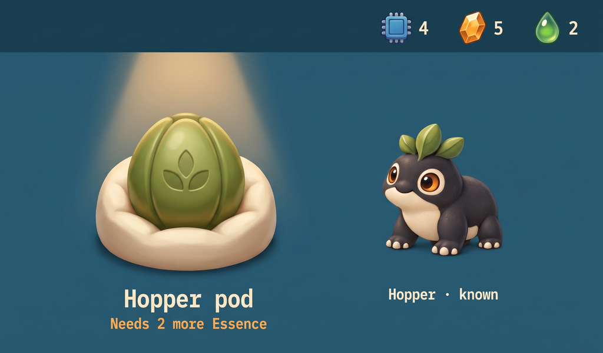

*station-research-pod: the pod's shape and leaf mark, drawn here in HiBit. Approved concept, generated.*

---

## Probe legend

**Purpose.** The Probe's state and what the signs mean. **Reads first:** the Shield plates.

- **Composition.** The Probe drawn at about 160 px, top left; its Shield plates large beside it (24×40 each, three or four), the tier, and "Energy in reach: N". Below, the legend: one row per thing, its tile at 1× and one 2× line. Stones: plain, warm, charged, warned strike. Storm: 1–3 bolts with the exact odds. Fog bank. This is the only screen with exact odds.
- **Lively / quiet.** Lively: the charged stone's crackle and the warm stone's ring in the legend. Quiet: the rest.
- **Light and weather.** None on the screen; the tiles keep their own light.
- **Palette.** Ink panel; plates white when whole, an outline when gone; legend tiles in their field colours.
- **Type.** 2×; the Probe's name at 3×.
- **Chrome.** `✓ Patch a plate · 3 ⚡` (first press arms, second patches) when hurt; read-only otherwise.
- **Motion.** Legend tiles animate as in the field; a patched plate fills in 170 ms.

**Pass when**
- [ ] Shield state reads from the plates alone.
- [ ] Each legend tile is the same art as in the field.
- [ ] Odds appear here and nowhere else on screen.
- [ ] The arm-then-confirm state is visible.
- [ ] One way out.

*companion-storm: the charged stone and the warned tile the legend shows. Approved concept, generated.*

---

## Companion mode / active mibi

**Purpose.** Be with one of the mibis with you. **Reads first:** the mibi.

- **Composition.** The mibi at 280×300 in HiBit, centred in the upper two thirds, on a soft painted ground (grass, clover, cream light) quieter than the mibi. Name at 3×, a stage chip, species and ability at 2×, one status line ("with you · joins the Probe"). Page dots below, the mibis with you ringed; ◀ ▶ when there are others.
- **Lively / quiet.** Lively: the mibi (idle, answering Call, the Tend moment). Quiet: the ground and every label.
- **Light and weather.** Soft daylight from the top left; a contact shadow under the mibi. No weather.
- **Palette.** Greens and cream for the ground, two steps lower in contrast than the mibi.
- **Type.** 3× name; 2× the rest; no meters.
- **Chrome.** `✓ Tend Dot · ← Mibis`, or `✓ Walk together` once a world turn, undocked; the full set of states is in [Care and the carried set](#care-and-the-carried-set).
- **Motion.** Idle 2 frames at 2 Hz; Call: a hop to the front and a chirp; docked, the mibi sleeps and the line says "Lift to explore".

The Companion calls nothing; it learns at the dock. **The delivery notice:** when a portrait's crate lands while docked, the docked screen shows a message box, "**Fig's portrait** has come · see it at the Station", the name in orange; away, the notice waits for the next dock and joins the link sheet ("The Station has them · a portrait for Fig"). One notice per portrait, never repeated. At that dock the Companion takes Fig's painted set, derived to HiBit on the Station, if Fig is one it carries. **The card:** on a portrayed mibi this screen adds `✓ Show Fig's card`: the portrait card at 450×600, Fig's portrait in HiBit, its name and place, and the postmark large enough for a phone camera; the phone opens Fig's page on the website. A plain mibi has no card.

The 280×300 HiBit resident on this screen, the 48 px field token, the 64 px partner face and the HUD ring face are all **derived on the Station from the mibi's standard painting** (the cloud painting every mibi gets at Grow) and synced at the dock; nothing is painted at these sizes. A portrait's derived set replaces the standard set, token included. A mibi whose painting has not landed yet (grown offline) carries the **placeholder** set, the stylised rig pass at the same sizes, until the next dock after the painting lands; the species' generic token serves only a silhouette the Companion has no painting for (a wild creature in the field). The pass line "the same individual as at the Station" is then by construction.

**Pass when**
- [ ] The mibi is the same individual as at the Station: anatomy, markings, eyes.
- [ ] The ground never competes with the mibi.
- [ ] Stage reads from proportion, not only the chip.
- [ ] No needs or meters drawn.
- [ ] Draws only what is known.

<table><tr><td valign="top">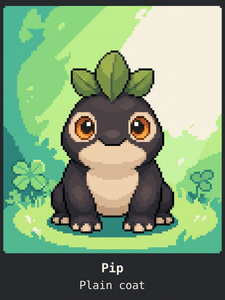 <em>companion-resident-home, 450×600 at 1×. Approved concept, generated.</em></td>
<td valign="top">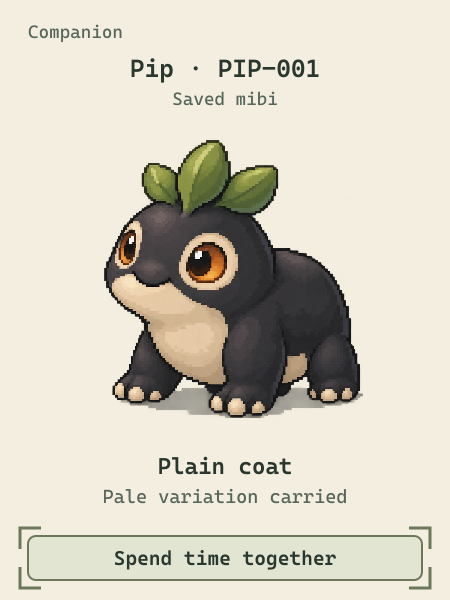 <em>The accepted HiBit Pip at 280×300. Accepted appearance reference (creature only).</em></td></tr></table>

---

## Care and the carried set

The Companion carries up to three mibis. Care happens here and nowhere else: Tend, once a day for each mibi with you, and the Walk, once a world turn for all of them together. Three Tends earn the bond; a bonded juvenile grows up through care. This section sets the screens that carry it: Mibis (the roster, with the Lead card), the active mibi screen, and the expedition choice's partner card.

The geometry is on the frame: HUD 0–32, view 32–564, bottom line 564–600, all at 1×. Type is the Mibi 7×9 face at 2× (18 px line) or 3× (27 px line). Strings are given in backticks, exactly as they show. `‹name›` is the mibi's name; `‹next›` is the mibi that would lead next. Every string has been checked against a ten-letter name in the widest letters (118 px at 2×, 177 px at 3×), and every ✓ label is at most 24 characters with one.

Wireframes, 450×600 at 1×, measured boxes and slot labels only, no art: [`wireframes/companion-care/`](wireframes/companion-care/).

### What never shows

- No meter, bar, number, need or count for care, Tends or the bond. Nothing says how close a mibi is to bonding or to growing up. Nothing is amber because a mibi has not been tended.
- An unbonded mibi shows no heart at all, never a dim one: the bond is never a need.
- Undocked, a mibi at home is never shown: not in the roster, not as a page, not as a dot.
- Mid-expedition, nothing can be tended, taken, left or made the lead.

### The words the screens use

- **With you**: the mibis the Companion carries, in carried order (the order they were taken).
- **At home**: every other mibi.
- **The partner**: the mibi that joins the Probe. It is the lead if the lead is with you and grown; otherwise the first grown mibi with you; otherwise none.

---

### Mibis (the roster)

**Purpose.** See who is with you, choose who joins the Probe, and, while docked, choose who comes along. **Reads first:** the Lead card, then the mibis with you.

**Elements.**

| Element | Communicates |
| --- | --- |
| The Lead card | Who joins the Probe on the next expedition, and changes it |
| Three places under "With you" | The mibis with you, and how many more fit (a free place is an empty outline) |
| "At home" rows (docked only) | Who can be taken |
| One line under the places (undocked only) | Why the others are missing |

**Placement.** The partner first, because it is what the next expedition depends on; then the three places, always three, so "the Companion is full" is visible before it is said; then, docked, the mibis to take. Undocked the screen stops after the places.

**Alignment with the art direction.** Paper cards on ink, as on the expedition choice. The partner stands on the teal ring, the same ring it wears in the field and in the HUD. The heart is a small HiBit enamel heart, the same object as Habitat's heart drawn for the Companion's palette. The free place is a dashed outline, as on Habitat's Companion module.

**Composition.** 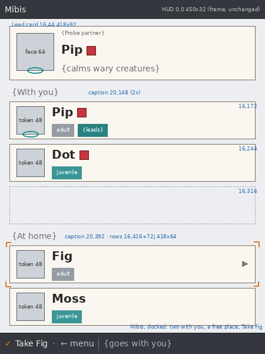 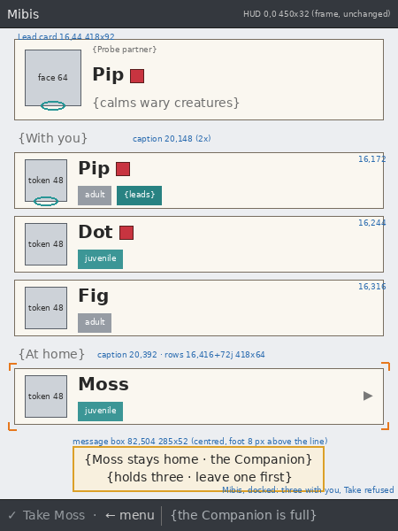

| Region | x, y, w, h | Contents |
| --- | --- | --- |
| HUD | 0, 0, 450, 32 | "Mibis" at the left, as built |
| Lead card | 16, 44, 418, 92 | Paper card. Caption `Partner` 2× `mist` at (104, 50). The partner's 64 px face at (28, 56) on the teal ring (28×11 at 46, 114). Name 3× at (104, 72), clipped at 314 px. Heart 16×16 at 8 px after the name, y 78, when bonded. One 2× line at (104, 108), clipped at 314 px: the partner's ability |
| Lead card, no partner | same | The face place is a dashed circle, 64×64 at (28, 56), 1 px `stone`, dash 2 and 2. Name line `No partner` 3×. The 2× line gives why: `young · grows with care` (the first juvenile with you is bonded) or `young · grows in time` (it is not). When none is carried, the name line is `No one with you` and the 2× line `take one at the Station` |
| Caption | 20, 148 | `With you` 2× `mist` |
| Place *i* (0–2) | 16, 172 + 72*i*, 418, 64 | A carried mibi's row, in carried order, or a free place: a dashed outline, 1 px `stone`, dash 2 and 2, no words, never focused |
| Row: token | 28, row + 8, 48, 48 | The mibi's 48 px field token. The partner's stands on the teal ring (38, row + 48, 28×11) |
| Row: name | 88, row + 6 | 3×, clipped at 200 px. Heart 16×16 at 8 px after the name, y row + 11, when bonded |
| Row: chips | 88, row + 38, h 22 | The stage chip (`teal` juvenile, `stone` adult, `plum` elder); then, on the partner only, `leads` in `teal`. No "with you" or "at home" chip: the section says it |
| Row: open mark | right edge 422, row + 22 | `▶` 2× `mist`, on the focused row only: the pad's ▶ opens this mibi's page |
| Caption, docked | 20, 392 | `At home` 2× `mist` |
| Home row *j*, docked | 16, 416 + 72*j*, 418, 64 | As a carried row, in hatch order. Nothing on it is dimmed when the Companion is full: only ✓ says so |
| Line, undocked | centred, y 400 | `the others are at home` 2× `mist`, when any mibi is at home. Mid-expedition `with you for this expedition` instead |

The list scrolls inside the view, the Lead card with it: the offset is the least that keeps the focused card's foot 8 px above the bottom line (as built).

**Focus.** Orange corner brackets 6 px outside the focused card, which lifts 2 px. Focus order, top to bottom: the Lead card, the mibis with you, the mibis at home. Opening Mibis from the expedition choice's partner card focuses the Lead card; from the active mibi screen, that mibi's row; from the menu, the first mibi with you (the Lead card when there is none).

**Interactions and how each shows.**

| Focus | When | Bottom line | ✓ does | Shows |
| --- | --- | --- | --- | --- |
| Lead card | Two or more grown mibis with you, between expeditions | `✓ Let ‹next› lead · ← menu`, context `joins the Probe` | Makes the next grown mibi with you (carried order, after the partner, wrapping) the lead | A cut: the card's face, name, heart and ability change; the teal ring and `leads` chip move to the new partner's row, which hops once (the Call hop, 600 ms). Message box `‹next› leads the Probe` |
| Lead card | One grown mibi with you | No ✓ cap, `← menu`, context `the only grown one` | Nothing | |
| Lead card | None grown, or none with you | No ✓ cap, `← menu`, context `no one grown yet` | Nothing | The card's no-partner state ([07](wireframes/companion-care/07-lead-none-grown.png)) |
| Lead card | Mid-expedition | No ✓ cap, `← menu`, context `leads this expedition` | Nothing | The card shows this expedition's partner |
| A mibi with you | Docked | `✓ Leave ‹name› at home · ← menu`, context `comes home now` (with a long name the context drops, as the bottom line's middle always does first; the row moving home says it) | Leaves it at home at once. Never refused. If it was the lead, the lead clears | The row moves to its place in "At home" (a cut); the places close up in carried order and a free place opens at the end; focus follows the mibi. Message box `‹name› stays home`. The Lead card updates if the partner changed |
| A mibi with you | Undocked or mid-expedition | `✓ Visit ‹name› · ← menu`, context `with you` | Opens its page | |
| A mibi at home | Docked, a place free | `✓ Take ‹name› · ← menu`, context `goes with you now` | Takes it: it joins the end of the carried order | The row moves into the first free place (a cut); focus follows. Message box `‹name› is with you`. The player stays on Mibis, so several can be arranged in a row |
| A mibi at home | Docked, three with you | `✓ Take ‹name›` dimmed (the dimmed ✓ cap, `stone` label) `· ← menu`, context `the Companion is full` | Nothing changes | The 3 px shake (as a refused press); message box `‹name› stays home: the Companion is full · leave one at home first` ([03](wireframes/companion-care/03-roster-docked-full.png)) |
| Nothing focusable | No mibi with you and none to take | `✓ Next expedition · ← menu` (as built) | The expedition choice | |

The pad: ▲ ▼ move between cards; ▶ on any mibi's row opens its page (the same as ✓ Visit undocked; docked, it is the way to a page, since ✓ arranges). ← goes back where Mibis was opened from, as built. **Call:** the focused mibi with you answers on its row (the hop and chirp, free); on the Lead card or a mibi at home, the partner answers, or the first mibi with you when there is no partner. With no mibi with you, Call does nothing.

Swaps happen only while docked. A request made on the Station's Habitat is applied at the dock, before this screen draws, and shows here as the result: the rows are already where they belong.

The three counts, as the wireframes show them:

| | Docked | Undocked |
| --- | --- | --- |
| None with you | Lead card in its no-partner state, three free places, "At home" rows | Lead card in its no-partner state, three free places, the line ([04](wireframes/companion-care/04-roster-away-0.png)) |
| One with you | One row, two free places, "At home" rows ([01](wireframes/companion-care/01-roster-docked-take.png) shows two) | One row, two free places, the line ([05](wireframes/companion-care/05-roster-away-1.png)) |
| Three with you | Three rows, "At home" rows with Take dimmed ([03](wireframes/companion-care/03-roster-docked-full.png)) | Three rows, the line ([06](wireframes/companion-care/06-roster-away-3-lead.png)) |

---

### The active mibi screen, with care

The section [Companion mode / active mibi](#companion-mode--active-mibi) above sets the screen's look. This sets its pages, its ✓ and the two events.

**Purpose.** Be with one mibi with you: tend it, walk with them all, and see the bond and growing up happen. **Reads first:** the mibi.

**Pages.** Undocked: one page per mibi with you, in carried order, and no others. Docked: the mibis with you, then the mibis at home in hatch order. ◀ ▶ page through them, wrapping, when there is more than one page. Mid-expedition: the mibis with you only.

**Composition.** 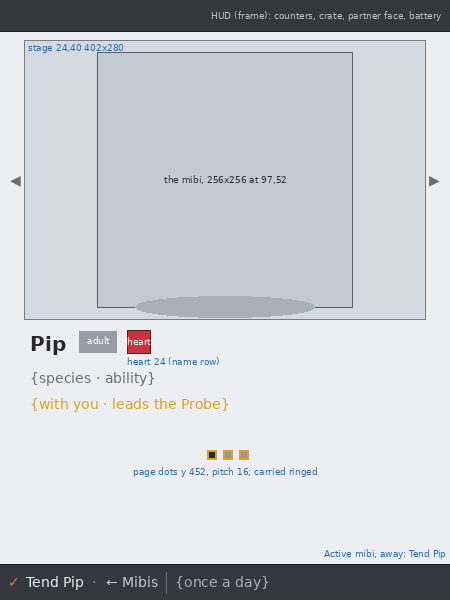 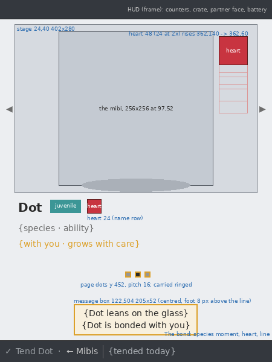

| Region | x, y, w, h | Contents |
| --- | --- | --- |
| Stage | 24, 40, 402, 280 | The ground panel |
| The mibi | 97, 52, 256, 256 | The 280×300 resident drawn in its box (the prototype's 8× token until the derived set lands); contact shadow 180×22 at (135, 296) |
| ◀ ▶ | (10, 172), right edge 440, y 172 | 2× `mist`, only with more than one page |
| Name | 30, 332 | 3×, clipped at 260 px |
| Stage chip | 14 px after the name, y 331, h 22 | As built |
| Heart | 10 px after the chip, y 330, 24×24 | Bonded only. A state, not a control |
| Species · ability | 30, 370 | 2× `fog`, clipped at 390 px |
| Status | 30, 396 | 2×, up to two lines at a 22 px pitch; `amber` on a mibi with you, `mist` at home |
| Page dots | centred, y 452 | 6×6 at a 16 px pitch; a mibi with you ringed (10×10 `amber`); docked, 16 px more between the last mibi with you and the first at home |
| Message box | centred, foot at 556 | As built: up to three 2× lines; never reaches the dots (its top is at least 484) |

Status lines: `with you · leads the Probe` (the partner), `with you · can lead the Probe` (grown, not the partner), `with you · too young for the Probe` (an unbonded juvenile), `with you · grows with care` (a bonded juvenile), `at home`, `at home · grows on the Companion` (a bonded juvenile at home, the words Habitat uses). The status line is exactly one of these, with nothing appended: no world turns left to grow up (a countdown on the clock would make growing up a thing to wait for, beside a bonded juvenile that shows none), no skill count (skill is drawn only as filled notches on the Station's Habitat card; on the Companion it is named only when a notch is earned at Head home, `‹name› gains a skill notch`, with no count), no "walked this turn" (the ✓ already says whether the Walk is there) and no "docked" (the link states say it). The longest, `with you · too young for the Probe`, is 314 px at 2× in the 390 px line.

**The ✓ on a mibi with you,** the first that applies:

| When | Bottom line | ✓ does |
| --- | --- | --- |
| Mid-expedition | `✓ Tend ‹name›` dimmed `· ← Mibis`, context `after the expedition` | Nothing; message box `Tend ‹name› when the expedition is over` |
| Undocked, the Walk not taken this world turn | `✓ Walk together · ← Mibis` (`✓ Walk with ‹name›` when one is with you), context `once a turn` | The Walk |
| Not tended today | `✓ Tend ‹name› · ← Mibis`, context `once a day` | Tend |
| Tended today | `✓ Tend ‹name›` dimmed `· ← Mibis`, context `tended today` | Nothing changes: the 3 px shake and message box `‹name› was tended today`. No countdown, no "come back" ([09](wireframes/companion-care/09-active-tended.png)) |

**On a mibi at home** (docked only): `✓ Take ‹name› · ← Mibis`, context `goes with you now`, which takes it and stays on its page, now ringed in the dots; or, with three with you, `✓ Take ‹name›` dimmed, context `the Companion is full`, the shake and the same message as on Mibis ([13](wireframes/companion-care/13-active-docked-home.png)).

**No one with you, undocked** ([14](wireframes/companion-care/14-active-away-0.png)): three dashed circles, 72×72 at (93, 150), (189, 150), (285, 150), 1 px `stone`; `No one with you` 3× centred at y 250; `take mibis along` and `at the Station` 2× centred at y 294 and 316; the bay line at y 352 when crates are sealed, as built. `✓ Next expedition · ← menu`. With no mibis at all, the built "No mibi yet" screen stays.

**Tend.** One press: the species moment plays on the stage (a Loika leans on the glass, a Tuikis glows, an Untuva puffs; 1.8 s), and the message box gives the Tend line: `‹name› leans on the glass · it remembers the ‹place›`, the moment's words as built for its species and the place from its last expedition, or `· it hasn't been out yet` when it has none. Input is held 300 ms, or to the end of an event that follows. Docked, the mibi with you sleeps between presses; Tend wakes it for the moment and it settles back.

**The Walk.** One press, on any page of a mibi with you: the shown mibi plays its walk moment on the stage, and every other mibi with you stands at the stage's foot as its 48 px field token, at (36, 260) and (366, 260), 2 idle frames at 4 Hz, for 2.4 s, then they go ([10](wireframes/companion-care/10-active-walk.png)). The message box names them all, `‹A›, ‹B› and ‹C› walk together` or `‹A› and ‹B› walk together`; walking with one keeps the built walk line for its species. The view stays on the shown mibi.

**The bond** ([11](wireframes/companion-care/11-active-bond.png)). It is checked after every Tend and every Walk. When a mibi bonds, after the action's own moment:

1. The view is on that mibi's page (after a Walk, the view cuts to it; several bond in carried order, one after another).
2. The species moment plays again, short (900 ms).
3. The heart, `c-heart-24` drawn at 2× (48×48, pixel for pixel), rises beside the mibi's head from (362, 140) to (362, 60) in four 20 px steps of 150 ms, holds 900 ms, and is gone. At that moment the 24×24 heart appears in the name row, and stays.
4. The message box takes the bond line, `‹name› is bonded with you`, which stays until the next action.

Input is held to the end. Under reduced motion the heart stands at (362, 60) for 1.5 s, without the rise. No other screen plays the bond; Mibis, the expedition choice and the Station's Habitat show the heart as a state from then on.

**The grow-up line** ([12](wireframes/companion-care/12-active-grow.png)). A bonded juvenile grows up at the first Tend or Walk after its bond (never at the same press). After the action's moment the view is on that mibi's page (several in carried order, as for the bond), the art cuts from the juvenile to the adult, the chip changes, and the message box takes `‹name› is grown · it leads the Probe now` when it is now the partner, or else `‹name› is grown · it can lead the Probe`. Nothing rises and nothing else plays: the line is the event.

Lines the world turn writes stay on the Head home screen, as built, worded for the carried set: a juvenile grown on the clock `‹name› is grown · it leads the Probe now` (with you and now the partner), `‹name› is grown · it can lead the Probe` (with you), `‹name› is grown · at home` (at home). The elder line is unchanged.

**Message box order** after one press: the action's line, then bond lines, then grow-up lines, in carried order; three lines at most, the rest on the next action (as built).

**Call** on this screen: the shown mibi answers, if it is with you; on a page of a mibi at home, the view goes to the first mibi with you, which answers (as built). Free.

---

### Expedition choice: the partner card

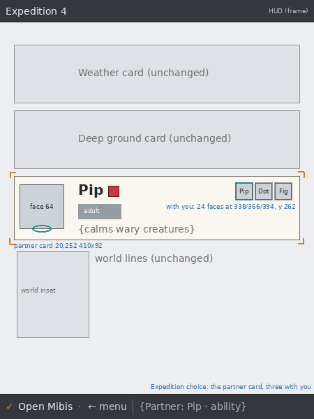 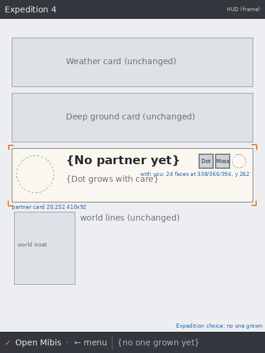

**Purpose.** Say who joins the Probe on this expedition and who else is coming along. **Reads first:** the partner's face.

| Region | x, y, w, h | Contents |
| --- | --- | --- |
| Card | 20, 252, 410, 92 | Paper card, the third focus target (as built) |
| Face | 28, 264, 64, 64 | The partner's 64 px face on the teal ring (28×11 at 46, 322). No partner: a dashed circle 64×64 |
| Name | 112, 260 | 3×, clipped at 220 px; heart 16×16 at 8 px after it, y 266, when bonded. No partner: `No partner` |
| Stage chip | 112, 292, h 22 | The partner's stage. No partner: none |
| Line | 112, 320 (no partner: 112, 296) | 2×, clipped at 220 px: the partner's ability; or why there is none, as on the Lead card |
| With you | 338, 366, 394; y 262; 24×24 each | The mibis with you as their HUD ring faces in carried order, the partner's ring `teal`, the others `stone`; a free place a dashed circle. No words |

Bottom line: `✓ Open Mibis · ← menu` (as built) (Mibis opens on the Lead card), context `Partner: ‹name› · ‹ability›` (as built), `no one grown yet` or `no one with you`. The built "take one at the Station · N at home" loses its count.

---

### Assets

| Asset | Size | Where |
| --- | --- | --- |
| `c-heart-24` | 24×24, HiBit, the 48 colours | The active mibi's name row; at 2× in the bond event |
| `c-heart-16` | 16×16, HiBit, its own drawing (not the 24 shrunk) | Roster rows, the Lead card, the expedition choice's partner card |
| The species Tend moment, per species | the 280×300 stage | Tend and the bond (the built code-drawn moments stand in until it lands) |
| The walk moment, per species | the 280×300 stage | The Walk (the built walk moment stands in) |
| Faces at 64 and the HUD ring face (24), field tokens at 48 | as listed in [Companion mode / active mibi](#companion-mode--active-mibi) | Lead card, partner card, rows, the walk |

The heart is the same object as Habitat's enamel heart, drawn for the Companion: no face, no sparkle, never a flat emoji heart. Dashed outlines, rings, chips and the open mark are composed, not assets.

**Pass when**
- [ ] Undocked, no mibi at home appears anywhere: not a row, a page or a dot.
- [ ] The three places always show; "full" reads from the picture before the words.
- [ ] Take refused at three says why in the bottom line and the message box.
- [ ] The partner reads from the teal ring alone, in the roster, the card and the field.
- [ ] Nothing shows care, Tends or closeness to the bond or to growing up: no meter, bar, number or need.
- [ ] Tended today is a dimmed ✓ and a plain line, never a countdown.
- [ ] The bond plays only on the active mibi screen, once; afterwards the heart is a state everywhere.
- [ ] An unbonded mibi has no heart, not a dim one.
- [ ] Every slot fits a ten-letter name at 1×.
- [ ] One way out on every screen.

---

## Send home (Head home)

The menu entry and screen read **Head home**: it seals the hold into the bay.

**Purpose.** End the expedition and seal the hold. **Reads first:** the outcome: Sealed, Bay full, Nothing explored, or The Probe broke.

- **Composition.** The outcome at 3×, top. The bay's three crates large across the middle; the new crate slides in and its seal stamps. Up to three world-turn lines at 2×, each with a small icon (a low flame, a moving storm). "2 consignments sealed · dock to transfer". A break shows the skull sign and the pods left behind.
- **Lively / quiet.** Lively once: the crate sliding in and the seal. Then quiet.
- **Light and weather.** Indoors; the crates lit from the top left.
- **Palette.** Ink panel; crates as on Cargo; the seal tag orange; a break in red with its skull.
- **Type.** 3× outcome; 2× lines.
- **Chrome.** `✓ Next expedition · ← menu`.
- **Motion.** The slide in 170 ms, the seal stamp in 110 ms; still under reduced motion.

**Pass when**
- [ ] The outcome reads from the picture before the words.
- [ ] Bay full shows the finds staying in the hold.
- [ ] Nothing suggests the cargo reached the Station.
- [ ] A break is plain, not punishing.
- [ ] One action, one way out.

*No approved art for this screen yet.*

---

## Station link states

**Purpose.** Show whether cargo is still aboard and whether the Station has it. **Reads first:** the crate count and the link mark.

- **Where.** The HUD's right slot (a link mark beside battery and radio), the expedition choice strip, the active mibi's bottom line, and a short docking sheet.
- **States.**
  - *Away:* a crate icon with its count; "2 sealed · dock to transfer".
  - *Docked, transferring:* the crates leave one by one toward a Station mark; "Transferring 2…". No progress bar.
  - *Docked, done:* the crates are gone, a ✓ beside the Station mark; "The Station has them · 3 pods".
  - *Docked, not answering:* the crates stay, the link mark broken; "Docked · the Station isn't answering · the bay stays sealed".
  - *Docked, idle:* the mibi with you asleep; "Lift to explore".
  - *Docked, a portrait waiting*: the done line gains the notice, "The Station has them · a portrait for Fig", once per portrait.
- **Lively / quiet.** Lively only while crates move. Otherwise quiet.
- **Light and weather.** None.
- **Palette.** Teal for a live link, grey for none, orange seal tags; never colour alone.
- **Type.** 2×.
- **Chrome.** The sheet is ink, read-only, `← close`.
- **Motion.** One crate per 300 ms; the bay clears only after the Station confirms.

**Pass when**
- [ ] Each state has its own shape: crate count, moving crates, ✓, broken link, sleeping mibi.
- [ ] Sealed cargo never shows in the counters.
- [ ] Nothing claims a transfer before it is confirmed.
- [ ] Reads in four-gray.
- [ ] The Companion draws nothing of the Station's state beyond these.

*No approved art for these states yet.*
