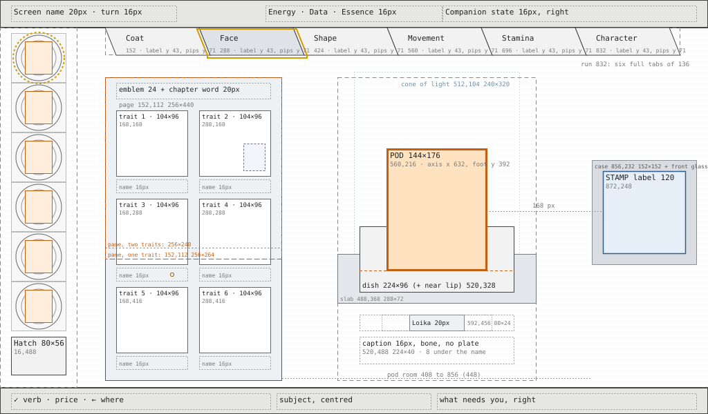
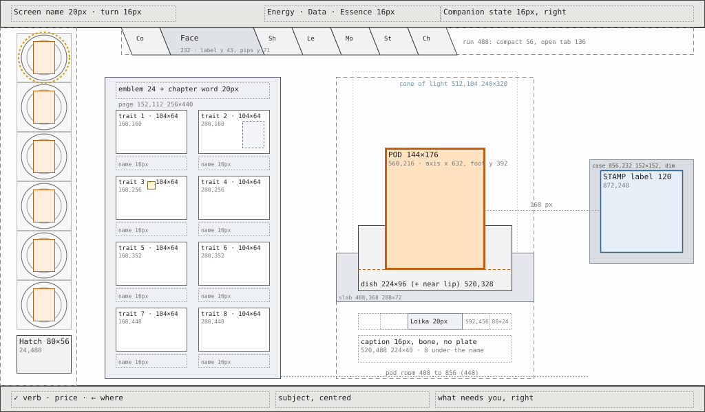

# Station layouts

The measured layout of every built Station screen at 1024×600, 1×, so the builder places each thing from a number rather than a guess. Rules and looks are in the [style guide](README.md) and [Station screens](station-screens.md); this file adds the measurements. Each layout starts from its decided concept plate and is corrected for the owner's rulings of 2026-10-08:

- The Station uses its full 1024×600 at 1× grain, with Inter type.
- The stamp never takes the spotlight. It is a small label of about 120 px, placed away from the focal point; the specimen (pod, founder, bud, mibi) is the spotlight.
- The rail shows as many chapters as the species has.
- No digits where a picture can do the job. Prices on the bottom line are the exception.
- Labels are one word. Never a text page. Never childish.

**Status.** UI specification, written for the builder. Where it departs from a concept plate or from the current build, it says so and why. The wireframes in [`station-layouts/`](station-layouts/) are measured boxes and labels only, with no art: one per screen, drawn from the same numbers as the tables below.

**How to read a rectangle.** `(x, y, w, h)` in screen pixels, with the origin at the screen's top left. Every region sits on the 8 px grid. Hairlines are 1 px and are the only exception.

Pods comes first because it sets the pattern the other screens follow.

---

## Shared frame and rules

### Grid, margins and spacing

- **Grid 8 px.** Every region's x, y, w and h is a multiple of 8. The frame's own edges are the only exceptions: the stage runs from y 40 to 562 (522 px) and the bottom line is 38 px.
- **Margins.** 16 px from the left and right screen edges to any text or region. Content inside the stage starts at y 48 and ends at y 552.
- **Gaps.** 8 px between related things (a tab and its neighbour, a picture and its words). 16 px between groups. At least 8 px between regions; no region touches another.
- **Text lines.** 16 px type on a 20 px line pitch, 20 px type on 28, 28 px type on 36. Each line's cap top sits on the grid.
- **Never clipped.** Labels and names always fit their boxes. If a word does not fit, the layout's compact rule takes over (the rail's, for example). Only the bottom line's subject may end in "…".

### The frame

| Region | Rectangle | Holds |
| --- | --- | --- |
| Top bar | 0, 0, 1024, 40 | Chrome ground, with a 1 px rule on its bottom edge |
| Screen name and turn | 16, 8, 240, 24 | Screen name in Inter 20 px medium, then the turn ("T5") in 16 px |
| Materials | 384, 8, 256, 24 | Energy, Data and Essence, centred on x 512: each a 16 px icon, a 4 px gap, then 16 px tabular figures, with 24 px between counters. A tick flashes for 240 ms behind the figure |
| Companion state | 640, 8, 368, 24 | Right-aligned to x 1008, 16 px, with its 8 px lamp to the left of the words |
| Stage | 0, 40, 1024, 522 | The screen's own layout |
| Bottom line | 0, 562, 1024, 38 | Chrome ground, with a 1 px rule on its top edge |
| Action | 16, 570, 376, 24 | `✓ verb · price · ← where`, 16 px. The ✓ cap is drawn only when ✓ does something |
| Subject | 400, 570, 224, 24 | Centred on x 512, 16 px, mist. May end in "…" |
| What needs you | 632, 570, 376, 24 | Right-aligned to x 1008, 16 px, amber |
| Separators | x 396 and x 628, y 571 to 591 | 1 px hairlines |
| Message plate | centred on x 512, at most 640 wide, 16 + 20 px per line tall | 16 px type, shown for 4 s. Its bottom edge sits at y 550. If that would cover the screen's focal box, its top edge sits at y 112 instead |

### Type

Three sizes and no others: **28 px** semibold for names (a pod, a mibi, a species), **20 px** medium for titles (the screen name, a page heading, a ribbon), **16 px** regular for everything else (readouts, labels, trait lines, the bottom line). Use tabular figures. Never set type at 13 px. Never bake text into art. Text on art gets a 1 px dark shadow.

### The stamp label (one rule, every screen that shows it)

- **The label is 120×120**, a bone-coloured plate with a 1 px slate edge, and the stamp is centred on it.
- **The stamp is drawn on whole-pixel cells.** For a stamp of N modules (N + 2 with its quiet margin), the cell is the largest whole number of pixels that keeps the stamp within 104 px: `cell = floor(104 / (N + 2))`, never less than 2. For example, 21 modules give 23 × 4 = 92 px and 49 modules give 51 × 2 = 102 px.
- **It is never the focal point.** It sits at the edge of the composition, at least 96 px from the focal box. It never has its own beam, glow, frame or pane, and it is never larger than 120.
- **It reads fifth or later** on every screen.

### The chapter rail (Pods, Create, Incubator)

The rail is the same object on all three bench screens. It hangs from the top bar at the same height on each and moves only sideways.

(*corrected by the UI designer, 2026-10-08, after the art director's second verdict on the Pods masters*, as the plate draws it: the tabs hang from the top bar and touch along their slants. *Was:* plates 56 tall at y 48 with 8 px gaps; 112×56 on a 120 px pitch for up to seven chapters (7 × 112 + 6 × 8 = 832, tab i at x0 + 120i); 96×56 on a 104 pitch, centred, for eight; compact 56×56 with the focused tab widened to 112 for nine to twelve (816 px for twelve); inside a tab the emblem centred at the top (tab.x + 44, 52), the word on the line y 76 to 92 and the pips at y 96 to 102 on a 10 px pitch; the rail at x 96 on Create and Incubator, sliding 80 px left from Pods.)

- **Where it hangs.** Every tab's top edge is the top bar's bottom rule, y 40, and its bottom edge is y 80: tabs are 40 tall. The rail is the one region that meets the top bar; the stage's 48 px start does not apply to it. Its region is (x0, 40, 832, 40).
- **The slant.** A tab is a parallelogram whose two sides lean the same way, 16 px over its 40 px height: the bottom edge sits 16 px right of the top edge, as on the plate. A tab of width w (the width of its top edge, and of every row of it) at x has the box (x, 40, w + 16, 40); its sides are the lines x + 16 (y − 40) / 40 and x + w + 16 (y − 40) / 40.
- **Touching.** Each tab starts where the one before ends: tab i + 1's top left corner is tab i's top right corner, so neighbours share one slant, drawn once as a 1 px hairline. There are no gaps. The pitch is the width, and a run of tabs is the sum of their widths plus 16.
- **Two tab forms.**
  - **Full tab, w 136:** the emblem 24×24, 8 px, then the chapter's one word in 16 px, with the pips centred under the word. The block (24 + 8 + the word, at most 112) is centred on the tab's middle at mid height, x + 76. The emblem sits at y 48 to 72, the word on the line y 44 to 64, the pips at y 68 to 74. The longest word, "Movement" (80 px), clears both slants by 7 px.
  - **Compact tab, w 56:** the emblem 24×24 at y 44 to 68 over the pips at y 72 to 78, each centred on the tab's slanted middle at its own height (the emblem's centre at x + 34, the pips' at x + 42).
- **Trait pips.** One 6×6 pip per trait on an 8 px pitch, so six traits take 46 px (was a 10 px pitch, 56 px; at 10 they did not fit the compact tab).
- **By chapter count.**
  - **One to six chapters:** full tabs on a 136 px pitch; the run is 136n + 16, and six chapters fill the 832 exactly. Tab i is at x0 + 136i.
  - **Seven to twelve chapters:** compact tabs on a 56 px pitch, with the open chapter's tab full (136), so the tabs after it sit 80 px further on. The run is 56 (n − 1) + 152: 488 for seven, 544 for eight, 768 for twelve. The open chapter's word shows on its tab and on the page heading; the other tabs show their emblem and pips. Seven and eight chapters (S03, S07, S09, S15 and S16 today) are compact because a full tab with its emblem and the longest word needs about 130 px, and seven of them do not fit 832. The open chapter is the focused tab while the ring is on the rail, and otherwise the chapter on the page.
  - **More than twelve** comes back to the UI designer.
- **Where the run sits.** On Pods it starts at x 176, to the right of the list. On Create and Incubator it is centred on x 512, at x = 512 − run / 2 rounded down to the 8 px grid (96 for six chapters, 264 for seven, 240 for eight). Moving from Pods to Create, the rail slides from x 176 to its centred x in 300 ms, eased.
- **What Create and Incubator inherit:** all of the above (the hanging at y 40, the 40 px height, the 16 px slant, the touching tabs, the two forms and their widths, the count rule, the 8 px pip pitch, the slanted focus ring and no lift), centred as stated. Their own pip marks (changed, clash, the focused trait) sit on the 8 px pitch. Their regions below the rail start at y 104 or lower and do not move.
- **Never** a second row, a scroll, a "more" arrow or a clipped word.
- **One word per tab,** with one decided exception: the "Legs & tail" tab shows "Legs & tail" (owner, 2026-10-08); at 16 px Inter (78 px) it fits the 136 px full tab (was the 112 px tab).
- **No status words or prices on a tab.** The build's "read", "cleared", "misty" and "1 ◆" go: the tab's fill and pips show the state, and the price is on the bottom line.

| Tab state | How it is drawn (shape first, colour second) |
| --- | --- |
| Unread | 1 px hairline outline, cool frost fill (`frostS`, one step below the frost of the page so the pod stays the brightest thing; corrected by the UI designer against the build, 2026-10-08, was `frostD`), hollow pips |
| Read | Solid deep-teal fill, 1 px lit rim, filled pips |
| Glint | A four-point star, 12×12, hanging 2 px under the tab's bottom edge, centred on it: (tab.x + 16 + w / 2 − 6, 82) (*corrected by the UI designer, 2026-10-08, after the art director's second verdict on the Pods masters*: was at the tab's top right (tab.x + 92, tab.y + 4); inside a 40 px tab the star met the word or the emblem) |
| Sealed | The tab drawn shut (horizontal slats), an 8×4 notch cut into its bottom edge, no pips; its word in `mist`, so it still reads on the slats (corrected by the UI designer against the build, 2026-10-08) |
| Cleared while growing (Incubator) | Unread turns to read one tab at a time, the pips filling left to right across the bud's minutes |
| Focused | The cream focus ring in its tab shape, following the slants (States shared by every screen, Focus ring). A hanging tab does not lift: there is no room above it (*corrected by the UI designer, 2026-10-08, after the art director's second verdict on the Pods masters*: was the 2 px chrome lift; *corrected by the UI designer against the build, 2026-10-08: was 4 px; at 4 the ring's top met the top bar's rule at y 40*) |
| Trait states on Create | Filled pip: read. Amber dot in the pip: changed. ✕ in place of the pip: clashes. A cream ring round the pip: the focused trait |

### States shared by every screen

- **Focus ring.**
  - One warm cream ring per screen, 2 px wide, 4 px outside its target, with a 6 px corner radius.
  - On a creature it is an ellipse on the ground under its feet instead: the box width plus 16, by 24 px tall.
  - **On a rail tab it follows the tab** (*corrected by the UI designer, 2026-10-08, after the art director's second verdict on the Pods masters*): the tab's two slant lines moved 4 px outward, x − 4 + 16 (y − 40) / 40 and x + w + 4 + 16 (y − 40) / 40, from y 42 to y 84, closed by a top run at y 42 (just under the top bar's rule) and a bottom run at y 84. The ring is 2 px and cream, its bottom corners rounded 6 and its top corners square against the top bar. It crosses 4 px onto each neighbouring tab. Its box is (x − 4, 42, w + 24, 42).
  - The focused thing lifts: chrome 2 px, a creature 4 px, over 200 ms. A hanging rail tab does not lift.
  - Never a list cursor, a side bar or a second ring.
  - A focus with nothing to confirm still draws the ring. The bottom line then has no ✓ cap.
- **Dimmed ✓.** When the player cannot pay, the ✓ cap and verb show in mist, and the price names what is short. The press is refused with a message plate. Nothing is spent.
- **Glint.** The same four-point star, 12×12, everywhere: on the list ring's arc, on the rail tab and above the Home rack's well. It twinkles at 2 Hz, but a still frame still shows the star.
- **Clash** (Create): a 2 px red ring around the clashing roll picture and a 12×12 ✕ at its top right; the trait's pip becomes a ✕; the trait line turns red and says "Clash". The ✓ cap is withheld.
- **Waiting lamp:** a 12×12 cool lamp on a mibi whose painting has not landed. The words "its painting is on its way" appear only on the bottom line, never in the living window.
- **No words in a living window.** The vivarium, the Habitat window, the specimen chamber and the dome carry no text. The only exception is an event ribbon, which shows for a moment (an arrival, a hatch, a first meeting).

### Never upscaled

- Every drawn thing, whether a master or a placeholder, is rendered at the pixel size listed for it. It is never drawn small and enlarged.
- A smaller size may be rendered or downsampled from a larger one.
- A close-up is rendered by zooming the renderer's camera to the part, not by cropping a 300×310 render and enlarging the crop.
- Today's trait pictures crop and enlarge with nearest-neighbour scaling (`traitPic` with `scalePB`). They must be rendered at their size instead.

---

## Pods: list and Read

Concept plate: `art/concept-station/pods-v2/placed/PV-D-r3-a4-stamped-1024x600.png`. Wireframe: [02-pods-read.svg](station-layouts/02-pods-read.svg).

*Pods, Read, in the page's Picture state. Wireframe, layout only, measured: the wells at the far left, the open page left of centre with the shown trait large, the pod on its frosted dish under the cone of light, its name and origin under it, the stamp label at the right, a six-chapter rail of full tabs hanging from the top bar.*

*Pods, Read, in the page's Grid state (four traits, the ring on a cell), with a seven-chapter rail in its compact form (the open chapter's tab full). Wireframe: [02-pods-read-grid.svg](station-layouts/02-pods-read-grid.svg). Layout only, measured.*

**Laid out the concept's way round** (UI designer, 2026-10-08). The plate's composition holds: the wells column at the far left, the specimen window (the open page) left of centre, the pod on its frosted dish in the middle of the bench under the cone of light, the stamp at the right, the rail along the top, the name and origin under the pod. The earlier swap, with the page at the right and the stamp under the pod, was this spec's own and is withdrawn. Every rectangle it moved is marked below with its old value. The art director's second verdict on the Pods masters then set the dish's height, the hanging slanted rail and its ring, the origin's colour and the page's two states, each marked in place. The method's six answers follow in order (§1 to §6); §1, §2 and §6 stand with small marks, and §3, §4 and §5 are answered again for this composition.

### 1. Purpose

Pods lets the player identify a pod and read its chapters, one paid read at a time. The player leaves knowing three things: what species the pod is, what this pod's mibi would look like in each chapter read so far, and where something new is waiting (a glint). Or, by returning the pod to the wild, they have decided it is not worth keeping.

### 2. Elements

| Element | Why it is here |
| --- | --- |
| **The pod** under the cone of light, on its frosted dish (the cradle) | The subject. Identify and every read happen to it; it is the one warm thing |
| **Its name** (28 px) and **origin** (16 px, at most two lines) | Answers "what is it, and where did it come from" in two lines |
| **The chapter rail**, all of the species' chapters | Shows where the reading stands (pips, fill, glints, seals) and is the way to choose what to read next |
| **The open page**: the shown trait's picture, large, with its name and one short line; or, in its Grid state, all the chapter's traits (*corrected by the UI designer, 2026-10-08, after the art director's second verdict on the Pods masters*: was the grid alone) | The knowledge itself, as pictures of this pod's mibi, with the seed, base, sleep and joined-rings marks |
| **The list**: six wells, each with its pod, its progress ring and its place stamp, and the hatch | The other pods and their progress at a glance, without digits; the way back to the wild |
| **The stamp label** (120), at the right | The genome's fingerprint, filling as chapters are read. A record, not the subject |
| **Bottom line** | The single action and its price; the subject; what needs you |

**Cut or demoted from the build and the plate:**

- The "read", "1 ◆" and "sealed" words under the tabs go. The price moves to the bottom line and the state is drawn.
- The "2 traits read" heading readout goes.
- "and n more" goes: there is never more than six traits a chapter.
- "n sealed" under the list goes. Sealed pods wait in the bay, and Home's bay module and the bottom line say so.
- The aqua side bar on the current well goes, because it is a list cursor. The current pod's well rim is lit instead.
- The amber square on an unidentified well goes, because the sealed cap on the pod already says it.
- The plate's "identified" label plate goes: the broken seal and lit glyph say it.
- The plate's 220 px stamp panel shrinks to the 120 label, and the glass stage plate behind it (about 274 px wide) goes: the label stands on the bench at the right.

### 3. Placement

**Reading order:**

1. **The pod.** It is the only warm, bright object, on its frosted dish under the cone of light, in the middle of the open bench between the page and the stamp. Its axis is at x 712, near the screen's right third line (683); the page's centre (x 380) sits near the left one (341), so the two things the player reads first stand on the two thirds. (*corrected by the UI designer, 2026-10-08, to the concept's composition*: was x 344, on the left third line.)
2. **Its name**, directly under the dish, then its origin.
3. **The open page**, the large cool pane to the left of the pod (the plate's specimen window): from the name the eye travels left to the pictures. (*corrected by the UI designer, 2026-10-08, to the concept's composition*: was the pane to its right.)
4. **The rail** across the top: which chapter is open, and which glint.
5. **The list** at the far left edge.
6. **The stamp**, a small label at the right edge, level with the pod; **the hatch**, quiet at the foot of the list. (*corrected by the UI designer, 2026-10-08, to the concept's composition*: was both quiet at the bottom left.)
7. **The bottom line** answers "what does ✓ do".

**At the edges:** the list (left edge), the rail (top edge), the stamp (right edge, at mid height), the hatch (bottom left, inside the list). Nothing important sits in a corner by itself.

**Following the plate.** The order across the screen is the plate's: wells, page, pod, stamp. Two measures differ from the plate, and both are forced:

- **The page is 408 px wide** where the plate's window is about 248, because the plate's window holds one picture and a page holds up to six: three 120 px columns, two 8 px gaps and two 16 px insets make 408, the narrowest page there is (Compare's). So the pod's axis sits at x 712 where the plate's is at about 572.
- **The axis is fixed from both sides.** The dish starts 16 px after the page (x 600), so the axis is at least 712. The pod's box (632 to 792) ends 96 px before the stamp label (888), the stamp's rule, so the axis is at most 712.

*Withdrawn by the UI designer, 2026-10-08, for the concept's composition: the departure this section made before.* "The plate put the page to the left of the pod and the stamp in a 274 px panel at the right. With the stamp reduced to a 120 label, the right of the screen is free. The page moves there because it is the only place wide enough for up to six trait pictures with their lines (480 px). It also keeps the list beside the pod, which is what the → key from a well expects." Six pictures with their lines fit at 408 on Compare's columns, and → from a well passes over the page to the pod, because the page holds no focus target.

### 4. Art direction

- **Room:** the research bench, a modern digital lab.
- **The pod is the only warm thing.** It has a soft inner glow and is lit by a cool cone of light from above onto its frosted glass dish. The dish is drawn at its own proportion, 224×96 (*corrected by the UI designer, 2026-10-08, after the art director's second verdict on the Pods masters*: was 224×72), never squashed; the shell's foot sits in its bowl and its front lip shows below. (*corrected by the UI designer, 2026-10-08, to the concept's composition*: was a beam from above left onto a glass cradle ring, 224×40.)
- **Everything else is cool:** the deep blue-teal ground, slate and graphite chrome, the frost-blue unread page, hairline rules and status marks.
- **The page lights warm from inside only once it is read,** so knowledge is what warms the bench.
- **The stamp is a plain bone label**, small and matter-of-fact, like a specimen tag, standing on the bench at the right with no glass plate, pane or light of its own.
- **Restraint:** no title bars, no boxed buttons, no readout digits, and no ornament on the chrome.
- **Never childish:** pods and pictures at the Miniature Lives finish, frost as real frosted glass, and the four-point star small and precise rather than a cartoon sparkle.

### 5. Composition

The list column at the far left (0 to 160). The open page left of centre (176 to 584). The pod stage in the middle of the open bench (592 to 832): the pod on its dish under the cone of light, its name and origin under the dish. The stamp label at the right edge (888 to 1008), level with the pod. The rail spans the top from x 176 to 1008. (*corrected by the UI designer, 2026-10-08, to the concept's composition*: was the pod stage centre left, 168 to 520, with the pod on the left third line and the stamp label in the stage's bottom left corner, and the page filling the right, 528 to 1008.)

| Region | Rectangle | Notes |
| --- | --- | --- |
| List column | 0, 40, 160, 522 | Graphite panel. 1 px hairline at x 160, from y 48 to 552 |
| Well slot i (0–5) | 8, 48 + 72i, 144, 72 | The focus target |
| Well and its progress ring | 40, 52 + 72i, 64, 64 | Ring outer radius 31; the pod in the well is 32×40, centred. The ring carries chapters only and draws no centre fill: the pod says it is identified (*corrected by the UI designer against the build, 2026-10-08*, after the decision of 2026-10-07) |
| Place stamp | 112, 60 + 72i, 16, 16 | A picture of the place, no word |
| Hatch (return to the wild) | 24, 488, 112, 56 | Leaf mark 24×24, centred |
| Rail | 176, 40, 832, 40 | Hanging from the top bar by the rail's rule: up to six full tabs of 136 from x 176 + 136i; from seven, compact 56 with the open chapter's tab full (*corrected by the UI designer, 2026-10-08, after the art director's second verdict on the Pods masters*: was 176, 48, 832, 56, seven tabs of 112×56 at x 176 + 120i) |
| Pod stage | 592, 112, 240, 440 | Region only, no pane. Holds the cone of light, the pod, the dish, the name and the origin (*corrected by the UI designer, 2026-10-08, to the concept's composition*: was 168, 112, 352, 440) |
| Cone of light (beam) | 592, 104, 240, 320 | A cool cone from above, centred on the axis, ending in a pool on the dish at y 424 (*corrected by the UI designer, 2026-10-08, to the concept's composition*: was 224, 104, 240, 232, from above left) |
| **Pod (focal)** | 632, 208, 160, 192 | Bottom-centred on (712, 400): the axis x 712, the foot line y 400. Sized by size class: large 160×192 at (632, 208), medium 136×168 at (644, 232), small 112×144 at (656, 256); the medium box's x sits 4 px off the grid, as it did before (*corrected by the UI designer, 2026-10-08, to the concept's composition*: was 264, 120, bottom-centred on (344, 312)) |
| Cradle (the frosted dish) | 600, 328, 224, 96 | Frosted glass dish at its own proportion, never squashed, in two layers on the same rectangle: the dish under the pod and its near lip over the pod's foot. It grows upward from the pod's foot line: its front lip ends 24 px below the foot (y 424), and the bowl rises 72 px round the shell's foot. 16 px clear of the name below. Nothing else moves (*corrected by the UI designer, 2026-10-08, after the art director's second verdict on the Pods masters*: was 600, 352, 224, 72; *corrected by the UI designer, 2026-10-08, to the concept's composition*: before that 232, 296, 224, 40, a glass ring) |
| Name | 600, 440, 224, 32 | 28 px, centred on x 712, the dish's width. "Unknown pod" before Identify (188 px, the longest; species names run to about 100). No digits (*corrected by the UI designer, 2026-10-08, to the concept's composition*: was 184, 344, 320, 32, centred on x 344) |
| Origin | 600, 480, 224, 40 | 16 px, bone (cream), at most two lines (*corrected by the UI designer, 2026-10-08, after the art director's second verdict on the Pods masters*: was mist, the faint grey that did not read on the bench), centred on x 712. Every place-and-how line of every species wraps to two lines at 224 (the longest is 347 px on one line) (*corrected by the UI designer, 2026-10-08, to the concept's composition*: was 184, 384, 320, 40). The place and how it was found ("rock field · a Tuikis felt safe"); no digits, never an expedition number (corrected by the UI designer against the build, 2026-10-08) |
| **Stamp label** | 888, 248, 120, 120 | At the right edge, 16 px in, level with the large pod's box (the label's centre at y 308, the box's at 304). 96 px from the focal box (792 to 888). Appears at Identify with every chapter as hairlines (*corrected by the UI designer, 2026-10-08, to the concept's composition*: was 176, 432, 120, 120, below the pod's box) |
| Open page | 176, 112, 408, 440 | Deep pane, 1 px slate edge. The same rectangle as Compare's left page (*corrected by the UI designer, 2026-10-08, to the concept's composition*: was 528, 112, 480, 440) |
| Page heading | 192, 120, 376, 24 | Emblem 24×24, then the chapter's word in 20 px. At the right, in the Picture state, the trait marks (was nothing at the right; *corrected by the UI designer, 2026-10-08, after the art director's second verdict on the Pods masters*) (*corrected by the UI designer, 2026-10-08, to the concept's composition*: was 544, 120, 448, 24) |
| Trait cells | see the page's two states below | Pictures, then the name (16 px cream) and one line (16 px fog, at most two lines) |
| Trait marks (Picture state) | right-aligned to x 568, at y 128: one 8×8 mark per trait on a 16 px pitch, (576 − 16n, 128, 16n − 8, 8) | Which trait is shown, among how many, without digits: the shown trait's mark filled bone, the others hollow (`stone`), an unread chapter's marks in frost. In the heading's right, which was empty (*corrected by the UI designer, 2026-10-08, after the art director's second verdict on the Pods masters*) |

**The page's two states** (*corrected by the UI designer, 2026-10-08, after the art director's second verdict on the Pods masters*, after the plate's single large picture; was the grid alone).

- **Picture** (Read opens on it): the shown trait alone, large, as the plate has it. Its cell is (192, 160, 376, 384): the picture 376×312 at (192, 160), then 8 px, the name on the line (192, 480, 376, 20) and at most two lines of words (192, 500, 376, 40). The trait marks in the heading say which trait it is. A chapter opens on its first trait in the chapter's order; a trait picked in the Grid stays shown while its chapter stays open.
- **Grid**, the second picture state: all the chapter's traits at once, by the table below. A chapter of one trait has no Grid: its Picture is its grid.
- **Moving between them** (§6): ✓ on the page in Picture opens the Grid, with the ring on the shown trait's cell; ✓ on a cell opens that trait in Picture; the back key in the Grid returns to Picture on the trait last ringed. Each turn takes 200 ms. Nothing is spent.
- **Compare** shows the Grid only, on both pages.
- **Reading** wipes the frost from whichever state is showing; in Picture the shown trait's mark and the tab's pips fill with it.

**Page grid,** the Grid state, by the focused chapter's trait count. A cell is a picture, then 8 px, then the name line, then at most two lines of words. Every picture is rendered at its size. The columns are Compare's (one of 376, two of 184, three of 120, with 8 px gaps and 16 px insets); the rows are Read's, at y 160 and 360, because Read's heading carries no pod, so the pictures keep their 112 px height.

| Traits | Cells (x, y, w, h) | Picture | Was (*corrected by the UI designer, 2026-10-08, to the concept's composition*) |
| --- | --- | --- | --- |
| 1 | 192, 160, 376, 384 | 376×312 | cell at x 544, 448 wide; picture 448×312 |
| 2 | 192, 160, 184, 384 and 384, 160, 184, 384 | 184×304 | cells at x 544 and 776, 216 wide; pictures 216×304 |
| 3–4 | 192 or 384, at y 160 and 360; each 184×184 | 184×112 | cells at x 544 or 776, 216 wide; pictures 216×112 (*corrected by the UI designer against the build, 2026-10-08: was 216×120, which left the name and two lines 4 px past the cell*) |
| 5–6 | x 192, 320, 448 at y 160 and 360; each 120×184 | 120×112 | cells at x 544, 696, 848, 144 wide; pictures 144×112 |
| 7 or more | none today (the most is six, the S09 Coat) | comes back to the UI designer | |

**Marks on a picture,** all inside the picture's rectangle P:

| Mark | Rectangle | Notes |
| --- | --- | --- |
| Misty seed (shows · hides) | P.x + P.w − 48, P.y + P.h − 60, 40×52 | 32×40 on pictures under 120 tall |
| Blend (two seeds) | the seed's place, plus a second seed at P.x + 8 | Bottom left and bottom right |
| Only | 72×8 base | Centred on the picture's bottom edge |
| Asleep | P.x + P.w − 32, P.y + 8, 24×16 | Top right |
| Breed to change (two joined rings) | P.x + 8, P.y + 8, 28×16 | Top left |
| Unread | frost over the whole picture | No mark. The trait's name shows, its line stays empty |
| Sealed | slats over the whole picture, with what opens it (44×64) centred | No line |
| Differs (Compare) | a 2 px aqua edge on P itself, and a 12×12 bracket at P.x + P.w / 2 − 6, P.y + 8 | Aqua on a 1 px ink keyline, on both pages. Never the cream ring: cream is the focus's alone (corrected by the UI designer against the build, 2026-10-08) |

**Hierarchy check at 1×:**

- the pod is the largest warm area (160×192);
- the page's pictures are larger in total but cool until read;
- the stamp (120) is smaller than the pod, has no glow, and stands at the right edge, 96 px from the pod's box (*corrected by the UI designer, 2026-10-08, to the concept's composition*: was in the stage's corner).

**States.**

- **Unidentified.** No rail, no page and no stamp: only the list, the sealed pod, "Unknown pod" and its origin. `✓ Identify · 1 ⚡`.
- **Identifying.** The seal clears from the top down over 2 s and the glyph lights. "New species" shows for 6 s as a 20 px ribbon in the origin's rectangle (600, 480, 224, 40; *corrected by the UI designer, 2026-10-08, to the concept's composition*: was 184, 384, 320, 40); at 20 px it is 123 px wide. Then the origin returns. The ribbon is the read tab's cool look (deep teal, aqua rim, bone words), never a warm plate beside the pod; no message plate repeats it (corrected by the UI designer against the build, 2026-10-08).
- **Reading.** The page's frost wipes away from the top over 2 s, the tab fills, its pips fill, and the stamp's sector and the list ring's arc fill. No message plate: the pictures and the star say what is new (corrected by the UI designer against the build, 2026-10-08). On Pods a message plate shows only a refusal and the hatch's arming.
- **Read again.** A read chapter is free to look at again. The bottom line has no ✓ cap and the subject says "read".
- **Empty rack.** The empty dish under the cone of light and nothing else on the stage; the stamp label does not show. The subject is "the rack is empty"; what needs you is "dock the Companion to bring its crates home". *corrected by the UI designer against the build, 2026-10-08:* away, "dock the Companion for its crates" (six words); docked with crates in the bay, "open the bay at Home"; docked with the bay empty, "take the Companion exploring".
- **Compare.**
  - The list hides. Two pages sit at (176, 112, 408, 440) and (600, 112, 408, 440).
  - **Where the two pages go** (*set by the UI designer, 2026-10-08, with the concept's composition*). A page is never narrower than 408 (three 120 px columns, two 8 px gaps, two 16 px insets). The two pages sit left of the pod when two pages and their 16 px gap (832 px) fit between x 16 (the list hidden) and 16 px before the dish (x 584). That space is 568 px, so they do not. Compare therefore lays its pages across the page area, from the rail's x 176 to 1008: the left page exactly on Read's page, the right page over the pod stage and the stamp label, which hide with the list. Each heading carries its own pod at 32×40, so the two pods are still shown. The rule for any layout: left of the pod when (dish.x − 16) − 16 ≥ 2 × 408 + 16; otherwise across the page area, from the rail's x to 1008.
  - Each heading shows its pod at 32×40 at (16, 8) on the page and its place picture 16×16 at (56, 20).
  - The page grid is the same as Read, scaled to 408 px wide: two columns of 184 with an 8 px gap, pictures 184×104 for three or four traits; three columns of 120, pictures 120×96, for five or six.
  - *corrected by the UI designer against the build, 2026-10-08:* one trait: one cell (16, 56, 376, 376), picture 376×264; two traits: cells (16, 56, 184, 376) and (208, 56, 184, 376), pictures 184×256. The rows sit at y 56 and 248 on the page, cells 184 tall, so the heading's 40 px pod clears the first row by 8 px (the rows were Read's 48 and 248, and the pod touched the pictures).
  - Traits that differ wear the cream ring and a 12×12 bracket mark on both pages, so the difference shows without the pulse. *corrected by the UI designer against the build, 2026-10-08:* not the cream ring, which is the focus's alone; a 2 px aqua edge on the picture and the bracket at its top centre, 8 px in (Marks on a picture, "Differs").
  - The bottom line: `← Pods` | "two Loika pods" | "they differ here" when the open chapter holds a difference, "they differ in another chapter" when only another does, "no read trait differs". Never a count.
  - The rail stays.

### 6. Interactions

| Input | Where | What happens, and how it shows |
| --- | --- | --- |
| ▲ ▼ | List | Steps through the wells, then the hatch; the ring walks. Looking is free: the well's pod comes under the beam at once, its name and page replace the last |
| → | Well | Ring to the page (the picture, or the Grid's first cell); with no page (an unidentified pod), to the pod (*corrected by the UI designer, 2026-10-08, after the art director's second verdict on the Pods masters*: was to the pod, passing over the page, which held no focus target) |
| ◀ | Page | Ring to the current pod's well |
| ▶ | Page | Ring to the pod |
| ▲ | Page | Ring to the rail, on the open chapter |
| ✓ | Page, Picture state, two or more traits | `✓ All traits`: the page turns to the Grid (200 ms), the ring on the shown trait's cell. No spend. With one trait there is no ✓ cap |
| ◀ ▶ ▲ ▼ | Page, Grid state | The ring moves between the cells. Past the Grid's edge the page's own edges apply: ◀ to the well, ▶ to the pod, ▲ to the rail; ▼ does nothing |
| ✓ | A cell, Grid state | `✓ Look closer`: that trait in Picture (200 ms); its mark fills; the ring on the picture |
| back | Page, Grid state | Back to Picture, on the trait last ringed. In Picture, the back key goes Home as elsewhere |
| ← | Pod | Ring to the page; with no page, back to the pod's well (*corrected by the UI designer, 2026-10-08, after the art director's second verdict on the Pods masters*: was always to the well) |
| ▲ | Pod | Ring to the rail, on the last chapter looked at |
| ◀ ▶ | Rail | Step through chapters; the ring follows the focused tab's slant (no lift; *corrected by the UI designer, 2026-10-08, after the art director's second verdict on the Pods masters*: was a 2 px lift, before that 4) and the page shows that chapter at once, in its Picture state on the chapter's first trait (page turn 200 ms) |
| ▼ | Rail | Back to the pod |
| ✓ | Unidentified pod | `✓ Identify · 1 ⚡` (the first ever: "free"). Plays the seal clearing; input is held for the 2 s |
| ✓ | Identified pod, nothing read | `✓ Read its chapters` moves the ring to the first unread tab. No spend |
| ✓ | Pod with a read chapter | `✓ Shape a founder` opens Create |
| ✓ | Unread tab | `✓ Read Coat · 3 ◆` (half price shows as "· half" on the bottom line only). Plays the wipe; input is held for 2 s |
| ✓ | Read tab | No ✓ cap; subject "Coat · read" |
| ✓ | Sealed tab | No ✓ cap; subject "Coat · sealed". The page shows the picture of what opens it (*corrected by the UI designer against the build, 2026-10-08*: "· opens with ‹what opens it›" ran past the subject's 224 px and was cut with "…") |
| ✓ | Another well, same species | `✓ Compare · free` when a pod of the same species was under the beam. Opens Compare |
| ✓ | Another well, other species | `✓ Look at this pod`. No compare is offered |
| ✓ ✓ | Hatch | First ✓ arms: `✓ Again: return it · +1 ❀`, with a message plate saying what will happen: "Back to the ‹place›? ✓ again" (*set by the UI designer against the build, 2026-10-08*: six words or fewer for every place). The second ✓ returns the pod. Any other key disarms it. The subject is "the hatch · ‹the pod's name›" ("the hatch · Belatz pod"; *set by the UI designer against the build, 2026-10-08*: the plate says where it goes, and the longer subject was cut with "…") |
| ◀ ▶ | Compare | Step through chapters on both pages |
| ← | Compare | Closes Compare |
| ← | Anywhere else | Home |
| Can't | Short of Data or Energy | Dimmed ✓, the price shows the shortfall, and a message plate on press |
| Can't | A glint | Says "something new here" on the right of the bottom line, never what it is |
| Can't | A sealed chapter | Cannot be read; there is no ✓ cap |

### Placeholders on Pods (rendered at these sizes)

| Thing | Pixel size | Stand-in until |
| --- | --- | --- |
| Pod under the beam | 160×192, 136×168 or 112×144 by size class | The pod renderer's masters |
| Frosted dish (the cradle) and its near lip | 224×96 each, on one rectangle (*corrected by the UI designer, 2026-10-08, after the art director's second verdict on the Pods masters*: was 224×72; before that 224×40) | The bench's dish master |
| Cone of light | 240×320 (*corrected by the UI designer, 2026-10-08, to the concept's composition*: was 240×232) | The bench's light master |
| Pod in a well | 32×40 | The same |
| Progress ring | 64×64 | The pod list master |
| Chapter emblem | 24×24 (the build draws 16; redraw at 24, never enlarge) | The chapter rail master |
| Trait pictures | 376×312, 184×304, 184×112, 120×112 (*corrected by the UI designer, 2026-10-08, to the concept's composition*: was 448×312, 216×304, 216×112 (before that 216×120), 144×112); Compare 376×264, 184×256, 184×104, 120×96 | The painting's close-ups |
| Seed | 40×52 or 32×40 | The seed master |
| Place stamp | 16×16 | The place stamp set |
| Stamp | whole-pixel cells, at most 104 px, on the 120 label | The stamp's label art |

### Changes from the current build

- The stamp goes from 196 px at (172, 316) to the 120 label at (888, 248) (*corrected by the UI designer, 2026-10-08, to the concept's composition*: was to (176, 432)).
- The page moves from (612, 124, 398×426) to (176, 112, 408×440), with the grid above (*corrected by the UI designer, 2026-10-08, to the concept's composition*: was to (528, 112, 480×440)).
- The pod grows from about 85×144 to its size-class box.
- From the build of this spec's earlier layout (*corrected by the UI designer, 2026-10-08, to the concept's composition*): the pod's box moves from bottom-centred on (344, 312) to (712, 400); the cradle from (232, 296, 224, 40) to the dish (600, 328, 224, 96; *corrected by the UI designer, 2026-10-08, after the art director's second verdict on the Pods masters*: was (600, 352, 224, 72)); the beam from (224, 104, 240, 232) to (592, 104, 240, 320); the name from (184, 344, 320, 32) to (600, 440, 224, 32) and the origin and ribbon from (184, 384, 320, 40) to (600, 480, 224, 40); the stamp from (176, 432) to (888, 248); the page from (528, 112, 480, 440) to (176, 112, 408, 440) with the grid above. The list, the rail, the frame and Compare stay.
- The rail tabs grow from 54 to 56 tall. Their status words and prices are replaced by pips.
- The list's aqua bar and amber square go, and so do "n sealed" and "and n more".
- After the art director's second verdict (*corrected by the UI designer, 2026-10-08, after the art director's second verdict on the Pods masters*): the rail hangs from y 40, 40 tall, its tabs slanted and touching (was y 48, 56 tall, with gaps), and the focus ring follows a tab's slant with no lift; the dish grows to (600, 328, 224, 96); the origin turns bone; the page opens on one large picture with the grid as its second state, and the focus graph gains the page (→ from a well, ← from the pod).
- Trait pictures are rendered at their size, never enlarged from a crop.

### Confirmed against the build (UI designer, 2026-10-08)

*Superseded for the geometry (UI designer, 2026-10-08): this check was of the earlier layout (the pod on (344, 312), the page at the right, the stamp under the pod). The build moves to the rectangles above and is checked again; the list, the rail, Compare, the strings, the colours and the subject findings below stand.*

Checked a third time, with the placeholder pods placed (the code of ebfb3b8), on the twelve 1× captures of the screen layer (`prototypes/station/img/pods-*.png`, Compare with one, two, four and six traits and the empty rack among them), against this section, the wireframe and `prototypes/ui/specs/station/pods.json`, by pixel.

- **As specified, measured on the captures:** the list column and its hairline at x 160 from y 48; the six well slots, rings centred on (72, 84 + 72i), the place stamps at (112, 60 + 72i); the hatch at (24, 488, 112, 56); the rail at y 48, tabs 112×56 on the 120 pitch from x 176 for up to seven chapters, 96×56 on 104 from x 180 for eight; the focused tab lifted 2 px (top at y 46, its ring's top at y 42, clear of the top bar's rule); the unread tab in `frostS`, a sealed tab's word in `mist`; the pod's box bottom-centred on (344, 312) by size class; the name and origin rectangles, with no digits; the ribbon in the origin's rectangle in the read tab's cool look; the stamp label at (176, 432, 120, 120); the open page at (528, 112, 480, 440) on its `deep` pane with its heading at (544, 120); the grids for one, three or four, and five or six traits (448×312; 216×112 with the 32×40 seed; 144×112) at y 160 and 360; Compare's pages at (176, 112) and (600, 112), 408×440, rows at y 56 and 248 on the page, pictures 376×264, 184×256, 184×104 and 120×96; the difference as a 2 px aqua edge and the 12×12 bracket at (P.x + P.w / 2 − 6, P.y + 8) on an ink keyline, only on the traits that differ; Compare's need line from its three strings; the empty rack (the cradle and nothing else on the stage, its three need lines); the subject naming the pod and its place, no well number; the bottom line's separators at x 396 and 628.
- **The pod fills its box** (checked again on the placed placeholder sprites): the signed sprite of its class 1:1, the stem's top on the box's top row (y 120, 144 or 168), the shell's foot on its last row in the cradle's ring at y 312, the box's full width; the focused pod rides 4 px higher, the focus's lift. The 32×40 well pod is centred in its ring; the ring draws no centre disc over it (§5, the well's row; f3567d6).
- **The shared need line's counts in words** (the builder's derived rendering) **confirmed**: "a new pod waits", "three new pods wait", "two crates in the bay"; past twelve, "many". An amount beside a material icon is a price or a shortfall and stays in figures ("needs 3 ◆"), the frame's exception.
- **The hatch's arming plate** says "Back to the cave? ✓ again", as set in §6.
- **The bottom line's subject** fits its 224 px on every state, with no "…": a sealed tab's subject is "‹chapter› · sealed" and the hatch's "the hatch · ‹the pod's name›" (§6); the build sets both and its checks fail a clipped subject (f3567d6).

---

## Home

Concept plate: `art/concept-station/round3/A-r3-a1-1024x600.png`. Wireframe: [01-home.svg](station-layouts/01-home.svg).

*Home. Wireframe, layout only, measured.*

### 1. Purpose

Home is the always-on view: the collection alive, and the instrument's state. The player comes away knowing that their mibis are well and what (if anything) needs them, and can go from here to whatever does.

### 2. Elements

| Element | Why it is here |
| --- | --- |
| **The vivarium** (the living window) with the residents | The collection alive; the reason the device is on |
| **The with-you bed** | Shows where the mibi with you is: here or out with the Companion |
| **Four modules**, each one word, a lamp and its object: Bay (crates), Rack (six wells), Incubator (dome and leaves), Probe (Probe, Shield plates, the sitting slot) | The instrument's state, read by shape; an amber lamp marks the one that needs you |
| **Rest knob** | The deliberate way to rest the screen (idle) |
| **Bottom line** | What needs you, in words, at the right; what ✓ does with the current focus |

**Cut from the build:**

- The status strip's three text rows ("2 pods in the rack", "0 of 6 bays taken"): the modules show this by shape.
- The wooden bay door, the felt strip and the lamp on its stand (never a cottage).
- The words written inside the vivarium ("Dot is out with you"). The bed's Companion mark and the bottom line say this.
- The plate's module names become one word each: Bay, Rack, Incubator, Probe.
- The name label inside the window goes. The window carries no words, and the focused resident's name is the bottom line's subject.

### 3. Placement

**Reading order:**

1. **The residents**, warm, in the window's left two thirds.
2. **What needs you:** the one amber lamp in the module column, and the bottom line's right part, which repeats it in words.
3. **The modules**, read by shape, top to bottom in the order the loop runs (crates arrive, pods wait, a bud grows, the Probe is ready).
4. **The top bar's counters.**

**At the edges:** the module column at the right edge; the rest knob on the bezel's bottom rail.

### 4. Art direction

- **Rooms:** the overview (the frame and modules are industrial, plasticky hardware) holding the vivarium (cozy, alive).
- **The vivarium is the only warm light,** daylight from the top left. The modules are cool enamel and slate, evenly lit.
- **Nothing overlaps the vivarium.** No wood, felt, shelves or lamp-lit bench.
- **Residents** are the matched rich treatment, or the placeholder with its waiting lamp until their painting lands, and never enlarged tokens.

### 5. Composition

The vivarium's glass fills the left (16 to 672) in a thin bezel. The four modules stack in one 320 px column at the right with 8 px gaps. Residents walk the lower 55% of the glass.

| Region | Rectangle | Notes |
| --- | --- | --- |
| Vivarium bezel | 16, 48, 656, 504 | 8 px bezel |
| **Living window (glass)** | 24, 56, 640, 488 | Ground band from y 300 to 528, where the residents' feet go |
| **Resident, adult or elder** | 144×152 each | Rendered at size; feet within the ground band |
| Resident, juvenile | 104×112 | Reads young by proportion |
| Resident focus | ellipse, box width + 16 by 24, under the feet | The resident lifts 4 px |
| With-you bed | 520, 472, 128, 56 | The mibi with you sleeps here when docked; a 16×24 Companion mark when away |
| Waiting lamp | 12×12 at the resident's top right | Until its painting lands |
| Rest knob | 624, 544, 32, 8 | On the bezel's bottom rail. Focus target 48×24 around it |
| Module: Bay | 688, 48, 320, 120 | Word at (704, 60), 16 px; lamp 12×12 at (984, 60); door and crates 704, 84, 288, 72, with up to three crates of 80×56 on a 96 px pitch |
| Module: Rack | 688, 176, 320, 120 | Lamp at (984, 188); six wells of 40×40 at (712 + 48i, 216); pods 24×32 in them; a glint star 12×12 above its well at y 204 |
| Module: Incubator | 688, 304, 320, 120 | Lamp at (984, 316); dome 704, 328, 80, 80 with the bud's glow; leaves 800, 344, 192, 40 (8×12 each on a 12 px pitch, two rows of 16) |
| Module: Probe | 688, 432, 320, 120 | Lamp at (984, 444); Probe in its cradle 704, 456, 128, 80; Shield plates 3 × 28×12 at (848 + 36i, 496); sitting slot 952, 456, 40, 80 (an empty gilt frame when a sitting is held) |

**Arrival** (the Dock and arrival state of Home):

- The ribbon sits at 40, 72, 608, 40 inside the glass top, in 20 px.
- The report card sits at 64, 120, 560 wide and at most 320 tall, over the vivarium until the next press.
- The Bay module lifts 4 px and its door opens.
- The rest of the layout stays where it is.

### 6. Interactions

| Input | What happens, and how it shows |
| --- | --- |
| Pad | The ring moves to the nearest drawn thing that way: residents (feet ellipse), modules (rounded rectangle), rest knob. From the room, the first press picks the nearest |
| ✓ on the room (no focus) | Does what needs you: `✓ Open the bay · 2 crates`, `✓ Look at the new pod`, `✓ Open the incubator`, `✓ Meet Moss`. With nothing needed there is no ✓ cap |
| ✓ on a resident | `✓ Look at Bean` opens Habitat on Bean |
| ✓ on Bay | `✓ Open the bay · 2 crates` when docked with crates; otherwise no ✓ cap, and the subject says why ("closed while the Companion is away") |
| ✓ on Rack, Incubator or Probe | Opens Pods, the Incubator or the Probe bench |
| ✓ on the rest knob | `✓ Rest` starts idle; any press wakes |
| ← | Focus back to the room; on the room, a message plate says Home is the top view |
| During arrival | Presses are consumed; focus stays on the room |

### Placeholders on Home

| Thing | Pixel size |
| --- | --- |
| Vivarium | 640×488 |
| Residents | 144×152 adult, 104×112 juvenile |
| Crates | 80×56 |
| Pods in the rack | 24×32 |
| Dome | 80×80 |
| Leaves | 8×12 |
| Probe | 128×80 |
| Shield plates | 28×12 |
| Sitting frame | 40×80 |
| Lamps | 12×12 |

All stand-ins until the Home and bench masters.

### Changes from the current build

- The vivarium goes from (14, 50, 636×500) to the bezel and glass above.
- The bench goes from free-placed objects at (664…1010) to four modules of 320×120.
- The status strip and the lamp on its stand go. Residents go from 64 and 96 px to 104 and 144 px boxes.

---

## Create

Concept plate: `art/concept-station/create/placed/CR-C2-stamped-1024x600.png`. Wireframe: [03-create.svg](station-layouts/03-create.svg).

*Create. Wireframe, layout only, measured.*

### 1. Purpose

Create is where the player shapes a founder from a read pod and sees what it will cost. The player leaves either having grown it (paid, the stamp pressed, the bud in the chamber) or knowing exactly what they would get: which looks they changed, which chapters stay a surprise, and the price.

### 2. Elements

| Element | Why it is here |
| --- | --- |
| **The founder** in the specimen chamber, 304×312, misty where unread | The subject: what will grow |
| **The three roll pictures** for the focused trait (as the pod is, and each single copy), the chosen one ringed, with ▲▼ notches and a "changed" tag | The choice itself, as close-ups of the part, never whole founders |
| **The trait line** (16 px), with "Clash" when it clashes | One line naming the chosen look |
| **The chapter rail** with trait pips | Where the focused trait sits; what is read, changed, clashing or still a surprise, with no digits |
| **The opened pod** with its origin | Where the founder comes from |
| **The empty chamber** with the leaves it will take, drawn as hairlines | Where it goes, and how long it will grow, as a picture |
| **Stamp label** (120) and a **blank code rule** | The stamp fills with the changes; the code prints on the rule at Grow |
| **Bottom line** | `✓ Grow it · price · ← Pods`; the subject; what stays a surprise |

**Cut:**

- "◀ ▶ 3 of 3 read traits" and "changed: eye-rings": the pips show both.
- "the code appears at Grow": the blank rule shows it.
- "grows in 21 leaves": the hairline leaves show it.
- "from the pod": the opened pod shows it.
- The plate's "founder", "chamber" and "identified" label plates.
- The 185 px stamp becomes the 120 label.

### 3. Placement

**Reading order:**

1. **The founder**, centred and lowest-set, the one warm thing in its glass chamber.
2. **The roll pictures** directly above it, with the chosen one ringed.
3. **The rail**: where this trait sits and what else is changed.
4. **The pod at the left and the chamber at the right**, balancing the founder.
5. **The stamp label**, low right.
6. **The bottom line** for the total.

**At the edges:** pod (left), chamber and stamp (right), rail (top).

The left and right columns are centred on x 160 and x 864, the same 352 px either side of the founder's axis.

### 4. Art direction

- **Room:** the research bench.
- **The founder is warm**, with its own colours and a warm key light from the top left. Where a chapter is unread, it is frosted in cool pale blue-white, never a guess.
- **Everything else is cool:** the glass, the slate and the empty dome.
- **The founder is the placeholder** (decided for Create, since nothing is painted before Grow), and the roll pictures are placeholder close-ups of the part.
- **Clash marks** are red with a ✕, so they read without colour.

### 5. Composition

The rail is centred across the top. The three roll pictures sit in a row under it. The founder fills a glass chamber in the lower centre. The opened pod stands to the left and the empty dome to the right, with the stamp label under the dome.

| Region | Rectangle | Notes |
| --- | --- | --- |
| Rail | 96, 40, 832, 40 | Hanging from the top bar by the rail's rule, its run centred on x 512 (x 96 for six chapters), with trait pips (*corrected by the UI designer, 2026-10-08, after the art director's second verdict on the Pods masters*: was 96, 48, 832, 56, tabs at x 96 + 120i) |
| Roll picture 1 (as the pod is) | 304, 112, 128, 88 | Close-up of the part, rendered at size |
| Roll picture 2 | 448, 112, 128, 88 | |
| Roll picture 3 | 592, 112, 128, 88 | |
| ▲ and ▼ notches | 12×6, centred over and under the chosen picture, at y 104 and 202 | |
| "changed" tag | 72×20 at the chosen picture's bottom left (x + 4, 176) | One word, 16 px |
| Trait line | 304, 208, 416, 20 | 16 px, centred on x 512 |
| Specimen chamber | 344, 232, 336, 320 | Glass, cool |
| **Founder (focal)** | 360, 240, 304, 312 | At least 300×310, feet at y 536 |
| Opened pod | 96, 264, 128, 160 | Rendered at size |
| Pod cradle | 72, 408, 176, 32 | |
| Origin | 40, 448, 240, 40 | 16 px, at most two lines, centred on x 160 |
| Empty dome | 776, 120, 176, 208 | While a bud grows, its glow shows here and Grow is refused |
| Leaves to grow | 768, 336, 192, 40 | Hairline leaves 8×12 on a 12 px pitch, two rows of 16: one per minute it will take |
| **Stamp label** | 804, 400, 120, 120 | 140 px from the founder's box |
| Code rule | 788, 528, 152, 20 | A 1 px blank rule; at Grow the code prints here in 16 px |

**States.**

- **Nothing read:** the founder fully frosted and no roll row. The trait line says "Read a chapter first"; there is no ✓ cap.
- **Changed:** the tag and an amber pip.
- **Clash:** the ✕ marks; the ✓ cap is withheld; what needs you says "these looks clash".
- **Grow:** the stamp prints in 300 ms, the code appears on the rule, and the pod glides into the chamber in 600 ms. Then the screen changes to the Incubator.

### 6. Interactions

| Input | What happens, and how it shows |
| --- | --- |
| ◀ ▶ | Walk the read traits in ring order, skipping unread chapters; the focused trait's tab wears the slanted ring (no lift; *corrected by the UI designer, 2026-10-08, after the art director's second verdict on the Pods masters*: was "lifts") and its pip is ringed; the roll row and trait line change |
| ▲ ▼ | Roll the focused trait among its three pictures; the founder's part and the stamp's cells redraw in 200 ms; the price updates (+1 ◆ a change) |
| ▲ ▼ on a doing | No roll; the picture wears the two joined rings and the line says "breed to change" |
| ▲ ▼ where the pod carries one look | No roll; the line says "one look here"; a message plate on press |
| ✓ | `✓ Grow it · 2 ⚡ 4 ❀ 1 ◆ · ← Pods`, checked whole and then paid. Refused before paying when the incubator is busy, a bay is not free, or the shape clashes (no ✓ cap, and the reason on the right) |
| ← | Back to Pods with nothing spent |

### Placeholders on Create

| Thing | Pixel size |
| --- | --- |
| Founder | 304×312 (the decided placeholder) |
| Roll close-ups | 128×88 |
| Opened pod | 128×160 |
| Dome | 176×208 |
| Hairline leaves | 8×12 |
| Stamp | on the 120 label |

### Changes from the current build

- The rail moves from y 50, 40 tall, to hang from y 40, 40 tall, with slanted touching tabs and pips (*corrected by the UI designer, 2026-10-08, after the art director's second verdict on the Pods masters*: was to y 48, 56 tall).
- The founder moves from (362, 150) to (360, 240).
- The roll pictures grow from 88×60 to 128×88 and move above the founder.
- The pod moves from (150 centre, 130) to (96, 264).
- The stamp label moves from (824, 286) to (804, 400).
- The status texts on the right are cut, and the dome's wooden base becomes enamel.

---

## Incubator: growing and ready

Concept plates: `art/concept-station/incubator/placed/IN-D-r1-a3-stamped-1024x600.png` (growing) and `IN-C1-stamped-1024x600.png` (ready). Wireframes: [04-incubator-growing.svg](station-layouts/04-incubator-growing.svg), [05-incubator-ready.svg](station-layouts/05-incubator-ready.svg).

<table><tr><td></td><td></td></tr></table>

*Incubator, growing and ready. Wireframes, layout only, measured.*

### 1. Purpose

The Incubator is where the player watches the bud grow and opens it when it is ready. The player comes away knowing how much of the wait is left (in leaves), which chapters are still surprises, and, when it is ready, that one ✓ opens it.

### 2. Elements

| Element | Why it is here |
| --- | --- |
| **The bud** in its nest inside the dome | The subject. A glowing bean, never an embryo; when ready, the species' shape glows inside it |
| **The ring of leaves** over the dome | Time as leaves, one a minute, filling smoothly. Never digits |
| **The rail** with pips clearing | The surprises clearing one by one across the wait |
| **The plaque** on the base, one word ("growing", "ready") | The state, for across a table |
| **Stamp label** (120) and the **code** as live text | The founder's stamp, filling with the rail, and its shareable code |
| **Bottom line** | `✓ Grow now · price` while growing; `✓ Open` when ready |

**Cut:**

- "and n more leaves": a second arc holds them.
- The tabs' "read", "cleared" and "misty" words.
- "Loika founder" under the code, which is already on the bottom line.
- The wooden base.
- The plate's embryo inside the ready bud (decided: never an embryo).

### 3. Placement

**Reading order:**

1. **The bud's glow**, centred, inside the dome (about 360 across with its base).
2. **The leaves** arched over it: how many are full.
3. **The plaque word.**
4. **The rail**: which surprises remain.
5. **The stamp label** at the right, then the code under it.

The left of the stage stays empty and dark (the plate's lamp may hang there as chrome), so the dome reads alone.

### 4. Art direction

- **Room:** the research bench, with the chamber's glow as the one warm thing.
- **Pale glass, a machined enamel base,** and leaf greens for the timer.
- **The bud's warm glow** drifts toward the species' hue as it grows.
- **Ready:** the dome glows and the species' shape is visible inside the bud. Nothing steps out until the player opens it.
- **Calm:** only the glow and the filling leaf move.

### 5. Composition

The dome stands centred and large. The leaves arc over it at a radius of 200 px. The rail is centred across the top. The stamp label sits at the right, level with the bud.

| Region | Rectangle | Notes |
| --- | --- | --- |
| Rail | 96, 40, 832, 40 | Hanging from the top bar by the rail's rule, its run centred on x 512. Pips fill as chapters clear (*corrected by the UI designer, 2026-10-08, after the art director's second verdict on the Pods masters*: was 96, 48, 832, 56) |
| Leaf arc | 296, 120, 432, 224 | A half circle centred on (512, 320), radius 200. Up to 26 leaves of 24×12. From 27 to 52 leaves, a second arc at radius 176 holds the rest. More than 52 comes back to the UI designer |
| Dome glass | 360, 176, 304, 296 | |
| **Bud (focal)** | 448, 264, 128, 160 | Rendered at size. When ready, the founder's own silhouette glows inside it at 112×112, never a curled embryo |
| Nest | 408, 400, 208, 48 | |
| Base | 328, 464, 368, 80 | Enamel, not wood |
| Plaque | 448, 488, 128, 32 | One word, 16 px |
| **Stamp label** | 840, 296, 120, 120 | 176 px from the dome's edge |
| Code | 824, 424, 152, 20 | 16 px, centred on x 900 |
| Ready focus | 324, 172, 376, 376 | A steady ring around the dome, never blinking |
| Hatch ribbon | 312, 112, 400, 40 | "Fig · Tuikis · juvenile", 20 px, after Open |
| Juvenile, after Open | 360, 232, 304, 312 | Reads young by proportion inside the box |

**States.**

- **Growing:** no focus ring, read-only. The bottom line offers `✓ Grow now · price`.
- **Ready:** every leaf full, the dome glows, the plaque reads "ready", the ring is on the dome, `✓ Open`.
- **Open:** the glass lifts 220 px in 600 ms, the bud cracks, and the juvenile steps out (2.6 s). Then the meet view on Habitat.
- **Waiting for its painting:** a 12×12 cool lamp on the base at (680, 496), and "its painting is on its way" on the bottom line.
- **Empty:** the dome alone, with no rail and no stamp. The subject says "the incubator is empty"; there is no ✓ cap.

### 6. Interactions

| Input | What happens, and how it shows |
| --- | --- |
| ✓ while growing | `✓ Grow now · 1 ⚡ 2 ❀` (the price set with the economy); the leaves fill in 400 ms and the screen turns ready |
| ✓ when ready | `✓ Open`. Refused when no bay is free: dimmed ✓, subject "no bay free", nothing spent |
| Pad | Nothing to move to: the screen has one subject |
| ← | Home |
| During the hatch | Presses are consumed |

### Placeholders on the Incubator

| Thing | Pixel size |
| --- | --- |
| Dome glass | 304×296 |
| Base | 368×80 |
| Bud | 128×160 |
| Shape inside the bud | 112×112 |
| Leaves | 24×12 |
| Nest | 208×48 |

### Changes from the current build

- The bud grows from 70×70 to 128×160.
- The dome becomes glass plus a base.
- The leaves become 24×12 on an arc of radius 200, with a second arc in place of the words.
- The stamp label moves from (830, 300) to (840, 296).
- The tab status words go, the hatch's wooden ribbon becomes chrome, and the blinking ready ring becomes steady.

---

## Habitat

No decided concept plate. Derived from the guide's composition (window the left 60%, card the right 40%, strip 72 px) and the M2 build. Wireframe: [06-habitat.svg](station-layouts/06-habitat.svg).

*Habitat. Wireframe, layout only, measured.*

### 1. Purpose

Habitat shows one resident up close, so the player can spend time with it, take it along, bond with it, or let it go. The player comes away knowing who this mibi is (name, stage, species, what it remembers) and having chosen what it does next.

### 2. Elements

| Element | Why it is here |
| --- | --- |
| **The resident**, 304×312, in its corner of the vivarium | The subject |
| **Card**: name, three short lines (species and stage, ability, memory), the code, the stamp label, seven chapter plates | Who it is, without a text page |
| **Door** (Companion) | Who is out with you, and taking this one |
| **Bond** (heart) | The deliberate bond |
| **Cross** | Breeding, on an adult (M4) |
| **Wild** | Returning it to the wild, with arm-then-confirm |
| **Strip** of bays | The other residents and the free bays; the way to swap |

**Cut:**

- "its painting is on its way · placeholder" inside the window: it moves to the lamp plus the bottom line.
- "+2 ❀" and "✓ again" on the Wild module: they belong on the bottom line.
- "after a first outing" on the heart: it belongs in the bottom line's subject.
- The paper-and-wood card colours: the card is cool chrome.
- The four chapter thumbnails become seven, one per chapter.

### 3. Placement

**Reading order:**

1. **The resident**, warm, centred in the window on x 320.
2. **Its name** at the card's top left.
3. **The card's lines and plates.**
4. **The four action modules.**
5. **The strip.**
6. **The stamp label** in the card's top right corner.

**At the edges:** the strip along the foot, the card at the right edge.

### 4. Art direction

- **Room:** the vivarium, cozy and warm, the pet happy at home.
- **Warm key light** from the top left in the window. The card and modules are cool and calm.
- **The heart is red and heart-shaped,** and there are no meters or needs anywhere.

### 5. Composition

The window fills the left (16 to 624) above the strip, with the resident centred in it. At the right, the card sits on top, then the four modules: Door tall at the left, Bond and Cross side by side, Wild across under them. The strip of bays runs the full width at the foot.

| Region | Rectangle | Notes |
| --- | --- | --- |
| Window bezel | 16, 48, 608, 424 | |
| Living window | 24, 56, 592, 408 | No words |
| **Resident (focal)** | 168, 136, 304, 312 | A juvenile is drawn at its own proportions inside the same box |
| Meet ribbon | 168, 72, 304, 40 | "Meet Moss", 20 px, for the first meeting only |
| Waiting lamp | 40, 432, 16, 16 | Until the painting lands |
| Card | 640, 48, 368, 216 | Cool chrome pane |
| Name | 656, 64, 200, 32 | 28 px. A heart shows beside it when bonded |
| Lines | 656, 104, 200, 68 | Three lines of 16 px on a 24 px pitch: "Loika · adult", the ability, the memory |
| Code | 656, 180, 200, 20 | 16 px |
| **Stamp label** | 872, 64, 120, 120 | In the card's corner, 400 px from the resident |
| Chapter plates | 656 + 48i, 208, 40, 40 | Seven on a 48 px pitch. Eight (a signature chapter) shrink to 32×32 on a 40 px pitch, 312 px in all |
| Door | 640, 280, 128, 184 | Word "Companion"; the mibi with you at 48×48, or the Companion mark |
| Bond | 776, 280, 112, 88 | Heart 32×28; word "Bond" |
| Cross | 896, 280, 112, 88 | Word "Cross". Drawn in hairline and not focusable until M4, or on a juvenile |
| Wild | 776, 376, 232, 88 | Gate 64×48; word "Wild" |
| Strip | 16, 480, 992, 72 | |
| Bay tile | 24 + 136i, 484, 128, 64 | Thumbnail 48×48 at (x + 8, 492); name 16 px at (x + 64, 504). A free bay is a dashed outline with no word. With 8 bays the tiles are 112 on a 120 pitch; with 10 bays, 88 on a 96 pitch, thumbnail only, and the focused tile's name shows on the bottom line |

### 6. Interactions

| Input | What happens, and how it shows |
| --- | --- |
| Pad | Spatial: resident, Door, Bond, Cross, Wild, strip tiles. On a tile, that resident comes into the window (300 ms) |
| ✓ on the resident or a tile | `✓ Spend time with Fig`: its species moment plays for about 2 s. Rewards nothing |
| ✓ on Door | `✓ Take Fig with you · now` (docked) or `· at the next dock`. On the mibi already with you there is no ✓ cap |
| ✓ ✓ on Bond | The first ✓ arms ("Again: bond with Fig"); the second bonds. Before a first outing there is no ✓ cap, and the subject says "bond is offered after a first outing" |
| ✓ on Cross (M4) | Opens Cross |
| ✓ ✓ on Wild | `✓ Return Fig to the wild · +2 ❀`, then the second ✓. Refused, with no ✓ cap and the reason as the subject, for a bonded mibi, a juvenile or the one with you |
| ✓ on a portrait offer (M6) | `✓ Portray Fig · 1 sitting` |
| ← | Home (or the Library, if Habitat was opened from a Book) |

### Placeholders on Habitat

| Thing | Pixel size |
| --- | --- |
| Resident | 304×312 |
| Thumbnails | 48×48 |
| Door mibi | 48×48 |
| Chapter plates | 40×40 (rendered close-ups) |
| Heart | 32×28 |
| Gate | 64×48 |
| Window | 592×408 |

### Changes from the current build

- The resident grows from 290 to the 304×312 box.
- The card goes from 374×246 in paper and wood to 368×216 in chrome.
- The stamp grows from 88 to 120.
- The chapter plates go from four to every chapter.
- The modules get one word each, and their prices and words go to the bottom line.
- The strip goes from 104 to 72 px.
- The painting status leaves the window.

---

## Library spread

Concept plate: `art/concept-station/library-spread/placed/SP-P-r4-a1-pip-named-1024x600.png`. Wireframe: [07-library-spread.svg](station-layouts/07-library-spread.svg).

*Library spread. Wireframe, layout only, measured.*

### 1. Purpose

The spread shows the whole collection at a glance, as plates in a naturalist's volume. The player comes away knowing which species they have found, which they have only met, and that empty frames remain, and can open any found or met species' Book.

### 2. Elements

| Element | Why it is here |
| --- | --- |
| **Sixteen ruled frames**, eight a page, two rows of four | One place per species, all seen at once |
| **Found plate** (a tipped-in painted plate), **met study** (pencil), **unmet** (empty, no cue) | The three states of knowledge, told apart by craft rather than words |
| **Names** on caption rules, 16 px | Found in ink, met in pencil grey, unmet nothing |
| **Clan rule**, 4 px inked band over each met frame | The clan, by colour on the ink and never on unmet frames |
| **Margin life** (a leaf and seeds, a dried flower, a survey sketch, the cloth marker) | The tome's character, never over a frame |
| **Page-turn corner** | That more species wait on the next spread, without "1 of 2" |

**Cut:**

- "spread 1 of 2 · ◀ ▶ past the edge turns it".
- The diagonal hatching used for "met" in the build: a pencil study replaces it.
- The 2 px rules become 1 px.

### 3. Placement

**Reading order:**

1. **The found plates**, the only colour on the page, in the order species were found.
2. **Their names.**
3. **The met studies.**
4. **The empty frames**, as a quiet grid that promises more.
5. **The margins.**

**At the edges:** the page-turn corner at the bottom right, the cloth marker over the gutter.

### 4. Art direction

- **Room:** the Library, an old botanical-expedition volume in ink and watercolour, with aged foxed paper, worn boards and restrained ornament.
- **The plates are painted** at Pip's level of craft (Loika is the placed Pip). They are never flat cards or stickers.
- **Device type on the chrome:** Inter, never a serif. Nothing childish: no lanterns, scrollwork or ribbons.
- **No living window:** the plates' own warmth is the only warmth.

### 5. Composition

The open book fills the stage. Each page holds a 4 × 2 grid of frames with a 16 px gutter between frames, a 24 px margin to the page's edge, and the margin life in the band under the second row.

| Region | Rectangle | Notes |
| --- | --- | --- |
| Book (boards) | 8, 48, 1008, 504 | |
| Left page | 24, 56, 480, 488 | |
| Right page | 520, 56, 480, 488 | Gutter 504 to 520 |
| Frame columns | x 48, 160, 272, 384 (left page); 544, 656, 768, 880 (right page) | Each 96 wide on a 112 px pitch |
| Frame row 1 | y 112, 96×112 | Clan rule 96×4 at y 100; name 16 px in (x − 8, 232, 112, 20); caption rule 96×1 at y 256 |
| Frame row 2 | y 296, 96×112 | Clan rule at y 284; name at y 416; caption rule at y 440 |
| **Found plate (focal)** | inside the frame, 8 px mat: 80×96 | Rendered or downsampled to 80×96; never enlarged |
| Met study | 80×96 | Grey pencil line |
| Focus | frame outset 4 with the 6 px radius: 104×120 | Thin cream rounded rectangle; the frame lifts 2 px |
| Margin life | 40, 464, 448, 72 and 536, 464, 400, 72 | Never over a frame or a caption |
| Cloth marker | 500, 48, 24, 264 | Over the gutter |
| Page-turn corner | 968, 512, 24, 24 | Shown only when another spread exists |

### 6. Interactions

| Input | What happens, and how it shows |
| --- | --- |
| ◀ ▶ | Along a row, across the gutter to the other page; past the right edge with another spread, the page turns (300 ms) |
| ▲ ▼ | Between the two rows |
| ✓ on a found or met frame | `✓ Open`: the plate lifts off the page and becomes the Book's mounted plate (300 ms) |
| ✓ on an unmet frame | No ✓ cap; the subject says "an empty frame"; a message plate on press |
| ← | Home |

### Placeholders on the spread

| Thing | Pixel size | Notes |
| --- | --- | --- |
| Found plate | 80×96 | The species' placeholder; the accepted Pip for Loika, downsampled |
| Met study | 80×96 | The index pass in grey line |
| Paper | 1008×504 | Flat paper |

### Changes from the current build

- Frames move from x 60 + 120i and 560 + 120i, y 70 and 230, to the grid above.
- The rules go from 2 px to 1 px. Clan rules are added, and margin life is added as placeholders.
- The page-turn words become the corner, and the hatching becomes the study.

---

## Book

Concept plate: `art/concept-station/library-book/placed/BK-D-r2-a1-stamped-named-1024x600.png`. Wireframe: [08-library-book.svg](station-layouts/08-library-book.svg).

*Book. Wireframe, layout only, measured.*

### 1. Purpose

The Book is each species' field guide: its face, the looks found so far, its lineage and its wishes. The player comes away knowing what the species is like, which looks they have seen and which are still to find ("more?"), and who is related to whom.

### 2. Elements

| Element | Why it is here |
| --- | --- |
| **The face** (or, once a mibi has sat, the portrait): a resident at 304×312 doing its habit, mounted as a framed plate | The subject; the species alive |
| **Name label** (28 px) and **habit line** (16 px) | What it is and what it does, in two lines |
| **Place stamps** (40×40) and **the frame plate** (104×144) | Where it lives and its body plan, as pictures |
| **Chapter tabs** (all chapters) and **look plates** per trait, with a dotted "more?" slot | The looks found, as small specimen plates; never a text page |
| **Stamp label** (120) | The face mibi's stamp |
| **Family tree** panel (184×160) | Lineage, read without text |
| **Pinned wish** (184×112) | The wish, as a plate of its looks |

**Cut:**

- The stub's text lines ("Coat: plain, … · more?") become plates.
- "clan … · 4 chapters" goes: the clan shows on the spread's rule, and the chapters show as tabs.
- The plate's lanterns at the page corners go (storybook).

### 3. Placement

**Reading order:**

1. **The face** on the left page, the one warm, living thing.
2. **Its name label.**
3. **The focused chapter's look plates** on the right page.
4. **The tabs.**
5. **The stamp, the tree and the wish** at the right edge.
6. **The places and the frame plate** between the face and the gutter.

### 4. Art direction

- **Room:** the Library tome.
- **The face is warm.** The archive is cool and evenly lit on aged cream.
- **The look plates are pressed specimens** in the book's plate style.
- **Consistent case** in every label (the owner flagged a mix), Inter on the chrome, nothing childish.

### 5. Composition

The book is open across the stage. On the left page: the face's mat, with the name label and habit line under it, and the places and frame plate in a narrow column beside it. On the right page: compact tabs along the top, the trait column under them, and the stamp, tree and wish stacked at the right edge.

| Region | Rectangle | Notes |
| --- | --- | --- |
| Book, left page, right page | as the spread | |
| Mat | 40, 72, 320, 328 | |
| **Face or portrait (focal)** | 48, 80, 304, 312 | Mounted as a framed plate. A "released" mark at the plate's foot for a portrayed mibi that went back to the wild |
| Name label | 88, 408, 224, 40 | 28 px, centred on x 200 (a name is the 28 px role; the Book section's "3×" predates the Inter sizes) |
| Habit line | 48, 456, 304, 20 | 16 px, centred |
| Place stamps | 376 + 48c, 80 + 48r, 40×40 | Up to four, in two rows |
| Frame plate | 376, 192, 104, 144 | |
| Tabs | 536, 64: 40×32 each on a 48 px pitch, the focused tab 112×32 with its word | Seven take 6 × 40 + 112 + 6 × 8 = 400 px; eight take 448; more than eight comes back to the UI designer |
| Trait rows (one to four traits) | 536, 112 + 104r, 248 wide | Trait word 16 px, then look plates 56×56 on a 64 px pitch at y + 24, the last slot a dotted "more?" |
| Trait rows (five or six traits) | 536, 112 + 72r | Look plates 40×40 on a 48 px pitch |
| **Stamp label** | 832, 112, 120, 120 | |
| Family tree | 800, 248, 184, 160 | Empty ruled panel until M4 |
| Pinned wish | 800, 424, 184, 112 | Empty ruled panel until the wish exists |

### 6. Interactions

The build stub has ← only; the rest arrives with M5.

| Input | What happens, and how it shows |
| --- | --- |
| ◀ ▶ on the tabs | Turn the chapter in 200 ms; the focused tab widens to show its word |
| Pad | Spatial: face, tabs, look plates, wish |
| ✓ on the face | `✓ Visit Fig` opens Habitat on a living mibi. On a released one there is no ✓ cap |
| ✓ on a look plate | `✓ Add to the wish` (with the wish) |
| ✓ on the wish | `✓ Find a pair` (M4) |
| ✓ on "more?", the stamp or the tree | Read-only: no ✓ cap |
| ← | Spread |

### Placeholders on the Book

| Thing | Pixel size |
| --- | --- |
| Face | 304×312, in the standard look until a portrait |
| Look plates | 56×56 or 40×40 (rendered close-ups) |
| Place stamps | 40×40 |
| Frame plate | 104×144 |
| Tree and wish | Empty ruled panels |

### Changes from the current build

- The face goes from 300×330 at (30, 60) to the mat and plate above.
- The text field guide becomes tabs and plates.
- The stamp moves from 112 at (886, 406) to the 120 label at (832, 112).
- The tree and wish panels are added as empty frames.

---

## What the builder decides alone, and what comes back

**The builder may decide alone:**

- Nudges of up to 8 px inside a region, to seat art or text, keeping the region's rectangle, the grid and the reading order.
- Easing curves and durations within the motion vocabulary (200 to 400 ms for the instrument, about 2 s for reveals).
- The palette colour for a role the guide already names (cream ring, amber need, mist subject, red clash).
- Focus order inside the spatial rules, and which target the pad picks on a tie.
- Placeholder drawing inside its listed rectangle and pixel size, entered in the placeholder register.
- Message plate wording that only reports a refusal already decided, in the house style.
- Developer-only layouts that follow the stated rules (8 or 10 bays, a larger rack).

**Must come back to the UI designer:**

- Any region that moves or resizes by more than 8 px, or any new element, label, line or readout on a screen.
- The stamp growing past 120, gaining a glow, frame, beam or pane, or moving within 96 px of the focal box.
- Any word inside a living window; any digit on a no-digit surface other than prices; any label of more than one word; anything that turns a page into text.
- A species past a stated limit:
  - more than 12 chapters on the bench rail, or more than 8 in the Book;
  - more than six traits in a chapter;
  - more than 52 leaves;
  - more looks in a trait than its row holds.
- A master whose silhouette needs a different focal box, or any focal box shrinking below its listed size (300×310 where the guide asks).
- Any change to the reading order, or a second warm or bright object competing with the specimen.
- Screens not covered here: Dock and arrival beyond its Home state, the Probe bench, Idle, Cross, Sitting.
