# Station layouts

The measured layout of every built Station screen at 1024×600, 1×, so the builder places each thing from a number rather than a guess. Rules and looks are in the [style guide](README.md) and [Station screens](station-screens.md); this file adds the measurements. Each layout starts from its concept plate and keeps these rules:

- The Station uses its full 1024×600 at 1× grain, with Inter type.
- The stamp never takes the spotlight. It is a small label of about 120 px, placed away from the focal point; the specimen (pod, founder, bud, mibi) is the spotlight.
- The rail shows as many chapters as the species has.
- No digits where a picture can do the job. Prices on the bottom line are the exception.
- Labels are one word. Never a text page. Never childish.

**For the builder.** Where a layout departs from its concept plate, it says so and why. The wireframes in [`station-layouts/`](station-layouts/) are measured boxes and labels only, with no art: one per screen, drawn from the same numbers as the tables below.

**How to read a rectangle.** `(x, y, w, h)` in screen pixels, with the origin at the screen's top left. Every region sits on the 8 px grid. Hairlines are 1 px and are the only exception.

Pods comes first because it sets the pattern the other screens follow.

---

## Shared frame and rules

### Grid, margins and spacing

- **Grid 8 px.** Every region's x, y, w and h is a multiple of 8. The frame's own edges are the exceptions, and a region centred on an axis may sit 4 px off in x (Home's juvenile, the medium pod, Create's stamp label, the namer's inner column). The stage runs from y 40 to 562 (522 px) and the bottom line is 38 px.
- **Margins.** 16 px from the left and right screen edges to any text or region. Content inside the stage starts at y 48 and ends at y 552.
- **Gaps.** 8 px between related things (a tab and its neighbour, a picture and its words). 16 px between groups. At least 8 px between regions; no region touches another.
- **Text lines.** 16 px type on a 20 px line pitch, 20 px type on 28, 28 px type on 36. Each line's cap top sits on the grid.
- **Never clipped.** Labels and names always fit their boxes. If a word does not fit, the layout's compact rule takes over (the rail's, for example). Only the bottom line's subject may end in "…".

### The frame

The frame is the same on every Station screen and speaks one language, the Companion's. The Companion's HUD is marks, not words: who you are out with, what you carry, what you hold, the time; numbers only beside an icon. Its bottom line is three parts: the one action (an orange ✓ cap with the verb in orange), the context (mist, the only part that shrinks) and the way out (a grey ← cap with its word). The Station's frame keeps that grammar at its own size and adds what the Station needs most: a title that says what you are looking at.

<table><tr>
<td valign="top"> <em>The Station's top bar and bottom line at 1×, measured: zones, rules and marks. Wireframe; the words are slots.</em></td>
</tr><tr>
<td valign="top"> <em>The Companion's HUD and bottom line at 1×, cut from the kit's mock-up (<a href="../proposals/ui-kit/companion-place-storm.png">companion-place-storm.png</a>), for comparison: the same grammar the Station's frame follows.</em></td>
</tr></table>

**The top bar (40 px): where you are, what you hold, who is out, when.** Three groups, separated by 1 px `hairline` rules at x 256 and x 888 (y 8 to 32); 16 px between a rule and its neighbours.

| Zone | Rectangle | What it says | Sentence or mark |
| --- | --- | --- | --- |
| **Title: where you are** | 16, 8, 232, 24 | The room's mark, 24×24 at (16, 8), the same glyph as the device key that leads there (Home, Research, Library, Habitat), then the screen's title from x 48, 20 px medium, `bone` | One word, the title; title case. The first thing in the bar, and the only word in it |
| **What you hold** | 384, 8, 256, 24 | Energy, Data and Essence, centred on x 512: each a 16 px icon, a 4 px gap, then 16 px tabular figures in `bone`, 24 px between counters | Marks with figures; the figures are the frame's exception to "no digits" |
| **Who is out, and with whom** | 816, 8, 64, 24 | The Companion's glyph, 16×24 at (816, 8), with its 8×8 lamp at (836, 16); the mibi with you as a 24 px face on its `teal` ring at (856, 8), the same face as on the Companion's HUD (an empty ring when no mibi is with you) | Marks only, no words. Docked: the glyph solid, its lamp `mint`, the face full. Away: the glyph in outline, its lamp `stone`, the face's ring in `stone` ("dimmed" is `stone`, the same role as the lamp off): the mibi is out with it |
| **When** | 904, 8, 104, 24 | The world turn: a 16 px sun mark, 4 px, then its figure, right-aligned to x 1008 | A mark with a figure, as on the Companion ("☀ 5"), not "T5" |

The Probe's tier is not in the top bar: Home's Probe module shows it by its Shield plates (three or four), as the Companion shows it on its own Shield plates.

**The title** is first-class: the one word in the bar, at the left where reading starts, with its room's mark. It uses the title role, 20 px medium; it needs no role of its own. A 28 px title would fill the 40 px bar to 2 px of its edges and compete with the 28 px names on the stage, and the mark and the rule after it are what make it a title. It names the screen and never the chapter: on Pods the open chapter is the rail's lighter open tab and the page's heading, and a title that changed with every ◀ ▶ would stop being a landmark. So there is no "Pods · Coat".

| Screen | Room mark (the key) | Title (the slot's word) |
| --- | --- | --- |
| Home | Home | Home |
| Pods | Research | Pods |
| Create | Research | Create |
| Incubator | Research | Incubator |
| Probe bench | Research | Probe |
| Library spread | Library | Library |
| Book | Library | Library (the species' name is the page's own 28 px name) |
| Habitat | Habitat | Habitat |
| Cross | Habitat (the key it opens from; it takes Habitat's mark, `frame-room-habitat-24`) | Cross |

**The bottom line (38 px): the one action, the context, the notice, and the way back at the right edge.** As on the Companion, the way back has one place: the ← cap and its word right-aligned to x 1008. Rules at x 404 and x 620 (y 571 to 591) separate the action, the context and the notice; the notice and the way back are grouped by their 24 px gap, with no rule.

| Zone | Rectangle | What it says | Sentence or mark |
| --- | --- | --- | --- |
| **The one action** | 16, 570, 376, 24 | The ✓ key cap, 16×16 at (16, 574), `orange`, 4 px, the verb in `orange`, 16 px; 24 px; the price, a material's icon and its figures in `bone` | A verb phrase of four words or fewer; the price is marks with figures. No ✓ cap when ✓ does nothing |
| **The context** | 408, 570, 208, 24 | What the focus is on, centred on x 512, 16 px `mist` | A label of six words or fewer. The only zone that may shrink, ending in "…" |
| **The notice** | 624, 570, 280, 24 | What needs you, right-aligned to x 904, 24 px before the way back, 16 px `amber`, with the 12×12 amber lamp 4 px to its left, the same lamp as Home's modules | A sentence of six words or fewer (the longest today, "dock the Companion for its crates", is 256 px, 272 with its lamp); one notice at a time, the most pressing |
| **The way back** | 928, 570, 80, 24 | The ← key cap, 16×16 in `stone`, 4 px, then where it leads, one word in `fog`, right-aligned to x 1008 | One word ("Home", "Pods"; the longest, "Habitat", 54 px). No ← cap when ← does nothing |

**The marks are art.** Every mark in the frame is a studio master placed 1:1 at its size, never drawn by the build and never scaled:

| Mark | Slice id | Size |
| --- | --- | --- |
| Room marks (the device keys) | `frame-room-home-24`, `frame-room-research-24`, `frame-room-library-24`, `frame-room-habitat-24` | 24×24 |
| The Companion's glyph | `frame-companion-solid-16x24` (docked), `frame-companion-outline-16x24` (away) | 16×24 |
| Lamps | `frame-lamp-8-mint` (the Companion docked), `frame-lamp-8-stone` (away), `frame-lamp-12-amber` (the notice's): one painted shape per colour | 8×8, 12×12 |
| The sun (the world turn) | `frame-sun-16` | 16×16 |
| Key caps | `frame-cap-confirm-16` (✓, `orange`), `frame-cap-confirm-16-dim` (✓ when the action cannot be paid, `mist`), `frame-cap-back-16` (←, `stone`) | 16×16 discs, as on the Companion: the frame shares one language, and the Station's own keys have no set shape (`design/devices.md` gives no key shape; the device-family renders are appearance references only). If the Station's keys are square, the caps follow them. The dimmed ✓ is a state of the cap drawn as its own slice, not a tint of the orange one: the build never recolours art |
| The mibi's face | `face-<mibi>-24` (docked), `face-<mibi>-24-away` (on its `stone` ring), `face-24-empty` (no mibi with you): Station masters painted at 24, never the Companion's face scaled | 24×24, on its `teal` ring |

The material icons are the kit's 16 px icons, as on the Companion.

**Prices read icon before figure** on every Station screen, as the frame's counters do: `⚡ 2 ❀ 4`, `◆ 3`, `❀ +1`. Several materials read in the order ⚡ ❀ ◆, each icon with its figure, with no dot.

**Slots, not words.** Every word in the frame fills a slot, written to the zone's rule above: no dot-separated fragments, a verb phrase for the action, a label for the context, a sentence for the notice, the title one word.

**How states change the frame:**

- **A notice arrives:** the lamp lights `amber` and the notice slides in from the right over 200 ms; it stays until it is resolved. A newer, more pressing notice replaces it the same way.
- **A cost is shown:** the price follows the verb. When the player cannot pay, the ✓ cap and the verb turn `mist` and the price's figure turns `amber`. The press is refused with a message plate; nothing is spent.
- **Something is spent or gained:** the counter's figure ticks, with a 240 ms flash behind it.
- **The Companion returns:** its lamp turns from `stone` to `mint`, the glyph fills in and lifts 2 px for 200 ms, and the face's ring brightens; the arrival then plays on Home. When it leaves, the same in reverse.
- **The world turns:** the turn's figure ticks, with the same flash.
- **Another screen opens:** the title and its mark cross-fade in 200 ms; nothing else in the frame moves.
- **Read-only focus:** no ✓ cap; the context still names the focus.

| Region | Rectangle | Holds |
| --- | --- | --- |
| Top bar | 0, 0, 1024, 40 | Chrome ground (`bar`), with a 1 px rule on its bottom edge |
| Title | 16, 8, 232, 24 | The room's mark 24×24, then the title, 20 px medium |
| Materials | 384, 8, 256, 24 | As above |
| Companion | 816, 8, 64, 24 | The glyph, its lamp and the face |
| When (the world turn) | 904, 8, 104, 24 | The sun mark and the figure, right-aligned to x 1008 |
| Top rules | x 256 and x 888, y 8 to 32 | 1 px hairlines |
| Stage | 0, 40, 1024, 522 | The screen's own layout |
| Bottom line | 0, 562, 1024, 38 | Chrome ground, with a 1 px rule on its top edge |
| Action | 16, 570, 376, 24 | ✓ cap, verb, then the price, 24 px apart |
| Context (subject) | 408, 570, 208, 24 | Centred on x 512, 16 px, `mist`. May end in "…" |
| Notice (what needs you) | 624, 570, 280, 24 | Right-aligned to x 904, 16 px, `amber`, with its 12×12 lamp |
| Way back | 928, 570, 80, 24 | The ← cap and one word, right-aligned to x 1008 |
| Separators | x 404 and x 620, y 571 to 591 | 1 px hairlines |
| Message plate | centred on x 512, at most 640 wide, 16 + 20 px per line tall | 16 px type, shown for 4 s. Its bottom edge sits at y 550. If that would cover the screen's focal box, its top edge sits at y 112 instead |

### Type

**Tab and heading labels are capitalised word by word:** every word of a chapter's name starts with a capital, "&" stays as it is: "Coat", "Legs & Tail". The rule holds wherever a chapter's name is set (the rail, the page heading, the Book), so the build takes the names from the string table as written there; it never recases them. Sentences (the bottom line, captions, notices) stay in sentence case.

Three sizes and no others: **28 px** semibold for names (a pod, a mibi, a species), **20 px** medium for titles (the screen name, a page heading, a ribbon), **16 px** regular for everything else (readouts, labels, trait lines, the bottom line). **One exception, Pods only:** the pod's name label under the dish is 20 px medium, so it reads as the plate's quiet label, not a headline over the specimen. Use tabular figures. Never set type at 13 px. Never bake text into art. Text on art gets a 1 px dark shadow.

### The stamp label (one rule, every screen that shows it)

- **The label is 120×120**, a bone-coloured plate with a 1 px slate edge, and the stamp is centred on it.
- **The stamp is drawn on whole-pixel cells.** For a stamp of N modules (N + 2 with its quiet margin), the cell is the largest whole number of pixels that keeps the stamp within 104 px: `cell = floor(104 / (N + 2))`, never less than 2. For example, 21 modules give 23 × 4 = 92 px and 49 modules give 51 × 2 = 102 px.
- **It is never the focal point.** It sits at the edge of the composition, at least 96 px from the focal box. It never has its own beam, glow, frame or pane, and it is never larger than 120. One exception, on Pods only: the label stands inside a small, dim, unlit glass case at the right, the label plus 16 px a side; the case has no light, glow or beam of its own.
- **It reads fifth or later** on every screen.

### The chapter rail (Pods, Create, Incubator)

The rail is the same object on all three bench screens. It hangs from the top bar at the same height on each and moves only sideways.

As the plate draws it, the tabs hang from the top bar and touch along their slants.

- **Where it hangs.** Every tab's top edge is the top bar's bottom rule, y 40, and its bottom edge is y 80: tabs are 40 tall. The rail is the one region that meets the top bar; the stage's 48 px start does not apply to it. Its region is (x0, 40, 832, 40).
- **The slant.** A tab is a parallelogram whose two sides lean the same way, 16 px over its 40 px height: the bottom edge sits 16 px right of the top edge, as on the plate. A tab of width w (the width of its top edge, and of every row of it) at x has the box (x, 40, w + 16, 40); its sides are the lines x + 16 (y − 40) / 40 and x + w + 16 (y − 40) / 40.
- **Touching, on the grid.** Each tab starts where the one before ends: tab i + 1's top left corner is tab i's top right corner, so neighbours share one slant, drawn once as a 1 px hairline, and every gap is the same, none. The pitch is the width, and a run of tabs is the sum of their widths plus 16. Every tab's x is on the 8 px grid (136 and 56 are both multiples of 8), and every tab of a form is one width: full 136, compact 56, nothing between.
- **Two tab forms.**
  - **Full tab, w 136:** the label (the emblem 24×24, 8 px, then the chapter's word in 16 px, the word's line centred on the emblem) over the pips. Label and pips stack as one block 34 tall (24, 4, 6), centred in the tab's 40: the label at y 43 to 67, the pips at y 71 to 77. Each is centred on the tab's slanted middle at its own height: the label's centre at x + 68 + 16 (55 − 40) / 40 = x + 74, the pips' at x + 68 + 16 (74 − 40) / 40 = x + 82 (rounded to the pixel). The longest label, "Movement" (24 + 8 + 80 = 112), clears both slants by 7 px.
  - **Compact tab, w 56:** the emblem 24×24 over the pips, stacked and centred the same way: the emblem at y 43 to 67, its centre at x + 34; the pips at y 71 to 77, their centre at x + 42.
- **Trait pips.** One 6×6 pip per trait on an 8 px pitch, so six traits take 46 px, inside the compact tab.
- **By chapter count.**
  - **One to six chapters:** full tabs on a 136 px pitch; the run is 136n + 16, and six chapters fill the 832 exactly. Tab i is at x0 + 136i.
  - **Seven to twelve chapters:** compact tabs on a 56 px pitch, with the open chapter's tab full (136), so the tabs after it sit 80 px further on. The run is 56 (n − 1) + 152: 488 for seven, 544 for eight, 768 for twelve. The open chapter's word shows on its tab and on the page heading; the other tabs show their emblem and pips. Seven and eight chapters (S03, S07, S09, S15 and S16 today) are compact because a full tab with its emblem and the longest word needs about 130 px, and seven of them do not fit 832. The open chapter is the focused tab while the ring is on the rail, and otherwise the chapter on the page.
  - **More than twelve** is not designed yet.
- **Where the run sits.** On every bench screen (Pods' overview and chapter page, Create, Incubator) the run is centred on x 512, at x = 512 − run / 2 rounded down to the 8 px grid (96 for six chapters, 264 for seven, 240 for eight). Pods' collection shows no rail. The rail does not slide between screens.
- **What Create and Incubator inherit:** all of the above (the hanging at y 40, the 40 px height, the 16 px slant, the touching tabs, the two forms and their widths, the count rule, the 8 px pip pitch), centred as stated. On both the rail is not a focus target and shows no glint, so nothing hangs under it: their regions below the rail start at y 88, 8 px under it, and do not move. Create's own pip marks (changed, clash, the focused trait) sit on the 8 px pitch.
- **Cross inherits it too.** On the chapter view, centred as stated: a tab is read when both parents have read the chapter, and unread when either has not. Its pips are filled where the trait's forecast is drawn and hollow where it is missing. Its glint slot carries `cross-wish-lit-12x12` on a chapter holding a pinned trait a child can reach ([Cross: the splice](#cross-the-splice)).
- **Never** a second row, a scroll, a "more" arrow or a clipped word.
- **One word per tab,** with one exception: the "Legs & Tail" tab shows "Legs & Tail" (every word capitalised, [Type](#type)); at 16 px Inter (78 px) it fits the 136 px full tab.
- **No status words or prices on a tab:** no "read", "cleared", "misty" or "1 ◆". The tab's fill and pips show the state, and the price is on the bottom line.

**State colours.** One fill, one word colour and one pip colour per state, from the kit's roles, and nothing else varies: no lit rim, no teal fill, no notch colour. Every tab's edges, the shared slants, are 1 px `bevel`. The focus ring is the only highlight. Each fill is a signed piece placed 1:1 at the tab's rect (`pods.json` `derived` "tab fills").

| State | Fill | Word | Pips |
| --- | --- | --- | --- |
| Unread | `panel` | `mist` | `mist`, hollow |
| Read | `panel` | `bone` | `bone`, filled for each read trait |
| Open (the chapter on the page, read or not) | `hairline`, one step up from `panel` | `bone` | `bone`: filled for read traits, hollow for unread |
| Sealed | `panel` with horizontal slats in `bar` | `mist` | none |
| Focused | its state's fill, word and pips, unchanged | | |

The focused tab adds the focus ring in the `focus` role, in its tab shape (States shared by every screen, Focus ring), and nothing else: no lift, no lit edge, no change of fill. Read and unread share a fill and differ by word and pips; the open tab alone is one step lighter.

| Other mark | How it is drawn |
| --- | --- |
| Glint | A four-point star, 12×12, hanging 2 px under the tab's bottom edge, centred on it: (tab.x + 16 + w / 2 − 6, 82), clear of the word and the emblem |
| Cleared while growing (Incubator) | A founder's bud: unread turns to read one tab at a time, in ring order, as the wait passes (k + 1) / (u + 1); its pips fill left to right over 1000 ms (the rail word's wipe, as on Pods, with no page). A sealed chapter that is still shut never clears: its find stays a discovery. A cross bud: the chapters outside its known reads stay unread through the wait, Grow now and ready |
| Trait states on Create | Filled pip: read. A 6×6 `bone` diamond, `pip-changed-6x6`: changed, never amber, since a change is not a need. A 6×6 `red` ✕ in place of the pip: clashes. The focused trait's pip lifted 2 px, y 69 to 75: the focused thing lifts, as everywhere; never a second ring round the pip |

### States shared by every screen

- **Focus ring.**
  - One warm ring per screen, in the palette's `focus` role (warm cream, #ffe6ad; ui-kit §2), 2 px wide, 4 px outside its target, with a 6 px corner radius.
  - On a creature it is an ellipse on the ground under its feet instead: the box width plus 16, by 24 px tall.
  - **On a rail tab it follows the tab:** the tab's two slant lines moved 4 px outward, x − 4 + 16 (y − 40) / 40 and x + w + 4 + 16 (y − 40) / 40, running from y 42 to y 80 (the tab's bottom edge), then dropping straight down to a bottom run at y 84 (at x + 12 and x + w + 20), closed by a top run at y 42 (just under the top bar's rule). One rule: the slants stop at y 80, so the ring's box is exactly (x − 4, 42, w + 24, 42). The ring is 2 px and cream, its bottom corners rounded 6 and its top corners square against the top bar. It crosses 4 px onto each neighbouring tab. Its box is (x − 4, 42, w + 24, 42).
  - The focused thing lifts: chrome 2 px, a creature 4 px, over 200 ms. A hanging rail tab does not lift.
  - Never a list cursor, a side bar or a second ring.
  - A focus with nothing to confirm still draws the ring. The bottom line then has no ✓ cap.
- **Dimmed ✓.** When the player cannot pay, the ✓ cap and verb show in mist, and the price names what is short. The press is refused with a message plate. Nothing is spent.
- **Glint.** The same four-point star, 12×12, everywhere: on the collection ring's band, under the rail tab and above the Home rack's well. It twinkles at 2 Hz, but a still frame still shows the star.
- **Clash** (Create): a 2 px `red` edge on the clashing roll picture's own rectangle, never a second ring; the trait line turns `red`, starts with the inline ✕ and says "Clash"; the trait's pip becomes a ✕. The ✓ cap is withheld and the notice says why. Marks never sit on the picture.
- **Waiting lamp:** a 12×12 cool lamp on a mibi whose painting has not landed. The words "its painting is on its way" appear only on the bottom line, never in the living window.
- **No words in a living window.** The vivarium, the Habitat window, the specimen chamber and the dome carry no text. Three exceptions: an event ribbon, which shows for a moment (an arrival, a hatch, a first meeting); Habitat's name tag, and its meet ribbon in the tag's place ([Habitat](#habitat)); and on Home the focused resident's name tag, under the creature, only while it is focused (the name is contextual, on a tag inside the living window so it does not float; the chrome carries system information only).

### Never upscaled

- Every drawn thing, whether a master or a placeholder, is rendered at the pixel size listed for it. It is never drawn small and enlarged.
- A smaller size may be rendered or downsampled from a larger one.
- A close-up is rendered by zooming the renderer's camera to the part, not by cropping a 300×310 render and enlarging the crop.
- Trait pictures are rendered at their size, never cropped and enlarged with nearest-neighbour scaling.

### The vocabulary (closed)

The LVGL face draws every screen from one closed set of words, one C module a word under the face's `vocab/`, shared with the Companion and the Caddy where they are common ([lvgl-switch.md §2.2](../proposals/lvgl-switch.md), after [technical architecture §5.1](../proposals/technical-architecture.md)): frame, top bar, bottom line, message plate, focus ring, panel, stamp label, chapter rail, chapter page, list, specimen, living window, ribbon, Companion HUD, map viewport, and **leaves** (a Station word, `vocab/station`: the bud's timer, one leaf a minute, as a grid by pitch on Home's Incubator module and Create, or as two arcs by `leafArc` on the Incubator; props `{ total, full, rows }`). The set is closed: a screen that needs a new word lists it under [Not designed yet](#not-designed-yet). What a screen builds from them, bound in the face's `screens/` table:

- **Module** is a build of **panel**, not a new word: the instrument panel (`panel` fill, `hairline` edge, `bevel` top) holding one engraved word, one 12×12 lamp and its objects as sprites. Home's four modules, Habitat's five and the Probe bench's two are the modules; on Habitat a module has no lamp.
- **Living window** is the existing word: a painted inside with no words in a `metal` frame. Home's vivarium is one, as are the Habitat window, the specimen chamber and the dome.
- **Compositions, not words:** the **rest knob** (a chrome sprite on the living window's frame, with its focus target), the **with-you bed** (sprites inside the living window: the bed, then the sleeping mibi or the Companion mark) and the **report card** (a panel holding rows of type and 16 px icons). Each is used on Home alone, so none is a word. A second screen that needs one is not designed yet.
- **Compositions on Create:** the **roll** (Create: the focused trait's pictures, one or three, with the ▲ ▼ notches; it registers the focus target `roll` at the chosen picture's rectangle) and the **trait line** (Create: the text word, with a changed tag built as Home's name tag is). Both are used on Create alone. The bud's leaves are the word `leaves` above.
- **Compositions on Habitat and the Probe bench:** the **name tag** (Home's and Habitat's: a `panel` and the text, its h, px, weight, pad, round and min from each spec); the **chapter plates** (Habitat's card: a `list` with `listPitch`, each plate its signed ground `chapter-plate-{read,unread,sealed}-40x40`, then the rail's emblem 24×24 at (8, 8)); the **bay strip** (Habitat: a `list` with `listPitch` forms, each tile a `panel` rect and its thumbnail, a free bay a composed `dash` outline, 1 px `hairline`, dash 2 and 2); the **Shield plates** (the Probe bench: one sprite a place, the places a table by tier); and the **module** with its lamp rect, or null. A further screen using one of them is not designed yet.

**The derived rules (closed).** Where a spec names a rule instead of a rectangle, the face calls the C function of that name ([lvgl-switch.md §2.2 and §2.3](../proposals/lvgl-switch.md)): `railCompaction`, `slantTabs`, `pageGrid`, `platePosition`, `listPitch`, `splicePlan`, `guideColumns`, `pipGroups`, `leafArc`. Their JavaScript oracle is `ui/specs/derive.mjs` from L2.0, and `leafArc`'s from L2.4. Until then the spec tests hold them: `prototypes/ui/tests/specs.test.mjs` refuses any rule not in this list, and the JavaScript layout of today is in `ui/layout.mjs`, `ui/components/list.mjs`, `station/src/cross-layout.mjs` and `station/src/guide.mjs`. A rule not in this list is refused when the spec loads; a screen that needs one lists it under [Not designed yet](#not-designed-yet), never improvises it. `leafArc`, the ninth, places the Incubator's leaves on two arcs from the slot tables in `incubator.json` ([the leaf arcs](#the-leaf-arcs)).

### The two levels: species and mibi

Two levels, told apart on every screen that shows either, so the player never loses which one a screen is about:

| Level | Screens | Word on screen | Marked by |
| --- | --- | --- | --- |
| **The species**: the kind, filled in by every pod and mibi the player has read | The Library: the spread, the Book's face spread and its guide spread | **species**, and the species' name ("Belatz"; the plural is the frame's `species.plural`) | "every", "a typical", or the name alone: "Every look a Belatz can carry", "A typical Belatz, not one of yours", "the species" |
| **The individual**: one living thing with its own stamp | Pods (a pod), Habitat and Cross (a mibi), Create and the Incubator (the founder and the bud become a mibi) | **mibi**; **pod** before it hatches | "this" or "your": "this pod", "your Loika, adult", "found across your Belatz" |

- Never on screen: specimen, type (the type specimen is the pipeline's word), individual, critter, creature. "Specimen" stays the face's word for the spotlit thing (the `specimen` word of the vocabulary), never a label.
- The house terms hold: Companion, partner, pod, crate, bay, Shield, beacon, outpost, mibi.
- Each level has a door to the other. From one pod or mibi to its species: the figure on Pods' overview and the species word on Habitat's card open the Book's guide spread (`✓ Open the guide`, a jump). From the species to one mibi: a name in the guide's "Carried by" line (`✓ Visit Fig`, a jump to Habitat). After either jump, ← goes to the parent of the screen you are on (frame.json `navigation.jumps`).

---

## Pods: collection, pod overview, chapter page

Concept plate: `art/concept-station/pods-v2/placed/PV-D-r3-a4-stamped-1024x600.png`. Wireframes, 1×: [02a-pods-collection.png](station-layouts/02a-pods-collection.png), [02b-pods-overview.png](station-layouts/02b-pods-overview.png), [02c-pods-chapter.png](station-layouts/02c-pods-chapter.png).

Pods is three states. It opens on the **collection** (A). A pod opens on its **overview** (B). A chapter tab opens the **chapter page** (C).
- There is no well column on B or C: the collection is the one list, as in the Library.
- Beside the pod, a figure suggests the type the pod would become, never a detailed render: a halo-like figure.
- The chapter page is one state.
- The first-shown looks are saved, so the field-guide mark stands.

*A · Collection overview, 1× wireframe.*

*B · Pod overview, 1× wireframe. The figure beside the pod is drawn as a box here; it is the species' silhouette in a soft halo (§4).*

*C · Chapter page, 1× wireframe.*

### 1. Purpose

- **A, the collection:** see the whole rack at a glance and go to the pod that needs you.
- **B, the pod overview:** know one pod and choose what to do with it. What it would become, who it is, where it came from, its kin; identify it, shape a founder from it, open a chapter, compare it, or return it to the wild.
- **C, the chapter page:** read one chapter's traits, one paid read at a time.

The player leaves knowing what each pod is, how far it is read, and where something new waits; or, having returned a pod, that it was not worth keeping.

### 2. Elements

| State | Element | Why it is here |
| --- | --- | --- |
| A | **Every rack place**, in rack order; an empty place is an empty well | The whole collection at a glance |
| A | **Each pod's identity**: the sealed cap or the lit glyph, and the name label (the species, or "Unknown") | What it is |
| A | **Its origin as a place picture** | Where it came from, without words |
| A | **Its progress as the concept's ring**: one arc per chapter, filled when read, closed when every chapter is read | How far it is read, without digits |
| A | **The glint star**; **one can-grow mark**, only where the ring and the seal do not already say what it can do | Where something new waits; what it can do |
| A | **Pods waiting beyond the rack**: one quiet mark | That more are in the bay, never a number |
| B | **The pod** large on its dish and slab under the cone | The subject and the protagonist, the one warm thing |
| B | **The rail**, hanging, with no tab open | Where the reading stands; the way into a chapter |
| B | **The figure**: the species' silhouette in a soft halo | A suggestion of the type this pod would become, never the individual |
| B | **Two captions**: "this pod" under the pod's marks, "the species" under the figure | Which is the individual and which the kind, at a glance; the one place two-word labels stand |
| B | **Who it is**: the name label, then the glyph, the clan mark and the first-of-its-kind mark | Its identity |
| B | **Where it came from**: the place picture and the origin sentence | Its find |
| B | **Its kin**: same-species pods, small | The Compare targets |
| B | **The hatch** | The way back to the wild |
| B | **The stamp label**, small at the edge, in its dim case | The genome's fingerprint; a detail |
| C | **The pod**, its room shrunk to the pod and the dish | The subject stays in view |
| C | **The page**: every trait of the chapter at once | The knowledge itself, as pictures |
| All | **The bottom line** | The one action and its price; the context; the notice; the way back |

**Not drawn:** a well column on B or C; place stamps beside a list; a page beside the pod on the overview.

### 3. Placement

**Reading order.**
- **A:** the focused place (the pod that most needs the player), the glint, the rings, the labels.
- **B:** the pod; its name; the figure; where it came from; its kin; the rail; the stamp and the hatch, quiet at the right; the bottom line.
- **C:** the page's pictures; the pod; the rail; the bottom line.

**At the edges.**
- A: the waiting mark at the bottom left.
- B: the rail (top edge) and the stamp (right edge); the hatch at the foot of the information column.
- C: the rail (top edge).

**Hierarchy.** The pod is first and largest in presence, with the room and the light. The figure is second, cooler and smaller. The page is second on C. The stamp is a detail.

### 4. Art direction

- **Room:** the research bench, a modern digital lab.
- **The pod is the only warm thing,** lit by a cool cone of light onto its frosted dish (224×96, never squashed) on the thick glass slab.
- **The figure suggests the type.** It is the species' silhouette in a soft halo: two painted slices per species (mist and clear, cross-faded by the chapters read), drawn from the standard painting's silhouette. It is cooler and dimmer than the pod and never shows the individual's colours or marks, so the player never takes it for the mibi they will get. Before Identify it is an empty halo.
- **Everything else is cool:** the deep blue-teal ground, slate and graphite chrome, frost on what is unread.
- **The page lights warm from inside only once it is read.**
- **The stamp is a plain bone label** inside a small, dim, unlit glass case, its front glass bringing it below the pod's brightness.
- **Restraint, and never childish.**

### 5. Composition

**A · Collection**

| Region | Rectangle | Notes |
| --- | --- | --- |
| Place c, r (c 0–2, r 0–1) | 16 + 336c, 48 + 240r, 320, 224 | A recessed glass place on the bench `room-bench-stage-collection`: its own panel, the slice `panel-place-320x224`, one fixed master placed 1:1 at every place (all six are one size, so it is not a nine-slice), painted in the `panel` and `hairline` roles with 6 px corners; an empty place is the same panel with the idle ring; the focus target. Its focus ring is a circle 4 px outside the ring: 2 px in the `focus` role, radius 84 round the ring's centre. Every place drawn; an empty place is the empty ring |
| Ring | slice place + (8, 24, 176, 176), centred on place + (96, 112); the ring radius 80 with an 8 px band | Painted masters placed 1:1 on one 176×176 origin, as the signed gauge is, never arcs drawn by the build: `ring-collection-idle-176x176`, an empty place's ring and the base under the arcs; for a species of N chapters (1 to 8), the track `ring-arc-collection-n<N>-track-176x176` and one segment per read chapter, `ring-arc-collection-n<N>-s<i>-176x176` (i = 1 to N, in ring order, 2 px apart), each on the same origin; and when every chapter is read, the continuous band `ring-collection-closed-176x176` in place of the track and segments. There is no selected ring: the focus ring marks the focused place. The colour roles are the paint reference only: read `bone`, unread `bevel`, the band's edges `hairline`; the build draws no arc |
| Pod | 88×112, centred on the ring's centre | The collection class; the sealed cap or the lit glyph |
| Name label | place + (184, 64), hugging, 24 tall | 20 px medium on its plate, as under the pod: "Loika"; "Unknown" before Identify. Its plate is from the `plate-name` series, as under the pod: one signed picture per width, `plate-name-80x24` to `plate-name-224x24` in steps of 16, the word's width plus 2 × 12 rounded up to the step; never a nine-slice |
| Place picture | place + (184, 104, 48, 48) | The origin as a picture: `place-<place>-48x48` |
| Can-grow mark | place + (184, 168, 16, 16) | `mark-can-grow-16`. Only where the ring and the seal do not say it |
| Glint star | place + (148, 40, 12, 12) | `glint-star-12x12`, on the ring's band at its top right |
| Waiting beyond the rack | 16, 528, 24, 24 | `mark-waiting-24`. One quiet mark, never a number |

**B · Pod overview**

| Region | Rectangle | Notes |
| --- | --- | --- |
| Rail | 96, 40, 832, 40 | Hanging, centred on x 512 as on Create and Incubator; no tab open. A price shows only on the bottom line, when a tab has focus |
| Bench and cone of light | bench 0, 40, 1024, 522; the cone 136, 104, 240, 320 | The bench is painted with its cone and pool for this state's axis: `room-bench-stage-overview` at (0, 40, 1024, 522), the cone centred on x 256, the pool on the dish at (256, 424). The collection uses `room-bench-stage-collection` (0, 40, 1024, 522), with no cone |
| **Pod (focal)** | 184, 216, 144, 176 | Bottom-centred on (256, 392); medium 120×152 at (196, 240), small 104×128 at (204, 264). The foot in the bowl's dip |
| Dish and near lip | 144, 328, 224, 96 | |
| Shelf slab | 112, 368, 288, 72 | |
| Name label | centred on x 256, at y 456, hugging, 24 tall | 20 px medium; the name alone ("Loika"); "Unknown" before Identify. On its plate from the `plate-name` series: one signed picture per width, `plate-name-80x24` to `plate-name-224x24` in steps of 16, the word's width plus 2 × 12 rounded up to the step; never a nine-slice |
| Who it is: marks | glyph (200, 488, 24, 24), clan (232, 488, 24, 24), first of its kind (268, 492, 16, 16) | Marks, no words |
| **The figure** | 432, 232, 128, 160 | The species' silhouette in a soft halo, its feet on y 392, in two painted slices per species on the same 128×160 origin: `mibi-halo-<SNN>-128x160-mist` (everything unread, diffused) and `mibi-halo-<SNN>-128x160-clear` (the crisp glow figure). The build cross-fades them by the share of chapters read: the clear layer's alpha is chapters read ÷ chapters, over the mist; nothing is blurred by the build. It suggests the type; it never shows the individual's colours or marks. Before Identify, the empty halo. Once identified it is a focus target, the way to the species' guide, from L2.1, when the guide spread is built on the face; before L2.1 it is drawn but is not a target |
| "the species" | 432, 400, 128, 24 | 16 px `mist`, centred on x 496 under the figure; only once identified |
| "this pod" | 144, 520, 224, 24 | 16 px `mist`, centred on x 256 under the who-it-is marks; always |
| Where it came from | place picture 600, 120, 64, 64 (`place-<place>-64x64`, a new master painted from the same painting at 64, never scaled); sentence 680, 128, 328, 40 | The origin sentence ([Words on Pods](#words-on-pods)), "Found <where>, <what happened>.", 16 px `bone`, at most two lines; no digits |
| Kin | rings 56×56 from (600, 224) on a 64 px pitch, at most six; the 40×48 pod in each | The ring is the master `ring-kin-56x56`, placed 1:1; the pod is the 40×48 list class. Same-species pods: the Compare targets; focus targets. None drawn when the pod has no kin |
| Hatch | 600, 480, 80, 56 | Leaf mark 24×24 centred |
| Stamp case and front glass | 856, 384, 152, 152 | Small, dim, unlit; the front glass `ground` at 48 % (slice `room-stamp-case-152x152-front`) |
| **Stamp label** | 872, 400, 120, 120 | Small, at the edge; 544 px from the pod's box. Appears at Identify |
| Ribbon ("New species") | 680, 128, 328, 40 | In the origin sentence's rectangle, 6 s, the read tab's cool look |

**C · Chapter page**

| Region | Rectangle | Notes |
| --- | --- | --- |
| Rail | 96, 40, 832, 40 | The open tab lighter; the focus on the rail |
| Pod, dish, slab, cone | pod 144, 216, 144, 176; dish 104, 328, 224, 96; slab 72, 368, 288, 72; cone 96, 104, 240, 320 | The bench `room-bench-stage-chapter` at (0, 40, 1024, 522), its cone centred on x 216 and its pool at (216, 424). The pod's room shrunk to what the pod and the dish need: the axis at x 216, the foot on y 392. The name label under it; no figure, no stamp, no hatch |
| Open page | 424, 112, w, h by the trait count (the size table below); at most 584×440 | **No pane.** The page is its heading, one 1 px `hairline` rule and the grid, standing on the bench; spacing does the grouping, no container. Left-aligned: the heading and the first cell at x 448, the top at y 112, fixed as the rail steps |
| Page heading | 448, 118, w − 24, 24; the rule 448, 148, the grid's width, 1 | Emblem 24×24, then the chapter's word in 20 px `bone`, 8 px after it. Under it one 1 px `hairline` rule from the first column's left edge to the last column's right edge (12 px under the heading, 12 px over the cells). "Legs & Tail", the longest word, makes the heading 24 + 8 + 103 = 135 px; on a one-trait page that runs 7 px past the 128 px rule, which is fine with no pane to hold it |
| Trait cells | the grid below | In the chapter's order, row by row: the picture P (128×160, one flat rectangle of `ground`, no frame, no card, no word), 4 px, the name line (20 px): the one-word name in 16 px `bone`, then its glyphs (Marks after the name), the name and the glyphs centred together on the cell. A picture's content sits inside P's centred 75%, 96×120 at (16, 20), the tone as its margin |

**Page grid,** by the open chapter's trait count. Columns of 128 with **16 px gaps**, rows 208 apart (**24 px** between a name line and the next picture), the first column at x 448. Every picture 128×160 (under the pod's 144×176), rendered at its size. A sealed chapter is shut, with one 112×112 picture of the find that opens it, centred in the one-trait cell's rectangle, (456, 196, 112, 112).

**The page's size, one rule.** With no pane, the size bounds the rule and the grid, nothing is drawn at it. Columns are the count up to four, then half the count rounded up; the width is 24 + columns × 128 + (columns − 1) × 16, that is 8 + 144 × columns; the height is 232 for one row (48 + 184) and 440 for two (48 + 184 + 24 + 184). Left-aligned at x 424, so the heading and the first cell stay put as the rail steps; four columns end at x 1008, the screen's right margin, and two rows at y 552, 10 px over the bottom bar. A sealed chapter takes the one-trait size, whatever its count. `pods.json` `regions.chapter.page.sizeByCount`.

| Traits | Columns × rows | Page (w × h) | Page rectangle |
| --- | --- | --- | --- |
| 1, and sealed | 1 × 1 | 152 × 232 | 424, 112, 152, 232 |
| 2 | 2 × 1 | 296 × 232 | 424, 112, 296, 232 |
| 3 | 3 × 1 | 440 × 232 | 424, 112, 440, 232 |
| 4 | 4 × 1 | 584 × 232 | 424, 112, 584, 232 |
| 5 | 3 × 2 (3, then 2) | 440 × 440 | 424, 112, 440, 440 |
| 6 | 3 × 2 | 440 × 440 | 424, 112, 440, 440 |
| 7 | 4 × 2 (4, then 3) | 584 × 440 | 424, 112, 584, 440 |
| 8 | 4 × 2 | 584 × 440 | 424, 112, 584, 440 |

| Traits | Cells (x, y, w, h) | Picture |
| --- | --- | --- |
| 1–4 | 448, 592, 736 or 880, at y 160; each 128×184 | 128×160 |
| 5–6 | 448, 592 or 736, at y 160 and 368; each 128×184 | 128×160 |
| 7–8 | 448, 592, 736 or 880, at y 160 and 368; each 128×184 | 128×160 |
| 9 or more | none today; not designed yet | |

**The page, one state.**
- **Read chapter:** every trait's cell.
- **Unread chapter:** the same cells, each its trait's name under an empty picture: a dotted 1 px `bevel` outline round P (1 px on, 2 off), nothing inside, no glyphs; clearly empty. The build asks for no close-up of an unread trait.
- **Sealed:** shut, with the find's picture.
- **Never on the page:** digits, allele codes or genetics words, kinship, prices, status words, the stamp's code, clash marks, Compare's difference lamp, the word "stand-in".

**Marks after the name,** on the name line, never on the picture. The line is 20 px; line y = P.y + 160 + 4; the name's capitals run line y + 4 to + 15 and its baseline is line y + 16. In order after the name, 4 px apart: the kind glyph, the breed glyph, the field-guide dot; the name and its glyphs are centred together on the cell. The line may run 6 px into the 16 px gap on each side (at most 140), so two neighbouring lines keep 4 px apart. Every glyph is a master placed 1:1, art layer; the build draws none.

| Mark | Glyph (id, size) | Top | Notes |
| --- | --- | --- | --- |
| Misty seed (shows · hides) | `mark-line-seed-12x16`, 12×16 | line y + 2 (centred on the line's middle) | To paint. The seed with the hidden look's ghost inside, readable at 16 px; the full look is on the field guide, not here |
| Blend (two seeds) | `mark-line-seed-pair-20x16`, 20×16 | line y + 2 | To paint: one glyph, two seeds overlapping, never two seeds placed by the build. Fit: "Translucency" 101 + 4 + 20 = 125 ≤ 128 |
| Only | `mark-line-only-16x8`, 16×8 | line y + 8 (its foot on the baseline) | To paint: the base as a small glyph beside the word |
| Asleep | `mark-asleep-24x16`, 24×16 | line y + 2 | The signed master, 1:1. "Roundness" 84 + 4 + 24 = 112 |
| Breed to change (two joined rings) | `mark-breed-28x16`, 28×16 | line y + 2 | The signed master, 1:1, after the kind glyph. The longest line: "Efficiency" 74 + 4 + pair 20 + 4 + 28 + 4 + dot 6 = 140 |
| New to the field guide | `page-mark-new-10`, 6×6 | line y + 7 (centre on line y + 10) | Last on the line, 4 px after the glyph before it; otherwise as set: a flat `bone` dot with a 1 px lit `white` edge, no keyline. It marks the word, never the picture |
| Unread | none | | A dotted 1 px `bevel` outline round P, nothing inside, no glyph; the name shows. Stand-ins and composites follow it |
| Sealed | the whole page shut, at the one-trait size, with one picture of the find that opens it, 112×112 at (32, 84) on the page | | No names, no cells |

**Compare** keeps its own panes and grid; its trait names are left-aligned and carry no kind glyphs (lamp + "Translucency" + pair would be 141 in its 120 px cells):

| Mark | Glyph (id, size) | Top | Notes |
| --- | --- | --- | --- |
| Differs (Compare) | `frame-lamp-12-amber`, 12×12, at cell.x, **before** the name; the name at cell.x + 16 | line y + 4 (centre on line y + 10) | The signed amber lamp, 1:1, painted layer, on both pages, only on a trait read on both pods whose looks differ. Fit: 12 + 4 + "Translucency" 101 = 117 ≤ 120 |

**States.**

- **Unidentified (B):** no rail, no stamp; the figure an empty halo, the who-it-is marks and the kin frosted; the name label "Unknown"; where it came from shows. `✓ Identify   ⚡ 1`. Identify fills the sections in place.
- **Identifying:** the seal clears from the top down over 2 s and the glyph lights. "New species" shows for 6 s as a 20 px ribbon in the origin sentence's rectangle, then the sentence returns. No message plate repeats it.
- **Reading (C):** the page's frost wipes away from the top over 2 s, the tab fills, its pips fill. No message plate.
- **Read again (C):** free to look at; no ✓ cap; the context says "‹Chapter› is read".
- **Empty rack (A):** six empty places. The context is "the rack is empty"; the notice says what to do: away, "dock the Companion for its crates"; docked with crates, "open the bay at Home"; docked, bay empty, "take the Companion exploring".
- **A new crate (A):** its pods sealed in their places.
- **Compare.**
  - Entered from B, ✓ on a kin pod, on the species' first chapter. The pod's room, the figure and the stamp hide. Two pages sit at (176, 112, 408, 440) and (600, 112, 408, 440).
  - **Focus.** The rail's tabs are Compare's targets, and the ring sits on the open chapter's tab, the tab ring with the chrome lift. ◀ ▶ step the chapter on both pages at once; the ring stays on the open tab and moves with it. `pods.json` `focus.compare` is the graph: the rail group's `stepper` is ◀ ▶ ([lvgl-switch.md §2.6.1](../proposals/lvgl-switch.md#261-the-graphs-primitives-exactly)), ▲ ▼ are `none`, the fallback is `none`; `keys.compare` says what each key does.
  - **Where the two pages go.** A Compare page is never narrower than 408 (three 120 px columns, two 8 px gaps, two 16 px insets). Two pages and their 16 px gap (832 px) do not fit left of the overview's dish (x 144), so Compare lays its pages across the page area, from x 176 to 1008 (`pods.json` `regions.compareA` and `compareB`), over the pod's room, the figure and the stamp, which hide. Each heading carries its own pod at 40×48, so the two pods are still shown. The rule for any layout: left of the pod when (dish.x − 16) − 16 ≥ 2 × 408 + 16; otherwise across the page area, from x 176 to 1008.
  - Each heading shows its pod at the 40×48 list class at (12, 4) on the page, centred where the 32×40 pod was, and its place picture 16×16 at (56, 20); the pod masters exist at 40×48 only.
  - The page grid is the same as Read, scaled to 408 px wide: two columns of 184 with an 8 px gap, pictures 184×104 for three or four traits; three columns of 120, pictures 120×96, for five or six.
  - One trait: one cell (16, 56, 376, 376), picture 376×264; two traits: cells (16, 56, 184, 376) and (208, 56, 184, 376), pictures 184×256. The rows sit at y 56 and 248 on the page, cells 184 tall, so the heading's 40 px pod clears the first row by 8 px.
  - Traits that differ carry the signed amber lamp `frame-lamp-12-amber` on their name's line, before the name, on both pages (Marks after the name, Compare), so the notice "they differ here" points at something on the page: with five or six traits a page cannot be scanned for the one difference without a mark.
  - The bottom line: `← Loika` | "two Loika pods" | "they differ here" when the open chapter holds a difference, "they differ in another chapter" when only another does, "no read trait differs". Never a count.
  - The rail stays.

### 6. Interactions

| State | Input | What happens, and how it shows |
| --- | --- | --- |
| A | Pad | The ring moves between places. On opening, it lands on the pod that most needs the player: a new one, then a glinting one, then the first |
| A | ✓ | `✓ Open`: the pod's overview (B). The context and the notice describe the focused pod |
| A | ← | Home: the way back reads "← Home" |
| B | Pad | Between the pod, the tabs, the figure, the kin and the hatch: ▲ from the pod to the rail; ▶ from the pod to the figure, and on to the first kin; ▼ from the figure or the kin to the hatch; ◀ from the hatch to the pod. The ring starts on the pod, with `✓ Shape a founder`; the figure is a side trip one ▶ away. Before Identify the figure is not a target and ▶ goes from the pod to the kin. The figure's moves come from L2.1; before L2.1 ▶ goes from the pod to the first kin, or to the hatch when there is none |
| B | ✓ on the figure | `✓ Open the guide`, the context "every Loika": a jump to the Book's guide spread, where ← reads "Library" (the tree), never back to Pods |
| B | ✓ on the pod | Sealed: `✓ Identify   ⚡ 1`. Identified, read or not: `✓ Shape a founder` opens Create (nothing read: its [nothing-read state](#create)); dimmed, with the reason in the notice, when the incubator is busy or no bay is free. A chapter opens from the rail, ▲ then `✓ Open ‹Chapter›`. Identifying is enough to grow an unedited founder |
| B | ✓ on a tab | `✓ Open Coat`, with no price: opening a chapter is free. The read and its price are on the page (C), where ✓ reads, and the price is on the bottom line while the open tab has the focus there. So no price shows on a tab, and none shows for an action that costs nothing |
| B | ✓ on a kin pod | `✓ Compare` (free, so no price) |
| B | ✓ ✓ on the hatch | Return to the wild: the first ✓ arms, `✓ Again: return it   ❀ +1`, with the message plate "Back to the ‹place›? ✓ again"; the second returns the pod; any other key disarms |
| B | ← | Back to A, the ring on this pod: the way back reads "← Pods" |
| C | ◀ ▶ | Step the chapters; the page turns in 200 ms. A sealed chapter: no ✓ cap, the context "Coat is sealed" |
| C | ✓ | On an unread chapter, `✓ Read Coat   ◆ 3` (the price a group of its own, no dot), the frost wipes; input held 2 s. On a read chapter there is no ✓ cap |
| C | ← | Back to B, the ring on that tab: the way back reads the pod's name, "← Loika", because ← goes up one level to that pod. The longest name today, "Untuva", is 54 px at 16 px, inside the way back's 60 px for its word; a name that does not fit reads "← Back" |
| Compare | ◀ ▶ | Step the chapter on both pages together, in ring order, sealed chapters included. The ring stays on the open chapter's tab and moves with it. The first and the last chapter stop; never a wrap |
| Compare | ▲ ▼ | Nothing: the ring stays |
| Compare | ✓ | Nothing: Compare has no ✓ cap |
| Compare | ← | Closes Compare: back to B, the ring on the kin that opened it. The way back reads the pod's name, "← Loika", as on C |
| Home | ✓ on the Rack module | Opens the collection (A) with the ring on the pod that most needs the player (a new one, then a glinting one, then the first); ← from there goes Home. Home's rack keeps its one focus target: the collection is one press away, and six 40 px wells in a module would be targets too small to read as the way into a pod |
| All | Can't | A dimmed ✓ with the shortfall; a message plate on press. A glint says "something new waits" in the notice, never what it is |

← always goes up one level.

**The figure's edges from L2.1.** Before L2.1, `pods.json` `focus.overview` has no figure edges: ▶ from the pod goes to the first kin. From L2.1: pod ▶ figure, kin ◀ figure, figure ◀ pod, ▶ kin.first, ▲ rail.last, ▼ hatch; and the target `figure` (round, overview, when identified, `✓ Open the guide`, context "every {species}"). With L2.0's focus port the edges are ordered lists (lvgl-switch.md §2.6.1): pod ▶ [kin.first, hatch], hatch ▲ [kin.first, none], and from L2.1 pod ▶ [figure, kin.first, hatch]. The two captions, "this pod" (144, 520, 224, 24) and "the species" (432, 400, 128, 24, only once identified), are drawn with L2.0's overview, because they need no guide.

### Words on Pods

**The name** is the species name alone, set as the pod's label ("Loika"); a pod not yet identified reads "Unknown". The word "pod" is never in the label: the picture says it.

**The origin line** is one sentence with two slots.

> Found **‹where›**, **‹what happened›**.

| Slot | Fills with | Words |
| --- | --- | --- |
| ‹where› | the place the Companion was standing | "in the meadow", "at the pond edge", "on the rock field", "in the wood", "in the cave"; no place known: "out in the wild" |
| ‹what happened› | what the carrier noticed | a creature's act, "as ‹a Species› ‹did›" with did: "shook dry", "felt safe", "curled up", "ate well"; or how the pod lay: "it lay under a slab", "it lay buried", "it lay deep below"; no find recorded: the sentence ends after the place ("Found in the wood.") |

Rules:

1. The sentence breaks after the comma: the first half is line one, the second line two. Each half is at most 24 characters with its punctuation (the slot is 224 px; the build measures it).
2. No digits, no "·", no expedition number, no dot-separated fragments. Two commas never; one full stop, at the end.
3. Plain verbs in the past tense, one act per find; no adverbs of feeling, no "cute" verbs. The act is what the Companion saw, never what the species is.
4. An identified pod names its species ("as a Tuikis felt safe", "an" before a vowel: "as an Untuva ate well"); an unidentified pod says "a creature" ("as a creature felt safe"), so the origin never gives the species away.
5. A find with no creature ("it lay buried") never names a species.

Six examples:

| Pod | Line one | Line two |
| --- | --- | --- |
| Loika, meadow | Found in the meadow, | as a Loika shook dry. |
| Tuikis, rock field | Found on the rock field, | as a Tuikis felt safe. |
| Untuva, wood | Found in the wood, | as an Untuva ate well. |
| Tuikis, pond edge | Found at the pond edge, | as a Tuikis curled up. |
| Pesko, wood, under a slab | Found in the wood, | it lay under a slab. |
| Unknown, cave | Found in the cave, | it lay deep below. |

Unidentified pod, same pattern with the creature unnamed: "Found on the rock field," / "as a creature felt safe."; "Found at the pond edge," / "as a creature curled up."; "Found in the wood," / "it lay buried.".

**The bottom line,** its four zones ([The frame](#the-frame)). Each is a label or a sentence that stands alone; the separators between slots are the hairlines already there, and inside a slot a gap, never "·". The symbols stay (✓, ←, ⚡ ◆ ❀).

| Slot | Pattern | Rules | Examples |
| --- | --- | --- | --- |
| Left (action) | `✓ ‹Verb› ‹object›`, then the price as icon and number ([The frame](#the-frame)) | Two groups with a 24 px gap between them, no dot. The price shows only when there is one; "free" and "half" are not shown (a half price is the lower number) | `✓ Identify   ⚡ 1`; `✓ Read Coat   ◆ 3`; `✓ Shape a founder`; `✓ Compare`; `✓ Return to the wild   ❀ +1` |
| Centre (subject) | A short sentence on the focused thing: "‹Name› is ‹state›", at most 24 characters, no "·" | States: unread, partly read, fully read; a chapter: unread, read, sealed. May end in "…" | Unknown pod: "sealed until identified". Identified, nothing read: "Loika is unread". After a read bought: "Coat is read" on the tab, "Loika is partly read" on the pod. Hatch: "Back to the rock field". Empty: "the rack is empty" |
| Right (need) | One amber sentence of six words or fewer, only what this screen cannot show; empty when nothing waits (no text and no hairline) | No counts, no "·", no "needs 3 ◆": "needs more ⚡" | Glint on the focused tab: "something new here". Glint elsewhere on the pod: "something new waits". Nothing new: empty. Short of Energy: "needs more ⚡". Empty rack: "dock the Companion for its crates" |
| Right edge (way back) | `← ‹where›`, in its own zone (frame.json `regions.back`) | One word, from pods.json `strings.wayBack` | Collection: `← Home`. Overview: `← Pods`. Chapter page and Compare: `← Loika`; a name that does not fit: `← Back` |

### Placeholders on Pods (rendered at these sizes)

| Thing | Pixel size | Stand-in until |
| --- | --- | --- |
| Pod under the beam | 144×176, 120×152 or 104×128 by size class | The pod renderer's masters |
| Frosted dish (the cradle) and its near lip | 224×96 each, on one rectangle | The bench's dish master |
| Cone of light | 240×320 | The bench's light master |
| Kin pod (B) | 40×48, the list class; Home's rack keeps the 32×40 well pod | The same |
| Chapter emblem | 24×24, drawn at 24, never enlarged | The chapter rail master |
| Trait pictures | 128×160 on the chapter page, at every trait count; Compare 376×264, 184×256, 184×104, 120×96 | The painting's close-ups. **Re-cut rule:** the content (the creature or its part) inside the centred 75% of the picture (96×120 of 128×160), its ground keyed to the cell's `ground`; reduced from the painting, never enlarged. The S09 Head and Tail crops are re-cut to it |
| Line glyphs | `mark-line-seed-12x16`, `mark-line-seed-pair-20x16`, `mark-line-only-16x8` | **New masters for the studio**, painted at these sizes on the name line's dark ground, art layer, never scaled from the large seed: the seed with its ghost; two seeds overlapping as one glyph; the base as a small glyph. Until then, scale-downs shown as stand-ins. `mark-asleep-24x16`, `mark-breed-28x16` and `frame-lamp-12-amber` are signed and placed 1:1 |
| Compare's difference mark | `frame-lamp-12-amber`, 12×12, before the name | The existing lamp master; no new cut |
| Page pane | none on the chapter page; `page-pane-256x440` only on Compare | Not drawn: `trait-picture-frame-*`, `trait-picture-standin-*` or the word "stand-in" |
| Stamp | whole-pixel cells, at most 104 px, on the 120 label | The stamp's label art |
| Collection pod | 88×112 | The pod renderer's masters |
| The figure | 128×160, two slices per species on one origin: `mibi-halo-<SNN>-128x160-mist` and `mibi-halo-<SNN>-128x160-clear`, cross-faded by chapters read | The figure masters, from the standard painting's silhouette |
| Collection ring and arcs | the idle ring, the closed band and the arc slices (track and segments for 1 to 8 chapters), all 176×176 on one origin | The pod list master, like the signed gauge |
| Bench stage per state | `room-bench-stage-collection`, `room-bench-stage-overview`, `room-bench-stage-chapter`, each 1024×522 | The bench master |
| Kin ring, can-grow mark, waiting mark, place pictures | `ring-kin-56x56`; `mark-can-grow-16`; `mark-waiting-24`; `place-<place>-48x48` and `place-<place>-64x64` (the 64 a new master painted from the same painting at 64, never scaled) | The pod list master; the place stamp set |

---

## Home

Concept plate: `art/concept-station/round3/A-r3-a1-1024x600.png`. Wireframe: [01-home.svg](station-layouts/01-home.svg).

*Home with the ring on a resident: the sleeping mibi on the bed, the Shield plates per tier, the leaves in three rows. Wireframe, layout only, measured, 1×.*

**The L2.2 spec.** For the LVGL face ([lvgl-switch.md](../proposals/lvgl-switch.md) §3 to §4, L2.2): every drawn region names its word or composition, Home's three states (home, arrival, report), the rest knob, Home's focus as `order` and `nearestIn` data, [Dock and arrival](#dock-and-arrival) and [Idle](#idle). The numbers live in `prototypes/ui/specs/station/home.json` and, for Idle, `frame.json` `idle`. Each wireframe below has a 1× PNG beside its SVG.

<table><tr>
<td valign="top"> <em>01e. Home with the Companion away and the ring on the rest knob: the Bay shut, the cradle empty, the Companion mark on the bed, `✓ Rest`. 1×, measured.</em></td>
<td valign="top"> <em>01f. Home, Rest, Dock and Idle: what opens first, what each key does, how ← returns, and how the states follow each other. 1×.</em></td>
</tr></table>

### 1. Purpose

Home is the always-on view: the collection alive, and the instrument's state. The player comes away knowing that their mibis are well and what (if anything) needs them, and can go from here to whatever does.

### 2. Elements

| Element | Why it is here |
| --- | --- |
| **The vivarium** (the living window) with the residents | The collection alive; the reason the device is on |
| **The with-you bed** | Shows where the mibi with you is: here or out with the Companion |
| **Four modules**, each one word, a lamp and its object: Bay (crates), Rack (six wells), Incubator (dome and leaves), Probe (Probe, Shield plates, the sitting slot) | The instrument's state, read by shape; an amber lamp marks the one that needs you |
| **Name tag** (only while a resident is focused) | Which mibi this is, in context, under the creature; the chrome stays system information only |
| **Rest knob** | The deliberate way to put the Station on its living view, Idle, to stay on all day |
| **Bottom line** | What needs you, in words, at the right; what ✓ does with the current focus |

**Not drawn:**

- A status strip of text rows ("2 pods in the rack", "0 of 6 bays taken"): the modules show this by shape.
- A wooden bay door, a felt strip or a lamp on a stand (never a cottage).
- Words written inside the vivarium ("Dot is out with you"). The bed's Companion mark and the bottom line say this.
- Module names of more than one word: each is one word, Bay, Rack, Incubator, Probe.
- A free-floating name label. The focused resident's name is on the **name tag**, a small `panel` tag under it, inside the window, only while it is focused.

### 3. Placement

**Reading order:**

1. **The residents**, warm, in the window's left two thirds.
2. **What needs you:** the one amber lamp in the module column, and the bottom line's right part, which repeats it in words.
3. **The modules**, read by shape, top to bottom in the order the loop runs (crates arrive, pods wait, a bud grows, the Probe is ready).
4. **The top bar's counters.**

**At the edges:** the module column at the right edge; the rest knob on the bezel's bottom rail.

### 4. Art direction

- **Rooms:** the overview (the frame and modules are industrial, plasticky hardware) holding the vivarium (cozy, alive).
- **The vivarium is the only warm light,** the same light as Idle: day, dusk and night all keep the warm key light from the top left. At night the light is warm and low (the glow-moss and the residents' own glows), and the moon is only a cool rim. The glass's mean L* is 30 or more at night, and its mean red is at least its mean blue in every light. Home's glass and Idle always show the same light. The modules are cool enamel and slate, evenly lit.
- **Nothing overlaps the vivarium.** No wood, felt, shelves or lamp-lit bench.
- **Residents** are the matched rich treatment, or the placeholder with its waiting lamp until their painting lands, and never enlarged tokens.

**Colour roles** (palette names from [ui-kit §2](../proposals/ui-kit.md#2-the-kit); the one home is `prototypes/ui/specs/station/home.json` `colours`). The chrome is the cool instrument ramp; inside the glass is the only warm field; the warm marks on the chrome are signals only (the focus ring, the amber lamp, Confirm's orange, the orange seal tag).

| Region | Roles | Why |
| --- | --- | --- |
| Bezel (the living window's frame) | `metal` fill; lit top and left edge `enamel`, shade bottom and right `bevel`; 1 px outer edge `hairline` | Brushed metal is the palette's role for the window's bezel; lit from the top left, one step either side of `metal` |
| Glass | Inside 1 px edge, top and left, `frostD` (glass edges) | The glass reads as glass, not a hole |
| Glass inside, until the Home master | One flat placeholder plate: back `forest`; ground band (y 300 to 528) `clay`, its top row `sand`; the strip under the band (y 528 to 544) `soil` | A planted back and a lit earth floor: the vivarium's greens and warm earth, the only warm field on screen. The residents stand on the lit floor, so the dark coats (charcoal, cobalt, lagoon) read against it. The master replaces it on the painted layer, off palette by design |
| Modules | `panel` fill, `hairline` edge, `bevel` top (the kit's instrument panel); the word in `metal`, 16 px | The word engraved and quiet, about 3:1 on the panel: the object and its lamp lead, and the word is never the brightest thing in the module |
| Lamps (12×12, 1 px `void` rim) | Off `hairline`; in use and well `sprout`; waiting on the cloud (a portrait being painted) `sky`, filling; needs you `amber`, pulsing slowly, on one module at most | The kit's lamp roles. Amber is the module the room's ✓ acts on, and the bottom line's right part says it in words |
| Bay | Door shut: `metal` shutter, `bevel` slat lines on an 8 px pitch, `enamel` lit top edge. Open: inside `ground`; the cool beam while a seal breaks `tealD` (the Pods beam); crates `deepTeal` with a `teal` lit top edge, a `hairline` outline and an `orange` seal tag | Station screens' crates in slate and teal with orange seal tags; the beam is the only light change of the arrival |
| Rack | Wells: fill `ground`, inner top and left 1 px `void`, inner bottom and right lip `bevel` (a recess lit from the top left); glint star `yellow` | Pods keep their own species colours from the signed sprite |
| Incubator | Dome base `enamel`, glass edge `frostD`, highlight `frost`; the leaves are the small leaf's pictures, full `sage` with a `sageD` vein, empty an outline in `bevel` | The palette's leaf timer and dome roles |
| Probe | Cradle `metal`; Shield plates whole `white`, gone `bevel` outline; sitting slot empty a 1 px `hairline` outline, held a gilt frame in `gold` lit `yellow` | Whole plates read as white, the kit's role |
| With-you bed (placeholder until the Home master) | A low nest: rim `bark`, hollow `soil`, lit rim top left `sand`; the Companion mark 16×24 in `mist` | Inside the warm field; the mark is in context grey because it says "away" |
| Waiting lamp | `sky`, 1 px `void` rim | The kit's waiting role (cool, never a word) |
| Name tag | `panel` fill, 1 px `hairline` edge, the name 16 px `bone` | The kit's small plate, quiet on the warm field; the only word the window holds outside an event |
| Rest knob | `enamel`, lit top row `frost`, shade bottom row `bevel` | One step lighter than the bezel it sits on, so it reads as a part |
| Ribbon | Fill `tealD`, 1 px rim `aqua`, words `bone` | The one ribbon look, as on Pods (the read tab's cool look); cool on the warm field so it reads as an event, not part of the scene |
| Report card | `panel` fill, `hairline` edge, `bevel` top, drop shadow `void` at (+2, +3); heading and lines `bone`, row leads and context `mist`, figures `bone`, bullets `bevel` | An instrument readout, the overview's hardware (paper is the Library's material) |

### 5. Composition

The vivarium's glass fills the left (16 to 672) in a thin bezel. The four modules stack in one 320 px column at the right with 8 px gaps. Residents walk the lower 55% of the glass.

| Region | Rectangle | Notes |
| --- | --- | --- |
| Vivarium bezel | 16, 48, 656, 504 | 8 px bezel |
| **Living window (glass)** | 24, 56, 640, 488 | Ground band from y 300 to 528, where the residents' feet go |
| **Resident, adult or elder** | 144×152 each | Rendered at size; feet within the ground band |
| Resident, juvenile | 104×112 | Reads young by proportion |
| Resident focus | the `feet` ring: an ellipse, box width + 16 by 24, centred on the feet line (feet − 12 to feet + 12) | The resident lifts 4 px |
| With-you bed | 520, 472, 128, 56 | The mibi with you sleeps here when docked; a 16×24 Companion mark at (576, 488) when away |
| **The sleeping mibi** (docked) | adult or elder 512, 360, 144, 152; juvenile 532, 400, 104, 112 | The resident's own painting in its nap pose, in the same box as a resident of its stage, bottom-centred on the bed's hollow at (584, 512), 16 px above the bed's foot. It is never the 48 px Companion token (a pixel token beside painted residents would read as another creature, and Residents are never tokens). The adult overhangs the 128 px bed by 8 px each side, inside the glass. It is a focus target like a resident (the ellipse under its feet, `✓ Look at ‹name›`) but does not lift: it is asleep. The 24×16 asleep mark sits at its box's top right; the waiting lamp, when shown, 8 px to the mark's left. The juvenile's x sits 4 px off the grid, as the medium pod's does |
| Waiting lamp | 12×12 at the resident's top right | Until its painting lands |
| **Name tag** (focused resident only) | 24 tall; the name's width + 16, rounded up to the 8 px grid, at least 48; centred under the resident; its top at feet + 24, 12 px below the ring's ellipse (feet − 12 to feet + 12) | The name only, 16 px `bone`, centred; on the `panel` tag with a `hairline` edge. If its bottom would pass y 536, it sits above the resident instead, its bottom 8 px above the box as drawn (lifted): top = box.y − 4 − 32. It slides sideways to stay 8 px inside the glass (x 32 to 656). It does not lift. On the sleeping mibi (foot 512) it is always above: (…, 328, …, 24) for the adult. The bottom line's context then names the species and stage without the name, "an adult Untuva"; the action keeps it, `✓ Look at Bean` |
| Rest knob | 624, 544, 32, 8 | On the bezel's bottom rail (y 544 to 552). Drawn 32×6: at rest at (624, 546), lifted to (624, 544), so it never covers the glass, whose last row is 543. Focus target 48×24 around it |
| Module: Bay | 688, 48, 320, 120 | Word at (704, 60), 16 px; lamp 12×12 at (984, 60); door and crates 704, 84, 288, 72, with up to three crates of 80×56 on a 96 px pitch |
| Module: Rack | 688, 176, 320, 120 | Lamp at (984, 188); six wells of 40×40 at (712 + 48i, 224); in each, the signed 32×40 well pod, 1:1, at (712 + 48i + 4, 224): it fills the well's height, so centred and bottom-aligned are the same place, the stem on the well's top row and the shell's foot on its floor (y 263), 4 px clear either side (the signed well pod is 32×40 and is never scaled); a glint star 12×12 above its well at y 212, centred on it at x 712 + 48i + 14, 8 px clear of the word's baseline (y 204) as on the Bay |
| Module: Incubator | 688, 304, 320, 120 | Lamp at (984, 316); dome 704, 336, 80, 80 with the bud's glow; leaves 800, 352, 192, 40: the `leaves` word, grid form, the 8×12 small leaf on a 12 px pitch, 16 a row, three rows on a 14 px row pitch (y 352, 366, 380), at most 38. The word's ink ends at x 776 and its baseline is y 332, so the leaves' first ink is 24 px to its right and 20 px under its baseline |
| Module: Probe | 688, 432, 320, 120 | Lamp at (984, 444); Probe in its cradle 704, 464, 128, 80; Shield plates 16×32 on a 24 px pitch at (848 + 24i, 488): three on a tier-1 Probe (848 to 912), four on tier 2 (848 to 936), each whole or gone, never a ghost for a plate the tier does not have; standing like the Companion's plates, centred on the cradle's middle (y 504), 16 px clear of the sitting slot at four; sitting slot 952, 464, 40, 80 (an empty gilt frame when a sitting is held); the cradle, plates and slot 8 px clear of the module's word. While the Companion is away: the cradle empty, no plates, the lamp off; the sitting slot still shows when a sitting is held |

**Regions and their words.** Every drawn region names its word from the closed vocabulary (`component`) or the composition it is built as (`build`), so the face's spec loader can refuse anything else ([lvgl-switch.md](../proposals/lvgl-switch.md) §2.3, lint). States: **home** (at rest, docked or away), **arrival** (from `✓ Open the bay` to the last crate) and **report** (from the arrival's end to the next press). A region with "only in" exists in those states alone.

| Region (`home.json`) | Rectangle | Word or build | Only in | States it shows |
| --- | --- | --- | --- | --- |
| `bezel` | 16, 48, 656, 504 | living window, part frame | | — |
| `glass` | 24, 56, 640, 488 | living window, part inside | | — |
| `resident` | 144×152 or 104×112, where the face steps it inside the ground band (24, 300, 640, 228) | living window, part residents (clipped to the glass) | | walking; facing the column during the arrival; focused (4 px lift, ellipse). Drawn in order of the feet's y, lower in front, left first on a tie; the bed and its sleeper sort as one at the bed's foot, y 528 |
| `nameTag` | under (or over) the focused resident, as above | panel and text, build `nameTag` (clipped to the glass) | | only while a resident is focused |
| `bed` | 520, 472, 128, 56 (sleeper 512, 360, 144, 152 or 532, 400, 104, 112) | build `withYouBed` | | docked: the sleeping mibi; away: the Companion mark 16×24 at (576, 488); none: the nest alone |
| `knob` | 624, 544, 32, 8 (drawn 32×6) | build `restKnob` | | rest: drawn at (624, 546); focused: lifted to (624, 544), ring (616, 534, 48, 24); pressed: the rest event |
| `bay` | 688, 48, 320, 120 | panel, build `module` | | away: door shut, lamp off; docked: door open, crates at (712 + 96i, 92, 80, 56), lamp amber while crates wait; arrival: lifted 2 px, beam (712 + 96i, 84, 80, 72) behind the opening crate; report: settled, empty |
| `rack` | 688, 176, 320, 120 | panel, build `module` | | a well shows empty until its travelling pod lands |
| `incubator` | 688, 304, 320, 120 | panel, build `module` | | — |
| `probe` | 688, 432, 320, 120 | panel, build `module` | | docked: the Probe and its plates; away: the cradle empty, no plates, lamp off |
| `travel` | 688, 48, 320, 248 | panel, build `module`, part travel (over the column) | arrival | pods 32×40 from (crate.x + 24, 100) to (716 + 48i, 224) |
| `ribbon` | 40, 72, 608, 40 | ribbon | arrival | one crate's words at a time |
| `report` | 64, 120, 560, 312 at most 320 | panel, build `reportCard` | report | its rows by count (below) |

The ring is the frame's `focusRing` word; the bottom line and the top bar are the frame's. No region carries a status strip (Home §2).

**Arrival** (the Dock and arrival state of Home) is specified in its own section, [Dock and arrival](#dock-and-arrival): the ribbon at 40, 72, 608, 40 inside the glass top, in 20 px; the report card at 64, 120, 560 wide and at most 320 tall, over the vivarium until the next press; the Bay module lifted 2 px, the chrome lift, over 200 ms as its door opens, staying lifted while its crates open and settling when the card shows (one lift for chrome everywhere: at 4 px the Bay's top would sit at y 44, 4 px under the top bar's rule, and a ring on it would meet the rule; the door, the cool beam and the crates carry the arrival, and nothing is scaled). The rest of the layout stays where it is.

**The report card.** What came home, in one look, for the player who looked away during the crates, and the one thing the arrival does not show: what the world did meanwhile. It lists, in this order, the crates (what each brought and how far the land is explored), what was gathered, the Probe's mend, and the world's lines. Digits appear only beside a material icon (an amount gathered or a price: the frame's exception). Pods are pictured; everything else is words. No expedition numbers and no turn number on the card; the turn is the top bar's.

- **Box:** x 64, y 120, w 560; 16 px padding all round, so content runs from x 80 to 608. Rows are 24 px tall on a 24 px pitch: a 16 px icon at row.y + 4, a 16 px line box at row.y + 2. Each row has a **lead** in a 128 px column (x 80 to 208, `mist`) and its content from x 216.
- **Height** = 104 + 24 × (crates + Probe row) + (world lines ? 40 + 24 × lines : 0). At most three crates (the bay's three), one Probe row and three world lines: 104 + 96 + 112 = 312, inside the 320. Every height lands on the 8 px grid.

| Row | y (full card) | Lead | Content |
| --- | --- | --- | --- |
| Heading | 136, 32 tall | — | "Home from the field", 20 px medium, `bone` |
| A crate, one row each, in the order they opened | 176, 200, 224 | "First crate", "Second crate", "Third crate"; a developer crate "Developer crate" | Its pods as 16 px Pod icons on a 20 px pitch, at most eight (past eight: the words "many pods"; none: "no pods"); then from x 392 how far the land is explored, in words: under a third "a first look around", under two thirds "half the land explored", under all "most of the land explored", all "all the land explored"; a crate with no map (a developer crate) says nothing here |
| Gathered | 256 | "Gathered" | Energy, Data and Essence as the frame's counters: 16 px icon, 4 px gap, "+3" in tabular figures, 24 px between; the developer top-up, when set, adds "· with the top-up" in `mist` |
| Probe, only when it was mended | 280 | "Probe" | Its Shield plates as 16 px Shield icons on a 20 px pitch (whole, or the "Shield gone" icon): three for a tier-1 Probe, at content x + 0, 20, 40; four for tier 2, to content x + 60, then "mended free", or "mended · ⚡ 2" when Energy paid for it |
| The world, only when it turned | 320 (16 px gap above), lines at 344, 368, 392 | "Meanwhile, the world turned" across the row, `mist` | Up to three of the last crate's world lines, `bone`, from x 96 behind a 4×4 `bevel` bullet at (80, row.y + 10). Each line is the rules' own words: six words or fewer, no digits; a longer one is a copy fault in the rules, never clipped here |

The card closes on the next press, and that press also does what it does: ✓ follows the bottom line (`✓ Look at the new pods`), the pad moves the ring, ← only closes it. No press is swallowed.

### 6. Interactions

| Input | What happens, and how it shows |
| --- | --- |
| Pad | A fixed order (station-screens.md, Keys and navigation): ◀ ▶ between the residents (feet ellipse) and the instrument column, and ◀ among the residents to the nearest one on the left; ▲ ▼ walk the column, Bay, Rack, Incubator, Probe, Rest (rounded rectangles). From the room, ▶ lands on the Bay and ◀ on the nearest resident. As data, [Home's focus graph](#homes-focus-as-data) below |
| ✓ on the room (no focus) | Does what needs you: `✓ Open the bay · 2 crates`, `✓ Look at the new pod`, `✓ Open the incubator`, `✓ Meet Moss`. With nothing needed there is no ✓ cap |
| ✓ on a resident | `✓ Look at Bean` opens Habitat on Bean. The sleeping mibi on the bed is one too |
| ✓ on Bay | `✓ Open the bay · 2 crates` when docked with crates; otherwise no ✓ cap, and the subject says why ("closed while the Companion is away") |
| ✓ on Rack, Incubator or Probe | Opens Pods, the Incubator or the Probe bench |
| ✓ on the rest knob | `✓ Rest` starts Idle ([the rest knob](#the-rest-knob) below); the first press on Idle only wakes |
| ← | Nothing, wherever the ring is: Home is the top, so there is no ← cap; the Home key puts the ring back on the room. On the room, likewise nothing: no message plate, and the bottom line shows no `← where` (both places a plate can take on Home, its bottom edge at y 550 or its top at y 112, are over the living window, which carries no words, and the top bar already names Home; a ← with nowhere to go is not a mistake to explain) |
| Any press while the report card shows | Closes the card and does what it does (above): ✓ follows the bottom line, the pad moves the ring, ← only closes it |
| During arrival | Presses are consumed; focus stays on the room ([Dock and arrival](#dock-and-arrival)) |
| Dock (the Caddy's key) | Never a Station key and never reaches the face. On Home the crates slide into the bay; elsewhere the screen stays and the crates wait in the bay; from Idle it wakes, docks and lands on Home ([Dock and arrival](#dock-and-arrival)) |
| ← on a child of Home | Home opens with the ring on what leads back to that child: Pods → Rack, the Incubator → Incubator, the Probe bench → Probe, Habitat → that resident if it is at home (else the room), the Library → the room. A room key or a jump into Home lands on the room |

### Home's focus as data

`home.json` `focus` is Home's pad, written with the two graph primitives of [lvgl-switch.md §2.6](../proposals/lvgl-switch.md#26-the-focus-graph). Targets: `resident.<mibi id>` in group `resident` (the sleeping mibi on the bed is one, without the lift), and `bay`, `rack`, `incubator`, `probe`, `knob` in group `column` (`knob` is frame.json `navigation.homePad`'s "rest"). The room is the ring on nothing: no ring drawn, its point roomAt's centre (512, 300).

| From | ◀ | ▶ | ▲ | ▼ |
| --- | --- | --- | --- | --- |
| The room | `nearestIn: resident` | `bay` | none | none |
| `column` (`order: [bay, rack, incubator, probe, knob]`) | `nearestIn: resident` | none | the previous in the order; the end stops | the next in the order; the end stops |
| `resident` | `nearestIn: resident, ahead` (the nearest resident to its left; the leftmost stays) | `nearestIn: column` | `nearestIn: resident, ahead` | `nearestIn: resident, ahead` |

- **`order`** steps through the list as written, skipping ids that are not targets now; never a wrap.
- **`nearestIn: g`** lands on the target of group g whose box centre is nearest the ring's row: |dy| × 4 + |dx| × 0.01, centre to centre. An empty group leaves the ring where it is.
- **◀ on a resident** goes to the nearest resident to its left; ▶ still crosses to the column. So two residents at one height, neither 6 px ahead of the other by ▲ ▼, are never stranded. From the column, ◀ lands on the row-nearest resident, nearest the column, so every resident is reachable.
- **`ahead`** (the residents' ▲ ▼ ◀) takes only the group's targets more than 6 px ahead in the key's direction, nearest by along + 2.2 × across, as `homeMove` does.
- **The exact semantics** are [lvgl-switch.md §2.6.1](../proposals/lvgl-switch.md): `ahead` is a parameter of `nearestIn`; the scores are integers on doubled centres (`nearestIn` 400 × across + abs(along); `ahead` along > 12, then 5 × along + 11 × across); an edge may be an ordered list, the first present entry winning.
- **The Home key** on Home sets the focus to the room (`roomKey`). **Holds:** while the arrival or the rest plays, the face moves no focus and sends no intent. **The report card:** any key closes it and still does what it does.
- **Rings:** each target group carries its ring form as `ring` (`frame.json` `focus.ring.forms`). `resident` wears `feet`: an ellipse box width + 16 by 24, centred on its feet line (feet − 12 to feet + 12). `column` wears `round`: 4 px outside the box, with the 2 px chrome lift. The knob's box is 40×16 at (620, 540), so its round ring is the 48×24 at (616, 534) when lifted ([the rest knob](#the-rest-knob)).
- **Vectors for the focus tests** (`nav.test.mjs`'s Home walk): room ▶ bay; bay ▲ bay; bay ▼ rack; probe ▼ knob; knob ▼ knob; knob ▶ knob; room ▲ room; room ◀ the resident nearest (512, 300) by row, or the room when no resident is home; the leftmost resident ◀ itself; a resident ◀ the nearest of those more than 6 px to its left.

### The rest knob

**What it is for:** the deliberate way to put the Station on its living view, [Idle](#idle) (Home §2). **What it shows:** a chrome knob on the bezel's bottom rail and nothing else; no word on the stage. Its states, in `home.json` `regions.knob.states`:

| State | Knob | Ring | Bottom line |
| --- | --- | --- | --- |
| Rest | drawn 32×6 at 624, 546 | none | as the focus elsewhere says |
| Focused (▼ from Probe, or ▶ from a resident whose row is nearest it) | lifted 2 px over 200 ms: 624, 544, 32, 6 | round, 4 px outside its 40×16 box, riding the lift: 616, 534, 48, 24 | `✓ Rest` \| "the vivarium plays alone" \| the notice as on the room; no ← |
| Pressed (✓) | settles back to 624, 546 over 200 ms; the ring goes | none | — |

Then the screen transition (180 ms, the 16-level Bayer dither) takes the screen to [Idle](#idle). Input is held for the 380 ms. The knob's focus box is 40×16 at (620, 540), centred on the knob as its 48×24 target is, so the round ring 4 px outside it is the 48×24 target, 8 px outside the knob: lifted, it ends at y 558, 4 px clear of the bottom line's rule at 562. A ring 4 px outside the 48×24 target would end on that rule. The knob cannot be reached during the arrival.

### Placeholders on Home

| Thing | Pixel size |
| --- | --- |
| Vivarium | 640×488 |
| Residents | 144×152 adult, 104×112 juvenile |
| Crates | 80×56 |
| Pods in the rack | 32×40, the signed well pod |
| Dome | 80×80; the slice and its placeholder keep rows 0 to 3 empty, first ink at y 340 (`domeInkTop` 4) |
| Leaves | 8×12, `leaf-small-empty-8x12` and `leaf-small-full-8x12`: the Incubator's leaf at the small size, as on Create |
| Probe in its cradle | 128×80; the slice and its placeholder keep rows 0 to 3 empty, first ink at y 468 (`cradleInkTop` 4) |
| Shield plates | 16×32 |
| Sitting frame | 40×80 |
| Lamps | 12×12 |
| With-you bed | 128×56, a placeholder nest: the Home master paints the concept's shallow glass dish (about 160×80 at 566, 405), and the bed, the sleeper's foot and the mark are re-measured from it when it lands |
| Companion mark (on the bed, while away) | 16×24 |
| Sleeping mibi (on the bed, docked) | the resident's box of its stage, 144×152 or 104×112, in its nap pose |
| Rest knob | 32×6 drawn, in its 32×8 region |
| Name tag | 24 tall, by the name |

All stand-ins until the Home and bench masters.

---

## Dock and arrival

A state of Home, not a screen of its own: the same layout, with the bay leading. Wireframes: [01b-home-docked.svg](station-layouts/01b-home-docked.svg), [01c-home-arrival.svg](station-layouts/01c-home-arrival.svg), [01d-home-report.svg](station-layouts/01d-home-report.svg), each with its 1× PNG.

**The L2.2 spec.** The numbers live in `home.json` (`regions.bay`, `travel`, `ribbon`, `report`, `events.crateIn`, `events.arrival`).

<table><tr>
<td valign="top"> <em>01b. Docked: two sealed crates slid into the open bay, the Bay's lamp amber, the ring on the room, `✓ Open the bay`. 1×, measured.</em></td>
<td valign="top"> <em>01c. The arrival, the first crate opening: the Bay lifted 2 px, the beam behind the crate, a pod travelling to its well, the ribbon in the glass, the residents facing the bay, input held. 1×, measured.</em></td>
</tr><tr>
<td valign="top"> <em>01d. The report card at its fullest (three crates, the Probe row, three world lines), 64, 120, 560×312, until the next press. 1×, measured.</em></td>
<td></td>
</tr></table>

### 1. Purpose

Cargo arrives when the Companion docks and the player opens the bay (Station screens, Dock and arrival). **Reads first:** how many crates are in the bay, then the ribbon. Docking alone shows crates and accepts nothing; opening the bay is a press.

### 2. Elements

| Element | Why it is here |
| --- | --- |
| **Crates in the Bay**, one per consignment, at most three | How much came home, before anything opens |
| The Bay's amber lamp and the notice | The bay is what needs you; the room's ✓ opens it |
| **The beam and the seal** on the opening crate | One crate's arrival reads as one event |
| **Pods travelling** from the crate to the rack's wells | Where the new pods went |
| **The ribbon** in the glass | Which crate this is, in words |
| The top bar's counters and turn, ticking | What was gathered, and that the world turned |
| The Probe's plates seating | The free mend, shown on the Probe module |
| The residents turning toward the bay | The vivarium notices; nothing of the field is drawn |
| **The report card** | What came home, in one look, and what the world did meanwhile |

### 3. Placement

1. **The crates in the Bay** (top right, the first module of the column).
2. **The ribbon**, inside the glass top, the only words on the stage during the arrival.
3. **The travelling pods**, from the bay down into the rack.
4. The counters and turn in the top bar; the plates on the Probe.
5. **The report card** last, over the vivarium's upper half, clear of the column.

### 4. Art direction

The overview's hardware: Home §4's colour roles, unchanged. The beam is the arrival's only light change (`tealD`, the Pods beam); crates `deepTeal` lit `teal` with an `orange` seal tag; the ribbon the one ribbon look (`tealD`, `aqua` rim, `bone` words), cool on the warm field; the card an instrument `panel`. Nothing of the field is drawn.

### 5. Composition

| State | What is drawn, measured |
| --- | --- |
| **Away** (01e) | The Bay's door shut (`metal` shutter, slats on an 8 px pitch) 704, 84, 288, 72; its lamp off; the Probe's cradle empty with no plates; the bed's Companion mark |
| **Docked** (01b) | The door open (`ground` inside). One sealed crate per consignment at (712 + 96i, 92, 80, 56), i = 0 to 2, left to right in the order they will open. The Bay's lamp amber while crates wait. The Probe in its cradle; the sleeping mibi on the bed |
| **Crates sliding in** | Each crate slides down from 64 px above its place, (712 + 96i, 28), to (712 + 96i, 92), clipped by the door, in whole pixels, eased out, 500 ms each, 250 ms apart. Input is not held. It plays when the Companion docks while Home shows, or when Dock lands on Home from Idle. Docked on another screen, the crates are simply there when Home next shows |
| **Arrival** (01c) | The Bay lifted 2 px to (688, 46) for the whole arrival. Behind the opening crate, the beam (712 + 96i, 84, 80, 72). The crate goes sealed → opening (the tag gone, the lid lifting) → open (empty). Pods 32×40 travel over the column from (crate.x + 24, 100) to their well's pod place (716 + 48i, 224), inside `travel` (688, 48, 320, 248); a well shows empty until its pod lands. The ribbon (40, 72, 608, 40), 20 px, centred, one line. The residents stop and face the column. The bottom line has no ✓ cap and no notice; its context reads "the bay is opening" |
| **Report** (01d) | The ribbon and crates gone, the Bay settled, the card at (64, 120, 560, h), h = 104 + 24 × (crates + Probe row) + (world lines ? 40 + 24 × lines : 0), at most 312; its rows as in Home §5. The residents walk again |

**One crate's timeline** (3000 ms, from the crate's start; `home.json` `events.arrival`):

| ms | What plays |
| --- | --- |
| 0 | The beam shows behind the crate; the seal breaks and the lid lifts over 300 ms (the first crate also lifts the Bay, 2 px over 200 ms) |
| 300 | The ribbon shows this crate's words: it appears with the first crate and changes words with the next, a cut, no fade |
| 600 | The counters tick this crate's materials (the top bar's own tick and flash). On the first crate only, each mended Shield plate seats, gone → whole, 300 ms apart, left to right |
| 1200 | The crate's pods travel to their wells, in well order, 150 ms apart, 600 ms each, eased in and out |
| 1650 | The world turn jumps to the crate's turn (the top bar's tick) |
| 2850 | The beam goes; the crate stays open and empty |
| 3000 | The next crate starts. After the last: the ribbon and crates go, the Bay settles (2 px, 200 ms), the card shows |

**The hold:** input is held for crates × 3000 + 200 ms. With reduced motion every step jumps to its end and the hold is the same 200 ms after the last crate's end state.

**The ribbon's words.** The crate only, with no digits: "First crate home", "Second crate home", "Third crate home", "Developer crate home". How far the land is explored is on the report card.

**The travel.** The pods travel in a straight eased line inside `travel`; the opened crate stays drawn open, with no word in its place.

**A pod with no free well** does not travel: it waits sealed and lands, oldest first, as a well frees. It is a notice after crates, the bud ready, a meeting, new pods and glints. The report card pictures it in its crate's row.

### 6. Interactions

| Input | What happens, and how it shows |
| --- | --- |
| Dock (the Caddy's key) | A world event, never a Station key, never sent to the face. On Home: the crates slide in, the top bar's Companion returns (glyph filled, lamp `mint`, 2 px lift for 200 ms), the Bay's lamp turns amber, the notice names the crates. No message plate (a plate on Home would sit over the living window; the top bar and the bay already say it). Elsewhere: the screen stays; the top bar changes. From Idle: wake, dock, land on Home with the ring on the room, then the crates slide in |
| Dock again while docked | Lifts the Companion: the door shuts (a cut), the bed shows the Companion mark, the top bar's Companion leaves. From Idle it wakes and lifts, and the screen under Idle shows |
| ✓ on the room, or on the Bay, with crates | `✓ Open the bay · 2 crates`: the arrival plays (state arrival) |
| Any key during the arrival | Consumed. The ring stays on the room and is not drawn |
| The next press after the arrival | Closes the report card and does what it does: ✓ follows the bottom line (`✓ Look at the new pods`), the pad moves the ring, ← only closes it |

### Placeholders in the arrival

| Thing | Pixel size |
| --- | --- |
| Crate, sealed / opening / open | 80×56, one slice each |
| Seal tag | inside the crate's slice |
| Beam | 80×72, flat `tealD` |
| Travelling pod | 32×40, the signed well pod |
| Ribbon | 608×40, the ribbon word |

---

## Idle

The Station's living view, kept on all day. A state of the frame (`props.idle`), not a screen: the screen under it keeps its state and focus. Wireframe: [10-idle.svg](station-layouts/10-idle.svg) and its 1× PNG.

**The L2.2 spec.** The numbers live in `prototypes/ui/specs/station/frame.json` `idle`.

*10. Idle: the vivarium full screen, the residents and the with-you bed, and one line on a 32 px strip at the foot; no frame, no ring. 1×, measured.*

### 1. Purpose

A view the Station can show permanently: the vivarium, something alive and worth looking at all day, when nobody is using the instrument (Station screens, Idle). It is never a screen off, a sleep or a screensaver: the residents are awake and keep their routines, the light is the vivarium's own full light for the time of day, nothing is dimmed, blanked or darkened, and nothing counts down. **Reads first:** the residents. The player at a distance sees the pets at ease and nothing asking for them.

### 2. Elements

| Element | Why it is here |
| --- | --- |
| **The vivarium**, edge to edge | The pets, the reason the device is on |
| **The residents**, at their full size | Alive, keeping their routines; never enlarged |
| The with-you bed | Where the mibi with you is, as on Home |
| **One line** on a thin cool strip | The one state worth knowing at a glance |

**Not drawn:** the top bar, the bottom line, the modules, the message plate, the focus ring, any word inside the window.

### 3. Placement

1. **The residents**, on the ground band of the lower half.
2. The bed at the right, where Home's bed is in the glass.
3. **The line**, last, centred at the foot.

### 4. Art direction

The vivarium only: the warm field fills the screen, its light following the time of day (day, dusk, night, a master per light), never dimmed or darkened for being idle: day, dusk and night all keep the warm key light from the top left. At night the light is warm and low (the glow-moss and the residents' own glows), and the moon is only a cool rim. The glass's mean L* is 30 or more at night, and its mean red is at least its mean blue in every light. Home's glass and Idle always show the same light. The strip is chrome, cool and quiet: `ground` with a 1 px `void` rule on its top edge, the line in `mist`. Nothing blinks; the waiting lamp may still show on a resident, steady. Until the master, the placeholder is Home's plate at Idle's size: back `forest`, ground band `clay` with a `sand` top row, the foot `soil`.

### 5. Composition

| Region (`frame.json` `idle`) | Rectangle | Word or build | Notes |
| --- | --- | --- | --- |
| `vivarium` | 0, 0, 1024, 568 | living window, part inside, no frame | Ground band 0, 320, 1024, 232; the foot 0, 552, 1024, 16 |
| `resident` | 144×152 adult or elder, 104×112 juvenile | living window, part residents | Walking inside 16, 320, 992, 232 (feet in the band, 16 px from each screen edge); no lift, no ring, no name tag; the waiting lamp 12×12 at the box's top right. Drawn in order of the feet's y, lower in front, left first on a tie; the bed and its sleeper sort as one at the bed's foot, y 552 |
| `bed` | 872, 496, 128, 56 | build `withYouBed` | The sleeping mibi bottom-centred on (936, 536): adult 864, 384, 144, 152; juvenile 884, 424, 104, 112. Away: the Companion mark 16×24 at (928, 512) |
| `strip` | 0, 568, 1024, 32 | panel, build `idleLine` | 1 px `void` rule on its top edge |
| `line` | 16, 568, 992, 32 | text, in build `idleLine` | 16 px regular, `mist`, centred on x 512 and on y 584; one line, six words or fewer, no digits |

**The line** is one sentence, never dot-joined parts (the frame's rule). When several hold, the first of these shows; when none holds the line is empty; never a demand, nothing nags. The "out" line shows only while the Companion is away with a mibi; docked, the line says nothing of that mibi:

| Holds | Line |
| --- | --- |
| Crates in the bay | "a crate waits in the bay", "two crates wait in the bay", "three crates wait in the bay" |
| The bud ready | "the bud is ready" |
| A bud growing | "a bud is growing" |
| Away, a mibi with the Companion | "{name} is out with the Companion" |
| None | empty |

The line's region is the text word inside the `idleLine` composition, which sits in the frame's binding table; its props are one string, `props.frame.idle.line`.

### 6. Interactions

| Input | What happens, and how it shows |
| --- | --- |
| ✓ on the rest knob (Home) | The knob settles (200 ms), then the screen transition, 180 ms, the 16-level Bayer dither, to Idle; held 380 ms |
| The idle timer (any screen) | After 60 s without a press, the same transition to Idle; never during a hold, an arrival or a report card (the build's `IDLE_MS`) |
| Any key on Idle (the first press) | Sends `wake` and nothing else: the transition back (180 ms, held), to the screen under Idle with its focus as it was. Nothing opens, nothing moves, nothing is spent, and waking never rewards |
| Dock (the Caddy's key) | Wakes, docks and lands on Home with the ring on the room; the crates then slide in ([Dock and arrival](#dock-and-arrival)) |
| Dock while docked | Wakes and lifts the Companion; the screen under Idle shows |

### Placeholders on Idle

| Thing | Pixel size |
| --- | --- |
| Vivarium | 1024×568, a master per light (day, dusk, night) |
| Residents | 144×152 adult, 104×112 juvenile |
| With-you bed | 128×56 |
| Sleeping mibi | the resident's box of its stage |
| Companion mark | 16×24 |

---

## Create

Concept plate: `art/concept-station/create/placed/CR-C2-stamped-1024x600.png`. Wireframes, 1×: [03-create](station-layouts/03-create.svg), [03b-create-clash](station-layouts/03b-create-clash.svg), [03c-create-grow](station-layouts/03c-create-grow.svg), [03d-create-nav](station-layouts/03d-create-nav.svg), [03e-create-nothing-read](station-layouts/03e-create-nothing-read.svg), each with its PNG.

**The L2.4 spec** ([lvgl-switch.md](../proposals/lvgl-switch.md) §3, §4 L2.4): the states nothing read, shape and grow, and the navigation. Identifying the species is enough to grow an unedited founder, so a pod with no chapter read opens on the nothing-read state. The numbers live in `prototypes/ui/specs/station/create.json`.

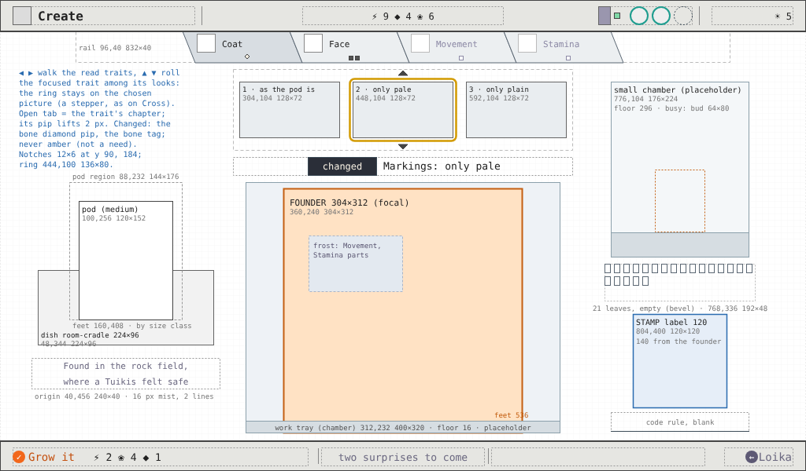

*03. Create, shaping: Loika with Coat and Face read, Markings changed to "only pale", the ring on the chosen picture, the total on the bottom line. 1×, measured.*

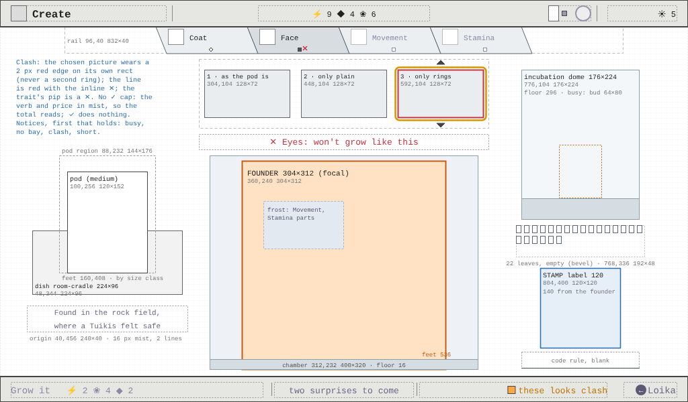

*03b. Create, a clash: the red edge on the chosen picture, the ✕ in the line and on the pip, no ✓ cap, the notice says why. 1×, measured.*

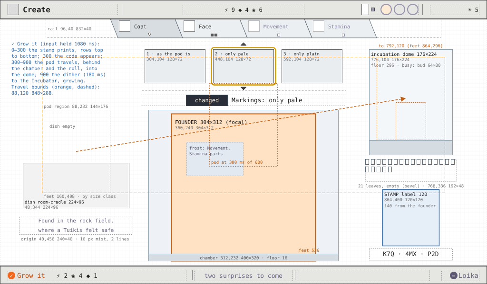

*03c. Create, the grow event at 600 ms: the stamp printed, the code on the rule, the pod travelling behind the chamber into the dome; input held 1080 ms. 1×, measured.*

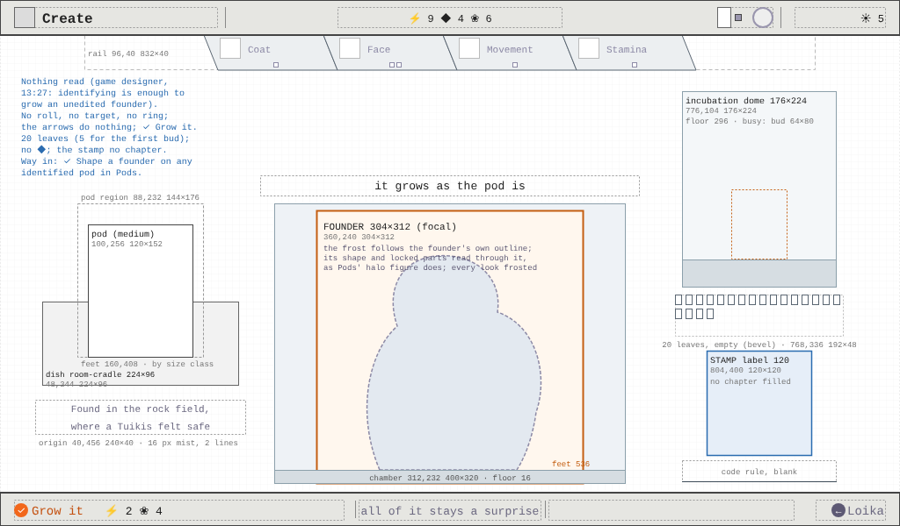

*03e. Create, nothing read: the founder frosted to its own outline, every pip hollow, no roll and no ring, `✓ Grow it · ⚡ 2 ❀ 4`. 1×, measured.*

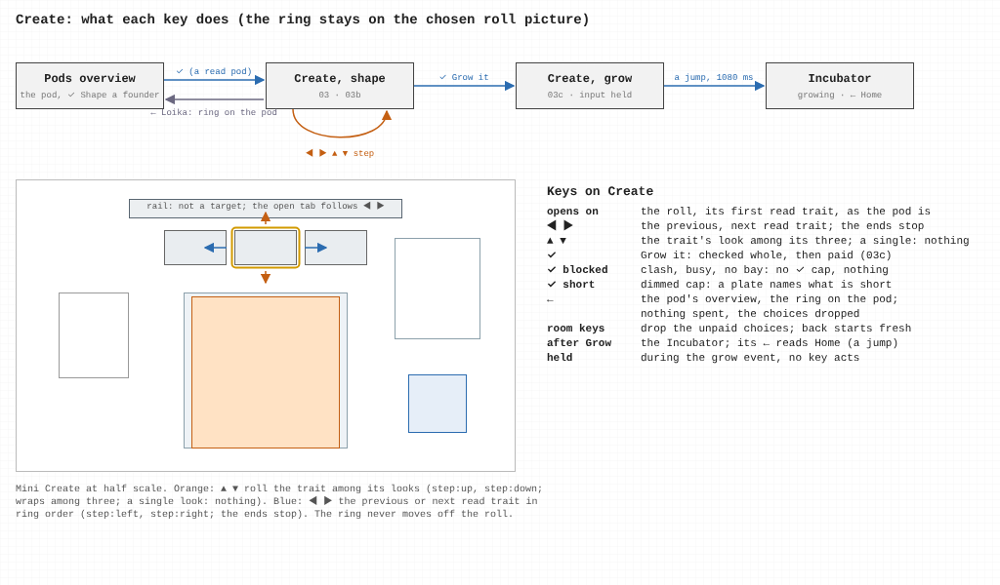

*03d. Create: how it opens from any identified pod, what each key does, where ✓ and ← lead. 1×.*

### 1. Purpose

Create is where the player shapes a founder from an identified pod and sees what it will cost. The player leaves either having grown it (paid, the stamp pressed, the pod gone into the incubator) or knowing exactly what they would get: which looks they changed, which chapters stay a surprise, and the price. With nothing read, the founder grows as the pod is, all of it a surprise.

### 2. Elements

| Element | Why it is here |
| --- | --- |
| **The founder** in the specimen chamber, 304×312, frosted where unread | The subject: what will grow |
| **The roll** of the focused trait: its looks as close-ups of the part (as the pod is, only the first copy, only the second copy), the chosen one ringed, with ▲ ▼ notches | The choice itself, never whole founders. Not shown when nothing is read |
| **The trait line** (16 px): the trait and its chosen look; a "changed" tag, or the clash | One line naming the choice |
| **The chapter rail** with trait pips | Where the focused trait sits; what is read, changed, clashing or still a surprise, with no digits |
| **The pod** on its dish, with its origin | Where the founder comes from |
| **The incubation dome** with the leaves the bud will take, drawn empty | Where it goes, and how long it will grow, as a picture |
| **Stamp label** (120) and a **blank code rule** | The stamp fills with the read and changed chapters; the code prints on the rule at Grow |
| **Bottom line** | `✓ Grow it` and the total; what stays a surprise; what blocks Grow; `← Loika` |

**Not drawn:**

- "◀ ▶ 3 of 3 read traits" or "changed: eye-rings": the pips show both.
- "the code appears at Grow" (the blank rule shows it), "grows in 21 leaves" (the leaves show it) or "from the pod" (the pod shows it).
- Label plates ("founder", "chamber", "identified"), or "busy" and "empty" under the dome.
- A stamp larger than the 120 label.
- A clash plate on the founder ("this shape won't grow"): no words in a living window; the line, the pip and the notice say it.

### 3. Placement

**Reading order:**

1. **The founder**, centred and lowest-set, the one warm thing in its glass chamber.
2. **The roll** directly above it, the chosen picture ringed, and the trait line under it.
3. **The rail**: where this trait sits and what else is changed.
4. **The pod at the left and the dome at the right**, balancing the founder.
5. **The stamp label**, low right, with the code rule under it.
6. **The bottom line** for the total.

**At the edges:** pod (left), dome, leaves and stamp (right), rail (top). The left and right columns are centred on x 160 and x 864, the same 352 px either side of the founder's axis.

### 4. Art direction

- **Room:** the research bench.
- **The founder is warm**, with its own colours and a warm key light from the top left. Where a chapter is unread, it is frosted in cool pale blue-white, never a guess; with nothing read, all of it.
- **Everything else is cool:** the glass, the slate and the empty dome.
- **The founder is the placeholder** (nothing is painted before Grow).
- **The roll pictures** are re-cut from the chapter page's source (the painting's crop by the rig's region, or the per-look plate), never from its 128×160 picture, and only ever reduced. A surface or quality trait (Colour, Markings, Fluff, Sheen, Scales, Feathers, Tufts) is a bleed crop filling all 128×72, with no ground; a part or posture (Beak, Crown, Crest, Tail, Head, Eyes, Carriage) stands whole inside the centred 75%, 96×54 at (16, 9), its ground keyed.
- **Clash marks** are red with a ✕, so they read without colour. **No mark on a picture:** the changed tag and the ✕ sit in the trait line, and a clash is an edge on the picture's own rectangle. **A change is not a need:** its tag and pip are `bone`, never amber.

**Colour roles** (the one home is `create.json` `colours`):

| Region | Roles | Why |
| --- | --- | --- |
| Rail | The frame's rail states; a changed pip a `bone` diamond, a clash ✕ `red` | The kit's states; amber is for needs only |
| Roll | Picture ground `ground`; notches `bone`; a clash's 2 px edge `red`; the ring `focus` | As the chapter page's cells; the ring is the focus's alone |
| Trait line | Line `bone`; a clash `red`; the tag `plate-name-88x24` (to be cut) with its word `bone` | A readout; the tag is the kit's small plate |
| Specimen chamber | Back `ground`, glass edge `frostD`, highlight `frost`, floor `enamel` with a `bevel` edge | Cool glass around the one warm thing |
| Founder | Its own colours; unread parts `frostS` with a `frostD` texture | As Pods' unread frost |
| Origin | `mist` | Context, quiet |
| Dome | Back `ground`, base `enamel`, glass edge `frostD`, highlight `frost`; a busy bud `peach` lit `cream`, edge `rust` | The Incubator's dome, small and empty |
| Leaves | Empty, the small leaf's outline in `bevel` | The Incubator's leaf drawn at 8×12 |
| Stamp label, code | `bone` label with a `slate` edge; the code `bone` on a `hairline` rule | The stamp label rule; a readout |

### 5. Composition

The rail is centred across the top. The roll sits under it, the trait line under the roll. The founder fills a glass chamber in the lower centre. The pod stands on its dish to the left and the empty dome to the right, its leaves and the stamp label under it.

| Region | Rectangle | Notes |
| --- | --- | --- |
| Rail | 96, 40, 832, 40 | Hanging from the top bar, its run centred on x 512 (232 for Loika's four chapters); not a focus target; no glint |
| Roll | 296, 88, 432, 104 | Three pictures of 128×72 at (304, 104), (448, 104), (592, 104), 16 px apart, in the order as the pod is, only the first copy, only the second copy (the trait state's hidden choice says which copy is the hidden look); one picture at (448, 104) when the trait does not roll (Tuikis Claws: "breed to change"). Not drawn when nothing is read |
| ▲ and ▼ notches | 12×6 at (chosen.x + 58, 90) and (chosen.x + 58, 184) | 4 px outside the ring, only when the trait rolls |
| Ring | 4 px outside the chosen picture: (x − 4, 100, 136, 80) | The screen's one focus ring; none when nothing is read |
| Trait line | 296, 200, 432, 24 | 16 px, its line box 202 to 222, centred on x 512; with the changed tag (24 tall, 88 wide), 8 px before the words, the group centred |
| Specimen chamber | 312, 232, 400, 320 | Glass; floor 312, 536, 400, 16 (the concept's 316, 232, 392, 320 on the grid) |
| **Founder (focal)** | 360, 240, 304, 312 | At least 300×310, feet at y 536 |
| Pod | 88, 232, 144, 176 | The pod by its species' size class, bottom-centred on (160, 408), as on Pods |
| Dish | 48, 344, 224, 96 | The signed `room-cradle`, and `room-cradle-front` over the pod's foot, as on Pods' overview |
| Origin | 40, 456, 240, 40 | 16 px `mist`, at most two lines, centred on x 160 |
| Dome | 776, 104, 176, 224 | The incubation chamber, empty; its floor at y 296. While a bud grows its glow shows here (a 64×80 bud at 832, 216) and Grow is refused |
| Leaves to grow | 768, 336, 192, 48 | The word `leaves`, form grid: 8×12 on a 12 px pitch, rows of 16 on a 16 px row pitch, up to three rows (48), all empty: one per minute it will take, 20 plus one a change, the first founder 5 whatever is shaped |
| **Stamp label** | 804, 400, 120, 120 | 140 px from the founder's box; x 804 centres it on the column's axis, 4 px off the grid, as Home's juvenile and the medium pod are |
| Code | 776, 525, 176, 25 | The line box 525 to 545, baseline 541, a 1 px `hairline` rule at y 549, 8 px from the baseline to the rule (off the grid for that clearance); at Grow the code prints here, centred on x 864. 176 wide: the widest code is 168 to 171 px |
| Travel (grow only) | 88, 120, 848, 288 | The pod's path from its box to (792, 120), feet (864, 296), behind the chamber and the roll |

**Regions and their words.** Every drawn region names its word from the closed vocabulary (`component`) or its composition (`build`), so the face's spec loader can refuse anything else ([lvgl-switch.md](../proposals/lvgl-switch.md) §2.3, lint). States: **nothingRead** (an identified pod with no chapter read), **shape** (a chapter read; at rest and while rolling) and **grow** (from `✓ Grow it` until the screen changes, input held).

| Region (`create.json`) | Rectangle | Word or build | Only in | States it shows |
| --- | --- | --- | --- | --- |
| `bench` | 0, 40, 1024, 522 | frame, part stage (`room-bench-stage-create`, to be commissioned; until then `room-bench-stage-collection`) | | — |
| `rail` | 96, 40, 832, 40 | chapter rail (rules `railCompaction`, `slantTabs`) | | open tab: the focused trait's chapter (none when nothing is read); pips read, unread, changed, clash, focused (lifted 2 px) |
| `roll` | 296, 88, 432, 104 | build `roll` | shape, grow | roll (three pictures, notches) or single (one picture, no notches); chosen 0, 1 or 2; clash edge |
| `traitLine` | 296, 200, 432, 24 | text, build `traitLine` (its tag a panel) | | as the pod is; changed (the tag); clash (red, the inline ✕); doing; one look; nothing read ("it grows as the pod is") |
| `chamber` | 312, 232, 400, 320 | living window, part inside | | — |
| `founder` | 360, 240, 304, 312 | specimen (focal) | | frosted where unread; nothing read, the frost follows its own outline, every look frosted; the roll's dither |
| `chamberFront` | 312, 232, 400, 320 | living window, part frame | | — |
| `pod` | 88, 232, 144, 176 | specimen | | at rest; grow: travelling, then gone |
| `cradle`, `cradleFront` | 48, 344, 224, 96 | specimen, parts cradle and cradleFront | | — |
| `origin` | 40, 456, 240, 40 | text | | — |
| `dome`, `domeFront` | 776, 104, 176, 224 | living window, parts inside and frame | | empty; busy (the bud) |
| `bud` | 832, 216, 64, 80 | specimen | | only while another bud grows |
| `leaves` | 768, 336, 192, 48 | leaves, form grid | | the count of minutes, every leaf empty |
| `stamp` | 804, 400, 120, 120 | stamp label | | live: the read and changed chapters; grow: printing |
| `code` | 776, 525, 176, 25 | text, with its rule | | blank; grow: the code |
| `travel` | 88, 120, 848, 288 | specimen, part travel | grow | the pod's path |

The ring is the frame's `focusRing` word; the bottom line and the top bar are the frame's. **Draw order:** bench, rail, dish, dome, its bud, pod, the dish's front, origin, chamber, founder, the chamber's front, roll, trait line, the dome's front, leaves, stamp, code, ring, frame, message plate. The travelling pod passes behind the chamber and the roll and ends inside the dome, with no change of order during the event.

**Clearance** (8 px from a word's baseline to an object's first ink): the trait line's baseline at y 218, the founder's box at 240 (22 px), the chamber's glass at 232; the tab words' baselines at about y 62, the notch at 90; the code's baseline at 541, its rule at 549. Nothing in the roll touches the ring: the notches sit 4 px outside it, the neighbours 8 px.

**States and conditions** (`create.json` `states`, `bottomLine.conditions`):

- **Nothing read:** the frost follows the founder's own outline: the species' shape and its locked parts read through the frost, as Pods' halo figure does; every look is frosted. Every pip hollow and no tab open; no roll, no ring and no target, so the arrows do nothing; the trait line "it grows as the pod is"; the stamp with no chapter filled; 20 leaves (5 for the first bud); `✓ Grow it · ⚡ 2 ❀ 4` (`⚡ 2` alone for the first founder), no ◆; the context "all of it stays a surprise".
- **Shape, as the pod is:** no tag, every read pip filled, the total `✓ Grow it · ⚡ 2 ❀ 4`.
- **Changed:** the tag in the line, the pip a `bone` diamond, the founder's part and the stamp's cells redrawn, ◆ 1 and one minute a change (choosing the shown look too); the first founder's leaves stay 5.
- **Blocked:** the notice names the first block in the rules' order: busy ("a bud is already growing"), no bay ("no bay free"), clash ("these looks clash"), short. Busy, no bay and clash: no ✓ cap; the verb and the total in `mist` so the total still reads; while busy the bud glows in the dome. A clash also wears its marks: the chosen picture's red edge, the line red with the ✕, the pip a ✕.
- **Short:** the frame's dimmed ✓; the short material's figure `amber`; the notice "needs more ‹icons›"; ✓ shows a message plate naming what is short.
- **Grow:** the event below, then the Incubator, growing.

**Prices** read icon before figure, the frame's rule ([The frame](#the-frame)): `⚡ 2 ❀ 4 ◆ 1` here, `❀ 7` on the Incubator.

### 6. Interactions

| Input | What happens, and how it shows |
| --- | --- |
| ◀ ▶ | Shape: `step:left`, `step:right`: the previous or next read trait in ring order, skipping unread chapters; the ends stop. The ring stays on the roll; the pictures, the trait line, the open tab and the lifted pip change on the frame of the key. Nothing read: nothing |
| ▲ ▼ | Shape: `step:up`, `step:down`: the focused trait's look among its three, wrapping; the ring and notches move to the chosen picture; the founder cross-dithers to the new picture over 200 ms (the `roll` event); the stamp's cells, the pip, the price and the leaves change at once. Nothing read: nothing |
| ▲ ▼ on a doing, or a trait the pod carries one look of | Nothing: one picture, no notches, and the line already says why ("Claws: breed to change" with the two joined rings after the name; "Crown: one look in this pod"). No message plate |
| ✓ | `✓ Grow it · ⚡ 2 ❀ 4 ◆ 1`, checked whole and then paid: the `grow` event, then the Incubator. Blocked: no ✓ cap and nothing happens. Short: the dimmed cap and a plate |
| ← | Back to the pod's overview with the ring on the pod, nothing spent and the choices dropped: the way back reads the pod's name, "← Loika" |
| A room key | Drops the unpaid choices; coming back starts fresh |
| During the grow event | Presses are consumed (1080 ms) |

**The way in:** on Pods' overview, ✓ on an identified pod is always `✓ Shape a founder` and opens Create, in its nothing-read state when no chapter is read; a chapter opens from the rail (▲, then `✓ Open ‹Chapter›`).

### Create's focus as data

`create.json` `focus`, one graph a state, as on Pods:

- **Shape:** one target, `roll`, in group `roll`, its box the chosen picture's rectangle (the roll composition registers target `roll` there), round ring, no lift (it never leaves the roll). The group is a **stepper**: `"stepper": ["left", "right", "up", "down"]`. A stepper key is step 0 of the move order: the face sends the intent `step:<key>`, the ring stays, and no focus message goes. The loader refuses an empty list, a duplicate or unknown key, a stepper key that also has an edge in the group, `axis` horizontal with left or right, `axis` vertical with up or down, and `order` with up or down. As on Cross, the rail is not a target: its open tab follows the focused trait.
- **Nothing read:** no target; the ring on nothing (`room`), every edge none; ✓ sends `confirm` on the room.

Vectors: from `roll`, each of ◀ ▶ ▲ ▼ sends its step and the ring stays on `roll`; ✓ sends `confirm` on `roll`; nothing read, room ◀ room and room ✓ `confirm`. Held: during `grow` the face moves no focus and sends no intent.

### Create's events

| Event | Hold | What plays |
| --- | --- | --- |
| `roll`: `{ kind: dither, target: founder, ms: 200, levels: 16 }` | no | The founder's old picture cross-dithers to the new one in its own box, 16-level Bayer, as a composed picture; the roll, the ring, the line, the pip, the stamp and the price are cuts |
| `grow` (1080 ms) | yes | 0 to 300 ms: the stamp prints, its cells drawn row by row from the top, whole rows. 300: the code appears on the rule. 300 to 900: the pod travels in a straight line, whole pixels, eased, from its box to the dome (feet 160, 408 → 864, 296), behind the chamber and the roll; the dish stays, empty. 900 to 1080: the screen transition (16-level Bayer dither) to the Incubator, growing. The counters tick the price at 0 |

With `motion: false` both jump to their ends.

### Placeholders on Create

| Thing | Pixel size |
| --- | --- |
| Founder | 304×312 (the placeholder: the stylised rig pass) |
| Roll close-ups | 128×72, `roll-{species}-{trait}-{look}-128x72` |
| Pod | the species' size class: 144×176, 120×152 or 104×128 (the signed pod sprites) |
| Dish | 224×96 (the signed `room-cradle` and `room-cradle-front`) |
| Specimen chamber | 400×320, its floor 400×16 |
| Dome | 176×224; a busy bud 64×80, `bud-small-64x80` |
| Notches | 12×6 |
| Leaves | 8×12, `leaf-small-empty-8x12` and `leaf-small-full-8x12`: the Incubator's leaf at the small size |
| Changed pip, clash pip | 6×6, `pip-changed-6x6` (a diamond), `pip-clash-6x6` |
| Changed tag | 88×24, `plate-name-88x24`, to be cut |
| Stage | 1024×522, `room-bench-stage-create`, to be commissioned (until then `room-bench-stage-collection`) |
| Stamp | on the 120 label |

---

## Incubator: growing and ready

Concept plates: `art/concept-station/incubator/placed/IN-D-r1-a3-stamped-1024x600.png` (growing) and `IN-C1-stamped-1024x600.png` (ready). Wireframes, 1×: [04-incubator-growing](station-layouts/04-incubator-growing.svg), [05-incubator-ready](station-layouts/05-incubator-ready.svg), [05b-incubator-hatch](station-layouts/05b-incubator-hatch.svg), [05c-incubator-empty](station-layouts/05c-incubator-empty.svg), [05d-incubator-nav](station-layouts/05d-incubator-nav.svg), each with its PNG.

**The L2.4 spec.** The **empty** Incubator is an invitation to incubate and see it in action; the **hatch** is a held state. The bud's own states are growing and ready; a portrait arrives as a crate, never as a state of the bud. The numbers live in `prototypes/ui/specs/station/incubator.json`.

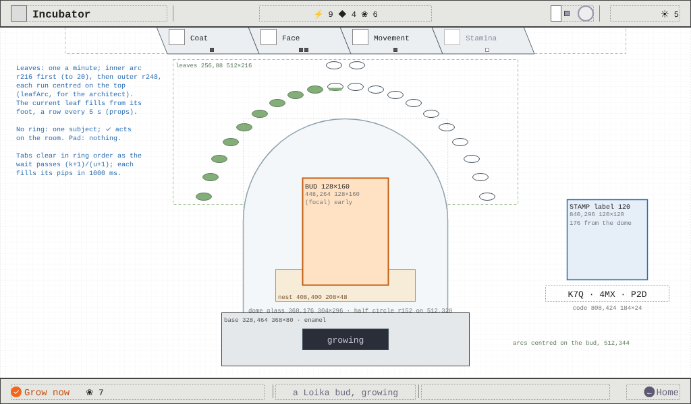

*04. Incubator, growing: a 22-minute bud, nine leaves full and the tenth filling, three chapters known and Stamina still a surprise, `✓ Grow now · ❀ 7`. 1×, measured.*

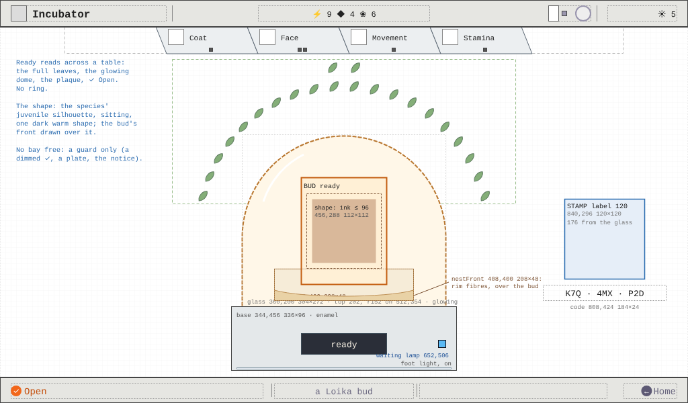

*05. Incubator, ready: every leaf full, every chapter known, the dome glowing, the species' shape in the bud, the plaque says ready, `✓ Open`; the waiting lamp while the painting is on its way. 1×, measured.*

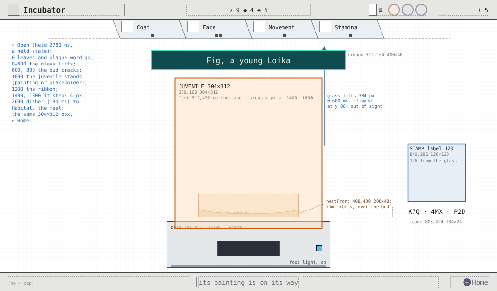

*05b. The hatch at 1500 ms: the glass lifted out of sight, the bud gone, the juvenile on the base, the ribbon; input held 2780 ms, then Habitat's meet. 1×, measured.*

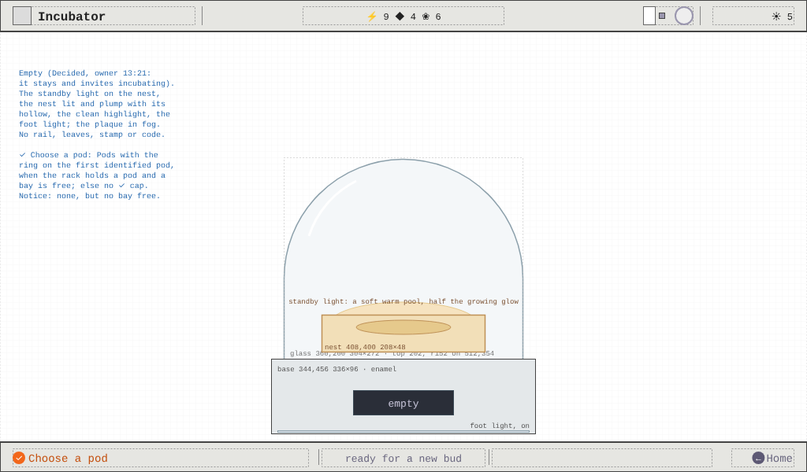

*05c. Incubator, empty: an invitation to grow a bud. The standby light on the lit, plump nest, the clean glass, the base's foot light, `✓ Choose a pod`. 1×, measured.*

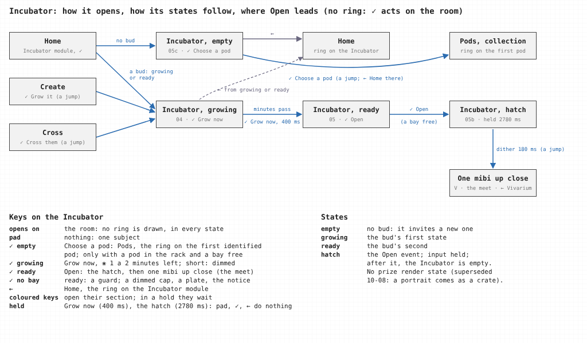

*05d. Incubator: how it opens, how its states follow each other, where Open and Choose a pod lead. 1×.*

### 1. Purpose

The Incubator is where the player watches the bud grow and opens it when it is ready. The player comes away knowing how much of the wait is left (in leaves), which chapters are still surprises, and, when it is ready, that one ✓ opens it. Empty, it invites the player to grow a bud and shows the way to a pod.

### 2. Elements

| Element | Why it is here |
| --- | --- |
| **The bud** in its nest inside the dome | The subject. A glowing bean, never an embryo; when ready, the species' shape glows inside it |
| **The leaves** in two arcs over the dome, one a minute | Time as leaves, the current one filling. Never digits |
| **The rail** with tabs clearing | The surprises clearing one by one across the wait |
| **The plaque** on the base, one word ("growing", "ready", "empty") | The state, for across a table |
| **Stamp label** (120) and the **code** as live text | The bud's stamp, filling with the rail, and its shareable code |
| **The standby light** (empty) | A warm pool on the nest: the chamber waiting for a bud |
| **Bottom line** | `✓ Grow now` and its price while growing; `✓ Open` when ready; `✓ Choose a pod` when empty |

**Not drawn:**

- "and n more leaves": the second arc holds them.
- "read", "cleared" or "misty" on the tabs.
- "Loika founder" or "child of …" under the code: the context says it.
- A wooden base; an embryo inside the ready bud (never an embryo).
- A code plate on arrival from Create: the code already printed on Create's rule.
- A ready ring: the screen has one subject and nothing to choose, so ✓ acts on the room, and a ring round the dome and its base would cross the leaf arcs.
- Text lines on the empty screen ("The incubator is empty", "Shape a founder from a read pod at Research"): the plaque, the context and `✓ Choose a pod` say it.

### 3. Placement

**Reading order:**

1. **The bud's glow**, centred, inside the dome (about 340 across with its base).
2. **The leaves** arched over it: how many are full.
3. **The plaque word.**
4. **The rail**: which surprises remain.
5. **The stamp label** at the right, then the code under it.

Empty: the standby light on the nest, then the plaque, then the bottom line's `✓ Choose a pod`. The left of the stage stays empty and dark, so the dome reads alone.

### 4. Art direction

- **Room:** the research bench, with the chamber's glow as the one warm thing.
- **Pale glass, a machined enamel base,** and leaf greens for the timer.
- **The bud** grows in two pictures, the first half of the wait and the second (one generic `bud-late-128x160`, with no drift toward the species' hue).
- **Ready:** the dome glows and the species' shape is visible inside the bud. Nothing steps out until the player opens it. The shape is the species' juvenile-proportion silhouette from the hatch juvenile's source: a compact sitting side pose, never curled or foetal; one flat, soft-edged, dark warm shape with no eye and no detail; its ink at most 96×96, centred in its 112×112 box. `bud-ready-128x160` is drawn behind it and `bud-ready-front-128x160` over it.
- **The leaf:** one ovate pointed leaf leaning about 40° clockwise (tip upper right), a centre vein, a short curved stem lower left, in a 16×20 box centred on its slot; filling, the full leaf clipped from the bottom in whole rows; empty, an outline in `metal`. The same drawing at 8×12 is the small leaf of Create and Home.
- **Empty invites:** a standby light inside (a soft warm pool on the nest, about half the growing glow); the glass with the clean growing highlight; the base's foot light on, as in every state; the nest lit and plump with its hollow visible; the plaque word in `fog`.
- **Calm:** only the glow and the filling leaf move.

**Colour roles** (the one home is `incubator.json` `colours`):

| Region | Roles | Why |
| --- | --- | --- |
| Dome | Back `ground`; glass edge `frostD`, highlight `frost`; ready: edge `frost`, highlight `white`; the standby pool `sand` (placeholder) | The palette's dome roles; ready brightens the glass, it does not ring it |
| Nest | `sand`, shade `clay`, twigs `bark` | Warm, inside the living window |
| Bud (placeholder) | Bean `peach`, lit `cream`, edge `rust`; late `blush`; the ready shape `bark` | The one warm thing; the shape a dark warm silhouette, never amber |
| Base | `enamel`, lit top `frost`, shade `bevel`, edge `hairline`; the foot light `frost`; the plaque's plate `panel` with a `hairline` edge | Machined enamel |
| Plaque | growing `fog`, ready `bone`, empty `fog` | Ready is the brightest word, for across a table; empty never recedes to `mist` |
| Leaves | Full `sage` with a `sageD` vein; empty an outline in `metal`; the current leaf `sage` rows from its foot | The palette's leaf timer |
| Waiting lamp | `sky`, 1 px `void` rim | The kit's waiting role |
| Stamp label, code | `bone` label with a `slate` edge; code `bone` | A readout |
| Ribbon | Fill `tealD`, rim `aqua`, words `bone` | The one ribbon look, as on Home and Pods |

### 5. Composition

The dome stands centred and large. The leaves arc over it in two arcs centred on the bud. The rail is centred across the top. The stamp label sits at the right, level with the bud.

| Region | Rectangle | Notes |
| --- | --- | --- |
| Rail | 96, 40, 832, 40 | Hanging, its run centred on x 512; not a focus target; no glint |
| Leaves | 256, 88, 512, 216 | The word `leaves`, form arc, rule `leafArc`: two arcs centred on the bud's centre (512, 344), inner radius 216, outer 244, each up to 20 leaves of 16×20 on an 8° pitch across ±76°, the run centred on the top; the inner fills first; up to 40 ([the leaf arcs](#the-leaf-arcs)) |
| Dome glass | 360, 200, 304, 272 | A bell jar 304×270: a half circle of radius 152 on (512, 354), its top at y 202 (its ink 2 px into the region), over a body to y 472 (the concept's measurement) |
| **Bud (focal)** | 448, 264, 128, 160 | Rendered at size, centred on (512, 344). Ready: the species' shape at 456, 288, 112×112, its ink at most 96×96 |
| Nest | 408, 400, 208, 48 | Empty: lit and plump, its hollow visible |
| Base | 344, 456, 336, 96 | Enamel, not wood; the glass stands in it to y 472; the foot light 352, 548, 320, 2; the plaque's plate 448, 496, 128, 32 (the concept's about 328×96 on the grid) |
| Plaque | 448, 496, 128, 32 | One word, 16 px, centred on x 512, its line box 502 to 522 |
| Waiting lamp | 652, 506, 12, 12 | On the base, ready and hatch only, while the new mibi's painting has not landed |
| **Stamp label** | 840, 296, 120, 120 | 176 px from the glass |
| Code | 808, 424, 184, 24 | 16 px, centred on x 900, line box 426 to 446 |
| Hatch ribbon | 312, 104, 400, 40 | The new mibi's words, 20 px, hatch only |
| Juvenile, after Open | 360, 160, 304, 312 | Its feet on the base's top at y 472, reading young by proportion inside the box; the box Habitat's meet keeps ([the hand-off](#the-incubators-events-the-hatch-and-the-hand-off)), so it reads as the same creature |

**Regions and their words.** States: **empty** (no bud, and an invitation), **growing** and **ready** (the bud's two), **hatch** (from `✓ Open` until the screen changes, input held).

| Region (`incubator.json`) | Rectangle | Word or build | Only in | States it shows |
| --- | --- | --- | --- | --- |
| `bench` | 0, 40, 1024, 522 | frame, part stage (`room-bench-stage-incubator`, to be commissioned; until then `room-bench-stage-collection`) | | — |
| `rail` | 96, 40, 832, 40 | chapter rail (rules `railCompaction`, `slantTabs`) | growing, ready, hatch | tabs read or unread; a founder's clearing by the `wipe` event |
| `leaves` | 256, 88, 512, 216 | leaves, form arc (rule `leafArc`) | growing, ready | each leaf empty, filling (rows of 20) or full |
| `dome` | 360, 200, 304, 272 | living window, part inside | | standby (empty); the glow; lifting in the hatch |
| `nest` | 408, 400, 208, 48 | living window, part inside | | lit and plump when empty |
| `nestFront` | 408, 400, 208, 48 | living window, part inside (`nest-front-208x48`, a placeholder to be painted) | | the nest's front rim fibres only, drawn over the bud as `room-cradle-front` is over the pod |
| `bud` | 448, 264, 128, 160 | specimen (focal) | growing, ready, hatch | early, late, ready (with the shape and the front); cracking |
| `domeFront` | 360, 200, 304, 272 | living window, part frame | | the clean highlight; glowing (ready); lifting |
| `base` | 344, 456, 336, 96 | living window, part frame | | the foot light, always on; the waiting lamp |
| `plaque` | 448, 496, 128, 32 | text | | empty, growing, ready; blank in the hatch |
| `stamp` | 840, 296, 120, 120 | stamp label | growing, ready, hatch | its chapters filling as they clear |
| `code` | 808, 424, 184, 24 | text | growing, ready, hatch | — |
| `ribbon` | 312, 104, 400, 40 | ribbon | hatch | — |
| `juvenile` | 360, 160, 304, 312 | specimen | hatch | its painting or its placeholder; the step lift |

**Draw order:** bench, rail, leaves, dome, nest, bud (with the bud's shape and the bud's front), nestFront, the dome's front, base, its foot light, plaque, the base's lamp, juvenile, stamp, code, ribbon, frame, message plate. The juvenile stands in front of the base's top; the lifting glass is clipped to (0, 88, 1024, 474), under the rail.

**Clearance:** every leaf lies 10 px or more under the rail (the outer arc's top leaf at y 90; with the 16×20 leaf an outer radius of 248 would put it at 86, 6 px under) and 56 px or more outside the glass, measured on the slot tables; no two leaves of any run overlap, their boxes 2 px apart at the closest, where the leaf's empty corners keep its ink clear. The code's line box starts 10 px under the stamp label; the ribbon ends 16 px above the juvenile's box.

**States:**

- **Empty** (an invitation): the standby light on the lit, plump nest, the clean glass, the foot light, the plaque "empty" in `fog`; no rail, leaves, stamp or code; the context "ready for a new bud". `✓ Choose a pod` when the rack holds a pod and a bay is free: a jump to Pods' collection with the ring on the first identified pod in rack order, else the first pod. Otherwise no ✓ cap. No notice, but "no bay free" when no bay is free, the one need that stops a bud.
- **Growing:** no ring; the leaves filling; the plaque "growing"; `✓ Grow now · ❀ 7` (❀ 1 for every 2 minutes left, rounded up: at most 19, the first bud 3), the frame's dimmed cap when short; the context "a Loika bud" (a cross: "Fig and Moss's bud", falling back to "a Loika bud" past 208 px). A founder's tabs clear across the wait, except a sealed chapter that is still shut; a cross bud's chapters outside its known reads stay unread through the wait, Grow now and ready.
- **Ready:** every leaf full, the dome glowing, the shape in the bud, the plaque "ready", `✓ Open`; a founder's bud has every chapter known except a sealed chapter that is still shut; a cross bud keeps its unread chapters. No bay free is a guard only (Grow already checked it): the dimmed cap, the plate "No bay free. Return a mibi to the wild first." and the notice. While the painting is on its way, the waiting lamp on the base.
- **Hatch** (a held state): the event below; the context "its painting is on its way" (offline "waiting for the cloud") while it has not landed. Afterwards the Incubator is empty.

### 6. Interactions

| Input | What happens, and how it shows |
| --- | --- |
| ✓ when empty | `✓ Choose a pod`: Pods' collection, the ring on the first identified pod (a jump; ← there reads Home). With the rack empty or no bay free: no ✓ cap, nothing |
| ✓ while growing | `✓ Grow now · ❀ 7`: the `growNow` event (the leaves fill in 400 ms), then ready |
| ✓ when ready | `✓ Open`: the `hatch` event, then Habitat's meet. No bay free (a guard): the dimmed cap; ✓ shows a plate, nothing opens |
| Pad | Nothing: the screen has one subject, and no ring is drawn |
| ← | Home, with the ring on Home's Incubator module |
| During Grow now or the hatch | Presses are consumed |

### The Incubator's focus as data

`incubator.json` `focus`: the room only, as on Home (`roomKey` room, the ring on nothing, its point roomAt's centre, the bud's centre 512, 344). No targets; every edge none; fallback none. ✓ sends `confirm` on the room and the intent table does what the bottom line says (Choose a pod, Grow now, Open). Holds: while `growNow` or `hatch` plays the face moves no focus and sends no intent. Vectors: room ▲ room; room ▶ room; room ✓ `confirm`.

### The leaf arcs

`leafArc` is the ninth layout rule. The bud takes 20 minutes plus one a change (5 for the first bud), up to 38 today. One leaf a minute; the leaves' places depend on their count, so `incubator.json` `regions.leaves` names `"layout": ["leafArc"]` and carries the rule's tables under `leafArc`:

- **Slots.** Each arc has 2 × perArc − 1 = 39 half-pitch places from −76° to +76° in 4° steps, stored as the 16×20 leaf box's top left: (Math.round(512 + r sin a) − 8, Math.round(344 − r cos a) − 10) for the angle a, r 216 (inner) and 244 (outer). The face does no trigonometry: the tables are data, and `specs.test.mjs` rebuilds them from the centre, the arcs, the span and the half pitch.
- **Runs.** n leaves, refused when n > 2 × perArc (40): the inner arc holds a = min(n, 20), the outer b = n − a. On an arc holding k leaves, leaf j (0 to k − 1, left to right) takes slot 20 − k + 2j, so every run is centred on the top (five leaves make a crown, as on the concept plate). Fill order: the inner arc left to right, then the outer.
- **The oracle** is `ui/specs/derive.mjs` `leafArc(region, n)` from L2.4, returning the n boxes [x, y, 16, 20] in fill order. Until then `specs.test.mjs` holds the rule's slot tables (above), and its check of every run from 1 to 40 is skipped until the oracle exists.
- **Fill.** `props.leaves`: `total` (the bud's minutes), `full` (whole minutes passed) and `rows` (0 to 19, the current leaf's filled rows from its foot), stepped every 3 s by the view. A still frame and reduced motion both show the true wait; no event plays the fill.

### The Incubator's events, the hatch and the hand-off

| Event | Hold | What plays |
| --- | --- | --- |
| `wipe` (1000 ms), a tab clearing | no | A founder's bud: the tab turns from unread to read (word and emblem at once) and its pips fill left to right; the stamp redraws with the chapter at the end. The rail word's wipe, as on Pods, with no page |
| `growNow` (400 ms) | yes | The leaves still to fill fill one whole leaf a step, left to right, inner then outer; then, on a founder's bud, every tab still unread turns read (a cut), except a sealed chapter that is still shut, and the stamp redraws; the state is ready |
| `hatch` (2600 ms, held 2780) | yes | 0: the leaves and the plaque's word go. 0 to 600: the glass lifts 384 px, eased, whole pixels, out of sight under the rail. 600 and 800: the bud cracks in two steps. 1000: the bud goes and the juvenile stands in its box on the base, in its painting if it has landed, else its placeholder. 1200: the ribbon, "Fig, a young Loika". 1400 and 1800: it steps, the creature lift 4 px up and back in 200 ms. 2600 to 2780: the screen transition (16-level Bayer dither) to Habitat |

**The hand-off.** The hatch ends on Habitat in its meet ([Habitat's states and events](#habitats-states-and-events)). This spec fixes only what the hand-off needs: the new mibi shown at 304×312, the box the juvenile stood in, with the ring on it, and Open as a jump, so ← on Habitat reads Home (stack navigation, `frame.json` `navigation.jumps`). With `motion: false` the hatch jumps to its end, Habitat's meet.

### Placeholders on the Incubator

| Thing | Pixel size |
| --- | --- |
| Dome glass | 304×272 region (the glass 304×270), back and front; empty, `dome-inside-standby-304x272` (the standby light at the glass's size) |
| Base | 336×96, with its plaque plate 128×32 and the foot light |
| Bud | 128×160: `bud-early-128x160`, `bud-late-128x160` (one generic), `bud-ready-128x160` and `bud-ready-front-128x160`; two crack steps |
| Shape inside the bud | 112×112, `bud-shape-S01-112x112` to `bud-shape-S16-112x112`, ink at most 96×96 |
| Leaves | 16×20, `leaf-empty-16x20` and `leaf-full-16x20` (filling is the full leaf clipped by rows) |
| Nest | 208×48, and its front rim fibres `nest-front-208x48`, a placeholder to be painted |
| Waiting lamp | 12×12 |
| Stage | 1024×522, `room-bench-stage-incubator`, to be commissioned (until then `room-bench-stage-collection`) |
| Juvenile | 304×312: the new mibi's painting, or its placeholder |

---

## Habitat

One mibi up close, in the vivarium's light. Wireframes, 1×: [06-habitat](station-layouts/06-habitat.svg), [06b-habitat-meet](station-layouts/06b-habitat-meet.svg), [06c-habitat-child](station-layouts/06c-habitat-child.svg), [06d-habitat-armed](station-layouts/06d-habitat-armed.svg), [06e-habitat-empty](station-layouts/06e-habitat-empty.svg), [06f-habitat-away](station-layouts/06f-habitat-away.svg) and the map [06g-habitat-nav](station-layouts/06g-habitat-nav.svg), each with its PNG. The numbers live in `prototypes/ui/specs/station/habitat.json`.

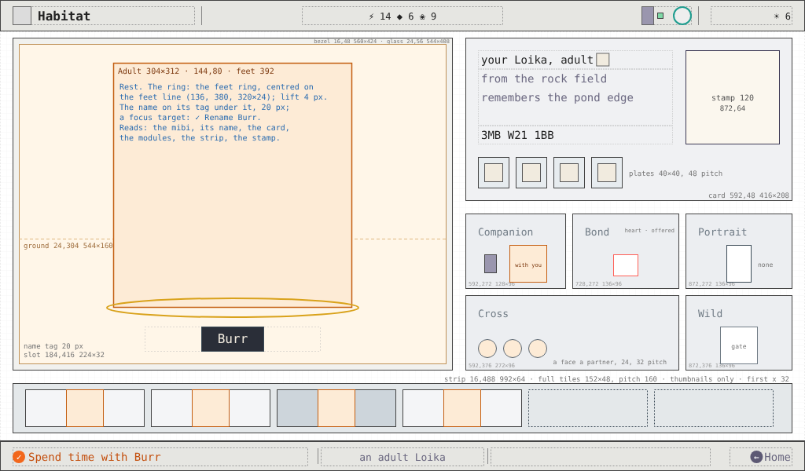

*06. Habitat at rest: an adult founder with every chapter read, the ring on the mibi, `✓ Spend time with Burr`. 1×, measured.*

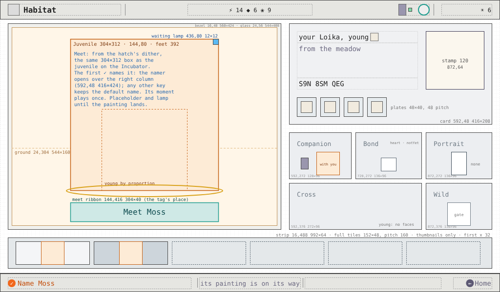

*06b. The meet: the new juvenile from the hatch in the same 304×312 box, its placeholder and waiting lamp, the meet ribbon in the name tag's place, the ring on it, `✓ Name Moss`.*

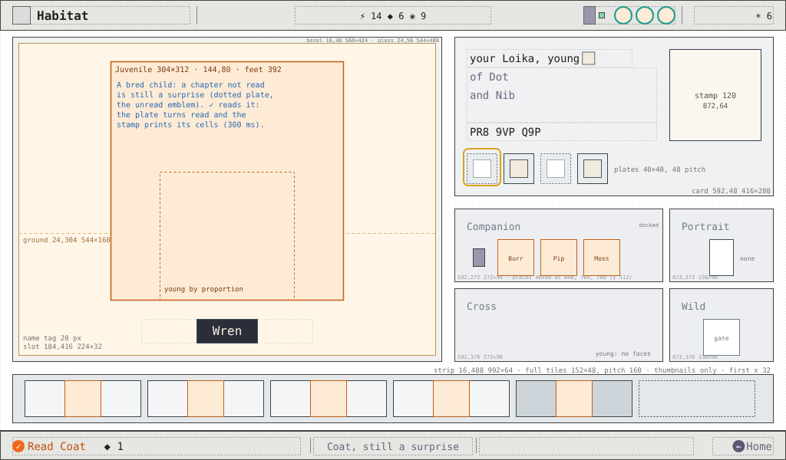

*06c. A bred child with two chapters still a surprise: the ring on an unread plate, `✓ Read Coat   ◆ 1`.*

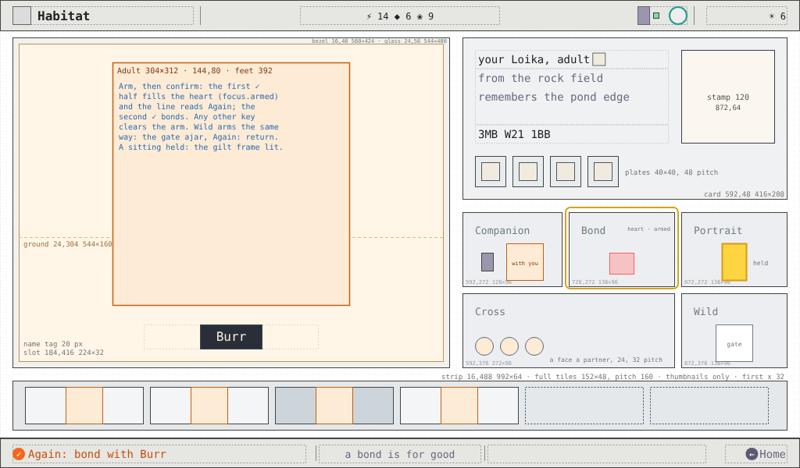

*06d. Arm, then confirm: the first ✓ on an offered bond half fills the heart and the action reads `Again: bond with Burr`; a sitting held lights the Portrait module's frame.*

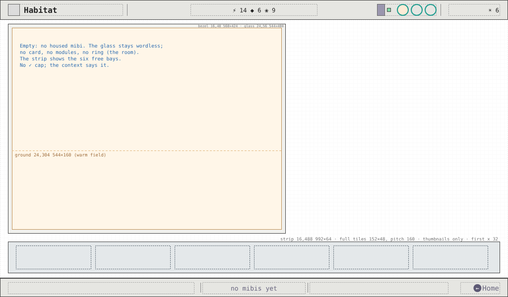

*06e. Empty: no mibi yet. The glass, the six free bays and the frame; no ring and no ✓ cap.*

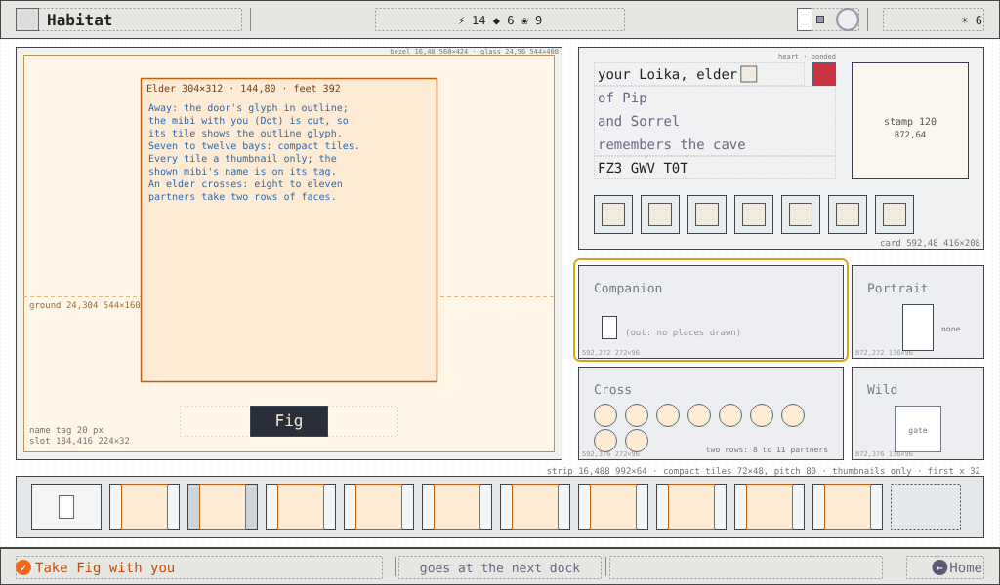

*06f. The Companion away and twelve bays in compact tiles: the ring on the Companion module, `✓ Take Fig with you`, "goes at the next dock"; an elder with nine partners, two rows of faces.*

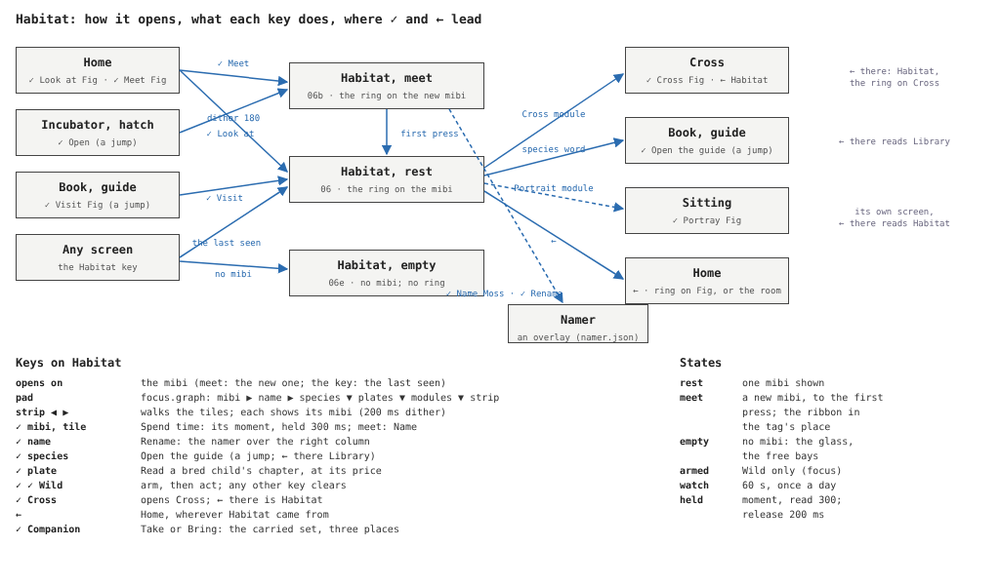

*06g. Habitat's map: the ways in, the states, the namer, what each key does, where ✓ and ← lead.*

### 1. Purpose

Habitat is where the player spends time with one mibi and decides what it does next: names it, takes it along on the Companion, bonds, crosses, has it sit for its portrait, or returns it to the wild. The player comes away knowing who this mibi is (its name, its species and stage, where it came from, what it remembers, which chapters are still a surprise) and having chosen its next step. It is the individual level ([The two levels](#the-two-levels-species-and-mibi)): one living thing with its own stamp, with a door to its species' guide.

### 2. Elements

| Element | Why it is here |
| --- | --- |
| **The mibi**, 304×312, in the living window | The subject, at the size it stood at when it hatched |
| **The name tag** under it, inside the window | Which mibi this is, in context under the creature; the way to rename it |
| **The card**: "your Loika, adult" (the species word is the door to the guide), where it came from and what it remembers, its code, the stamp label and one plate a chapter | Who it is, as a readout, without a text page |
| **Five modules**: Companion, Bond, Portrait, Cross, Wild | The five things a mibi can do next, each one engraved word and one object. All five show on every mibi; the Portrait module is where a sitting is spent |
| **The strip** of bays | The other mibis and the free bays; walking it changes the mibi shown |
| **The meet ribbon** (the meet only) | A new mibi, met for the first time |
| **The namer** (an overlay on Habitat, over the right column; not a screen of its own) | Naming at the meet, and renaming any time (its own spec, `namer.json`) |
| **Bottom line** | What ✓ does with the focus, at its price; the context in words |

**Not on the stage:** prices, counts, "again", "+2 ❀", "with you", "placeholder" or any status word: they are the bottom line's. Nothing on Habitat is amber: an offered bond, a partner to cross with or a mibi with you is not a need.

### 3. Placement

**Reading order:**

1. **The mibi**, warm, centred in the window on x 296.
2. **Its name** on the tag under its feet.
3. **The card's first line**, "your Loika, adult", then its other lines and plates.
4. **The modules**, left to right, top to bottom; Wild, the act that lets a mibi go, last.
5. **The strip.**
6. **The stamp label**, in the card's top right corner, 424 px from the mibi.

**At the edges:** the card and the modules in a 416 px column at the right (592 to 1008), which is also where the namer's panel stands; the strip along the foot. The living window stays left of x 592, so the mibi being named is always in view.

### 4. Art direction

- **Room:** the vivarium: cozy and warm, the pet happy at home. The window is the only warm field; the card, the modules and the strip are the instrument's cool chrome.
- **One warm light**, the same as Home's glass and Idle: the warm key light from the top left in every light; at night warm and low, the moon only a cool rim.
- **The mibi** is its standard painting at 304×312, or its placeholder with the waiting lamp until the painting lands. A juvenile reads young by proportion inside the same box. Never a token, never enlarged.
- **The heart** is a small enamel heart painted in the house light: never a flat emoji heart, no face, no sparkle. There are no meters or needs anywhere.
- **The stamp is a detail:** the 120 label, at the card's far corner.

**Colour roles** (the one home is `habitat.json` `colours`; the hearts, frames, gate and plate grounds are painted masters, `habitat.json` `masters`):

| Region | Roles | Why |
| --- | --- | --- |
| Bezel, glass | As Home: `metal` bezel lit `enamel`, shade `bevel`, edge `hairline`; glass edge `frostD`. Until the Habitat master: back `forest`, ground band (y 304 to 464) `clay` with a `sand` top row | The vivarium's warm field, the same as Home's |
| Name tag | `panel` fill, `hairline` edge, the name `bone` | The kit's small plate, quiet on the warm field |
| Meet ribbon | `tealD` fill, `aqua` rim, words `bone` | The one ribbon look: an event, cool on the warm field |
| Waiting lamp | `frame-lamp-12-sky` | The kit's waiting role, never a word in the window |
| Card | `panel` fill, `hairline` edge, `bevel` top; species line and code `bone`, the story `mist`; `mark-guide-16` | An instrument readout |
| Plates | The signed grounds `chapter-plate-{read,unread,sealed}-40x40`, then the rail's emblems | The rail's states, as plates |
| Modules | `panel` fill, `hairline` edge, `bevel` top, the word `metal`; no lamp | Home's modules, engraved and quiet |
| Partner faces | `face-{species}-24` on a `bevel` ring | A face a partner, no digits |
| Strip and tiles | Strip `ground`; tile `panel`; the shown tile `hairline`, one step up; a free bay a composed dashed outline, 1 px `hairline`, dash 2 and 2 | The focus ring is the only highlight |

### 5. Composition

The window fills the left (16 to 576) above the strip, the mibi centred in it with its tag under its feet. At the right the card sits on top, then two rows of modules. The strip runs the full width at the foot.

| Region | Rectangle | Notes |
| --- | --- | --- |
| Bezel | 16, 48, 560, 424 | 8 px bezel |
| **Living window (glass)** | 24, 56, 544, 408 | Ground band 24, 304, 544, 160; no words but the tag and the meet ribbon |
| **The mibi (focal)** | 144, 80, 304, 312 | Axis x 296, feet y 392; the juvenile's box on the Incubator, so it reads as the same creature after the hatch |
| Waiting lamp | 436, 80, 12, 12 | At the box's top right, riding the lift, while the placeholder is drawn |
| Name tag | in 184, 416, 224, 32 | 32 tall at y 416 (the feet + 24, 12 px under the feet ring); the name 20 px medium; the name's width + 24, rounded up to 8, at least 80, at most 224 (ten of the widest letter, 200, and its pads); centred on x 296. A name is never clipped |
| Meet ribbon | 144, 416, 304, 40 | In the tag's place, 20 px, centred; the meet only |
| Card | 592, 48, 416, 208 | `panel` |
| Species line | 608, 64, 248, 24 | "your Loika, adult", 16 px, with `mark-guide-16` 4 px after the last word; a focus target |
| Story | 608, 88, 248, 72 | Up to three lines of 16 px on a 24 pitch, filled from the top: a founder, "from the rock field"; a bred mibi, "of Pip" and "and Sorrel" on two lines; then "remembers the pond edge" |
| Code | 608, 160, 248, 24 | The code in three groups with spaces, "3MB W21 1BB", live text |
| **Stamp label** | 872, 64, 120, 120 | 424 px from the mibi's box |
| Plates | 608 + 48i, 200, 40, 40 | One a chapter in ring order, up to eight (8 × 48 − 8 = 376): the signed ground, then the rail's emblem 24×24 at (8, 8); no word, no pips |
| Companion | 592, 272, 128, 96 | Word at (16, 12); the Companion's glyph 16×24 at (24, 52), solid docked, outline away; the mibi with you, 48×48, at (56, 40) while docked |
| Bond | 728, 272, 136, 96 | The heart 32×28 at (52, 52) |
| Portrait | 872, 272, 136, 96 | The sitting frame 32×48 at (52, 40) |
| Cross | 592, 376, 272, 96 | Wide: it opens a screen. A face a partner, `face-{species}-24` on a 32 pitch: up to seven in one row at (16, 56); eight to eleven in two rows of up to seven, at y 38 and 64 |
| Wild | 872, 376, 136, 96 | The gate 48×48 at (44, 40) |
| Strip | 16, 488, 992, 64 | `panel` |
| Tiles | from 32, 496, each 48 tall | One a bay, at most twelve: a vivarium holds at most twelve mibis. **Up to six bays:** tiles 152×48 on a 160 pitch, the thumbnail 48×48 at (52, 0). **Seven to twelve:** tiles 72×48 on an 80 pitch, the thumbnail at (12, 0). Thumbnails only: focusing a tile shows its mibi in the window, its name on the tag. A free bay is a dashed outline |

Every module's objects start 8 px or more under its word's baseline (the word's line box at y + 12, its baseline at y + 28; the first object at y + 38 or lower).

**Regions and their words.** Every drawn region names its word from the closed vocabulary (`component`) or its composition (`build`). States: **rest**, **meet** and **empty**; the namer is an overlay with its own spec (`namer.json`), its panel at 592, 48, 416, 424 over the card and the modules.

| Region (`habitat.json`) | Rectangle | Word or build | Only in | States it shows |
| --- | --- | --- | --- | --- |
| `stage` | 0, 40, 1024, 522 | frame, part stage (`room-vivarium-stage-habitat`) | | — |
| `bezel` | 16, 48, 560, 424 | living window, part frame | | — |
| `glass` | 24, 56, 544, 408 | living window, part inside | | — |
| `resident` | 144, 80, 304, 312 | specimen (focal) | rest, meet | painting or placeholder; the waiting lamp; focused (4 px lift, the feet ring); its moment |
| `nameTag` | 184, 416, 224, 32 | panel and text, build `nameTag` (shared with Home: h, px, weight, pad, round, min from the spec) | rest | the name; focused; the `named` flash |
| `meetRibbon` | 144, 416, 304, 40 | ribbon | meet | "Meet Moss" |
| `card` | 592, 48, 416, 208 | panel | rest, meet | — |
| `speciesLine`, `story`, `code` | 608, 64 / 88 / 160, 248, 24 / 72 / 24 | text | rest, meet | the species word focused |
| `stamp` | 872, 64, 120, 120 | stamp label | rest, meet | the read chapters filled; a chapter printing |
| `plates` | 608, 200, 376, 40 | list, build `chapterPlates` (rule `listPitch`) | rest, meet | each plate read, unread or sealed |
| `door` | 592, 272, 128, 96 | panel, build `module` (lamp null) | rest, meet | docked, away, none |
| `bond` | 728, 272, 136, 96 | panel, build `module` | rest, meet | not yet, offered, armed, bonded |
| `portrait` | 872, 272, 136, 96 | panel, build `module` | rest, meet | none, held, painting, portrayed |
| `cross` | 592, 376, 272, 96 | panel, build `module` | rest, meet | a face a partner, in one or two rows, or none |
| `wild` | 872, 376, 136, 96 | panel, build `module` | rest, meet | shut, armed |
| `strip` | 16, 488, 992, 64 | panel | | — |
| `tiles` | 32, 496, 952, 48 | list, build `bayStrip` (rule `listPitch` with forms: the form with the smallest `upTo` at least the bay count) | | shown, housed, free; the mibi with you while away |

The ring is the frame's `focusRing` word; the bottom line and the top bar are the frame's. **Draw order:** stage, bezel, glass, resident, its lamp, name tag or meet ribbon, card, its lines, stamp, plates, the five modules, strip, tiles, ring, frame, message plate, the namer.

### 6. Interactions

| Input | What happens, and how it shows |
| --- | --- |
| Pad | Moves the ring by [Habitat's focus](#habitats-focus-as-data); on a tile it also shows that mibi (a 200 ms dither in the mibi's box; the tag, card and modules change at once) |
| ✓ on the mibi or a tile | `✓ Spend time with Burr`: its species moment (input held 300 ms, about 1.8 s); it rewards nothing and shows nothing like a reward. In the meet, `✓ Name Moss` |
| ✓ on the name tag | `✓ Rename Burr`: the namer opens over the right column; when it closes, the ring is on the name |
| ✓ on the species line | `✓ Open the guide`, the context "every Loika": a jump to the Book's guide spread, where ← reads Library |
| ✓ on a plate | A bred child's unread chapter: `✓ Read Coat   ◆ 1` (no price when it costs nothing): the plate turns read and the stamp prints the chapter's cells (300 ms, held). A read or sealed plate: no ✓ cap, the context names it ("Coat, read", "Coat, sealed") |
| ✓ on Companion | `✓ Take Fig with you`, the context "goes with you now" (docked) or "goes at the next dock" (away). On the mibi with you: no ✓ cap, "already with you" |
| ✓ ✓ on Bond | Before its first expedition: no ✓ cap, "bonds after an expedition". Offered: the first ✓ arms (the heart half fills, `Again: bond with Burr`), the second bonds (the heart full, its moment plays). Bonded: no ✓ cap, "bonded for good" |
| ✓ on Portrait | A sitting held and the mibi able to sit: `✓ Portray Burr`, "one sitting each, ever", opens the sitting, its own screen under Habitat (its section to come; ← there reads Habitat). Otherwise no ✓ cap and the context says why: "no sitting held", "no pose seen yet", "already portrayed", "its portrait is on its way" |
| ✓ on Cross | An adult or an elder with a partner: `✓ Cross Burr` opens Cross; ← there reads Habitat and lands on the Cross module. A juvenile: "crosses once adult"; alone: "no Loika to pair with" |
| ✓ ✓ on Wild | `✓ Return Burr   ❀ +2`, "goes back to the wild": the first ✓ arms (the gate ajar, `Again: return Burr`, "never taken back"), the second returns it (the mibi dithers out to the next in bay order, its tile frees, the plate "Burr goes back to the rock field"). Refused with no ✓ cap and the reason as the context: "a bonded mibi stays", "not until it is adult", "already with you" |
| Any key but ✓ | Clears an arm. In the meet, ends the meet with the default name kept, and does what it does |
| ← | Home, however Habitat was opened; Home's ring lands on that mibi when it is at home, else on the room. While the namer is open, ← is the namer's |
| The Habitat key | On Habitat, the ring back on the mibi; from anywhere, Habitat on the mibi last seen |

### Habitat's focus as data

`habitat.json` `focus` replaces `nav.mjs` `habitatRows` and `habitatMove` with the graph primitives of [lvgl-switch.md §2.6.1](../proposals/lvgl-switch.md): edges by name, selector, `nearestIn` with `ahead`, ordered lists, and `axis`. Targets: `resident`; `name` (the tag, rest only); `species`; `plate.<i>` in group `plate`; `door`, `bond` and `portrait` in group `top`; `cross` and `wild` in group `low`; `tile.<mibi id>` in group `tile` (housed mibis only). The selector `tile.shown` is the shown mibi's tile. The name is first in the card's pad order: ▶ from the mibi reaches it before the species line.

| From | ◀ | ▶ | ▲ | ▼ |
| --- | --- | --- | --- | --- |
| `resident` | none | `name`, else `species` | none | `tile.shown` |
| `name` | `resident` | `species` | `resident` | `tile.shown` |
| `species` | `name`, else `resident` | none | `name`, else `resident` | `plate.0` |
| `plate` | the nearest plate to the left, else `resident` | the nearest plate to the right, else none | `species` | `nearestIn: top` |
| `top` | the nearest of `top` to the left, else `resident` | the nearest of `top` to the right, else none | `nearestIn: plate` | `nearestIn: low` |
| `low` | the nearest of `low` to the left, else `name`, else `resident` | the nearest of `low` to the right, else none | `nearestIn: top` | `tile.shown` |
| `tile` | the previous tile (axis; the first stops) | the next tile (the last stops) | `resident` | none |

"The nearest to the left" is `{ "nearestIn": g, "ahead": true }`; "else" is the next entry of an ordered list. **Rings** (each target's `ring`, frame.json `focus.ring.forms`): the mibi's `feet` ring (136, 380, 320, 24) with the 4 px lift; `round` rings 4 px outside the name tag, the species line, a plate, a module or a tile, with the 2 px chrome lift on plates, modules and tiles. **Opens on:** the mibi (the Habitat key: the one last seen; the hatch and Home's ✓ Meet: the new one, in the meet; Home's ✓ Look at and the Book's ✓ Visit: that one); from Cross, ← lands on the Cross module; after the namer, on the mibi (from the meet) or the name (from Rename); empty, the room (no ring). **Held:** while the moment, a read, the bond or a release holds, the face moves no focus and sends no intent; while the namer is open its own graph takes every key. **Vectors** are in `habitat.json` `focus.vectors` (for example resident ▶ name, plate.0 ▼ door, door ▲ plate.1, cross ◀ name, wild ▼ the shown tile).

### Habitat's states and events

- **Rest:** one housed mibi shown.
- **Meet:** the first look at a new mibi. The Incubator's hatch ends in its 180 ms dither on Habitat's meet; Home's ✓ Meet opens it too. The ribbon "Meet Moss" stands in the tag's place, the mibi plays its moment once (no hold), and the ring is on it. The first ✓ is `✓ Name Moss` and opens the namer, filled with the default name; any other key ends the meet with that name kept, and does what it does. A new mibi usually shows its placeholder with the waiting lamp and the context "its painting is on its way" ("waiting for the cloud" while the Caddy is unreachable).
- **Empty:** no housed mibi: the glass, the strip's free bays and the frame. No card, modules or ring; no ✓ cap; the context "no mibis yet". The empty Habitat does not lead toward growing: Home's ✓ leads to what needs the player.
- **The painting landing:** a painting that lands while its mibi is on screen waits for the next fresh draw (Habitat opened again, the strip bringing the mibi back, a wake); it never swaps in view. Then the mibi shows its painting and the lamp goes.
- **The watch:** the mibi shown in rest or the meet, kept on screen for 60 s, once a mibi a day, is watched: the bench's Data trickle (+1 within its daily cap) and the first of its habits not yet seen. It shows only a message plate, "Fig is seen digging", and the counter's tick; nothing is amber.

| Event | Hold | What plays |
| --- | --- | --- |
| `moment` | 300 ms | The species moment from its moving set; until it has one, the placeholder hops twice (the creature lift, 4 px up and back, at 0 and 900 ms). A press after the hold cuts it to its end |
| `swap`: `{ kind: dither, target: resident, ms: 200, levels: 16 }` | no | The mibi shown changes as the ring walks the strip |
| `watch` | no | After 60 s on the shown mibi, once a day: the plate and the counter's tick |
| `read` | 300 ms | The plate turns read (a cut); the stamp prints the chapter's cells row by row from the top |
| `bond` | 300 ms | The heart from armed to full (a cut); the moment plays |
| `release`: `{ kind: dither, target: resident, ms: 200, levels: 16 }` | 200 ms | The mibi dithers out to the next housed mibi in bay order (none: the empty state); its tile frees; the plate says where it went |
| `named` | no | The namer saved a name: the tag (or the meet ribbon) takes the frame's 240 ms flash |

With `motion: false` every event jumps to its end.

### Placeholders on Habitat

| Master | Pixel size |
| --- | --- |
| The mibi | 304×312: its standard painting, or the placeholder (the stylised rig pass) |
| Thumbnails and the mibi with you | 48×48, the painting or placeholder rendered at that size |
| `room-vivarium-stage-habitat` | 1024×522 |
| `heart-dim-32x28`, `heart-open-32x28`, `heart-armed-32x28`, `heart-full-32x28` | 32×28 |
| `sitting-frame-empty-32x48`, `sitting-frame-held-32x48`, `sitting-frame-portrait-32x48` | 32×48 |
| `gate-wild-shut-48x48`, `gate-wild-open-48x48` | 48×48 |
| `chapter-plate-read-40x40`, `chapter-plate-unread-40x40`, `chapter-plate-sealed-40x40`, with the existing `rail-emblem-{chapter}-{read,unread,sealed}-24x24` | 40×40, 24×24 |
| `mark-guide-16` | 16×16 |
| `frame-lamp-12-sky` | 12×12 |
| `face-{species}-24`, one a species | 24×24 |

Where the build departs from this layout is listed in `habitat.json` `buildChanges`.

### Not designed yet

- The sitting's screen: its own section, to come.
- Ecosystem dynamics for later vivariums: food, light and environmental constraints that shape mibi populations. In V1 a vivarium holds at most twelve mibis.

---

## Probe bench

The one screen whose subject is a machine: the Probe in its service cradle. Reached from Home's Probe module; its title is Probe, under the Research mark. Wireframes, 1×: [11-bench](station-layouts/11-bench.svg), [11b-bench-armed](station-layouts/11b-bench-armed.svg), [11c-bench-away](station-layouts/11c-bench-away.svg), [11d-bench-tier2](station-layouts/11d-bench-tier2.svg) and the map [11e-bench-nav](station-layouts/11e-bench-nav.svg), each with its PNG. The numbers live in `prototypes/ui/specs/station/bench.json`.

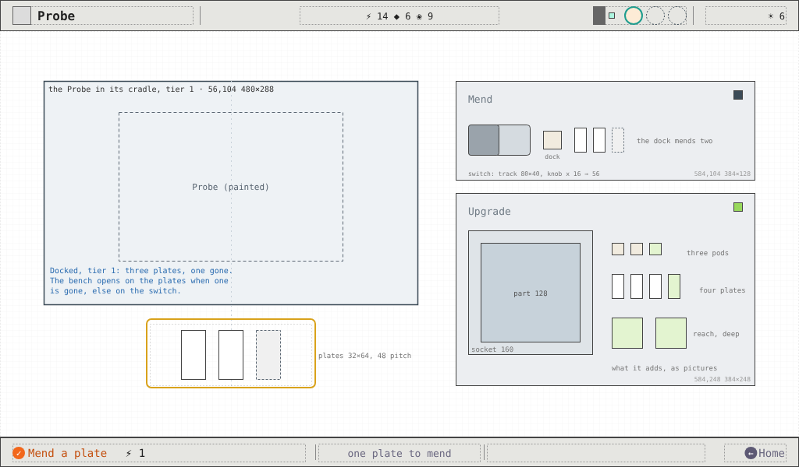

*11. Docked, tier 1, one plate gone: the ring on the plates, `✓ Mend a plate   ⚡ 1`; the switch off, its picture showing the dock mending two plates.*

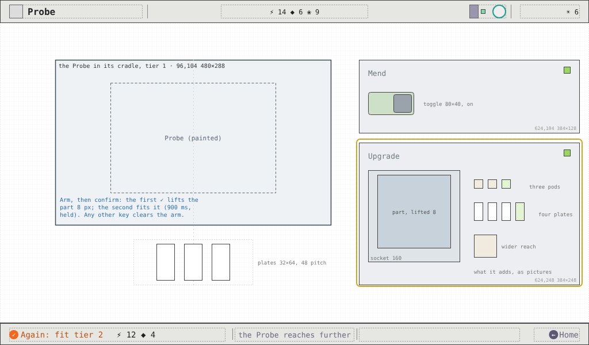

*11b. The upgrade armed: the part lifted 8 px out of its socket, `✓ Again: fit the upgrade   ⚡ 12 ◆ 4`.*

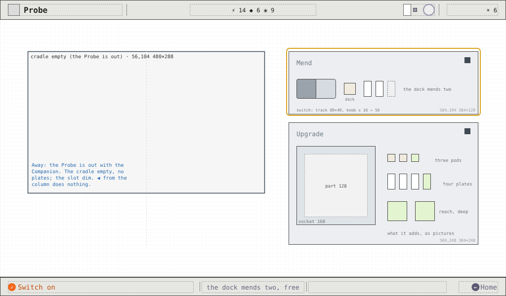

*11c. Away: the cradle empty, no plates, the slot dim; the ring on the switch, which is set at any time.*

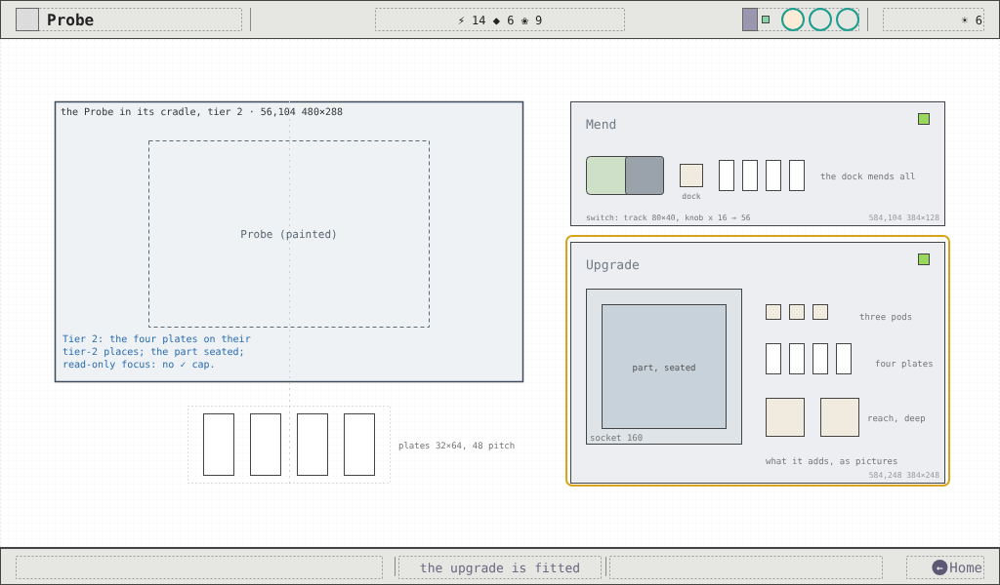

*11d. The upgrade fitted: four plates whole on their places, the part seated, no ✓ cap on the slot.*

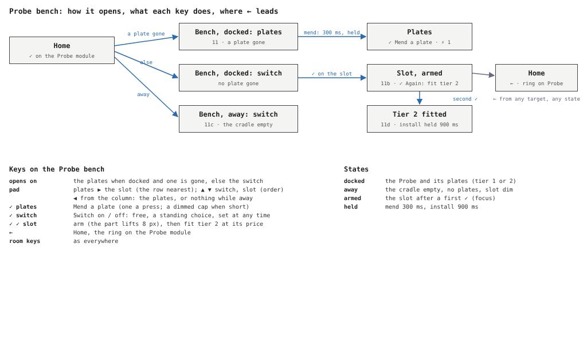

*11e. The bench's map: where it opens, what each key does, where ← leads.*

### 1. Purpose

The Probe bench is where the player keeps the Probe ready for the next expedition: mends its Shield plates, sets whether the dock mends every plate, and fits the upgrade. The player comes away knowing, from the plates alone, how whole the Shield is, and what the upgrade would add.

### 2. Elements

| Element | Why it is here |
| --- | --- |
| **The Probe in its cradle**, large | The subject: the device the Companion carries out, at rest on its bench |
| **The Shield plates**, standing under it | The Shield's state with no words: whole or gone, the tier's count |
| **The Mend module**: the switch, a picture of what it means (the dock, then the plates it leaves whole), a lamp | The standing choice: the dock mends every plate at its price, or two free |
| **The Upgrade module**: the socket, the part, what it adds as pictures, a lamp | The upgrade: whether it can be fitted, and what it brings |
| **Bottom line** | Mend a plate, switch, fit, each with its price; the context in words |

**Not on the stage:** "tier 1 · 2 of 3 plates", "Mend fully on docking", the price, "armed · ✓ again installs", "The Probe is away". The plates, the switch and its picture, the part and the empty cradle show them; the words are the bottom line's.

### 3. Placement

**Reading order:**

1. **The Probe in its cradle**, left of centre, on the axis x 296.
2. **The plates** under it.
3. **The Mend module**, top right.
4. **The Upgrade module** under it.

The cradle and the column form one group centred on x 512, from 56 to 968.

### 4. Art direction

- **Room:** the research bench, a modern digital lab: a cool key light from the top left, as on Create and the Incubator; the Probe is the brightest object. No warm field on this screen.
- **The Probe** is the same device the Companion draws, painted at the bench's size, one picture a tier. Away, the cradle is drawn empty, so the Probe reads as out, never missing.
- **Plates** read as the Companion's Shield plates: white when whole, an outline when gone.
- **No amber:** a worn plate or an affordable upgrade is a choice, not a need. The lamps are on (`sprout`) or off.

**Colour roles** (the one home is `bench.json` `colours`; every object is a painted master, `bench.json` `masters`):

| Region | Roles | Why |
| --- | --- | --- |
| Modules | `panel` fill, `hairline` edge, `bevel` top, the word `metal`; lamps off `hairline`, on `sprout`, rim `void` | Home's modules |
| Plates, switch, socket, part, the pictures of what it adds | Painted masters, each at its size | Never drawn by the build |

### 5. Composition

| Region | Rectangle | Notes |
| --- | --- | --- |
| **Cradle (focal)** | 56, 104, 480, 288 | The Probe standing in its cradle, one painted picture a tier; away, the empty cradle. Axis x 296; first ink at y 108 |
| Plates | 192, 416, 208, 80 | Plates 32×64 at y 424 on a 48 pitch: tier 1 at x 232, 280, 328; tier 2 at 208, 256, 304, 352; centred on x 296; one sprite a place. Never a ghost for a plate the tier does not have. The region is the focus target's box |
| Mend module | 584, 104, 384, 128 | Word at (16, 12), lamp at (356, 12). The switch at (16, 56): its track 80×40 (off or on), its knob 40×40 at x 16 (off) or 56 (on). Its meaning: `mark-dock-24x24` at (112, 64), then the tier's plates as `icon-shield-16x32` from (152, 60) on a 24 pitch; off, the first two whole and the rest `icon-shield-gone-16x32`; on, all whole |
| Upgrade module | 584, 248, 384, 248 | Word at (16, 12), lamp at (356, 12); the socket 160×160 at (16, 48) with the part 128×128 at (32, 64) (armed, at (32, 56)). What it adds: three pod icons 16×16 on a 24 pitch at (200, 64), four plate icons 16×32 at (200, 104), the reach 40×40 at (200, 160) and the deep read 40×40 at (256, 160); the one each adds over tier 1 in its `-new` picture |

Each module's objects start 8 px or more under its word's baseline (y + 28).

**Regions and their words.** States: **docked** and **away**.

| Region (`bench.json`) | Rectangle | Word or build | Only in | States it shows |
| --- | --- | --- | --- | --- |
| `bench` | 0, 40, 1024, 522 | frame, part stage (`room-bench-stage-probe`; until it lands, `room-bench-stage-collection`) | | — |
| `cradle` | 56, 104, 480, 288 | specimen (focal) | | tier 1, tier 2, empty |
| `plates` | 192, 416, 208, 80 | build `shieldPlates` (one sprite a place, the places by tier) | docked | each plate whole or gone; a plate seating |
| `switch` | 584, 104, 384, 128 | panel, build `module` | | off, on |
| `slot` | 584, 248, 384, 248 | panel, build `module` | | dim, ready, armed, fitted |

**Draw order:** bench, cradle, plates, switch, slot, ring, frame, message plate.

### 6. Interactions

| Input | What happens, and how it shows |
| --- | --- |
| Pad | Moves the ring by the bench's focus (below) |
| ✓ on the plates | A plate gone: `✓ Mend a plate   ⚡ 1`, the context "one plate to mend": the first gone plate from the left seats (300 ms, held). Short: the frame's dimmed cap. Every plate whole: no ✓ cap, "every plate whole" |
| ✓ on the switch | `✓ Switch on` or `✓ Switch off`, no price: the knob slides from x 16 to 56 (200 ms), the picture's plates and the lamp change; the context "the dock mends all" (on) or "the dock mends two, free" (off). Set at any time, docked or away |
| ✓ ✓ on the slot | Docked, tier 1, affordable: `✓ Fit the upgrade   ⚡ 12 ◆ 4`, "the Probe reaches further": the first ✓ arms (the part lifts 8 px, `Again: fit the upgrade`), the second fits it (900 ms, held). Short: the dimmed cap. Away: no ✓ cap, "dock the Probe first". Fitted: no ✓ cap, "the upgrade is fitted" |
| Any key but ✓ | Clears the arm |
| ← | Home, the ring on the Probe module |

### The bench's focus as data

`bench.json` `focus` replaces `bench.mjs` `benchTargets` and `navSpatial`. Targets: `plates` (group `plates`, docked only), `switch` and `slot` (group `module`), each with the `round` ring.

| From | ◀ | ▶ | ▲ | ▼ |
| --- | --- | --- | --- | --- |
| `plates` | none | `nearestIn: module` (the slot, the row nearest) | none | none |
| `module` (`order: [switch, slot]`) | `plates`, else none | none | the previous in the order | the next in the order |

**Opens on** the plates when the Probe is docked and a plate is gone, else the switch. **Rings:** round, 4 px outside each region, with the 2 px chrome lift. **Held:** while a mend or the install holds, the face moves no focus and sends no intent.

### The bench's states and events

- **Docked:** the Probe in its cradle with the tier's plates. The tier and the slot's arm are props of this state.
- **Away:** the Probe is out with the Companion: the cradle empty, no plates, the slot dim; the switch still works.

| Event | Hold | What plays |
| --- | --- | --- |
| `mend` | 300 ms | The first gone plate seats, gone → whole (a 16-level dither between its two pictures); the counter ticks the price |
| `switch` | no | The knob slides from x 16 to 56 (or back) over 200 ms in whole pixels; the picture's plates and the lamp change at the end |
| `install` | 900 ms | 0 to 300: the part drops 8 px into the socket; the counters tick. 300: the cradle's picture cuts to tier 2 and the plates move to the tier-2 places, whole. 300 to 600: the fourth plate seats. 600 to 900: what it adds draws full; the lamp steadies |

With `motion: false` every event jumps to its end.

### Placeholders on the Probe bench

| Master | Pixel size |
| --- | --- |
| `room-bench-stage-probe` | 1024×522 |
| `bench-probe-t1-480x288`, `bench-probe-t2-480x288`, `bench-cradle-empty-480x288` | 480×288, rows 0 to 3 kept empty |
| `bench-plate-whole-32x64`, `bench-plate-gone-32x64` | 32×64 |
| `bench-switch-track-off-80x40`, `bench-switch-track-on-80x40`; `bench-switch-knob-40x40` | 80×40; 40×40 |
| `mark-dock-24x24` | 24×24 |
| `icon-shield-16x32`, `icon-shield-16x32-new`, `icon-shield-gone-16x32` | 16×32 |
| `icon-pod-16`, `icon-pod-16-new` | 16×16 |
| `bench-socket-160` | 160×160 |
| `bench-part-t2-dim-128`, `bench-part-t2-ready-128`, `bench-part-t2-fitted-128` | 128×128 |
| `bench-reach-t2-40`, `bench-reach-t2-40-new`, `bench-deep-t2-40`, `bench-deep-t2-40-new` | 40×40 |
| The lamps, on (`sprout`) and off | 12×12 |

Where the build departs from this layout is listed in `bench.json` `buildChanges`.

### Not designed yet

- The journey has no capture of the bench; the gate's region and pixel checks need one for each state.

---

## Library spread

Concept plate: `art/concept-station/library-spread/placed/SP-P-r4-a1-pip-named-1024x600.png`. Wireframe: [07-library-spread.svg](station-layouts/07-library-spread.svg).

*Library spread. Wireframe, layout only, measured.*

### 1. Purpose

The spread shows the whole collection at a glance, as plates in a naturalist's volume. The player comes away knowing which species they have found, which they have only met, and that empty frames remain, and can open any found or met species' Book.

### 2. Elements

| Element | Why it is here |
| --- | --- |
| **Sixteen ruled frames**, eight a page, two rows of four | One place per species, all seen at once |
| **Found plate** (a tipped-in painted plate), **met study** (pencil), **unmet** (empty, no cue) | The three states of knowledge, told apart by craft rather than words |
| **Names** on caption rules, 16 px | Found in ink, met in pencil grey, unmet nothing |
| **Clan rule**, 4 px inked band over each met frame | The clan, by colour on the ink and never on unmet frames |
| **Margin life** (a leaf and seeds, a dried flower, a survey sketch, the cloth marker) | The tome's character, never over a frame |
| **Page-turn corner** | That more species wait on the next spread, without "1 of 2" |

**Not drawn:**

- "spread 1 of 2 · ◀ ▶ past the edge turns it": the corner says it.
- Diagonal hatching for "met": a pencil study shows it.
- Rules thicker than 1 px.

### 3. Placement

**Reading order:**

1. **The found plates**, the only colour on the page, in the order species were found.
2. **Their names.**
3. **The met studies.**
4. **The empty frames**, as a quiet grid that promises more.
5. **The margins.**

**At the edges:** the page-turn corner at the bottom right, the cloth marker over the gutter.

### 4. Art direction

- **Room:** the Library, an old botanical-expedition volume in ink and watercolour, with aged foxed paper, worn boards and restrained ornament.
- **The plates are painted** at Pip's level of craft (Loika is the placed Pip). They are never flat cards or stickers.
- **Device type on the chrome:** Inter, never a serif. Nothing childish: no lanterns, scrollwork or ribbons.
- **No living window:** the plates' own warmth is the only warmth.

### 5. Composition

The open book fills the stage. Each page holds a 4 × 2 grid of frames with a 16 px gutter between frames, a 24 px margin to the page's edge, and the margin life in the band under the second row.

| Region | Rectangle | Notes |
| --- | --- | --- |
| Book (boards) | 8, 48, 1008, 504 | |
| Left page | 24, 56, 480, 488 | |
| Right page | 520, 56, 480, 488 | Gutter 504 to 520 |
| Frame columns | x 48, 160, 272, 384 (left page); 544, 656, 768, 880 (right page) | Each 96 wide on a 112 px pitch |
| Frame row 1 | y 112, 96×112 | Clan rule 96×4 at y 100; name 16 px in (x − 8, 232, 112, 20); caption rule 96×1 at y 256 |
| Frame row 2 | y 296, 96×112 | Clan rule at y 284; name at y 416; caption rule at y 440 |
| **Found plate (focal)** | inside the frame, 8 px mat: 80×96 | Rendered or downsampled to 80×96; never enlarged |
| Met study | 80×96 | Grey pencil line |
| Focus | frame outset 4 with the 6 px radius: 104×120 | Thin rounded rectangle in `rust`, the ring on paper (frame.json `focus.ring.onPaper`); the frame lifts 2 px |
| Margin life | 40, 464, 448, 72 and 536, 464, 400, 72 | Never over a frame or a caption |
| Cloth marker | 500, 48, 24, 264 | Over the gutter |
| Page-turn corner | 968, 512, 24, 24 | Shown only when another spread exists |

### 6. Interactions

| Input | What happens, and how it shows |
| --- | --- |
| ◀ ▶ | Along a row, across the gutter to the other page; past the right edge with another spread, the page turns (300 ms) |
| ▲ ▼ | Between the two rows |
| ✓ on a found or met frame | `✓ Open`: the plate lifts off the page and becomes the Book's mounted plate (300 ms) |
| ✓ on an unmet frame | No ✓ cap; the subject says "an empty frame"; a message plate on press |
| ← | Home |

### Placeholders on the spread

| Thing | Pixel size | Notes |
| --- | --- | --- |
| Found plate | 80×96 | The species' placeholder; the accepted Pip for Loika, downsampled |
| Met study | 80×96 | The index pass in grey line |
| Paper | 1008×504 | Flat paper |

---

## Book

Concept plate: `art/concept-station/library-book/placed/BK-D-r2-a1-stamped-named-1024x600.png`. Wireframe: [08-library-book.svg](station-layouts/08-library-book.svg).

*Book. Wireframe, layout only, measured.*

### 1. Purpose

The Book is each species' field guide: its face, the looks found so far, its lineage and its wishes. The player comes away knowing what the species is like, which looks they have seen and which are still to find ("more?"), and who is related to whom.

### 2. Elements

| Element | Why it is here |
| --- | --- |
| **The face** (or, once a mibi has sat, the portrait): a resident at 304×312 doing its habit, mounted as a framed plate | The subject; the species alive |
| **Name label** (28 px) and **habit line** (16 px) | What it is and what it does, in two lines |
| **Place stamps** (40×40) and **the frame plate** (104×144) | Where it lives and its body plan, as pictures |
| **The clarity line** (16 px), under the habit line | That the face is the species' type, not one of the player's mibis |
| **Page-turn corner** | That the guide waits on the fold-out second spread (Book: the guide spread) |
| **Stamp label** (120) | The face's stamp: the type specimen's (`frame.typeSpecimen`), with no mibi name under it, until a portrait; then the portrayed mibi's |
| **Family tree** panel (184×160) | Lineage, read without text |
| **Pinned wish** (184×112) | The wish, as a plate of its looks |

**Not drawn:**

- Text lines of looks ("Coat: plain, … · more?"): looks are plates, on the guide spread.
- A "clan … · 4 chapters" line under the name: the clan shows on the spread's rule, and the chapters on the guide spread.
- Lanterns at the page corners (storybook).
- Chapter tabs or look plates: they are on the guide spread.

### 3. Placement

**Reading order:**

1. **The face** on the left page, the one warm, living thing.
2. **Its name label.**
3. **The clarity line**: the species, not one of yours.
4. **The page-turn corner**, the way to the guide.
5. **The stamp, the tree and the wish** at the right edge.
6. **The places and the frame plate** between the face and the gutter.

### 4. Art direction

- **Room:** the Library tome.
- **The face is warm.** The archive is cool and evenly lit on aged cream.
- **The look plates are pressed specimens** in the book's plate style.
- **Consistent case** in every label, Inter on the chrome, nothing childish.

### 5. Composition

The book is open across the stage. On the left page: the face's mat, with the name label and habit line under it, and the places and frame plate in a narrow column beside it. On the right page: the stamp, tree and wish stacked at the right edge, and the page-turn corner at the foot; the tabs and the trait column are on the guide spread.

| Region | Rectangle | Notes |
| --- | --- | --- |
| Book, left page, right page | as the spread | |
| Mat | 40, 72, 320, 328 | |
| **Face or portrait (focal)** | 48, 80, 304, 312 | Mounted as a framed plate. A "released" mark at the plate's foot for a portrayed mibi that went back to the wild |
| Name label | 88, 408, 224, 40 | 28 px, centred on x 200 (a name is the 28 px role) |
| Habit line | 48, 456, 304, 20 | 16 px, centred |
| Clarity line | 48, 480, 304, 20 | 16 px `stone`, cap top at y 480, centred on the face plate: x 180 on the build stub's plate (30, 60, 300, 330), x 200 once the M5 face spread lands. With no portrait: "A typical Belatz, not one of yours." With a portrait: "Fig, your Belatz, sat for this."; released: "Fig sat for this, now in the wild." (`faceOf`; library.json `faceSpread`) |
| Place stamps | 376 + 48c, 80 + 48r, 40×40 | Up to four, in two rows |
| Frame plate | 376, 192, 104, 144 | |
| **Stamp label** | 832, 112, 120, 120 | At this rect, never the stub's 112 at (886, 406); the type specimen's stamp with no mibi name until a portrait |
| Family tree | 800, 248, 184, 160 | Empty ruled panel until M4 |
| Pinned wish | 800, 424, 184, 112 | Empty ruled panel until the wish exists; `wish-mark-24` at (808, 432). The stamp label shows the type specimen's stamp until a portrait, then the portrayed mibi's |
| Page-turn corner | 968, 512, 24, 24 | `book-corner-turn-24x24`, a new master; only when `book(st, id).guide` is not null (the species found). Until it is signed, the stand-in is "▶" 16 px `bark` centred in the slot, under the same condition. Nothing else overlaps this rect |

### 6. Interactions

The build stub has ← only; the rest arrives with M5.

| Input | What happens, and how it shows |
| --- | --- |
| Pad | Spatial: face, places, frame plate, stamp, tree, wish. ▶ from the right-most target turns to the guide spread (300 ms) |
| ✓ on the face | `✓ Visit Fig` opens Habitat only when `faceOf(st, id)` is a living mibi (a portrait whose mibi is not released). The type face and a released portrait have no ✓ cap |
| ✓ on the wish | `✓ Find a pair` (M4) |
| ✓ on "more?", the stamp or the tree | Read-only: no ✓ cap |
| ← | The spread: the way back reads "← Library" |

### Placeholders on the Book

| Thing | Pixel size |
| --- | --- |
| Face | 304×312, in the standard look until a portrait |
| Look plates | 56×56 or 40×40 (rendered close-ups) |
| Place stamps | 40×40 |
| Frame plate | 104×144 |
| Tree and wish | Empty ruled panels |

---

## Book: the guide spread

Spec: [`library.json`](../../prototypes/ui/specs/station/library.json), the one home of these numbers. Wireframes: [10a-library-guide-seven.png](station-layouts/10a-library-guide-seven.png) (S09 Belatz, seven chapters, one sealed) and [10b-library-guide-eight.png](station-layouts/10b-library-guide-eight.png) (S03 Tuikis, eight chapters).

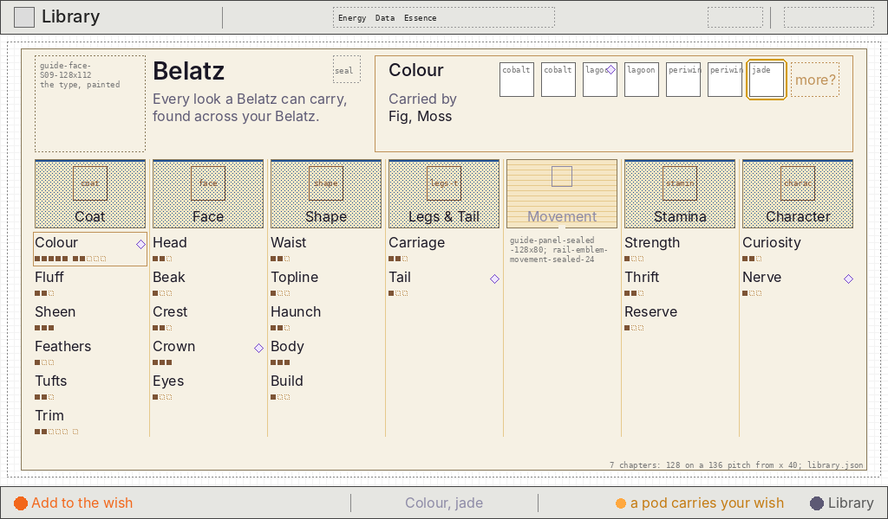

*The guide spread, seven chapters (S09 Belatz), 1× wireframe.*

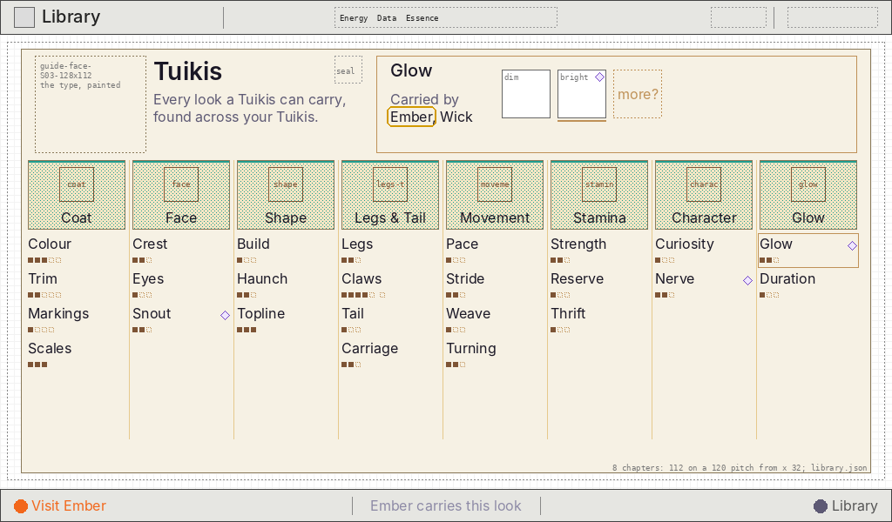

*The guide spread, eight chapters (S03 Tuikis), 1× wireframe.*

The field guide is the Book's fold-out second spread, turned with ◀ ▶ from the face spread, and ← reads "Library" on both; eight chapters fit by narrower columns, never by a scroll; one header panel per chapter, shared by every species and tinted by the species, calm on paper; the face is a painted `guide-face` master, never the halo; the progress pips come in groups of five.

### 1. Purpose

The guide shows the species whole: every chapter at once, every trait with how many of its looks the player has found, and, for the trait in focus, the looks themselves and which of the player's mibis carry them. The player comes away knowing what is left to find, and where to go to see a look alive.

### 2. Elements

| Element | Why it is here |
| --- | --- |
| **The face** (`guide-face-<SNN>-128x112`), the **name** (28 px) and the **species line** (16 px, two lines) | Whose guide this is: the species, filled in by every one read |
| **One column per chapter**, headed by its **panel** (`guide-panel-<chapter>-<w>x80`, tinted by the species) with the chapter's word | The chapters all at once, a picture naming each before its word |
| **A trait cell** per trait: its word and **one pip per look**, filled found, dotted unseen, in groups of five | Progress on every cell, without a digit |
| **A sealed chapter**: a shut panel with its notch, no traits | Locked against found, at a glance |
| **The detail band**: the open trait's word, its found looks as plates and one dashed "more?" slot, and "Carried by" with your mibis' names | The one place that carries the words; the door to one mibi |
| **Wish marks** (`wish-mark-12`) on a pinned trait and its plate | The wish, where it was pinned |
| **The seal** (`guide-seal-32`) beside the name | The guide complete; absent until then |

**Not drawn:** chapter tabs or trait rows, one chapter at a time; a pinned-wish panel (the wish is on the face spread); the halo as the face.

### 3. Placement

**Reading order:** the face and the name; the species line; the chapter panels; the cells and their pips; the detail band; the seal.

**At the edges:** the page-turn corner on the face spread leads here; ◀ from the first column turns back.

### 4. Art direction

- **Room:** the Library tome, a fold-out plate across the gutter: one sheet, no gutter, no cloth marker (`library-foldout-1008x504`).
- **Calm.** One paper field; colour only in the panels' tint, the plates and the face. No connectors: traits and chapters have no order, and lines would invent one.
- **The panels are shared.** One ink master per chapter, the emblem engraved at 40×40 at the top centre, its ground open; the species' colour comes from the build's tint, never a panel per species per chapter.
- **The face** is the species' type, painted for the guide at 128×112 from the type specimen, head and shoulders on the plate's own ground; never the Pods halo, which disappears on paper.
- **Nothing childish.** Inter on everything; no ornament, no game-reward chrome.

### 5. Composition

| Region | Rectangle | Notes |
| --- | --- | --- |
| Boards | 8, 48, 1008, 504 | |
| Fold-out | 24, 56, 976, 488 | `library-foldout-1008x504`. This edge box is only the registered stand-in for that master while it is unsigned |
| **Face** | 40, 64, 128, 112 | `guide-face-<SNN>-128x112`, placed 1:1 |
| Name | 176, 64, 200, 36 | 28 px semibold `ink` |
| Species line | 176, 104, 248, 40 | 16 px `stone`, two lines on 20: "Every look a Belatz can carry," / "found across your Belatz." (the plural is the frame's `species.plural`) |
| Seal | 384, 64, 32, 32 | `guide-seal-32`, only when `fieldGuide().complete` |
| Detail band | 432, 64, 552, 112 | 1 px `clay` edge, no fill |
| Open trait | 448, 68, 120, 28 | 20 px medium `ink` |
| Carried by | 448, 104, 120, 60 | "Carried by" 16 px `stone`, cap top y 104; then the names 16 px `ink`, joined by ", ", on at most two lines with cap tops at y 124 and 144, inside x 448 to 568. When they overflow, "and more" (16 px `stone`) ends line 2 with no comma before it, and names are dropped from the end until it fits; never a third line. "none of yours yet" when none. Each name is a focus target |
| Plates, up to six slots | from 576, 80: 56×56 on a 64 pitch | `trait-<SNN>-<trait>-<look>-56x56`; the found looks in the frame's order, then the dashed "more?" slot (a 1 px `clay` edge, 2 on and 2 off) when looks are unseen |
| Plates, seven slots or more | from 576, rows at y 72 and 120: 40×40 on a 48 pitch, eight a row | `…-40x40`; the "more?" slot 56×40 so its word stays whole. Ten looks and "more?" (S09 Colour) take one row of eight and one of three |
| Plate keyline | x − 1, y − 1, w + 2, h + 2 | 1 px `bark` round every look plate, at 56 and at 40, drawn by the build whether or not the plate's master is signed. None on "more?", the face or the panels. `bark`, because `clay` means open state. 1 px of paper stays between it and the open rule and between it and the ring |
| Open look | a 2 px `clay` rule 2 px under its plate (y + h + 2) | The look "Carried by" names: the plate under the ring, or the last one it was on; on arrival the pinned look, else the first found. The ring on that plate may cover its rule |
| Columns, one to seven chapters | 128 wide on a 136 pitch, from x0 | x0 = ⌊(512 − (136n − 8) / 2) / 8⌋ × 8: 40 for seven |
| Columns, eight chapters | 112 wide on a 120 pitch, from x 32 | 952 px; never a scroll. More than eight is not designed yet |
| Column rules | x0 + pitch × i − 4, y 184 to 504 | 1 px `sand` |
| Panel | x, 184, w, 80 | See the tint rule below; the chapter's word 16 px `ink`, centred, at y 240: pods.json `strings.legsTail.heading` for legs-tail, otherwise the frame's `chapters[].name` as written; the build never recases |
| Trait cell | x, 272 + 40r, w, 32 | The word 16 px `ink`; `wish-mark-12` at (x + w − 12, y + 4) when a look of it is pinned; the pips at y + 24. At most six rows (S09 Coat), the sixth ending at y 504 |
| Pips | 6×6 on an 8 pitch, 4 px more between groups of five | Pip k at x + 8k + 4⌊k / 5⌋. Found: a `bark` rect. Unseen: `guide-pip-unseen-6x6`. Ten looks take 84 px, inside the 112 column |
| Open cell | x − 2, y − 4, w + 4, 40 | 1 px `clay` edge: the trait in the detail band; the ring sits on top of it when it has the focus |

**The tint rule.** The build fills the panel with `paper`, then sets one pixel in eight in the species' colour: inside the panel, counted from its own origin, every pixel whose (x mod 4, y mod 4) is (0, 0) or (2, 2), from y 3 to 78 and x 1 to w − 2. A 2 px band of the full colour runs across the top, inside the edge, the Library's inked-rule idiom. Then the chapter's master is placed 1:1 over it. The colour is the species' first pod pigment (`frame.pod.colourPair[0].pigment`) through the palette map in `cross.json` (`colours.pigmentChips`): S09 cobalt is `sea`, S03 lagoon is `teal`; a pigment not listed tints `mist`. One in eight of the pigment's own colour stays calm on paper; a denser lattice of a lighter step reads loud.

**A sealed chapter** (`chapter.sealed`, the chapter still shut): `paper` with no tint, the master `guide-panel-sealed-<w>x80` (slats and an 8×4 notch at the bottom centre), the existing `rail-emblem-<chapter>-sealed-24x24` at (w / 2 − 12, 8), the word in `mist`, and no cells. Its looks count as unseen (`fieldGuide`).

### 6. Interactions

| Input | What happens, and how it shows |
| --- | --- |
| Arrive | The ring on the first trait cell of the first chapter that is not sealed; the same after a jump from Pods or Habitat |
| ◀ ▶ in the grid | The same row in the next column that is not sealed, clamped to its last row. ◀ from the first column turns back to the face spread (300 ms) |
| ▲ ▼ in the grid | Along the column; ▲ from the first row to the detail band's first plate |
| ◀ ▶ in the band | Along the plates; ◀ from the first plate to the last carrier name; ▼ back to the open cell |
| ✓ on a cell or "more?" | Read-only: no ✓ cap. The context: "Colour, more to find" or "Colour, every look found" |
| ✓ on a plate | `✓ Add to the wish` (`wishPin`, when `wishPinBlock` is empty), or `✓ Take it off the wish` (`wishUnpin`) when that look is pinned. The context: "Colour, jade" |
| ✓ on a carrier name | `✓ Visit Fig`, the context "Fig carries this look": a jump to Habitat on that mibi, where ← reads Home |
| The notice | "a pod carries your wish" when `wishCarriers(st, id).pods` is not empty; otherwise none |
| ← | "← Library", from either spread |
| The ring | `rust` on the paper (frame.json `focus.ring.onPaper`), the same geometry, on the Library, the face spread and the guide spread |

### Bound to the rules

Every field comes from `prototypes/station/src/library.mjs` and the frame; nothing is new state (library.json `derived`):

- The columns, cells and pips: `fieldGuide(st, id)`, its chapters in frame order, each trait's `possible` (the frame's own player words), `found` and `more`; a shut sealed chapter's `sealed`.
- The seal: `fieldGuide().complete`. The guide exists only when `book(st, id).guide` is not null (the species found).
- The wish marks and actions: `wishOf`, `wishPinBlock`, `wishPin`, `wishUnpin`; the notice: `wishCarriers`.
- "Carried by": the mibis of the species, not released, whose read chapters hold the trait's chapter and whose `chapterLooks` give the look: the test `wishCarriers` already applies to pinned looks, generalised to any look and exported beside it as a pure function. Pods are not listed.
- The face spread's clarity line: `faceOf`; its ✓ Visit only when `faceOf(st, id)` is a living mibi, with no ✓ cap for the type face.

### Masters for the guide

Placed 1:1 at these sizes, never scaled or recoloured.

| Id | Size | What |
| --- | --- | --- |
| `library-foldout-1008x504` | 1008×504 | The fold-out sheet: boards and one page across the gutter |
| `guide-panel-<chapter>-128x80` | 128×80 | One per chapter, shared by every species: coat, face, shape, legs-tail, movement, stamina, character, glow, charge (nine). Edge, faint grain, the ink emblem 40×40 at (44, 8), open ground for the tint |
| `guide-panel-<chapter>-112x80` | 112×80 | The same nine at the eight-chapter width, the emblem at (36, 8), painted at 112 |
| `guide-panel-sealed-128x80`, `guide-panel-sealed-112x80` | 128×80, 112×80 | A shut panel: slats and the 8×4 notch; no tint |
| `guide-face-<SNN>-128x112` | 128×112 | One per species, S01 to S16: the type, head and shoulders, painted from the type specimen |
| `guide-seal-32` | 32×32 | The guide complete |
| `book-corner-turn-24x24` | 24×24 | The face spread's page-turn corner at (968, 512), only when the species has a guide. Stand-in until signed: "▶" 16 px `bark` centred |
| `guide-pip-unseen-6x6` | 6×6 | A dotted hollow pip in `clay` |
| `wish-mark-12` | 12×12 | A pinned look, on its cell and its plate |
| `wish-mark-24` | 24×24 | The pinned wish panel's corner, on the face spread |
| `mark-guide-16` | 16×16 | In `bone`, for chrome: after the species word on Habitat's card |
| `trait-<SNN>-<trait>-<look>-56x56`, `…-40x40` | 56×56, 40×40 | The look plates, rendered at their size |
| `rail-emblem-<chapter>-sealed-24x24` | 24×24 | Existing; on the sealed panel |

The tint has no master: the build draws it from the palette. Nor do the plates' `bark` keylines, the dashed "more?" edge, or, while their masters are unsigned, the fold-out's edge box and the ▶ stand-in.

---

## Cross: the splice

Wireframes, 1×: [09a-cross-overview.png](station-layouts/09a-cross-overview.png) and [09b-cross-chapter.png](station-layouts/09b-cross-chapter.png), with 2× crops [09a-cross-overview-2x.png](station-layouts/09a-cross-overview-2x.png) and [09b-cross-chapter-2x.png](station-layouts/09b-cross-chapter-2x.png). Numbers: [`prototypes/ui/specs/station/cross.json`](../../prototypes/ui/specs/station/cross.json), the one home of the Cross numbers; this section says what they mean.

- The splice is the body of the Cross screen. ✓ reads "Cross them".
- The Cross shows only what the player has read, and an indication of everything missing. The forecast marks a trait `missing` with the parent and chapter to read (`forecastOf`); the splice draws that mask as it is. The splice draws no copy, look, seed or range of a chapter either parent has not read, and nothing of a sealed chapter but its find.

*A · Overview: every locus at play at once, grouped by chapter. Two S09 Belatz half-siblings, Wisp and Rook (kinship an eighth); Rook's Shape and Legs & Tail are unread, and Movement is sealed. 1× wireframe on the bench's ground. Boxes with ids are masters; the rest is rect, text and 1 px lines.*

*B · Chapter view: Coat's loci routed from both parents to the child, under the shared rail. 1× wireframe.*

### 1. Purpose

The player reads a cross the way a circuit diagram reads a running machine. Each parent's copies leave it as wires, and a gate at every locus splices them. The child's outcomes sit between the parents.

At a glance, the player sees:
- which loci are at play and which are settled;
- which copy each parent can pass, including the copies it hides, once read;
- where kinship narrows a range or lets a hidden look surface;
- which pinned traits a child can reach;
- what is still unread, and whose chapter to read.

The reference lends principles only: modules in columns, values carried and printed on wires, a colour per signal kind, one direction of flow, and a bus that gathers bits. Its art and look are never copied.

### 2. Elements

| Element | Meaning |
| --- | --- |
| **Heads** | Wisp (the pick, left) and the partner (right, the focus ring; ◀ ▶ picks one) as 48×48 portraits with name and line; between them the ghost of the child to be and the kinship pill (`amber`, the kinship word, always shown) |
| **Modules** | One per chapter on each side, the chapter's word in it; an unread chapter's module is dashed `frostS`, a sealed one slatted |
| **Wires** | A locus's two copies, one wire each, from the parent to its gate. Switch `lilac`, blend `aqua`, settled `bevel`, unread `frostS` dashed, sealed `hairline` dotted. A copy the parent hides (known, because it was read) is dashed |
| **Gates** | The splice: the switch gate passes one copy of two; the blend gate mixes the two into the parent's shown value. Masters, never drawn |
| **The child** | A switch ends in four seeds (quarters, never odds); a blend ends in a track across the locus's range with both parents' ticks and the stretch where the child can land |
| **Kinship marks** | `amber`: the range before kinship narrowed it, dashed round the narrowed one; a corner on each seed where a hidden look can surface |
| **Wish marks** | A glint on a pinned trait, lit when a child can show the pinned look, hollow when not; a `yellow` edge on the seed or end that shows it |
| **Missing** | A `frostD` band in the child's column, "read Rook's Shape"; the unread side's wires as frost hairlines with no words |
| **Sealed** | Slats and the find; "sealed · a tide pearl" |

### 3. Placement

- **Overview.** Heads at y 48 to 96. Rows from (16, 112), 440 tall. Wisp's modules are 112 wide at x 16 and Rook's at x 896. The gates are at x 340 and x 676. The child's column runs from x 376 to 648, with the blend track from x 392 to 616, the four 8×8 seeds centred on x 512 and the wish glint at x 628.
- **Chapter view.** The shared chapter rail hangs from y 40, centred: compact tabs with the open chapter's tab full, as on Pods, Create and the Incubator. Heads sit at y 104 to 152 and rows run from y 160 to 552.
  - **Wires and plates.** Each copy's look is printed on its wire in a plate: Wisp's start at x 32 and Rook's end at x 992. The wires turn at x 304 and x 718 into the 16×16 gates at x 312 and x 696.
  - **The child's column.** It runs from x 368 to 656: the trait's name line at the top, then four 64×32 seed pictures on a 72 pitch, or the two 64×32 end pictures with the 136 px track between them.
- **Trait rows.** A row is 64 tall, plus 8 for each further locus of the trait; the trait's loci run as one bus per copy.

### 4. Art direction

The instrument's cool, even light, on the bench's ground. The wires are crisp 2 px rects, so the chrome stays flat. Only the gates, ticks, wish glints, the kin corner and the finds are painted masters. Seed and end pictures are the trait pictures, rendered at 64×32, never scaled. Never childish: no faces on gates, no sparkles on wires, no cartoon arrows.

### 5. Composition and density

- **Overview rows** (a minimum, not a legend). A locus at play gets a row of 16 px, which may drop to 10 so the species fits, and never lower. Settled loci, loci of an unread chapter and sealed loci fold to 4 px hairlines. A chapter is at least 24 tall. The gap between chapters is 8, then 4 if needed.
  - With every locus at play, the worst case of the sixteen frames is S03 Tuikis (40 loci, 8 chapters): 436 of 440 at 10 px with 4 px gaps.
  - Belatz with this pair fits at 16 px.
- **No legend on the screen.** Labels are one word, and never a text page. The chapter view is where the kinds are learned: there every wire carries its look in words. The overview keeps only what differs: colour where the locus is at play, grey where settled, frost where unread, slats where sealed.
- **Tall chapters.** Of the sixteen frames, the tallest chapter is S02 Untuva's Coat, at 376 of 392; S09 Belatz's Coat is 392.
- **No promise.** The child's actual draw is never shown. There are no odds, percentages or counts, and no letters or ratios for a copy.

### 6. Interactions

| Input | What happens |
| --- | --- |
| ▼ | The next state: from the overview, the first chapter; then each chapter in ring order. On the last chapter, nothing |
| ▲ | The previous state; from the first chapter, the overview |
| ◀ ▶ | The previous or next partner (`crossPartners`). The wires re-route at once and the state is kept. The ring stays on the partner's head |
| ✓ | `✓ Cross them   ⚡ 2 ❀ 4`, exactly as the line says; a jump to the Incubator. A refused pair has no ✓ cap, and the reason is the notice |
| ← | Habitat |
| A room key | Drops the unpaid choices; coming back opens fresh on the overview |

**The bottom line.** It reads `✓ Cross them · price` | "Wisp × Rook · Belatz" on the overview, or "Coat · Wisp × Rook" on a chapter | the notice | `← Habitat`.
- The notice is the first missing read in ring order, "read Rook's Shape" (or "read both parents' Shape"). Leading with the missing read draws the player back to research.
- With nothing missing, the notice is the kinship word if the kinship is above 0, and otherwise nothing.
- The kinship word is always shown on the pill under the child.

### Masters on Cross

All masters are new unless marked existing, are placed 1:1 and are never recoloured. The build draws only rects (wires, dashes, plates, bands, 8×8 seeds, chips, frost and slats), text and 1 px lines.

| Master | Size | Where |
| --- | --- | --- |
| `cross-gate-switch-16x16`, `cross-gate-switch-16x16-settled` | 16×16 | Chapter view's switch gate, lit and in `bevel` |
| `cross-gate-blend-16x16`, `cross-gate-blend-16x16-settled` | 16×16 | Chapter view's blend gate |
| `cross-gate-switch-8x8`, `cross-gate-blend-8x8` | 8×8 | Overview's gates |
| `cross-tick-a-12x8`, `cross-tick-b-12x8` | 12×8 | The parents' values above and below the chapter view's track |
| `cross-tick-a-6x4`, `cross-tick-b-6x4` | 6×4 | The same on the overview |
| `cross-wish-lit-12x12`, `cross-wish-hollow-12x12` | 12×12 | A pinned trait, reachable or not; the lit one also hangs under a rail tab |
| `cross-wish-lit-8x8`, `cross-wish-hollow-8x8` | 8×8 | The same on the overview |
| `cross-kin-surface-10x10` | 10×10 | The `amber` corner on a seed where a hidden look can surface |
| `find-{kind}-16x16` (crystal, pearl, shard) | 16×16 | A sealed chapter on the overview |
| `find-{kind}-112x112` (existing) | 112×112 | A sealed chapter's view |
| The rail's tabs, emblems and pips (existing) | as the rail | Chapter view |

Rendered at their size, not masters: the parents' portraits and the ghost (48×48), and the seed and end pictures (64×32).

---

## The namer

The namer gives one mibi a name with the Station's six keys. It opens at the meet after a hatch, filled with the mibi's default name, and from Habitat on the mibi shown, any time. It is an overlay: a panel over Habitat's right column, so the mibi being named stays in view in Habitat's living window. Naming happens on the Station only; the Companion shows the name it was given at the last dock. The rules for names (which characters, how long, which are refused) belong to the game's rules; this section lays out the screen that follows them. The numbers live in `prototypes/ui/specs/station/namer.json`. Wireframes, 1×: [12](station-layouts/12-namer-open.svg), [12b](station-layouts/12b-namer-typing.svg), [12c](station-layouts/12c-namer-accents.svg), [12d](station-layouts/12d-namer-refused.svg), [12e](station-layouts/12e-namer-nav.svg), each with its PNG.

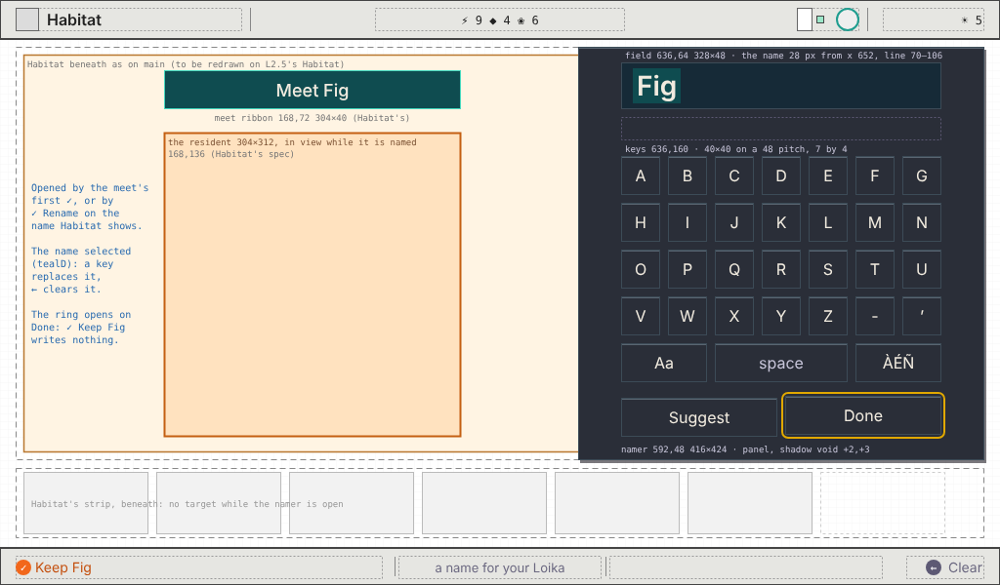

*12. The namer opened by the meet's first ✓: the default name "Fig" selected, capitals for the first letter, the ring on Done, so `✓ Keep Fig` skips in one press. The new mibi stays in view. 1×, measured.*

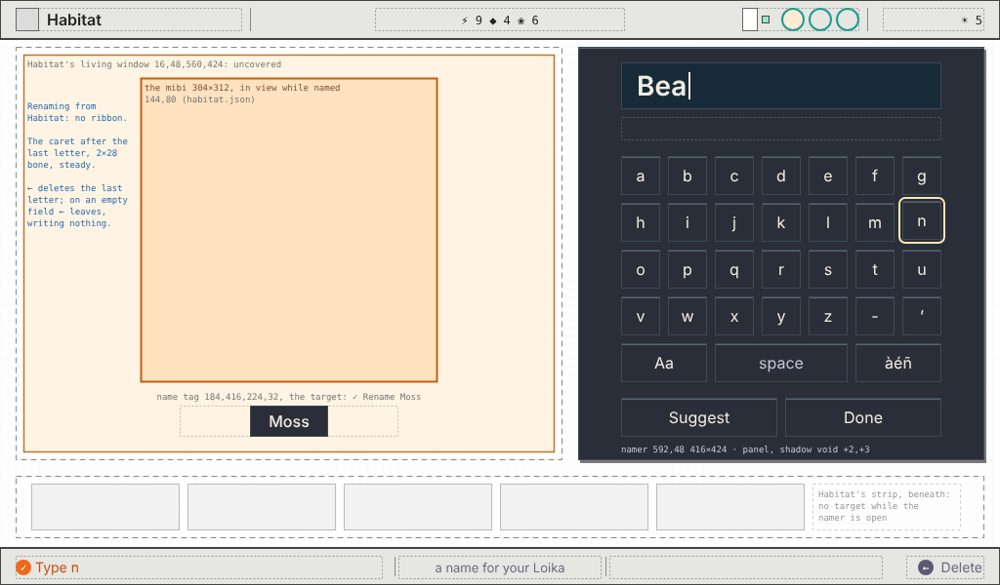

*12b. Typing: "Bea" and the caret, small letters after the first, the ring on n, `✓ Type n`, `← Delete`. 1×, measured.*

*12c. The accents page: one column a vowel, one row an accent (acute, grave, circumflex, diaeresis), then ç ñ œ ÿ; "Zo" typed, the ring on é. 1×, measured.*

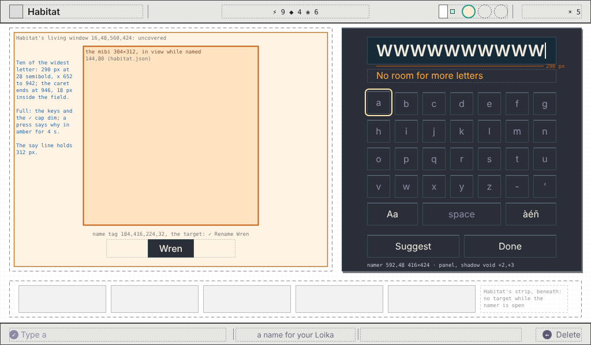

*12d. The widest name the rules allow, ten Ws (290 px at 28 px semibold), fills the field; the letter keys and the ✓ cap dim, and a press is refused in words on the say line, in amber. 1×, measured.*

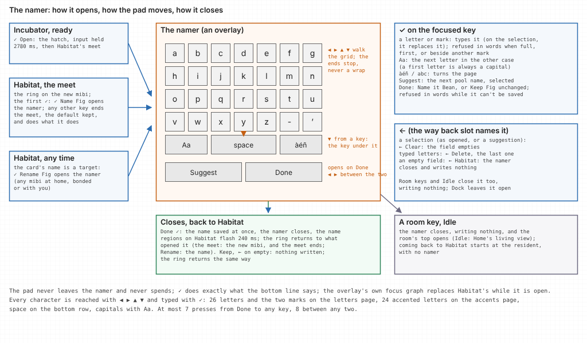

*12e. How the namer opens, how the pad walks its keys, what ✓ and ← do, and how it closes. 1×.*

### 1. Purpose

The namer is for giving a mibi its own name, or a new one, while looking at it. The player comes away with the mibi called what they chose, having reached every letter with the pad, or with the name unchanged when they skip.

### 2. Elements

| Element | Why it is here |
| --- | --- |
| **The mibi**, in Habitat's living window, uncovered | The subject: the player names what they see |
| **The field**: the name at 28 px, the name role, with its caret, or selected | The name as it will read, at the name role's size (28 px) |
| **The say line**, one line under the field | Why the name cannot be saved yet, or why a press was refused, in words |
| **The keys**: 28 character keys in seven columns, then Aa, space and the page key | Every allowed character, reached with the pad and typed with ✓ |
| **Suggest** and **Done** | A name from the pool in one press; saving the name |
| **Bottom line** | What ✓ does on the focused key, and what ← does now |

**Not here:** a heading (the field with its caret says what this is, and the bottom line's context says whose name it is); a count of letters left (the say line says when the name is full); a delete key (← deletes, and the way back names it); a cancel key (← on an empty field, a room key or Idle closes the namer, writing nothing); digits, a word filter or a list of names.

### 3. Placement

**Reading order:**

1. **The mibi**, warm, in the window at the left, unchanged from Habitat.
2. **The name** in the field, the brightest type in the panel.
3. **The say line**, when it has something to say.
4. **The key under the ring.**
5. **Done**, at the bottom right where reading ends.

**At the edges:** the panel at the right edge, over Habitat's card and modules, from the top of the stage to the foot of Habitat's right column. Habitat's strip stays visible under it and takes no key.

**Why an overlay and not a state of Habitat.** The namer opens from two places on Habitat (the meet and the mibi's name) and takes the whole pad while it is open: its 33 keys have their own focus graph, which never mixes with Habitat's. As an overlay it keeps Habitat beneath exactly as it was, the mibi in view and its living window playing, and it closes back to the same Habitat. It needs only one thing of Habitat's layout: the living window left of x 584 (What Habitat gives the namer, below).

### 4. Art direction

- **Room:** Habitat's vivarium stays the warm, living thing on screen; the namer is the overview's cool instrument hardware over its card, the report card's look.
- **One warm signal:** the focus ring. The selection is cool (`tealD`), the caret `bone`, refusals `amber` and only for a moment.
- **Never childish:** small square keys in a calm grid, letters in Inter 16, no bounce, no colours per letter.
- **Calm:** nothing moves but the ring and the lift of the focused key; the caret is steady.

**Colour roles** (the one home is `namer.json` `colours`):

| Region | Roles | Why |
| --- | --- | --- |
| Panel | `panel` fill, `hairline` edge, `bevel` top row, drop shadow `void` at (+2, +3) | The report card's look: an instrument readout standing over the scene |
| Field | Inside `ground`, edge `hairline`; the name `bone` | A recess, as the rack's wells, so the name reads as something held |
| Selection | `tealD` behind the name | The cool look of the ribbon: selected, not warned |
| Caret | `bone`, 2×28, steady | Plain, the same colour as the name |
| Say line | The reason `mist`; a refused press `amber` for 4 s | Mist informs without nagging; amber is the frame's "needs you" |
| Keys | `panel` fill, `hairline` edge, `bevel` top; label `bone`; dimmed `mist` | The kit's instrument panel at its smallest |
| Aa on | `hairline` fill, label `bone` | One step up from `panel`, as the rail's open tab. At the start of a name, where Aa does nothing, it shows `panel` |
| Space's word | `fog` | A word on a key, quieter than the characters |
| Done | label `bone`; `mist` while the name cannot be saved | Done is placed, not coloured: bottom right, wider |
| Ring | `focus`, round | The frame's one ring |

### 5. Composition

The panel stands over Habitat's right column, 16 px right of the window's bezel (x 576). Inside it one column is centred, 44 px from each side, so the column's x sits 4 px off the 8 px grid (every y, width and height stays on it): the field, the say line, the keys in seven columns on a 48 px pitch, the bottom row (Aa, space, the page key, each as wide as the columns it stands under), then Suggest and Done.

| Region | Rectangle | Notes |
| --- | --- | --- |
| Panel | 592, 48, 416, 424 | Covers Habitat's right column, the card and the modules (x 592 to 1008, y 48 to 472); 16 px from the bezel's edge at x 576 |
| **Field** | 636, 64, 328, 48 | The name at 28 px semibold from x 652, its line box 70 to 106; holds 296 px: the widest name, 290, ends at x 942 and the caret at 946 |
| Selection | x 648, y 70, the name's width + 8, 36 tall | While the name is as opened, or a suggestion |
| Caret | 2×28, 2 px after the name, y 74 to 102 | While typing or empty |
| Say line | 636, 120, 328, 24 | 16 px from x 652, its line box 122 to 142; holds 312 px |
| **Keys** | 636, 160, 328, 184 | 40×40 on a 48 px pitch, seven columns, four rows: key i at (636 + 48 (i mod 7), 160 + 48 floor(i / 7)) |
| Aa | 636, 352, 88, 40 | Under the first two columns |
| Space | 732, 352, 136, 40 | Under the third to fifth |
| Page key | 876, 352, 88, 40 | Under the last two; "àéñ" on the letters page, "abc" on the accents page |
| Suggest | 636, 408, 160, 40 | |
| **Done** | 804, 408, 160, 40 | Where the ring opens |

The focused key lifts 2 px, the chrome lift, and its ring stands 4 px outside the lifted box: 48×48 on a 48 px pitch, so rings never touch a neighbouring key, and the ring over a key clears the row above by 2 px.

**Regions and their words.** One state, **open**; the field's own states are selected, typed and empty (Interactions, below).

| Region (`namer.json`) | Rectangle | Word or build | States it shows |
| --- | --- | --- | --- |
| `panel` | 592, 48, 416, 424 | panel, build `namer` (with its shadow) | — |
| `field` | 636, 64, 328, 48 | panel and text, build `nameField` | selected (the selection, no caret); typed (the caret after the name); empty (the caret at the start) |
| `say` | 636, 120, 328, 24 | text | empty; a reason in `mist`; a refusal in `amber` for 4000 ms |
| `keys` | 636, 160, 328, 184 | panel and text, build `keyGrid` | each key: drawn or not by the page; its character in the grid's case; focused (lifted 2 px); dimmed while the field is full |
| `shift` | 636, 352, 88, 40 | panel and text, build `keyGrid` | off, and at the start of a name, where it does nothing; on (the next letter in the other case) |
| `space` | 732, 352, 136, 40 | panel and text, build `keyGrid` | dimmed while the field is full |
| `page` | 876, 352, 88, 40 | panel and text, build `keyGrid` | "àéñ" or "abc", in the grid's case |
| `suggest` | 636, 408, 160, 40 | panel and text, build `keyGrid` | — |
| `done` | 804, 408, 160, 40 | panel and text, build `keyGrid` | dimmed while the name cannot be saved |

`keyGrid` and `nameField` are compositions of the words `panel` and `text`, used by the namer alone, so neither is a word. `keyGrid` registers one focus target a key. The characters come from props (the page and the case), never from the spec. If a second device needs text entry, the key grid comes back to the UI designer and the architect as a word.

### 6. Interactions

| Input | What happens, and how it shows |
| --- | --- |
| Pad | Moves the ring between the keys ([the namer's focus as data](#the-namers-focus-as-data)); never leaves the namer, never types |
| ✓ on a character key | Types the character as the key shows it. On a selection it replaces the whole name. Refused, in words, past the limit and for a mark (space, hyphen, ’) first or beside another mark |
| ✓ on Aa | The next letter in the other case; the key shows on; after one letter the grid returns. At the start of a name the grid shows capitals and Aa shows off and does nothing: no ✓ cap, and the context says "a name starts with a capital" |
| ✓ on the page key | Turns the page, letters or accents; the ring stays on the page key |
| ✓ on Suggest | The next name from the pool, selected; each press the next, after the last the first. The pool is twelve names in the order births draw them (the curated names, then the compounds), skipping names already used, held at home, refused or over the limit. Nothing is taken from the pool until a name is saved. With no name to give, Suggest has no ✓ cap and the context says "no names left to suggest" |
| ✓ on Done | Saves the name at once and closes the namer; the new name flashes where it stands on Habitat (240 ms). The mibi's own name exactly as it is (the same characters in the same case) is Keep: it writes and logs nothing. A change of case only is a rename, with its log line ("Renamed Dot to DOT"). While the name cannot be saved: the dimmed cap; a press turns the say line's reason amber, and nothing closes |
| ← | A selection: clears the field. Typed characters: deletes the last one. An empty field: closes the namer, writing nothing |
| A room key | Closes the namer, writing nothing, and opens the room's top |
| Idle | The namer closes, writing nothing, before the living view starts |
| Dock (the Caddy's key) | The namer stays open; the crates wait in the bay |
| During the `named` flash | Presses are consumed (240 ms) |

**Every character with the pad alone.** The letters page holds a to z in reading order, seven a row, then the hyphen and ’ at the end of the fourth row. The accents page holds one column a vowel (a, e, i, o, u) and one row an accent (acute, grave, circumflex, diaeresis), and ç ñ œ ÿ in the sixth column. Space is the wide key on the bottom row. Capitals are the case rule: a name starts with a capital, and Aa gives any later letter as a capital (Œ and Ÿ included). Every key is at most seven presses from Done, and at most eight from any other key.

**The field's three states.**

| State | Shows | A character key | ← | The way back slot |
| --- | --- | --- | --- | --- |
| Selected (as opened, or a suggestion) | The name on the `tealD` selection, no caret | Replaces the name | Clears it: the field is empty | `← Clear` |
| Typed | The caret after the last character | Appends | Deletes the last character | `← Delete` |
| Empty | The caret at x 652 | Types the first letter, a capital | Closes the namer, writing nothing | `← Habitat` |

**Refusals, in words.** Nothing is refused silently and nothing is refused by a message plate (a plate would cover the mibi). While the name in the field cannot be saved, the say line gives the reason in `mist` and Done's cap dims. A refused press (a key or Done) turns the reason `amber` for 4 s, the message plate's time; then it returns.

| Refused | When | Words |
| --- | --- | --- |
| Too short | at Done, and shown while the name has fewer than two letters | A name needs two letters |
| Too long | a character past the limit; the keys dim when full | No room for more letters |
| A mark first | space, hyphen or ’ on an empty field or a selection | Start with a letter |
| A mark last | at Done | End with a letter |
| Two marks together | a mark after a mark | One space or dash at a time |
| A species' name | at Done, and shown while it is one | A species has that name |
| A clan's name | at Done, and shown while it is one | A clan has that name |
| Held at home | at Done, and shown while another mibi at home has it | {holder} has that name |

The longest, "{holder} has that name" with the widest ten-letter holder, is 267 px, inside the say line's 312. Characters outside the allowed set are not on any key, so they are never refused.

**The bottom line.**

| Ring on | Action | Context | Way back |
| --- | --- | --- | --- |
| A character key | `✓ Type n` (`✓ Type a space`, `✓ Type a dash`, `✓ Type an apostrophe`); dimmed while the field is full | "a name for your Loika" | by the field's state |
| Aa | `✓ Capitals` or `✓ Small letters`; no ✓ cap at the start | as above; at the start "a name starts with a capital" | by the field's state |
| The page key | `✓ Accents` or `✓ Letters` | as above | by the field's state |
| Suggest | `✓ Suggest a name`, then `✓ Another name`; no ✓ cap with no name to give | as above, or "no names left to suggest" | by the field's state |
| Done | `✓ Name it Bean` (a change of case included), or `✓ Keep Fig` when exactly unchanged; dimmed while the name cannot be saved | as above | by the field's state |

The notice is the frame's. Measured at Inter 16 with the widest ten-letter name: `✓ Name it` and the name is 221 px, inside the action zone's 356; the context with the longest species name is 175 px, inside 208.

### The namer's focus as data

`namer.json` `focus`, with the edge forms of [lvgl-switch.md §2.6.1](../proposals/lvgl-switch.md#261-the-graphs-primitives-exactly). Three groups: `key` (key.0 to key.27, the keys the page draws), `mod` (mod.shift, mod.space, mod.page) and `act` (act.done, act.suggest). The ring opens on `act.done`. No spatial fallback: the graph says every move.

| Group | ◀ ▶ | ▲ | ▼ |
| --- | --- | --- | --- |
| `key` | `[{ nearestIn: key, ahead }, "none"]` | `[{ nearestIn: key, ahead }, "none"]` | `[{ nearestIn: key, ahead }, { nearestIn: mod }]` |
| `mod` | `[{ nearestIn: mod, ahead }, "none"]` | `{ nearestIn: key }` | `{ nearestIn: act }` |
| `act` | `[{ nearestIn: act, ahead }, "none"]` | `{ nearestIn: mod }` | none |

- Inside a group the ring goes to the nearest target more than 6 px ahead; with none, it stays: the ends stop and nothing wraps. On the accents page the empty seventh column stops ▶ at the sixth.
- ▼ from the last row of keys takes the bottom-row key nearest its column, and the bottom-row keys stand under whole columns, so it is always the key under it: columns 1 and 2 go to Aa, 3 to 5 to space, 6 and 7 to the page key.
- `props.focus.targets` lists the present keys, then mod.shift, mod.space, mod.page, act.done, act.suggest; on an equal score the earlier wins, so ▼ from space, as near Suggest as Done, lands on Done.
- **Vectors** (`namer.json` `focus.vectors`, run by `specs.test.mjs`): Done ▲ page key; Done ◀ Suggest; Done ▶ Done; Suggest ▲ Aa; space ▼ Done; space ▲ y; Aa ▲ v; w ▼ Aa; x ▼ space; ’ ▼ page key; a ▲ a; a ◀ a; g ▶ g; i ▶ j; i ▼ p; on the accents page ç ▶ ç and ÿ ▶ ÿ.

### The overlay on the face

The namer is a spec of kind `overlay`, drawn on the face's top layer over the screen it opens from. The focus ring and the message plate are on the top layer too, in the order overlay, ring, plate, so the ring stands over the namer's keys and a plate over both. While the namer is open its graph is the only one and the screen beneath takes no key. It closes with props whose `focus.set` hands the ring back to the screen beneath. Props that name an overlay whose `over` does not list the current screen are refused.

### The name label's limit

Measured on the face's own fonts (`prototypes/face/src/fonts`, LVGL's sum: each glyph (adv_w + kern + 8) >> 4), over every allowed character in both cases, and on the Companion's Mibi 7×9 (`art/companion-48/type/mibi-7x9.json`).

| Font | Widest character | Ten of it (NAME_MAX) | The box that holds it |
| --- | --- | --- | --- |
| Inter 16 regular | œ, W, Œ: 16 px | 160 px | 160 |
| Inter 20 medium | œ, W, Œ: 20 px | 200 px | 200 |
| Inter 28 semibold | W: 29 px | 290 px | 296, on the 8 px grid |
| Mibi 7×9 at 2× | advance 6 (m, w, œ and most capitals) | 120 px | 120 |
| Mibi 7×9 at 3× | advance 6 | 180 px | 180 |

The face's Inter 16, 20 and 28 hold every allowed character in both cases, with the space, the hyphen and ’ (`specs.test.mjs` checks the baked ranges). For comparison, ten-letter names a player might choose: "Strawberry" 83, "Momo-Mumbo" 115 at 16 px; 153 and 206 at 28 px.

**NAME_MAX stays 10.** The rule: every box that sets a mibi's name holds ten of the widest character at its size, 160 at 16 px, 200 at 20 px, 296 at 28 px, and a name is never clipped and never ends in "…". Today these hold it: Home's name tag (176 px for the widest, inside the glass's 624), Habitat's name tag (at most 224 at 20 px, 200 + 2 × 12), Cross's parent names (200 at 20 px), the `plate-name` series (its widest picture, 224, is 200 + 2 × 12), the meet's ribbon ("Meet" and the name, 254 at 20 px, in 304), the hatch ribbon ("{Name}, a young {Species}", 360 at 20 px, in 400), the namer's field, and the Companion's partner screen (180 in its 200 at 3×). The ones that do not are listed under **Not designed yet**.

### What Habitat gives the namer

Habitat's own spec carries these; the namer depends on them.

- **The living window left of x 584.** The namer covers x 592 to 1008, y 48 to 472.
- **The meet.** The ring lands on the new mibi (the Incubator's hand-off), and the first ✓ is `✓ Name Fig`, opening the namer. Any other key ends the meet with the default name kept, and does what it does. When the namer closes, the meet is over, and the closing props' `focus.set` puts the ring on the mibi.
- **Rename.** Habitat's name tag is the focus target `name`, ring round, in Habitat's pad order: `✓ Rename Fig` opens the namer on any mibi at home, bonded or with you. When the namer closes, the closing props' `focus.set` puts the ring back on that target.
- **The `named` flash.** The regions that show the name (its name, the meet ribbon while it shows) take the frame's 240 ms flash when a name is saved.
- **The name boxes.** Habitat's name boxes follow the name label's rule above.

---

## What the builder decides alone, and what comes back

**The builder may decide alone:**

- Nudges of up to 8 px inside a region, to seat art or text, keeping the region's rectangle, the grid and the reading order.
- Easing curves and durations within the motion vocabulary (200 to 400 ms for the instrument, about 2 s for reveals).
- The palette colour for a role the guide already names (the focus ring's `focus`, amber need, mist subject, red clash).
- Focus order inside the spatial rules, and which target the pad picks on a tie.
- Placeholder drawing inside its listed rectangle and pixel size, entered in the placeholder register.
- Message plate wording that only reports a refusal already decided, in the house style.
- Developer-only layouts that follow the stated rules (8 or 10 bays, a larger rack).

**Must come back to the UI designer:**

- Any region that moves or resizes by more than 8 px, or any new element, label, line or readout on a screen.
- The stamp growing past 120, gaining a glow, frame, beam or pane, or moving within 96 px of the focal box.
- Any word inside a living window; any digit on a no-digit surface other than prices; any label of more than one word; anything that turns a page into text.
- A species past a stated limit:
  - more than 12 chapters on the bench rail, or more than 8 in the Book;
  - more than six traits in a chapter;
  - more than 52 leaves;
  - more looks in a trait than its row holds.
- A master whose silhouette needs a different focal box, or any focal box shrinking below its listed size (300×310 where the guide asks).
- Any change to the reading order, or a second warm or bright object competing with the specimen.
- Screens not covered here: the Probe bench and Sitting.

---

## Not designed yet

- A rail of more than twelve chapters, a chapter page of nine or more traits, and a guide spread of more than eight chapters.
- Any new vocabulary word or derived rule a screen needs; until it is designed, the screen lists it here and never improvises it.
- The rest knob, the with-you bed, the report card, the roll or the trait line on a second screen.
- [The namer](#the-namer):
  - **The guide's "Carried by" line** gives each name 120 px at 16 px; the widest needs 160, and dropping names cannot fit one name that is too wide alone.
  - **The Companion's HUD** draws the partner's name only when it fits beside the counters, and drops it otherwise.
  - **The naming rules' home**: the characters, the lengths and the refusals the namer follows are not written in [game.md](../game.md) yet.
  - **The words**: every string in `namer.json` `strings` is the copywriter's.
