# Station layouts

The measured layout of every built Station screen at 1024×600, 1×, so the builder places each thing from a number rather than a guess. Rules and looks are in the [style guide](README.md) and [Station screens](station-screens.md); this file adds the measurements. Each layout starts from its decided concept plate and is corrected for the owner's rulings of 2026-10-08:

- The Station uses its full 1024×600 at 1× grain, with Inter type.
- The stamp never takes the spotlight. It is a small label of about 120 px, placed away from the focal point; the specimen (pod, founder, bud, mibi) is the spotlight.
- The rail shows as many chapters as the species has.
- No digits where a picture can do the job. Prices on the bottom line are the exception.
- Labels are one word. Never a text page. Never childish.

**Status.** UI specification, written for the builder. Where it departs from a concept plate or from the current build, it says so and why. The wireframes in [`station-layouts/`](station-layouts/) are measured boxes and labels only, with no art: one per screen, drawn from the same numbers as the tables below.

**How to read a rectangle.** `(x, y, w, h)` in screen pixels, with the origin at the screen's top left. Every region sits on the 8 px grid. Hairlines are 1 px and are the only exception.

Pods comes first because it sets the pattern the other screens follow.

---

## Shared frame and rules

### Grid, margins and spacing

- **Grid 8 px.** Every region's x, y, w and h is a multiple of 8. The frame's own edges are the only exceptions: the stage runs from y 40 to 562 (522 px) and the bottom line is 38 px.
- **Margins.** 16 px from the left and right screen edges to any text or region. Content inside the stage starts at y 48 and ends at y 552.
- **Gaps.** 8 px between related things (a tab and its neighbour, a picture and its words). 16 px between groups. At least 8 px between regions; no region touches another.
- **Text lines.** 16 px type on a 20 px line pitch, 20 px type on 28, 28 px type on 36. Each line's cap top sits on the grid.
- **Never clipped.** Labels and names always fit their boxes. If a word does not fit, the layout's compact rule takes over (the rail's, for example). Only the bottom line's subject may end in "…".

### The frame

The frame is the same on every Station screen and speaks one language, the Companion's (*corrected by the UI designer, 2026-10-08, after the owner: "the header and the footer, just as we did with the Companion, require a language, a structure" and "somewhere in the screen you must indicate what you're looking at"*). The Companion's HUD is marks, not words: who you are out with, what you carry, what you hold, the time; numbers only beside an icon. Its bottom line is three parts: the one action (an orange ✓ cap with the verb in orange), the context (mist, the only part that shrinks) and the way out (a grey ← cap with its word). The Station's frame keeps that grammar at its own size and adds what the Station needs most: a title that says what you are looking at.

<table><tr>
<td valign="top">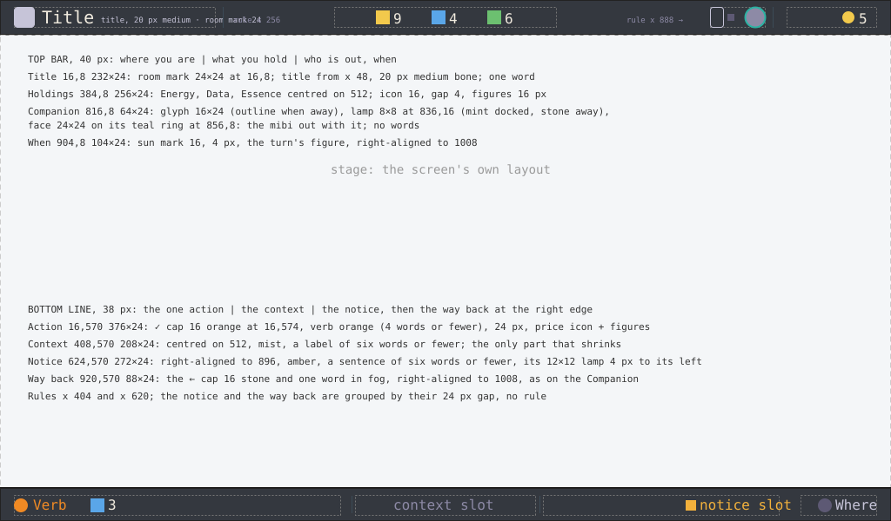 <em>The Station's top bar and bottom line at 1×, measured: zones, rules and marks. Wireframe; the words are slots. Status: Working rule, for the art director's signature.</em></td>
</tr><tr>
<td valign="top">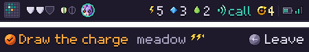 <em>The Companion's HUD and bottom line at 1×, cut from the kit's mock-up (<a href="../proposals/ui-kit/companion-place-storm.png">companion-place-storm.png</a>), for comparison: the same grammar the Station's frame follows. Status: kit mock-up.</em></td>
</tr></table>

**The top bar (40 px): where you are, what you hold, who is out, when.** Three groups, separated by 1 px `hairline` rules at x 256 and x 888 (y 8 to 32); 16 px between a rule and its neighbours.

| Zone | Rectangle | What it says | Sentence or mark |
| --- | --- | --- | --- |
| **Title: where you are** | 16, 8, 232, 24 | The room's mark, 24×24 at (16, 8), the same glyph as the device key that leads there (Home, Research, Library, Habitat), then the screen's title from x 48, 20 px medium, `bone` | One word, the title; title case. The first thing in the bar, and the only word in it |
| **What you hold** | 384, 8, 256, 24 | Energy, Data and Essence, centred on x 512: each a 16 px icon, a 4 px gap, then 16 px tabular figures in `bone`, 24 px between counters | Marks with figures; the figures are the frame's exception to "no digits" |
| **Who is out, and with whom** | 816, 8, 64, 24 | The Companion's glyph, 16×24 at (816, 8), with its 8×8 lamp at (836, 16); the mibi with you as a 24 px face on its `teal` ring at (856, 8), the same face as on the Companion's HUD (an empty ring when no mibi is with you) | Marks only, no words. Docked: the glyph solid, its lamp `mint`, the face full. Away: the glyph in outline, its lamp `stone`, the face's ring in `stone` ("dimmed" is `stone`, the same role as the lamp off; *decided by the UI designer, 2026-10-08, for the builder's derived values*): the mibi is out with it |
| **When** | 904, 8, 104, 24 | The world turn: a 16 px sun mark, 4 px, then its figure, right-aligned to x 1008 | A mark with a figure, as on the Companion ("☀ 5"), not "T5" |

The Probe's tier is not in the top bar: Home's Probe module shows it by its Shield plates (three or four), as the Companion shows it on its own Shield plates.

**The title** is first-class: the one word in the bar, at the left where reading starts, with its room's mark. It uses the title role, 20 px medium; it needs no role of its own. A 28 px title would fill the 40 px bar to 2 px of its edges and compete with the 28 px names on the stage, and the mark and the rule after it are what make it a title. It names the screen and never the chapter: on Pods the open chapter is the rail's lighter open tab and the page's heading, and a title that changed with every ◀ ▶ would stop being a landmark. So there is no "Pods · Coat".

| Screen | Room mark (the key) | Title (the slot; today's word, the copywriter's to confirm) |
| --- | --- | --- |
| Home | Home | Home |
| Pods | Research | Pods |
| Create | Research | Create |
| Incubator | Research | Incubator |
| Probe bench | Research | Probe |
| Library spread | Library | Library |
| Book | Library | Library (the species' name is the page's own 28 px name) |
| Habitat | Habitat | Habitat |
| Cross | Habitat (the key it opens from; it takes Habitat's mark, `frame-room-habitat-24`) | Cross (the copywriter, the decided term) |

**The bottom line (38 px): the one action, the context, the notice, and the way back at the right edge.** As on the Companion, the way back has one place: the ← cap and its word right-aligned to x 1008. Rules at x 404 and x 620 (y 571 to 591) separate the action, the context and the notice; the notice and the way back are grouped by their 24 px gap, with no rule (*corrected by the UI designer, 2026-10-08, at the art director's signature: one place for the way back, as on the Companion*: was three zones with the way back inside the action, rules at x 396 and x 628).

| Zone | Rectangle | What it says | Sentence or mark |
| --- | --- | --- | --- |
| **The one action** | 16, 570, 376, 24 | The ✓ key cap, 16×16 at (16, 574), `orange`, 4 px, the verb in `orange`, 16 px; 24 px; the price, a material's icon and its figures in `bone` | A verb phrase of four words or fewer; the price is marks with figures. No ✓ cap when ✓ does nothing (*corrected by the UI designer, 2026-10-08, at the art director's signature: one place for the way back, as on the Companion*: the ← cap and its word no longer sit here) |
| **The context** | 408, 570, 208, 24 | What the focus is on, centred on x 512, 16 px `mist` | A label of six words or fewer. The only zone that may shrink, ending in "…" (*corrected by the UI designer, 2026-10-08, at the art director's signature: one place for the way back, as on the Companion*: was 400, 570, 224, 24) |
| **The notice** | 624, 570, 280, 24 | What needs you, right-aligned to x 904, 24 px before the way back, 16 px `amber`, with the 12×12 amber lamp 4 px to its left, the same lamp as Home's modules | A sentence of six words or fewer (the longest today, "dock the Companion for its crates", is 256 px, 272 with its lamp); one notice at a time, the most pressing (*corrected by the UI designer, 2026-10-08, at the art director's signature: one place for the way back, as on the Companion*: was 632, 570, 376, 24, right-aligned to x 1008) |
| **The way back** | 928, 570, 80, 24 | The ← key cap, 16×16 in `stone`, 4 px, then where it leads, one word in `fog`, right-aligned to x 1008 | One word ("Home", "Pods"; the longest, "Habitat", 54 px). No ← cap when ← does nothing (*corrected by the UI designer, 2026-10-08, at the art director's signature: one place for the way back, as on the Companion*: new; was the end of the action zone) |

**The marks are art** (*corrected by the UI designer, 2026-10-08, at the art director's signature: one place for the way back, as on the Companion*). Every mark in the frame is a studio master placed 1:1 at its size, never drawn by the build and never scaled:

| Mark | Slice id | Size |
| --- | --- | --- |
| Room marks (the device keys) | `frame-room-home-24`, `frame-room-research-24`, `frame-room-library-24`, `frame-room-habitat-24` | 24×24 |
| The Companion's glyph | `frame-companion-solid-16x24` (docked), `frame-companion-outline-16x24` (away) | 16×24 |
| Lamps | `frame-lamp-8-mint` (the Companion docked), `frame-lamp-8-stone` (away), `frame-lamp-12-amber` (the notice's): one painted shape per colour (*corrected by the UI designer, 2026-10-09: was `frame-lamp-8` and `frame-lamp-12` with colour roles*) | 8×8, 12×12 |
| The sun (the world turn) | `frame-sun-16` | 16×16 |
| Key caps | `frame-cap-confirm-16` (✓, `orange`), `frame-cap-confirm-16-dim` (✓ when the action cannot be paid, `mist`), `frame-cap-back-16` (←, `stone`) | 16×16 discs, as on the Companion: the frame shares one language, and the Station's own keys are not decided square (`design/devices.md` gives no key shape; the device-family renders are appearance references, not decisions). If the Station's keys are made square, the caps follow them (*decided by the UI designer, 2026-10-09, with the art director*). The dimmed ✓ is a state of the cap drawn as its own slice, not a tint of the orange one: the build never recolours art (*decided by the UI designer, 2026-10-08, for the builder's derived values*) |
| The mibi's face | `face-<mibi>-24` (docked), `face-<mibi>-24-away` (on its `stone` ring), `face-24-empty` (no mibi with you): Station masters painted at 24, never the Companion's face scaled (*corrected by the UI designer, 2026-10-09: was `face-<mibi>-24` alone*) | 24×24, on its `teal` ring |

The material icons are the kit's 16 px icons, as on the Companion.

**Slots, not words.** Every word in the frame is the copywriter's, written to the zone's rule above: no dot-separated fragments, a verb phrase for the action, a label for the context, a sentence for the notice, the title one word.

**How states change the frame:**

- **A notice arrives:** the lamp lights `amber` and the notice slides in from the right over 200 ms; it stays until it is resolved. A newer, more pressing notice replaces it the same way.
- **A cost is shown:** the price follows the verb. When the player cannot pay, the ✓ cap and the verb turn `mist` and the price's figure turns `amber`. The press is refused with a message plate; nothing is spent.
- **Something is spent or gained:** the counter's figure ticks, with a 240 ms flash behind it.
- **The Companion returns:** its lamp turns from `stone` to `mint`, the glyph fills in and lifts 2 px for 200 ms, and the face's ring brightens; the arrival then plays on Home. When it leaves, the same in reverse.
- **The world turns:** the turn's figure ticks, with the same flash.
- **Another screen opens:** the title and its mark cross-fade in 200 ms; nothing else in the frame moves.
- **Read-only focus:** no ✓ cap; the context still names the focus.

| Region | Rectangle | Holds |
| --- | --- | --- |
| Top bar | 0, 0, 1024, 40 | Chrome ground (`bar`), with a 1 px rule on its bottom edge |
| Title | 16, 8, 232, 24 | The room's mark 24×24, then the title, 20 px medium (*corrected by the UI designer, 2026-10-08, after the owner: "the header and the footer, just as we did with the Companion, require a language, a structure" and "somewhere in the screen you must indicate what you're looking at"*: was "Screen name and turn", 16, 8, 240, 24: the name in 20 px, then the turn "T5" in 16 px) |
| Materials | 384, 8, 256, 24 | As above (unchanged) |
| Companion | 816, 8, 64, 24 | The glyph, its lamp and the face (*corrected by the UI designer, 2026-10-08, after the owner: "the header and the footer, just as we did with the Companion, require a language, a structure" and "somewhere in the screen you must indicate what you're looking at"*: was "Companion state", 640, 8, 368, 24: words right-aligned to x 1008 with an 8 px lamp, "Companion away · since 16:05 · with Dot") |
| When (the world turn) | 904, 8, 104, 24 | The sun mark and the figure, right-aligned to x 1008 (*corrected by the UI designer, 2026-10-08, after the owner: "the header and the footer, just as we did with the Companion, require a language, a structure" and "somewhere in the screen you must indicate what you're looking at"*: new; the turn moves here from beside the screen name) |
| Top rules | x 256 and x 888, y 8 to 32 | 1 px hairlines (*corrected by the UI designer, 2026-10-08, after the owner: "the header and the footer, just as we did with the Companion, require a language, a structure" and "somewhere in the screen you must indicate what you're looking at"*: new) |
| Stage | 0, 40, 1024, 522 | The screen's own layout |
| Bottom line | 0, 562, 1024, 38 | Chrome ground, with a 1 px rule on its top edge |
| Action | 16, 570, 376, 24 | ✓ cap, verb, then the price, 24 px apart (*corrected by the UI designer, 2026-10-08, at the art director's signature: one place for the way back, as on the Companion*: was ✓ cap, verb, price, ← cap, where; *corrected by the UI designer, 2026-10-08, after the owner on the frame*: before that "`✓ verb · price · ← where`, 16 px", the verb in `bone`, the parts joined by dots) |
| Context (subject) | 408, 570, 208, 24 | Centred on x 512, 16 px, `mist`. May end in "…" (*corrected by the UI designer, 2026-10-08, at the art director's signature: one place for the way back, as on the Companion*: was 400, 570, 224, 24) |
| Notice (what needs you) | 624, 570, 280, 24 | Right-aligned to x 904, 16 px, `amber`, with its 12×12 lamp (*corrected by the UI designer, 2026-10-08, at the art director's signature: one place for the way back, as on the Companion*: was 632, 570, 376, 24, right-aligned to x 1008) |
| Way back | 928, 570, 80, 24 | The ← cap and one word, right-aligned to x 1008 (*corrected by the UI designer, 2026-10-08, at the art director's signature: one place for the way back, as on the Companion*: new) |
| Separators | x 404 and x 620, y 571 to 591 | 1 px hairlines (*corrected by the UI designer, 2026-10-08, at the art director's signature: one place for the way back, as on the Companion*: were x 396 and x 628) |
| Message plate | centred on x 512, at most 640 wide, 16 + 20 px per line tall | 16 px type, shown for 4 s. Its bottom edge sits at y 550. If that would cover the screen's focal box, its top edge sits at y 112 instead |

### Type

**Tab and heading labels are capitalised word by word** (owner, 2026-10-08, 17:52: "all words with capital beginning letter"). This is later than the decision of the same day that the tab reads "Legs & tail", which was about the name (two words on one tab), not its casing; so it reads "Legs & Tail" (*noted by the UI designer, 2026-10-08, at the art director's return*): every word of a chapter's name starts with a capital, "&" stays as it is: "Coat", "Legs & Tail". The rule holds wherever a chapter's name is set (the rail, the page heading, the Book), so the build takes the names from the string table as written there; it never recases them. Sentences (the bottom line, captions, notices) stay in sentence case.

Three sizes and no others: **28 px** semibold for names (a pod, a mibi, a species), **20 px** medium for titles (the screen name, a page heading, a ribbon), **16 px** regular for everything else (readouts, labels, trait lines, the bottom line). **One exception, Pods only:** the pod's name label under the dish is 20 px medium (owner, 2026-10-08: "yes, name can be smaller, at 20px"), so it reads as the plate's quiet label, not a headline over the specimen. Use tabular figures. Never set type at 13 px. Never bake text into art. Text on art gets a 1 px dark shadow.

### The stamp label (one rule, every screen that shows it)

- **The label is 120×120**, a bone-coloured plate with a 1 px slate edge, and the stamp is centred on it.
- **The stamp is drawn on whole-pixel cells.** For a stamp of N modules (N + 2 with its quiet margin), the cell is the largest whole number of pixels that keeps the stamp within 104 px: `cell = floor(104 / (N + 2))`, never less than 2. For example, 21 modules give 23 × 4 = 92 px and 49 modules give 51 × 2 = 102 px.
- **It is never the focal point.** It sits at the edge of the composition, at least 96 px from the focal box. It never has its own beam, glow, frame or pane, and it is never larger than 120. One exception, on Pods only: the label stands inside a small, dim, unlit glass case at the right, the label plus 16 px a side (owner, 2026-10-08; *corrected by the UI designer, 2026-10-08, after the owner's rulings on the Pods composite (the pod the protagonist, the stamp a detail, the page smaller, the wells and the rail as the concept has them)*: was the case standing where the plate's case stands); the case has no light, glow or beam of its own (*corrected by the UI designer, 2026-10-08, after the owner's decision on the stamp's case*).
- **It reads fifth or later** on every screen.

### The chapter rail (Pods, Create, Incubator)

The rail is the same object on all three bench screens. It hangs from the top bar at the same height on each and moves only sideways.

(*corrected by the UI designer, 2026-10-08, after the art director's second verdict on the Pods masters*, as the plate draws it: the tabs hang from the top bar and touch along their slants. *Was:* plates 56 tall at y 48 with 8 px gaps; 112×56 on a 120 px pitch for up to seven chapters (7 × 112 + 6 × 8 = 832, tab i at x0 + 120i); 96×56 on a 104 pitch, centred, for eight; compact 56×56 with the focused tab widened to 112 for nine to twelve (816 px for twelve); inside a tab the emblem centred at the top (tab.x + 44, 52), the word on the line y 76 to 92 and the pips at y 96 to 102 on a 10 px pitch; the rail at x 96 on Create and Incubator, sliding 80 px left from Pods.)

- **Where it hangs.** Every tab's top edge is the top bar's bottom rule, y 40, and its bottom edge is y 80: tabs are 40 tall. The rail is the one region that meets the top bar; the stage's 48 px start does not apply to it. Its region is (x0, 40, 832, 40).
- **The slant.** A tab is a parallelogram whose two sides lean the same way, 16 px over its 40 px height: the bottom edge sits 16 px right of the top edge, as on the plate. A tab of width w (the width of its top edge, and of every row of it) at x has the box (x, 40, w + 16, 40); its sides are the lines x + 16 (y − 40) / 40 and x + w + 16 (y − 40) / 40.
- **Touching, on the grid.** Each tab starts where the one before ends: tab i + 1's top left corner is tab i's top right corner, so neighbours share one slant, drawn once as a 1 px hairline, and every gap is the same, none. The pitch is the width, and a run of tabs is the sum of their widths plus 16. Every tab's x is on the 8 px grid (136 and 56 are both multiples of 8), and every tab of a form is one width: full 136, compact 56, nothing between (*corrected by the UI designer, 2026-10-08, after the owner's rulings on the Pods composite (the pod the protagonist, the stamp a detail, the page smaller, the wells and the rail as the concept has them)*: the owner, "aligning is important, and size of the tabs too").
- **Two tab forms.**
  - **Full tab, w 136:** the label (the emblem 24×24, 8 px, then the chapter's word in 16 px, the word's line centred on the emblem) over the pips. Label and pips stack as one block 34 tall (24, 4, 6), centred in the tab's 40: the label at y 43 to 67, the pips at y 71 to 77. Each is centred on the tab's slanted middle at its own height: the label's centre at x + 68 + 16 (55 − 40) / 40 = x + 74, the pips' at x + 68 + 16 (74 − 40) / 40 = x + 82 (rounded to the pixel). The longest label, "Movement" (24 + 8 + 80 = 112), clears both slants by 7 px (*corrected by the UI designer, 2026-10-08, after the owner's rulings on the Pods composite (the pod the protagonist, the stamp a detail, the page smaller, the wells and the rail as the concept has them)*: was the block at x + 76 with the pips centred under the word, not the label, the emblem at y 48 to 72, the word on y 44 to 64, the pips at y 68 to 74).
  - **Compact tab, w 56:** the emblem 24×24 over the pips, stacked and centred the same way: the emblem at y 43 to 67, its centre at x + 34; the pips at y 71 to 77, their centre at x + 42 (*corrected by the UI designer, 2026-10-08, after the owner's rulings on the Pods composite (the pod the protagonist, the stamp a detail, the page smaller, the wells and the rail as the concept has them)*: was the emblem at y 44 to 68, the pips at y 72 to 78).
- **Trait pips.** One 6×6 pip per trait on an 8 px pitch, so six traits take 46 px (was a 10 px pitch, 56 px; at 10 they did not fit the compact tab).
- **By chapter count.**
  - **One to six chapters:** full tabs on a 136 px pitch; the run is 136n + 16, and six chapters fill the 832 exactly. Tab i is at x0 + 136i.
  - **Seven to twelve chapters:** compact tabs on a 56 px pitch, with the open chapter's tab full (136), so the tabs after it sit 80 px further on. The run is 56 (n − 1) + 152: 488 for seven, 544 for eight, 768 for twelve. The open chapter's word shows on its tab and on the page heading; the other tabs show their emblem and pips. Seven and eight chapters (S03, S07, S09, S15 and S16 today) are compact because a full tab with its emblem and the longest word needs about 130 px, and seven of them do not fit 832. The open chapter is the focused tab while the ring is on the rail, and otherwise the chapter on the page.
  - **More than twelve** comes back to the UI designer.
- **Where the run sits.** On every bench screen (Pods' overview and chapter page, Create, Incubator) the run is centred on x 512, at x = 512 − run / 2 rounded down to the 8 px grid (96 for six chapters, 264 for seven, 240 for eight). Pods' collection shows no rail. (*corrected by the UI designer, 2026-10-09, with Pods in three states: was "on Pods it starts at x 152, on the page's left edge"; before that x 176, to the right of the list. Moving from Pods to Create the rail no longer slides.*)
- **What Create and Incubator inherit:** all of the above (the hanging at y 40, the 40 px height, the 16 px slant, the touching tabs, the two forms and their widths, the count rule, the 8 px pip pitch, the slanted focus ring and no lift), centred as stated. Their own pip marks (changed, clash, the focused trait) sit on the 8 px pitch. Their regions below the rail start at y 104 or lower and do not move.
- **Cross inherits it too** (*set by the UI designer, 2026-10-09, with the splice*). On the chapter view, centred as stated: a tab is read when both parents have read the chapter, and unread when either has not. Its pips are filled where the trait's forecast is drawn and hollow where it is missing. Its glint slot carries `cross-wish-lit-12x12` on a chapter holding a pinned trait a child can reach ([Cross: the splice](#cross-the-splice)).
- **Never** a second row, a scroll, a "more" arrow or a clipped word.
- **One word per tab,** with one decided exception: the "Legs & Tail" tab shows "Legs & Tail" (owner, 2026-10-08; every word capitalised, Type; *corrected by the UI designer, 2026-10-08, after the owner's rulings on the Pods composite (the pod the protagonist, the stamp a detail, the page smaller, the wells and the rail as the concept has them)*: was "Legs & tail"); at 16 px Inter (78 px) it fits the 136 px full tab (was the 112 px tab).
- **No status words or prices on a tab.** The build's "read", "cleared", "misty" and "1 ◆" go: the tab's fill and pips show the state, and the price is on the bottom line.

**State colours** (*corrected by the UI designer, 2026-10-08, after the owner's rulings on the Pods composite (the pod the protagonist, the stamp a detail, the page smaller, the wells and the rail as the concept has them)*: the owner accepted the slanted rail with pips and asked for its colour and highlighting to be tidied). One fill, one word colour and one pip colour per state, from the kit's roles, and nothing else varies: no lit rim, no teal fill, no notch colour. Every tab's edges, the shared slants, are 1 px `bevel`. The focus ring is the only highlight.

| State | Fill | Word | Pips |
| --- | --- | --- | --- |
| Unread | `panel` | `mist` | `mist`, hollow |
| Read | `panel` | `bone` | `bone`, filled for each read trait |
| Open (the chapter on the page, read or not) | `hairline`, one step up from `panel` | `bone` | `bone`: filled for read traits, hollow for unread |
| Sealed | `panel` with horizontal slats in `bar` | `mist` | none |
| Focused | its state's fill, word and pips, unchanged | | |

The focused tab adds the focus ring in the `focus` role, in its tab shape (States shared by every screen, Focus ring), and nothing else: no lift, no lit edge, no change of fill. Read and unread share a fill and differ by word and pips; the open tab alone is one step lighter.

*Was:* Unread: 1 px hairline outline, cool frost fill (`frostS`, one step below the frost of the page so the pod stays the brightest thing; corrected by the UI designer against the build, 2026-10-08, was `frostD`), hollow pips |; Read: Solid deep-teal fill, 1 px lit rim, filled pips |; Sealed: The tab drawn shut (horizontal slats), an 8×4 notch cut into its bottom edge, no pips; its word in `mist`, so it still reads on the slats (corrected by the UI designer against the build, 2026-10-08) |; Focused: The focus ring, in the `focus` role (*corrected by the UI designer, 2026-10-08, after the art director's pass-6 verdict on the Pods masters*: was named the cream ring), in its tab shape, following the slants (States shared by every screen, Focus ring). A hanging tab does not lift: there is no room above it (*corrected by the UI designer, 2026-10-08, after the art director's second verdict on the Pods masters*: was the 2 px chrome lift; *corrected by the UI designer against the build, 2026-10-08: was 4 px; at 4 the ring's top met the top bar's rule at y 40*) |.

| Other mark | How it is drawn |
| --- | --- |
| Glint | A four-point star, 12×12, hanging 2 px under the tab's bottom edge, centred on it: (tab.x + 16 + w / 2 − 6, 82) (*corrected by the UI designer, 2026-10-08, after the art director's second verdict on the Pods masters*: was at the tab's top right (tab.x + 92, tab.y + 4); inside a 40 px tab the star met the word or the emblem) |
| Cleared while growing (Incubator) | Unread turns to read one tab at a time, the pips filling left to right across the bud's minutes |
| Trait states on Create | Filled pip: read. Amber dot in the pip: changed. ✕ in place of the pip: clashes. A ring in the `focus` role round the pip: the focused trait |

### States shared by every screen

- **Focus ring.**
  - One warm ring per screen, in the palette's `focus` role (warm cream, #ffe6ad; ui-kit §2), 2 px wide, 4 px outside its target, with a 6 px corner radius. (*corrected by the UI designer, 2026-10-08, after the art director's pass-6 verdict on the Pods masters*: was named the `cream` role, #fff4a6, a yellower swatch.)
  - On a creature it is an ellipse on the ground under its feet instead: the box width plus 16, by 24 px tall.
  - **On a rail tab it follows the tab** (*corrected by the UI designer, 2026-10-08, after the art director's second verdict on the Pods masters*): the tab's two slant lines moved 4 px outward, x − 4 + 16 (y − 40) / 40 and x + w + 4 + 16 (y − 40) / 40, running from y 42 to y 80 (the tab's bottom edge), then dropping straight down to a bottom run at y 84 (at x + 12 and x + w + 20), closed by a top run at y 42 (just under the top bar's rule). One rule: the slants stop at y 80, so the ring's box is exactly (x − 4, 42, w + 24, 42) (*corrected by the UI designer, 2026-10-08, for the builder's question*: the slants were said to run on to y 84, which put the right one at x + w + 21.6, 1.6 px past the stated box). The ring is 2 px and cream, its bottom corners rounded 6 and its top corners square against the top bar. It crosses 4 px onto each neighbouring tab. Its box is (x − 4, 42, w + 24, 42).
  - The focused thing lifts: chrome 2 px, a creature 4 px, over 200 ms. A hanging rail tab does not lift.
  - Never a list cursor, a side bar or a second ring.
  - A focus with nothing to confirm still draws the ring. The bottom line then has no ✓ cap.
- **Dimmed ✓.** When the player cannot pay, the ✓ cap and verb show in mist, and the price names what is short. The press is refused with a message plate. Nothing is spent.
- **Glint.** The same four-point star, 12×12, everywhere: on the list ring's arc, on the rail tab and above the Home rack's well. It twinkles at 2 Hz, but a still frame still shows the star.
- **Clash** (Create): a 2 px red ring around the clashing roll picture and a 12×12 ✕ at its top right; the trait's pip becomes a ✕; the trait line turns red and says "Clash". The ✓ cap is withheld.
- **Waiting lamp:** a 12×12 cool lamp on a mibi whose painting has not landed. The words "its painting is on its way" appear only on the bottom line, never in the living window.
- **No words in a living window.** The vivarium, the Habitat window, the specimen chamber and the dome carry no text. The only exception is an event ribbon, which shows for a moment (an arrival, a hatch, a first meeting).

### Never upscaled

- Every drawn thing, whether a master or a placeholder, is rendered at the pixel size listed for it. It is never drawn small and enlarged.
- A smaller size may be rendered or downsampled from a larger one.
- A close-up is rendered by zooming the renderer's camera to the part, not by cropping a 300×310 render and enlarging the crop.
- Today's trait pictures crop and enlarge with nearest-neighbour scaling (`traitPic` with `scalePB`). They must be rendered at their size instead.

### The vocabulary (closed)

The LVGL face draws every screen from one closed set of words, one C module a word under the face's `vocab/`, shared with the Companion and the Caddy where they are common ([lvgl-switch.md §2.2](../proposals/lvgl-switch.md), after [technical architecture §5.1](../proposals/technical-architecture.md); *corrected, 2026-10-09: was "the screen layer", the JavaScript layer now deprecated*): frame, top bar, bottom line, message plate, focus ring, panel, stamp label, chapter rail, chapter page, list, specimen, living window, ribbon, Companion HUD, map viewport. A new word comes back to the UI designer and the architect. What a screen builds from them, bound in the face's `screens/` table (decided by the UI designer, 2026-10-08, on Home):

- **Module** is a build of **panel**, not a new word: the instrument panel (`panel` fill, `hairline` edge, `bevel` top) holding one engraved word, one 12×12 lamp and its objects as sprites. Home's four modules are the only modules.
- **Living window** is the existing word: a painted inside with no words in a `metal` frame. Home's vivarium is one, as are the Habitat window, the specimen chamber and the dome.
- **Compositions, not words:** the **rest knob** (a chrome sprite on the living window's frame, with its focus target), the **with-you bed** (sprites inside the living window: the bed, then the sleeping mibi or the Companion mark) and the **report card** (a panel holding rows of type and 16 px icons). Each is used on Home alone, so none earns a word. If a second screen needs one, it comes back to the UI designer.

---

## Pods: collection, pod overview, chapter page

Concept plate: `art/concept-station/pods-v2/placed/PV-D-r3-a4-stamped-1024x600.png`. Wireframes, 1×: [02a-pods-collection.png](station-layouts/02a-pods-collection.png), [02b-pods-overview.png](station-layouts/02b-pods-overview.png), [02c-pods-chapter.png](station-layouts/02c-pods-chapter.png).

**Decided** (owner, 2026-10-09, on the wireframes): Pods is three states. It opens on the **collection** (A). A pod opens on its **overview** (B). A chapter tab opens the **chapter page** (C).
- There is no well column on B or C: the collection is the one list, as in the Library ("the new layout makes better use of the screen").
- Beside the pod, a figure suggests the type the pod would become, never a detailed render ("maybe a halo-like figure").
- The chapter page is one state.
- The first-shown looks are saved, so the field-guide mark stands.

This replaces the single Pods screen with its well column; its numbers are kept below as corrected-in-place notes (*corrected by the UI designer, 2026-10-09, the owner's decision on the three-state wireframes*). Pods comes first because it sets the pattern the other screens follow.

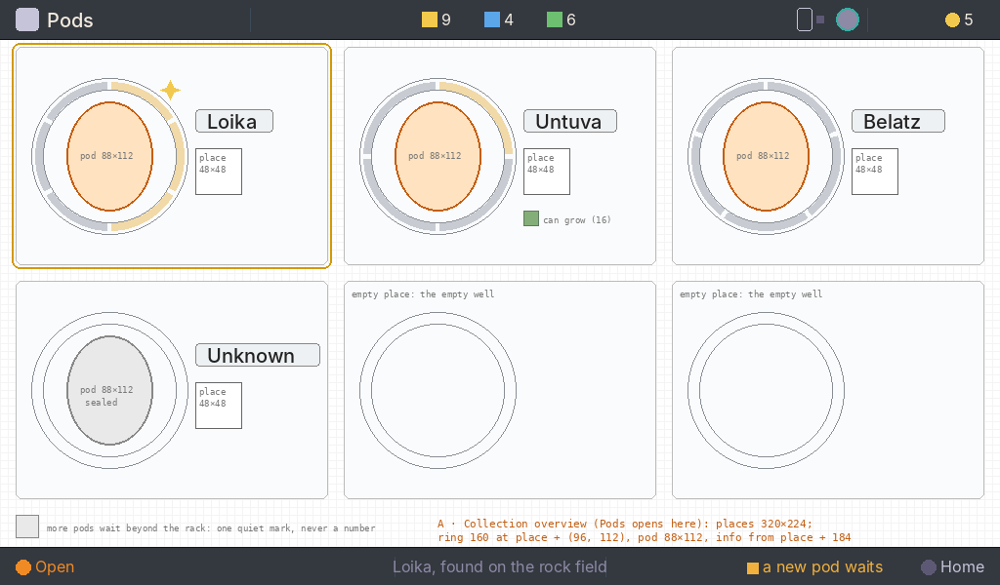

*A · Collection overview, 1× wireframe. Status: Decided.*

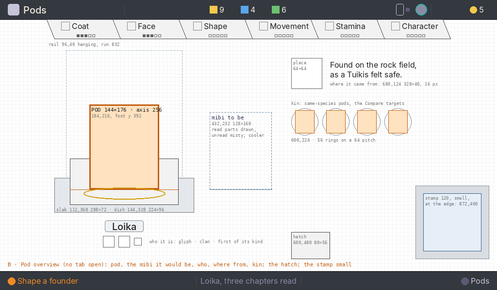

*B · Pod overview, 1× wireframe. Status: Decided. The figure beside the pod is drawn as a box here; it is the species' silhouette in a soft halo (§4).*

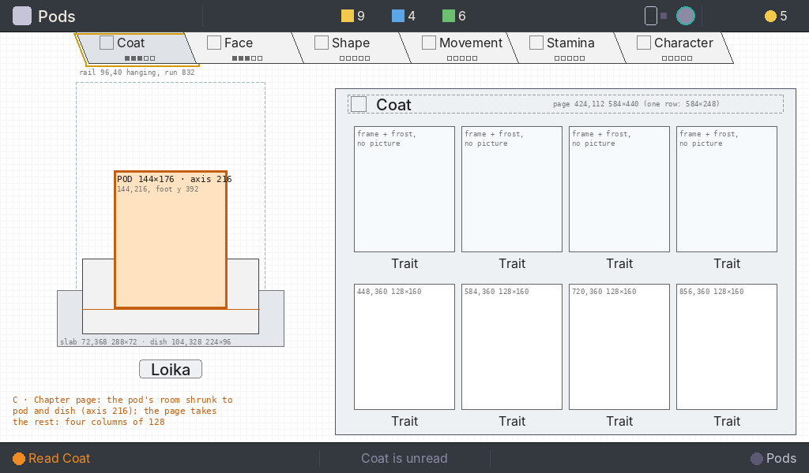

*C · Chapter page, 1× wireframe. Status: Decided.*

### 1. Purpose

- **A, the collection:** see the whole rack at a glance and go to the pod that needs you.
- **B, the pod overview:** know one pod and choose what to do with it. What it would become, who it is, where it came from, its kin; identify it, shape a founder from it, open a chapter, compare it, or return it to the wild.
- **C, the chapter page:** read one chapter's traits, one paid read at a time.

The player leaves knowing what each pod is, how far it is read, and where something new waits; or, having returned a pod, that it was not worth keeping.

### 2. Elements

| State | Element | Why it is here |
| --- | --- | --- |
| A | **Every rack place**, in rack order; an empty place is an empty well | The whole collection at a glance |
| A | **Each pod's identity**: the sealed cap or the lit glyph, and the name label (the species, or "Unknown") | What it is |
| A | **Its origin as a place picture** | Where it came from, without words |
| A | **Its progress as the concept's ring**: one arc per chapter, filled when read, closed when every chapter is read | How far it is read, without digits |
| A | **The glint star**; **one can-grow mark**, only where the ring and the seal do not already say what it can do | Where something new waits; what it can do |
| A | **Pods waiting beyond the rack**: one quiet mark | That more are in the bay, never a number |
| B | **The pod** large on its dish and slab under the cone | The subject and the protagonist, the one warm thing |
| B | **The rail**, hanging, with no tab open | Where the reading stands; the way into a chapter |
| B | **The figure**: the species' silhouette in a soft halo | A suggestion of the type this pod would become, never the individual |
| B | **Who it is**: the name label, then the glyph, the clan mark and the first-of-its-kind mark | Its identity |
| B | **Where it came from**: the place picture and the origin sentence | Its find |
| B | **Its kin**: same-species pods, small | The Compare targets |
| B | **The hatch** | The way back to the wild |
| B | **The stamp label**, small at the edge, in its dim case | The genome's fingerprint; a detail |
| C | **The pod**, its room shrunk to the pod and the dish | The subject stays in view |
| C | **The page**: every trait of the chapter at once | The knowledge itself, as pictures |
| All | **The bottom line** | The one action and its price; the context; the notice; the way back |

**Cut** (*corrected by the UI designer, 2026-10-09, the owner's decision on the three-state wireframes*): the well column on B and C (was the list (0, 40, 112, 522) with six wells, their rings, the 40×48 list pods and the hatch); the place stamps beside the wells; the page beside the pod on the pod's screen.

### 3. Placement

**Reading order.**
- **A:** the focused place (the pod that most needs the player), the glint, the rings, the labels.
- **B:** the pod; its name; the figure; where it came from; its kin; the rail; the stamp and the hatch, quiet at the right; the bottom line.
- **C:** the page's pictures; the pod; the rail; the bottom line.

**At the edges.**
- A: the waiting mark at the bottom left.
- B: the rail (top edge) and the stamp (right edge); the hatch at the foot of the information column.
- C: the rail (top edge).

**Hierarchy.** The pod is first and largest in presence, with the room and the light. The figure is second, cooler and smaller. The page is second on C. The stamp is a detail.

### 4. Art direction

- **Room:** the research bench, a modern digital lab.
- **The pod is the only warm thing,** lit by a cool cone of light onto its frosted dish (224×96, never squashed) on the thick glass slab.
- **The figure suggests the type.** It is the species' silhouette in a soft halo: two painted slices per species (mist and clear, cross-faded by the chapters read), drawn from the standard painting's silhouette, the art director directing its look. It is cooler and dimmer than the pod and never shows the individual's colours or marks, so the player never takes it for the mibi they will get. Before Identify it is an empty halo (*corrected by the UI designer, 2026-10-09, the owner's decision on the three-state wireframes*: was a ghost mibi drawn where read and misty where unread).
- **Everything else is cool:** the deep blue-teal ground, slate and graphite chrome, frost on what is unread.
- **The page lights warm from inside only once it is read.**
- **The stamp is a plain bone label** inside a small, dim, unlit glass case, its front glass bringing it below the pod's brightness.
- **Restraint, and never childish.**

### 5. Composition

**A · Collection** (*corrected by the UI designer, 2026-10-09, the owner's decision on the three-state wireframes*: new; was the well column 0 to 112).

| Region | Rectangle | Notes |
| --- | --- | --- |
| Place c, r (c 0–2, r 0–1) | 16 + 336c, 48 + 240r, 320, 224 | A recessed glass place on the bench `room-bench-stage-collection`: its own panel, the slice `panel-place-320x224`, one fixed master placed 1:1 at every place (all six are one size, so it is not a nine-slice), painted in the `panel` and `hairline` roles with 6 px corners; an empty place is the same panel with the idle ring (*set by the UI designer, 2026-10-09, for the studio's cut*); the focus target. Its focus ring is a circle 4 px outside the ring: 2 px in the `focus` role, radius 84 round the ring's centre (*corrected by the UI designer, 2026-10-09, to the studio's cut*: was a rounded rectangle 4 px outside the place). Every place drawn; an empty place is the empty ring. Was the well slot (16, 48 + 72i, 80, 72) |
| Ring | slice place + (8, 24, 176, 176), centred on place + (96, 112); the ring radius 80 with an 8 px band | Painted masters placed 1:1 on one 176×176 origin, as the signed gauge is, never arcs drawn by the build: `ring-collection-idle-176x176`, an empty place's ring and the base under the arcs; for a species of N chapters (1 to 8), the track `ring-arc-collection-n<N>-track-176x176` and one segment per read chapter, `ring-arc-collection-n<N>-s<i>-176x176` (i = 1 to N, in ring order, 2 px apart), each on the same origin; and when every chapter is read, the continuous band `ring-collection-closed-176x176` in place of the track and segments. There is no selected ring: the focus ring marks the focused place (*corrected by the UI designer, 2026-10-09, to the studio's cut*: was a selected and an idle ring, and the band closing when every segment was placed). The colour roles are the paint reference only: read `bone`, unread `bevel`, the band's edges `hairline` (*corrected by the UI designer, 2026-10-09, after the art director's judgement of the built Pods*: was the rule "filled `bone` when read, `bevel` when not", drawn by the build, with `colours.collectionRing` as its home) |
| Pod | 88×112, centred on the ring's centre | The collection class; the sealed cap or the lit glyph. Was the 40×48 list pod |
| Name label | place + (184, 64), hugging, 24 tall | 20 px medium on its plate, as under the pod: "Loika"; "Unknown" before Identify. Its plate is the `plate-name` series, the same hugging nine-slice as under the pod (*set by the UI designer, 2026-10-09, for the studio's cut*) |
| Place picture | place + (184, 104, 48, 48) | The origin as a picture: `place-<place>-48x48` (*corrected by the UI designer, 2026-10-09, after the art director's judgement of the built Pods*: id added) |
| Can-grow mark | place + (184, 168, 16, 16) | `mark-can-grow-16`. Only where the ring and the seal do not say it (*corrected by the UI designer, 2026-10-09, after the art director's judgement of the built Pods*: id added) |
| Glint star | place + (148, 40, 12, 12) | `glint-star-12x12`, on the ring's band at its top right (*corrected by the UI designer, 2026-10-09, to the studio's cut*: id added) |
| Waiting beyond the rack | 16, 528, 24, 24 | `mark-waiting-24`. One quiet mark, never a number (*corrected by the UI designer, 2026-10-09, after the art director's judgement of the built Pods*: id added) |

**B · Pod overview** (*corrected by the UI designer, 2026-10-09, the owner's decision on the three-state wireframes*).

| Region | Rectangle | Notes |
| --- | --- | --- |
| Rail | 96, 40, 832, 40 | Hanging, centred on x 512 as on Create and Incubator; no tab open. A price shows only on the bottom line, when a tab has focus. Was at x 152, aligned with the page |
| Bench and cone of light | bench 0, 40, 1024, 522; the cone 136, 104, 240, 320 | The bench is painted with its cone and pool for this state's axis: `room-bench-stage-overview` at (0, 40, 1024, 522), the cone centred on x 256, the pool on the dish at (256, 424). The collection uses `room-bench-stage-collection` (0, 40, 1024, 522), with no cone (*corrected by the UI designer, 2026-10-09, after the art director's judgement of the built Pods*: was one `room-bench-stage` with the pool at (712, 424)). Was 512, 104 |
| **Pod (focal)** | 184, 216, 144, 176 | Bottom-centred on (256, 392); medium 120×152 at (196, 240), small 104×128 at (204, 264). The foot in the bowl's dip. Was 560, 216 on the axis x 632 |
| Dish and near lip | 144, 328, 224, 96 | Was 520, 328 |
| Shelf slab | 112, 368, 288, 72 | Was 488, 368 |
| Name label | centred on x 256, at y 456, hugging, 24 tall | 20 px medium; the name alone ("Loika"); "Unknown" before Identify. Was centred on x 632 |
| Who it is: marks | glyph (200, 488, 24, 24), clan (232, 488, 24, 24), first of its kind (268, 492, 16, 16) | Marks, no words |
| **The figure** | 432, 232, 128, 160 | The species' silhouette in a soft halo, its feet on y 392, in two painted slices per species on the same 128×160 origin: `mibi-halo-<SNN>-128x160-mist` (everything unread, diffused) and `mibi-halo-<SNN>-128x160-clear` (the crisp glow figure). The build cross-fades them by the share of chapters read: the clear layer's alpha is chapters read ÷ chapters, over the mist; nothing is blurred by the build. It suggests the type; it never shows the individual's colours or marks. Before Identify, the empty halo (*corrected by the UI designer, 2026-10-09, to the art director's brief*: was one slice, `figure-<species>-128x160`). Was the page (152, 112, 256, 440) beside the pod |
| Where it came from | place picture 600, 120, 64, 64 (`place-<place>-64x64`, a new master painted from the same painting at 64, never scaled); sentence 680, 128, 328, 40 | The copywriter's sentence, "Found <where>, <what happened>.", 16 px `bone`, at most two lines; no digits. Was the caption under the name (520, 488, 224, 40) |
| Kin | rings 56×56 from (600, 224) on a 64 px pitch, at most six; the 40×48 pod in each | The ring is the master `ring-kin-56x56`, placed 1:1; the pod is the 40×48 list class (*corrected by the UI designer, 2026-10-09, after the art director's judgement of the built Pods*: id added).  Same-species pods: the Compare targets; focus targets. None drawn when the pod has no kin |
| Hatch | 600, 480, 80, 56 | Leaf mark 24×24 centred. Was in the well column (16, 488, 80, 56) |
| Stamp case and front glass | 856, 384, 152, 152 | Small, dim, unlit; the front glass `ground` at 48 % (slice `room-stamp-case-152x152-front`). Was 856, 232 |
| **Stamp label** | 872, 400, 120, 120 | Small, at the edge; 544 px from the pod's box. Appears at Identify. Was 872, 248 |
| Ribbon ("New species") | 680, 128, 328, 40 | In the origin sentence's rectangle, 6 s, the read tab's cool look |

**C · Chapter page** (*corrected by the UI designer, 2026-10-09, the owner's decision on the three-state wireframes*).

| Region | Rectangle | Notes |
| --- | --- | --- |
| Rail | 96, 40, 832, 40 | The open tab lighter; the focus on the rail |
| Pod, dish, slab, cone | pod 144, 216, 144, 176; dish 104, 328, 224, 96; slab 72, 368, 288, 72; cone 96, 104, 240, 320 | The bench `room-bench-stage-chapter` at (0, 40, 1024, 522), its cone centred on x 216 and its pool at (216, 424) (*corrected by the UI designer, 2026-10-09, after the art director's judgement of the built Pods*). The pod's room shrunk to what the pod and the dish need: the axis at x 216, the foot on y 392. The name label under it; no figure, no stamp, no hatch |
| Open page | 424, 112, w, h by the trait count (the size table below); at most 584×440 | **No pane** (*set by the UI designer, 2026-10-09, the owner's choice of the open page (B) and the owner's corrections: "the content of the panel is too tight… the bird head at 75%… increase a bit the spacing between cells"*). The page is its heading, one 1 px `hairline` rule and the grid, standing on the bench; spacing does the grouping, no container. Left-aligned: the heading and the first cell at x 448, the top at y 112, fixed as the rail steps. Was the `deep` nine-slice pane `page-pane-256x440` with a 1 px slate edge (before that 584 wide at every count; before that 152, 112, 256, 440) |
| Page heading | 448, 118, w − 24, 24; the rule 448, 148, the grid's width, 1 | Emblem 24×24, then the chapter's word in 20 px `bone`, 8 px after it. Under it one 1 px `hairline` rule from the first column's left edge to the last column's right edge (12 px under the heading, 12 px over the cells). "Legs & Tail", the longest word, makes the heading 24 + 8 + 103 = 135 px; on a one-trait page that runs 7 px past the 128 px rule, which is fine with no pane to hold it. Was 440, 120, w − 32, 24 on the pane |
| Trait cells | the grid below | In the chapter's order, row by row: the picture P (128×160, one flat rectangle of `ground`, no frame, no card, no word), 4 px, the name line (20 px): the one-word name in 16 px `bone`, then its glyphs (Marks after the name), the name and the glyphs centred together on the cell. A picture's content sits inside P's centred 75%, 96×120 at (16, 20), the tone as its margin |

**Page grid,** by the open chapter's trait count. Columns of 128 with **16 px gaps**, rows 208 apart (**24 px** between a name line and the next picture), the first column at x 448 (*set by the UI designer, 2026-10-09, the owner's choice of the open page (B) and the owner's corrections: "the content of the panel is too tight… the bird head at 75%… increase a bit the spacing between cells"*: was 8 px gaps and rows 200 apart, inside the pane's 24 px insets). Every picture 128×160 (under the pod's 144×176), rendered at its size. A sealed chapter is shut, with one 112×112 picture of the find that opens it, centred in the one-trait cell's rectangle, (456, 196, 112, 112) (*corrected by the UI designer, 2026-10-09, the owner's decision on the three-state wireframes*: was two columns of 104 on the 256 px page, pictures from 144×176 to 104×64; *and after the art director's fourth look*: was centred at (660, 276) on the 584 pane).

**The page's size, one rule** (*set by the UI designer, 2026-10-09, the owner's choice of the open page (B) and the owner's corrections: "the content of the panel is too tight… the bird head at 75%… increase a bit the spacing between cells"*). With no pane, the size bounds the rule and the grid, nothing is drawn at it. Columns are the count up to four, then half the count rounded up; the width is 24 + columns × 128 + (columns − 1) × 16, that is 8 + 144 × columns; the height is 232 for one row (48 + 184) and 440 for two (48 + 184 + 24 + 184). Left-aligned at x 424, so the heading and the first cell stay put as the rail steps; four columns end at x 1008, the screen's right margin, and two rows at y 552, 10 px over the bottom bar. A sealed chapter takes the one-trait size, whatever its count. `pods.json` `regions.chapter.page.sizeByCount`. Was the pane's rule, 40 + 136 × columns, 248 or 440 tall.

| Traits | Columns × rows | Page (w × h) | Page rectangle |
| --- | --- | --- | --- |
| 1, and sealed | 1 × 1 | 152 × 232 | 424, 112, 152, 232 |
| 2 | 2 × 1 | 296 × 232 | 424, 112, 296, 232 |
| 3 | 3 × 1 | 440 × 232 | 424, 112, 440, 232 |
| 4 | 4 × 1 | 584 × 232 | 424, 112, 584, 232 |
| 5 | 3 × 2 (3, then 2) | 440 × 440 | 424, 112, 440, 440 |
| 6 | 3 × 2 | 440 × 440 | 424, 112, 440, 440 |
| 7 | 4 × 2 (4, then 3) | 584 × 440 | 424, 112, 584, 440 |
| 8 | 4 × 2 | 584 × 440 | 424, 112, 584, 440 |

| Traits | Cells (x, y, w, h) | Picture | Was |
| --- | --- | --- | --- |
| 1–4 | 448, 592, 736 or 880, at y 160; each 128×184 | 128×160 | 448, 584, 720 or 856 (8 px gaps); on the 256 px page: one 144×176; two 104×160 side by side; three or four 104×160 in two rows |
| 5–6 | 448, 592 or 736, at y 160 and 368; each 128×184 | 128×160 | 448, 584 or 720 at y 160 and 360; on the 256 px page: 104×96 |
| 7–8 | 448, 592, 736 or 880, at y 160 and 368; each 128×184 | 128×160 | 448, 584, 720 or 856 at y 160 and 360; on the 256 px page: 104×64 |
| 9 or more | none today | comes back to the UI designer | |

**The page, one state.**
- **Read chapter:** every trait's cell.
- **Unread chapter:** the same cells, each its trait's name under an empty picture: a dotted 1 px `bevel` outline round P (1 px on, 2 off), nothing inside, no glyphs; clearly empty. The build asks for no close-up of an unread trait (*set by the UI designer, 2026-10-09, the owner's choice of the open page (B) and the owner's corrections: "the content of the panel is too tight… the bird head at 75%… increase a bit the spacing between cells"*: was the frame with plain frost inside).
- **Sealed:** shut, with the find's picture.
- **Never on the page:** digits, allele codes or genetics words, kinship, prices, status words, the stamp's code, clash marks, Compare's difference lamp, the word "stand-in".

**Marks after the name,** on the name line, never on the picture (*set by the UI designer, 2026-10-09, the owner's choice of the open page (B) and the owner's corrections: "the content of the panel is too tight… the bird head at 75%… increase a bit the spacing between cells"*, with the owner's yes to the three recommendations: the marks leave the picture; one painted paired-seed glyph; Only a small glyph). The line is 20 px; line y = P.y + 160 + 4; the name's capitals run line y + 4 to + 15 and its baseline is line y + 16. In order after the name, 4 px apart: the kind glyph, the breed glyph, the field-guide dot; the name and its glyphs are centred together on the cell. The line may run 6 px into the 16 px gap on each side (at most 140), so two neighbouring lines keep 4 px apart. Every glyph is a master placed 1:1, art layer; the build draws none.

| Mark | Glyph (id, size) | Top | Notes |
| --- | --- | --- | --- |
| Misty seed (shows · hides) | `mark-line-seed-12x16`, 12×16 | line y + 2 (centred on the line's middle) | To paint. The seed with the hidden look's ghost inside, readable at 16 px; the full look is on the field guide, not here |
| Blend (two seeds) | `mark-line-seed-pair-20x16`, 20×16 | line y + 2 | To paint: one glyph, two seeds overlapping, never two seeds placed by the build. Fit: "Translucency" 101 + 4 + 20 = 125 ≤ 128 |
| Only | `mark-line-only-16x8`, 16×8 | line y + 8 (its foot on the baseline) | To paint: the base as a small glyph beside the word, no longer a 72×8 base under the picture |
| Asleep | `mark-asleep-24x16`, 24×16 | line y + 2 | The signed master, 1:1. "Roundness" 84 + 4 + 24 = 112 |
| Breed to change (two joined rings) | `mark-breed-28x16`, 28×16 | line y + 2 | The signed master, 1:1, after the kind glyph. The longest line: "Efficiency" 74 + 4 + pair 20 + 4 + 28 + 4 + dot 6 = 140 |
| New to the field guide | `page-mark-new-10`, 6×6 | line y + 7 (centre on line y + 10) | Last on the line, 4 px after the glyph before it; otherwise as set: a flat `bone` dot with a 1 px lit `white` edge, no keyline. It marks the word, never the picture |
| Unread | none | | A dotted 1 px `bevel` outline round P, nothing inside, no glyph; the name shows. Stand-ins and composites follow it |
| Sealed | the whole page shut, at the one-trait size, with one picture of the find that opens it, 112×112 at (32, 84) on the page | | No names, no cells (*the size and place set by the UI designer, 2026-10-09*) |

*Was (until the open page):* the seed 40×52 (32×40 under 120 tall) at P.x + P.w − 48, P.y + P.h − 60, a second at P.x + 8 for a blend; the 72×8 Only base centred on P's bottom edge; asleep 24×16 at P's top right; breed 28×16 at P's top left; unread as frost inside the frame. Withdrawn with them: the signed frame round each picture (`trait-picture-frame-*`), the hatched stand-in card (`trait-picture-standin-*`) and the build's word "stand-in" on it, and the sill proposed for the frame's bottom rail.

**Compare** keeps its own panes and grid; its trait names are left-aligned and carry no kind glyphs (lamp + "Translucency" + pair would be 141 in its 120 px cells):

| Mark | Glyph (id, size) | Top | Notes |
| --- | --- | --- | --- |
| Differs (Compare) | `frame-lamp-12-amber`, 12×12, at cell.x, **before** the name; the name at cell.x + 16 | line y + 4 (centre on line y + 10) | The signed amber lamp, 1:1, art layer, on both pages, only on a trait read on both pods whose looks differ. Fit: 12 + 4 + "Translucency" 101 = 117 ≤ 120 (*set by the UI designer, 2026-10-09, the owner's choice of the open page (B) and the owner's corrections: "the content of the panel is too tight… the bird head at 75%… increase a bit the spacing between cells"*: was `compare-mark-differs-12x12` 4 px after the name; before that a 2 px aqua edge and a bracket drawn by the build) |

**States.**

- **Unidentified (B):** no rail, no stamp; the figure an empty halo, the who-it-is marks and the kin frosted; the name label "Unknown"; where it came from shows. `✓ Identify · 1 ⚡`. Identify fills the sections in place.
- **Identifying:** the seal clears from the top down over 2 s and the glyph lights. "New species" shows for 6 s as a 20 px ribbon in the origin sentence's rectangle, then the sentence returns. No message plate repeats it.
- **Reading (C):** the page's frost wipes away from the top over 2 s, the tab fills, its pips fill. No message plate.
- **Read again (C):** free to look at; no ✓ cap; the context says "‹Chapter› is read".
- **Empty rack (A):** six empty places. The context is "the rack is empty"; the notice says what to do: away, "dock the Companion for its crates"; docked with crates, "open the bay at Home"; docked, bay empty, "take the Companion exploring".
- **A new crate (A):** its pods sealed in their places.
- **Compare.**
  - Entered from B, ✓ on a kin pod. The pod's room, the figure and the stamp hide. Two pages sit at (176, 112, 408, 440) and (600, 112, 408, 440), as before.
  - **Where the two pages go** (*set by the UI designer, 2026-10-08, with the concept's composition*). A Compare page is never narrower than 408 (three 120 px columns, two 8 px gaps, two 16 px insets). The two pages sit left of the pod when two pages and their 16 px gap (832 px) fit between x 16 (the list hidden) and 16 px before the dish (x 584). That space is 568 px, so they do not. Compare therefore lays its pages across the page area, from x 176 to 1008 (Compare's own pages; the rail moved to x 152 on Read): the left page exactly on Read's page, the right page over the pod stage and the stamp label, which hide with the list. Each heading carries its own pod at 32×40, so the two pods are still shown. The rule for any layout: left of the pod when (dish.x − 16) − 16 ≥ 2 × 408 + 16; otherwise across the page area, from x 176 to 1008.
  - Each heading shows its pod at the 40×48 list class at (12, 4) on the page, centred where the 32×40 pod was, and its place picture 16×16 at (56, 20) (*corrected by the UI designer, 2026-10-09: was 32×40 at (16, 8); the masters exist at 40×48 only*).
  - The page grid is the same as Read, scaled to 408 px wide: two columns of 184 with an 8 px gap, pictures 184×104 for three or four traits; three columns of 120, pictures 120×96, for five or six.
  - *corrected by the UI designer against the build, 2026-10-08:* one trait: one cell (16, 56, 376, 376), picture 376×264; two traits: cells (16, 56, 184, 376) and (208, 56, 184, 376), pictures 184×256. The rows sit at y 56 and 248 on the page, cells 184 tall, so the heading's 40 px pod clears the first row by 8 px (the rows were Read's 48 and 248, and the pod touched the pictures).
  - Traits that differ carry the signed amber lamp `frame-lamp-12-amber` on their name's line, before the name, on both pages (Marks after the name, Compare), so the notice "they differ here" points at something on the page. *Set by the UI designer, 2026-10-09, with the open page*: was the master `compare-mark-differs-12x12` 4 px after the name; *before that, decided after the art director's fourth look:* a master rather than no mark, because with five or six traits a page cannot be scanned for the one difference. Was a 2 px aqua edge on the picture and a bracket at its top centre, both drawn by the build; before that the cream ring.
  - The bottom line: `← Loika` (*corrected by the UI designer, 2026-10-09, the owner's decision on the navigation model*: was `← Pods`) | "two Loika pods" | "they differ here" when the open chapter holds a difference, "they differ in another chapter" when only another does, "no read trait differs". Never a count.
  - The rail stays.

### 6. Interactions

| State | Input | What happens, and how it shows |
| --- | --- | --- |
| A | Pad | The ring moves between places. On opening, it lands on the pod that most needs the player: a new one, then a glinting one, then the first |
| A | ✓ | `✓ Open`: the pod's overview (B). The context and the notice describe the focused pod |
| A | ← | Home: the way back reads "← Home" |
| B | Pad | Between the pod, the tabs, the kin and the hatch: ▲ from the pod to the rail; ▶ from the pod to the first kin; ▼ from the kin to the hatch; ◀ from the hatch to the pod |
| B | ✓ on the pod | Sealed: `✓ Identify · 1 ⚡`. A chapter read: `✓ Shape a founder` opens Create; dimmed, with the reason in the notice, when the incubator is busy or no bay is free |
| B | ✓ on a tab | `✓ Open Coat`, with no price: opening a chapter is free. The read and its price are on the page (C), where ✓ reads, and the price is on the bottom line while the open tab has the focus there. So no price shows on a tab, and none shows for an action that costs nothing (*decided by the UI designer, 2026-10-09*, with the game designer's brief: "price only on the bottom line when a tab has focus" is met on C) |
| B | ✓ on a kin pod | `✓ Compare · free` |
| B | ✓ ✓ on the hatch | Return to the wild: the first ✓ arms, `✓ Again: return it   +1 ❀`, with the message plate "Back to the ‹place›? ✓ again"; the second returns the pod; any other key disarms |
| B | ← | Back to A, the ring on this pod: the way back reads "← Pods" |
| C | ◀ ▶ | Step the chapters; the page turns in 200 ms. A sealed chapter: no ✓ cap, the context "Coat is sealed" |
| C | ✓ | On an unread chapter, `✓ Read Coat   3 ◆` (the price a group of its own, no dot), the frost wipes; input held 2 s. On a read chapter there is no ✓ cap |
| C | ← | Back to B, the ring on that tab: the way back reads the pod's name, "← Loika", because ← goes up one level to that pod. The longest name today, "Untuva", is 54 px at 16 px, inside the way back's 60 px for its word; a name that does not fit reads "← Back". From Compare, ← closes it, "← Loika" too (*decided by the UI designer, 2026-10-09*) |
| Home | ✓ on the Rack module | Opens the collection (A) with the ring on the pod that most needs the player (a new one, then a glinting one, then the first); ← from there goes Home. Home's rack keeps its one focus target: the collection is one press away, and six 40 px wells in a module would be targets too small to read as the way into a pod (*decided by the UI designer, 2026-10-09, for the builder's question; was "✓ on a pod in the rack: straight to its overview (B); ← from there goes to A", the game designer's brief, which needs no per-pod entry from Home*) |
| All | Can't | A dimmed ✓ with the shortfall; a message plate on press. A glint says "something new waits" in the notice, never what it is |

← always goes up one level (*corrected by the UI designer, 2026-10-09, the owner's decision on the three-state wireframes*: was the one screen's table, the well column's ▲ ▼, → to the pod and ← back to the well).

### Words on Pods (Working rule, copywriter, 2026-10-08)

**The name** is the species name alone, set as the pod's label ("Loika"); a pod not yet identified reads "Unknown". The word "pod" is never in the label: the picture says it.

**The origin line** is one sentence with two slots.

> Found **‹where›**, **‹what happened›**.

| Slot | Fills with | Words |
| --- | --- | --- |
| ‹where› | the place the Companion was standing | "in the meadow", "at the pond edge", "on the rock field", "in the wood", "in the cave"; no place known: "out in the wild" |
| ‹what happened› | what the carrier noticed | a creature's act, "as ‹a Species› ‹did›" with did: "shook dry", "felt safe", "curled up", "ate well"; or how the pod lay: "it lay under a slab", "it lay buried", "it lay deep below"; no find recorded: the sentence ends after the place ("Found in the wood.") |

Rules:

1. The sentence breaks after the comma: the first half is line one, the second line two. Each half is at most 24 characters with its punctuation (the slot is 224 px; the build measures it).
2. No digits, no "·", no expedition number, no dot-separated fragments. Two commas never; one full stop, at the end.
3. Plain verbs in the past tense, one act per find; no adverbs of feeling, no "cute" verbs. The act is what the Companion saw, never what the species is.
4. An identified pod names its species ("as a Tuikis felt safe", "an" before a vowel: "as an Untuva ate well"); an unidentified pod says "a creature" ("as a creature felt safe"), so the origin never gives the species away.
5. A find with no creature ("it lay buried") never names a species.

Six examples:

| Pod | Line one | Line two |
| --- | --- | --- |
| Loika, meadow | Found in the meadow, | as a Loika shook dry. |
| Tuikis, rock field | Found on the rock field, | as a Tuikis felt safe. |
| Untuva, wood | Found in the wood, | as an Untuva ate well. |
| Tuikis, pond edge | Found at the pond edge, | as a Tuikis curled up. |
| Pesko, wood, under a slab | Found in the wood, | it lay under a slab. |
| Unknown, cave | Found in the cave, | it lay deep below. |

Unidentified pod, same pattern with the creature unnamed: "Found on the rock field," / "as a creature felt safe."; "Found at the pond edge," / "as a creature curled up."; "Found in the wood," / "it lay buried.".

**The bottom line,** its three slots. Each is a label or a sentence that stands alone; the separators between slots are the hairlines already there, and inside a slot a gap, never "·". The decided symbols stay (✓, ←, ⚡ ◆ ❀).

| Slot | Pattern | Rules | Examples |
| --- | --- | --- | --- |
| Left (action) | `✓ ‹Verb› ‹object›`, then the price as number and icon, then `← ‹where›` | Three groups with a 24 px gap between them, no dot. The price shows only when there is one; "free" and "half" are not shown (a half price is the lower number) | `✓ Identify   1 ⚡   ← Home`; `✓ Read Coat   3 ◆   ← Home`; `✓ Shape a founder   ← Home`; `✓ Return to the wild   +1 ❀   ← Home` |
| Centre (subject) | A short sentence on the focused thing: "‹Name› is ‹state›", at most 24 characters, no "·" | States: unread, partly read, fully read; a chapter: unread, read, sealed. May end in "…" | Unknown pod: "sealed until identified". Identified, nothing read: "Loika is unread". After a read bought: "Coat is read" on the tab, "Loika is partly read" on the pod. Hatch: "Back to the rock field". Empty: "the rack is empty" |
| Right (need) | One amber sentence of six words or fewer, only what this screen cannot show; empty when nothing waits (no text and no hairline) | No counts, no "·", no "needs 3 ◆": "needs more ⚡" | Glint on the focused tab: "something new here". Glint elsewhere on the pod: "something new waits". Nothing new: empty. Short of Energy: "needs more ⚡". Empty rack: "dock the Companion for its crates" |

### Placeholders on Pods (rendered at these sizes)

| Thing | Pixel size | Stand-in until |
| --- | --- | --- |
| Pod under the beam | 144×176, 120×152 or 104×128 by size class (*corrected by the UI designer, 2026-10-08, after the art director's fourth check of the Pods masters*: was 160×192, 136×168, 112×144) | The pod renderer's masters |
| Picture state's portrait | withdrawn (*corrected by the UI designer, 2026-10-08, after the game designer's answer on what the read page shows (the owner: "wasted real estate, minimal information"); the owner is asked about dropping the Picture state, and this proceeds on it*: was 192×272 in a 224×304 frame) | |
| Frosted dish (the cradle) and its near lip | 224×96 each, on one rectangle (*corrected by the UI designer, 2026-10-08, after the art director's second verdict on the Pods masters*: was 224×72; before that 224×40) | The bench's dish master |
| Cone of light | 240×320 (*corrected by the UI designer, 2026-10-08, to the concept's composition*: was 240×232) | The bench's light master |
| Pod in a well (now the kin's pod in B) | 40×48, the list class (*corrected by the UI designer, 2026-10-08, after the art director's hold on the studio's bead and reversal of the well pod's size*: was 32×48; *corrected by the UI designer, 2026-10-08, after the owner's rulings on the Pods composite (the pod the protagonist, the stamp a detail, the page smaller, the wells and the rail as the concept has them)*: was 32×40; Home's rack keeps the 32×40 well pod) | The same |
| Well ring, arcs and spark | 80×80 slices, placed 1:1 (*corrected by the UI designer, 2026-10-08, after the owner's rulings on the Pods composite (the pod the protagonist, the stamp a detail, the page smaller, the wells and the rail as the concept has them)*) (*dropped with the well column, 2026-10-09*) | The pod list master |
| Progress ring | on the 80×80 slice above (*corrected by the UI designer, 2026-10-08, after the owner's rulings on the Pods composite (the pod the protagonist, the stamp a detail, the page smaller, the wells and the rail as the concept has them)*: was 64×64) (*dropped with the well column, 2026-10-09*) | The pod list master |
| Chapter emblem | 24×24 (the build draws 16; redraw at 24, never enlarge) | The chapter rail master |
| Trait pictures | 224×352, 224×160, 104×160, 104×96, 104×64 by trait count (*corrected by the UI designer, 2026-10-08, after the game designer's answer on what the read page shows (the owner: "wasted real estate, minimal information"); the owner is asked about dropping the Picture state, and this proceeds on it*); Compare 376×264, 184×256, 184×104, 120×96 | The painting's close-ups. **Re-cut rule** (*set by the UI designer, 2026-10-09, the owner's choice of the open page (B) and the owner's corrections: "the content of the panel is too tight… the bird head at 75%… increase a bit the spacing between cells"*): the content (the creature or its part) inside the centred 75% of the picture (96×120 of 128×160), its ground keyed to the cell's `ground`; reduced from the painting, never enlarged. The S09 Head and Tail crops are re-cut to it |
| Line glyphs | `mark-line-seed-12x16`, `mark-line-seed-pair-20x16`, `mark-line-only-16x8` (*set by the UI designer, 2026-10-09, the owner's choice of the open page (B) and the owner's corrections: "the content of the panel is too tight… the bird head at 75%… increase a bit the spacing between cells"*: was the seed 40×52 or 32×40 and the 72×8 base on the picture) | **New masters for the studio**, painted at these sizes on the name line's dark ground, art layer, never scaled from the large seed: the seed with its ghost; two seeds overlapping as one glyph; the base as a small glyph. Until then the UI designer's scale-downs, shown as stand-ins. `mark-asleep-24x16`, `mark-breed-28x16` and `frame-lamp-12-amber` are signed and placed 1:1 |
| Compare's difference mark | `frame-lamp-12-amber`, 12×12, before the name (*set with the open page, 2026-10-09*: was `compare-mark-differs-12x12` after the name) | The existing lamp master; no new cut |
| Page pane | none on the chapter page (*set with the open page, 2026-10-09*); `page-pane-256x440` stays only on Compare | Withdrawn with it: `trait-picture-frame-*`, `trait-picture-standin-*` and the word "stand-in" |
| Place stamp | not drawn in the list (*corrected by the UI designer, 2026-10-08, after the owner's rulings on the Pods composite (the pod the protagonist, the stamp a detail, the page smaller, the wells and the rail as the concept has them)*: was 16×16) (*dropped with the well column, 2026-10-09*) | The place stamp set |
| Stamp | whole-pixel cells, at most 104 px, on the 120 label | The stamp's label art |
| Collection pod | 88×112 (*corrected by the UI designer, 2026-10-09, the owner's decision on the three-state wireframes*) | The pod renderer's masters |
| The figure | 128×160, two slices per species on one origin: `mibi-halo-<SNN>-128x160-mist` and `mibi-halo-<SNN>-128x160-clear`, cross-faded by chapters read (*corrected by the UI designer, 2026-10-09, to the art director's brief*: was `figure-<species>-128x160`) | The figure masters, from the standard painting's silhouette |
| Collection ring and arcs | the idle ring, the closed band and the arc slices (track and segments for 1 to 8 chapters), all 176×176 on one origin (*corrected by the UI designer, 2026-10-09, after the art director's judgement of the built Pods*: was 160 across, drawn) | The pod list master, like the signed gauge |
| Bench stage per state | `room-bench-stage-collection`, `room-bench-stage-overview`, `room-bench-stage-chapter`, each 1024×522 (*corrected by the UI designer, 2026-10-09, after the art director's judgement of the built Pods*) | The bench master |
| Kin ring, can-grow mark, waiting mark, place pictures | `ring-kin-56x56`; `mark-can-grow-16`; `mark-waiting-24`; `place-<place>-48x48` and `place-<place>-64x64` (the 64 a new master painted from the same painting at 64, never scaled) (*corrected by the UI designer, 2026-10-09, after the art director's judgement of the built Pods*) | The pod list master; the place stamp set |

### Changes from the current build

- The stamp goes from 196 px at (172, 316) to the 120 label at (888, 248) (*corrected by the UI designer, 2026-10-08, to the concept's composition*: was to (176, 432)).
- The page moves from (612, 124, 398×426) to (176, 112, 408×440), with the grid above (*corrected by the UI designer, 2026-10-08, to the concept's composition*: was to (528, 112, 480×440)).
- The pod grows from about 85×144 to its size-class box.
- From the build of this spec's earlier layout (*corrected by the UI designer, 2026-10-08, to the concept's composition*): the pod's box moves from bottom-centred on (344, 312) to (712, 392) (*corrected by the UI designer, 2026-10-08, after the art director's fourth check of the Pods masters*: was to (712, 400)); the cradle from (232, 296, 224, 40) to the dish (600, 328, 224, 96; *corrected by the UI designer, 2026-10-08, after the art director's second verdict on the Pods masters*: was (600, 352, 224, 72)); the beam from (224, 104, 240, 232) to (592, 104, 240, 320); the name from (184, 344, 320, 32) to (600, 440, 224, 32) and the origin and ribbon from (184, 384, 320, 40) to (600, 480, 224, 40); the stamp from (176, 432) to (888, 248); the page from (528, 112, 480, 440) to (176, 112, 408, 440) with the grid above. The list, the rail, the frame and Compare stay.
- The rail tabs grow from 54 to 56 tall. Their status words and prices are replaced by pips.
- The list's aqua bar and amber square go, and so do "n sealed" and "and n more".
- After the art director's second verdict (*corrected by the UI designer, 2026-10-08, after the art director's second verdict on the Pods masters*): the rail hangs from y 40, 40 tall, its tabs slanted and touching (was y 48, 56 tall, with gaps), and the focus ring follows a tab's slant with no lift; the dish grows to (600, 328, 224, 96); the origin turns bone; the page opens on one large picture with the grid as its second state, and the focus graph gains the page (→ from a well, ← from the pod). (*Withdrawn after the game designer's answer, 2026-10-08:* the page is one state, every trait at once, and holds no focus target.)
- Trait pictures are rendered at their size, never enlarged from a crop.
- *corrected by the UI designer, 2026-10-09, the owner's decision on the three-state wireframes*: Pods becomes three states (collection, pod overview, chapter page); the well column goes; the pod on the axis x 256 (B) and x 216 (C), was 632; the page (424, 112, 584, 440), was (152, 112, 256, 440); the rail centred at x 96, was 152.

### Confirmed against the build (UI designer, 2026-10-08)

*Superseded for the geometry (UI designer, 2026-10-08): this check was of the earlier layout (the pod on (344, 312), the page at the right, the stamp under the pod). The build moves to the rectangles above and is checked again; the list, the rail, Compare, the strings, the colours and the subject findings below stand.*

Checked a third time, with the placeholder pods placed (the code of ebfb3b8), on the twelve 1× captures of the screen layer (`prototypes/station/img/pods-*.png`, Compare with one, two, four and six traits and the empty rack among them), against this section, the wireframe and `prototypes/ui/specs/station/pods.json`, by pixel.

- **As specified, measured on the captures:** the list column and its hairline at x 160 from y 48; the six well slots, rings centred on (72, 84 + 72i), the place stamps at (112, 60 + 72i); the hatch at (24, 488, 112, 56); the rail at y 48, tabs 112×56 on the 120 pitch from x 176 for up to seven chapters, 96×56 on 104 from x 180 for eight; the focused tab lifted 2 px (top at y 46, its ring's top at y 42, clear of the top bar's rule); the unread tab in `frostS`, a sealed tab's word in `mist`; the pod's box bottom-centred on (344, 312) by size class; the name and origin rectangles, with no digits; the ribbon in the origin's rectangle in the read tab's cool look; the stamp label at (176, 432, 120, 120); the open page at (528, 112, 480, 440) on its `deep` pane with its heading at (544, 120); the grids for one, three or four, and five or six traits (448×312; 216×112 with the 32×40 seed; 144×112) at y 160 and 360; Compare's pages at (176, 112) and (600, 112), 408×440, rows at y 56 and 248 on the page, pictures 376×264, 184×256, 184×104 and 120×96; the difference as a 2 px aqua edge and the 12×12 bracket at (P.x + P.w / 2 − 6, P.y + 8) on an ink keyline, only on the traits that differ; Compare's need line from its three strings; the empty rack (the cradle and nothing else on the stage, its three need lines); the subject naming the pod and its place, no well number; the bottom line's separators at x 396 and 628.
- **The pod fills its box** (checked again on the placed placeholder sprites): the signed sprite of its class 1:1, the stem's top on the box's top row (y 120, 144 or 168), the shell's foot on its last row in the cradle's ring at y 312, the box's full width; the focused pod rides 4 px higher, the focus's lift. The 32×40 well pod is centred in its ring; the ring draws no centre disc over it (§5, the well's row; f3567d6).
- **The shared need line's counts in words** (the builder's derived rendering) **confirmed**: "a new pod waits", "three new pods wait", "two crates in the bay"; past twelve, "many". An amount beside a material icon is a price or a shortfall and stays in figures ("needs 3 ◆"), the frame's exception.
- **The hatch's arming plate** says "Back to the cave? ✓ again", as set in §6.
- **The bottom line's subject** fits its 224 px on every state, with no "…": a sealed tab's subject is "‹chapter› · sealed" and the hatch's "the hatch · ‹the pod's name›" (§6); the build sets both and its checks fail a clipped subject (f3567d6).

---

## Home

Concept plate: `art/concept-station/round3/A-r3-a1-1024x600.png`. Wireframe: [01-home.svg](station-layouts/01-home.svg).

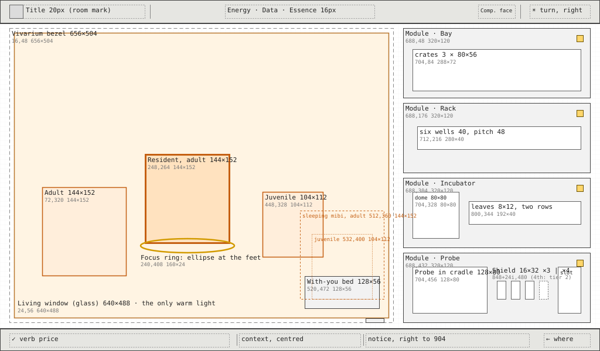

*Home with the ring on a resident. Wireframe, layout only, measured, 1×. Status: Decided layout (2026-10-08), with the sleeping mibi and the Shield plates per tier.*

**L2.2 spec** (UI designer, 2026-10-09 12:12, America/Mexico_City). **Decided** (owner, 2026-10-09 12:20): the structure, the states and the navigation; the details (keys, sizes, timings, words) are the UI designer's, with the disciplines' rulings of 2026-10-09 (the [answered questions](#open-questions-for-l22)). For the LVGL face ([lvgl-switch.md](../proposals/lvgl-switch.md) §3 to §4, L2.2): every drawn region names its word or composition, Home's three states (home, arrival, report), the rest knob, Home's focus as `order` and `nearestIn` data, [Dock and arrival](#dock-and-arrival) and [Idle](#idle). The numbers live in `prototypes/ui/specs/station/home.json` and, for Idle, `frame.json` `idle`. Each wireframe below has a 1× PNG beside its SVG.

<table><tr>
<td valign="top">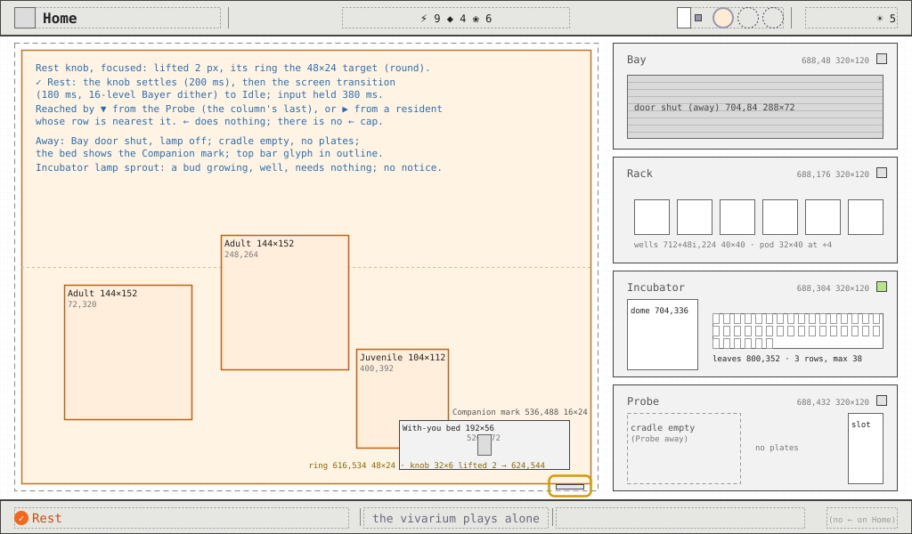 <em>01e. Home with the Companion away and the ring on the rest knob: the Bay shut, the cradle empty, the Companion mark on the bed, `✓ Rest`. 1×, measured. Status: Decided (owner, 2026-10-09 12:20).</em></td>
<td valign="top">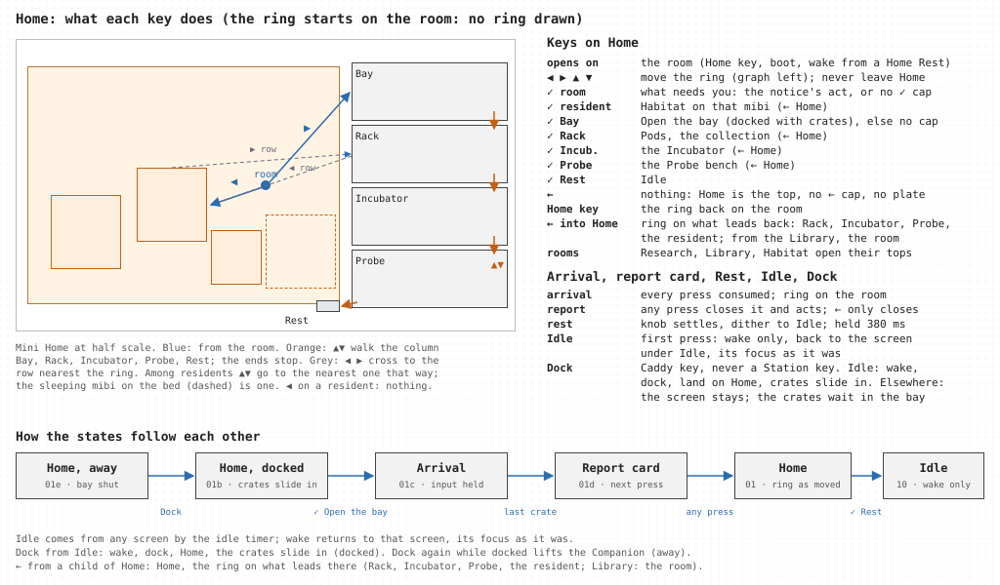 <em>01f. Home, Rest, Dock and Idle: what opens first, what each key does, how ← returns, and how the states follow each other. 1×. Status: Decided (owner, 2026-10-09 12:20).</em></td>
</tr></table>

### 1. Purpose

Home is the always-on view: the collection alive, and the instrument's state. The player comes away knowing that their mibis are well and what (if anything) needs them, and can go from here to whatever does.

### 2. Elements

| Element | Why it is here |
| --- | --- |
| **The vivarium** (the living window) with the residents | The collection alive; the reason the device is on |
| **The with-you bed** | Shows where the mibi with you is: here or out with the Companion |
| **Four modules**, each one word, a lamp and its object: Bay (crates), Rack (six wells), Incubator (dome and leaves), Probe (Probe, Shield plates, the sitting slot) | The instrument's state, read by shape; an amber lamp marks the one that needs you |
| **Rest knob** | The deliberate way to put the Station on its living view, Idle, to stay on all day |
| **Bottom line** | What needs you, in words, at the right; what ✓ does with the current focus |

**Cut from the build:**

- The status strip's three text rows ("2 pods in the rack", "0 of 6 bays taken"): the modules show this by shape.
- The wooden bay door, the felt strip and the lamp on its stand (never a cottage).
- The words written inside the vivarium ("Dot is out with you"). The bed's Companion mark and the bottom line say this.
- The plate's module names become one word each: Bay, Rack, Incubator, Probe.
- The name label inside the window goes. The window carries no words, and the focused resident's name is the bottom line's subject.

### 3. Placement

**Reading order:**

1. **The residents**, warm, in the window's left two thirds.
2. **What needs you:** the one amber lamp in the module column, and the bottom line's right part, which repeats it in words.
3. **The modules**, read by shape, top to bottom in the order the loop runs (crates arrive, pods wait, a bud grows, the Probe is ready).
4. **The top bar's counters.**

**At the edges:** the module column at the right edge; the rest knob on the bezel's bottom rail.

### 4. Art direction

- **Rooms:** the overview (the frame and modules are industrial, plasticky hardware) holding the vivarium (cozy, alive).
- **The vivarium is the only warm light,** daylight from the top left. The modules are cool enamel and slate, evenly lit.
- **Nothing overlaps the vivarium.** No wood, felt, shelves or lamp-lit bench.
- **Residents** are the matched rich treatment, or the placeholder with its waiting lamp until their painting lands, and never enlarged tokens.

**Colour roles** (decided by the UI designer with the art director's eye, 2026-10-08; palette names from [ui-kit §2](../proposals/ui-kit.md#2-the-kit), the one home is `prototypes/ui/specs/station/home.json` `colours`). The chrome is the cool instrument ramp; inside the glass is the only warm field; the warm marks on the chrome are signals only (the focus ring, the amber lamp, Confirm's orange, the orange seal tag).

| Region | Roles | Why |
| --- | --- | --- |
| Bezel (the living window's frame) | `metal` fill; lit top and left edge `enamel`, shade bottom and right `bevel`; 1 px outer edge `hairline` | Brushed metal is the palette's role for the window's bezel; lit from the top left, one step either side of `metal` (*the builder's derived `bevel` light and `hairline` shade were darker than the metal on both sides*) |
| Glass | Inside 1 px edge, top and left, `frostD` (glass edges) | The glass reads as glass, not a hole |
| Glass inside, until the Home master | One flat placeholder plate: back `forest`; ground band (y 300 to 528) `clay`, its top row `sand`; the strip under the band (y 528 to 544) `soil` | A planted back and a lit earth floor: the vivarium's greens and warm earth, the only warm field on screen. The residents stand on the lit floor, so the dark coats (charcoal, cobalt, lagoon) read against it (*corrected: the builder's derived `night` back and `slate` band made a cold, dark box and failed "the vivarium is the only warm light"*). The master replaces it on the painted layer, off palette by decision |
| Modules | `panel` fill, `hairline` edge, `bevel` top (the kit's instrument panel); the word in `metal`, 16 px | The word engraved and quiet, about 3:1 on the panel (owner, 2026-10-07: the object and its lamp lead; *corrected: the builder's derived `bone` made the word the brightest thing in the module*) |
| Lamps (12×12, 1 px `void` rim) | Off `hairline`; in use and well `sprout`; waiting on the cloud (a portrait being painted) `sky`, filling; needs you `amber`, pulsing slowly, on one module at most | The kit's lamp roles. Amber is the module the room's ✓ acts on, and the bottom line's right part says it in words |
| Bay | Door shut: `metal` shutter, `bevel` slat lines on an 8 px pitch, `enamel` lit top edge. Open: inside `ground`; the cool beam while a seal breaks `tealD` (the Pods beam); crates `deepTeal` with a `teal` lit top edge, a `hairline` outline and an `orange` seal tag | Station screens' crates in slate and teal with orange seal tags; the beam is the only light change of the arrival |
| Rack | Wells: fill `ground`, inner top and left 1 px `void`, inner bottom and right lip `bevel` (a recess lit from the top left); glint star `yellow` | Pods keep their own species colours from the signed sprite |
| Incubator | Dome base `enamel`, glass edge `frostD`, highlight `frost`; a filled leaf `sage` with a `sageD` vein, an empty leaf `hairline` | The palette's leaf timer and dome roles |
| Probe | Cradle `metal`; Shield plates whole `white`, gone `bevel` outline; sitting slot empty a 1 px `hairline` outline, held a gilt frame in `gold` lit `yellow` | Whole plates read as white, the kit's role |
| With-you bed (placeholder until the Home master) | A low nest: rim `bark`, hollow `soil`, lit rim top left `sand`; the Companion mark 16×24 in `mist` | Inside the warm field; the mark is in context grey because it says "away" |
| Waiting lamp | `sky`, 1 px `void` rim | The kit's waiting role (cool, never a word) |
| Rest knob | `enamel`, lit top row `frost`, shade bottom row `bevel` | One step lighter than the bezel it sits on, so it reads as a part |
| Ribbon | Fill `tealD`, 1 px rim `aqua`, words `bone` | The one ribbon look, as on Pods (the read tab's cool look); cool on the warm field so it reads as an event, not part of the scene |
| Report card | `panel` fill, `hairline` edge, `bevel` top, drop shadow `void` at (+2, +3); heading and lines `bone`, row leads and context `mist`, figures `bone`, bullets `bevel` | An instrument readout, the overview's hardware (*the build's paper card was the Library's material*) |

### 5. Composition

The vivarium's glass fills the left (16 to 672) in a thin bezel. The four modules stack in one 320 px column at the right with 8 px gaps. Residents walk the lower 55% of the glass.

| Region | Rectangle | Notes |
| --- | --- | --- |
| Vivarium bezel | 16, 48, 656, 504 | 8 px bezel |
| **Living window (glass)** | 24, 56, 640, 488 | Ground band from y 300 to 528, where the residents' feet go |
| **Resident, adult or elder** | 144×152 each | Rendered at size; feet within the ground band |
| Resident, juvenile | 104×112 | Reads young by proportion |
| Resident focus | ellipse, box width + 16 by 24, under the feet | The resident lifts 4 px |
| With-you bed | 520, 472, 128, 56 | The mibi with you sleeps here when docked; a 16×24 Companion mark at (576, 488) when away |
| **The sleeping mibi** (docked) | adult or elder 512, 360, 144, 152; juvenile 532, 400, 104, 112 | The resident's own painting in its nap pose, in the same box as a resident of its stage, bottom-centred on the bed's hollow at (584, 512), 16 px above the bed's foot. It is never the 48 px Companion token (a pixel token beside painted residents would read as another creature, and Residents are never tokens). The adult overhangs the 128 px bed by 8 px each side, inside the glass. It is a focus target like a resident (the ellipse under its feet, `✓ Look at ‹name›`) but does not lift: it is asleep. The 24×16 asleep mark sits at its box's top right; the waiting lamp, when shown, 8 px to the mark's left. The juvenile's x sits 4 px off the grid, as the medium pod's does (*decided by the UI designer, 2026-10-08, for the builder's open question*: the document gave no size; the build drew the nest with only the asleep mark) |
| Waiting lamp | 12×12 at the resident's top right | Until its painting lands |
| Rest knob | 624, 544, 32, 8 | On the bezel's bottom rail. Focus target 48×24 around it |
| Module: Bay | 688, 48, 320, 120 | Word at (704, 60), 16 px; lamp 12×12 at (984, 60); door and crates 704, 84, 288, 72, with up to three crates of 80×56 on a 96 px pitch |
| Module: Rack | 688, 176, 320, 120 | Lamp at (984, 188); six wells of 40×40 at (712 + 48i, 224); in each, the signed 32×40 well pod, 1:1, at (712 + 48i + 4, 224): it fills the well's height, so centred and bottom-aligned are the same place, the stem on the well's top row and the shell's foot on its floor (y 263), 4 px clear either side (*decided by the UI designer, 2026-10-08: was "pods 24×32 in them"; the signed well pod is 32×40 and is never scaled*); a glint star 12×12 above its well at y 212, centred on it at x 712 + 48i + 14, 8 px clear of the word's baseline (y 204) as on the Bay (*corrected by the UI designer, 2026-10-09, on the art director's ruling of 12:25: the objects 8 px clear of the module's word*: was wells and pods at y 216, the star at y 204 on the word's baseline*) |
| Module: Incubator | 688, 304, 320, 120 | Lamp at (984, 316); dome 704, 336, 80, 80 with the bud's glow; leaves 800, 352, 192, 40 (8×12 each on a 12 px pitch, two rows of 16) (*corrected by the UI designer, 2026-10-09, on the art director's ruling of 12:25: the objects 8 px clear of the module's word*: was dome 704, 328 and leaves 800, 344; the word's 20 px line box ran to y 336, over the dome*) |
| Module: Probe | 688, 432, 320, 120 | Lamp at (984, 444); Probe in its cradle 704, 464, 128, 80; Shield plates 16×32 on a 24 px pitch at (848 + 24i, 488): three on a tier-1 Probe (848 to 912), four on tier 2 (848 to 936), each whole or gone, never a ghost for a plate the tier does not have; standing like the Companion's plates, centred on the cradle's middle (y 504), 16 px clear of the sitting slot at four (*decided by the UI designer, 2026-10-08, for the builder's open question*: was 3 × 28×12 at (848 + 36i, 496); four of those ran 36 px into the sitting slot); sitting slot 952, 464, 40, 80 (an empty gilt frame when a sitting is held) (*corrected by the UI designer, 2026-10-09, on the art director's ruling of 12:25: the objects 8 px clear of the module's word*: was cradle and slot at y 456, plates at y 480; the word's line box ran to y 464, over the cradle*). While the Companion is away: the cradle empty, no plates, the lamp off; the sitting slot still shows when a sitting is held |

**Regions and their words** (*L2.2, UI designer, 2026-10-09; structure Decided by the owner, 2026-10-09 12:20*). Every drawn region names its word from the closed vocabulary (`component`) or the composition it is built as (`build`), so the face's spec loader can refuse anything else ([lvgl-switch.md](../proposals/lvgl-switch.md) §2.3, lint). States: **home** (at rest, docked or away), **arrival** (from `✓ Open the bay` to the last crate) and **report** (from the arrival's end to the next press). A region with "only in" exists in those states alone.

| Region (`home.json`) | Rectangle | Word or build | Only in | States it shows |
| --- | --- | --- | --- | --- |
| `bezel` | 16, 48, 656, 504 | living window, part frame | | — |
| `glass` | 24, 56, 640, 488 | living window, part inside | | — |
| `resident` | 144×152 or 104×112, where the face steps it inside the ground band (24, 300, 640, 228) | living window, part residents (clipped to the glass) | | walking; facing the column during the arrival; focused (4 px lift, ellipse) |
| `bed` | 520, 472, 128, 56 (sleeper 512, 360, 144, 152 or 532, 400, 104, 112) | build `withYouBed` | | docked: the sleeping mibi; away: the Companion mark 16×24 at (576, 488); none: the nest alone |
| `knob` | 624, 544, 32, 8 | build `restKnob` | | rest; focused: lifted to (624, 542), ring (616, 534, 48, 24); pressed: the rest event |
| `bay` | 688, 48, 320, 120 | panel, build `module` | | away: door shut, lamp off; docked: door open, crates at (712 + 96i, 92, 80, 56), lamp amber while crates wait; arrival: lifted 2 px, beam (712 + 96i, 84, 80, 72) behind the opening crate; report: settled, empty |
| `rack` | 688, 176, 320, 120 | panel, build `module` | | a well shows empty until its travelling pod lands |
| `incubator` | 688, 304, 320, 120 | panel, build `module` | | — |
| `probe` | 688, 432, 320, 120 | panel, build `module` | | docked: the Probe and its plates; away: the cradle empty, no plates, lamp off |
| `travel` | 688, 48, 320, 248 | panel, build `module`, part travel (over the column) | arrival | pods 32×40 from (crate.x + 24, 100) to (716 + 48i, 224) |
| `ribbon` | 40, 72, 608, 40 | ribbon | arrival | one crate's words at a time |
| `report` | 64, 120, 560, 312 at most 320 | panel, build `reportCard` | report | its rows by count (below) |

The ring is the frame's `focusRing` word; the bottom line and the top bar are the frame's. No region carries a status strip: Home §2 cut it, and the architect struck it from L2.2 (2026-10-09 12:25).

**Arrival** (the Dock and arrival state of Home) is specified in its own section, [Dock and arrival](#dock-and-arrival): the ribbon at 40, 72, 608, 40 inside the glass top, in 20 px; the report card at 64, 120, 560 wide and at most 320 tall, over the vivarium until the next press; the Bay module lifted 2 px, the chrome lift, over 200 ms as its door opens, staying lifted while its crates open and settling when the card shows (*decided by the UI designer, 2026-10-08: was 4 px. One lift for chrome everywhere; at 4 the Bay's top would sit at y 44, 4 px under the top bar's rule, inside the 8 px gap rule, and a ring on it would meet the rule. The arrival is carried by the door, the cool beam and the crates, not by a bigger lift. Station screens' "grows a little" is read as this lift: nothing is scaled*). The rest of the layout stays where it is.

**The report card** (decided by the UI designer, 2026-10-08; the layout gave only its box). What came home, in one look, for the player who looked away during the crates, and the one thing the arrival does not show: what the world did meanwhile. It lists, in this order, the crates (what each brought and how far the land is explored), what was gathered, the Probe's mend, and the world's lines. Digits appear only beside a material icon (an amount gathered or a price: the frame's exception). Pods are pictured; everything else is words. No expedition numbers and no turn number on the card; the turn is the top bar's.

- **Box:** x 64, y 120, w 560; 16 px padding all round, so content runs from x 80 to 608. Rows are 24 px tall on a 24 px pitch: a 16 px icon at row.y + 4, a 16 px line box at row.y + 2. Each row has a **lead** in a 128 px column (x 80 to 208, `mist`) and its content from x 216.
- **Height** = 104 + 24 × (crates + Probe row) + (world lines ? 40 + 24 × lines : 0). At most three crates (the bay's three), one Probe row and three world lines: 104 + 96 + 112 = 312, inside the 320. Every height lands on the 8 px grid.

| Row | y (full card) | Lead | Content |
| --- | --- | --- | --- |
| Heading | 136, 32 tall | — | "Home from the field", 20 px medium, `bone` |
| A crate, one row each, in the order they opened | 176, 200, 224 | "First crate", "Second crate", "Third crate"; a developer crate "Developer crate" | Its pods as 16 px Pod icons on a 20 px pitch, at most eight (past eight: the words "many pods"; none: "no pods"); then from x 392 how far the land is explored, in words: under a third "a first look around", under two thirds "half the land explored", under all "most of the land explored", all "all the land explored"; a crate with no map (a developer crate) says nothing here |
| Gathered | 256 | "Gathered" | Energy, Data and Essence as the frame's counters: 16 px icon, 4 px gap, "+3" in tabular figures, 24 px between; the developer top-up, when set, adds "· with the top-up" in `mist` |
| Probe, only when it was mended | 280 | "Probe" | Its Shield plates as 16 px Shield icons on a 20 px pitch (whole, or the "Shield gone" icon): three for a tier-1 Probe, at content x + 0, 20, 40; four for tier 2, to content x + 60 (*decided by the UI designer, 2026-10-08, for the builder's open question*), then "mended free", or "mended · ⚡ 2" when Energy paid for it |
| The world, only when it turned | 320 (16 px gap above), lines at 344, 368, 392 | "Meanwhile, the world turned" across the row, `mist` | Up to three of the last crate's world lines, `bone`, from x 96 behind a 4×4 `bevel` bullet at (80, row.y + 10). Each line is the rules' own words: six words or fewer, no digits; a longer one is a copy fault in the rules, never clipped here |

The card closes on the next press, and that press also does what it does: ✓ follows the bottom line (`✓ Look at the new pods`), the pad moves the ring, ← only closes it. No press is swallowed.

### 6. Interactions

| Input | What happens, and how it shows |
| --- | --- |
| Pad | A fixed order (station-screens.md, Keys and navigation): ◀ ▶ between the residents (feet ellipse) and the instrument column, and ◀ among the residents to the nearest one on the left (**Decided**, owner, 2026-10-09 12:20); ▲ ▼ walk the column, Bay, Rack, Incubator, Probe, Rest (rounded rectangles). From the room, ▶ lands on the Bay and ◀ on the nearest resident (*corrected by the UI designer, 2026-10-09, the owner's decision on the navigation model*: was the nearest drawn thing that way). As data, [Home's focus graph](#homes-focus-as-data) below |
| ✓ on the room (no focus) | Does what needs you: `✓ Open the bay · 2 crates`, `✓ Look at the new pod`, `✓ Open the incubator`, `✓ Meet Moss`. With nothing needed there is no ✓ cap |
| ✓ on a resident | `✓ Look at Bean` opens Habitat on Bean. The sleeping mibi on the bed is one too |
| ✓ on Bay | `✓ Open the bay · 2 crates` when docked with crates; otherwise no ✓ cap, and the subject says why ("closed while the Companion is away") |
| ✓ on Rack, Incubator or Probe | Opens Pods, the Incubator or the Probe bench |
| ✓ on the rest knob | `✓ Rest` starts Idle ([the rest knob](#the-rest-knob) below); the first press on Idle only wakes |
| ← | Nothing, wherever the ring is: Home is the top, so there is no ← cap; the Home key puts the ring back on the room (*corrected by the UI designer, 2026-10-09, the owner's decision on the navigation model*: was "focus back to the room"). On the room, likewise nothing: no message plate, and the bottom line shows no `← where` (*decided by the UI designer, 2026-10-08: was "a message plate says Home is the top view". Both places a plate can take on Home, its bottom edge at y 550 or its top at y 112, are over the living window, which carries no words; and the top bar already names Home. A ← with nowhere to go is not a mistake to explain*) |
| Any press while the report card shows | Closes the card and does what it does (above): ✓ follows the bottom line, the pad moves the ring, ← only closes it |
| During arrival | Presses are consumed; focus stays on the room ([Dock and arrival](#dock-and-arrival)) |
| Dock (the Caddy's key) | Never a Station key and never reaches the face. On Home the crates slide into the bay; elsewhere the screen stays and the crates wait in the bay; from Idle it wakes, docks and lands on Home ([Dock and arrival](#dock-and-arrival)) |
| ← on a child of Home (*L2.2, UI designer, 2026-10-09*) | Home opens with the ring on what leads back to that child: Pods → Rack, the Incubator → Incubator, the Probe bench → Probe, Habitat → that resident if it is at home (else the room), the Library → the room. A room key or a jump into Home lands on the room |

### Home's focus as data

*L2.2, UI designer, 2026-10-09; ◀ on a resident **Decided** (owner, 2026-10-09 12:20).* `home.json` `focus` replaces `nav.mjs` `homeMove` with the two graph primitives of [lvgl-switch.md §2.6](../proposals/lvgl-switch.md#26-the-focus-graph). Targets: `resident.<mibi id>` in group `resident` (the sleeping mibi on the bed is one, without the lift), and `bay`, `rack`, `incubator`, `probe`, `knob` in group `column` (`knob` is frame.json `navigation.homePad`'s "rest"). The room is the ring on nothing: no ring drawn, its point roomAt's centre (512, 300).

| From | ◀ | ▶ | ▲ | ▼ |
| --- | --- | --- | --- | --- |
| The room | `nearestIn: resident` | `bay` | none | none |
| `column` (`order: [bay, rack, incubator, probe, knob]`) | `nearestIn: resident` | none | the previous in the order; the end stops | the next in the order; the end stops |
| `resident` | `nearestIn: resident, ahead` (the nearest resident to its left; the leftmost stays) | `nearestIn: column` | `nearestIn: resident, ahead` | `nearestIn: resident, ahead` |

- **`order`** steps through the list as written, skipping ids that are not targets now; never a wrap.
- **`nearestIn: g`** lands on the target of group g whose box centre is nearest the ring's row: |dy| × 4 + |dx| × 0.01, centre to centre. An empty group leaves the ring where it is.
- **◀ on a resident** goes to the nearest resident to its left; ▶ still crosses to the column (**Decided**, owner, 2026-10-09 12:20: was nothing, which could strand two residents at one height, neither 6 px ahead of the other by ▲ ▼). From the column, ◀ lands on the row-nearest resident, nearest the column, so every resident is reachable.
- **`ahead`** (the residents' ▲ ▼ ◀) takes only the group's targets more than 6 px ahead in the key's direction, nearest by along + 2.2 × across, as `homeMove` does.
- **The exact semantics** are [lvgl-switch.md §2.6.1](../proposals/lvgl-switch.md) (architect, 2026-10-09 12:25): `ahead` is a parameter of `nearestIn`; the scores are integers on doubled centres (`nearestIn` 400 × across + abs(along); `ahead` along > 12, then 5 × along + 11 × across); an edge may be an ordered list, the first present entry winning.
- **The Home key** on Home sets the focus to the room (`roomKey`). **Holds:** while the arrival or the rest plays, the face moves no focus and sends no intent. **The report card:** any key closes it and still does what it does.
- **Rings:** a resident's ellipse under its feet (box width + 16 by 24, starting 8 px above the feet); a module's round ring 4 px outside its rectangle, with the 2 px chrome lift; the knob's ring is its 48×24 target, below.
- **Vectors for the focus tests** (`nav.test.mjs`'s Home walk becomes these): room ▶ bay; bay ▲ bay; bay ▼ rack; probe ▼ knob; knob ▼ knob; knob ▶ knob; room ▲ room; room ◀ the resident nearest (512, 300) by row, or the room when no resident is home; the leftmost resident ◀ itself; a resident ◀ the nearest of those more than 6 px to its left.

### The rest knob

*L2.2, UI designer, 2026-10-09.* **What it is for:** the deliberate way to put the Station on its living view, [Idle](#idle) (Home §2). **What it shows:** a chrome knob on the bezel's bottom rail and nothing else; no word on the stage. Its states, in `home.json` `regions.knob.states`:

| State | Knob | Ring | Bottom line |
| --- | --- | --- | --- |
| Rest | 624, 544, 32, 8 | none | as the focus elsewhere says |
| Focused (▼ from Probe, or ▶ from a resident whose row is nearest it) | lifted 2 px over 200 ms: 624, 542, 32, 8 | round, on its 48×24 target, riding the lift: 616, 534, 48, 24 | `✓ Rest` \| "the vivarium plays alone" \| the notice as on the room; no ← |
| Pressed (✓) | settles back to 624, 544 over 200 ms; the ring goes | none | — |

Then the screen transition (180 ms, the 16-level Bayer dither) takes the screen to [Idle](#idle). Input is held for the 380 ms. The ring sits on the 48×24 target itself, 8 px outside the knob, rather than 4 px outside the target: at 4 px outside its bottom would reach y 564, over the bottom line's rule at 562; lifted, it ends at 558. The knob cannot be reached during the arrival.

### Placeholders on Home

| Thing | Pixel size |
| --- | --- |
| Vivarium | 640×488 |
| Residents | 144×152 adult, 104×112 juvenile |
| Crates | 80×56 |
| Pods in the rack | 32×40, the signed well pod (*was 24×32*) |
| Dome | 80×80 |
| Leaves | 8×12 |
| Probe | 128×80 |
| Shield plates | 16×32 (*decided by the UI designer, 2026-10-08, for the builder's open question*: was 28×12) |
| Sitting frame | 40×80 |
| Lamps | 12×12 |
| With-you bed | 128×56 |
| Companion mark (on the bed, while away) | 16×24 |
| Sleeping mibi (on the bed, docked) | the resident's box of its stage, 144×152 or 104×112, in its nap pose |
| Rest knob | 32×8 |

All stand-ins until the Home and bench masters.

### Changes from the current build

- The vivarium goes from (14, 50, 636×500) to the bezel and glass above.
- The bench goes from free-placed objects at (664…1010) to four modules of 320×120.
- The status strip and the lamp on its stand go. Residents go from 64 and 96 px to 104 and 144 px boxes.
- The rest knob replaces the lamp on its stand as Home's way to Idle; the build's "rest" word under the lamp goes (the knob carries no word; `✓ Rest` is the bottom line's).
- With the Companion away the Probe's cradle is drawn empty, with no plates; the build draws a hairline ghost Probe there (`home.mjs` `drawCradle`) (game designer, 2026-10-09 12:24).
- Home's pad moves from `nav.mjs` `homeMove` to `home.json` `focus` (L2.2); the build's ids `tray`, `inc`, `cradle`, `lamp` become `rack`, `incubator`, `probe`, `knob`.

---

## Dock and arrival

A state of Home, not a screen of its own: the same layout, with the bay leading. Wireframes: [01b-home-docked.svg](station-layouts/01b-home-docked.svg), [01c-home-arrival.svg](station-layouts/01c-home-arrival.svg), [01d-home-report.svg](station-layouts/01d-home-report.svg), each with its 1× PNG.

**L2.2 spec** (UI designer, 2026-10-09 12:13, America/Mexico_City). **Decided** (owner, 2026-10-09 12:20): the structure, the states and the navigation; the details (keys, sizes, timings, words) are the UI designer's, with the disciplines' rulings of 2026-10-09 (the [answered questions](#open-questions-for-l22)). The numbers live in `home.json` (`regions.bay`, `travel`, `ribbon`, `report`, `events.crateIn`, `events.arrival`).

<table><tr>
<td valign="top">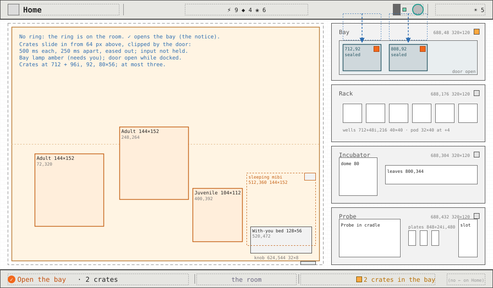 <em>01b. Docked: two sealed crates slid into the open bay, the Bay's lamp amber, the ring on the room, `✓ Open the bay`. 1×, measured. Status: Decided (owner, 2026-10-09 12:20).</em></td>
<td valign="top">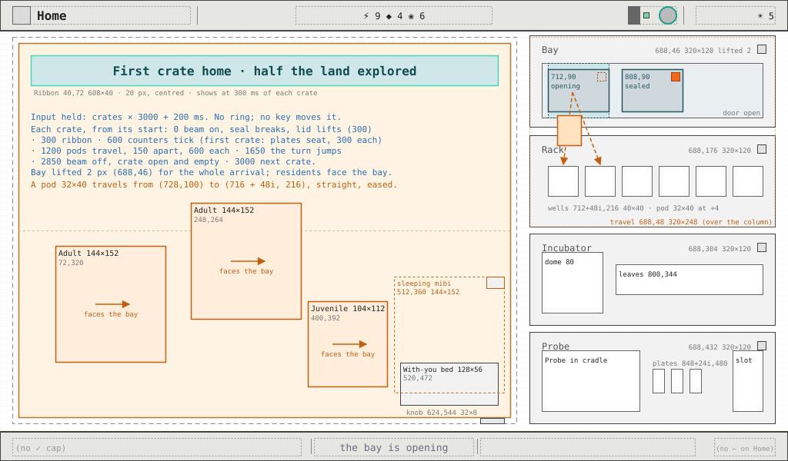 <em>01c. The arrival, the first crate opening: the Bay lifted 2 px, the beam behind the crate, a pod travelling to its well, the ribbon in the glass, the residents facing the bay, input held. 1×, measured. Status: Decided (owner, 2026-10-09 12:20).</em></td>
</tr><tr>
<td valign="top">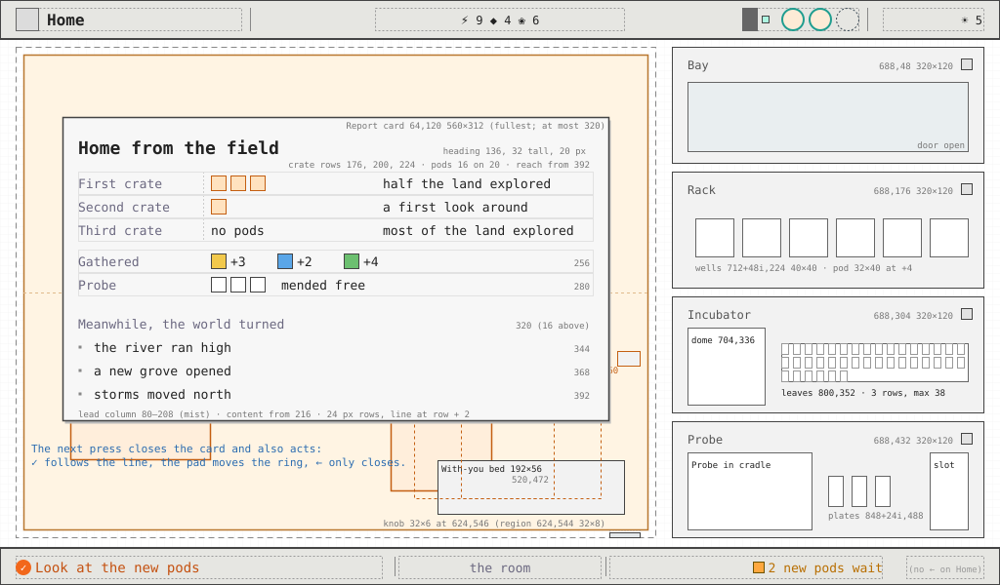 <em>01d. The report card at its fullest (three crates, the Probe row, three world lines), 64, 120, 560×312, until the next press. 1×, measured. Status: Decided (owner, 2026-10-09 12:20).</em></td>
<td></td>
</tr></table>

### 1. Purpose

Cargo arrives when the Companion docks and the player opens the bay (Station screens, Dock and arrival). **Reads first:** how many crates are in the bay, then the ribbon. Docking alone shows crates and accepts nothing; opening the bay is a press.

### 2. Elements

| Element | Why it is here |
| --- | --- |
| **Crates in the Bay**, one per consignment, at most three | How much came home, before anything opens |
| The Bay's amber lamp and the notice | The bay is what needs you; the room's ✓ opens it |
| **The beam and the seal** on the opening crate | One crate's arrival reads as one event |
| **Pods travelling** from the crate to the rack's wells | Where the new pods went |
| **The ribbon** in the glass | Which crate this is, in words |
| The top bar's counters and turn, ticking | What was gathered, and that the world turned |
| The Probe's plates seating | The free mend, shown on the Probe module |
| The residents turning toward the bay | The vivarium notices; nothing of the field is drawn |
| **The report card** | What came home, in one look, and what the world did meanwhile |

### 3. Placement

1. **The crates in the Bay** (top right, the first module of the column).
2. **The ribbon**, inside the glass top, the only words on the stage during the arrival.
3. **The travelling pods**, from the bay down into the rack.
4. The counters and turn in the top bar; the plates on the Probe.
5. **The report card** last, over the vivarium's upper half, clear of the column.

### 4. Art direction

The overview's hardware: Home §4's colour roles, unchanged. The beam is the arrival's only light change (`tealD`, the Pods beam); crates `deepTeal` lit `teal` with an `orange` seal tag; the ribbon the one ribbon look (`tealD`, `aqua` rim, `bone` words), cool on the warm field; the card an instrument `panel`. Nothing of the field is drawn.

### 5. Composition

| State | What is drawn, measured |
| --- | --- |
| **Away** (01e) | The Bay's door shut (`metal` shutter, slats on an 8 px pitch) 704, 84, 288, 72; its lamp off; the Probe's cradle empty with no plates; the bed's Companion mark |
| **Docked** (01b) | The door open (`ground` inside). One sealed crate per consignment at (712 + 96i, 92, 80, 56), i = 0 to 2, left to right in the order they will open. The Bay's lamp amber while crates wait. The Probe in its cradle; the sleeping mibi on the bed |
| **Crates sliding in** | Each crate slides down from 64 px above its place, (712 + 96i, 28), to (712 + 96i, 92), clipped by the door, in whole pixels, eased out, 500 ms each, 250 ms apart. Input is not held. It plays when the Companion docks while Home shows, or when Dock lands on Home from Idle. Docked on another screen, the crates are simply there when Home next shows |
| **Arrival** (01c) | The Bay lifted 2 px to (688, 46) for the whole arrival. Behind the opening crate, the beam (712 + 96i, 84, 80, 72). The crate goes sealed → opening (the tag gone, the lid lifting) → open (empty). Pods 32×40 travel over the column from (crate.x + 24, 100) to their well's pod place (716 + 48i, 224), inside `travel` (688, 48, 320, 248); a well shows empty until its pod lands. The ribbon (40, 72, 608, 40), 20 px, centred, one line. The residents stop and face the column. The bottom line has no ✓ cap and no notice; its context reads "the bay is opening" |
| **Report** (01d) | The ribbon and crates gone, the Bay settled, the card at (64, 120, 560, h), h = 104 + 24 × (crates + Probe row) + (world lines ? 40 + 24 × lines : 0), at most 312; its rows as in Home §5. The residents walk again |

**One crate's timeline** (3000 ms, from the crate's start; `home.json` `events.arrival`):

| ms | What plays |
| --- | --- |
| 0 | The beam shows behind the crate; the seal breaks and the lid lifts over 300 ms (the first crate also lifts the Bay, 2 px over 200 ms) |
| 300 | The ribbon shows this crate's words: it appears with the first crate and changes words with the next, a cut, no fade |
| 600 | The counters tick this crate's materials (the top bar's own tick and flash). On the first crate only, each mended Shield plate seats, gone → whole, 300 ms apart, left to right |
| 1200 | The crate's pods travel to their wells, in well order, 150 ms apart, 600 ms each, eased in and out |
| 1650 | The world turn jumps to the crate's turn (the top bar's tick) |
| 2850 | The beam goes; the crate stays open and empty |
| 3000 | The next crate starts. After the last: the ribbon and crates go, the Bay settles (2 px, 200 ms), the card shows |

**The hold:** input is held for crates × 3000 + 200 ms. With reduced motion every step jumps to its end and the hold is the same 200 ms after the last crate's end state.

### 6. Interactions

| Input | What happens, and how it shows |
| --- | --- |
| Dock (the Caddy's key) | A world event, never a Station key, never sent to the face. On Home: the crates slide in, the top bar's Companion returns (glyph filled, lamp `mint`, 2 px lift for 200 ms), the Bay's lamp turns amber, the notice names the crates. No message plate (a plate on Home would sit over the living window; the top bar and the bay already say it). Elsewhere: the screen stays; the top bar changes. From Idle: wake, dock, land on Home with the ring on the room, then the crates slide in |
| Dock again while docked | Lifts the Companion: the door shuts (a cut), the bed shows the Companion mark, the top bar's Companion leaves. From Idle it wakes and lifts, and the screen under Idle shows |
| ✓ on the room, or on the Bay, with crates | `✓ Open the bay · 2 crates`: the arrival plays (state arrival) |
| Any key during the arrival | Consumed. The ring stays on the room and is not drawn |
| The next press after the arrival | Closes the report card and does what it does: ✓ follows the bottom line (`✓ Look at the new pods`), the pad moves the ring, ← only closes it |

### Placeholders in the arrival

| Thing | Pixel size |
| --- | --- |
| Crate, sealed / opening / open | 80×56, one slice each |
| Seal tag | inside the crate's slice |
| Beam | 80×72, flat `tealD` |
| Travelling pod | 32×40, the signed well pod |
| Ribbon | 608×40, the ribbon word |

### Changes from the current build

- The ribbon loses its digits and says the crate only: "First crate home", "Second crate home", "Third crate home", "Developer crate home" (copywriter, 2026-10-09 12:22: was "Expedition 4 home · 2 pods · explored 9 of 21"); how far the land is explored stays on the report card.
- A pod that finds no free well does not travel: it waits sealed and lands, oldest first, as a well frees, and it is a notice after crates, the bud ready, a meeting, new pods and glints (game designer, 2026-10-09 12:24). The report card pictures it in its crate's row.
- The pods travel in a straight eased line inside `travel` (the build arcs them 30 px and starts at 40% of the crate); the opened crate stays drawn open (the build writes "opened" in its place).
- The build's message plate on Dock goes.

---

## Idle

The Station's living view, kept on all day. A state of the frame (`props.idle`), not a screen: the screen under it keeps its state and focus. Wireframe: [10-idle.svg](station-layouts/10-idle.svg) and its 1× PNG.

**L2.2 spec** (UI designer, 2026-10-09 12:13, America/Mexico_City). **Decided** (owner, 2026-10-09 12:20): the structure, the states and the navigation; the details (keys, sizes, timings, words) are the UI designer's, with the disciplines' rulings of 2026-10-09 (the [answered questions](#open-questions-for-l22)). The numbers live in `prototypes/ui/specs/station/frame.json` `idle`.

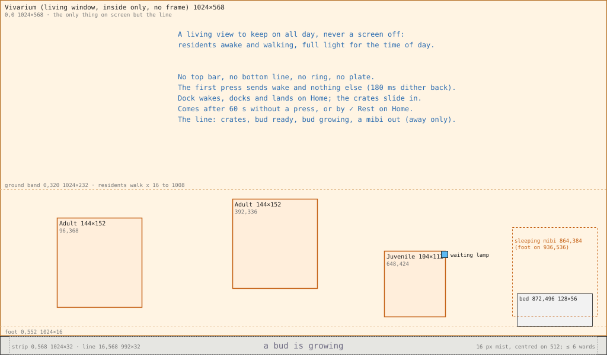

*10. Idle: the vivarium full screen, the residents and the with-you bed, and one line on a 32 px strip at the foot; no frame, no ring. 1×, measured. Status: Decided (owner, 2026-10-09 12:20).*

### 1. Purpose

A view the Station can show permanently: the vivarium, something alive and worth looking at all day, when nobody is using the instrument (Station screens, Idle; the owner, 2026-10-09 12:20: "idle doesn't mean screen off, means a view that can be shown permanently, vivarium or something interesting to look at"). It is never a screen off, a sleep or a screensaver: the residents are awake and keep their routines, the light is the vivarium's own full light for the time of day, nothing is dimmed, blanked or darkened, and nothing counts down. **Reads first:** the residents. The player at a distance sees the pets at ease and nothing asking for them.

### 2. Elements

| Element | Why it is here |
| --- | --- |
| **The vivarium**, edge to edge | The pets, the reason the device is on |
| **The residents**, at their full size | Alive, keeping their routines; never enlarged |
| The with-you bed | Where the mibi with you is, as on Home |
| **One line** on a thin cool strip | The one state worth knowing at a glance |

**Not drawn:** the top bar, the bottom line, the modules, the message plate, the focus ring, any word inside the window.

### 3. Placement

1. **The residents**, on the ground band of the lower half.
2. The bed at the right, where Home's bed is in the glass.
3. **The line**, last, centred at the foot.

### 4. Art direction

The vivarium only: the warm field fills the screen, its light following the time of day (day, dusk, night, a master per light), never dimmed or darkened for being idle; at night a soft cool moonlight and the residents' own glows. The strip is chrome, cool and quiet: `ground` with a 1 px `void` rule on its top edge, the line in `mist`. Nothing blinks; the waiting lamp may still show on a resident, steady. Until the master, the placeholder is Home's plate at Idle's size: back `forest`, ground band `clay` with a `sand` top row, the foot `soil`.

### 5. Composition

| Region (`frame.json` `idle`) | Rectangle | Word or build | Notes |
| --- | --- | --- | --- |
| `vivarium` | 0, 0, 1024, 568 | living window, part inside, no frame | Ground band 0, 320, 1024, 232; the foot 0, 552, 1024, 16 |
| `resident` | 144×152 adult or elder, 104×112 juvenile | living window, part residents | Walking inside 16, 320, 992, 232 (feet in the band, 16 px from each screen edge); no lift, no ring; the waiting lamp 12×12 at the box's top right |
| `bed` | 872, 496, 128, 56 | build `withYouBed` | The sleeping mibi bottom-centred on (936, 536): adult 864, 384, 144, 152; juvenile 884, 424, 104, 112. Away: the Companion mark 16×24 at (928, 512) |
| `strip` | 0, 568, 1024, 32 | panel, build `idleLine` | 1 px `void` rule on its top edge |
| `line` | 16, 568, 992, 32 | text, in build `idleLine` | 16 px regular, `mist`, centred on x 512 and on y 584; one line, six words or fewer, no digits |

**The line** is one sentence, never dot-joined parts (the frame's rule). When several hold, the first of these shows; when none holds the line is empty; never a demand, nothing nags (**Decided**, owner, 2026-10-09 12:20). The words are the copywriter's (2026-10-09 12:22), and the "out" line shows only while the Companion is away with a mibi; docked, the line says nothing of that mibi (game designer, 2026-10-09 12:24):

| Holds | Line |
| --- | --- |
| Crates in the bay | "a crate waits in the bay", "two crates wait in the bay", "three crates wait in the bay" |
| The bud ready | "the bud is ready" |
| A bud growing | "a bud is growing" |
| Away, a mibi with the Companion | "{name} is out with the Companion" |
| None | empty |

The line's region is the text word inside the `idleLine` composition, which sits in the frame's binding table; its props are one string, `props.frame.idle.line` (architect, 2026-10-09 12:25).

### 6. Interactions

| Input | What happens, and how it shows |
| --- | --- |
| ✓ on the rest knob (Home) | The knob settles (200 ms), then the screen transition, 180 ms, the 16-level Bayer dither, to Idle; held 380 ms |
| The idle timer (any screen) | After 60 s without a press, the same transition to Idle; never during a hold, an arrival or a report card (**Decided**, owner, 2026-10-09 12:20; the build's `IDLE_MS`) |
| Any key on Idle (the first press) | Sends `wake` and nothing else: the transition back (180 ms, held), to the screen under Idle with its focus as it was. Nothing opens, nothing moves, nothing is spent, and waking never rewards |
| Dock (the Caddy's key) | Wakes, docks and lands on Home with the ring on the room; the crates then slide in ([Dock and arrival](#dock-and-arrival)) |
| Dock while docked | Wakes and lifts the Companion; the screen under Idle shows |

### Placeholders on Idle

| Thing | Pixel size |
| --- | --- |
| Vivarium | 1024×568, a master per light (day, dusk, night) |
| Residents | 144×152 adult, 104×112 juvenile |
| With-you bed | 128×56 |
| Sleeping mibi | the resident's box of its stage |
| Companion mark | 16×24 |

### Changes from the current build

- The build draws the vivarium at 1024×562 under a 38 px `void` strip with dot-joined words ("Companion docked · with Dot · a bud is growing"); here 1024×568, a 32 px `ground` strip and one sentence.
- The build writes "Dot is out with you" in 28 px inside the window; no words in a living window.
- The build's bed at (804, 486) moves to (872, 496).
- On the face, Idle is `props.idle`: today `render()` takes the face path before it checks `UI.idle`, so the face keeps drawing the last screen (lvgl-switch.md §1.3).

---

## Open questions for L2.2

None open. Answered on 2026-10-09 and written into the sections above:

- **Q1, `nearestIn` with a direction** (architect, 12:25): `ahead` is a parameter of `nearestIn`, with the integer semantics of [lvgl-switch.md §2.6.1](../proposals/lvgl-switch.md); it serves the residents' ▲ ▼ and ◀.
- **Q2, ◀ on a resident** (owner, 12:20): to the nearest resident on its left.
- **Q3, the ribbon's length** (copywriter, 12:22): the crate only, "First crate home"; the reach stays on the report card.
- **Q4, words touching objects** (art director, 12:25): the dome, cradle, sitting slot and plates 8 px lower; with them the leaves, and the Rack's wells and star (UI designer).
- **Q5, the idle timer** (owner, 12:20): 60 s without a press.
- **Q6, Idle's line** (owner, 12:20; words by the copywriter, 12:22; the "out" line away only, game designer, 12:24).
- **Q7, pods with no free well** (game designer, 12:24): they do not travel; they wait sealed and land oldest first.
- **Q8, the Probe while away** (game designer, 12:24): the cradle empty, no plates, the lamp off; the sitting slot still shows.
- **Q9, the status strip** (architect, 12:25): struck from L2.2.
- **Q10, `idleLine`** (architect, 12:25): a composition in the frame's binding table; its line is the text word.

---

## Create

Concept plate: `art/concept-station/create/placed/CR-C2-stamped-1024x600.png`. Wireframe: [03-create.svg](station-layouts/03-create.svg).

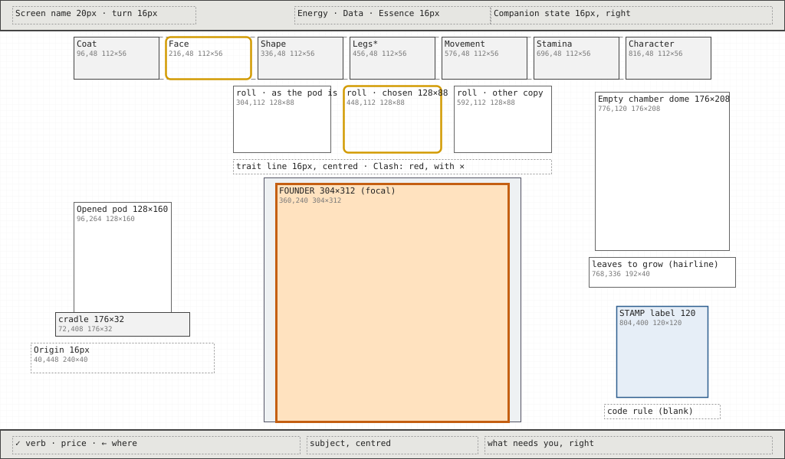

*Create. Wireframe, layout only, measured.*

### 1. Purpose

Create is where the player shapes a founder from a read pod and sees what it will cost. The player leaves either having grown it (paid, the stamp pressed, the bud in the chamber) or knowing exactly what they would get: which looks they changed, which chapters stay a surprise, and the price.

### 2. Elements

| Element | Why it is here |
| --- | --- |
| **The founder** in the specimen chamber, 304×312, misty where unread | The subject: what will grow |
| **The three roll pictures** for the focused trait (as the pod is, and each single copy), the chosen one ringed, with ▲▼ notches and a "changed" tag | The choice itself, as close-ups of the part, never whole founders |
| **The trait line** (16 px), with "Clash" when it clashes | One line naming the chosen look |
| **The chapter rail** with trait pips | Where the focused trait sits; what is read, changed, clashing or still a surprise, with no digits |
| **The opened pod** with its origin | Where the founder comes from |
| **The empty chamber** with the leaves it will take, drawn as hairlines | Where it goes, and how long it will grow, as a picture |
| **Stamp label** (120) and a **blank code rule** | The stamp fills with the changes; the code prints on the rule at Grow |
| **Bottom line** | `✓ Grow it · price · ← Loika`; the subject; what stays a surprise |

**Cut:**

- "◀ ▶ 3 of 3 read traits" and "changed: eye-rings": the pips show both.
- "the code appears at Grow": the blank rule shows it.
- "grows in 21 leaves": the hairline leaves show it.
- "from the pod": the opened pod shows it.
- The plate's "founder", "chamber" and "identified" label plates.
- The 185 px stamp becomes the 120 label.

### 3. Placement

**Reading order:**

1. **The founder**, centred and lowest-set, the one warm thing in its glass chamber.
2. **The roll pictures** directly above it, with the chosen one ringed.
3. **The rail**: where this trait sits and what else is changed.
4. **The pod at the left and the chamber at the right**, balancing the founder.
5. **The stamp label**, low right.
6. **The bottom line** for the total.

**At the edges:** pod (left), chamber and stamp (right), rail (top).

The left and right columns are centred on x 160 and x 864, the same 352 px either side of the founder's axis.

### 4. Art direction

- **Room:** the research bench.
- **The founder is warm**, with its own colours and a warm key light from the top left. Where a chapter is unread, it is frosted in cool pale blue-white, never a guess.
- **Everything else is cool:** the glass, the slate and the empty dome.
- **The founder is the placeholder** (decided for Create, since nothing is painted before Grow), and the roll pictures are placeholder close-ups of the part.
- **Clash marks** are red with a ✕, so they read without colour.

### 5. Composition

The rail is centred across the top. The three roll pictures sit in a row under it. The founder fills a glass chamber in the lower centre. The opened pod stands to the left and the empty dome to the right, with the stamp label under the dome.

| Region | Rectangle | Notes |
| --- | --- | --- |
| Rail | 96, 40, 832, 40 | Hanging from the top bar by the rail's rule, its run centred on x 512 (x 96 for six chapters), with trait pips (*corrected by the UI designer, 2026-10-08, after the art director's second verdict on the Pods masters*: was 96, 48, 832, 56, tabs at x 96 + 120i) |
| Roll picture 1 (as the pod is) | 304, 112, 128, 88 | Close-up of the part, rendered at size |
| Roll picture 2 | 448, 112, 128, 88 | |
| Roll picture 3 | 592, 112, 128, 88 | |
| ▲ and ▼ notches | 12×6, centred over and under the chosen picture, at y 104 and 202 | |
| "changed" tag | 72×20 at the chosen picture's bottom left (x + 4, 176) | One word, 16 px |
| Trait line | 304, 208, 416, 20 | 16 px, centred on x 512 |
| Specimen chamber | 344, 232, 336, 320 | Glass, cool |
| **Founder (focal)** | 360, 240, 304, 312 | At least 300×310, feet at y 536 |
| Opened pod | 96, 264, 128, 160 | Rendered at size |
| Pod cradle | 72, 408, 176, 32 | |
| Origin | 40, 448, 240, 40 | 16 px, at most two lines, centred on x 160 |
| Empty dome | 776, 120, 176, 208 | While a bud grows, its glow shows here and Grow is refused |
| Leaves to grow | 768, 336, 192, 40 | Hairline leaves 8×12 on a 12 px pitch, two rows of 16: one per minute it will take |
| **Stamp label** | 804, 400, 120, 120 | 140 px from the founder's box |
| Code rule | 788, 528, 152, 20 | A 1 px blank rule; at Grow the code prints here in 16 px |

**States.**

- **Nothing read:** the founder fully frosted and no roll row. The trait line says "Read a chapter first"; there is no ✓ cap.
- **Changed:** the tag and an amber pip.
- **Clash:** the ✕ marks; the ✓ cap is withheld; what needs you says "these looks clash".
- **Grow:** the stamp prints in 300 ms, the code appears on the rule, and the pod glides into the chamber in 600 ms. Then the screen changes to the Incubator.

### 6. Interactions

| Input | What happens, and how it shows |
| --- | --- |
| ◀ ▶ | Walk the read traits in ring order, skipping unread chapters; the focused trait's tab wears the slanted ring (no lift; *corrected by the UI designer, 2026-10-08, after the art director's second verdict on the Pods masters*: was "lifts") and its pip is ringed; the roll row and trait line change |
| ▲ ▼ | Roll the focused trait among its three pictures; the founder's part and the stamp's cells redraw in 200 ms; the price updates (+1 ◆ a change) |
| ▲ ▼ on a doing | No roll; the picture wears the two joined rings and the line says "breed to change" |
| ▲ ▼ where the pod carries one look | No roll; the line says "one look here"; a message plate on press |
| ✓ | `✓ Grow it · 2 ⚡ 4 ❀ 1 ◆ · ← Loika`, checked whole and then paid. Refused before paying when the incubator is busy, a bay is not free, or the shape clashes (no ✓ cap, and the reason on the right) |
| ← | Back to the pod's overview with nothing spent: the way back reads the pod's name, "← Loika" (*corrected by the UI designer, 2026-10-09, the owner's decision on the navigation model*: was "← Pods") |

### Placeholders on Create

| Thing | Pixel size |
| --- | --- |
| Founder | 304×312 (the decided placeholder) |
| Roll close-ups | 128×88 |
| Opened pod | 128×160 |
| Dome | 176×208 |
| Hairline leaves | 8×12 |
| Stamp | on the 120 label |

### Changes from the current build

- The rail moves from y 50, 40 tall, to hang from y 40, 40 tall, with slanted touching tabs and pips (*corrected by the UI designer, 2026-10-08, after the art director's second verdict on the Pods masters*: was to y 48, 56 tall).
- The founder moves from (362, 150) to (360, 240).
- The roll pictures grow from 88×60 to 128×88 and move above the founder.
- The pod moves from (150 centre, 130) to (96, 264).
- The stamp label moves from (824, 286) to (804, 400).
- The status texts on the right are cut, and the dome's wooden base becomes enamel.

---

## Incubator: growing and ready

Concept plates: `art/concept-station/incubator/placed/IN-D-r1-a3-stamped-1024x600.png` (growing) and `IN-C1-stamped-1024x600.png` (ready). Wireframes: [04-incubator-growing.svg](station-layouts/04-incubator-growing.svg), [05-incubator-ready.svg](station-layouts/05-incubator-ready.svg).

<table><tr><td>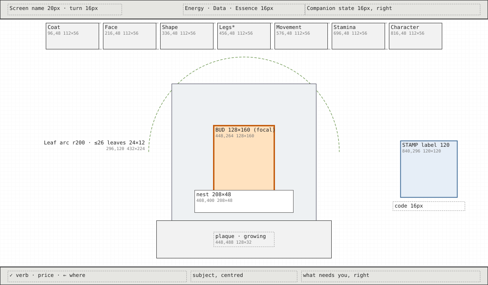</td><td></td></tr></table>

*Incubator, growing and ready. Wireframes, layout only, measured.*

### 1. Purpose

The Incubator is where the player watches the bud grow and opens it when it is ready. The player comes away knowing how much of the wait is left (in leaves), which chapters are still surprises, and, when it is ready, that one ✓ opens it.

### 2. Elements

| Element | Why it is here |
| --- | --- |
| **The bud** in its nest inside the dome | The subject. A glowing bean, never an embryo; when ready, the species' shape glows inside it |
| **The ring of leaves** over the dome | Time as leaves, one a minute, filling smoothly. Never digits |
| **The rail** with pips clearing | The surprises clearing one by one across the wait |
| **The plaque** on the base, one word ("growing", "ready") | The state, for across a table |
| **Stamp label** (120) and the **code** as live text | The founder's stamp, filling with the rail, and its shareable code |
| **Bottom line** | `✓ Grow now · price` while growing; `✓ Open` when ready |

**Cut:**

- "and n more leaves": a second arc holds them.
- The tabs' "read", "cleared" and "misty" words.
- "Loika founder" under the code, which is already on the bottom line.
- The wooden base.
- The plate's embryo inside the ready bud (decided: never an embryo).

### 3. Placement

**Reading order:**

1. **The bud's glow**, centred, inside the dome (about 360 across with its base).
2. **The leaves** arched over it: how many are full.
3. **The plaque word.**
4. **The rail**: which surprises remain.
5. **The stamp label** at the right, then the code under it.

The left of the stage stays empty and dark (the plate's lamp may hang there as chrome), so the dome reads alone.

### 4. Art direction

- **Room:** the research bench, with the chamber's glow as the one warm thing.
- **Pale glass, a machined enamel base,** and leaf greens for the timer.
- **The bud's warm glow** drifts toward the species' hue as it grows.
- **Ready:** the dome glows and the species' shape is visible inside the bud. Nothing steps out until the player opens it.
- **Calm:** only the glow and the filling leaf move.

### 5. Composition

The dome stands centred and large. The leaves arc over it at a radius of 200 px. The rail is centred across the top. The stamp label sits at the right, level with the bud.

| Region | Rectangle | Notes |
| --- | --- | --- |
| Rail | 96, 40, 832, 40 | Hanging from the top bar by the rail's rule, its run centred on x 512. Pips fill as chapters clear (*corrected by the UI designer, 2026-10-08, after the art director's second verdict on the Pods masters*: was 96, 48, 832, 56) |
| Leaf arc | 296, 120, 432, 224 | A half circle centred on (512, 320), radius 200. Up to 26 leaves of 24×12. From 27 to 52 leaves, a second arc at radius 176 holds the rest. More than 52 comes back to the UI designer |
| Dome glass | 360, 176, 304, 296 | |
| **Bud (focal)** | 448, 264, 128, 160 | Rendered at size. When ready, the founder's own silhouette glows inside it at 112×112, never a curled embryo |
| Nest | 408, 400, 208, 48 | |
| Base | 328, 464, 368, 80 | Enamel, not wood |
| Plaque | 448, 488, 128, 32 | One word, 16 px |
| **Stamp label** | 840, 296, 120, 120 | 176 px from the dome's edge |
| Code | 824, 424, 152, 20 | 16 px, centred on x 900 |
| Ready focus | 324, 172, 376, 376 | A steady ring around the dome, never blinking |
| Hatch ribbon | 312, 112, 400, 40 | "Fig · Tuikis · juvenile", 20 px, after Open |
| Juvenile, after Open | 360, 232, 304, 312 | Reads young by proportion inside the box |

**States.**

- **Growing:** no focus ring, read-only. The bottom line offers `✓ Grow now · price`.
- **Ready:** every leaf full, the dome glows, the plaque reads "ready", the ring is on the dome, `✓ Open`.
- **Open:** the glass lifts 220 px in 600 ms, the bud cracks, and the juvenile steps out (2.6 s). Then the meet view on Habitat.
- **Waiting for its painting:** a 12×12 cool lamp on the base at (680, 496), and "its painting is on its way" on the bottom line.
- **Empty:** the dome alone, with no rail and no stamp. The subject says "the incubator is empty"; there is no ✓ cap.

### 6. Interactions

| Input | What happens, and how it shows |
| --- | --- |
| ✓ while growing | `✓ Grow now · 1 ⚡ 2 ❀` (the price set with the economy); the leaves fill in 400 ms and the screen turns ready |
| ✓ when ready | `✓ Open`. Refused when no bay is free: dimmed ✓, subject "no bay free", nothing spent |
| Pad | Nothing to move to: the screen has one subject |
| ← | Home |
| During the hatch | Presses are consumed |

### Placeholders on the Incubator

| Thing | Pixel size |
| --- | --- |
| Dome glass | 304×296 |
| Base | 368×80 |
| Bud | 128×160 |
| Shape inside the bud | 112×112 |
| Leaves | 24×12 |
| Nest | 208×48 |

### Changes from the current build

- The bud grows from 70×70 to 128×160.
- The dome becomes glass plus a base.
- The leaves become 24×12 on an arc of radius 200, with a second arc in place of the words.
- The stamp label moves from (830, 300) to (840, 296).
- The tab status words go, the hatch's wooden ribbon becomes chrome, and the blinking ready ring becomes steady.

---

## Habitat

No decided concept plate. Derived from the guide's composition (window the left 60%, card the right 40%, strip 72 px) and the M2 build. Wireframe: [06-habitat.svg](station-layouts/06-habitat.svg).

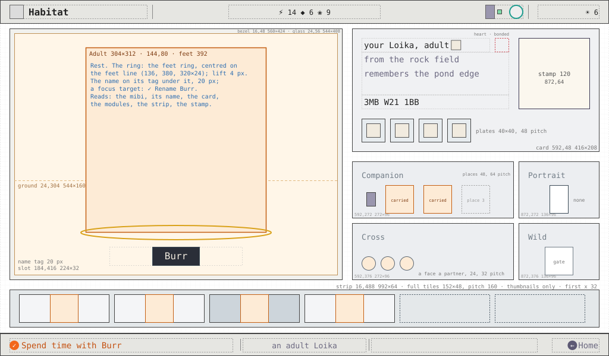

*Habitat. Wireframe, layout only, measured.*

### 1. Purpose

Habitat shows one resident up close, so the player can spend time with it, take it along, bond with it, or let it go. The player comes away knowing who this mibi is (name, stage, species, what it remembers) and having chosen what it does next.

### 2. Elements

| Element | Why it is here |
| --- | --- |
| **The resident**, 304×312, in its corner of the vivarium | The subject |
| **Card**: name, three short lines (species and stage, ability, memory), the code, the stamp label, seven chapter plates | Who it is, without a text page |
| **Door** (Companion) | Who is out with you, and taking this one |
| **Bond** (heart) | The deliberate bond |
| **Cross** | Breeding, on an adult (M4) |
| **Wild** | Returning it to the wild, with arm-then-confirm |
| **Strip** of bays | The other residents and the free bays; the way to swap |

**Cut:**

- "its painting is on its way · placeholder" inside the window: it moves to the lamp plus the bottom line.
- "+2 ❀" and "✓ again" on the Wild module: they belong on the bottom line.
- "after a first outing" on the heart: it belongs in the bottom line's subject.
- The paper-and-wood card colours: the card is cool chrome.
- The four chapter thumbnails become seven, one per chapter.

### 3. Placement

**Reading order:**

1. **The resident**, warm, centred in the window on x 320.
2. **Its name** at the card's top left.
3. **The card's lines and plates.**
4. **The four action modules.**
5. **The strip.**
6. **The stamp label** in the card's top right corner.

**At the edges:** the strip along the foot, the card at the right edge.

### 4. Art direction

- **Room:** the vivarium, cozy and warm, the pet happy at home.
- **Warm key light** from the top left in the window. The card and modules are cool and calm.
- **The heart is red and heart-shaped,** and there are no meters or needs anywhere.

### 5. Composition

The window fills the left (16 to 624) above the strip, with the resident centred in it. At the right, the card sits on top, then the four modules: Door tall at the left, Bond and Cross side by side, Wild across under them. The strip of bays runs the full width at the foot.

| Region | Rectangle | Notes |
| --- | --- | --- |
| Window bezel | 16, 48, 608, 424 | |
| Living window | 24, 56, 592, 408 | No words |
| **Resident (focal)** | 168, 136, 304, 312 | A juvenile is drawn at its own proportions inside the same box |
| Meet ribbon | 168, 72, 304, 40 | "Meet Moss", 20 px, for the first meeting only |
| Waiting lamp | 40, 432, 16, 16 | Until the painting lands |
| Card | 640, 48, 368, 216 | Cool chrome pane |
| Name | 656, 64, 200, 32 | 28 px. A heart shows beside it when bonded |
| Lines | 656, 104, 200, 68 | Three lines of 16 px on a 24 px pitch: "Loika · adult", the ability, the memory |
| Code | 656, 180, 200, 20 | 16 px |
| **Stamp label** | 872, 64, 120, 120 | In the card's corner, 400 px from the resident |
| Chapter plates | 656 + 48i, 208, 40, 40 | Seven on a 48 px pitch. Eight (a signature chapter) shrink to 32×32 on a 40 px pitch, 312 px in all |
| Door | 640, 280, 128, 184 | Word "Companion"; the mibi with you at 48×48, or the Companion mark |
| Bond | 776, 280, 112, 88 | Heart 32×28; word "Bond" |
| Cross | 896, 280, 112, 88 | Word "Cross". Drawn in hairline and not focusable until M4, or on a juvenile |
| Wild | 776, 376, 232, 88 | Gate 64×48; word "Wild" |
| Strip | 16, 480, 992, 72 | |
| Bay tile | 24 + 136i, 484, 128, 64 | Thumbnail 48×48 at (x + 8, 492); name 16 px at (x + 64, 504). A free bay is a dashed outline with no word. With 8 bays the tiles are 112 on a 120 pitch; with 10 bays, 88 on a 96 pitch, thumbnail only, and the focused tile's name shows on the bottom line |

### 6. Interactions

| Input | What happens, and how it shows |
| --- | --- |
| Pad | Spatial: resident, Door, Bond, Cross, Wild, strip tiles. On a tile, that resident comes into the window (300 ms) |
| ✓ on the resident or a tile | `✓ Spend time with Fig`: its species moment plays for about 2 s. Rewards nothing |
| ✓ on Door | `✓ Take Fig with you · now` (docked) or `· at the next dock`. On the mibi already with you there is no ✓ cap |
| ✓ ✓ on Bond | The first ✓ arms ("Again: bond with Fig"); the second bonds. Before a first outing there is no ✓ cap, and the subject says "bond is offered after a first outing" |
| ✓ on Cross (M4) | Opens Cross |
| ✓ ✓ on Wild | `✓ Return Fig to the wild · +2 ❀`, then the second ✓. Refused, with no ✓ cap and the reason as the subject, for a bonded mibi, a juvenile or the one with you |
| ✓ on a portrait offer (M6) | `✓ Portray Fig · 1 sitting` |
| ← | Home, however Habitat was opened (*corrected by the UI designer, 2026-10-09, the owner's decision on the navigation model*: was "or the Library, if Habitat was opened from a Book"; stack navigation) |

### Placeholders on Habitat

| Thing | Pixel size |
| --- | --- |
| Resident | 304×312 |
| Thumbnails | 48×48 |
| Door mibi | 48×48 |
| Chapter plates | 40×40 (rendered close-ups) |
| Heart | 32×28 |
| Gate | 64×48 |
| Window | 592×408 |

### Changes from the current build

- The resident grows from 290 to the 304×312 box.
- The card goes from 374×246 in paper and wood to 368×216 in chrome.
- The stamp grows from 88 to 120.
- The chapter plates go from four to every chapter.
- The modules get one word each, and their prices and words go to the bottom line.
- The strip goes from 104 to 72 px.
- The painting status leaves the window.

---

## Library spread

Concept plate: `art/concept-station/library-spread/placed/SP-P-r4-a1-pip-named-1024x600.png`. Wireframe: [07-library-spread.svg](station-layouts/07-library-spread.svg).

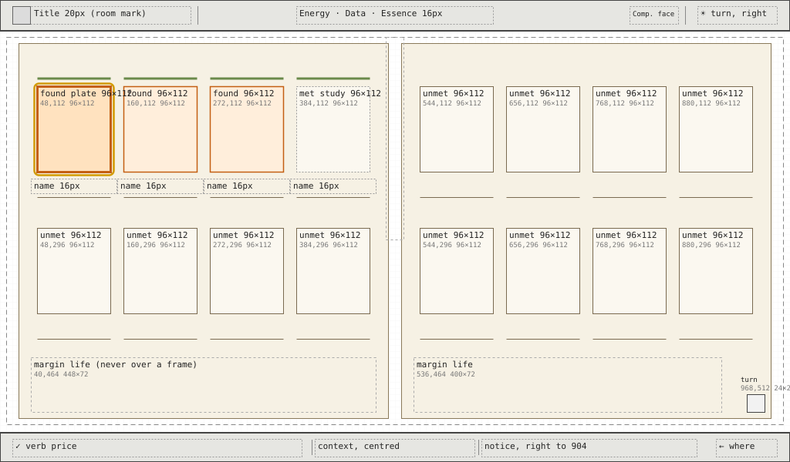

*Library spread. Wireframe, layout only, measured.*

### 1. Purpose

The spread shows the whole collection at a glance, as plates in a naturalist's volume. The player comes away knowing which species they have found, which they have only met, and that empty frames remain, and can open any found or met species' Book.

### 2. Elements

| Element | Why it is here |
| --- | --- |
| **Sixteen ruled frames**, eight a page, two rows of four | One place per species, all seen at once |
| **Found plate** (a tipped-in painted plate), **met study** (pencil), **unmet** (empty, no cue) | The three states of knowledge, told apart by craft rather than words |
| **Names** on caption rules, 16 px | Found in ink, met in pencil grey, unmet nothing |
| **Clan rule**, 4 px inked band over each met frame | The clan, by colour on the ink and never on unmet frames |
| **Margin life** (a leaf and seeds, a dried flower, a survey sketch, the cloth marker) | The tome's character, never over a frame |
| **Page-turn corner** | That more species wait on the next spread, without "1 of 2" |

**Cut:**

- "spread 1 of 2 · ◀ ▶ past the edge turns it".
- The diagonal hatching used for "met" in the build: a pencil study replaces it.
- The 2 px rules become 1 px.

### 3. Placement

**Reading order:**

1. **The found plates**, the only colour on the page, in the order species were found.
2. **Their names.**
3. **The met studies.**
4. **The empty frames**, as a quiet grid that promises more.
5. **The margins.**

**At the edges:** the page-turn corner at the bottom right, the cloth marker over the gutter.

### 4. Art direction

- **Room:** the Library, an old botanical-expedition volume in ink and watercolour, with aged foxed paper, worn boards and restrained ornament.
- **The plates are painted** at Pip's level of craft (Loika is the placed Pip). They are never flat cards or stickers.
- **Device type on the chrome:** Inter, never a serif. Nothing childish: no lanterns, scrollwork or ribbons.
- **No living window:** the plates' own warmth is the only warmth.

### 5. Composition

The open book fills the stage. Each page holds a 4 × 2 grid of frames with a 16 px gutter between frames, a 24 px margin to the page's edge, and the margin life in the band under the second row.

| Region | Rectangle | Notes |
| --- | --- | --- |
| Book (boards) | 8, 48, 1008, 504 | |
| Left page | 24, 56, 480, 488 | |
| Right page | 520, 56, 480, 488 | Gutter 504 to 520 |
| Frame columns | x 48, 160, 272, 384 (left page); 544, 656, 768, 880 (right page) | Each 96 wide on a 112 px pitch |
| Frame row 1 | y 112, 96×112 | Clan rule 96×4 at y 100; name 16 px in (x − 8, 232, 112, 20); caption rule 96×1 at y 256 |
| Frame row 2 | y 296, 96×112 | Clan rule at y 284; name at y 416; caption rule at y 440 |
| **Found plate (focal)** | inside the frame, 8 px mat: 80×96 | Rendered or downsampled to 80×96; never enlarged |
| Met study | 80×96 | Grey pencil line |
| Focus | frame outset 4 with the 6 px radius: 104×120 | Thin rounded rectangle in the `focus` role; the frame lifts 2 px |
| Margin life | 40, 464, 448, 72 and 536, 464, 400, 72 | Never over a frame or a caption |
| Cloth marker | 500, 48, 24, 264 | Over the gutter |
| Page-turn corner | 968, 512, 24, 24 | Shown only when another spread exists |

### 6. Interactions

| Input | What happens, and how it shows |
| --- | --- |
| ◀ ▶ | Along a row, across the gutter to the other page; past the right edge with another spread, the page turns (300 ms) |
| ▲ ▼ | Between the two rows |
| ✓ on a found or met frame | `✓ Open`: the plate lifts off the page and becomes the Book's mounted plate (300 ms) |
| ✓ on an unmet frame | No ✓ cap; the subject says "an empty frame"; a message plate on press |
| ← | Home |

### Placeholders on the spread

| Thing | Pixel size | Notes |
| --- | --- | --- |
| Found plate | 80×96 | The species' placeholder; the accepted Pip for Loika, downsampled |
| Met study | 80×96 | The index pass in grey line |
| Paper | 1008×504 | Flat paper |

### Changes from the current build

- Frames move from x 60 + 120i and 560 + 120i, y 70 and 230, to the grid above.
- The rules go from 2 px to 1 px. Clan rules are added, and margin life is added as placeholders.
- The page-turn words become the corner, and the hatching becomes the study.

---

## Book

Concept plate: `art/concept-station/library-book/placed/BK-D-r2-a1-stamped-named-1024x600.png`. Wireframe: [08-library-book.svg](station-layouts/08-library-book.svg).

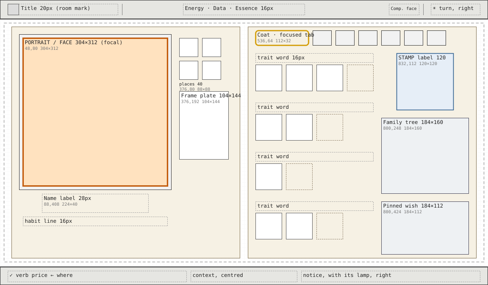

*Book. Wireframe, layout only, measured.*

### 1. Purpose

The Book is each species' field guide: its face, the looks found so far, its lineage and its wishes. The player comes away knowing what the species is like, which looks they have seen and which are still to find ("more?"), and who is related to whom.

### 2. Elements

| Element | Why it is here |
| --- | --- |
| **The face** (or, once a mibi has sat, the portrait): a resident at 304×312 doing its habit, mounted as a framed plate | The subject; the species alive |
| **Name label** (28 px) and **habit line** (16 px) | What it is and what it does, in two lines |
| **Place stamps** (40×40) and **the frame plate** (104×144) | Where it lives and its body plan, as pictures |
| **Chapter tabs** (all chapters) and **look plates** per trait, with a dotted "more?" slot | The looks found, as small specimen plates; never a text page |
| **Stamp label** (120) | The face mibi's stamp |
| **Family tree** panel (184×160) | Lineage, read without text |
| **Pinned wish** (184×112) | The wish, as a plate of its looks |

**Cut:**

- The stub's text lines ("Coat: plain, … · more?") become plates.
- "clan … · 4 chapters" goes: the clan shows on the spread's rule, and the chapters show as tabs.
- The plate's lanterns at the page corners go (storybook).

### 3. Placement

**Reading order:**

1. **The face** on the left page, the one warm, living thing.
2. **Its name label.**
3. **The focused chapter's look plates** on the right page.
4. **The tabs.**
5. **The stamp, the tree and the wish** at the right edge.
6. **The places and the frame plate** between the face and the gutter.

### 4. Art direction

- **Room:** the Library tome.
- **The face is warm.** The archive is cool and evenly lit on aged cream.
- **The look plates are pressed specimens** in the book's plate style.
- **Consistent case** in every label (the owner flagged a mix), Inter on the chrome, nothing childish.

### 5. Composition

The book is open across the stage. On the left page: the face's mat, with the name label and habit line under it, and the places and frame plate in a narrow column beside it. On the right page: compact tabs along the top, the trait column under them, and the stamp, tree and wish stacked at the right edge.

| Region | Rectangle | Notes |
| --- | --- | --- |
| Book, left page, right page | as the spread | |
| Mat | 40, 72, 320, 328 | |
| **Face or portrait (focal)** | 48, 80, 304, 312 | Mounted as a framed plate. A "released" mark at the plate's foot for a portrayed mibi that went back to the wild |
| Name label | 88, 408, 224, 40 | 28 px, centred on x 200 (a name is the 28 px role; the Book section's "3×" predates the Inter sizes) |
| Habit line | 48, 456, 304, 20 | 16 px, centred |
| Place stamps | 376 + 48c, 80 + 48r, 40×40 | Up to four, in two rows |
| Frame plate | 376, 192, 104, 144 | |
| Tabs | 536, 64: 40×32 each on a 48 px pitch, the focused tab 112×32 with its word | Seven take 6 × 40 + 112 + 6 × 8 = 400 px; eight take 448; more than eight comes back to the UI designer |
| Trait rows (one to four traits) | 536, 112 + 104r, 248 wide | Trait word 16 px, then look plates 56×56 on a 64 px pitch at y + 24, the last slot a dotted "more?" |
| Trait rows (five or six traits) | 536, 112 + 72r | Look plates 40×40 on a 48 px pitch |
| **Stamp label** | 832, 112, 120, 120 | |
| Family tree | 800, 248, 184, 160 | Empty ruled panel until M4 |
| Pinned wish | 800, 424, 184, 112 | Empty ruled panel until the wish exists |

### 6. Interactions

The build stub has ← only; the rest arrives with M5.

| Input | What happens, and how it shows |
| --- | --- |
| ◀ ▶ on the tabs | Turn the chapter in 200 ms; the focused tab widens to show its word |
| Pad | Spatial: face, tabs, look plates, wish |
| ✓ on the face | `✓ Visit Fig` opens Habitat on a living mibi. On a released one there is no ✓ cap |
| ✓ on a look plate | `✓ Add to the wish` (with the wish) |
| ✓ on the wish | `✓ Find a pair` (M4) |
| ✓ on "more?", the stamp or the tree | Read-only: no ✓ cap |
| ← | The spread: the way back reads "← Library" (*corrected by the UI designer, 2026-10-09, the owner's decision on the navigation model*: was "Spread") |

### Placeholders on the Book

| Thing | Pixel size |
| --- | --- |
| Face | 304×312, in the standard look until a portrait |
| Look plates | 56×56 or 40×40 (rendered close-ups) |
| Place stamps | 40×40 |
| Frame plate | 104×144 |
| Tree and wish | Empty ruled panels |

### Changes from the current build

- The face goes from 300×330 at (30, 60) to the mat and plate above.
- The text field guide becomes tabs and plates.
- The stamp moves from 112 at (886, 406) to the 120 label at (832, 112).
- The tree and wish panels are added as empty frames.

---

## Cross: the splice

Wireframes, 1×: [09a-cross-overview.png](station-layouts/09a-cross-overview.png) and [09b-cross-chapter.png](station-layouts/09b-cross-chapter.png), with 2× crops [09a-cross-overview-2x.png](station-layouts/09a-cross-overview-2x.png) and [09b-cross-chapter-2x.png](station-layouts/09b-cross-chapter-2x.png). Numbers: [`prototypes/ui/specs/station/cross.json`](../../prototypes/ui/specs/station/cross.json), the one home of the Cross numbers; this section says what they mean.

**Decided** (the experts, with the owner's leave, 2026-10-09; the owner called the splice and loci view "brilliant"):
- The splice is the body of the Cross screen and replaces the seed table. ✓ stays "Cross them".
- The Cross shows "only what you have read, and an indication of everything missing" (owner, 2026-10-09). The forecast marks a trait `missing` with the parent and chapter to read (`forecastOf`, built on main at bf225c82). The splice draws no copy, look, seed or range of a chapter either parent has not read, and nothing of a sealed chapter but its find.

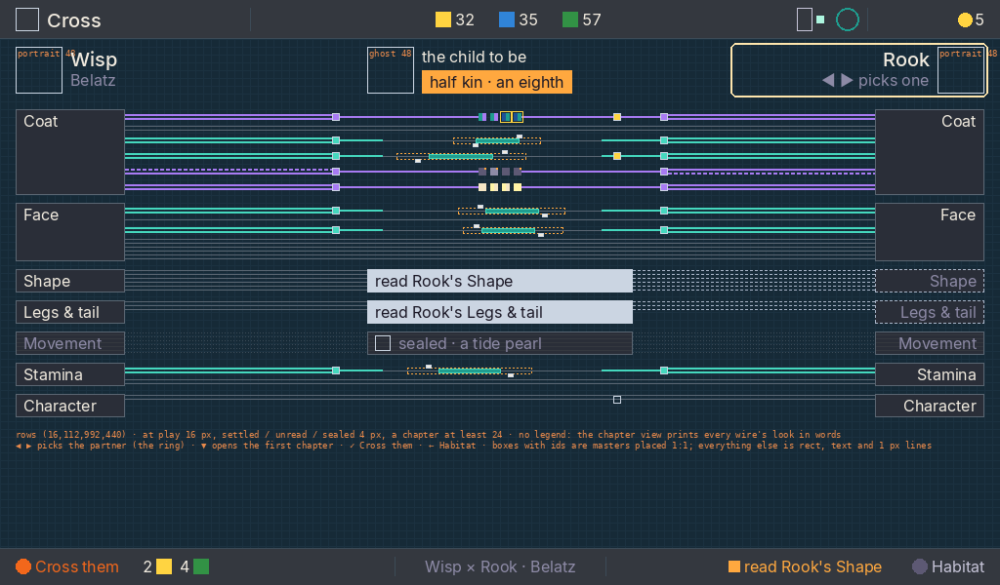

*A · Overview: every locus at play at once, grouped by chapter. Two S09 Belatz half-siblings, Wisp and Rook (kinship an eighth); Rook's Shape and Legs & Tail are unread, and Movement is sealed. 1× wireframe on the bench's ground. Boxes with ids are masters; the rest is rect, text and 1 px lines. Status: for the art director's signature.*

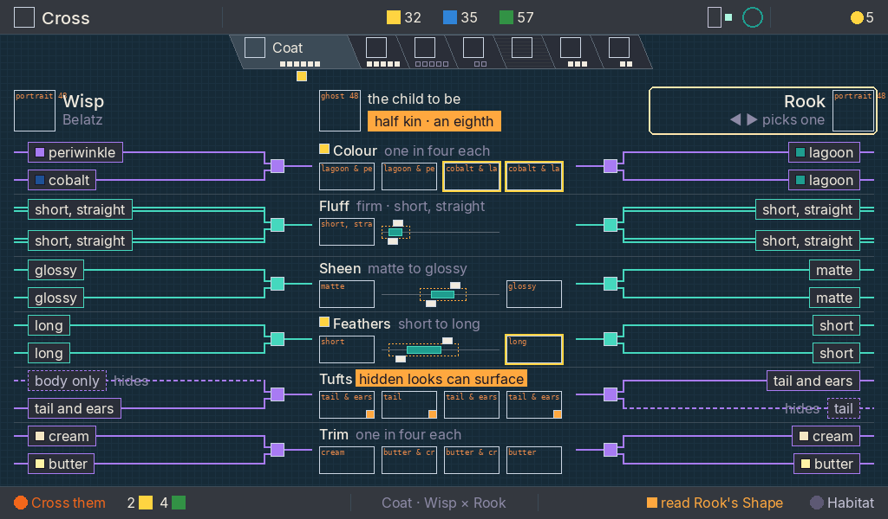

*B · Chapter view: Coat's loci routed from both parents to the child, under the shared rail. 1× wireframe. Status: for the art director's signature.*

### 1. Purpose

The player reads a cross the way the circuit from the owner's reference reads a running machine. Each parent's copies leave it as wires, and a gate at every locus splices them. The child's outcomes sit between the parents.

At a glance, the player sees:
- which loci are at play and which are settled;
- which copy each parent can pass, including the copies it hides, once read;
- where kinship narrows a range or lets a hidden look surface;
- which pinned traits a child can reach;
- what is still unread, and whose chapter to read.

The reference lends principles only: modules in columns, values carried and printed on wires, a colour per signal kind, one direction of flow, and a bus that gathers bits. Its art and look are never copied.

### 2. Elements

| Element | Meaning |
| --- | --- |
| **Heads** | Wisp (the pick, left) and the partner (right, the focus ring; ◀ ▶ picks one) as 48×48 portraits with name and line; between them the ghost of the child to be and the kinship pill (`amber`, the kinship word, always shown) |
| **Modules** | One per chapter on each side, the chapter's word in it; an unread chapter's module is dashed `frostS`, a sealed one slatted |
| **Wires** | A locus's two copies, one wire each, from the parent to its gate. Switch `lilac`, blend `aqua`, settled `bevel`, unread `frostS` dashed, sealed `hairline` dotted. A copy the parent hides (known, because it was read) is dashed |
| **Gates** | The splice: the switch gate passes one copy of two; the blend gate mixes the two into the parent's shown value. Masters, never drawn |
| **The child** | A switch ends in four seeds (quarters, never odds); a blend ends in a track across the locus's range with both parents' ticks and the stretch where the child can land |
| **Kinship marks** | `amber`: the range before kinship narrowed it, dashed round the narrowed one; a corner on each seed where a hidden look can surface |
| **Wish marks** | A glint on a pinned trait, lit when a child can show the pinned look, hollow when not; a `yellow` edge on the seed or end that shows it |
| **Missing** | A `frostD` band in the child's column, "read Rook's Shape"; the unread side's wires as frost hairlines with no words |
| **Sealed** | Slats and the find; "sealed · a tide pearl" |

### 3. Placement

- **Overview.** Heads at y 48 to 96. Rows from (16, 112), 440 tall. Wisp's modules are 112 wide at x 16 and Rook's at x 896. The gates are at x 340 and x 676. The child's column runs from x 376 to 648, with the blend track from x 392 to 616, the four 8×8 seeds centred on x 512 and the wish glint at x 628.
- **Chapter view.** The shared chapter rail hangs from y 40, centred: compact tabs with the open chapter's tab full, as on Pods, Create and the Incubator. Heads sit at y 104 to 152 and rows run from y 160 to 552.
  - **Wires and plates.** Each copy's look is printed on its wire in a plate: Wisp's start at x 32 and Rook's end at x 992. The wires turn at x 304 and x 718 into the 16×16 gates at x 312 and x 696.
  - **The child's column.** It runs from x 368 to 656: the trait's name line at the top, then four 64×32 seed pictures on a 72 pitch, or the two 64×32 end pictures with the 136 px track between them.
- **Trait rows.** A row is 64 tall, plus 8 for each further locus of the trait; the trait's loci run as one bus per copy.

### 4. Art direction

The instrument's cool, even light, on the bench's ground. The wires are crisp 2 px rects, so the chrome stays flat. Only the gates, ticks, wish glints, the kin corner and the finds are painted masters. Seed and end pictures are the trait pictures, rendered at 64×32, never scaled. Never childish: no faces on gates, no sparkles on wires, no cartoon arrows.

### 5. Composition and density

- **Overview rows** (*decided by the UI designer, 2026-10-09: a minimum, not a legend*). A locus at play gets a row of 16 px, which may drop to 10 so the species fits, and never lower. Settled loci, loci of an unread chapter and sealed loci fold to 4 px hairlines. A chapter is at least 24 tall. The gap between chapters is 8, then 4 if needed.
  - All sixteen frames were checked with every locus at play. The worst case is S03 Tuikis (40 loci, 8 chapters): 436 of 440 at 10 px with 4 px gaps.
  - Belatz with this pair fits at 16 px.
- **No legend on the screen.** Labels are one word, and never a text page. The chapter view is where the kinds are learned: there every wire carries its look in words. The overview keeps only what differs: colour where the locus is at play, grey where settled, frost where unread, slats where sealed.
- **Tall chapters.** All sixteen frames were checked: the tallest chapter is S02 Untuva's Coat, at 376 of 392; S09 Belatz's Coat is 392.
- **No promise.** The child's actual draw is never shown. There are no odds, percentages or counts, and no letters or ratios for a copy.

### 6. Interactions

| Input | What happens |
| --- | --- |
| ▼ | The next state: from the overview, the first chapter; then each chapter in ring order. On the last chapter, nothing |
| ▲ | The previous state; from the first chapter, the overview |
| ◀ ▶ | The previous or next partner (`crossPartners`). The wires re-route at once and the state is kept. The ring stays on the partner's head |
| ✓ | `✓ Cross them · 2 ⚡ 4 ❀`, exactly as the line says; a jump to the Incubator, as today. A refused pair has no ✓ cap, and the reason is the notice |
| ← | Habitat |
| A room key | Drops the unpaid choices; coming back opens fresh on the overview |

**The bottom line.** It reads `✓ Cross them · price` | "Wisp × Rook · Belatz" on the overview, or "Coat · Wisp × Rook" on a chapter | the notice | `← Habitat`.
- The notice is the first missing read in ring order, "read Rook's Shape" (or "read both parents' Shape"). Leading with the missing read draws the player back to research.
- With nothing missing, the notice is the kinship word if the kinship is above 0, and otherwise nothing.
- The kinship word itself moves from the notice to the pill under the child, where it is always shown (*corrected by the UI designer, 2026-10-09*: it was the notice).

### Masters on Cross

All masters are new unless marked existing, are placed 1:1 and are never recoloured. The build draws only rects (wires, dashes, plates, bands, 8×8 seeds, chips, frost and slats), text and 1 px lines.

| Master | Size | Where |
| --- | --- | --- |
| `cross-gate-switch-16x16`, `cross-gate-switch-16x16-settled` | 16×16 | Chapter view's switch gate, lit and in `bevel` |
| `cross-gate-blend-16x16`, `cross-gate-blend-16x16-settled` | 16×16 | Chapter view's blend gate |
| `cross-gate-switch-8x8`, `cross-gate-blend-8x8` | 8×8 | Overview's gates |
| `cross-tick-a-12x8`, `cross-tick-b-12x8` | 12×8 | The parents' values above and below the chapter view's track |
| `cross-tick-a-6x4`, `cross-tick-b-6x4` | 6×4 | The same on the overview |
| `cross-wish-lit-12x12`, `cross-wish-hollow-12x12` | 12×12 | A pinned trait, reachable or not; the lit one also hangs under a rail tab |
| `cross-wish-lit-8x8`, `cross-wish-hollow-8x8` | 8×8 | The same on the overview |
| `cross-kin-surface-10x10` | 10×10 | The `amber` corner on a seed where a hidden look can surface |
| `find-{kind}-16x16` (crystal, pearl, shard) | 16×16 | A sealed chapter on the overview |
| `find-{kind}-112x112` (existing) | 112×112 | A sealed chapter's view |
| The rail's tabs, emblems and pips (existing) | as the rail | Chapter view |

Rendered at their size, not masters: the parents' portraits and the ghost (48×48), and the seed and end pictures (64×32).

### Changes from the current build

- The seed table, paged by five (`ROWS`, `ROW_H`, `ROW_Y`, the 464 px panel at 280), goes.
- So do the 200 px parents, their 96 px stamps and codes, and the 150 px ghost. The heads and the splice replace them.
- "narrowed", the aqua dotted range and the seed bud become the `amber` dashed range and the `cross-kin-surface-10x10` corner.
- ▲ ▼ walk the overview and the chapters instead of paging traits.
- The kinship word leaves the notice for the pill.
- Missing traits keep `forecastOf`'s mask unchanged: the splice only draws it.

---

## What the builder decides alone, and what comes back

**The builder may decide alone:**

- Nudges of up to 8 px inside a region, to seat art or text, keeping the region's rectangle, the grid and the reading order.
- Easing curves and durations within the motion vocabulary (200 to 400 ms for the instrument, about 2 s for reveals).
- The palette colour for a role the guide already names (the focus ring's `focus`, amber need, mist subject, red clash).
- Focus order inside the spatial rules, and which target the pad picks on a tie.
- Placeholder drawing inside its listed rectangle and pixel size, entered in the placeholder register.
- Message plate wording that only reports a refusal already decided, in the house style.
- Developer-only layouts that follow the stated rules (8 or 10 bays, a larger rack).

**Must come back to the UI designer:**

- Any region that moves or resizes by more than 8 px, or any new element, label, line or readout on a screen.
- The stamp growing past 120, gaining a glow, frame, beam or pane, or moving within 96 px of the focal box.
- Any word inside a living window; any digit on a no-digit surface other than prices; any label of more than one word; anything that turns a page into text.
- A species past a stated limit:
  - more than 12 chapters on the bench rail, or more than 8 in the Book;
  - more than six traits in a chapter;
  - more than 52 leaves;
  - more looks in a trait than its row holds.
- A master whose silhouette needs a different focal box, or any focal box shrinking below its listed size (300×310 where the guide asks).
- Any change to the reading order, or a second warm or bright object competing with the specimen.
- Screens not covered here: Dock and arrival beyond its Home state, the Probe bench, Idle, Cross, Sitting.
