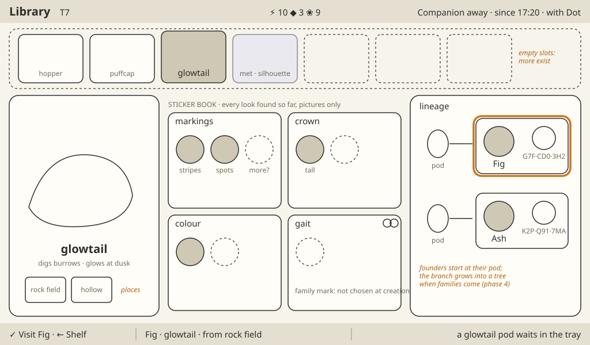

# Station screens

1024×600 landscape, judged at 1×. The shared rules are in the [style guide](README.md). The Station is a research instrument with one living window. It is never a cottage and never a scaled-up Companion.

## The frame

- **Top bar, 40 px.** The screen's name at 3× and the world turn at the left; Energy, Data and Essence centred, ticking when they change; the Companion's state at the right with its lamp ("Companion away · since 16:05 · with Dot").
- **Stage, 522 px.** The instrument and its one living window.
- **Bottom line, 38 px.** `✓ action · price · ← where` | the subject | what needs you. Read-only focus draws no ✓ cap.
- **Focus.** A warm cream ring that walks between drawn things; the focused thing lifts slightly. Never a list cursor.

## Instrument and living window

| | Instrument | Living window |
| --- | --- | --- |
| Feels | cool, precise, calm | warm, soft, alive |
| Light | even cool light, crisp edges, fine bevels | one warm key light from the top left, soft shadows |
| Colour | deep blue-teal ground, graphite and slate chrome, cream readouts, small status lamps | greens, warm earth, water, the creatures' own colours |
| Materials | enamel, brushed metal, glass, frosted panes | plants, soil, stone, water, fur and leaf |
| Moves | only when something happens | all the time |
| Words | a few per module | none |

Wireframes give layout only. Their material notes (wood, felt, a bench lamp) are superseded by the instrument above and the four vibes below. They were drawn before the [research loop](../proposals/research-loop.md): read their windows as chapter arcs and pages, and their whorl as the genome ring.

## Four rooms, four vibes

One device, four functions, and each communicates its own mood. Type, counters, the bottom line and the light direction are shared; the materials and the feeling are not.

| Room | Screens | Vibe |
| --- | --- | --- |
| **Overview** | Home's frame, Dock and arrival | Industrial, plasticky: it mimics the hardware in the hand |
| **Research bench** | Pods, Create, Incubator, Cross and Wish, Probe bench | A modern digital lab: glass, light or deep panes, precise readouts, the instrument lamp |
| **Vivarium** | Home's living window, Habitat, idle | A place you want to put your pets and see them cozy and happy |
| **Library** | Library | A botanical tome: paper, plates, pressed specimens, a hand that catalogues |

<table><tr><td valign="top"><br><em>station-research-hands: the quality bar. Approved concept, generated. Keep the light and shading; carry far more.</em></td>
<td valign="top"><br><em>station-known-forms: rich creatures at Station size. Approved concept, generated.</em></td></tr></table>

---

## Home

**Vibe.** Overview: the frame is the hardware, industrial and plasticky; the window is the vivarium, cozy and alive.

**Purpose.** The always-on view: the collection alive, the equipment's state. **Reads first:** the residents, then whatever needs you (the bottom line's right part).

- **Living window.** The vivarium, the left two thirds (about 640×500): a lit glass habitat with plants, stones, water and a burrow. Residents in the rich treatment keep their species' routines. The with-you bed shows the mibi with you, or a small Companion mark while away.
- **Instrument.** The right third, four stacked modules, each with a status lamp and a few-word readout: the sample bay (crates behind a door), the pod rack (six wells, shells in place colours, a star where one glints), the incubation chamber (a dome and its ring of leaves), the Probe dock (the Probe and its Shield plates).
- **Composition.** The vivarium's glass sits in a thin bezel; the modules align to one column with 8 px gaps. Nothing overlaps the vivarium.
- **Lively / quiet.** Lively: residents, plants, water, the embryo's glow. Quiet: the modules; one lamp pulses slowly when its module needs you.
- **Light.** Warm daylight inside the vivarium from the top left; even cool light on the chrome.
- **Palette.** Deep blue-teal chrome; the vivarium's greens and warm earth; amber only on the lamp that needs you.
- **Type.** 3× screen name; 2× readouts, three words or fewer each.
- **Chrome.** `✓ Look at Bean · ← the room` | `Bean · puffcap · adult` | `a puffcap pod waits · needs 2 ❀`.
- **Motion.** Residents move smoothly at the panel's rate; module doors and lamps move only on events.

**Pass when**
- [ ] It reads as an instrument holding something alive, not a room.
- [ ] The vivarium is the only warm light on screen.
- [ ] Residents are the matched rich treatment, never upscaled tokens.
- [ ] Each module reads by its shape before its words.
- [ ] What needs you is found in one glance.
- [ ] No wood, felt, shelves or lamp-lit bench.

<table><tr><td valign="top"><br><em>Home wireframe. Layout only.</em></td>
<td valign="top"><br><em>companion-resident-home: the warmth of the vivarium, at Station resolution. Approved concept, generated.</em></td></tr></table>

---

## Dock and arrival

**Vibe.** Overview: hardware, the Companion seated in the dock, crates and a bay door.

**Purpose.** Cargo arrives when the Companion docks and the player opens the bay. **Reads first:** how many crates are in the bay, then the ribbon.

- **Instrument.** The sample bay leads: docked, its door shows one sealed crate per consignment. `✓ Open the bay · 2 crates`. Then, per crate: the seal breaks, pods travel along a rail into the rack's wells, the counters tick, the Probe dock shows the free mend, a ribbon reads "Expedition 4 home · 2 pods · explored 9 of 21", the world turn jumps.
- **Living window.** The vivarium stays; residents turn toward the bay as crates open.
- **Composition.** Home's layout; the bay module brightens and grows a little; the ribbon crosses the stage's top. A report card waits on the vivarium until the next press.
- **Lively / quiet.** Lively: the crate, the pods' travel, the residents' reaction. Quiet: the other modules.
- **Light.** A cool beam inside the bay as the seal breaks; the vivarium unchanged.
- **Palette.** Crates in slate and teal with orange seal tags; counters flash yellow.
- **Type.** 3× ribbon; 2× report lines.
- **Chrome.** Presses during the arrival are consumed; focus stays on the room; then `✓ Look at the new pods`.
- **Motion.** About 3 s per crate: seal 300 ms, each pod's travel 600 ms, ticks at +1 per 90 ms.

**Pass when**
- [ ] Docking alone shows crates and accepts nothing.
- [ ] Each crate's arrival reads as one event.
- [ ] The free mend shows on the Probe dock.
- [ ] Nothing of the field is drawn; the Station shows only what it owns.
- [ ] A still frame tells the same story.


*Dock and arrival wireframe. Layout only.*

---

## Pods

**Vibe.** Research bench: a modern digital lab.

**Purpose.** Identify a pod, read its chapters, compare, return. **Reads first:** the pod and its name.

- **Living window.** The specimen stage: the pod under the instrument's beam. It is the one warm thing: a soft inner glow, then, once identified, the seal on its cap broken and the species glyph lit.
- **Instrument.** The pod list at the left (six wells and a return hatch with a leaf mark), each well with its pod's place stamp, glyph or seal, and progress ring. The chapters as machined arcs above the pod, each with an emblem and one word; the focused chapter opens as a page of trait pictures on a deep pane. The genome ring on the stage plate under the pod.
- **Progress ring.** Around each pod in the list: the centre fills at Identify; then one arc per chapter, sized by its trait count, fills when that chapter is read; a star on an arc is a glint; a notch is a sealed chapter. No digits.
- **Chapter states.** Unread (hairlines on the arc, cool frost on the page with nothing behind it); glint (a four-point star); shows and hides (a close, warm drawing of each trait on this pod's mibi, a misty seed holding the hidden look); only (a small solid base); asleep (the look drawn sleeping); breed to change (two joined rings); sealed (shut, a notch, a picture of what opens it).
- **Genome ring.** The species glyph at the centre, a grey band for the frame, two coloured tracks of spokes for the two copies, one sector per chapter clockwise from the notch, outer dashes; unread parts are hairlines that fill as chapters are read.
- **Composition.** List 160 px; stage centred; arcs spanning the upper stage, the open page beside the pod; origin line under the pod.
- **Lively / quiet.** Lively: the pod's glow, glints, the page turn. Quiet: list, arcs, plate.
- **Light.** The beam from above-left on the pod; a read page lit warm from inside; arcs and list cool.
- **Palette.** Pods from one renderer: the species' colour pair and shell pattern, the place's dust or moss; frost pale blue-white; seeds pearl with a ghost inside; the ring's band grey, its tracks in the looks' hues.
- **Type.** Pod name at 4×; origin at 2× ("rock field · a glowtail felt safe"); one word per chapter; one short line per trait ("shows stripes · hides spots", "only teal", "breed to change").
- **Chrome.** `✓ Identify · 1 ⚡`, `✓ Read Coat · 3 ◆`, `✓ Shape a founder`, `✓ Compare`, `✓ Return to the wild · +1 ❀`.
- **Motion.** The seal breaks and the glyph lights in about 2 s; the page turns in 2 s and its sector fills; glints 2 Hz; compare slides the second pod in at 300 ms.

**Pass when**
- [ ] Unread chapters show nothing; draw only what is known.
- [ ] The seven chapter states are told apart without colour.
- [ ] The progress ring reads at a glance in the list, with no digits.
- [ ] The genome ring is pretty with only its band, fills as chapters are read, and holds up in one colour.
- [ ] No letters, ratios, loci or progress digits anywhere.
- [ ] The pod is the warmest, brightest thing on screen.
- [ ] Pods of one species match; no shell shows an individual's genes.

<table><tr><td valign="top"><br><em>Pods wireframe. Layout only; drawn with windows before the research loop.</em></td>
<td valign="top"><br><em>Chapter states, first drawn as windows and a whorl. Layout only.</em></td></tr></table>


*Genome rings drawn from the real catalogue: the ring's layout. Diagram, not final art.*


*station-research-pod: the pod in its cradle under a beam. Approved concept, generated. Its icons and type are not specs.*

---

## Create (the review)

**Vibe.** Research bench: a modern digital lab.

**Purpose.** Shape a founder and see its cost. **Reads first:** the founder.

- **Living window.** The founder large in a specimen chamber at the centre, at 300×310 or larger, rich treatment. Wherever a chapter is unread, that part stays misty: a cool frost over the body, never a guess.
- **Instrument.** The same chapter arcs as on Pods, same order. The opened pod at the left; the empty incubation chamber and the ring at the right. A shapeable trait carries ▲▼ notches and rolls among three pictures (as the pod is, only the hidden look, only the shown look); a changed one wears a "changed" tag; a doings trait wears two joined rings and "breed to change"; clashing traits are marked and Grow is withheld.
- **Composition.** Founder centred and lowest-set; arc above; pod and chamber balance it left and right.
- **Lively / quiet.** Lively: the founder (breathing, a blink) and its redraw when a trait rolls. Quiet: arcs, pod, chamber.
- **Light.** Warm key light on the founder from the top left; the rest cool.
- **Palette.** The founder's own colours; frost pale blue-white; the price icons in their hues.
- **Type.** 2× trait lines ("shows stripes · hides spots", "only spots"); the total in the bottom line.
- **Chrome.** `✓ Grow it · 2 ⚡ 4 ❀ 1 ◆ · ← Pods`.
- **Motion.** A roll swaps the trait's picture, the founder's part and the ring's spokes in 200 ms; on Grow the ring stamps the shell, the code appears, the pod glides into the chamber in 600 ms.

**Pass when**
- [ ] Founder, changes, surprises and cost are all visible at once.
- [ ] The founder's misty parts match the unread chapters exactly.
- [ ] A roll changes only what that trait covers, and never offers a look the pod lacks.
- [ ] The code appears only at Grow.
- [ ] Same trait boundaries as the Companion's HiBit drawing.

<table><tr><td valign="top"><br><em>Create wireframe. Layout only.</em></td>
<td valign="top"><br><em>Two individuals differing only in markings, at Station size. Accepted appearance reference (creature only).</em></td></tr></table>

---

## Incubator

**Vibe.** Research bench: a modern digital lab, with the chamber's glow as the one warm thing.

**Purpose.** Watch the embryo grow and open it. **Reads first:** the embryo, then how many leaves remain.

- **Living window.** Inside the dome: the embryo glowing as it grows (seed, bud, the species' shape asleep). Warm, slow, alive.
- **Instrument.** The incubation chamber: a glass dome on a machined base, a ring of leaves as the timer (one leaf a minute, each filling smoothly), the plate with the genome ring and code. The unread chapter arcs above clear one by one, and the ring's sectors fill with them.
- **Composition.** Dome centred, large (about 360 px across); leaves in an arc over it; chapter arcs above; plate below.
- **Lively / quiet.** Lively: the embryo's glow and the filling leaf. Quiet: everything else. Ready: the dome glows.
- **Light.** Warm light from inside the dome; cool chrome around.
- **Palette.** Leaf greens for the timer, pale glass, the embryo's species hue.
- **Type.** 2× status, no digits for time.
- **Chrome.** Read-only while growing (no ✓ cap); ready: `✓ Open`.
- **Motion.** A leaf fills over its minute; Open lifts the glass in 600 ms and the juvenile steps out: "Fig · glowtail · juvenile".

**Pass when**
- [ ] Time reads as leaves, never digits.
- [ ] The embryo is the only warm, living thing.
- [ ] Ready reads from across a table.
- [ ] The juvenile that steps out is the founder from Create, its ring whole.
- [ ] A still frame shows progress.

<table><tr><td valign="top"><br><em>Incubator wireframe. Layout only.</em></td>
<td valign="top"><br><em>The juvenile that steps out reads young by proportion. Approved concept, generated.</em></td></tr></table>

---

## Library

**Vibe.** Library: a botanical tome.

**Purpose.** Each species' field guide: its frame, the looks found so far, lineage and wishes. **Reads first:** the focused species' portrait and name.

- **Living window.** The species portrait: one resident of that species in rich treatment, doing its habit (dig, glow, puff).
- **Instrument.** The shelf across the top: known species as bright cards, met ones as silhouettes, dashed empty slots. Below, the field guide: the species' places as stamps; the frame once, as a pressed plate; one page per chapter, every look found as a small specimen plate per trait and one dotted "more?"; lineage as a branch, each pod to its mibi and each child to its two parents, with ring and code; the wishes as pinned dream mibis.
- **Composition.** Shelf 120 px tall; the portrait at the left of the page (about 300×310); guide pages centre; lineage and wishes right.
- **Lively / quiet.** Lively: the portrait. Quiet: shelf, guide, lineage.
- **Light.** Warm on the portrait; cool, even light on the archive.
- **Palette.** Species hues on cards; silhouettes in slate; dashed slots in mist.
- **Type.** 3× species name; one 2× habit line; no paragraphs.
- **Chrome.** `✓ Visit Fig` on a mibi, `✓ Add to the wish` on a look, `✓ Find a pair` on a wish; read-only elsewhere.
- **Motion.** The page slides with the shelf in 200 ms; the portrait lives.

**Pass when**
- [ ] Knowledge, never material: nothing implies a look, or a wish, can be taken from here.
- [ ] Silhouettes reveal only what is known.
- [ ] Two mibis are told apart by ring at 40 px.
- [ ] Never a text page or a school lesson.
- [ ] Empty slots say more exist without a number.

<table><tr><td valign="top"><br><em>Library wireframe. Layout only.</em></td>
<td valign="top"><br><em>Known forms: the portrait's treatment. Approved concept, generated.</em></td></tr></table>

---

## Habitat

**Vibe.** Vivarium: cozy, warm, the pet happy at home.

**Purpose.** One resident up close: spend time, take it with you, bond, cross. **Reads first:** the resident.

- **Living window.** The resident large (300×310 or larger) in its corner of the vivarium, rich treatment, doing its species moment on Spend time.
- **Instrument.** A card at the right: name, stage, species, ability, a memory line, the genome ring as a seal with the code, its chapters as small plates. Under it the with-you door (the Companion dock module, with the mibi with you or "away"), the bond heart and, on an adult, the cross mark. A strip of residents along the foot with the free places.
- **Composition.** Window the left 60%; card the right 40%; strip 72 px.
- **Lively / quiet.** Lively: the resident. Quiet: card, door, strip.
- **Light.** Warm key light from the top left in the window; cool on the card.
- **Palette.** The vivarium's greens and earth; card chrome; the heart red, with its shape.
- **Type.** 4× name; 2× card lines.
- **Chrome.** `✓ Spend time with Fig`, `✓ Take Fig with you`, `✓ Bond with Fig` (then ✓ again), `✓ Cross Fig`. `← Home`.
- **Motion.** The strip swaps the resident in 300 ms; the species moment plays about 2 s.

**Pass when**
- [ ] The resident is the same individual as on the Companion.
- [ ] Stage reads from proportion and bearing; elders calm and dignified.
- [ ] No meters or needs.
- [ ] The door shows where the mibi with you is.
- [ ] Spend time rewards nothing and shows nothing like a reward.

<table><tr><td valign="top"><br><em>Habitat wireframe. Layout only.</em></td>
<td valign="top"><br><em>Stage by proportion and bearing. Approved concept, generated.</em></td></tr></table>

---

## Cross and Wish

**Vibe.** Research bench: a modern digital lab, two living specimens and a forecast between them.

**Purpose.** Pick two adults of one species, see what their child could be, cross them; see how close a pairing gets to a wish. **Reads first:** the two parents, then the forecast.

- **Living window.** The two parents left and right in rich treatment (about 240×250 each), alive and aware of each other. Between them the child to be, misty: never a promise.
- **Instrument.** Each parent's genome ring on a plate beneath it. Under the child, one row per trait: four seed pictures, quarters drawn (one spotted, two hiding spots, one plain), never odds as numbers. A pinned wish as a small plate of its looks; traits that can reach it wear its mark. An ineligible pair greys out with the reason.
- **Composition.** Parents in the outer thirds; child and forecast centred; the wish plate top right.
- **Lively / quiet.** Lively: the parents. Quiet: forecast, plates.
- **Light.** Warm key light on the parents from the top left; the forecast on a cool pane.
- **Palette.** The parents' own colours; seeds pearl with a ghost inside; the wish mark in one accent.
- **Type.** 3× parents' names; 2× trait words; no digits but the price.
- **Chrome.** `✓ Cross them · 2 ⚡ 4 ❀ · ← Habitat`; an ineligible pair draws no ✓ cap and says why in the middle.
- **Motion.** A parent swaps in 300 ms; on Cross the two rings slide together, one track from each, into the child's ring, and its pod glides into the incubation chamber in 600 ms.

**Pass when**
- [ ] No odds as numbers, no percentages, no promise of a result.
- [ ] Each forecast reads as four seeds without colour.
- [ ] Only adults of one species can be paired; a refusal comes before any spend.
- [ ] The child's ring visibly takes one track from each parent.
- [ ] A wish reads as knowledge, never material.

No wireframe yet; the layout follows the brief in the [research loop](../proposals/research-loop.md#8-the-loop-step-by-step-the-brief-screens-are-judged-against).

---

## Probe bench

**Vibe.** Research bench: a modern digital lab, the Probe on a service cradle.

**Purpose.** Mend and upgrade the Probe. **Reads first:** the Shield plates.

- **Instrument.** The Probe large in its dock, Shield plates beside it, the standing switch "Mend fully on docking", the tier 2 slot (lit only when affordable). The one screen whose subject is a machine.
- **Living window.** A small porthole at the left: the mibi with you beside the dock when docked, its empty bed while away. Small and quiet here.
- **Composition.** Probe centred left of centre (about 360 px); plates to its right; switch and slot in a column at the right.
- **Lively / quiet.** Lively: the mibi in the porthole. Quiet: everything else until a press.
- **Light.** Cool, even light on the dock; a cool beam on the Probe; warm only in the porthole.
- **Palette.** Slate and graphite; plates white when whole, outlined when missing; the slot's lamp amber when affordable.
- **Type.** 3× name; 2× labels.
- **Chrome.** `✓ Mend a plate · 1 ⚡`; the switch toggles free; `✓ Arm tier 2 · 12 ⚡ 4 ◆`, then ✓ installs.
- **Motion.** A plate seats in 300 ms; the upgrade a short mechanical sequence under 1 s.

**Pass when**
- [ ] Shield state reads from the plates alone.
- [ ] The armed state is visible before the second press.
- [ ] The Probe is the same device the Companion draws.
- [ ] The porthole stays the only warm thing.
- [ ] Away, the dock shows the Probe is out, not missing.

No wireframe; the layout reference is the sketch in the [Station screens proposal](../proposals/station-screens.md):

```
 | Probe bench  T7                ⚡ 12  ◆ 5  ❀ 13                Companion docked |
 |        [  Probe in cradle  ]   plates ▮▮▯       ( ) Mend fully on docking: on   |
 |                                                  [ tier 2 slot · lit ]            |
 | ✓ Mend a plate · 1 ⚡ · ← Home | Probe · tier 1 | one plate to mend               |
```

---

## Idle

**Vibe.** Vivarium: the pets at ease, nothing asking for you.

**Purpose.** The Station at rest, always on. **Reads first:** the residents.

- **Living window.** The whole screen: the vivarium at 1024×600, its light following the time of day, residents keeping their routines.
- **Instrument.** Reduced to one status line on a thin cool strip at the foot ("Companion away · with Dot · an embryo is growing") and nothing else.
- **Composition.** The vivarium edge to edge; the strip 32 px.
- **Lively / quiet.** Lively: everything in the vivarium. Quiet: the strip.
- **Light.** Daylight to dusk to night in the vivarium; at night a soft cool moonlight and the residents' own glows.
- **Palette.** The vivarium's; the strip in chrome.
- **Type.** 2× status.
- **Chrome.** None. Any press wakes and does what it says; waking never rewards.
- **Motion.** Continuous and slow; nothing blinks for attention.

**Pass when**
- [ ] Beautiful at a distance, all day.
- [ ] Nothing decays and nothing nags.
- [ ] Residents are the rich treatment at full size.
- [ ] The status line is the only text.
- [ ] Night is calm, never gloomy.

No wireframe; the layout is Home's vivarium at full frame.


*companion-resident-home: the warmth idle carries, at Station resolution. Approved concept, generated.*
