# Station screens

1024×600 landscape, judged at 1×. The shared rules are in the [style guide](README.md). The Station is a research instrument with one living window. It is never a cottage and never a scaled-up Companion.

## The frame

- **Top bar, 40 px.** Where you are, what you hold, who is out, when: the room's mark and the screen's title at the left; Energy, Data and Essence centred, ticking when they change; the Companion's glyph and lamp with the face of the mibi out with it, then the world turn as a sun mark, at the right. Marks, not words, but for the title. The zones, rules and states are in [Station layouts, The frame](station-layouts.md#the-frame) (*corrected by the UI designer, 2026-10-08: was the screen's name and the turn at the left and the Companion's state in words at the right, "Companion away · since 16:05 · with Dot"*).
- **Stage, 522 px.** The instrument and its one living window.
- **Bottom line, 38 px.** The one action (the ✓ cap and the verb in orange, the price, the ← cap and where it leads) | the context (mist, the only part that shrinks) | the notice (amber, with its lamp). Read-only focus draws no ✓ cap. Every word is a slot the copywriter fills to its zone's rule (*corrected by the UI designer, 2026-10-08: was `✓ action · price · ← where` | the subject | what needs you*).
- **Focus.** A warm cream ring that walks between drawn things; the focused thing lifts slightly. Never a list cursor.

## Keys and navigation

**Decided** (owner, 2026-10-09, on the navigation map). One navigation model for the whole Station: Home is the hub, every screen has one parent, and each key means one thing everywhere. The map is [nav-map.png](station-layouts/nav-map.png); the parents, the back words, the room keys and Home's pad order are in `prototypes/ui/specs/station/frame.json` (`navigation`).

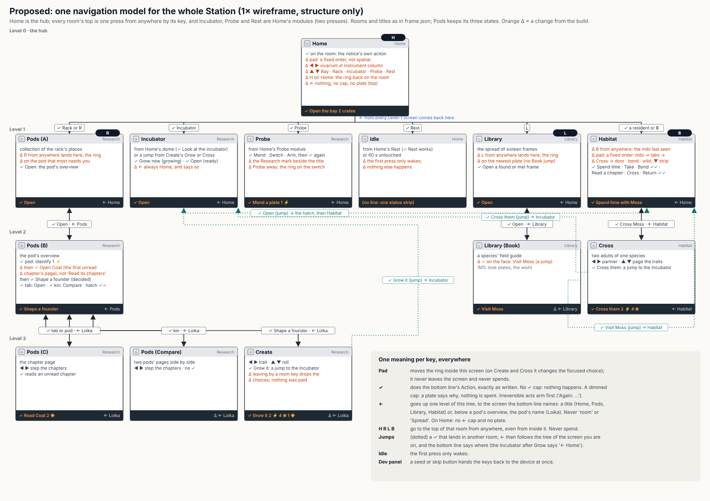

*The navigation map, 1× wireframe. Status: Decided.*

| Key | Means, on every screen |
| --- | --- |
| **Pad** (◀ ▲ ▶ ▼) | Moves the ring inside this screen; on Create and Cross it changes the focused choice. It never leaves the screen and never spends |
| **✓** | Does the bottom line's action, exactly as written. No ✓ cap: nothing happens. A dimmed cap: a message plate says why, and nothing is spent. An act that cannot be undone arms first, and the line reads "Again: …" |
| **←** | Goes up one level, to the screen's parent in the tree, and the bottom line names it: a title (Home, Pods, Library, Habitat) or, below a pod's overview, the pod's name ("Loika"). On Home there is no ← cap, and ← does nothing (no plate) |
| **Home, Research, Library, Habitat** | Open the top of their room from anywhere, even from inside that room: Home with the ring on the room, Pods on its collection with the ring on the pod that most needs the player, the Library on its spread, Habitat on the mibi last seen. They never spend |

- **The tree.** Home is the top. Under Home: Pods (the collection), the Incubator, the Probe bench, Idle, the Library and Habitat. Under the collection: a pod's overview. Under the overview: its chapter page, Compare and Create. Under the Library: the Book. Under Habitat: Cross. The Incubator and the Probe bench are Home's modules (reached from Home's instrument column, ← Home) and keep the Research room's mark.
- **Stack navigation.** A ✓ that lands in another part of the tree is a jump: Grow it (Create) and Cross them (Cross) to the Incubator, Open (the Incubator) to Habitat, Visit (the Book) to Habitat. After a jump, ← goes to the parent of the screen you are on, never back along the way you came: the Incubator after Grow reads "← Home", Habitat after a Book's Visit reads "← Home".
- **Home's pad.** A fixed order, not the nearest thing: ◀ ▶ cross between the vivarium's residents and the instrument column; ▲ ▼ walk the column, Bay, Rack, Incubator, Probe, Rest. The Home key on Home puts the ring back on the room, where ✓ does what needs you.
- **Idle.** The first press only wakes the screen; nothing else happens.
- **Leaving Create or Cross** by a room key drops the unpaid choices; coming back starts fresh (owner, 2026-10-09: "forget").

## Instrument and living window

| | Instrument | Living window |
| --- | --- | --- |
| Feels | cool, precise, calm | warm, soft, alive |
| Light | even cool light, crisp edges, fine bevels | one warm key light from the top left, soft shadows |
| Colour | deep blue-teal ground, graphite and slate chrome, cream readouts, small status lamps | greens, warm earth, water, the creatures' own colours |
| Materials | enamel, brushed metal, glass, frosted panes | plants, soil, stone, water, fur and leaf |
| Moves | only when something happens | all the time |
| Words | a few per module | none |

Wireframes give layout only. Their material notes (wood, felt, a bench lamp) are superseded by the instrument above and the four vibes below. They were drawn before the [research loop](../proposals/research-loop.md): read their windows as chapter arcs and pages, and their whorl as the genome ring.

## Palette and layers

**Working rule.** The Station draws in three layers. The **art layer** is the chrome (bars, panels, panes, hairlines, bevels, tabs, pips, lamps and the focus ring), the pixel art the build draws (material icons, the glint, the leaf timer, Shield plates), placeholders and the living window's frame; it uses only the Station palette's 62 colours (the Companion's 48 as the shared core, then the instrument's deep blue-teal, graphite, metal, enamel, frost, deep teal, sage and focus cream; roles and swatches in [ui-kit §2](../proposals/ui-kit.md#2-the-kit), numbers in `prototypes/ui/palettes/station.json`), is crisp and flat with one bevel of light, never dithered, and is checked at 0 off palette. The **painted layer** is every painted master and mibi painting: the living window's inside, the specimens, the tome and the instrument's painted objects; it is full colour with straight alpha, carries the painted light and the fine grain on creatures and world, and is off palette by decision. The **type layer** is Inter, anti-aliased; each string takes its colour from a palette role (`bone` readouts, `mist` context, `amber` what needs you, `orange` Confirm's verb, `red` a clash), and its smoothed edges are off palette by decision. The genome stamp is placed in its own colours from the stamp module, the same on screen, on paper and on the scan page. The art layer holds no wood, felt, evening-room greens or warm lamp pools; its only warm colours are signals: the focus ring's cream, the amber lamp and Confirm's orange.

## Four rooms, four vibes

One device, four functions, and each communicates its own mood. Type, counters, the bottom line and the light direction are shared; the materials and the feeling are not.

| Room | Screens | Vibe |
| --- | --- | --- |
| **Overview** | Home's frame, Dock and arrival | Industrial, plasticky: it mimics the hardware in the hand |
| **Research bench** | Pods, Create, Incubator, Cross and Wish, Probe bench | A modern digital lab: glass, light or deep panes, precise readouts, the instrument lamp |
| **Vivarium** | Home's living window, Habitat, idle | A place you want to put your pets and see them cozy and happy |
| **Library** | Library | A botanical tome: paper, plates, pressed specimens, a hand that catalogues |

<table><tr><td valign="top">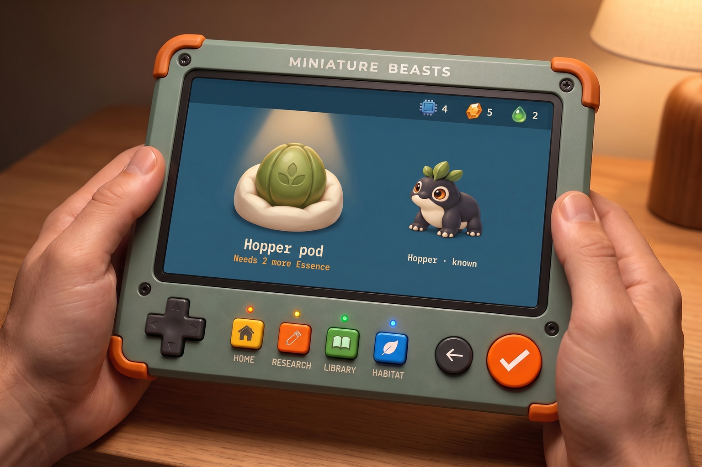<br><em>station-research-hands: the quality bar. Approved concept, generated. Keep the light and shading; carry far more.</em></td>
<td valign="top">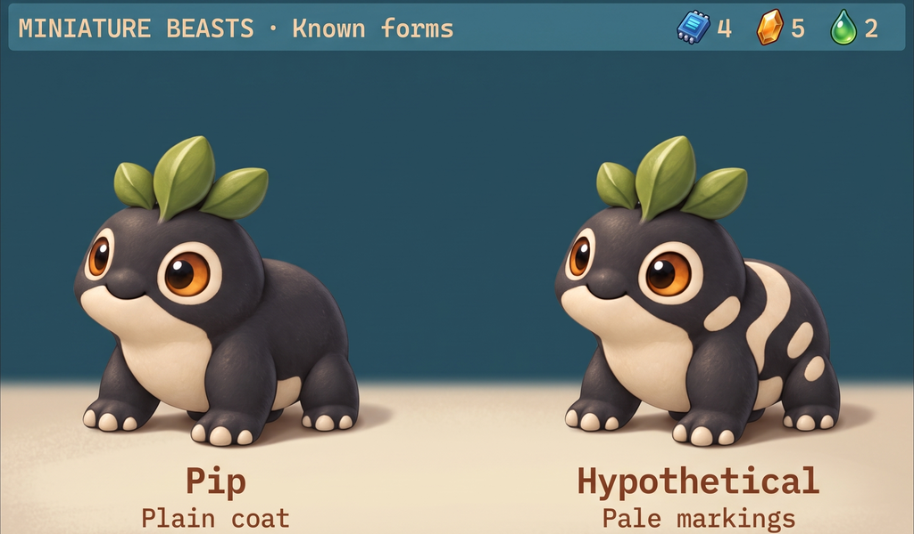<br><em>station-known-forms: rich creatures at Station size. Approved concept, generated.</em></td></tr></table>

---

## Home

**Vibe.** Overview: the frame is the hardware, industrial and plasticky; the window is the vivarium, cozy and alive.

**Purpose.** The always-on view: the collection alive, the equipment's state. **Reads first:** the residents, then whatever needs you (the bottom line's right part).

- **Living window.** The vivarium, the left two thirds (about 640×500): a lit glass habitat with plants, stones, water and a burrow. Residents in the rich treatment keep their species' routines. The with-you bed shows the mibi with you, or a small Companion mark while away.
- **Instrument.** The right third, four stacked modules, each with a status lamp and a few-word readout: the sample bay (crates behind a door), the pod rack (six wells, shells in place colours, a star where one glints), the incubation chamber (a dome and its ring of leaves), the Probe dock (the Probe and its Shield plates).
- **Composition.** The vivarium's glass sits in a thin bezel; the modules align to one column with 8 px gaps. Nothing overlaps the vivarium.
- **Lively / quiet.** Lively: residents, plants, water, the embryo's glow. Quiet: the modules; one lamp pulses slowly when its module needs you.
- **Light.** Warm daylight inside the vivarium from the top left; even cool light on the chrome.
- **Palette.** Deep blue-teal chrome; the vivarium's greens and warm earth; amber only on the lamp that needs you.
- **Type.** 3× screen name; 2× readouts, three words or fewer each.
- **Chrome.** `✓ Look at Bean`, no ← on Home (*corrected by the UI designer, 2026-10-09, the owner's decision on the navigation model*: was `← the room`) | `Bean · Untuva · adult` | `an Untuva pod waits · needs 2 ❀`.
- **Motion.** Residents move smoothly at the panel's rate; module doors and lamps move only on events.

**Pass when**
- [ ] It reads as an instrument holding something alive, not a room.
- [ ] The vivarium is the only warm light on screen.
- [ ] Residents are the matched rich treatment, never upscaled tokens.
- [ ] Each module reads by its shape before its words.
- [ ] What needs you is found in one glance.
- [ ] No wood, felt, shelves or lamp-lit bench.

<table><tr><td valign="top">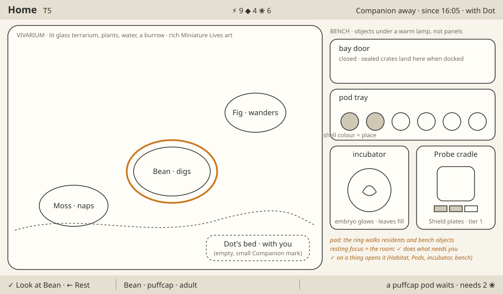<br><em>Home wireframe. Layout only.</em></td>
<td valign="top"><br><em>companion-resident-home: the warmth of the vivarium, at Station resolution. Approved concept, generated.</em></td></tr></table>

---

## Dock and arrival

**Vibe.** Overview: hardware, the Companion seated in the dock, crates and a bay door.

**Purpose.** Cargo arrives when the Companion docks and the player opens the bay. **Reads first:** how many crates are in the bay, then the ribbon.

- **Instrument.** The sample bay leads: docked, its door shows one sealed crate per consignment. `✓ Open the bay · 2 crates`. Then, per crate: the seal breaks, pods travel along a rail into the rack's wells, the counters tick, the Probe dock shows the free mend, a ribbon reads "Expedition 4 home · 2 pods · explored 9 of 21", the world turn jumps.
- **Living window.** The vivarium stays; residents turn toward the bay as crates open.
- **Composition.** Home's layout; the bay module brightens and grows a little; the ribbon crosses the stage's top. A report card waits on the vivarium until the next press.
- **Lively / quiet.** Lively: the crate, the pods' travel, the residents' reaction. Quiet: the other modules.
- **Light.** A cool beam inside the bay as the seal breaks; the vivarium unchanged.
- **Palette.** Crates in slate and teal with orange seal tags; counters flash yellow.
- **Type.** 3× ribbon; 2× report lines.
- **Chrome.** Presses during the arrival are consumed; focus stays on the room; then `✓ Look at the new pods`.
- **Motion.** About 3 s per crate: seal 300 ms, each pod's travel 600 ms, ticks at +1 per 90 ms.

**Decided 2026-10-08 (the portrait crate, [the portrait](../proposals/the-portrait.md) §1).** A finished portrait comes to the bay like cargo: while it is painted, a flat crate silhouette waits behind the bay door with its lamp slowly filling (no clock, no digits; "waiting for the cloud" when offline); landed, the bay lamp turns amber, `✓ Open the bay · 1 crate`. The seal breaks, the flat crate slides out, its lid lifts and the portrait stands on the stage in its gilt frame, ribbon "Fig's portrait"; then `✓ Look at Fig` opens Habitat, where Fig is drawn fresh in its painted set. The welcome sitting arrives here too, as a small gift crate ("a sitting, to begin").

**Pass when**
- [ ] Docking alone shows crates and accepts nothing.
- [ ] Each crate's arrival reads as one event.
- [ ] The free mend shows on the Probe dock.
- [ ] Nothing of the field is drawn; the Station shows only what it owns.
- [ ] A still frame tells the same story.

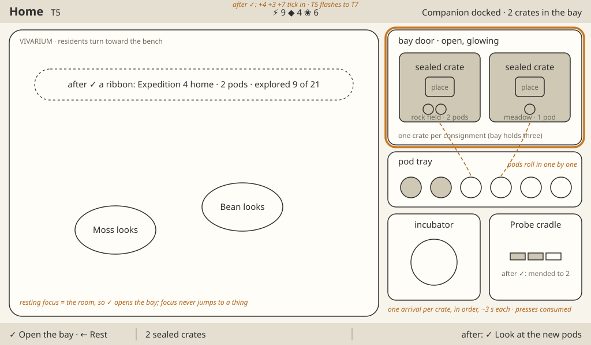

*Dock and arrival wireframe. Layout only.*

---

## Pods

**Vibe.** Research bench: a modern digital lab.

**Purpose.** Identify a pod, read its chapters, compare, return. **Reads first:** the pod and its name.

- **Living window.** The specimen stage: the pod under the instrument's beam. It is the one warm thing: a soft inner glow, then, once identified, the seal on its cap broken and the species glyph lit.
- **Instrument.** The pod list at the left (six wells and a return hatch with a leaf mark), each well with its pod's place stamp, glyph or seal, and progress ring. The chapters as machined arcs above the pod, each with an emblem and one word; the focused chapter opens as a page of trait pictures on a deep pane. The genome ring on the stage plate under the pod.
- **Progress ring.** Around each pod in the list: the centre fills at Identify; then one arc per chapter, sized by its trait count, fills when that chapter is read; a star on an arc is a glint; a notch is a sealed chapter. No digits.
- **Chapter states.** Unread (hairlines on the arc, cool frost on the page with nothing behind it); glint (a four-point star); shows and hides (a close, warm drawing of each trait on this pod's mibi, a misty seed holding the hidden look); only (a small solid base); asleep (the look drawn sleeping); breed to change (two joined rings); sealed (shut, a notch, a picture of what opens it).
- **Genome ring.** The species glyph at the centre, a grey band for the frame, two coloured tracks of spokes for the two copies, one sector per chapter clockwise from the notch, outer dashes; unread parts are hairlines that fill as chapters are read.
- **Composition.** List 160 px; stage centred; arcs spanning the upper stage, the open page beside the pod; origin line under the pod.
- **Lively / quiet.** Lively: the pod's glow, glints, the page turn. Quiet: list, arcs, plate.
- **Light.** The beam from above-left on the pod; a read page lit warm from inside; arcs and list cool.
- **Palette.** Pods from one renderer: the species' colour pair and shell pattern, the place's dust or moss; frost pale blue-white; seeds pearl with a ghost inside; the ring's band grey, its tracks in the looks' hues.
- **Type.** Pod name at 4×; origin at 2× ("Found on the rock field, as a Tuikis felt safe."; the pattern is in [Station layouts](station-layouts.md), Words on Pods); one word per chapter; one short line per trait ("stripes · hides spots", "only teal", "breed to change"; at most six words).
- **Chrome.** `✓ Identify · 1 ⚡`, `✓ Read Coat · 3 ◆`, `✓ Shape a founder`, `✓ Compare`, `✓ Return to the wild · +1 ❀`.
- **Motion.** The seal breaks and the glyph lights in about 2 s; the page turns in 2 s and its sector fills; glints 2 Hz; compare slides the second pod in at 300 ms.

**Decided 2026-10-07 (concept round).** The genome stamp sits on a square label of about 220 px, no plate. The progress ring sits around the pod's shell and carries chapters only; "identified" shows on the pod's seal. The dark glass lab is the bench, and Create and Incubator follow it. Reference: `art/concept-station/pods-v2/`, candidate PV-D-r3-a4.

**Chapter rail (Decided 2026-10-08).** Every research-bench screen shows as many chapters as the species has, in ring order; there is no fixed count. The four-tab rails in the concept plates are legacy concept art. Loika shows seven. *Superseded: catalogue 9 gives the Loika four chapters (art director, 2026-10-08).*

**Pass when**
- [ ] Unread chapters show nothing; draw only what is known.
- [ ] The seven chapter states are told apart without colour.
- [ ] The progress ring reads at a glance in the list, with no digits.
- [ ] The genome ring is pretty with only its band, fills as chapters are read, and holds up in one colour.
- [ ] No letters, ratios, loci or progress digits anywhere.
- [ ] The pod is the warmest, brightest thing on screen.
- [ ] Pods of one species match; no shell shows an individual's genes.

<table><tr><td valign="top">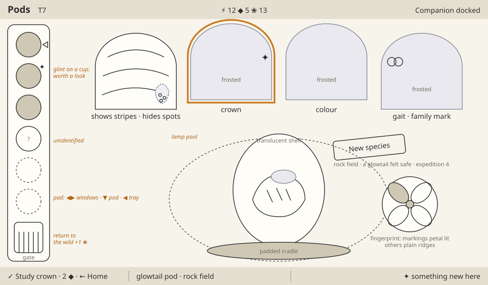<br><em>Pods wireframe. Layout only; drawn with windows before the research loop.</em></td>
<td valign="top">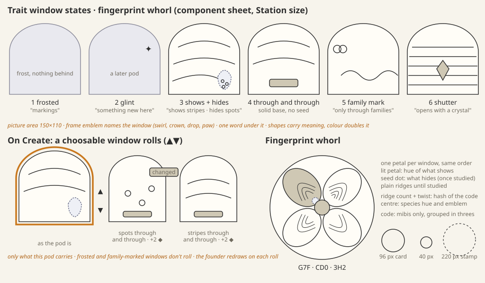<br><em>Chapter states, first drawn as windows and a whorl. Layout only.</em></td></tr></table>


*Genome rings drawn from the real catalogue: the ring's layout. Diagram, not final art.*


*station-research-pod: the pod in its cradle under a beam. Approved concept, generated. Its icons and type are not specs.*

---

## Create (the review)

**Vibe.** Research bench: a modern digital lab.

**Purpose.** Shape a founder and see its cost. **Reads first:** the founder.

- **Living window.** The founder large in a specimen chamber at the centre, at 300×310 or larger, rich treatment. Wherever a chapter is unread, that part stays misty: a cool frost over the body, never a guess.
- **Instrument.** The same chapter arcs as on Pods, same order. The opened pod at the left; the empty incubation chamber and the ring at the right. A shapeable trait carries ▲▼ notches and rolls among three pictures (as the pod is, only the hidden look, only the shown look); a changed one wears a "changed" tag; a doings trait wears two joined rings and "breed to change"; clashing traits are marked and Grow is withheld.
- **Composition.** Founder centred and lowest-set; arc above; pod and chamber balance it left and right.
- **Lively / quiet.** Lively: the founder (breathing, a blink) and its redraw when a trait rolls. Quiet: arcs, pod, chamber.
- **Light.** Warm key light on the founder from the top left; the rest cool.
- **Palette.** The founder's own colours; frost pale blue-white; the price icons in their hues.
- **Type.** 2× trait lines ("stripes · hides spots", "only spots"; at most six words, a blend "A to B", an asleep line "bare · asleep: bands or patches"); the total in the bottom line.
- **Chrome.** `✓ Grow it · 2 ⚡ 4 ❀ 1 ◆ · ← Loika` (*corrected by the UI designer, 2026-10-09, the owner's decision on the navigation model*: was `← Pods`; Create's parent is the pod's overview).
- **Motion.** A roll swaps the trait's picture, the founder's part and the stamp's cells in 200 ms; on Grow the stamp prints on its label, the code appears, the pod glides into the chamber in 600 ms.

**Decided 2026-10-08 (concept round).** Reference `art/concept-station/create/`, candidate CR-C2. The painted master places the accepted Pip asset (the same drawing on every Station screen; Pip is not regenerated). Roll pictures are flank close-ups of the changed part, not whole founders. The still-sealed doings chapters are named in one status-bar line ("Face and Stamina stay a surprise"), not as greyed tabs.

**Decided 2026-10-08 (the standard look).** The founder on Create, and every mibi everywhere, is drawn in the **standard look** rendered from the rig (continuous proportions, the species' pools), finished to this guide: that is the game's art, the default and not a placeholder ([art-pipeline](../proposals/art-pipeline.md) §1). A unique cloud-painted render is a prize a mibi may earn later; Create never shows one. *2026-10-08, the words:* the prize is the **portrait**, paid with **a sitting** earned by research; the brief for the standard look is [the plain renderer](../proposals/plain-renderer.md).

**Decided 2026-10-08 (the standard painting, [art pipeline](../proposals/art-pipeline.md) §1.1).** *Superseded above:* the rig's render is the **placeholder**, not the game's art. The founder on Create is drawn in the placeholder (the stylised rig pass: flat slots, outline, no face, no material; [the placeholder brief](../proposals/plain-renderer.md)), since nothing is painted before Grow; the roll pictures are placeholder close-ups. Grow starts the standard painting. The pass line "same trait boundaries as the Companion's HiBit drawing" holds for the placeholder as it does for the painting.

**Pass when**
- [ ] Founder, changes, surprises and cost are all visible at once.
- [ ] The founder's misty parts match the unread chapters exactly.
- [ ] A roll changes only what that trait covers, and never offers a look the pod lacks.
- [ ] The code appears only at Grow.
- [ ] Same trait boundaries as the Companion's HiBit drawing.

<table><tr><td valign="top">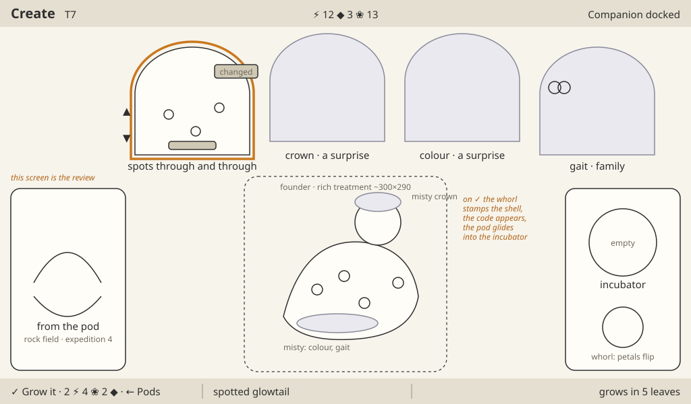<br><em>Create wireframe. Layout only.</em></td>
<td valign="top">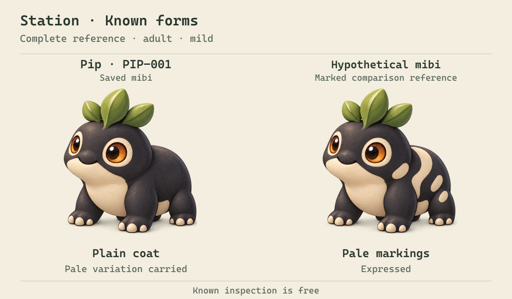<br><em>Two individuals differing only in markings, at Station size. Accepted appearance reference (creature only).</em></td></tr></table>

---

## Incubator

**Vibe.** Research bench: a modern digital lab, with the chamber's glow as the one warm thing.

**Purpose.** Watch the bud grow and open it. **Reads first:** the glowing bud, then how many leaves remain.

- **Living window.** Inside the dome: a cute, generic glowing bean in a nest, brighter and perhaps shifting in colour as it grows, with the species' shape glowing inside it when ready. Never an embryo shape at any stage (**Decided 2026-10-08**). Warm, slow, alive.
- **Instrument.** The incubation chamber: a glass dome on a machined base, a ring of leaves as the timer (one leaf a minute, each filling smoothly), the stamp on its label at the right, its code string beside it as live text. The unread chapter tabs above clear one by one, and the stamp's chapters fill with them.
- **Composition.** Dome centred, large (about 360 px across); leaves in an arc over it; chapter arcs above; plate below.
- **Lively / quiet.** Lively: the bud's glow and the filling leaf. Quiet: everything else. Ready: the dome glows, the shape visible inside the bud, and nothing steps out until the player opens it.
- **Light.** Warm light from inside the dome; cool chrome around.
- **Palette.** Leaf greens for the timer, pale glass, the bud's warm glow drifting toward the species hue.
- **Type.** 2× status, no digits for time.
- **Chrome.** Read-only while growing (no ✓ cap); ready: `✓ Open`.
- **Motion.** A leaf fills over its minute; Open lifts the glass in 600 ms, the bud cracks and the juvenile steps out: "Fig · Tuikis · juvenile".

**Decided 2026-10-08 (concept round).** Reference `art/concept-station/incubator/`, candidates IN-D-r1-a3 (growing) and IN-C1 (ready). Ready keeps the shape glowing inside the bud so the player gets to crack the incubator open. The growing bud is a cute, generic glowing bean; colours may shift, shapes never become embryos. The stamp stands alone on the Station; the code string may also show, as a shareable "look at my mibi" string.

**Decided 2026-10-08 (economy and the prize).** Two additions. **Instant grow:** while growing, the chrome offers `✓ Grow now · <price>` beside the read-only wait (the price to be set with the real economy; the first bud ever grows in five minutes, others twenty plus one per shaped trait; all timers sit under the developer-tools toggle for testing). The juvenile that steps out wears the standard look, always. *Superseded 2026-10-08 ([the portrait](../proposals/the-portrait.md)):* the "prize render state", a fourth chamber state for a painted set arriving, is gone. The incubator has growing and ready, nothing else; a portrait arrives as a crate in the sample bay (Dock and arrival), and the sitting that pays for it is chosen on Habitat (the Sitting, below).

**Decided 2026-10-08 (the standard painting, [art pipeline](../proposals/art-pipeline.md) §1.1).** *"The juvenile that steps out wears the standard look, always" is superseded.* Grow starts the mibi's standard painting; the chamber keeps its two states, and the painting is not a third. **At Open,** the juvenile steps out in its standard painting if it has landed (a connected kit, within the bud's minutes), else in the **placeholder**: the stylised rig pass, flat and outlined, no face, no material, with a small cool "waiting" lamp on the chamber's base and the status "its painting is on its way" (offline: "waiting for the cloud"). **The painting lands** at the next fresh draw of that mibi (a screen change, waking, coming home), never while it is on screen, and the lamp goes out; no ribbon, no crate, no spinner. The same placeholder and lamp show on Home's vivarium and Habitat for any resident still waiting. The pass line "the juvenile that steps out is the founder from Create, its ring whole" holds in either look.

**Pass when**
- [ ] Time reads as leaves, never digits.
- [ ] The bud is the only warm, living thing.
- [ ] Ready reads from across a table.
- [ ] The juvenile that steps out is the founder from Create, its ring whole.
- [ ] A still frame shows progress.

<table><tr><td valign="top">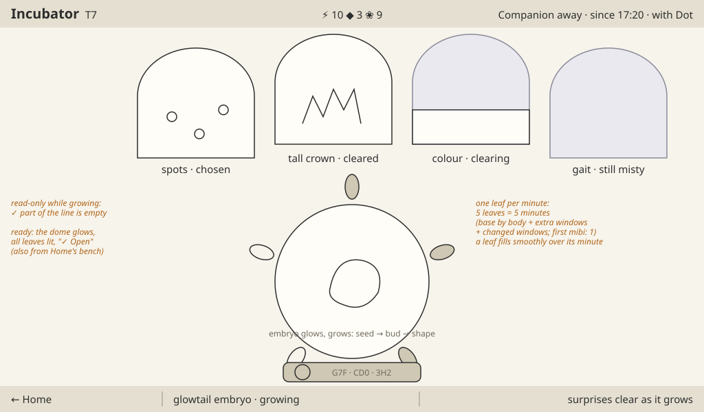<br><em>Incubator wireframe. Layout only.</em></td>
<td valign="top">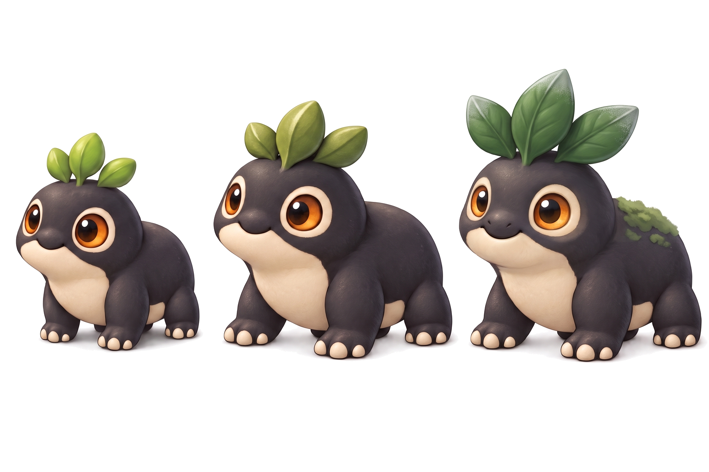<br><em>The juvenile that steps out reads young by proportion. Approved concept, generated.</em></td></tr></table>

---

## Library

**Vibe.** Library: a botanical tome. Two screens: the **Spread** and the **Book**. The Library is one object, an old botanical-expedition volume, and both screens are its pages.

**Decided 2026-10-08 (owner).** The collection screen is the **tome's spread of plates**: reference `art/concept-station/library-spread/`, recommended SP-P-r4-a1. Three earlier displays are rejected, with the reasons in their READMEs: the **Cabinet** of boxes (`library-cabinet`; the boxes too basic, and an unmet species may show no cue at all of what it may be, so no silhouettes and no shapes in the mist); the **Specimen Case** (`library-case`; too gimmicky, and nothing on it communicates what it is: it does not read as a collection, no dedicated place per species shows, glass plus box plus frame plus paper to show a sketch is boring, and the ledge's tags, bars and pins do not say what they are); and the **gallery wall** (`library-collection`, direction G; its hooks, plates, frames and lighting steal the spotlight from the specimens). The shelf of the first round (`library`) was rejected earlier. Lineage matters: the stamp carries it, and the Book shows a family tree (display in `design/proposals/family-tree.md`).

**Standing rule (owner, 2026-10-08; [art direction](../art-direction.md)).** Never drift to childish art. The look is cute by charm and craft, as the accepted Pip is; not cartoon simplification, sticker faces, toy-like rendering, nursery colours or storybook ornament. The spread's correction round is the example: the first recommendation (SP-P-r2-a1) drew the warning, since its lanterns, scrollwork and ribbons read storybook, its plates read as stickers, its cat was cute and the device's type turned serif; rounds 3 and 4 redrew it as a real naturalist's expedition volume in ink and watercolour, restrained ornament, plates at Pip's craft, a real pencil study, aged natural colours and the device's own type on the chrome. Every Library brief, critique and master checks against this line.

### Spread

**Purpose.** The whole collection at a glance, as pages of the book that opens from it. **Reads first:** the found plates among the sixteen frames.

- **Living window.** None; the spread is quiet. The plates' own warmth is the only warmth, inside the found frames.
- **The tome.** An old botanical-expedition volume: aged, foxed laid paper with worn boards and a deckle; a single ink rule; restrained life in the margins, a cloth marker, a leaf and seeds, a dried flower, a wordless pencil scribble, a survey sketch, none covering a frame. No scrollwork, lanterns or ribbons. The device's own sans (Inter) on the chrome; a serif leak is a fail.
- **Frames.** Sixteen ruled frames to the spread, eight a page in two rows of four, one place per species, all seen at once; the collection grows by a page turn, never by scrolling. Each frame has a blank caption rule under it.
- **Found.** A tipped-in framed plate in the book's own plate style (the Book's mounted portrait at small size), painted at Pip's level of craft; never a flat card or a sticker. Once a mibi of the species is portrayed, its portrait takes the plate, with a gilt corner on the mat (with several portrayed, the Book offers `✓ Make Fig the face`). Loika's plate is the placed Pip.
- **Met, not researched.** An anatomical pencil study, a real naturalist's pencil with its construction lines, the name in pencil grey.
- **Unmet.** An empty ruled frame with a blank caption rule and no cue: no silhouette, no shape, no colour.
- **Clan.** An inked rule in the clan's colour over the frame of each met species; none at the page edge, none on unmet frames.
- **Focus.** A thin cream rounded rectangle around the frame.
- **Composition.** The open spread fills the stage; frames 96×112 with their caption rules; the margins' life between and around them.
- **Palette.** Aged cream and sepia; graphite; the plates' own natural colours; the clan colours only on the inked rules.
- **Type.** 3× screen name; names at 2× in the device type, placed on the caption rules (the met name in pencil grey); nothing under unmet frames. No digits.
- **Chrome.** `✓ Open` on a found or met plate; read-only on an empty frame. No ledge, no synopsis objects: the spread itself is the record.
- **Motion.** The plate lifts off the page and becomes the Book's mounted plate in 300 ms; a page turn past sixteen.

### Book

**Purpose.** Each species' field guide: its frame, the looks found so far, lineage and wishes. **Reads first:** the species' portrait and name.

- **Living window.** The species portrait: one resident of that species in rich treatment, doing its habit (dig, glow, puff), mounted on the page as a framed plate.
- **Instrument.** The field guide, full screen: the species' places as stamps; the frame once, as a pressed plate; one tab per chapter (as many as the species has), every look found as a small specimen plate per trait and one dotted "more?" slot; the stamp at 120 px on a plain plate; the family tree panel under the stamp; the pinned wish.
- **Composition.** Portrait at the left (about 300×310); guide pages centre; stamp, tree and wishes right.
- **Lively / quiet.** Lively: the portrait. Quiet: the guide, the tree.
- **Light.** Warm on the portrait; cool, even light on the archive.
- **Palette.** The tome's cream, the species' hues on plates.
- **Type.** 3× species name on a paper label, with one 2× habit line under it; no paragraphs.
- **Chrome.** `✓ Visit Fig` on a mibi, `✓ Add to the wish` on a look, `✓ Find a pair` on a wish, `← Library` (*corrected by the UI designer, 2026-10-09, the owner's decision on the navigation model*: was `← Spread`). `✓ Visit Fig` is a jump: on Habitat, ← reads Home.
- **Motion.** Tabs turn in 200 ms; the portrait lives.

**Decided 2026-10-08 (owner; `art/concept-station/library-book/`, BK-D-r2-a1).** The Book is accepted. The portrait is mounted as a framed plate, not painted straight onto the page; the family tree panel stays under the stamp at about its present size (about 180×160 px); the name sits on a paper label with the habit line under it. For the master, the label's copy and the names go through the copywriter's rules and this guide's type first: consistent case (the owner flagged a mix of lower and upper case) and the typeface.

**Decided 2026-10-08 ([the portrait](../proposals/the-portrait.md) §1, §7).** The book's living window is the species' **face** (a resident in the standard look, doing its habit) until a mibi of the species has sat for its portrait; then **the portrait replaces the face**: that mibi in its chosen pose and place, alive in the window, the habit line under it. A portrayed mibi returned to the wild keeps its portrait here, marked "released". After the welcome portrait, the gilt frame is drawn faintly over the species' last empty look plate to show where the next sitting comes from.

**Pass when**
- [ ] The spread shows every released species' frame at once, sixteen to the spread, no scrolling; more species turn a page.
- [ ] The specimens are the spotlight: framed plates in the book's style and a real pencil study, never flat cards or stickers; the tome's life stays in the margins.
- [ ] Unmet frames give no cue at all; the met study shows only what the field saw.
- [ ] Nothing childish: no storybook ornament, no sticker plates, no cute animals, no serif on the chrome.
- [ ] Knowledge, never material: nothing implies a look, or a wish, can be taken from here.
- [ ] The family tree reads parents, siblings and children without text.
- [ ] Two mibis are told apart by stamp at 40 px.
- [ ] No digits, no ledge, no furniture; never a text page or a school lesson.

<table><tr><td valign="top">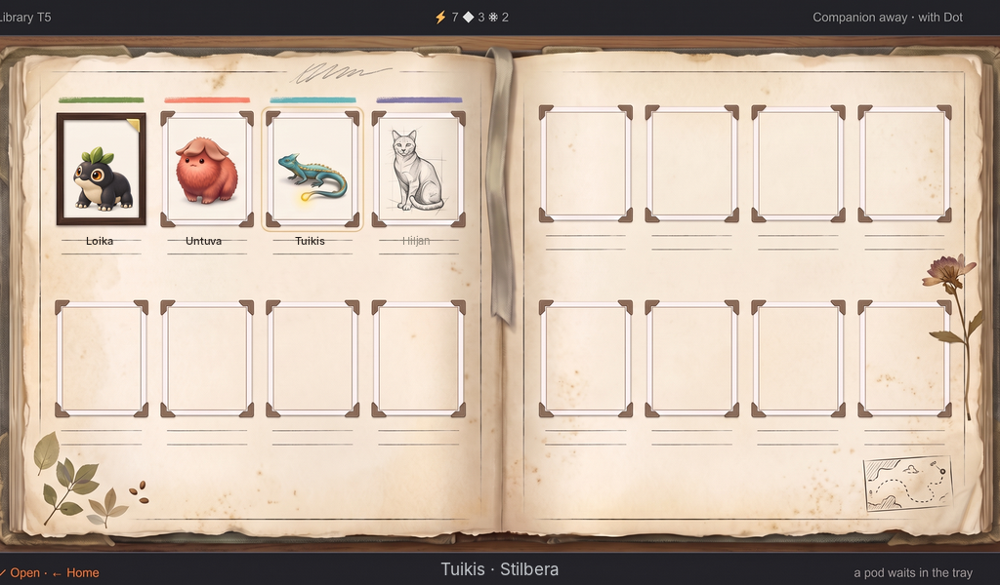<br><em>The Spread, SP-P-r4-a1 with Pip and the names placed. Concept art, generated and placed; the chosen direction, not a master.</em></td>
<td valign="top">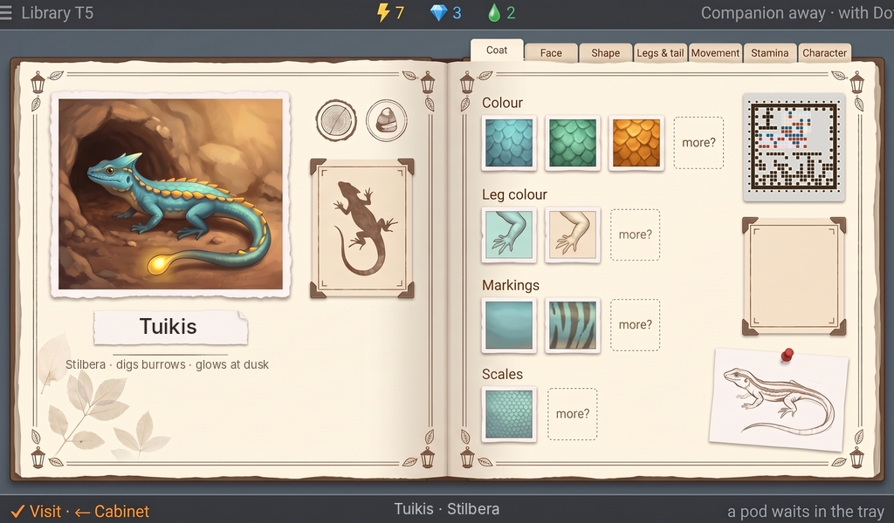<br><em>The Book, BK-D-r2-a1 with the real stamp and the name placed. Accepted 2026-10-08; concept art, not a master.</em></td></tr></table>

---

## Habitat

**Vibe.** Vivarium: cozy, warm, the pet happy at home.

**Purpose.** One resident up close: spend time, take it with you, bond, cross. **Reads first:** the resident.

- **Living window.** The resident large (300×310 or larger) in its corner of the vivarium, rich treatment, doing its species moment on Spend time.
- **Instrument.** A card at the right: name, stage, species, ability, a memory line, the genome ring as a seal with the code, its chapters as small plates. Under it the with-you door (the Companion dock module, with the mibi with you or "away"), the bond heart and, on an adult, the cross mark. A strip of residents along the foot with the free places.
- **Composition.** Window the left 60%; card the right 40%; strip 72 px.
- **Lively / quiet.** Lively: the resident. Quiet: card, door, strip.
- **Light.** Warm key light from the top left in the window; cool on the card.
- **Palette.** The vivarium's greens and earth; card chrome; the heart red, with its shape.
- **Type.** 4× name; 2× card lines.
- **Chrome.** `✓ Spend time with Fig`, `✓ Take Fig with you`, `✓ Bond with Fig` (then ✓ again), `✓ Cross Fig`. `← Home`. With a sitting held and Fig eligible: `✓ Portray Fig · 1 sitting` (2026-10-08).
- **Motion.** The strip swaps the resident in 300 ms; the species moment plays about 2 s.

**Pass when**
- [ ] The resident is the same individual as on the Companion.
- [ ] Stage reads from proportion and bearing; elders calm and dignified.
- [ ] No meters or needs.
- [ ] The door shows where the mibi with you is.
- [ ] Spend time rewards nothing and shows nothing like a reward.

---

## Sitting

**Decided 2026-10-08** ([the portrait](../proposals/the-portrait.md) §1). A short section, since the ceremony borrows Habitat and the bay.

**Vibe.** Vivarium light on a plain stage: the one-resident warmth of Habitat, with the instrument reduced to the choices.

**Purpose.** Spend a held sitting on one mibi: choose its pose and its place, confirm, and wait. **Reads first:** the mibi on the stage, then the gilt frame.

- **Where it lives.** The held sitting is a small gilt frame in a slot on Home's instrument beside the Probe dock (one slot, one frame; it pulses "use your sitting first" when a guide is one look from full and a second would be earned). The ceremony starts on **Habitat** with `✓ Portray Fig · 1 sitting` and opens the sitting screen for its three steps; a mibi fresh from the bud is offered nothing ("Fig needs a walk first"); a portrayed mibi shows its portrait instead of the offer.
- **Living window.** Fig in the standard look on a plain stage, acting out the focused pose.
- **Instrument.** Step 1, the pose: one small picture per habit the player has watched (dig, glow, puff, sleep curled), in the standard look; `✓ This pose · ← Fig`. Step 2, the place: the places Fig has been as the book's place stamps, the focused one washing the stage in its colours; `✓ This place · ← pose`. Step 3, look and confirm: Fig in the pose, in the place, the gilt frame around it, one line "One sitting each, ever"; first ✓ arms (the frame lights), second ✓ begins: `✓ Begin the sitting · 1 sitting · ← place`.
- **The wait.** The frame leaves the slot for the sample bay module, where the flat crate waits behind the door with its filling lamp (Dock and arrival). Fig lives on as before. A few hours; no clock, no spinner.
- **Type.** 4× name; 2× habit and place words; no digits but the price.

**Pass when**
- [ ] The three choices are made from what the player has seen Fig do and where it has been, nothing else.
- [ ] Nothing on the stage promises what the portrait will look like beyond pose and place.
- [ ] The arm-then-confirm state is visible before the sitting is spent.
- [ ] The wait reads from the bay's crate and lamp, never from a number.

<table><tr><td valign="top">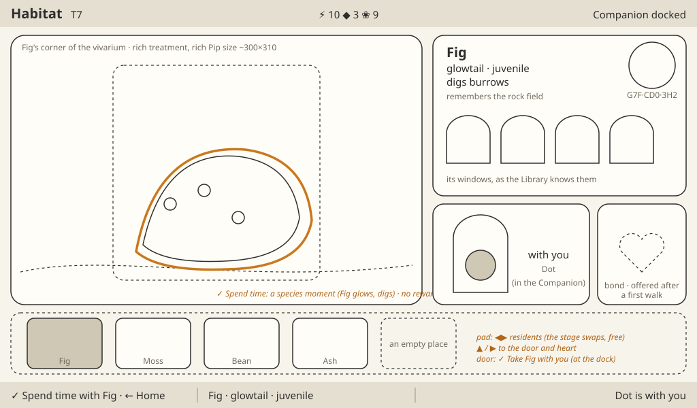<br><em>Habitat wireframe. Layout only.</em></td>
<td valign="top"><br><em>Stage by proportion and bearing. Approved concept, generated.</em></td></tr></table>

---

## Cross and Wish

**Vibe.** Research bench: a modern digital lab, two living specimens and a forecast between them.

**Purpose.** Pick two adults of one species, see what their child could be, cross them; see how close a pairing gets to a wish. **Reads first:** the two parents, then the forecast.

- **Living window.** The two parents left and right in rich treatment (about 240×250 each), alive and aware of each other. Between them the child to be, misty: never a promise.
- **Instrument.** Each parent's genome ring on a plate beneath it. Under the child, one row per trait: four seed pictures, quarters drawn (one spotted, two hiding spots, one plain), never odds as numbers. A pinned wish as a small plate of its looks; traits that can reach it wear its mark. An ineligible pair greys out with the reason.
- **Composition.** Parents in the outer thirds; child and forecast centred; the wish plate top right.
- **Lively / quiet.** Lively: the parents. Quiet: forecast, plates.
- **Light.** Warm key light on the parents from the top left; the forecast on a cool pane.
- **Palette.** The parents' own colours; seeds pearl with a ghost inside; the wish mark in one accent.
- **Type.** 3× parents' names; 2× trait words; no digits but the price.
- **Chrome.** `✓ Cross them · 2 ⚡ 4 ❀ · ← Habitat`; an ineligible pair draws no ✓ cap and says why in the middle.
- **Motion.** A parent swaps in 300 ms; on Cross the two rings slide together, one track from each, into the child's ring, and its pod glides into the incubation chamber in 600 ms.

**Pass when**
- [ ] No odds as numbers, no percentages, no promise of a result.
- [ ] Each forecast reads as four seeds without colour.
- [ ] Only adults of one species can be paired; a refusal comes before any spend.
- [ ] The child's ring visibly takes one track from each parent.
- [ ] A wish reads as knowledge, never material.

No wireframe yet; the layout follows the brief in the [research loop](../proposals/research-loop.md#8-the-loop-step-by-step-the-brief-screens-are-judged-against).

---

## Probe bench

**Vibe.** Research bench: a modern digital lab, the Probe on a service cradle.

**Purpose.** Mend and upgrade the Probe. **Reads first:** the Shield plates.

- **Instrument.** The Probe large in its dock, Shield plates beside it, the standing switch "Mend fully on docking", the tier 2 slot (lit only when affordable). The one screen whose subject is a machine.
- **Living window.** A small porthole at the left: the mibi with you beside the dock when docked, its empty bed while away. Small and quiet here.
- **Composition.** Probe centred left of centre (about 360 px); plates to its right; switch and slot in a column at the right.
- **Lively / quiet.** Lively: the mibi in the porthole. Quiet: everything else until a press.
- **Light.** Cool, even light on the dock; a cool beam on the Probe; warm only in the porthole.
- **Palette.** Slate and graphite; plates white when whole, outlined when missing; the slot's lamp amber when affordable.
- **Type.** 3× name; 2× labels.
- **Chrome.** `✓ Mend a plate · 1 ⚡`; the switch toggles free; `✓ Arm tier 2 · 12 ⚡ 4 ◆`, then ✓ installs.
- **Motion.** A plate seats in 300 ms; the upgrade a short mechanical sequence under 1 s.

**Pass when**
- [ ] Shield state reads from the plates alone.
- [ ] The armed state is visible before the second press.
- [ ] The Probe is the same device the Companion draws.
- [ ] The porthole stays the only warm thing.
- [ ] Away, the dock shows the Probe is out, not missing.

No wireframe; the layout reference is the sketch in the [Station screens proposal](../proposals/station-screens.md):

```
 | Probe bench  T7                ⚡ 12  ◆ 5  ❀ 13                Companion docked |
 |        [  Probe in cradle  ]   plates ▮▮▯       ( ) Mend fully on docking: on   |
 |                                                  [ tier 2 slot · lit ]            |
 | ✓ Mend a plate · 1 ⚡ · ← Home | Probe · tier 1 | one plate to mend               |
```

---

## Idle

**Vibe.** Vivarium: the pets at ease, nothing asking for you.

**Purpose.** The Station at rest, always on. **Reads first:** the residents.

- **Living window.** The whole screen: the vivarium at 1024×600, its light following the time of day, residents keeping their routines.
- **Instrument.** Reduced to one status line on a thin cool strip at the foot ("Companion away · with Dot · an embryo is growing") and nothing else.
- **Composition.** The vivarium edge to edge; the strip 32 px.
- **Lively / quiet.** Lively: everything in the vivarium. Quiet: the strip.
- **Light.** Daylight to dusk to night in the vivarium; at night a soft cool moonlight and the residents' own glows.
- **Palette.** The vivarium's; the strip in chrome.
- **Type.** 2× status.
- **Chrome.** None. The first press only wakes; nothing else happens, and waking never rewards (*corrected by the UI designer, 2026-10-09, the owner's decision on the navigation model*: was "any press wakes and does what it says").
- **Motion.** Continuous and slow; nothing blinks for attention.

**Pass when**
- [ ] Beautiful at a distance, all day.
- [ ] Nothing decays and nothing nags.
- [ ] Residents are the rich treatment at full size.
- [ ] The status line is the only text.
- [ ] Night is calm, never gloomy.

No wireframe; the layout is Home's vivarium at full frame.


*companion-resident-home: the warmth idle carries, at Station resolution. Approved concept, generated.*
