# Physical-design references

The Miniature Beasts kit makes a field discovery portable, gives research room at home, and keeps accepted records visible on a shared Caddy. The physical design must support picking up either device, playing with its controls, returning it to the station and servicing it without losing that relationship.

[Devices](../../specs/devices.md) owns the product roles and open hardware choices. This page explains the appearance and construction studies; original images and generation prompts remain in this directory. They do not establish measured fit, finished electronics, ergonomic performance or manufacturing readiness.

## The current family reference

*combined-family-materials.png: sage Station, stone Companion and shared Caddy. The current family reference; screen artwork illustrative.*

The reference uses related matte sage/stone shells, charcoal protection, restrained orange controls, recessed Caddy identity and a grey OK key. [Its exact prompt](combined-family-materials-prompt.txt) preserves the source. Station is a home handheld research/world device; the combined Companion carries Probe, Cargo and Companions; Caddy provides charging, printing and a quiet summary. Screen artwork and depicted species remain illustrative.

The handheld direction favors a substantial rugged body and two-thumb use, with serial operation possible using either hand. Playing while supported in the Caddy needs clear control and finger approaches. A prominent useful display, accessible workspace controls, protection and straightforward assembly matter more than reproducing a generated silhouette. Current simulated controls are in [experience](../../specs/experience.md); older knobs, Inspect keys and separate-Probe studies cannot add controls to that mapping.

Caddy supplies one clear rest per device, accessible navigation and print/feed controls, and a paper path clear of the playing hands. Charging contact, retention, mechanism packing and reader technology remain open. Docking or presenting a device is not automatic successful transfer, ownership or reward.

## Construction and service questions

The proposed Station construction is a broad rectangular body with a front shell, passive rear cover, accessible standard fasteners and replaceable protection. An open electronics carrier or accessible rails are alternatives; a carrier earns its extra part only if it improves assembly and service.

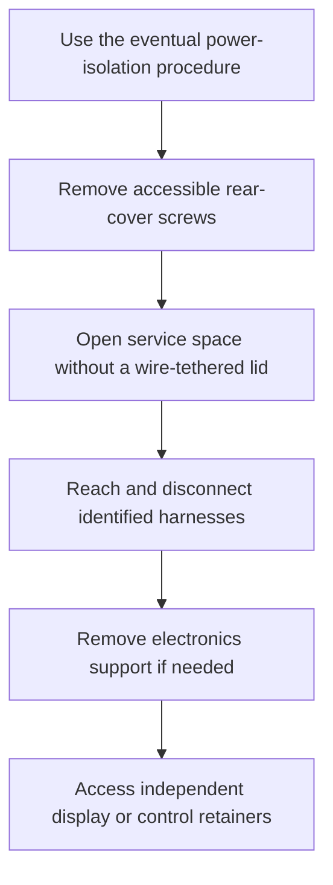
```mermaid
flowchart TD
  Isolate[Use the eventual power-isolation procedure] --> Cover[Remove accessible rear-cover screws]
  Cover --> Rear[Open service space without a wire-tethered lid]
  Rear --> Harness[Reach and disconnect identified harnesses]
  Harness --> Support[Remove electronics support if needed]
  Support --> Module[Access independent display or control retainers]
```

Boards, battery and wiring do not attach to the passive service lid in this proposal. Harnesses need reachable latches, strain relief, identified mating directions and service slack. Connectors cannot carry structural loads. Independent module retention lets service replace one part without releasing unrelated controls. Guard removal must not require destructive opening.

A packing model needs actual module and PCB envelopes, component heights, control backs/travel, connector exits, cable bends, energy and power zones, antenna constraints, heat paths and tool access. Display, glass and active pixel aperture are different boundaries. Do not treat a rear plan area as vacant PCB capacity or invent a finished depth from a render. Generous first-build space supports assembly and learning; later density changes need evidence.

Caddy construction explores joined printable trays, removable cradles, a fascia centered between docked devices and independent printer service. The front and rear must come from one dimensioned model. Seam, contact, roll/jam access, print orientation and fasteners remain unresolved. This describes the retained hypothesis; missing old illustration exports do not establish it.

## Sizing and handling evidence

The [paper sizing trial](contour-sizing.pdf), [front SVG](contour-sizing-front.svg), [rear SVG](contour-sizing-rear.svg) and [generator](contour-sizing.py) use a provisional 215×190mm body with a 12mm corner radius. A 164.90×124.27mm module outline comes from the [manufacturer H drawing](https://www.waveshare.com/img/devkit/LCD/7HP/Exterior-Size.jpg), rather than an inferred image aperture.

Its front display origin is (25.05,18)mm. Control-center reservations are navigation(25,158), Back(170,158), Confirm(195,158), and four workspace keys at x64/88/112/136,y166. Navigation reserves 30mm; other caps reserve18mm. These are paper positions, not mechanism depths or comfortable reach. The side-wheel cue is an older exploration detail, rather than a current simulated control.

The rear mirrors X and marks a 185×160mm allocation boundary inside a 15mm perimeter allowance. Projected display/control backs occupy unknown depths; the area is not an empty board budget. Print at Actual size, verify the 100mm bar, and tile the 265×300mm pages on smaller paper. This is an inert proportion check, not a fabrication template. [Ergonomics and printer examples](ergonomics.md) retains the other measured study assumptions.

<table>
<tr>
<td align="center" valign="top"><a href="contour-sizing-front.svg">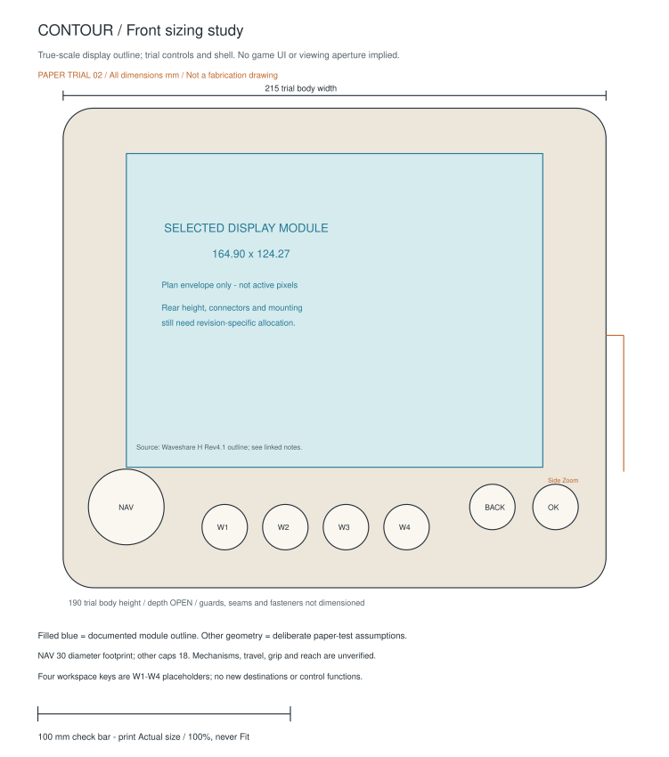</a> <em>Front (contour-sizing-front.svg): paper sizing trial, 215×190mm body. Provisional.</em></td>
<td align="center" valign="top"><a href="contour-sizing-rear.svg">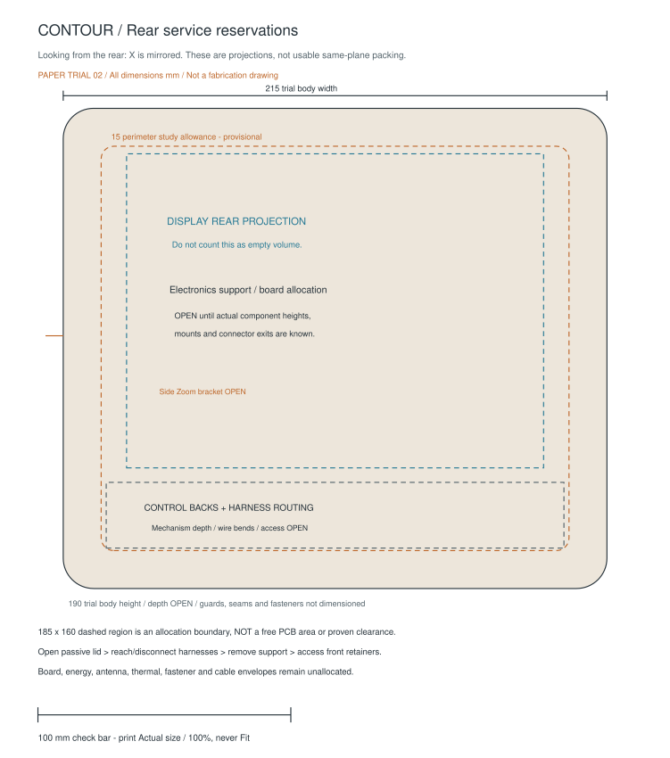</a> <em>Rear (contour-sizing-rear.svg): mirrored, with the 185×160mm allocation boundary. Provisional.</em></td>
</tr>
</table>

## Source studies by question

**How do family materials and Caddy controls relate?**

<table>
<tr>
<td align="center" valign="top"> <em>Materials (combined-family-materials.png). Current family reference.</em></td>
<td align="center" valign="top"><a href="combined-family-caddy-v3.png">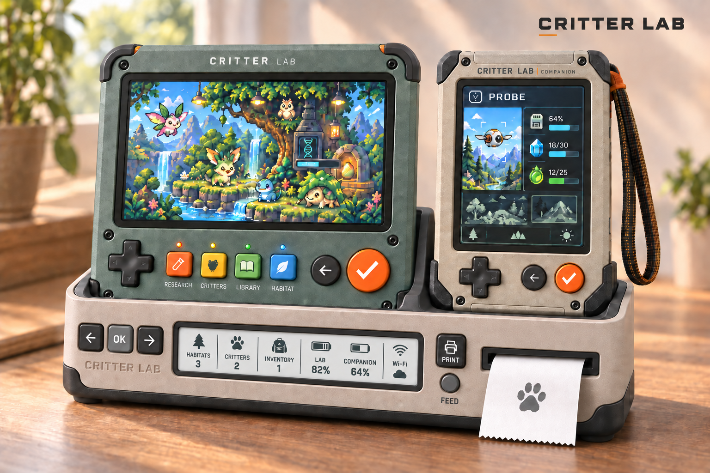</a> <em>Recessed identity (combined-family-caddy-v3.png). Source study.</em></td>
<td align="center" valign="top"><a href="combined-family-caddy-v2.png">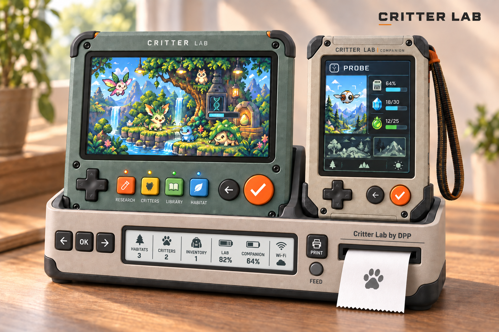</a> <em>Control group (combined-family-caddy-v2.png). Source study.</em></td>
</tr>
</table>

<table>
<tr>
<td align="center" valign="top"><a href="combined-family-branded.png">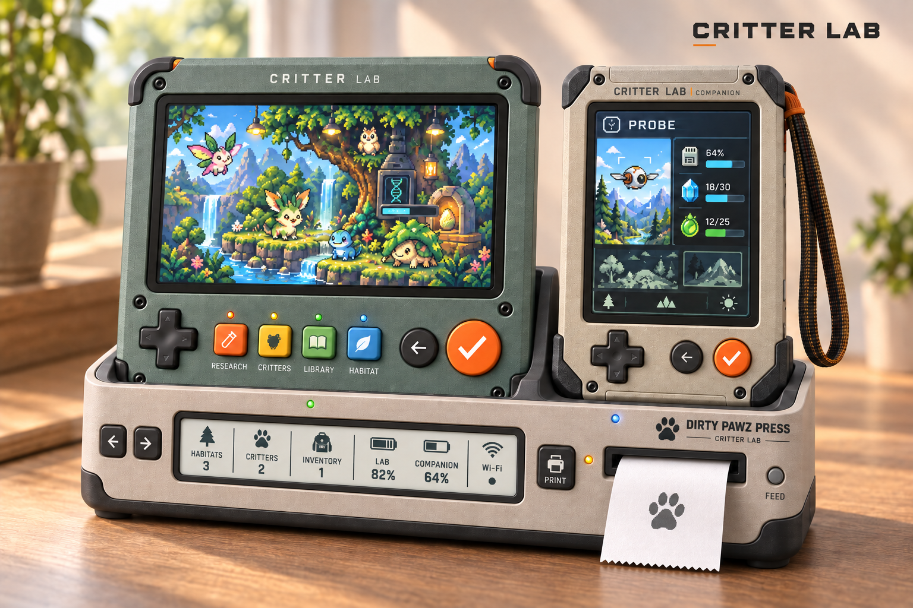</a> <em>Branded family (combined-family-branded.png). Source study.</em></td>
<td align="center" valign="top"> <em>Sage study (combined-family-sage.png). Source study.</em></td>
</tr>
</table>

Adjacent `*-prompt.txt` files retain exact inputs.

**How can one portable support three modes?**

<table>
<tr>
<td align="center" valign="top"> <em>Combined Companion (combined-companion.png). Source study.</em></td>
<td align="center" valign="top"><a href="combined-family.png">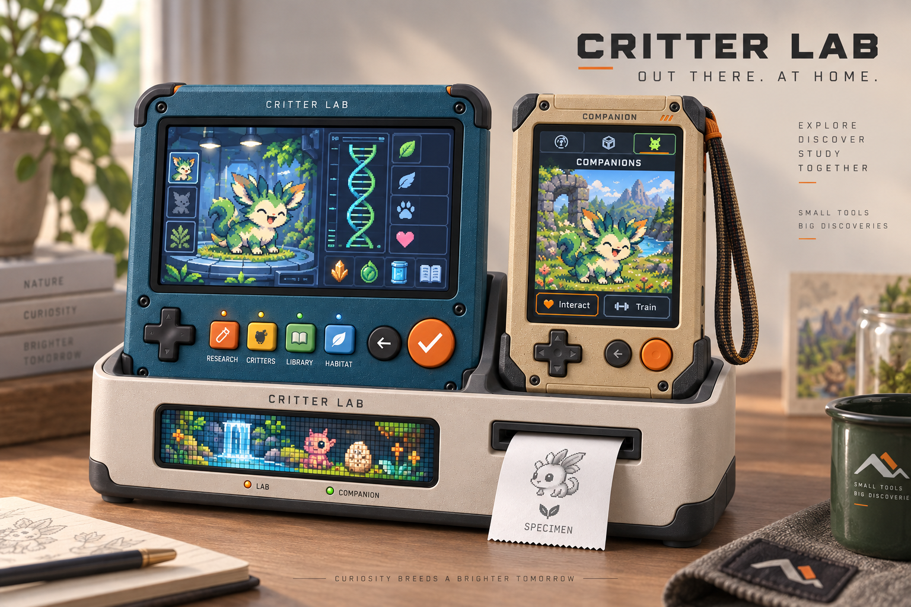</a> <em>Two-device family (combined-family.png). Source study.</em></td>
</tr>
</table>

[Briefs](combined-system-prompts.txt).

**How might handheld and station forms differ?**

<table>
<tr>
<td align="center" valign="top"> <em>Contour (architecture-a-contour.png). Source study.</em></td>
<td align="center" valign="top"> <em>Yoke (architecture-b-yoke.png). Source study.</em></td>
</tr>
</table>

<table>
<tr>
<td align="center" valign="top"><a href="architecture-c-keel.png">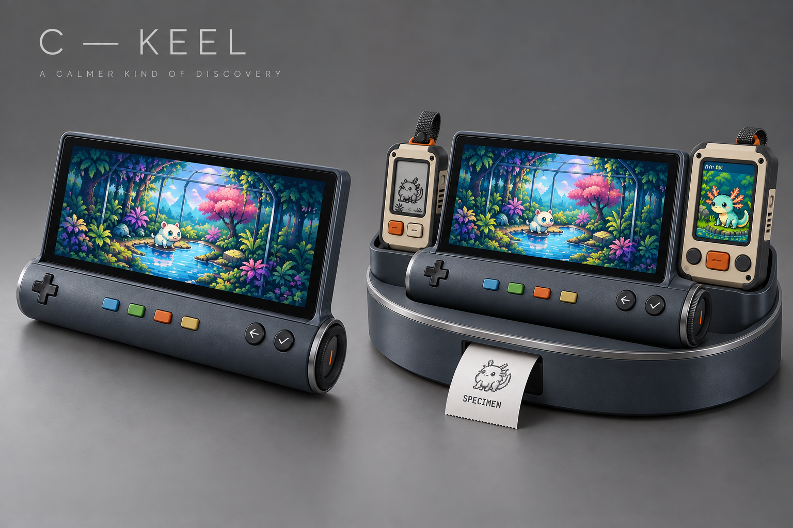</a> <em>Keel (architecture-c-keel.png). Source study.</em></td>
<td align="center" valign="top"><a href="handheld-home-directions-v2.png">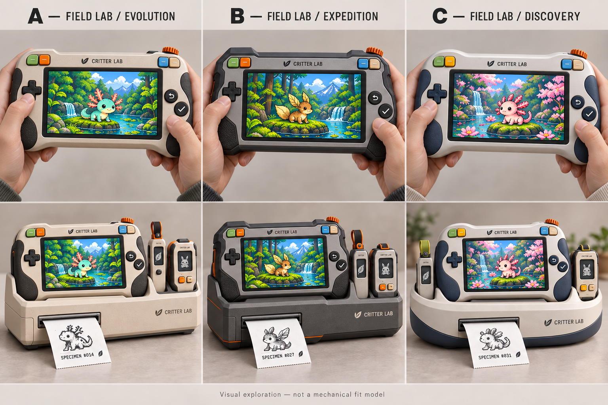</a> <em>Earlier comparison (handheld-home-directions-v2.png). Earlier study.</em></td>
</tr>
</table>

[Briefs](architecture-prompts.txt).

**What does rugged construction look like?**

<table>
<tr>
<td align="center" valign="top"><a href="contour-rugged-study.png">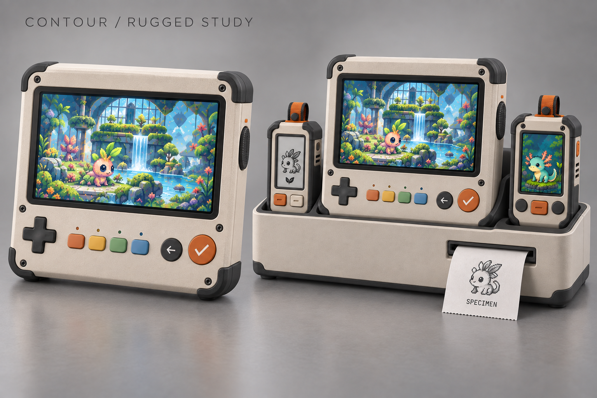</a> <em>Rugged Contour (contour-rugged-study.png). Source study.</em></td>
<td align="center" valign="top"><a href="contour-home-habitat.png">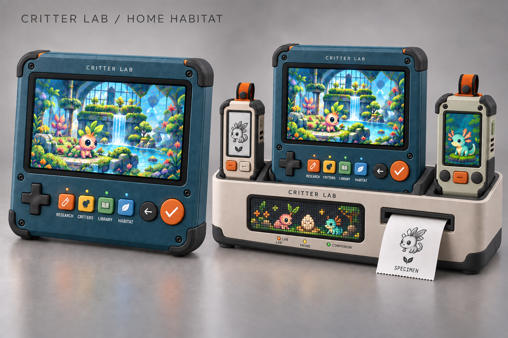</a> <em>Home/station study (contour-home-habitat.png). Source study.</em></td>
</tr>
</table>

[Prompt](contour-rugged-prompt.txt) and [inputs](contour-home-habitat-prompts.txt).

**How do control arrangements affect reach?**

<table>
<tr>
<td align="center" valign="top"><a href="instrument-pitch-v1.png">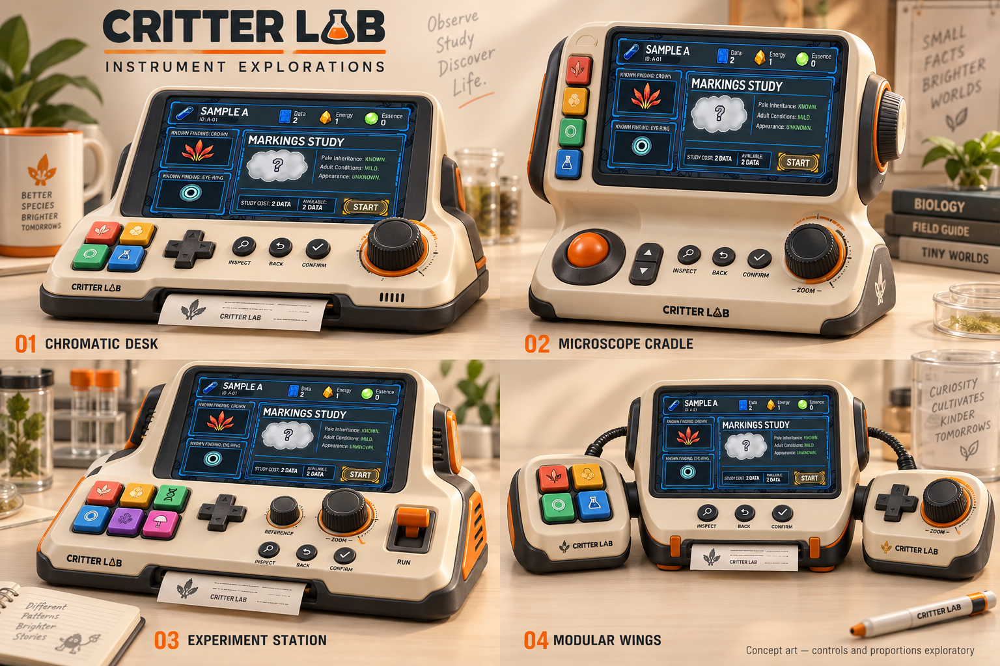</a> <em>Instrument board (instrument-pitch-v1.png). Source study.</em></td>
<td align="center" valign="top"><a href="control-family-v2.png">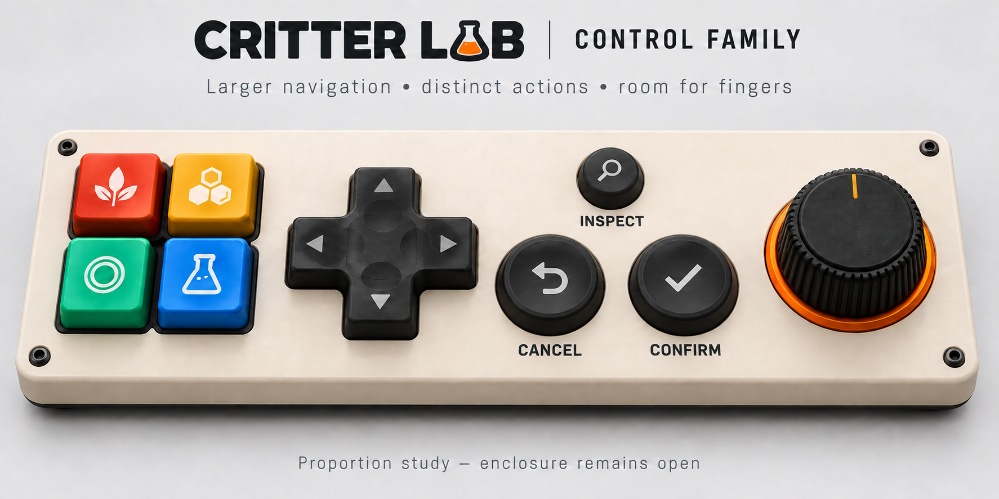</a> <em>Control family (control-family-v2.png). Source study.</em></td>
<td align="center" valign="top"><a href="workspace-row-v1.png">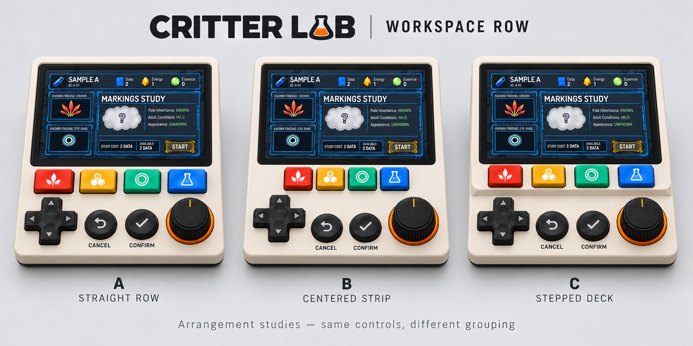</a> <em>Workspace row (workspace-row-v1.png). Source study.</em></td>
</tr>
</table>

[Whole-face geometry](ergonomics.md).

**What visual character could an enclosure have?**

<table>
<tr>
<td align="center" valign="top"><a href="enclosure-divergence-v1.png">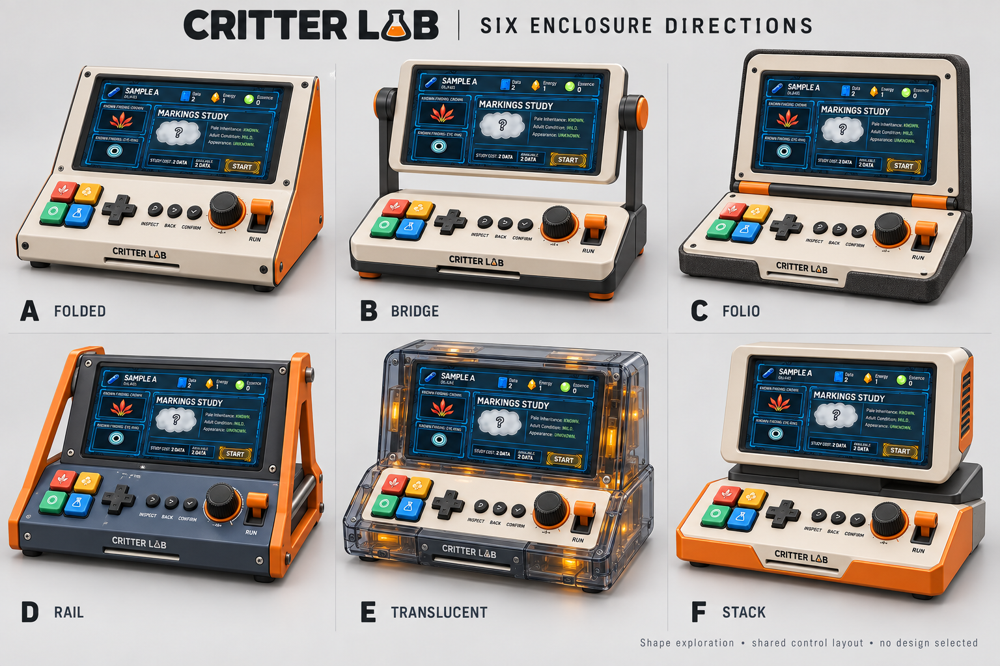</a> <em>Six directions (enclosure-divergence-v1.png). Source study.</em></td>
<td align="center" valign="top"> <em>Five directions (five-enclosure-directions.png). Source study.</em></td>
</tr>
</table>

**What did integrated-printer cases explore?**

<table>
<tr>
<td align="center" valign="top"><a href="single-body-allocation-v1.png">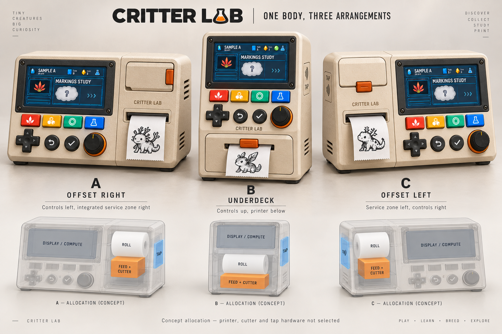</a> <em>Allocation (single-body-allocation-v1.png). Scoped source study; superseded product allocation.</em></td>
<td align="center" valign="top"><a href="c-vertical-keys-v1.png">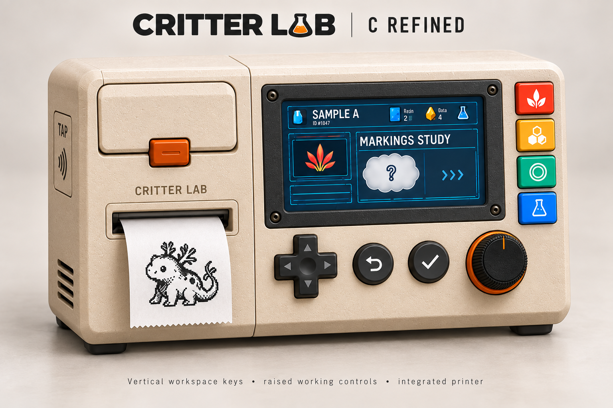</a> <em>Vertical keys (c-vertical-keys-v1.png). Scoped source study; superseded.</em></td>
<td align="center" valign="top"><a href="screen-first-v2.png">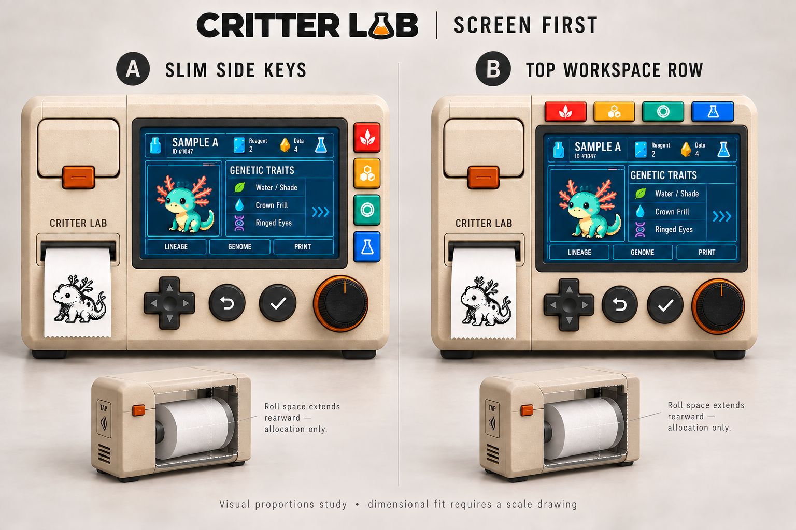</a> <em>Screen prominence (screen-first-v2.png). Scoped source study; superseded.</em></td>
</tr>
</table>

<table>
<tr>
<td align="center" valign="top"><a href="prototype-a-muted-pad.png">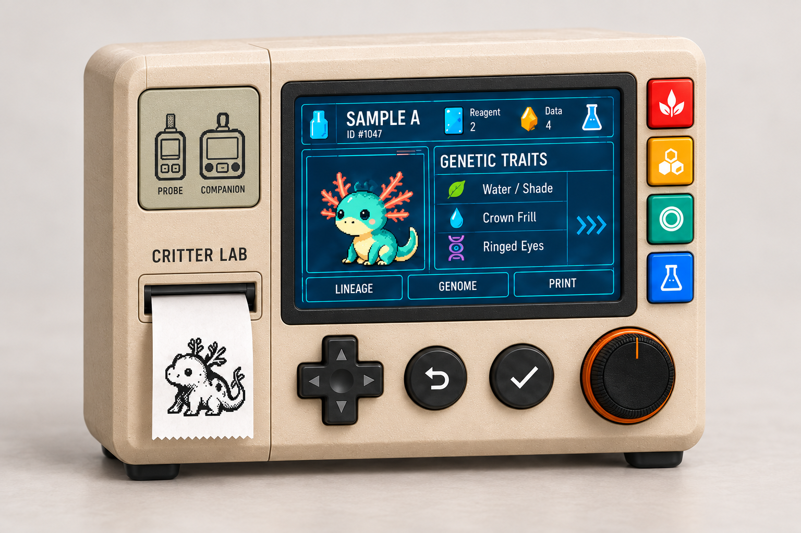</a> <em>Muted pad (prototype-a-muted-pad.png). Scoped source study; appearance exploration only.</em></td>
<td align="center" valign="top"><a href="prototype-a-reclined-grooves.png">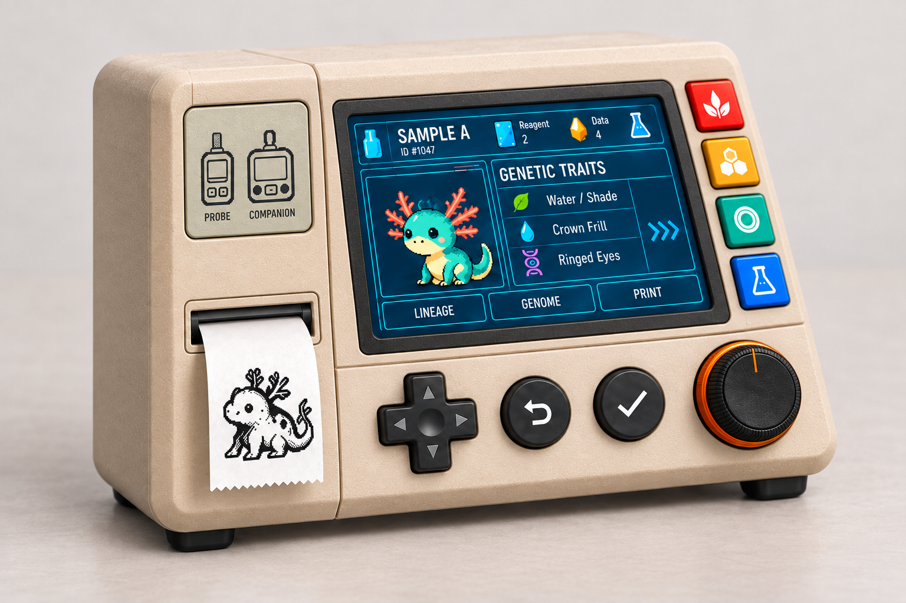</a> <em>Recline (prototype-a-reclined-grooves.png). Scoped source study; superseded.</em></td>
</tr>
</table>

**Which packaging image is unreliable?**

<table>
<tr>
<td align="center" valign="top"><a href="printer-tap-packaging.png">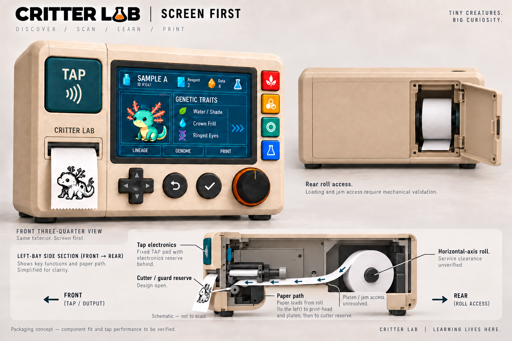</a> <em>Printer cutaway (printer-tap-packaging.png). Unreliable: no manufacturer-derived path, common dimensional model or demonstrated service geometry.</em></td>
</tr>
</table>

Integrated-printer cases, separate Probe, living-scene Caddy and previous control layouts are scoped source studies. The current handheld-plus-Caddy responsibilities supersede their product allocation. Preserve the images and exact inputs without copying their obsolete arrangements into current rules.

## From appearance to a credible model

Convergence needs a single editable model in millimetres, explicit proposed dimensions and material assignments. Front, side, rear, section and service views use the same coordinate system. Check component intersections, opening paths, hand approaches and supported play before a beauty render claims fit. Generated appearance studies can inform character; they cannot establish or modify mechanical geometry. Physical mock parts and eventual board measurements must answer handling, refresh, power, thermal, radio and printer questions.
