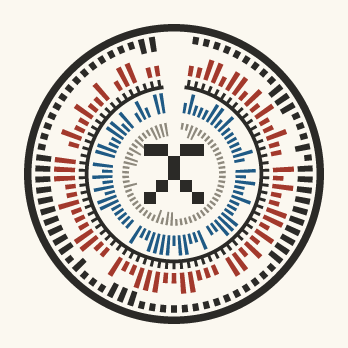
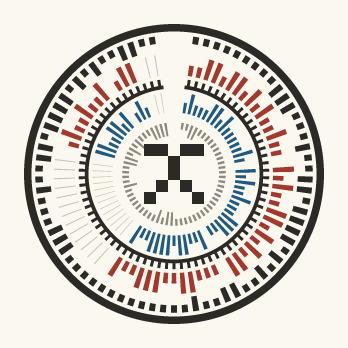
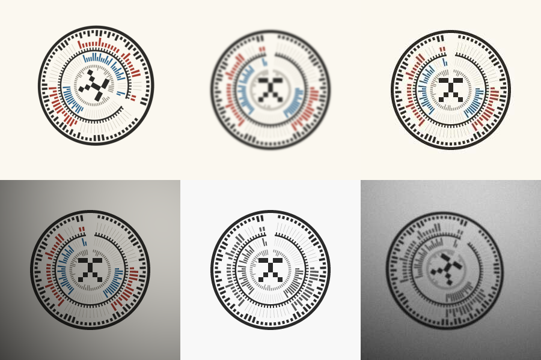
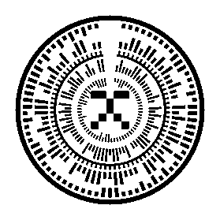
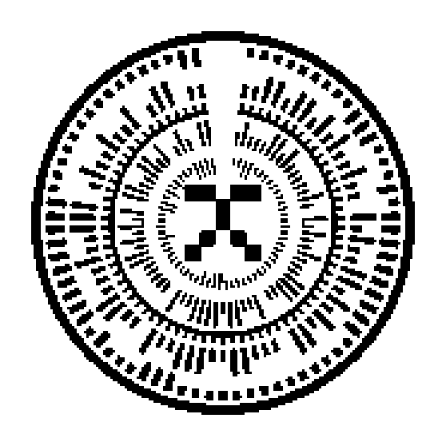
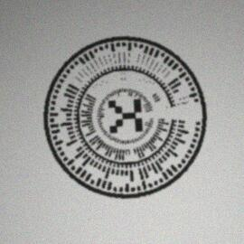
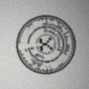
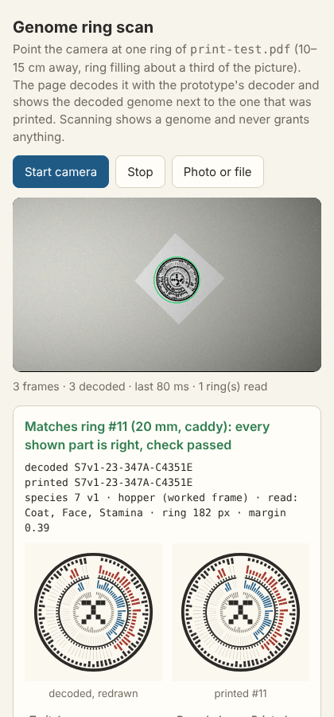

**Retired 2026-10-07.** The ring's circumference-bound capacity and its thin radial bars did not survive the first real phone scan; the genome code is now the [genome stamp](../genome-stamp/README.md). This prototype stays as the origin of the codec, the CRC-16, the distortion harness and the scan page.

# Genome ring: print and scan test

This prototype tests whether the genome ring in [research-loop.md §7](../../design/proposals/research-loop.md#7-the-genome-fingerprint-as-a-code-the-genome-ring) can be printed and scanned. It checks the payload and the reader before anyone refines the art. It is plain Node with no dependencies: an encoder (genome → SVG and PNG), a decoder (image → genome, with the check verified), a robustness test, an A4 print sheet and a phone scan page. The decoder is the same code in Node and in the browser.

|  |  |
| --- | --- |
| 1× Station size (300 px of the 1024×600 screen). All 7 chapters are read | The same mibi with Legs & tail and Temperament unread. Those sectors are hairlines, and their copies are not in the ring at all |

## The ring as built

The species frame is the worked hopper-like frame on the **real catalogue**: `INNATE_CATALOGUE` v6 in `v1/prototype/generator-workbench/innate-profile-package.mjs`, with 114 validated pairs and 6 drafts. `tools/extract-catalogue.mjs` takes a snapshot of it in `src/catalogue-data.mjs`, which pins it with digest `0cdfdf47…`. `src/frames.mjs` splits the frame as §3–4 require: 57 locked loci and 57 heritable loci in 7 chapters and 24 traits (Coat 11/5, Face 13/5, Shape 11/4, Legs & tail 9/3, Movement 8/3, Stamina 3/2, Temperament 2/2). The split reproduces §7's payload: **69 spokes per track, 62 grey marks and a 40-bit header**. These 57 parts carry 133 looks by allele count; §4 now uses 133 (its earlier 124 was an estimate). The chapter assignment is my reconstruction, because the sketch's generator is not in the repo.

- **Centre:** a 5×5 glyph derived from the species number.
- **Grey band:** the locked frame, one mark per bit (62). It is the same for every member, and the decoder does not need it.
- **Tracks:** the inner track (blue) holds copy 1 and the outer track (red) holds copy 2. Each heritable part has one spoke per bit, packed MSB-first as in the codec contract: two looks take 1 spoke, 3–4 looks take 2, belly colour (6 looks) takes 3 and colour (10 looks) takes 4. A long bar is 1 and a short bar is 0.
- **Sectors:** one per chapter, clockwise from the notch, with one empty slot between chapters.
- **Outer dashes:** a 40-bit header made of species 12 bits, version 4, read mask 8 and a CRC-16 (CCITT, poly 0x1021). The CRC covers the header and every bit the ring shows. The header repeats around the ring (1.9 copies on the worked frame) and is read by vote.
- **Reader marks** (now in §7 as "Reader marks"):
  - a solid **rim**, used as finder and outer reference;
  - a solid **timing circle** between the tracks, with **one tick per slot**, used for perspective and slot timing;
  - a **notch** of 3 empty slots at 12 o'clock;
  - at least 44 slots, so one full header fits. The worked frame uses 78.
- Every mark is read long-or-short against its own base, never against a fixed threshold. That makes the reading independent of ink, colour and lighting, and a 3-tap Viterbi absorbs blur.

The **Pip proof genome** (`examples/pip.json`, `Cc Rr Pp Mm Ee`: 5 spokes and 12 grey marks) is a second species frame. It decodes too ([`img/pip-300.png`](img/pip-300.png)).

## Results

`node tests/run.mjs` (100 random genomes per cell on the worked frame, and 40 per cell in the sweeps; about 3 minutes on 4 cores). Full tables are in [`tests/results.md`](tests/results.md).

| Condition (100 genomes each) | 300 px | 200 px | 120 px |
| --- | --- | --- | --- |
| Clean render | 100% | 100% | 100% |
| Rotation (any angle) | 100% | 100% | 100% |
| Perspective 15° (+ rotation) | 100% | 100% | 100% |
| Perspective 35°, seen close (rim radius ÷ distance 0.25) | 100% | 100% | 100% |
| Blur σ 1.5 px at 300 px (scaled with size: 1.0 px at 200, 0.6 px at 120) | 100% | 100% | 100% |
| Blur σ 1.5 px at every size (harsher than the target) | 100% | 100% | 25% |
| JPEG quality 60 (4:2:0) | 100% | 100% | 100% |
| Uneven lighting (100% → 35%, plus vignette) | 100% | 100% | 100% |
| Monochrome (all colour removed) | 100% | 100% | 100% |
| Rotation + perspective + blur | 100% | 100% | 100% |
| Rotation + JPEG + lighting + monochrome | 100% | 100% | 100% |
| **All together:** rotation, perspective 15°, blur, lighting, monochrome, noise and JPEG 60 | **100%** | **100%** | **100%** |
| Caddy print at 203 dpi, photographed: **20 mm / 30 mm** | | **100% / 100%** | |

The run made 5,360 decodes with **0 false accepts**: the check never passed on a wrong genome. A decode takes 58–80 ms in Node and about 70 ms per camera frame in Chromium.

*At 200 px, left to right then down: perspective 15°, blur σ 1.5 px, JPEG 60, uneven lighting, monochrome, and all distortions together. All of them decode.*

### The Caddy print case

`design/devices.md` names a **58 mm thermal printer** but gives no dot density. The test **assumes 203 dpi** (8 dots/mm, 384 dots across 48 mm), which is the usual density for 58 mm mechanisms.

The print pipeline:
1. The ring is rendered monochrome and bilevel at 203 dpi.
2. Thermal dot gain is added (blur 0.35 dot, then re-threshold).
3. Paper and ink tones are applied.
4. A phone photo is simulated: resampled to 9 px/mm (a 1080p stream at about 15 cm) or 6 px/mm (about 23 cm), tilted up to 10°, blurred (σ 0.8 px), lit unevenly (100 → 60%), given noise (σ 0.03) and saved as JPEG 75.

| 30 mm at 203 dpi (240 dots, 1:1) | 20 mm (160 dots, 1:1) | 20 mm, enlarged 3× to show the dots | Simulated phone photo of the 20 mm print |
| --- | --- | --- | --- |
|  |  |  |  |

### Limits found

| Smallest working size | Clean | All distortions |
| --- | --- | --- |
| Screen ring | **70 px** (100%; 58% at 60 px) | **90 px** (97.5%; 90% at 80 px, 80% at 70 px) |
| Caddy print at 203 dpi, photo at 9 px/mm | **14 mm** (95%; 112 dots) | 16 mm and up: 100% |
| Same, photo at 6 px/mm (farther, or a 720p stream) | **18 mm** (92.5%) | 20 mm: 100%; 16 mm: 80%; 14 mm: 22.5% |
| 20 mm print, by dot density | **125 dpi** (98 dots) and up: 100% | 100 dpi: 37.5% |

- **What breaks first is the inner track.** It sits at the smallest radius, so its spokes are the narrowest. At the limits, every failure was "check failed". In a traced sample:
  - at 14 mm and 6 px/mm, all 55 wrong spokes were on the inner track;
  - at 120 px with σ 1.5 px blur, all 52 were;
  - at 12 mm and 9 px/mm, where printer dots run out, the wrong spokes were 22 inner and 30 outer.
- **The header never failed first.** It is repeated, at the largest radius, and read by vote.
- **The timing fails last**, and only well beyond the targets: at blur σ ≥ 3.5 px at 200 px, and not at 45° of tilt, which reads 100%.
- JPEG down to quality 15, noise σ 25/255 and lighting down to 15% all decoded 100%.
- **What the tests do not model:** glare on glossy thermal paper, fading, curled paper, motion blur, and real phone autofocus. The phone sheet is the test for those.

## Try it on a phone

1. Print [`print-test.pdf`](print-test.pdf) on A4 at **100% / actual size** (a 300-dpi [`print-test.png`](print-test.png) is the same page). It holds 16 rings, each with its expected code under it:
   - colour, vector, at 40–12 mm;
   - the Caddy simulation (monochrome 203-dpi dots) at 30–12 mm;
   - the Pip ring.
2. Open [`tests/scan.html`](tests/scan.html) on the phone. It is a single page with no dependencies and the decoder built in (`node tools/build-scan.mjs` rebuilds it).
   - **Live camera** needs https or localhost. After merge, the Sandbox workflow (`.github/workflows/site.yml`) copies `prototypes/*` to `sandbox/genome-ring/tests/scan.html` on the published site.
   - **Photo or file** works from any address, including a copy of the file on the phone.
3. Hold the phone flat above one ring, 10–15 cm away, so the ring fills about half the frame. A green outline marks each ring decoded; amber marks a ring seen but not verified.
   - The page shows **only verified reads**. Until the check passes it says "no read yet" and what to try, and never shows a guessed species.
   - **Save this frame** downloads the frame the decoder saw, as a PNG, for a failing case to be sent back. The card shows the decoded code against the printed one, both rings redrawn, and a table per chapter of both copies of every part, decoded against printed.

Scanning shows a genome and never grants anything. The page decodes on the device, uploads nothing, and the CRC is an error check, not a signature. `tests/scan-check.mjs` is optional and needs Playwright: it drives this page in headless Chromium with a fake camera. Rings #1 (40 mm colour), #4 (20 mm colour) and #11 (20 mm Caddy) all matched.

**The owner's first scan of ring #1 (2026-10-07) failed** for two reasons:
- **The owner's sheet was the CRC-8 print** (its codes end in a 2-digit check, e.g. `S7v1-7F-17-15324D`), but the page was already on the 40-bit CRC-16 header. Those prints can never verify on this page and must be reprinted. The sheet now states its format, and the page says which codes it reads. The owner's photo, even as a screenshot of a screenshot, decodes with all 7 chapters and the check verified on the CRC-8 decoder that matches that sheet.
- **The page printed the unverified header guess** ("unknown species 23", "1031") in its status line. That is fixed.

`tests/phone-large.mjs` reproduces the owner's conditions on the current format: ring #1 at 640–1000 px in a phone frame, a warm cast, glare, defocus, barrel distortion, and 30–35° tilt seen close. It found and fixed two more faults:
- a glare spot could pass for the notch (the notch is now found by contrast against the rim, not by brightness);
- the fit could lock onto the wrong centre under steep, close tilt (the decoder now searches for the circle's projected centre inside the rim ellipse before refining).

Every variant now decodes.

## Recommendation for §7

**§7 meets the targets at 20 mm: 100% at both camera distances.** Items 1 and 2 have been adopted; the rest stay recommendations:

1. **Adopted: the reader's marks are in §7.** These are the rim, the timing circle with one tick per slot, the 3-slot notch, and the header repeated around the dash ring.
2. **Adopted: the check is now a CRC-16, and the header is 40 bits.** A fully read ring puts 162 bits under the check, which is beyond the 119 bits where the earlier CRC-8/0x2F still caught every 2-bit error. Measured: 35 of the 13,041 possible 2-wrong-spoke patterns passed the CRC-8 (0.27%). The CRC-16 catches every 1–3 wrong spokes at any length up to 32,751 bits. The rerun gave the same success rates, with 0 false accepts.
   - The CRC-16 also makes soft correction safe. This is not built yet. Near the limits, most failed reads had at most 2 wrong spokes, all among the 6 least confident: 15 of 24 at 14 mm and 6 px/mm, 11 of 23 at 12 mm and 9 px/mm. Trying the 22 flips of those spokes would lift those cells from about 20% to about 70% and 60%, at a false-accept risk of 22 in 65,536 per misread.
3. **Keep the bar width (55% of the slot) and the bar encoding** (long/short against the bar's own base).
   - Wider bars (70%) survive printer dots better: 12 mm at 9 px/mm goes from 23% to 100%.
   - They lose more to coarse camera sampling: 16 mm at 6 px/mm goes from 87% to 53% (30 genomes each).
   - Only change the width if rings must print below 16 mm.
4. **Fewer spokes per track only matters below 16 mm.** The inner track is the binding constraint, and its pitch scales with spokes per track: 69 now. The Pip ring (5 spokes) is far from any limit.
5. **The CRC does not answer the spoofing worry.** It catches misreads, not forgeries. Certified lineage still needs the cloud's signature, as §7 already says (**Open**). That keeps "scanning shows and never grants" true.

## Files

| Path | What |
| --- | --- |
| `encode.mjs` | `node encode.mjs examples/hopper.json --size 300 --out ring` → `ring.svg` and `ring.png`. Add `--mm 20 --dpi 203` for the monochrome print, or `--random <seed>` for a random genome. The output is deterministic, byte for byte |
| `decode.mjs` | `node decode.mjs photo.jpg [--all] [--expect genome.json]` → species, version, read and unread chapters, both copies per shown locus, the check, and ring position. Formats other than PNG go through ImageMagick if it is installed |
| `src/` | `frames` (species frames), `codec` (bit packing, header, CRC-16, slot plan), `geometry` (layout → marks), `render` (SVG and rasterizer), `decode` (browser-safe), `png` (Node) |
| `tests/run.mjs`, `cases.mjs`, `distort.mjs` | The robustness matrix, its conditions, and the distortions (homography camera, blur, lighting, mono, noise, JPEG through ImageMagick) |
| `tests/scan.html`, `scan-check.mjs`, `print-manifest.json` | The phone scan page, its headless check, and the sheet's expected genomes |
| `tests/phone-large.mjs` | The owner's failing case, recreated: large and close ring #1, warm light, glare, defocus, barrel distortion, steep tilt |
| `tools/` | Catalogue snapshot, print sheet (PDF writer with no dependencies, plus `pdftoppm` for the PNG), scan-page bundler, README images |
