# Genome stamp: the genome code, our own reader

This prototype builds option (b) of [genome-code.md](../../design/proposals/genome-code.md): the **stamp alone**. The owner decided on no QR, nothing QR-like, and nothing a generic scanner can read; the novelty is part of the game. The genome ring ([prototypes/genome-ring](../genome-ring/)) is retired.

It is plain Node with no dependencies:
- an encoder (genome → SVG and PNG; the same genome always gives the same bytes);
- a decoder (image → genome; it shows a read only after the check passes);
- a robustness harness;
- an A4 print sheet;
- an offline phone scan page.

The decoder is the same code in Node and in the browser.

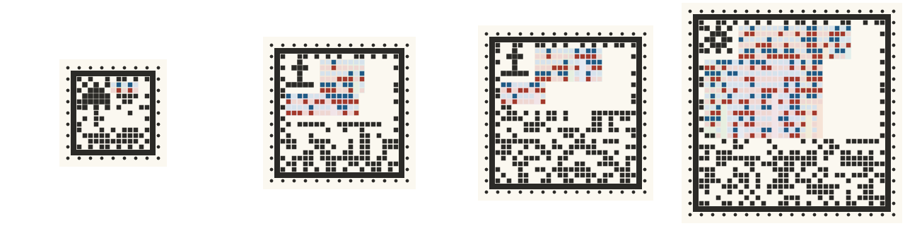
*Growth you can see, all at 8 px a cell: Loika (5 open loci) 17×17, Tuikis (38) 25×25, the same Tuikis carrying a postmark 29×29, and a future species with 150 open loci (three chapters unread) 37×37.*

| 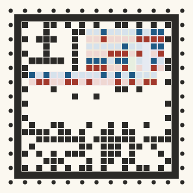 | 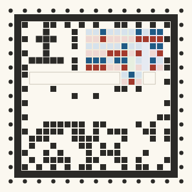 | 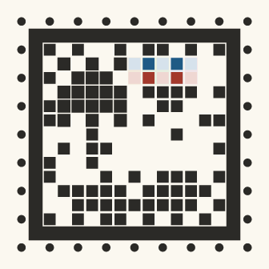 |
| --- | --- | --- |
| Tuikis at 1× Station size, 300 px | The same mibi with two chapters unread: their blocks are empty outlines and hold nothing | Loika, 17×17, at 300 px |

## The face

The face is a grid of square cells, N×N with N in a size series, chosen by payload. From the outside in:
- **Perforation (ring 0).** A dot on every other cell, like a stamp's edge. These are the timing marks: their period gives the grid size.
- **Frame (ring 1).** One solid square line. It is the finder: the reader fits its four edges, which corrects perspective. It is one closed frame, not QR's three corner squares.
- **Species border (ring 2).** Manchester cell pairs (one dark, one light) derived from the species' locked frame, the same for every member. It names the species and the orientation, and the **5×5 glyph** in the fixed top-left corner confirms both. The glyph gets a one-cell gutter from 21×21 up; at 17×17 it sits directly against the data.
- **Chapter blocks.** Rectangles of whole columns. Each heritable bit is a vertical **cell pair**: copy 1 (blue) above copy 2 (red), pale when 0. A frame may declare other copy counts per locus, and its runs are then that tall. Locus values are packed with ceil(log2 looks) bits against the catalogue, as in the codec contract. **Unread chapters are empty blocks**, never guesses.
- **Strip, at the foot.** It fills from the bottom row up: Reed–Solomon parity, then the header (with the postmark, when there is one) and CRC-16, then the read mask (one cell per chapter). The chapter blocks fill from the top down, so a stamp grows a size only when the two meet. Parity never mixes into the genome cells.

## Format

- **Header (47 bits):** format 4 bits, species 12, frame version 10, size 4, a **postmark flag** (1 bit) and CRC-16.
  - When the flag is set, the 64-bit postmark follows (111 bits in all). It is shown as "postmark present, unverified", and the stamp grows by the size step it needs: a Tuikis goes from 25×25 to 29×29.
  - When the flag is clear, nothing is reserved.
  - The reader tries both layouts; Reed–Solomon and the flag itself decide which one a stamp uses.
- **Read mask:** one bit per chapter, so its length comes from the frame and there is no 8-chapter cap.
- **CRC-16/CCITT end to end,** over the header, the read mask and every shown payload bit.
- **One Reed–Solomon codeword** over GF(256) (the same code family as QR, but not QR's layout) covers the header, CRC, mask and every data cell. About 30% of it is parity, which corrects about 15% of the bytes. Bytes run along the cells, so a local smudge costs few bytes.
- **Chase retry.** If Reed–Solomon fails, the reader flips up to 4 of the 12 least certain cells and tries again (cells under glare count as uncertain). Any result must still pass the CRC-16.
- **Verified only.** A read is shown only after RS correction and the CRC both pass. The RS decoder can mis-correct when overwhelmed, and the CRC catches that. A failed frame never shows a species: the page says "no read yet" and what to try.
- **Frame registry.** The species frames ship inside every reader (`src/frames-data.mjs`, built by `tools/extract-frames.mjs`) and are append-only, so an old print decodes for as long as its frame is carried. Since 2026-10-08 the registry is the workbench's (`prototypes/workbench/frames/*.json`, `mb-species-frame/2` on catalogue `mb-genome-framework@9`): the sixteen species S01 Loika to S16 Blikur, species number = the species' order. **Frame version 3** (2026-10-08) is current: the species glyphs were redrawn as the abstract marks (`art/species-marks`), and the glyph is part of the face, so a changed glyph is a new frame. The version 2 frames (the old glyphs, same loci and borders) stay in the registry beside it, so a print made at version 2 still decodes; the encoder defaults to the newest version (`byName(id)`; a genome names its version, and `byName(id, 2)` still writes the old face), and the decoder matches the glyph against every carried frame and takes the version from the header. The three legacy frames (species 11 to 13, version 1, on catalogue 6: the working ids `hopper`, `puffcap`, `glowtail`) stay too. `tools/extract-frames.mjs` only appends: it carries every frame already in the snapshot and stops if the workbench builds an existing species and version with different content. A copy is packed as its index among the catalogue's alleles; a continuous locus carries its alleles' values too, so a blended copy from the cross (a number) is stamped as its bin, the nearest named allele: scanning shows, never grants.

## Size series

N steps by 4. Each species lands on the smallest size its read mask and genome fit; a postmark adds 64 bits (the registry's frames, `node tools/size-table.mjs`):
- **Loika** (5 open loci): 17×17 (1.18 mm cells at 20 mm, 9.4 dots at 203 dpi); 25×25 with a postmark.
- **Hiljan, Peplos** (8 and 7 open loci): 21×21.
- **Untuva, Tuikis, Tepor, Pesko, Azkon, Rupar, Belatz, Igara, Kilpo, Oskol, Usvel, Lehten, Blikur** (11 to 40 open loci): 25×25 (0.80 mm, 6.4 dots); the Tuikis, Azkon, Belatz, Kilpo and Blikur go to 29×29 with a postmark.
- **150 open loci:** 37×37 (0.54 mm, 4.3 dots).

Chapters are whole-column blocks, so a frame can need a size more than its bit count suggests.

| Cells | Codeword bytes (parity; corrects) | Bits for read mask + genome: plain / postmarked | Cell at 20 mm | Dots per cell, 20 mm at 203 dpi | Px per cell at 300 px | Lands here |
| --- | --- | --- | --- | --- | --- | --- |
| 17×17 | 12 (4; 2) | 17 / – | 1.18 mm | 9.4 | 17.6 | Loika |
| 21×21 | 23 (8; 4) | 73 / 9 | 0.95 mm | 7.6 | 14.3 | Hiljan; Peplos |
| 25×25 | 40 (12; 6) | 177 / 113 | 0.80 mm | 6.4 | 12.0 | Loika + postmark; Hiljan + postmark; Peplos + postmark; Untuva, Tuikis, Tepor, Pesko, Azkon, Rupar, Belatz, Igara, Kilpo, Oskol, Usvel, Lehten, Blikur; Untuva, Tepor, Pesko, Rupar, Igara, Oskol, Usvel, Lehten + postmark |
| 29×29 | 61 (20; 10) | 281 / 217 | 0.69 mm | 5.5 | 10.3 | Tuikis, Azkon, Belatz, Kilpo, Blikur + postmark |
| 33×33 | 86 (26; 13) | 433 / 369 | 0.61 mm | 4.8 | 9.1 | 100 open loci; 100 open loci + postmark |
| 37×37 | 115 (36; 18) | 585 / 521 | 0.54 mm | 4.3 | 8.1 | 150 open loci; 150 open loci + postmark |
| 41×41 | 148 (46; 23) | 769 / 705 | 0.49 mm | 3.9 | 7.3 | – |
| 45×45 | 185 (56; 28) | 985 / 921 | 0.44 mm | 3.6 | 6.7 | – |
| 49×49 | 226 (68; 34) | 1217 / 1153 | 0.41 mm | 3.3 | 6.1 | – |

**Up to about 150 open loci stays readable at 20 mm on the Caddy**, at 100% at both 20 mm and 16 mm (see below).

## Results

Generated by `node tests/run.mjs --n 50 --sweep-n 30` (2026-10-08). 12220 decodes, **0 false accepts** (a verified read of a wrong genome). Species: Loika (5 open loci, 17×17); Tuikis (40 open loci, 25×25); Tuikis with a postmark (40 open loci, 29×29); Future, 150 open loci (150 open loci, 37×37).

### Screen, 50 individuals per cell (300 / 200 / 120 px)

| Condition | Loika 17 | Tuikis 25 | Tuikis + postmark 29 | 150 loci 37 |
| --- | --- | --- | --- | --- |
| Clean render | 100% / 100% / 100% | 100% / 100% / 100% | 100% / 100% / 100% | 100% / 100% / 100% |
| Rotation (any angle) | 100% / 100% / 100% | 100% / 100% / 100% | 100% / 100% / 100% | 100% / 100% / 100% |
| Perspective 15° | 100% / 100% / 100% | 100% / 100% / 100% | 100% / 100% / 100% | 100% / 100% / 100% |
| Perspective 35°, close (half-width ÷ distance 0.25) | 100% / 100% / 100% | 100% / 100% / 100% | 100% / 100% / 100% | 100% / 100% / 100% |
| Perspective 45°, close (0.25) | 100% / 100% / 98.0% | 100% / 100% / 100% | 100% / 100% / 100% | 100% / 100% / 100% |
| Blur σ 1.5 px at 300 px (scaled) | 100% / 100% / 100% | 100% / 100% / 100% | 100% / 100% / 100% | 100% / 100% / 100% |
| JPEG quality 60 | 100% / 100% / 100% | 100% / 100% / 100% | 100% / 100% / 100% | 100% / 100% / 100% |
| Uneven lighting (100% → 35%, vignette) | 100% / 100% / 100% | 100% / 100% / 100% | 100% / 100% / 100% | 100% / 100% / 100% |
| Monochrome | 100% / 100% / 100% | 100% / 100% / 100% | 100% / 100% / 100% | 100% / 100% / 100% |
| Glare spot | 100% / 100% / 100% | 100% / 100% / 100% | 100% / 100% / 100% | 100% / 100% / 100% |
| Warm indoor light | 100% / 100% / 100% | 100% / 100% / 100% | 100% / 100% / 100% | 100% / 100% / 100% |
| Inkjet fuzz on matte paper | 100% / 100% / 100% | 100% / 100% / 100% | 100% / 100% / 100% | 100% / 100% / 100% |
| All: rot + persp 15° + blur + light + mono + noise + JPEG 60 | 100% / 100% / 100% | 100% / 100% / 100% | 100% / 100% / 100% | 100% / 100% / 100% |
| Owner's scan: persp 35° close + warm + inkjet + glare + JPEG 60 | 100% / 98.0% / 100% | 100% / 100% / 98.0% | 100% / 100% / 100% | 100% / 100% / 100% |

Mean decode time in Node: Loika 17 55 ms, Tuikis 25 64 ms, Tuikis + postmark 29 71 ms, 150 loci 37 81 ms.

### Caddy print, 203 dpi, photographed (50 per cell; 9 px/mm / 6 px/mm)

| Print | Loika 17 | Tuikis 25 | Tuikis + postmark 29 | 150 loci 37 |
| --- | --- | --- | --- | --- |
| 30 mm | 100% / 100% | 100% / 100% | 100% / 100% | 100% / 100% |
| 20 mm | 100% / 100% | 100% / 100% | 100% / 100% | 100% / 100% |
| 16 mm | 100% / 100% | 100% / 100% | 100% / 100% | 100% / 100% |

### Parent/child relatedness from 20 mm prints (25 trios per species)

| | Loika 17 | Tuikis 25 | Tuikis + postmark 29 | 150 loci 37 |
| --- | --- | --- | --- | --- |
| Child holds one of the mother's and one of the father's copies at every locus, read from the three photos | 100% | 100% | 100% | 100% |

### Limits (30 per cell)

| Screen side | Loika 17: clean / all | Tuikis 25: clean / all | Tuikis + postmark 29: clean / all | 150 loci 37: clean / all |
| --- | --- | --- | --- | --- |
| 120 px | 100% / 100% | 100% / 100% | 100% / 100% | 100% / 100% |
| 100 px | 100% / 100% | 100% / 100% | 100% / 100% | 100% / 100% |
| 80 px | 100% / 100% | 100% / 100% | 100% / 100% | 100% / 100% |
| 64 px | 100% / 96.7% | 100% / 100% | 100% / 100% | 100% / 73.3% |

| Caddy print, 9 / 6 px/mm | Loika 17 | Tuikis 25 | Tuikis + postmark 29 | 150 loci 37 |
| --- | --- | --- | --- | --- |
| 16 mm | 100% / 100% | 100% / 100% | 100% / 100% | 100% / 100% |
| 14 mm | 100% / 100% | 100% / 100% | 100% / 100% | 100% / 0% |
| 12 mm | 100% / 80.0% | 100% / 100% | 100% / 100% | 100% / 0% |
| 10 mm | 100% / 96.7% | 100% / 100% | 100% / 56.7% | 3.3% / 0% |

| Beyond the targets, at 200 px | Loika 17 | Tuikis 25 | Tuikis + postmark 29 | 150 loci 37 |
| --- | --- | --- | --- | --- |
| Blur σ 2.5 px at 200 px | 100% | 100% | 100% | 50.0% |
| Blur σ 3 px at 200 px | 100% | 100% | 100% | 0% |
| Blur σ 4 px at 200 px | 100% | 16.7% | 0% | 0% |
| JPEG quality 25 | 100% | 100% | 100% | 100% |
| JPEG quality 15 | 100% | 100% | 100% | 100% |
| Perspective 55°, close | 93.3% | 93.3% | 83.3% | 83.3% |
| Perspective 65°, close | 90.0% | 86.7% | 90.0% | 60.0% |
| Noise σ 25/255 | 100% | 100% | 100% | 100% |
| Lighting 100% → 15% | 100% | 100% | 100% | 100% |

Failure modes:

- screen · S01 · owner · 200: no read: too many cells unreadable (1)
- screen · S01 · persp45 · 120: no read: frame not found (1)
- screen · S03 · owner · 120: no read: too many cells unreadable (1)
- stress · S01 · tilt55 · 200: no read: no stamp found (2)
- stress · S01 · tilt65 · 200: no read: no stamp found (3)
- stress · S03-pm · blur4 · 200: no read: too many cells unreadable (30)
- stress · S03-pm · tilt55 · 200: no read: no stamp found (4); no read: frame not found (1)
- stress · S03-pm · tilt65 · 200: no read: no stamp found (2); no read: too many cells unreadable (1)
- stress · S03 · blur4 · 200: no read: too many cells unreadable (25)
- stress · S03 · tilt55 · 200: no read: no stamp found (2)
- stress · S03 · tilt65 · 200: no read: no stamp found (3); no read: frame not found (1)
- stress · future150 · blur2.5 · 200: no read: too many cells unreadable (15)
- stress · future150 · blur3 · 200: no read: too many cells unreadable (30)
- stress · future150 · blur4 · 200: no read: grid not found (30)
- stress · future150 · tilt55 · 200: no read: no stamp found (5)
- stress · future150 · tilt65 · 200: no read: no stamp found (11); no read: frame not found (1)
- sweepD · S01 · all · 64: no read: no stamp found (1)
- sweepD · future150 · all · 64: no read: too many cells unreadable (8)
- sweepMM · S01 · 10 · 6: no read: no stamp found (1)
- sweepMM · S01 · 12 · 6: no read: no stamp found (6)
- sweepMM · S03-pm · 10 · 6: no read: too many cells unreadable (13)
- sweepMM · future150 · 10 · 6: no read: grid not found (30)
- sweepMM · future150 · 10 · 9: no read: too many cells unreadable (28); no read: grid not found (1)
- sweepMM · future150 · 12 · 6: no read: too many cells unreadable (22); no read: grid not found (8)
- sweepMM · future150 · 14 · 6: no read: too many cells unreadable (30)

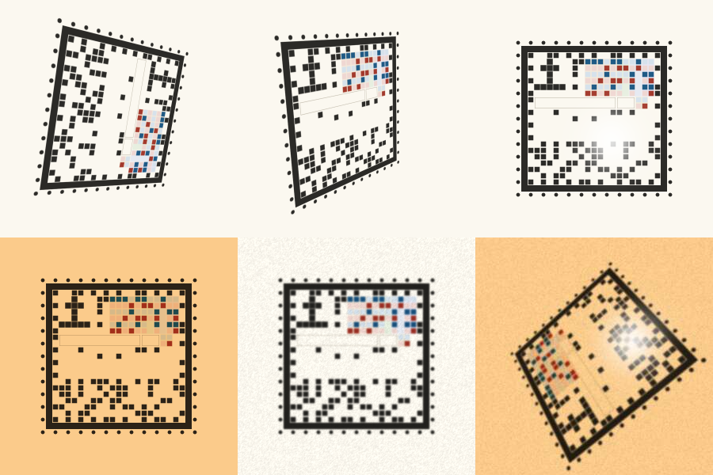
*Tuikis at 200 px, left to right then down: 35° and 45° close tilt, glare, warm light, inkjet fuzz, and the owner's scan conditions together (35° close, warm, inkjet, glare, JPEG 60). All decoded.*

### The Caddy print

`design/devices.md` names a 58 mm thermal printer but gives no dot density. The test **assumes 203 dpi** (8 dots/mm).

The print pipeline is the ring work's:
1. The stamp is printed bilevel, with thermal dot gain and paper tones.
2. A phone photo is simulated at 9 px/mm (a 1080p stream at about 15 cm) or 6 px/mm (about 23 cm): up to 10° of tilt, blur σ 0.8 px, light falling from 100% to 60%, noise σ 0.03, and JPEG 75.

| 20 mm Tuikis at 203 dpi (1:1 dots) | Enlarged 3× | 150 loci, 20 mm, enlarged 3× | Simulated phone photo, 20 mm |
| --- | --- | --- | --- |
| 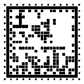 | 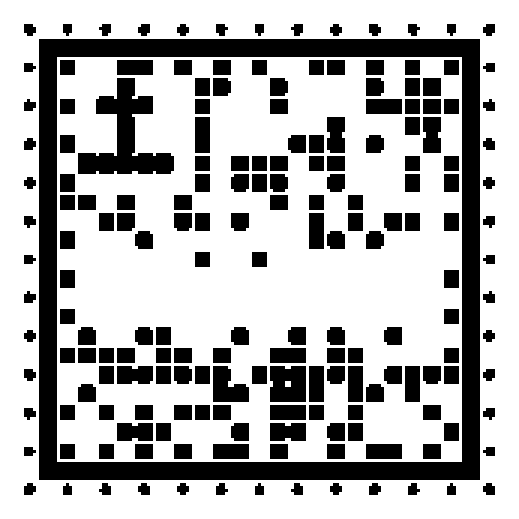 | 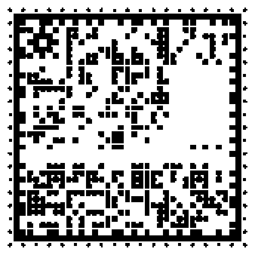 | 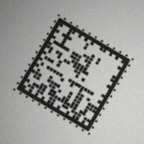 |

### Relatedness

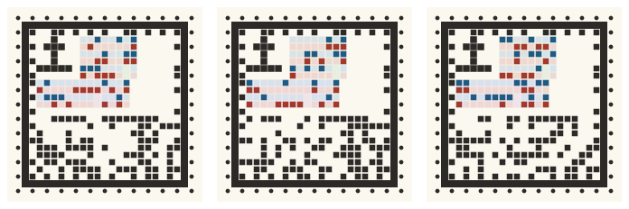
*A Tuikis mother, child and father. In every column pair, the child's blue cells repeat one of the mother's two copies and its red cells one of the father's. `tests/run.mjs` checks this from photos of the three 20 mm prints: 100% for all three species.*

### Limits found

- **The 17×17 Loika prints and tilts as well as the bigger stamps**: 100% at 16, 20 and 30 mm (both distances), and at 15°, 35° and 45° close tilt. Its cells are the biggest (9.4 dots at 20 mm), and it reads at 10 mm (100% at 9 px/mm, 97% at 6 px/mm).
- **Its weak spot is heavy combined damage on screen.** It corrects only 2 bytes. The owner's-scan row (35° close, warm, inkjet, glare and JPEG 60) reads 100 / 98 / 100% at 300 / 200 / 120 px, where 25×25 and up read 98–100%. With a shallower retry (3 of 10 cells) it read 86–96%.
- **Screen sizes.** All stamps read clean at 64 px. With every distortion, the 17, 25 and 29 stamps read 97–100% at 64 px; the 37×37 stamp reads 73% there and needs about 80 px.
- **Caddy at 203 dpi.** At 9 px/mm, everything up to 29×29 reads at 10–12 mm, and the 150-loci stamp at 12 mm. At 6 px/mm the 17×17 Loika drops to 80% at 12 mm (97% at 10 mm). At 6 px/mm the 150-loci stamp needs **16 mm** (14 mm: 0%), and the postmarked Tuikis starts to fail at 10 mm (57%).
- **What breaks first.** Cells, which Reed–Solomon can no longer correct: "too many cells unreadable". The grid count fails only after that, at blur σ 4 px or 10 mm prints of 37×37. Past 45° of close tilt, finding the frame is what fails (55°: 83–93%; 65°: 60–90%).
- **Not modelled.** Real autofocus, motion blur, curled paper and printer banding. The phone sheet is the test for those.

## Try it on a phone

1. Print [`print-test.pdf`](print-test.pdf) on A4 at **100% / actual size** ([`print-test.png`](print-test.png) is the same page at 300 dpi). It is titled **"stamp, 4-digit check"** and holds 16 stamps, each with its expected code, species, cell count and cell size under it:
   - a growth row at 20 mm: Loika 17×17, Tuikis 25×25, postmarked Tuikis 29×29, 150 loci 37×37;
   - other colour sizes, and a Tuikis with two chapters unread;
   - the Caddy's 203-dpi dots at 20 and 16 mm;
   - a mother, child and father.
2. Open [`tests/scan.html`](tests/scan.html). It is a single page with no dependencies; the decoder and the species registry are built in, and it works offline.
   - **Live camera** needs https or localhost. The Sandbox workflow publishes `prototypes/*` at `sandbox/genome-stamp/tests/scan.html`.
   - **Photo or file** works from any address.
3. **Hold the phone flat above one stamp so it fills about half the frame.** A green outline marks a verified stamp; amber marks a stamp seen but not verified.
   - The card shows the decoded code against the printed one, both stamps redrawn, and a table per chapter of every copy, decoded against printed.
   - Until a read verifies, the page says "no read yet" and never shows a guess.
   - **Save this frame** downloads what the decoder saw, as a PNG.

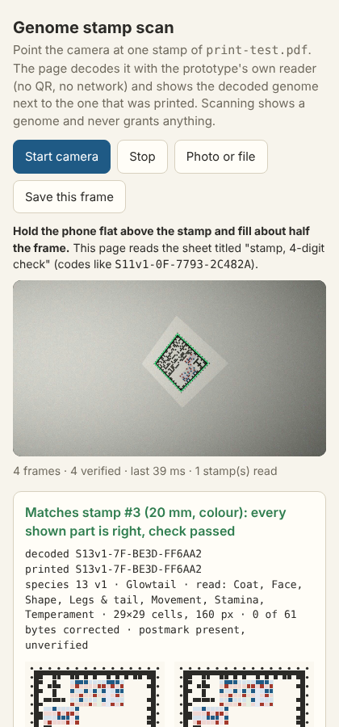

`tests/scan-check.mjs` (optional, needs Playwright) drives the page in headless Chromium with a fake camera. Stamps #1 (the 17×17 Loika, 20 mm) and #3 (the postmarked Tuikis, 29×29, 20 mm), both at 25° of tilt, matched at 39–58 ms a frame. The owner's photo of the old ring sheet gives "no read yet", as it should.

## For the art director

The face has four fixed elements, and their **cells** must not move. Everything around and between the cells is yours, for the botanical-tome Library and for the Caddy's paper:
- the **perforation**: a dot on every other cell of the outer ring;
- the **frame**: one solid square line, the only heavy line;
- the **species border**: the same dark/light cell pairs for every member;
- the **glyph**: 5×5 cells, top-left. From 21×21 up it has a one-cell gutter; at 17×17 it touches the data.
- the **block layout**: chapter blocks fill from the top as column rectangles of copy pairs, and the strip fills from the foot (parity, then header, then the read mask). The size (17, 21, 25 …) changes as a species grows or gains a postmark, but the four elements keep their places, so one frame design scales from the Loika to 150 loci.

What you can style:
- the paper tone, and the quiet margin beyond the perforation (keep at least one cell clear);
- the dots as round seed-heads, pinholes or petals (anything solid, centred and about 0.6 cell across);
- the shape of cell ink inside its square (rounded, stippled or inked, while it fills about 80% of the square);
- the chapter tints behind blocks and the hairline outline of unread blocks (colour only; on the Caddy they vanish);
- the copy colours, as long as they print dark in monochrome.

What breaks reading:
- anything drawn inside the frame;
- a colour that turns light when greyed;
- overlapping the frame line;
- any change to which cells are dark.

On the Caddy everything is plain black dots: the decoration lives on screen.

## Files

| Path | What |
| --- | --- |
| `encode.mjs` | Frame ids are the registry's (`S01` the Loika, `S02` the Untuva, `S03` the Tuikis); the legacy working words (`hopper`, `puffcap`, `glowtail`) still name the version 1 frames, and the examples carry them. `node encode.mjs examples/glowtail.json --size 300 --out stamp` → SVG and PNG. `--mm 20 --dpi 203` gives the monochrome print; `--random 7 --species future150` a random individual |
| `decode.mjs` | `node decode.mjs photo.jpg [--all] [--expect genome.json]` → species, frame version, read and unread chapters, every copy, the check, the bytes corrected. Formats other than PNG go through ImageMagick if installed |
| `src/codec.mjs`, `rs.mjs` | Layout per size, header, CRC-16, the cells ↔ codeword mapping; Reed–Solomon (BM, Chien, Forney) |
| `src/stamp.mjs`, `decode.mjs` | Marks → SVG/raster; the reader (frame lines, perforation timing, glyph/border orientation, local-contrast cells) |
| `src/frames.mjs`, `frames-data.mjs` | The frame registry: the sixteen species from the workbench registry (frame version 3, and 2 kept for old prints), the three legacy frames (version 1), plus synthetic 100 and 150 loci. `examples/glowtail-postmark.json` carries a postmark |
| `tests/run.mjs`, `cases.mjs`, `distort.mjs` | The harness. The distortions and print pipeline are carried over from the ring |
| `tests/scan.html`, `scan-check.mjs`, `print-manifest.json` | The scan page, its headless check, and the sheet's expected genomes |
| `tools/` | Frame snapshot, size table, print sheet, scan-page bundler, README images |

**Carried over from the ring:** the frame-pinned packing, CRC-16, the widened header idea, the frame registry, the distortion harness, the print pipeline, the PDF writer, the bundler and the scan page's shell. **Not carried over:** the ring's geometry, its long/short marks and its reader marks.
