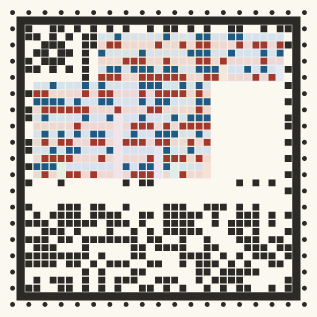

# Genome stamp: the genome code, our own reader

This prototype builds option (b) of [genome-code.md](../../design/proposals/genome-code.md): the **stamp alone**. The owner decided on no QR, nothing QR-like, and nothing a generic scanner can read; the novelty is part of the game. The genome ring ([prototypes/genome-ring](../genome-ring/)) is retired.

It is plain Node with no dependencies:
- an encoder (genome → SVG and PNG; the same genome always gives the same bytes);
- a decoder (image → genome; it shows a read only after the check passes);
- a robustness harness;
- an A4 print sheet;
- an offline phone scan page.

The decoder is the same code in Node and in the browser.

|  |  |
| --- | --- |
| Glowtail (38 open loci, 25×25 cells) at 1× Station size, 300 px | The same mibi with two chapters unread: their blocks are empty outlines and hold nothing |
|  |  |
| Hopper (5 open loci, 25×25) | A synthetic future species with 150 open loci (37×37), three chapters unread |

## The face

The face is a grid of square cells, N×N with N in a size series, chosen by payload. From the outside in:
- **Perforation (ring 0).** A dot on every other cell, like a stamp's edge. These are the timing marks: their period gives the grid size.
- **Frame (ring 1).** One solid square line. It is the finder: the reader fits its four edges, which corrects perspective. It is one closed frame, not QR's three corner squares.
- **Species border (ring 2).** Manchester cell pairs (one dark, one light) derived from the species' locked frame, the same for every member. It names the species and the orientation, and the **5×5 glyph** in the fixed top-left corner confirms both.
- **Read mask.** One cell per chapter, beside the glyph.
- **Chapter blocks.** Rectangles of whole columns. Each heritable bit is a vertical **cell pair**: copy 1 (blue) above copy 2 (red), pale when 0. A frame may declare other copy counts per locus, and its runs are then that tall. Locus values are packed with ceil(log2 looks) bits against the catalogue, as in the codec contract. **Unread chapters are empty blocks**, never guesses.
- **Strip, at the foot.** Its own rows hold the header, the CRC-16 and the Reed–Solomon parity. Parity never mixes into the genome cells.

## Format

- **Header (110 bits):** format 4 bits, species 12, frame version 10, size 4, **64 reserved bits for a future signed postmark** (zero now; a non-zero value is shown as "postmark present, unverified"), and CRC-16. The read mask has one bit per chapter, so its length comes from the frame and there is no 8-chapter cap.
- **CRC-16/CCITT end to end,** over the header, the read mask and every shown payload bit.
- **One Reed–Solomon codeword** over GF(256) (the same code family as QR, but not QR's layout) covers the header, CRC, mask and every data cell. About 30% of it is parity, which corrects about 15% of the bytes. Bytes run along the cells, so a local smudge costs few bytes.
- **Verified only.** A read is shown only after RS correction and the CRC both pass. The RS decoder can mis-correct when overwhelmed, and the CRC catches that. A failed frame never shows a species: the page says "no read yet" and what to try.
- **Frame registry.** The species frames (`design/proposals/species-frames/*.json`, snapshot in `src/frames-data.mjs`) ship inside every reader and are append-only, so an old print decodes for as long as its frame is carried.

## Size series

N steps by 4 (17, 21, 25, 29, 33, 37, 41, 45, 49). The 110-bit header with its 64-bit postmark leaves 17 and 21 too small, so **25 is the smallest stamp**. Capacity depends on the chapter count and the allele mix: the glowtail's 38 open loci fit 25×25 with 7 chapters, while the 8-chapter synthetic species below stop at 35.

| Cells | Codeword bytes (parity, corrects) | Open loci it holds (glowtail allele mix, all read) | Cell at 20 mm | Dots per cell at 203 dpi, 20 mm | Px per cell at 300 px |
| --- | --- | --- | --- | --- | --- |
| 17×17 | too small for the 110-bit header with the 64-bit postmark | – | 1.18 mm | 9.4 | 17.6 |
| 21×21 | too small for the 110-bit header with the 64-bit postmark | – | 0.95 mm | 7.6 | 14.3 |
| 25×25 | 40 (12, 6 bytes) | up to 35 | 0.80 mm | 6.4 | 12.0 |
| 29×29 | 61 (20, 10 bytes) | up to 62 | 0.69 mm | 5.5 | 10.3 |
| 33×33 | 86 (26, 13 bytes) | up to 122 | 0.61 mm | 4.8 | 9.1 |
| 37×37 | 115 (36, 18 bytes) | up to 185 | 0.54 mm | 4.3 | 8.1 |
| 41×41 | 148 (46, 23 bytes) | up to 229 | 0.49 mm | 3.9 | 7.3 |
| 45×45 | 185 (56, 28 bytes) | up to 323 | 0.44 mm | 3.6 | 6.7 |
| 49×49 | 226 (68, 34 bytes) | up to 405 | 0.41 mm | 3.3 | 6.1 |

**Up to about 150 open loci stays readable at 20 mm on the Caddy.** The 150-loci species uses 37×37 cells of 0.54 mm (4.3 printer dots), and it read 100% at 20 mm and 16 mm (see below).

## Results

Generated by `node tests/run.mjs --n 50 --sweep-n 30` (2026-10-07). 9165 decodes, **0 false accepts** (a verified read of a wrong genome). Species: Hopper (5 open loci, 25×25); Glowtail (38 open loci, 25×25); Future, 150 open loci (150 open loci, 37×37).
### Screen, 50 individuals per cell (300 / 200 / 120 px)

| Condition | Hopper | Glowtail | 150 loci |
| --- | --- | --- | --- |
| Clean render | 100% / 100% / 100% | 100% / 100% / 100% | 100% / 100% / 100% |
| Rotation (any angle) | 100% / 100% / 100% | 100% / 100% / 100% | 100% / 100% / 100% |
| Perspective 15° | 100% / 100% / 100% | 100% / 100% / 100% | 100% / 100% / 100% |
| Perspective 35°, close (half-width ÷ distance 0.25) | 100% / 100% / 100% | 100% / 100% / 100% | 100% / 100% / 100% |
| Perspective 45°, close (0.25) | 100% / 100% / 98.0% | 100% / 100% / 100% | 100% / 100% / 100% |
| Blur σ 1.5 px at 300 px (scaled) | 100% / 100% / 100% | 100% / 100% / 100% | 100% / 100% / 100% |
| JPEG quality 60 | 100% / 100% / 100% | 100% / 100% / 100% | 100% / 100% / 100% |
| Uneven lighting (100% → 35%, vignette) | 100% / 100% / 100% | 100% / 100% / 100% | 100% / 100% / 100% |
| Monochrome | 100% / 100% / 100% | 100% / 100% / 100% | 100% / 100% / 100% |
| Glare spot | 100% / 100% / 100% | 100% / 100% / 100% | 100% / 100% / 100% |
| Warm indoor light | 100% / 100% / 100% | 100% / 100% / 100% | 100% / 100% / 100% |
| Inkjet fuzz on matte paper | 100% / 100% / 100% | 100% / 100% / 100% | 100% / 100% / 100% |
| All: rot + persp 15° + blur + light + mono + noise + JPEG 60 | 100% / 100% / 100% | 100% / 100% / 100% | 100% / 100% / 100% |
| Owner's scan: persp 35° close + warm + inkjet + glare + JPEG 60 | 100% / 100% / 98.0% | 98.0% / 100% / 98.0% | 100% / 100% / 100% |

Mean decode time in Node: Hopper 35 ms, Glowtail 32 ms, 150 loci 42 ms.

### Caddy print, 203 dpi, photographed (50 per cell; 9 px/mm / 6 px/mm)

| Print | Hopper | Glowtail | 150 loci |
| --- | --- | --- | --- |
| 30 mm | 100% / 100% | 100% / 100% | 100% / 100% |
| 20 mm | 100% / 100% | 100% / 100% | 100% / 100% |
| 16 mm | 100% / 100% | 100% / 100% | 100% / 100% |

### Parent/child relatedness from 20 mm prints (25 trios per species)

| | Hopper | Glowtail | 150 loci |
| --- | --- | --- | --- |
| Child holds one of the mother's and one of the father's copies at every locus, read from the three photos | 100% | 100% | 100% |

### Limits (30 per cell)

| Screen side | Hopper: clean / all | Glowtail: clean / all | 150 loci: clean / all |
| --- | --- | --- | --- |
| 120 px | 100% / 100% | 100% / 100% | 100% / 100% |
| 100 px | 100% / 100% | 100% / 100% | 100% / 100% |
| 80 px | 100% / 100% | 100% / 100% | 100% / 100% |
| 64 px | 100% / 100% | 100% / 100% | 100% / 30.0% |

| Caddy print, 9 / 6 px/mm | Hopper | Glowtail | 150 loci |
| --- | --- | --- | --- |
| 16 mm | 100% / 100% | 100% / 100% | 100% / 100% |
| 14 mm | 100% / 100% | 100% / 100% | 100% / 0% |
| 12 mm | 100% / 100% | 100% / 100% | 100% / 0% |
| 10 mm | 100% / 100% | 100% / 66.7% | 0% / 0% |

| Beyond the targets, at 200 px | Hopper | Glowtail | 150 loci |
| --- | --- | --- | --- |
| Blur σ 2.5 px at 200 px | 100% | 100% | 6.7% |
| Blur σ 3 px at 200 px | 100% | 100% | 0% |
| Blur σ 4 px at 200 px | 0% | 0% | 0% |
| JPEG quality 25 | 100% | 100% | 100% |
| JPEG quality 15 | 100% | 100% | 100% |
| Perspective 55°, close | 86.7% | 96.7% | 83.3% |
| Perspective 65°, close | 90.0% | 80.0% | 60.0% |
| Noise σ 25/255 | 100% | 100% | 100% |
| Lighting 100% → 15% | 100% | 100% | 100% |

*Glowtail at 200 px, left to right then down: 35° and 45° close tilt, glare, warm light, inkjet fuzz, and the owner's scan conditions together (35° close, warm, inkjet, glare, JPEG 60). All decoded.*

### The Caddy print

`design/devices.md` names a 58 mm thermal printer but gives no dot density. The test **assumes 203 dpi** (8 dots/mm).

The print pipeline is the ring work's:
1. The stamp is printed bilevel, with thermal dot gain and paper tones.
2. A phone photo is simulated at 9 px/mm (a 1080p stream at about 15 cm) or 6 px/mm (about 23 cm): up to 10° of tilt, blur σ 0.8 px, light falling from 100% to 60%, noise σ 0.03, and JPEG 75.

| 20 mm glowtail at 203 dpi (1:1 dots) | Enlarged 3× | 150 loci, 20 mm, enlarged 3× | Simulated phone photo, 20 mm |
| --- | --- | --- | --- |
|  |  |  |  |

### Relatedness

*A glowtail mother, child and father. In every column pair, the child's blue cells repeat one of the mother's two copies and its red cells one of the father's. `tests/run.mjs` checks this from photos of the three 20 mm prints: 100% for all three species.*

### Limits found

- **Screen.** The 25×25 stamps read at 64 px under every distortion (2.6 px a cell). The 37×37 stamp reads at 64 px clean, but only 30% with every distortion, so it needs about 80 px.
- **Caddy at 203 dpi, photographed at 9 px/mm.** 25×25 stamps read down to 10 mm (100%); the 150-loci stamp reads at 12 mm and fails at 10. At 6 px/mm the 150-loci stamp needs **16 mm** (100%; 14 mm: 0%), and the glowtail starts to fail at 10 mm (67%).
- **What breaks first.** Cells, which Reed–Solomon can no longer correct: "too many cells unreadable". The grid count fails only after that, at blur σ 4 px or 10 mm prints of 37×37.
- **Steep, close tilt.** Past 45°, finding the frame is what fails: 55° reads 83–97% and 65° reads 60–90%.
- **Not modelled.** Real autofocus, motion blur, curled paper and printer banding. The phone sheet is the test for those.

## Try it on a phone

1. Print [`print-test.pdf`](print-test.pdf) on A4 at **100% / actual size** ([`print-test.png`](print-test.png) is the same page at 300 dpi). It is titled **"stamp, 4-digit check"** and holds 16 stamps, each with its expected code, species, cell count and cell size under it:
   - colour, vector: glowtail at 30/20/16 mm, a hopper, and the 150-loci species at 30/20/16 mm;
   - a glowtail with two chapters unread;
   - the Caddy's 203-dpi dots at 30 to 16 mm;
   - a mother, child and father.
2. Open [`tests/scan.html`](tests/scan.html). It is a single page with no dependencies; the decoder and the species registry are built in, and it works offline.
   - **Live camera** needs https or localhost. The Sandbox workflow publishes `prototypes/*` at `sandbox/genome-stamp/tests/scan.html`.
   - **Photo or file** works from any address.
3. **Hold the phone flat above one stamp so it fills about half the frame.** A green outline marks a verified stamp; amber marks a stamp seen but not verified.
   - The card shows the decoded code against the printed one, both stamps redrawn, and a table per chapter of every copy, decoded against printed.
   - Until a read verifies, the page says "no read yet" and never shows a guess.
   - **Save this frame** downloads what the decoder saw, as a PNG.

`tests/scan-check.mjs` (optional, needs Playwright) drives the page in headless Chromium with a fake camera. Stamps #2 (20 mm colour), #11 (16 mm Caddy) and #14 (20 mm colour, at 25° of tilt) all matched, at 35–54 ms a frame. The owner's photo of the old ring sheet gives "no read yet", as it should.

## For the art director

The face has four fixed elements, and their **cells** must not move. Everything around and between the cells is yours, for the botanical-tome Library and for the Caddy's paper:
- the **perforation**: a dot on every other cell of the outer ring;
- the **frame**: one solid square line, the only heavy line;
- the **species border**: the same dark/light cell pairs for every member;
- the **glyph**: 5×5 cells, top-left;
- the **block layout**: the mask column, chapter blocks as column rectangles of copy pairs, and the strip at the foot.

What you can style:
- the paper tone, and the quiet margin beyond the perforation (keep at least one cell clear);
- the dots as round seed-heads, pinholes or petals (anything solid, centred and about 0.6 cell across);
- the shape of cell ink inside its square (rounded, stippled or inked, while it fills about 80% of the square);
- the chapter tints behind blocks and the hairline outline of unread blocks (colour only; on the Caddy they vanish);
- the copy colours, as long as they print dark in monochrome.

What breaks reading:
- anything drawn inside the frame;
- a colour that turns light when greyed;
- overlapping the frame line;
- any change to which cells are dark.

On the Caddy everything is plain black dots: the decoration lives on screen.

## Files

| Path | What |
| --- | --- |
| `encode.mjs` | `node encode.mjs examples/glowtail.json --size 300 --out stamp` → SVG and PNG. `--mm 20 --dpi 203` gives the monochrome print; `--random 7 --species future150` a random individual |
| `decode.mjs` | `node decode.mjs photo.jpg [--all] [--expect genome.json]` → species, frame version, read and unread chapters, every copy, the check, the bytes corrected. Formats other than PNG go through ImageMagick if installed |
| `src/codec.mjs`, `rs.mjs` | Layout per size, header, CRC-16, the cells ↔ codeword mapping; Reed–Solomon (BM, Chien, Forney) |
| `src/stamp.mjs`, `decode.mjs` | Marks → SVG/raster; the reader (frame lines, perforation timing, glyph/border orientation, local-contrast cells) |
| `src/frames.mjs`, `frames-data.mjs` | The frame registry: hopper, puffcap and glowtail from `species-frames`, plus synthetic 100 and 150 loci |
| `tests/run.mjs`, `cases.mjs`, `distort.mjs` | The harness. The distortions and print pipeline are carried over from the ring |
| `tests/scan.html`, `scan-check.mjs`, `print-manifest.json` | The scan page, its headless check, and the sheet's expected genomes |
| `tools/` | Frame snapshot, size table, print sheet, scan-page bundler, README images |

**Carried over from the ring:** the frame-pinned packing, CRC-16, the widened header idea, the frame registry, the distortion harness, the print pipeline, the PDF writer, the bundler and the scan page's shell. **Not carried over:** the ring's geometry, its long/short marks and its reader marks.
