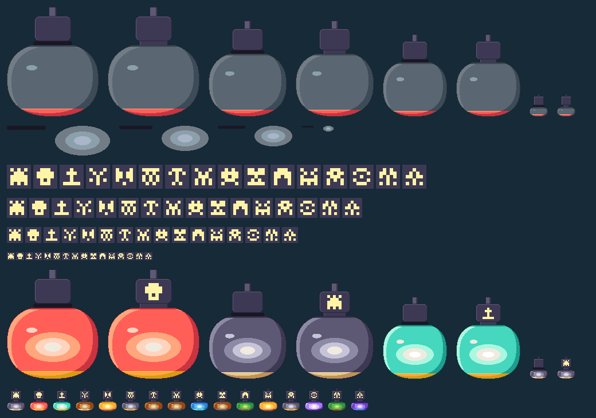
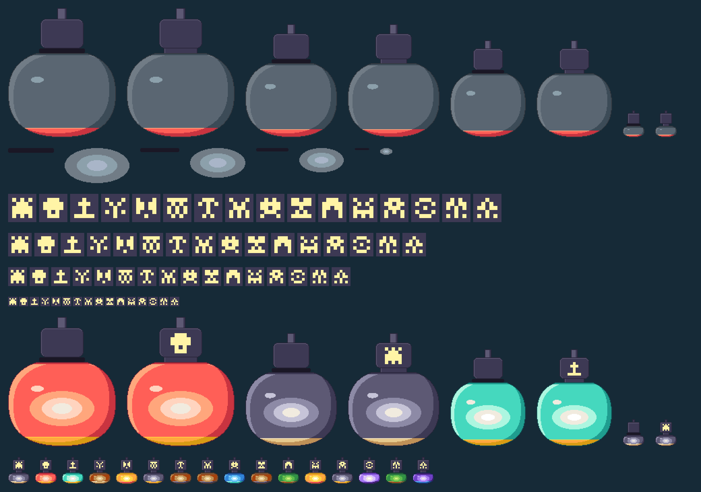
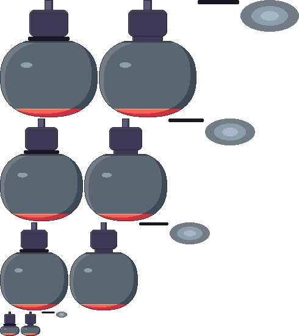
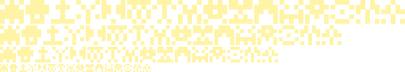

# Pod placeholders

Hand-drawn placeholder pods for the Station's Pods screen and the pod rack's wells: three size classes (160×192, 136×168, 112×144) and the well size (32×40), each with a sealed and an identified state, the species glyphs, the seal band and a still glow stand-in. Plainly placeholders: simple calm volumes, no face, no decoration, no pattern. Every pixel is on the Station's 62-colour palette ([`station-settled.json`](../../../palettes/station-settled.json)), drawn at 1×, with 1 px ramp outlines (never black), clean bands, no anti-aliasing and no Bayer.

**Status: candidate; art director to sign.**

| Image | Caption | Status |
| --- | --- | --- |
|  | contact-1x.png: every piece at 1× on the deep ground. Row 1: the sealed and identified bodies of each class in the base ramps. Row 2: the seal bands and glows. Rows 3 to 6: the 16 glyphs per class on the cap's slate. Row 7: one composed pod per class, sealed then identified (S02 large, S01 medium, S03 small, S01 well). Row 8: the 16 species as identified wells. | candidate; art director to sign |
|  | contact-2x.png: the same sheet at 2×, nearest neighbour. | candidate; art director to sign |
|  | pod-bodies.png: the sheet, 490×550, one row per class: sealed, identified, band, glow. Base ramps, not yet remapped to a species. | candidate; art director to sign |
|  | pod-glyphs.png: the sheet, 510×91, one row per class (large, medium, small, well), the 16 glyphs in species order, cream. | candidate; art director to sign |

## Files

| File | What it is |
| --- | --- |
| `source/pod-<class>.txt` | **The drawings**, hand-editable: pieces `body` (identified pod without band or glyph), `band`, `glow`, as rows of characters (legend in `build.py`). |
| `source/glyphs.txt` | The 16 glyphs, 5×5 cells, as the frames hold them. |
| `source/layout.json` | Anchors, base ramps, pigment ramps, species table. |
| `source/lay_out.py` | Started the drawings (forms laid out by rule, then hand-corrected in the .txt). Not part of the build; running it again overwrites hand edits. |
| `build.py` | `python3 -I build.py`: packs the sheets, atlas and contact sheets. Standard library only. |
| `check.py` | `python3 -I check.py`: counts off-palette pixels and checks the rules below. Current result: 0 off-palette pixels, 0 isolated pixels, no black, all geometry rules met. |
| `pod-bodies.png`, `pod-glyphs.png`, `pod-atlas.json` | Indexed sheets (PLTE = the 62 colours in file order; index 62 transparent, tRNS) and the atlas. |

## Shape, colour and state

- One drawing per size class and state. The frames' `proportion` is null for all 16 species, so there is no tall or squat variant; `shellPattern` is not drawn (a plain shell, as directed).
- Light from the top left in three bands (light, base, shade), a small highlight, a 1 px outline in the ramp's darkest step. The shell is a squared ellipse with a flat foot. A foot ring carries the frame's second colour.
- Colour by remap: the sheet is drawn in two base ramps (A: bar to frostS, shell; B: wine to white, foot ring) and each species maps its 12 base indices to its own pigments' ramps (`species.<id>.remap`, indices to indices, one pass). The 10 pigments are matched to the nearest palette ramps by eye (`pigments` in the atlas).
- Cap, stem, neck and band are fixed and never remapped: stem stone, cap slate with a lit stone rim, band ink. Glyph cream on the cap's slate, whole cells, clear of the stem, rim and neck.
- Sealed = identified + band, exactly (checked). The identified state has the neck open and the glyph; it has no band.
- Glyph cell: 6 (large), 5 (medium), 4 (small), 2 (well) px.

## Compositing a pod

Atlas ids: `pod.<class>.sealed|identified|band|glow` and `glyph.<class>.<species id>`, with class one of `large`, `medium`, `small`, `well`.

1. Box bottom-centred on (344, 312): x = 344 − w/2, y = 312 − h (large 264,120; medium 276,144; small 288,168). The stem's top row is the box's top, the shell's foot its last row (y 312).
2. Body (sealed or identified), remapped to the species.
3. Glow at box + `glowAt`, remapped (large 32,110; medium 27,96; small 23,83; well 7,27).
4. Identified only: the glyph at box + `glyphAt`, unmapped (large 65,24; medium 55,21; small 46,19; well 11,7).
5. To break a seal: draw the identified body, the band at box + `bandAt`, then remove the band.

Nothing is scaled. The manifest entries in the atlas (`manifest`) register the two sheets with policy `stationChrome`, status `placeholder`; `assets.mjs` has no sub-rectangle, so a builder crops sprites by the atlas rects.
