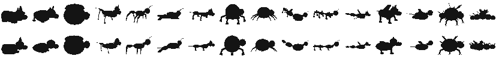

# Workbench: stage 0 of the art pipeline

The internal authoring tool of [art-pipeline.md](../../design/proposals/art-pipeline.md) §2, stage 0: the genome framework the generator reads directly, the deterministic structural sketch, and the page where a designer locks a species. It ships no art. Plain Node 22 and ES modules in the browser, no dependencies.

## Milestone 1: the framework

`framework/` is the new home of the catalogue and the resolver.

| File | What it is |
| --- | --- |
| `catalogue6-data.mjs` | Snapshot of v1's catalogue6 (114 validated pairs, six drafts) with its foundation digest, generated by `tools/snapshot-v1-catalogue.mjs` |
| `catalogue.mjs` | Catalogue 7: catalogue6 plus 29 new records, each tagged trunk or clan branch, with its owner and consumer. The taxonomy's **6 switches · 15 loci** (antennae ×3, sheen, flap markings, translucent flaps, leaves ×3, a leaf covering, light feeding, root foot ×2, foot skirt ×2, wing cases ×3, petals ×3) and the three gaps the frames list first (emission ×3 for Fanalia, a top cap sheet with its colour and spots for Bonetia, a belly field and crest leaf count for Trebola) |
| `plans.mjs` | The plan key of `taxonomy/plans.json` read into plan facts: the seven body rigs, the limb sets, **limb stations per region**, link count, posture and ground contact, neck or fused head, the state machine's states |
| `guards.mjs` | Owner guards ported from v1's resolver (`consumerGuard`, `roleGuard`) and the catalogue's `applicability`; decide what a plan carries and what an individual draws |
| `resolve.mjs` | A frame and a genome become values and facts: the pan-genome resolver (absent parts have no locus; an open part switch that is off leaves its parts asleep) |
| `rig.mjs` | The parametric body: ring solids, ellipsoids, tube chains, thin sheets, the v1 meshes with limbs rooted per region, a mass hierarchy, a ground pose and vertical-axis radial plans |
| `validate.mjs` | Every body against the compositional contract: facet roots, attachment witnesses inside owner and part, bounds. Reported, never repaired |
| `species.mjs` | Species first: the frame method and the generative taxonomy; individuals, crosses, shaping, the type specimen, whole-genome checks |
| `roster.mjs` | The 16 clans with their signatures and the 16 species; zacatín, copolí and ocotín carry the authored frames of frames.py |
| `build-frames.mjs` | Writes the frame registry `frames/` (schema `mb-species-frame/2`): 200 random individuals per species must build |
| `census.mjs` | The silhouette census: 200 individuals per plan, 48 px silhouettes, the distance table below |

**Run the checks**

```sh
cd prototypes/workbench
npm test                               # node --test tests/*.test.mjs
node framework/build-frames.mjs --check   # the registry is current (200 individuals per species)
node framework/census.mjs                 # the census gate; writes framework/census.json and census.md
```

**Absent, not switched off.** A species' genome carries the trunk loci whose owner its plan has, plus its clan's branch. The zacatín carries 48 pairs (46 trunk, 2 branch) and 72 of the catalogue's loci are absent for it; the ocotín carries 62. Plan switches are frame facts, never carried per individual.

**What the catalogue's structure could not express without a change.** Two things in the brief needed a framework change rather than a workaround, and both are made here, not worked around: radial plans are symmetric about the **up** axis (a dome with its face in front, rays round it, a cap or petals on top), where v1 rotated radial frames round the length axis; and the type specimen takes the middle of each numeric pool, where frames.py took the first allele. Everything else listed in the brief fitted the catalogue as records with owners and consumers.

### The silhouette census

Built from the registry on 2026-10-07, 200 random individuals per species. "Own-plan nearest" is the share of a plan's individuals whose nearest type specimen (48 px, three-quarter or side) is their own plan's; a late species with many open shape traits spreads more, by design.

See [framework/census.md](framework/census.md) for the current table; the gate is every pair of type specimens at a shape distance of at least 0.22, and every individual building.



Milestones 2 to 4 (the sketch renderer, the page, the full README) follow.
