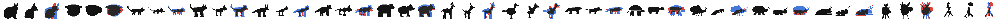

# Workbench: stage 0 of the art pipeline

## Stage 0 report

Stage 0 of [art-pipeline.md](../../design/proposals/art-pipeline.md) §2 is closed: a genome framework the generator reads directly, a deterministic structural sketch of every species, and the checks that say a species reads as its kind. This page is the report; the sections below are the detail.

**What the rig does.** `framework/rig.mjs` builds a parametric 3D body from a resolved individual: a plan (the key of `taxonomy/plans.json` plus the per-species extras join, wave, fins, float, stand, flapPairs, flapRest) picks one of seven rigs, a limb set with its stations per region, a posture and a ground contact; the catalogue's loci set every ratio (girth, head, muzzle, ears, legs, tail, flaps, shell, cases, leaves, covering). Bodies are capsule, ellipsoid and ring-solid volumes with sheets and sweeps, every part rooted on its owner's actual facets with a witness inside both, validated against the compositional contract and reported, never repaired. The volume conventions (girth 1.35, head 1.15, legs 1.6, paws 1.35, fur and feathers as silhouette modifiers, regions sharing the size class's length, a neck that rises with head lift, standing fans) are the rig's, versioned with it; the proportions of each species are in its genome (`proportions.mjs`: an artist's measures of the animal it resembles, turned into rig ratios and then into locus copies).

**How a frame becomes a specimen.** A species frame (`frames/species-S??.json`, `framework/species.mjs`) is built species first from the roster (`roster.mjs`: 16 clans with a plan, a signature and its defining parts; 16 species with a size, a tier, a seed, open traits by tier or by hand): the plan's switches say which trunk loci the body can carry, the clan adds its branch, everything else is absent; the signature and the species' measures lock their loci (a locked locus may hold a mixed pair), the open traits get pools and the type specimen's typical copies; two probes mark sleeping parts; 200 random individuals must build or the seed moves. The type specimen is the frame's default genome; any genome is resolved against its frame (`resolve.mjs`) into values the rig reads, built, validated, and rendered by the deterministic rasterizer (`raster.mjs`) at the 48 px tile, the Companion and the Station sizes, same genome same bytes, with a manifest in the cache format (`sketch/`). The page (`index.html`) edits a frame at the level a designer thinks in and re-renders at once.

**The census gates** (`census.mjs`, run on the registry: 3,200 random individuals, all building). Two gates on the 48 px silhouette. The plan gate: every pair of plans' type specimens at a shape distance of at least 0.22 (1 − IoU in the same box; closest S02 and S07 at 0.35), so no plan collapses into another's family. The kind check: each species' side silhouette against the hand-drawn target of what it resembles (`frames/targets/`), the whole body's IoU as the coarse gate and, as the gate that decides, the clan's defining parts measured on the silhouette split by part against the target's tagged parts; a species passes when its parts score beats every wrong kind's target by 0.05, one pixel of one part on a 48 px head. All sixteen pass; cat, fox and raccoon each win their own.

**Left for stage 1** (written when the plates were the plan; the owner has since made expression continuous and generated per individual in the cloud from these renders as control images, and the art pipeline proposal is being rewritten; see "the control-image spec" below for what a generation service receives). **Decided 2026-10-08, a second time:** the sketch, finished to the style guide, is the **standard look** and the game's art for every mibi, so the craft stage 1 leaves open (materials, the face, the pose) is a real art investment in this renderer, not a stopgap; the cloud generation from these control images is a **prize** a mibi earns by research, and the service trial continues to learn what that prize costs ([art-pipeline](../../design/proposals/art-pipeline.md) §1). The table below's "generation moves to archetypes, per the pipeline" is *superseded* twice over. The sketch stops at form and slots: smooth volumes, flat pigment fields, index and marking passes, no craft. Stage 1 takes a species' type specimen and reference set (`sketch/cli.mjs --set N`) and makes the plates the masters draw from: the turnaround at Station and Companion scale with the slot map as the colour key and the marking masks as fields, the 48 px tile as the test every plate must still pass. Three things the rig cannot say are stage 1's to decide: the materials (fur, feathers, scales, the leaf mantle, sheen and the charged body are slot facts and silhouette modifiers here, not surfaces), the face (eyes are fixed inks, the mask a field; expression is a drawing), and the pose (every body stands in its reference pose; the state machine's states exist, its transitions do not). Also open: markings, mask and rings are fields the kind check does not weigh, so a plate's pattern is judged by eye; the behaviour loci are carried and weighed nowhere; and the targets are one person's thumbnails, so a target can be wrong as easily as a body.

The internal authoring tool of [art-pipeline.md](../../design/proposals/art-pipeline.md) §2, stage 0: the genome framework the generator reads directly, the deterministic structural sketch, and the page where a designer locks a species and sees whether its expressions read. It ships no art. Plain Node 22 and ES modules in the browser, no dependencies; served at `/sandbox/workbench/` by the site workflow.


*The page: the frame on the left (plan, clan, chapters and traits), the sketch at Station and Companion scale in the middle, rolled individuals and their children below.*

## What is on the page


- **Frame.** Pick one of the 16 registry frames (the V1 roster of [taxonomy.md](../../design/proposals/taxonomy.md) §3; the codes S01–S16 and C01–C16 are the ids, and the approved names of [species-names.md](../../design/proposals/species-names.md) show beside them, S04 Hiljan of clan C04 Lathreta) or generate a new species by rule from a clan, a tier and a seed. The plan (segments, layout, symmetry, limbs, pairs, flaps, covering; neck, body wave, fins, afloat) and the clan signature (anchor and second pigment) are selects; the counts (carried, open, sleeping, sealed, absent, stamp bits) update at once.
- **Chapters and traits.** Coat, Face, Shape, Legs & tail, Movement, Stamina, Character, and a species chapter (Glow, Charge). Every trait shows its state (open, sleeping, sealed), nature, shapeable or breeding-only and its looks. Lock a trait, seal a chapter behind a find, open a locked part as a new trait, add a part the clan never had, narrow a pool allele by allele. The loci are one press away and never the entry point.
- **The sketch re-renders at once:** three-quarter at Station scale (300×310), front, side and top at Companion scale (280×300 at ½), the 48 px tile at 3×; passes shaded, slots, index, silhouette and one per marking field.
- **Individuals.** Roll N random individuals of the frame; shift-click two as parents and cross them; every individual is validated as a whole genome against its frame and as a body against the compositional contract, and a rejected one is marked, never repaired.


- **Compare expressions.** Same frame, one trait changed, N individuals: one column per look, the 48 px tile beside the Station view. A verdict per trait ("reads at 48 px", "reads only on the Station", "invisible: make it a doing") is written into the frame file with a note and a date; "invisible" also makes the trait breeding-only and records the reason as its override.
- **Check frame** builds 200 random individuals. **Export frame** downloads the species JSON; **Export sketches** and **Reference set** download a zip in the cache format. Edits persist in the browser's local storage until discarded.
- Keyboard and mouse: arrows move between traits, L locks, O shows loci, R rolls, C crosses, X compares, 1–3 record a verdict, [ ] step through individuals, E exports the frame.


## Salvaged from v1 and rebuilt

The owner's verdict on the v1 workbench: a good idea, badly implemented; keep the 3D models; the locus editing was poor; everything collapsed into slugs or six-legged things; it needed a tighter link between the generation and the genome framework. This is what was kept and what was replaced.

| Salvaged from `v1/prototype/generator-workbench/` | Where it lives now |
| --- | --- |
| Catalogue6: the 114 validated pairs, six drafts, allele values, pair maps, applicability, the foundation digest | `framework/catalogue6-data.mjs`, snapshotted with provenance by `tools/snapshot-v1-catalogue.mjs`; every v1 record keeps its id, operator, alleles and record version |
| The resolver's operators (copy-mean, dominant and recessive enable, pair maps keyed by the sorted pair, partition maps) | `framework/catalogue.mjs` `resolveCopies` |
| The resolver's guards (`consumerGuard`, `roleGuard`) and frames.py's applicability table | `framework/guards.mjs`, ported with the one deliberate change below |
| The meshes of the compositional contract: superellipse ring solids with the ovoid, barrel and tapered weights, 6×12 ellipsoids, eight-sided tapered segments, thin sheets, the ear outline, the tail sweep, the terminal forms, the convex-envelope root test | `framework/geometry.mjs`, `framework/rig.mjs` |
| The fixed eye inks, the light from the top left, the pigment split at u = 0.5 on a two-pigment slot | `framework/rig.mjs`, `framework/raster.mjs` |
| The frame method (frames.py: plan and part switches, pools, sleeping parts from the two probes, locked copies homozygous, the 200-individual check) and the generative taxonomy (taxonomy.py: clan signature, tier, seed, rule 6) | `framework/species.mjs`, `framework/roster.mjs` |
| The marking field's logical placement (bands, patches, count from extent) | `framework/raster.mjs` `markingAt`, per face |
| The PNG writer of the genome-stamp prototype | `framework/png.mjs` |
| The evidence habits: replay by digest, hashed manifests, byte-identical regeneration | `sketch/cli.mjs --verify`, `tests/sketch.test.mjs`, the manifests |

| Rebuilt | Why, and how |
| --- | --- |
| **Limb rooting.** v1 rooted every chain, flap and the head on `region-root`; later regions were legless children | `plans.mjs` gives every plan limb stations per region (fore legs on the front region, hind on the back, one pair per region on six legs, wings on the thorax, rays round a hub); `rig.mjs` roots each limb on its own region's facets |
| **Founder sampling.** v1 drew 114 loci independently and kept the first of up to 1,024 draws that built; a third were legless, half of the legged ones six-legged | A body is built from a frame: the plan picks the rig and limb sets, the clan fixes its parts, the species fixes the rest by seed and opens traits by tier; individuals vary only at the open loci. Nothing is drawn to be rejected |
| **Guards that rejected.** Unsupported parts rejected the draw | A plan carries what its owners allow and nothing else is drawn into a narrower survivor set; a body that cannot be built is reported with its reason (`validate.mjs`) and never repaired |
| **Equal beads.** Equal lengths and symmetric bulges | A mass hierarchy (`development.regional-growth`, an old record with its first consumer) and the posterior taper scale the regions; girth, a chest, a neck (narrow join, `structure.join-neck-ratio`) or a fused head; a ground pose so every view is framed the same (see The volume rig) |
| **Radial plans.** v1 rotated radial frames round the length axis | Radial plans are symmetric about the up axis: a dome with its face in front, rays or feelers round it, a cap on top, fan arms in the horizontal plane. A framework change, stated in the contract notes of `rig.mjs` |
| **The pan-genome.** v1 carried all 114 pairs in every creature, most inactive | A species carries the trunk loci whose owner its plan has, plus its clan's branch; everything else is absent, not switched off (taxonomy §2, decided). S01 carries 48 pairs, S09 61; plan switches are frame facts |
| **The editor.** An eleven-layer tree of 114 pairs, copy by copy, with a refresh step | Frame → chapter → trait, loci underneath on demand; every change re-renders at once |
| **The per-creature render button.** v1 sent each creature to an image model | Gone. The sketch is the form authority stage 2 consumes; generation moves to archetypes, per the pipeline |
| **The type specimen.** frames.py took the first allele of every pool | Numeric loci at the middle of their pool, so the archetype is the species' middle, not one end |

Everything in the brief fitted the catalogue as records with owners and consumers except the two framework changes above (vertical-axis radial plans, the mid-pool specimen); both are made, not worked around.

## The framework (`framework/`)

| File | What it is |
| --- | --- |
| `catalogue6-data.mjs` | Snapshot of v1's catalogue6 with its foundation digest, generated by `tools/snapshot-v1-catalogue.mjs` |
| `catalogue.mjs` | Catalogue 8: catalogue6 plus 47 new records and nine added alleles, each tagged trunk or clan branch, with its owner and consumer: two ear proportions no record carried (ear set, ear width; the proportions milestone below) and the revised taxonomy's **11 switches · 25 loci + 5 alleles** (mammal look: fur reach, face mask and shape, tail rings and count, ear tilt; horns with curl and branching and a hoof foot; a beak, feathers, a feather crest and a one-pair allele; a shell with dome and plates; antennae, wing cases, flap markings and translucent flaps; a foot skirt and sheen; leaves, a leaf covering, light feeding and a root foot; a charged body with charge, phase and pull, the first fantastic-physiology loci; a webbed foot; a huge size), emission moved to the trunk, and the three gaps the frames list first (the tail-tip bulb for C03, a top cap sheet with its colour and spots for C02, a belly field and crest leaf count for C01). Six old records get their first consumer (regional growth, attachment position, neck ratio, fin span, fin steering, surface texture) and the transparency and uptake drafts close through flap translucency and light feeding |
| `plans.mjs` | The plan key of `taxonomy/plans.json` read into plan facts: the seven body rigs, the limb sets, limb stations per region, link count, posture and ground contact, neck or fused head, the state machine's states; the per-species extras (join, wave, fins, float, stand) |
| `guards.mjs` | Owner guards ported from v1's resolver and the catalogue's `applicability`; decide what a plan carries and what an individual draws |
| `resolve.mjs` | A frame and a genome become values and facts: the pan-genome resolver |
| `geometry.mjs`, `rig.mjs` | The finite solids and the parametric body |
| `validate.mjs` | Every body against the compositional contract: facet roots, attachment witnesses inside owner and part, bounds. Reported, never repaired |
| `raster.mjs` | The deterministic rasterizer: orthographic views, a depth buffer, one light, the passes, the 48 px mask and the shape distance, the silhouette split by part class for the kind check |
| `species.mjs` | Species first: frames, individuals, crosses, shaping, the type specimen, whole-genome checks, a frame back into an editable spec. A locked locus may hold a mixed pair (a proportion between two alleles); an open locus may name the species' `typical` copies, which the type specimen takes |
| `proportions.mjs` | Proportions by kind: the measures an artist takes on the animal each species resembles, the rig ratios they ask for, and the copy pairs that carry them (`KINDS`, `rigTargets`, `nearestPair`, `proportionPairs`) |
| `envelope.mjs` | The cute envelope: eight rules that hold for every species and every open locus value, each with its reason, applied as clamps and derived ratios in the rig (E1–E7) and as pool bounds in the frames (E8), so no genome expression leaves the shape a pet reads as. Tested on the worst cases with `grow/extremes.mjs` |
| `plain.mjs` | The plain placeholder (plain-renderer.md, technique C, reduced): the rasterizer's gbuffer pass finished by a deterministic post-process (ramps, outline from the index, contact shades, markings as patches, a grain, a cast shadow; the 48 ramps with Bayer on the Companion and the token). The offline look while a Grow painting is pending; no face, no materials. The sheet under `plain/` |
| `../grow/` | The Grow painting service: a genome in, the Station-size painted set out (portrait and side, Gemini over the control passes), checked for structure (every part present where the part map puts it, the paint within a tolerance band of the drawn body), proportion (each large part's extent against the drawn one, within 15 %) and slots, with one named retry; the painter owns the volume, so the silhouette is reported, not gated; the Companion and the token derived, files laid out by genome hash, every call logged with its cost. `grow/controls.mjs` (Node: the controls with the `key` pass and flat translucency, the plain placeholder; the shaded control is sent blurred so its facets cannot be copied) and `grow/service.py` (Python: the calls, the checks, the derived sizes, the sheets) |
| `targets.mjs` | The hand-drawn 48 px targets under `frames/targets/` (side view, facing right, a few primitives on a 100×100 canvas, each tagged with its part), rasterized and fitted like a body's silhouette, whole and per part; the part measures, the parts score and the kind check's verdicts |
| `roster.mjs` | The 16 clans with their signatures and the 16 species, with the approved names beside the codes (`SPECIES_NAMES`, `CLAN_NAMES`; the frame carries `species.name` and `taxonomy.clanName`); S01–S03 carry the authored frames of frames.py |
| `build-frames.mjs` | Writes the frame registry `frames/` (schema `mb-species-frame/2`: taxonomy header, plan facts, signature, chapters and traits with verdicts, the carried loci by kind with typical copies where named, the absent loci with reasons, pools, locked copies, counts, pod, the type specimen's brief and bounds, viability) |
| `census.mjs` | The silhouette census and the kind check below |

## The structural sketch (`sketch/`) and the control-image spec

`sketch.mjs` renders one body to the views and passes a generation service consumes; `cli.mjs` writes them under `out/sketch/<species>/<genome digest>/` with a manifest, or a whole reference set under `out/reference/<species>/`. The owner's decision (2026-10-08) makes these renders the **control images** of a per-individual generation in the cloud: expression is continuous, no fixed set of looks, no device rendering; each mibi's art is generated while it incubates, from these images. This is what a generation service receives per individual, and what it may rely on.

### What a service receives per individual

One directory, named by the genome digest (`<species>-<8 hex>`, the type specimen's is `type-specimen`), holding:

- `genome.json`: the genome (schema `mb-genome/2`, species, `frameVersion`, two copies at every carried locus, origin: type specimen, random with its seed, or cross with its parents' digests).
- `manifest.json`: `id` (the digest), `level` (`species` for a type specimen, `individual` otherwise), `species`, `clan`, `plan`, `rig`, the genome and `genomeDigest` (short, 32-bit FNV over the sorted loci: the directory name) and `genomeSha256` (SHA-256 of the canonical genome text, order-free: the strong key), `frameVersion` and the `catalogue` pin, `sketch` (sketcher version, the sketch hash over every output's hash, caption, views, sizes, the slot legend, the marking fields, the body's bounds, the plan's states), one entry per output with its file, pass, field, view, size, SHA-256 and a `clipped` flag, and the empty slots the generation fills later (`prompt`, `references`, `model`, `critique`, `signoff`, `supersedes`); `generated: false`; the licence line.
- One PNG per pass, view and size, named `<pass>[-<field>].<view>.<size>.png`: 91 images for a species with two marking fields, 73 with none (five views since the portrait view was added).

### Views, sizes, cameras

- **Views** (orthographic, world X back, Y right, Z up, the head toward −X): `front` (looking along +X at the face), `side` (the head facing right), `three-quarter` (the rear quarter: the back, the flank and the head in profile), `top`, and `portrait` (the front quarter from the viewer's left, raised about 20°, the face toward viewer-left as Pip stands: the plain renderer's main view, and the one the control contract's main view should be).
- **Sizes**: `tile` 48×48 (the Companion's field token), `companion` 280×300 (the Companion subject), `station` 300×310 (the Station subject), `large` 600×620.
- **Cameras**: one rig for the whole registry (`registryCameras`): at `companion`, `station` and `large` every species shares the scale that fits the longest type specimen with a 14 % margin and every body is centred in its own frame, so size classes show (a small S03 is small beside a large S07) and individuals of one species sit in the same place; at `tile` every body is fitted to the box with a 4 % margin, so the token fills its tile. A body that overflows its frame is clipped and flagged in the manifest, never rescaled. `--fit-species` fits the camera to the species' own type specimen instead.

### Passes, pixel by pixel

| Pass | Views × sizes | Background | Pixels |
| --- | --- | --- | --- |
| `shaded` | 4 × companion, station, large; three-quarter × tile | `#f6f3ec` | Flat fill per pigment slot (the first and second pigment of a split slot by position along the body) under one Lambert light from the viewer's top left (0.42 + 0.58·cos), the eye rim and pupil as fixed inks, markings and a mask as a lighter field at the marking contrast, a sheen as a specular highlight, a charged body warmed by its emission. The look the generation keeps |
| `slots` | 4 × companion, station, large | black | One flat colour per pigment slot, the second half of a split slot at 0.7 brightness; the colour of every slot is in `manifest.sketch.slots` (`slot`, `pigments`, `flat`, `secondHalf`). The colour key |
| `index` | 4 × companion, station, large | black | One flat colour per part (head, muzzle, each ear, each leg, tail, flaps, shell, cases, leaves, body regions), stable across views for one body. The part key |
| `markings-<field>` | 4 × companion, station, large, one per field in `manifest.sketch.markingFields` | black | White where the field lies: `coat` (bands, patches), `flaps`, `cap`, `mask`, `rings`, `shell`, `belly`. Masks for the pattern pass |
| `silhouette` | 4 × tile, companion, station | white | Black where the body is, translucency ignored. The shape the kind check measures |
| `key` (Grow controls only) | portrait, side × every size | `#f6f3ec` | The same body with every slot flat in its own pigment, unshaded, the eye inks as inks. The colour key the painting service receives in place of the slot map: the slot map's label colours leaked into the paint in the first Grow run (a blue bird with a red torso), the pigments do not |

Rules a service may rely on: integer-exact rasterization, no anti-aliasing, no alpha; a translucent flap and a charged body's phase are an ordered 4×4 Bayer dither in the shaded, slot and index passes and solid in the silhouette (the Grow controls render with `translucency: "flat"` instead: every pass solid, the shaded pass tinting a translucent flap halfway to the ground, because a dither paints as glass); the same genome gives the same bytes on Node and in the browser, and `--verify` proves it by rendering twice and comparing every SHA-256; the sketch hash in the manifest changes when any output does. Pixels carry structure and slots only: no material, no face beyond the fixed eyes, no pose but the reference pose. Those are the generation's to add, with the genome and the frame as the brief.

### Producing a set from the CLI

```sh
node sketch/cli.mjs --species S05                      # the type specimen → out/sketch/S05/type-specimen/
node sketch/cli.mjs --species S05 --seed 7             # a random individual by seed → out/sketch/S05/<digest>/
node sketch/cli.mjs --species S05 --set 8              # a reference set: the type specimen and 8 members → out/reference/S05/ with index.json
node sketch/cli.mjs --species S05 --digest S05-55a4cb76   # that individual again, by digest or a sha256 prefix
node sketch/cli.mjs --species S05 --genome g.json      # an exported genome
node sketch/cli.mjs --all                              # every species' type specimen
```

Deterministic by genome hash: a reference set's members come from the stream `rng("<species>:reference-set")` and a seeded individual from `rng("<species>:<seed>")`, so `--digest` finds a genome again from its saved `genome.json` under `out/`, or, when nothing is saved, by walking the first 256 members of the reference stream and the first 256 seeds and matching the short digest or the SHA-256 prefix; it never guesses, and an unknown digest is an error. The set's `index.json` lists every member with its digest, SHA-256, seed, directory, sketch hash and output count, beside the frame file the set was built against. The same digest gives the same directory and the same bytes whichever way it was reached.


*The 16 type specimens of the registry, three-quarter and side, shaded pass. Structure and slots only; craft is the generation's job.*

## Run the checks

```sh
cd prototypes/workbench
npm test                                   # node --test tests/*.test.mjs: catalogue, plans, frames, resolver, crosses, bytes, contract, proportions and targets, sketch, digest (13 tests)
node framework/build-frames.mjs --check    # the registry is current (200 random individuals per species, about 35 s)
node framework/census.mjs                  # the census gate and the kind check; writes framework/census.json, census.md, img/silhouettes-48.png (and 2×) and img/targets-48.png (about 60 s)
node sketch/cli.mjs --all                  # every species' type specimen sketched under out/sketch/ (about 10 s)
node sketch/cli.mjs --species S03 --verify # one sketch set rendered twice and compared byte for byte
node sketch/cli.mjs --species S05 --set 8  # a reference set under out/reference/; --digest <id> brings one member back
node tools/screenshot.mjs                  # the page headless: fails on any page error, writes img/page-*.png (needs the playwright package and a Chromium)
node tools/contact-sheet.mjs --species S09 --n 8   # a sheet of random individuals, for a look
node tools/contact-sheet.mjs --out img/type-specimens.png   # the 16-species sheet; node tools/six-specimens.mjs writes img/six-specimens.png
```

`out/` is ignored by git: it stands in for the cache until `art/library/` exists, and nothing here writes into `art/`.

## The silhouette census

Every plan's default body, rendered as a 48 px silhouette, must differ from every other plan's by a measured margin (art-pipeline.md §2). Built from the registry on 2026-10-08 (the closing pass of stage 0), 200 random individuals per species, all 3,200 building and validating. The 16 species sit on 13 distinct plans (S04, S05, S06 and S08 share B2·L4·fur and differ by clan parts, size and finish, as the taxonomy intends), so the gate is between plans: every pair of type specimens on different plans at a shape distance of at least 0.22, where the distance is 1 − IoU of the two masks fitted into the same 48 px box, the larger of the three-quarter and side views. "Own-plan nearest" is the share of a species' individuals whose nearest type specimen is their own; a species with many open shape traits spreads more, by design.


| Species | Plan | Rig | Built | Own-plan nearest | Mean distance to own specimen |
| --- | --- | --- | ---: | ---: | ---: |
| S01 Loika | B1·L4 | B1 | 200/200 | 76% | 0.07 |
| S02 Untuva | R1·flaps | R1 | 200/200 | 91% | 0.15 |
| S03 Tuikis | B2·L4 | B2 | 200/200 | 13% | 0.62 |
| S04 Hiljan | B2·L4 | B2 | 200/200 | 93% | 0.17 |
| S05 Tepor | B2·L4 | B2 | 200/200 | 87% | 0.31 |
| S06 Pesko | B2·L4 | B2 | 200/200 | 28% | 0.44 |
| S07 Azkon | B1·L4 | B1 | 200/200 | 66% | 0.34 |
| S08 Rupar | B2·L4 | B2 | 200/200 | 17% | 0.62 |
| S09 Belatz | B2·L2·flaps | B2 | 200/200 | 39% | 0.56 |
| S10 Igara | B3·L4 | B3 | 200/200 | 85% | 0.37 |
| S11 Kilpo | B1·L4 | B1 | 200/200 | 73% | 0.41 |
| S12 Peplos | B3·L6·flaps | B3 | 200/200 | 100% | 0.04 |
| S13 Oskol | B3·L6 | B3 | 200/200 | 67% | 0.33 |
| S14 Usvel | B3 | B3 | 200/200 | 73% | 0.31 |
| S15 Lehten | Rfan2·rays | Rfan2 | 200/200 | 100% | 0.26 |
| S16 Blikur | Bfan3 | Bfan | 200/200 | 100% | 0.26 |

Shape distance between type specimens; `*` marks a pair on the same plan, which the gate does not cover.

| | S01 | S02 | S03 | S04 | S05 | S06 | S07 | S08 | S09 | S10 | S11 | S12 | S13 | S14 | S15 | S16 |
| --- | ---: | ---: | ---: | ---: | ---: | ---: | ---: | ---: | ---: | ---: | ---: | ---: | ---: | ---: | ---: | ---: |
| **S01** | · | 0.53 | 0.81 | 0.69 | 0.69 | 0.62 | 0.52 | 0.58 | 0.68 | 0.72 | 0.66 | 0.72 | 0.64 | 0.63 | 0.58 | 0.74 |
| **S02** | 0.53 | · | 0.75 | 0.65 | 0.72 | 0.55 | 0.36 | 0.72 | 0.70 | 0.64 | 0.52 | 0.76 | 0.63 | 0.67 | 0.52 | 0.78 |
| **S03** | 0.81 | 0.75 | · | 0.67 | 0.71 | 0.71 | 0.81 | 0.80 | 0.80 | 0.64 | 0.75 | 0.66 | 0.68 | 0.74 | 0.76 | 0.87 |
| **S04** | 0.69 | 0.65 | 0.67 | · | *0.48 | *0.61 | 0.66 | *0.79 | 0.69 | 0.43 | 0.62 | 0.70 | 0.67 | 0.71 | 0.65 | 0.84 |
| **S05** | 0.69 | 0.72 | 0.71 | *0.48 | · | *0.65 | 0.76 | *0.70 | 0.67 | 0.64 | 0.66 | 0.70 | 0.72 | 0.69 | 0.71 | 0.81 |
| **S06** | 0.62 | 0.55 | 0.71 | *0.61 | *0.65 | · | 0.63 | *0.71 | 0.72 | 0.52 | 0.59 | 0.67 | 0.59 | 0.71 | 0.60 | 0.77 |
| **S07** | 0.52 | 0.36 | 0.81 | 0.66 | 0.76 | 0.63 | · | 0.74 | 0.66 | 0.67 | 0.55 | 0.79 | 0.69 | 0.71 | 0.59 | 0.80 |
| **S08** | 0.58 | 0.72 | 0.80 | *0.79 | *0.70 | *0.71 | 0.74 | · | 0.66 | 0.76 | 0.75 | 0.73 | 0.73 | 0.69 | 0.68 | 0.73 |
| **S09** | 0.68 | 0.70 | 0.80 | 0.69 | 0.67 | 0.72 | 0.66 | 0.66 | · | 0.70 | 0.68 | 0.78 | 0.77 | 0.77 | 0.64 | 0.78 |
| **S10** | 0.72 | 0.64 | 0.64 | 0.43 | 0.64 | 0.52 | 0.67 | 0.76 | 0.70 | · | 0.59 | 0.67 | 0.66 | 0.76 | 0.64 | 0.84 |
| **S11** | 0.66 | 0.52 | 0.75 | 0.62 | 0.66 | 0.59 | 0.55 | 0.75 | 0.68 | 0.59 | · | 0.76 | 0.63 | 0.76 | 0.59 | 0.81 |
| **S12** | 0.72 | 0.76 | 0.66 | 0.70 | 0.70 | 0.67 | 0.79 | 0.73 | 0.78 | 0.67 | 0.76 | · | 0.55 | 0.55 | 0.73 | 0.85 |
| **S13** | 0.64 | 0.63 | 0.68 | 0.67 | 0.72 | 0.59 | 0.69 | 0.73 | 0.77 | 0.66 | 0.63 | 0.55 | · | 0.53 | 0.67 | 0.81 |
| **S14** | 0.63 | 0.67 | 0.74 | 0.71 | 0.69 | 0.71 | 0.71 | 0.69 | 0.77 | 0.76 | 0.76 | 0.55 | 0.53 | · | 0.72 | 0.76 |
| **S15** | 0.58 | 0.52 | 0.76 | 0.65 | 0.71 | 0.60 | 0.59 | 0.68 | 0.64 | 0.64 | 0.59 | 0.73 | 0.67 | 0.72 | · | 0.72 |
| **S16** | 0.74 | 0.78 | 0.87 | 0.84 | 0.81 | 0.77 | 0.80 | 0.73 | 0.78 | 0.84 | 0.81 | 0.85 | 0.81 | 0.76 | 0.72 | · |

Closest pair of plans: S02 Untuva and S07 Azkon at 0.36. No pair of plans below the margin. Species sharing a plan are not gated; the closest are S04 Hiljan and S05 Tepor at 0.48.. No plan collapses into another's silhouette family. The spread within a species is widest where its open traits move the most body: S03 Tuikis opens Head and head lift swings the neck's rise; S08 Rupar and S09 Belatz open legs and neck on long-legged, long-necked bodies. `framework/census.md` and `census.json` are the current run.

### Reads as its kind

The second check of the census: each species' type specimen, as its 48 px side silhouette, against the hand-drawn target of the animal it resembles (`frames/targets/`), two ways.

- **The coarse gate**, whole-body IoU: against its own target and the best wrong one; a body IoU marked · is under the gate (own must beat the best wrong by 0.04). It tells a bear from a puffball and nothing finer.
- **The parts score**: the clan's defining parts (`roster.mjs` `CLANS[].parts`: a cat's ears, muzzle, tail and head; a bird's beak, legs, crest and tail; a beetle's antennae, legs and wing cases) measured on the rendered silhouette, split by part (`raster.mjs` `partMasks`), against the same measures on the target's tagged primitives: muzzle length and bulk over the head, ear height and set over the head, tail length, bulk and carry over the body, leg length and bulk, crest height and bulk, antenna height, the size of flaps, shell, skirt and leaves, body aspect. Each part scores 1 − mean |difference| / 0.4, floored at zero, zero when either side lacks the part; the parts score is the mean over the clan's parts. A species passes when its parts score beats the score against every wrong kind's target by **0.05**. Why 0.05: with four parts, 0.05 of the mean is 0.2 of one part, which is a mean measure difference of 0.08 of the head's height, one pixel of one part on a 12–16 px head at 48 px. That is the resolution of the measurement; a smaller margin would be noise, a larger one would ask the silhouette to carry what only a drawing can.

"Individuals own" is the share of its 200 random individuals whose parts score is nearest their own target.



*Per species, left to right: the hand-drawn target, the type specimen's side silhouette, and the overlay (dark where both, red where only the body, blue where only the target). 2×.*

| Species | Body IoU own | best wrong | Parts measured | Parts own | best wrong kind | Parts margin | Individuals own | Verdict |
| --- | ---: | ---: | --- | ---: | ---: | ---: | ---: | --- |
| S01 Loika | 0.59 | S02 0.45 | crest, leg, head, body | 0.92 | S09 0.80 | +0.12 | 76% | reads |
| S02 Untuva | 0.80 | S07 0.66 | flap, head | 0.75 | S09 0.68 | +0.07 | 62% | reads |
| S03 Tuikis | 0.44 | S14 0.39 | tail, crest, leg | 0.73 | S09 0.51 | +0.22 | 83% | reads |
| S04 Hiljan | 0.45 · | S05 0.52 | ear, muzzle, tail, head | 0.89 | S06 0.81 | +0.08 | 100% | reads |
| S05 Tepor | 0.42 | S06 0.36 | muzzle, ear, tail | 0.82 | S06 0.63 | +0.18 | 100% | reads |
| S06 Pesko | 0.42 · | S10 0.43 | muzzle, ear, tail | 0.85 | S04 0.79 | +0.06 | 83% | reads |
| S07 Azkon | 0.74 | S01 0.66 | muzzle, ear, leg, tail | 0.91 | S06 0.68 | +0.23 | 97% | reads |
| S08 Rupar | 0.36 · | S09 0.41 | crest, leg, muzzle | 0.69 | S09 0.56 | +0.13 | 27% | reads |
| S09 Belatz | 0.46 | S06 0.38 | muzzle, leg, crest, tail | 0.64 | S06 0.52 | +0.11 | 58% | reads |
| S10 Igara | 0.55 · | S03 0.54 | tail, leg, muzzle | 0.84 | S06 0.78 | +0.06 | 12% | reads |
| S11 Kilpo | 0.38 · | S13 0.63 | shell, leg, head | 0.76 | S13 0.67 | +0.09 | 64% | reads |
| S12 Peplos | 0.32 · | S14 0.43 | flap, antenna, leg | 0.56 | S09 0.38 | +0.18 | 100% | reads |
| S13 Oskol | 0.45 · | S14 0.61 | antenna, leg, shell | 0.70 | S11 0.55 | +0.14 | 85% | reads |
| S14 Usvel | 0.48 | S09 0.38 | antenna, skirt, body | 0.55 | S02 0.27 | +0.28 | 100% | reads |
| S15 Lehten | 0.56 · | S02 0.56 | leaf, leg, body | 0.49 | S01 0.35 | +0.14 | 78% | reads |
| S16 Blikur | 0.43 | S15 0.35 | body, head | 0.89 | S15 0.63 | +0.25 | 100% | reads |

All sixteen read as their kind by parts; eight by the coarse gate alone (the gate stays, reported beside: it says a cat is not a bear, and the parts say it is not a fox). The narrowest margins are S04 Hiljan against the raccoon target and S06 Pesko against the cat's, 0.06–0.08, which is what two clans that share a plan and differ by ears, muzzle and tail should show at 48 px; the widest are the kinds with a part no other has (the slug's skirt, the wisp's standing body, the bear's no-tail).

## Proportions and parts by kind

The lead's review of the volume rig: the turtle, the slug and the bear read; S04 Hiljan read as a scrawny dog or deer and S05 Tepor as a plump bird, and S09 Belatz still had four legs. This milestone makes a species' proportions a fact of its genome and adds a check that measures them.

**Measures by kind** (`proportions.mjs`). For each of the 16 species the taxonomy's "resembles" line gives an animal; `KINDS` holds the measures an artist takes on it in side view, rounded toward the toy proportions of the style guide (bigger heads, shorter legs, fuller bodies): body depth and width over body length, head over body, head shape (round, mid, long), head lift, neck over head length, legs over body depth and their thickness, tail length over body and thickness, how the tail is carried, ear height, set and width, muzzle length and width, eyes, stance, waist, mass and body form. `rigTargets` turns each measure into the rig ratio that draws it (girth over L is 1.35 times the ratio, the head 1.15, legs 1.6, as the volume rig's conventions say), and `nearestPair` picks the copies of the locus that carries the ratio: homozygous, or a mixed pair when the measure falls between two alleles (a cat's legs at 0.80 of L are `short|long`). The result goes into the frame twice: as the locked copies where the species keeps the trait closed, and as the **typical copies** of an open locus, which the type specimen takes instead of the middle of the pool; the pool still varies round them. The frame schema gained `typical` on open loci and mixed `copies` on locked ones; the resolver, crosses and the whole-genome check needed nothing.

**Loci.** Every measure but two had a trunk locus already (core width and depth, head length, width, depth and lift, muzzle projection and width, neck ratio, support drop, radius and splay, tail length, width and bend, ear length and tilt, eye size and spacing, join throat, regional growth, longitudinal form). The two the catalogue lacked are added as trunk records owned by the ears: `growth.auricular-set-ratio` (side or crown: where on the head the ear roots, and how far it leans) and `growth.auricular-width-ratio` (narrow or broad over the ear's height). The catalogue now carries 47 new records.

**Rig changes the measures needed** (`rig.mjs`): a serial body shares the size class's length among its regions (v1 gave every region the full L, which is where the four-to-one bodies came from; a two-region mammal is now one body with a chest and hindquarters), so tails and legs measure against L, not the region; a thick waist closes the gap between regions so they read as one body with a dip; head lift sets the neck's rise (level for a cat, steep for a deer or a bird) and the neck ratio its length up to two head lengths; a long muzzle is a tapered snout; ears take their set and width from the new loci; legs may be up to half the body's cross radius thick; a thin tail keeps a floor at its tip so it survives 48 px.

**S09 on one pair.** `taxonomy/plans.json` now lists the one-pair plans (`onePairPlans`: 18 keys, built by this rig, since v1's resolver has no one-pair allele and the taxonomy's census runs through v1), C09's plan is `two|serial|bilateral|contact|zero|one|one|on|fur` (B2·L2·flaps), and taxonomy.py's roster row says the same. The pair roots under the body's middle, posture upright.

**The kind check** (`targets.mjs`, `frames/targets/`). Sixteen hand-drawn targets, one per species: the animal of the "resembles" line blocked in from ellipses, capsules, polygons and domes on a 100×100 canvas, side view facing right, the way a thumbnail is drawn, every primitive tagged with the part it draws (body, head, muzzle, ear, tail, leg, crest, antenna, flap, shell, skirt, leaf) and a note saying what was drawn. The census rasterizes each into the 48 px box exactly as it fits a body's silhouette, whole and per part, and reports the coarse gate and the parts score above. The first pass of this milestone scored whole-body IoU only and could not tell a cat from a fox from a raccoon (their targets overlap each other at 0.60–0.65); the parts score is the lead's answer to that, and it separates the three.

**More measures the parts asked for** (`proportions.mjs`): fur reach (a brush on the fox and the raccoon, as the type specimen's typical copies, since the trait is open), tail carry, stance, waist, mass, body form, crest height, back line, horn curl, wings and antennae; and one more allele in the catalogue, **tall** on `growth.auricular-length-ratio` (1.4), because the fox's signature ear clears the head by two thirds of its height and the long allele (1.0) cannot. Catalogue 8 carries 47 new records and 9 added alleles.

**Two rig decisions of the lead's, built here** (`rig.mjs`, plan extra `stand`, `taxonomy/plans.json` `standingPlans`): S15 Lehten is a standing bulb on its up axis, its three fan arms leaves rising from the top, its three rays root legs below (C15's plan is now the one-pair radial fan `two|fan|radial|contact|zero|one|one|off|skin`, 3 rays, listed under `onePairPlans`); S16 Blikur is a vertical fan, a tall thin ribbon standing on its up axis with the head on top and its two fan arms streamers zigzagging down. Both are in taxonomy.py's roster rows; both pass the kind check. Also from this pass: a serial body's regions are never discs (a region is at least 0.85 as long as its larger cross radius, so a wide three-region body is a long one, not three wheels on an axle); a cupped ear shows its width from the side; wing cases root on the thorax and cover the abdomen; a fused head with a high lift sits up on the body (S01); horns, beaks and antennae are long enough to read.

**The closing pass** (catalogue 8). Three more decisions of the lead's: the head-ratio floor lowered to a quarter of a region so a turtle's head fits (a **tiny** allele on `growth.head-length-ratio` 0.22, `growth.head-width-ratio` 0.25 and `growth.head-depth-ratio` 0.25; a changed range is a new pin, so the catalogue is `mb-genome-framework@8` and genomes carry `frameVersion` 2, while a saved mibi keeps the pin and version it was born with; recorded in `species-frames/frames-schema.md`); S12 Peplos's two flap pairs on the thorax, laid broadside over the back like a moth at rest and sloping down past the abdomen, as plan extras `flapPairs: 2` and `flapRest: "flat"` (`plans.json` `twoPairFlapPlans`); S13 Oskol's wing cases as one domed case over the whole back behind the head, drawn like the turtle's shell as a barrel so the body stays under it (`plans.json` `caseCovering`). Then the tuning the parts score named: the bear toward its own target on muzzle and leg bulk and a tail it does not have (a part both body and target lack now counts as a match, which is what "no tail" means), the otter's muzzle and legs, the turtle's shell and legs, and a tail carried up curling up 1.4 times the locus bend. Nine added alleles in all: hoof, webbed and root feet, one pair of legs, a huge size, tall ears, three tiny head ratios.

**The Loika calibrated to Pip** (catalogue 9, the owner's decision after the Grow re-run: the rig is structure and proportion only, so it is calibrated to the accepted art). Pip measured from `art/miniature-lives` (rich-plain 300×310, hibit-plain 280×300): a body 0.92 as tall as it is long and as round from the front; a head two thirds of the body, carried high and fused to it; eye rings 0.43 of the head's height, set wide at the head's middle; a stub snout a tenth of the head long that is the whole lower face, cream like the belly; the belly field half the body's depth; legs a third of the body's height and a third as thick; feet a quarter of the body's length and a tenth of its height, rounded; a crest of three leaf sheets 0.6 of the head. S01's fixed loci and type specimen carry those measures (`roster.mjs` S01_FIXED): six added alleles (huge eye 0.44, stub snout 0.32, full snout width 0.85, wide body 0.65, deep body 0.70, a leaf crown form) and two C01 loci (belly reach, eye height). The rig draws the body and head as ellipsoids (cross exponent round, form ovoid) and the crest as three leaf sheets.

**The cute envelope** (the owner's reframing: not a Pip replica, but every genome expression a cute pet; `framework/envelope.mjs`). Rules that hold for every species and every open locus value, Pip's measures one calibration point: **E1** every region's section is an ellipse (the cross-exponent locus no longer makes a rounded square) and a region is between 0.85 and 2 times as long as its larger cross radius; **E2** each head radius is at least 0.36 of the body's matching cross radius; **E3** the eye radius is at least 0.30 of the head's smaller cross radius, the eyes at least 0.45 of the head's half width apart and between its middle and a quarter above; **E4** the muzzle's projection is at most 0.65 of the head's half length (1.0 for a long-muzzled kind: the lizard, the fox, the deer), its depth at least 0.3 of the head's; a beak at most 1.2 head lengths; **E5** a leg's radius between 0.12 and 0.45 of the body's smaller cross radius, its drop between 0.2 and 1.2 of the body's depth; **E6** a foot at least 1.15 leg radii long and 0.4 of its length deep, at most 0.35 of the body's half length; **E7** a pointed or leaf crown is a leaf sheet, never a pyramid, a rounded one an ellipsoid, ears sheets; **E8** an open head-ratio trait never offers the tiny alleles outside the turtle's clan, an open leg-bulk trait on a legged plan never offers fine legs; **E9** a wing pair at rest is part of the body outline, each blade tucked along its flank from the shoulder ridge to the body's widest line and back to the body's end, never a plane standing out from the thorax or a plank reaching past the abdomen. Under the envelope 13 of 16 species read as their kind by parts; the raccoon, the otter and the turtle sit within 0.03 of their hand-drawn targets, which were drawn to the old shapes and are to be redrawn. The worst cases (every open proportion locus at its extremes and the corners) are rolled by `grow/extremes.mjs` and painted by the Grow service's variant B; the sheets are under `grow/sheets/extremes-*.png`.

## What this does not claim

The sketch stops at form and slots: smooth volumes, flat fields, no craft. All sixteen pass the kind check by parts and eight the coarse gate; the targets are mine, drawn from one line each, and a target can be wrong as easily as a body. The parts score measures what a silhouette carries; markings, the mask and the rings are pigment fields the slot passes show and this check does not weigh. Feathers, the leaf mantle and sheen are labels and slot facts for the masters, not drawn materials. Behaviour loci are carried and weighed nowhere yet; the state machine's states come from the plan, its transitions do not exist. Nothing here is art, and nothing here changes a gene.
