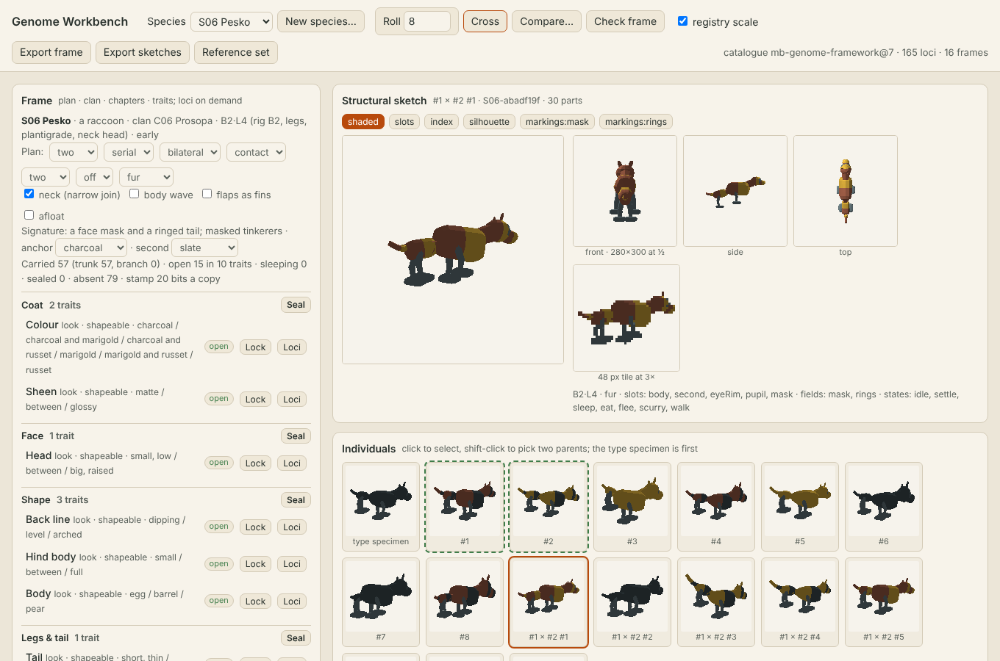
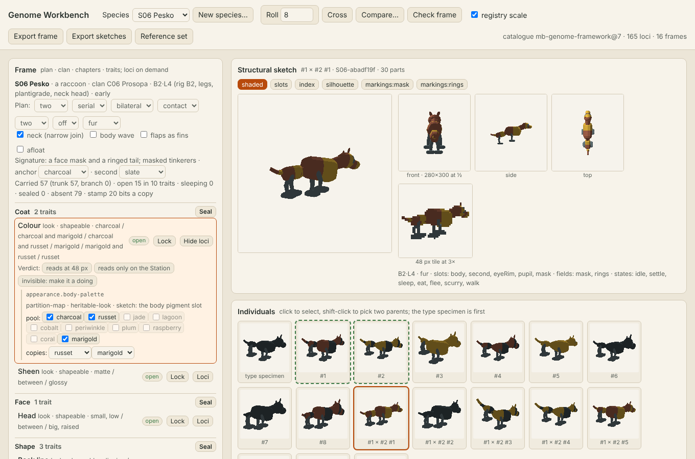
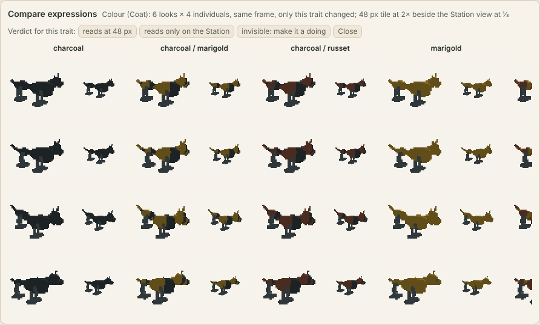
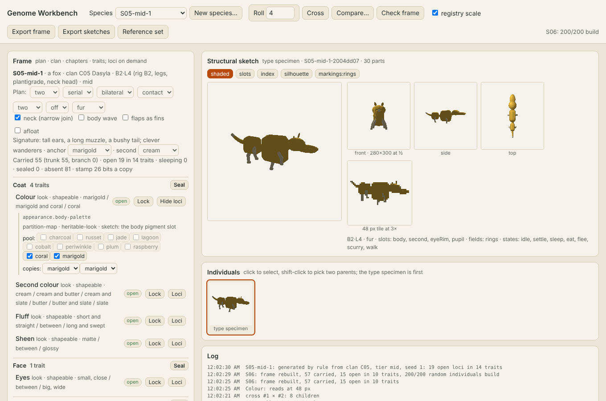
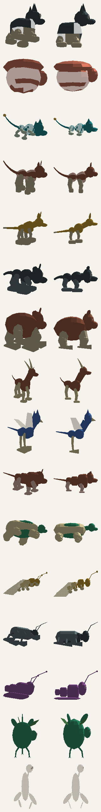
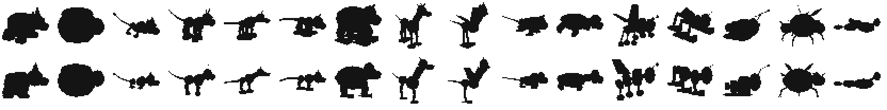
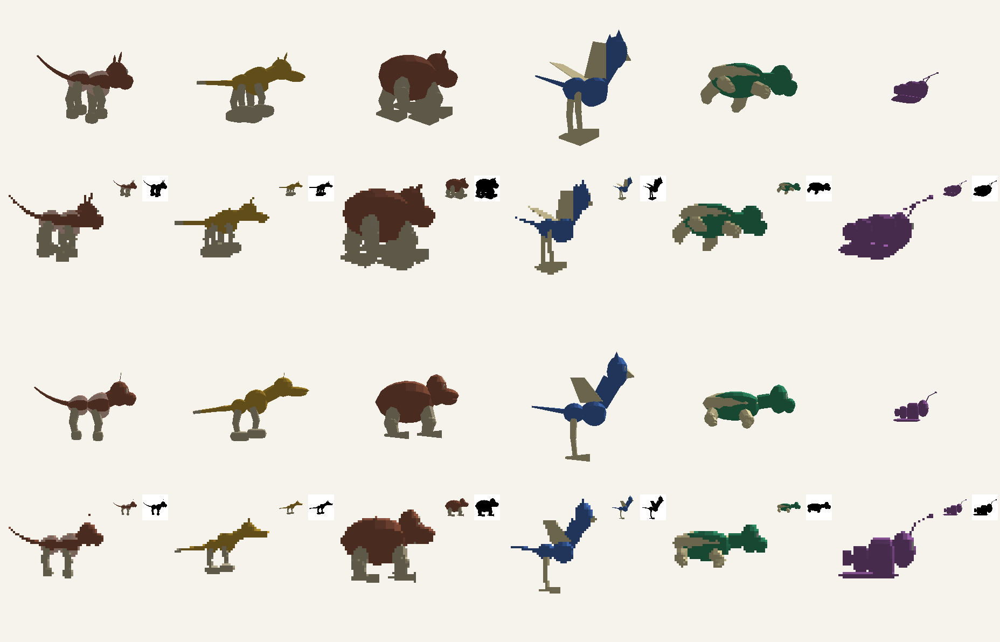

# Workbench: stage 0 of the art pipeline

The internal authoring tool of [art-pipeline.md](../../design/proposals/art-pipeline.md) §2, stage 0: the genome framework the generator reads directly, the deterministic structural sketch, and the page where a designer locks a species and sees whether its expressions read. It ships no art. Plain Node 22 and ES modules in the browser, no dependencies; served at `/sandbox/workbench/` by the site workflow.



*The page: the frame on the left (plan, clan, chapters and traits), the sketch at Station and Companion scale in the middle, rolled individuals and their children below.*

## What is on the page



- **Frame.** Pick one of the 16 registry frames (the V1 roster of [taxonomy.md](../../design/proposals/taxonomy.md) §3; the codes S01–S16 and C01–C16 are the ids, and the approved names of [species-names.md](../../design/proposals/species-names.md) show beside them, S04 Hiljan of clan C04 Lathreta) or generate a new species by rule from a clan, a tier and a seed. The plan (segments, layout, symmetry, limbs, pairs, flaps, covering; neck, body wave, fins, afloat) and the clan signature (anchor and second pigment) are selects; the counts (carried, open, sleeping, sealed, absent, stamp bits) update at once.
- **Chapters and traits.** Coat, Face, Shape, Legs & tail, Movement, Stamina, Character, and a species chapter (Glow, Charge). Every trait shows its state (open, sleeping, sealed), nature, shapeable or breeding-only and its looks. Lock a trait, seal a chapter behind a find, open a locked part as a new trait, add a part the clan never had, narrow a pool allele by allele. The loci are one press away and never the entry point.
- **The sketch re-renders at once:** three-quarter at Station scale (300×310), front, side and top at Companion scale (280×300 at ½), the 48 px tile at 3×; passes shaded, slots, index, silhouette and one per marking field.
- **Individuals.** Roll N random individuals of the frame; shift-click two as parents and cross them; every individual is validated as a whole genome against its frame and as a body against the compositional contract, and a rejected one is marked, never repaired.



- **Compare expressions.** Same frame, one trait changed, N individuals: one column per look, the 48 px tile beside the Station view. A verdict per trait ("reads at 48 px", "reads only on the Station", "invisible: make it a doing") is written into the frame file with a note and a date; "invisible" also makes the trait breeding-only and records the reason as its override.
- **Check frame** builds 200 random individuals. **Export frame** downloads the species JSON; **Export sketches** and **Reference set** download a zip in the cache format. Edits persist in the browser's local storage until discarded.
- Keyboard and mouse: arrows move between traits, L locks, O shows loci, R rolls, C crosses, X compares, 1–3 record a verdict, [ ] step through individuals, E exports the frame.



## Salvaged from v1 and rebuilt

The owner's verdict on the v1 workbench: a good idea, badly implemented; keep the 3D models; the locus editing was poor; everything collapsed into slugs or six-legged things; it needed a tighter link between the generation and the genome framework. This is what was kept and what was replaced.

| Salvaged from `v1/prototype/generator-workbench/` | Where it lives now |
| --- | --- |
| Catalogue6: the 114 validated pairs, six drafts, allele values, pair maps, applicability, the foundation digest | `framework/catalogue6-data.mjs`, snapshotted with provenance by `tools/snapshot-v1-catalogue.mjs`; every v1 record keeps its id, operator, alleles and record version |
| The resolver's operators (copy-mean, dominant and recessive enable, pair maps keyed by the sorted pair, partition maps) | `framework/catalogue.mjs` `resolveCopies` |
| The resolver's guards (`consumerGuard`, `roleGuard`) and frames.py's applicability table | `framework/guards.mjs`, ported with the one deliberate change below |
| The meshes of the compositional contract: superellipse ring solids with the ovoid, barrel and tapered weights, 6×12 ellipsoids, eight-sided tapered segments, thin sheets, the ear outline, the tail sweep, the terminal forms, the convex-envelope root test | `framework/geometry.mjs`, `framework/rig.mjs` |
| The fixed eye inks, the light from the top left, the pigment split at u = 0.5 on a two-pigment slot | `framework/rig.mjs`, `framework/raster.mjs` |
| The frame method (frames.py: plan and part switches, pools, sleeping parts from the two probes, locked copies homozygous, the 200-individual check) and the generative taxonomy (taxonomy.py: clan signature, tier, seed, rule 6) | `framework/species.mjs`, `framework/roster.mjs` |
| The marking field's logical placement (bands, patches, count from extent) | `framework/raster.mjs` `markingAt`, per face |
| The PNG writer of the genome-stamp prototype | `framework/png.mjs` |
| The evidence habits: replay by digest, hashed manifests, byte-identical regeneration | `sketch/cli.mjs --verify`, `tests/sketch.test.mjs`, the manifests |

| Rebuilt | Why, and how |
| --- | --- |
| **Limb rooting.** v1 rooted every chain, flap and the head on `region-root`; later regions were legless children | `plans.mjs` gives every plan limb stations per region (fore legs on the front region, hind on the back, one pair per region on six legs, wings on the thorax, rays round a hub); `rig.mjs` roots each limb on its own region's facets |
| **Founder sampling.** v1 drew 114 loci independently and kept the first of up to 1,024 draws that built; a third were legless, half of the legged ones six-legged | A body is built from a frame: the plan picks the rig and limb sets, the clan fixes its parts, the species fixes the rest by seed and opens traits by tier; individuals vary only at the open loci. Nothing is drawn to be rejected |
| **Guards that rejected.** Unsupported parts rejected the draw | A plan carries what its owners allow and nothing else is drawn into a narrower survivor set; a body that cannot be built is reported with its reason (`validate.mjs`) and never repaired |
| **Equal beads.** Equal lengths and symmetric bulges | A mass hierarchy (`development.regional-growth`, an old record with its first consumer) and the posterior taper scale the regions; girth, a chest, a neck (narrow join, `structure.join-neck-ratio`) or a fused head; a ground pose so every view is framed the same (see The volume rig) |
| **Radial plans.** v1 rotated radial frames round the length axis | Radial plans are symmetric about the up axis: a dome with its face in front, rays or feelers round it, a cap on top, fan arms in the horizontal plane. A framework change, stated in the contract notes of `rig.mjs` |
| **The pan-genome.** v1 carried all 114 pairs in every creature, most inactive | A species carries the trunk loci whose owner its plan has, plus its clan's branch; everything else is absent, not switched off (taxonomy §2, decided). S01 carries 48 pairs, S09 61; plan switches are frame facts |
| **The editor.** An eleven-layer tree of 114 pairs, copy by copy, with a refresh step | Frame → chapter → trait, loci underneath on demand; every change re-renders at once |
| **The per-creature render button.** v1 sent each creature to an image model | Gone. The sketch is the form authority stage 2 consumes; generation moves to archetypes, per the pipeline |
| **The type specimen.** frames.py took the first allele of every pool | Numeric loci at the middle of their pool, so the archetype is the species' middle, not one end |

Everything in the brief fitted the catalogue as records with owners and consumers except the two framework changes above (vertical-axis radial plans, the mid-pool specimen); both are made, not worked around.

## The framework (`framework/`)

| File | What it is |
| --- | --- |
| `catalogue6-data.mjs` | Snapshot of v1's catalogue6 with its foundation digest, generated by `tools/snapshot-v1-catalogue.mjs` |
| `catalogue.mjs` | Catalogue 7: catalogue6 plus 45 new records, each tagged trunk or clan branch, with its owner and consumer: the revised taxonomy's **11 switches · 25 loci + 5 alleles** (mammal look: fur reach, face mask and shape, tail rings and count, ear tilt; horns with curl and branching and a hoof foot; a beak, feathers, a feather crest and a one-pair allele; a shell with dome and plates; antennae, wing cases, flap markings and translucent flaps; a foot skirt and sheen; leaves, a leaf covering, light feeding and a root foot; a charged body with charge, phase and pull, the first fantastic-physiology loci; a webbed foot; a huge size), emission moved to the trunk, and the three gaps the frames list first (the tail-tip bulb for C03, a top cap sheet with its colour and spots for C02, a belly field and crest leaf count for C01). Six old records get their first consumer (regional growth, attachment position, neck ratio, fin span, fin steering, surface texture) and the transparency and uptake drafts close through flap translucency and light feeding |
| `plans.mjs` | The plan key of `taxonomy/plans.json` read into plan facts: the seven body rigs, the limb sets, limb stations per region, link count, posture and ground contact, neck or fused head, the state machine's states |
| `guards.mjs` | Owner guards ported from v1's resolver and the catalogue's `applicability`; decide what a plan carries and what an individual draws |
| `resolve.mjs` | A frame and a genome become values and facts: the pan-genome resolver |
| `geometry.mjs`, `rig.mjs` | The finite solids and the parametric body |
| `validate.mjs` | Every body against the compositional contract: facet roots, attachment witnesses inside owner and part, bounds. Reported, never repaired |
| `raster.mjs` | The deterministic rasterizer: orthographic views, a depth buffer, one light, the passes, the 48 px mask and the shape distance |
| `species.mjs` | Species first: frames, individuals, crosses, shaping, the type specimen, whole-genome checks, a frame back into an editable spec |
| `roster.mjs` | The 16 clans with their signatures and the 16 species, with the approved names beside the codes (`SPECIES_NAMES`, `CLAN_NAMES`; the frame carries `species.name` and `taxonomy.clanName`); S01–S03 carry the authored frames of frames.py |
| `build-frames.mjs` | Writes the frame registry `frames/` (schema `mb-species-frame/2`: taxonomy header, plan facts, signature, chapters and traits with verdicts, the carried loci by kind, the absent loci with reasons, pools, locked copies, counts, pod, the type specimen's brief and bounds, viability) |
| `census.mjs` | The silhouette census below |

## The structural sketch (`sketch/`)

`sketch.mjs` renders one body to the views and passes stage 2 consumes; `cli.mjs` writes them under `out/sketch/<species>/<individual>/` with a manifest.

- **Views:** front, side, three-quarter (lit from the top left), top. **Sizes:** the 48 px tile, the Companion subject at 280×300, the Station at 300×310 and a larger 600×620.
- **Passes:** `shaded` (flat fills by pigment slot with one light, markings as a lighter field), `slots` (every pigment slot as a flat colour, both halves of a split slot; the legend is in the manifest), `index` (one flat colour per part), `markings-<field>` (one black-and-white mask per marking field: coat, flaps, cap, mask, rings, shell, belly), `silhouette` (black on white at tile, Companion and Station sizes).
- **One camera rig for the registry:** the Companion and Station subjects share the scale that fits the longest type specimen, each body centred in its own frame; the 48 px token fills its tile. An individual that overflows a fixed frame is clipped and flagged, never rescaled. `speciesCameras` is the per-species fit.
- **Same genome, same bytes:** integer-exact rasterization, no anti-aliasing; flap translucency and a charged body's phase are an ordered dither. `--verify` renders twice and compares every PNG's SHA-256.
- **The manifest** follows art-pipeline.md §3: level, id, version, the genome and its digest, frame version, catalogue pin, sketcher version and sketch hash, slot legend, marking fields, states, one entry per output with its SHA-256; prompt, references, model, critique and sign-off are empty slots for later stages. A reference set (`--set N`, or the page's Reference set button) adds `index.json`.



*The 16 type specimens of the registry, three-quarter and side, shaded pass. Structure and slots only; craft is the masters' job.*

## Run the checks

```sh
cd prototypes/workbench
npm test                                   # node --test tests/*.test.mjs: catalogue, plans, frames, resolver, crosses, bytes, contract, sketch (11 tests)
node framework/build-frames.mjs --check    # the registry is current (200 random individuals per species, about 35 s)
node framework/census.mjs                  # the census gate; writes framework/census.json, census.md and img/silhouettes-48.png (about 45 s)
node sketch/cli.mjs --all                  # every species' type specimen sketched under out/sketch/ (about 10 s)
node sketch/cli.mjs --species S03 --verify # one sketch set rendered twice and compared byte for byte
node tools/screenshot.mjs                  # the page headless: fails on any page error, writes img/page-*.png (needs the playwright package and a Chromium)
node tools/contact-sheet.mjs --species S09 --n 8   # a sheet of random individuals, for a look
```

`out/` is ignored by git: it stands in for the cache until `art/library/` exists, and nothing here writes into `art/`.

## The silhouette census

Every plan's default body, rendered as a 48 px silhouette, must differ from every other plan's by a measured margin (art-pipeline.md §2). Built from the registry on 2026-10-07, 200 random individuals per species, all 3,200 building and validating. The 16 species sit on 13 distinct plans (S04, S05, S06 and S08 share B2·L4·fur and differ by clan parts, size and finish, as the taxonomy intends), so the gate is between plans: every pair of type specimens on different plans at a shape distance of at least 0.22, where the distance is 1 − IoU of the two masks fitted into the same 48 px box, the larger of the three-quarter and side views. "Own-plan nearest" is the share of a species' individuals whose nearest type specimen is their own; a species with many open shape traits spreads more, by design.



| Species | Plan | Rig | Built | Own-plan nearest | Mean distance to own specimen |
| --- | --- | --- | ---: | ---: | ---: |
| S01 Loika | B1·L4 | B1 | 200/200 | 100% | 0.06 |
| S02 Untuva | R1·flaps | R1 | 200/200 | 100% | 0.14 |
| S03 Tuikis | B2·L4 | B2 | 200/200 | 46% | 0.37 |
| S04 Hiljan | B2·L4 | B2 | 200/200 | 100% | 0.23 |
| S05 Tepor | B2·L4 | B2 | 200/200 | 97% | 0.22 |
| S06 Pesko | B2·L4 | B2 | 200/200 | 69% | 0.34 |
| S07 Azkon | B1·L4 | B1 | 200/200 | 89% | 0.27 |
| S08 Rupar | B2·L4 | B2 | 200/200 | 86% | 0.30 |
| S09 Belatz | B2·L4·flaps | B2 | 200/200 | 77% | 0.36 |
| S10 Igara | B3·L4 | B3 | 200/200 | 56% | 0.39 |
| S11 Kilpo | B1·L4 | B1 | 200/200 | 91% | 0.23 |
| S12 Peplos | B3·L6·flaps | B3 | 200/200 | 100% | 0.14 |
| S13 Oskol | B3·L6 | B3 | 200/200 | 100% | 0.18 |
| S14 Usvel | B3 | B3 | 200/200 | 70% | 0.28 |
| S15 Lehten | Rfan2·rays | Rfan2 | 200/200 | 85% | 0.30 |
| S16 Blikur | Bfan3 | Bfan | 200/200 | 98% | 0.19 |

Shape distance between type specimens; `*` marks a pair on the same plan, which the gate does not cover.

| | S01 | S02 | S03 | S04 | S05 | S06 | S07 | S08 | S09 | S10 | S11 | S12 | S13 | S14 | S15 | S16 |
| --- | ---: | ---: | ---: | ---: | ---: | ---: | ---: | ---: | ---: | ---: | ---: | ---: | ---: | ---: | ---: | ---: |
| **S01** | · | 0.37 | 0.65 | 0.81 | 0.57 | 0.63 | 0.46 | 0.58 | 0.64 | 0.71 | 0.46 | 0.69 | 0.59 | 0.60 | 0.40 | 0.64 |
| **S02** | 0.37 | · | 0.67 | 0.82 | 0.58 | 0.66 | 0.34 | 0.63 | 0.62 | 0.76 | 0.52 | 0.73 | 0.62 | 0.60 | 0.42 | 0.68 |
| **S03** | 0.65 | 0.67 | · | 0.60 | 0.47 | 0.36 | 0.69 | 0.58 | 0.49 | 0.47 | 0.60 | 0.70 | 0.50 | 0.51 | 0.58 | 0.44 |
| **S04** | 0.81 | 0.82 | 0.60 | · | *0.69 | *0.59 | 0.79 | *0.73 | 0.66 | 0.65 | 0.72 | 0.79 | 0.70 | 0.71 | 0.76 | 0.64 |
| **S05** | 0.57 | 0.58 | 0.47 | *0.69 | · | *0.46 | 0.53 | *0.40 | 0.42 | 0.64 | 0.47 | 0.64 | 0.43 | 0.59 | 0.50 | 0.50 |
| **S06** | 0.63 | 0.66 | 0.36 | *0.59 | *0.46 | · | 0.65 | *0.54 | 0.51 | 0.56 | 0.57 | 0.71 | 0.50 | 0.60 | 0.62 | 0.55 |
| **S07** | 0.46 | 0.34 | 0.69 | 0.79 | 0.53 | 0.65 | · | 0.52 | 0.58 | 0.79 | 0.49 | 0.69 | 0.62 | 0.69 | 0.55 | 0.73 |
| **S08** | 0.58 | 0.63 | 0.58 | *0.73 | *0.40 | *0.54 | 0.52 | · | 0.51 | 0.72 | 0.50 | 0.62 | 0.53 | 0.73 | 0.60 | 0.68 |
| **S09** | 0.64 | 0.62 | 0.49 | 0.66 | 0.42 | 0.51 | 0.58 | 0.51 | · | 0.64 | 0.59 | 0.65 | 0.50 | 0.71 | 0.58 | 0.59 |
| **S10** | 0.71 | 0.76 | 0.47 | 0.65 | 0.64 | 0.56 | 0.79 | 0.72 | 0.64 | · | 0.72 | 0.80 | 0.60 | 0.53 | 0.68 | 0.47 |
| **S11** | 0.46 | 0.52 | 0.60 | 0.72 | 0.47 | 0.57 | 0.49 | 0.50 | 0.59 | 0.72 | · | 0.61 | 0.53 | 0.62 | 0.54 | 0.61 |
| **S12** | 0.69 | 0.73 | 0.70 | 0.79 | 0.64 | 0.71 | 0.69 | 0.62 | 0.65 | 0.80 | 0.61 | · | 0.61 | 0.82 | 0.70 | 0.76 |
| **S13** | 0.59 | 0.62 | 0.50 | 0.70 | 0.43 | 0.50 | 0.62 | 0.53 | 0.50 | 0.60 | 0.53 | 0.61 | · | 0.59 | 0.56 | 0.51 |
| **S14** | 0.60 | 0.60 | 0.51 | 0.71 | 0.59 | 0.60 | 0.69 | 0.73 | 0.71 | 0.53 | 0.62 | 0.82 | 0.59 | · | 0.52 | 0.39 |
| **S15** | 0.40 | 0.42 | 0.58 | 0.76 | 0.50 | 0.62 | 0.55 | 0.60 | 0.58 | 0.68 | 0.54 | 0.70 | 0.56 | 0.52 | · | 0.56 |
| **S16** | 0.64 | 0.68 | 0.44 | 0.64 | 0.50 | 0.55 | 0.73 | 0.68 | 0.59 | 0.47 | 0.61 | 0.76 | 0.51 | 0.39 | 0.56 | · |

Closest pair of plans: S02 Untuva and S07 Azkon at 0.34. No pair of plans below the margin. Species sharing a plan are not gated; the closest are S05 Tepor and S08 Rupar at 0.40. No plan collapses into another's silhouette family. `framework/census.md` and `census.json` are the current run.

## The volume rig

The first bodies read as logs with stick legs (the programme lead's review of milestones 1–4). The rig now draws real volumes, as versioned expression conventions in `rig.mjs`:

- body regions 1.35 times as girthy as v1's ratios, a chest on a walker's leading region, the mass hierarchy and taper on top;
- a head 1.15 times v1's ratio, with muzzle or beak, ears (upright or drooping), crest, horns and eyes placed as parts;
- legs 1.6 times as thick, rooted low on the flank and under the body, fore knees bent forward and hind knees back, paws, pads, wedges, hooves, webbed and root feet 1.35 times v1's;
- tails thicker, bushy where fur reaches the tail; fins, flaps, rays and fans as before, wings held up in a V so they read in every view;
- the covering as a silhouette modifier: fur and feathers push the surface out by their inherited length with a scalloped edge on body and tail, and reach the tail and ears when fur reach says so; scales and skin leave the outline alone;
- one registry-wide scale for the Companion and Station subjects (the longest type specimen fits; every body is centred in its own frame), so size classes show; the 48 px token fills its tile for every species, as the field keeps one tile size. The page's "registry scale" box toggles this; `--fit-species` on the CLI.



*Six type specimens (S04 Hiljan, S05 Tepor, S07 Azkon, S09 Belatz, S11 Kilpo, S14 Usvel) at one shared Station scale (300×310) with, beside each, the 48 px tile at 4×, at 1× and as the silhouette; three-quarter view above, side view below. This is the figure to judge: does a cat read as a cat at 48 px?*

## What this does not claim

The sketch stops at form and slots: smooth volumes, flat fields, no craft. S09 stays on its roster plan (four legs and wings) until a one-pair plan is added to `plans.json`; the one-pair allele is in the catalogue and the rig draws it. Feathers, the leaf mantle and sheen are labels and slot facts for the masters, not drawn materials. Behaviour loci are carried and weighed nowhere yet; the state machine's states come from the plan, its transitions do not exist. Nothing here is art, and nothing here changes a gene.
