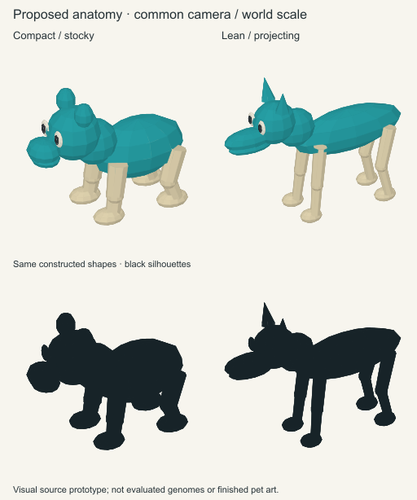

# Proposed anatomical source construction

The fixed head/core/neck/support V1 implementation is retained for exact saved
records and was rejected as the general generator. The current correction is
the [compositional content](compositional-contract.md) and [source-art handoff](compositional-art-direction.md):
organization derives from inherited contributors, and the authoring record
exposes all eleven genomic branches. The drawings below are narrower design
inputs, not acceptance of that range.

Two parameter-driven source-art examples introduce a head, projecting muzzle and
lower jaw, neck and trunk, exterior eye anchors, fore/hind paired jointed supports,
distinct terminal masses and paired head surfaces. They share the same operators;
compact/lean are parameter examples, not species selectors.

Each reference is 256×256 at the same orthographic shallow three-quarter camera
and world scale. The compact example has a broader head and trunk, shorter muzzle
and supports, and wider terminal masses. The lean example has a projecting muzzle,
longer narrower supports and smaller ends. Rounded versus pointed head surfaces
provide a second structural contrast. They imply no hearing or horn capability.

The shared smooth-skin pigment proposal assigns lagoon to head, muzzle, jaw,
neck, trunk and crown surfaces, and cream to supports, joints and terminals.
Fixed neutral eye inks remain separate. Light shades these pigments; it does not
create new facial or belly markings. No fur, toes, hoof clefts, tail or wings are
supplied by the picture.

The primary references use opaque surfaces and natural occlusion. A far support
can be partly hidden, especially on the compact body. The separate
[support trace](support-trace.png) shows all four source chains from above; its
dots and overlaid lines are construction annotations, not additional anatomy.

[parameters.json](parameters.json) records the provisional parameter trees,
constructed parts, exact support chains, pigment owners and geometry causes.
Support roots are solved on the trunk ellipsoid; exterior ocular anchors derive
from the head ellipsoid. Joint and terminal positions follow explicit offsets.
Connected masses overlap to depict continuity; this prototype does not perform
a watertight mesh union, tissue collision or physical joint simulation.

These are construction-design inputs for the separate
[anatomical Generate implementation](genomic-contract.md).
They are **not evaluated genomes, valid G/E references, inherited outcomes,
canonical anatomy or finished pet art**. The previous 50-locus content does not
resolve these new roles. The new [contributor contract](genomic-contract.md) and
versioned platform adapter establish that separate connection using complete
inherited copies, rather than selecting these drawing tuples. Two worked examples do not demonstrate
bear/cat/cow/firefly coverage or a universal anatomy system.

Editable sources: [draw-prototype.mjs](draw-prototype.mjs),
[compact.svg](compact.svg), [lean.svg](lean.svg),
[comparison.svg](comparison.svg) and [support-trace.svg](support-trace.svg).
Run `node draw-prototype.mjs` with the existing Node/Sharp dependency environment
to regenerate. The renderer uses coarse volume meshes projected into SVG; it
does not install a 3D framework. One exact regeneration reproduced all nine
generated SVG/PNG/parameter files byte-identically. Native-size inspection found
readable structural contrasts without cell clipping. These findings establish
reproducibility/readability, not reference or game acceptance.
