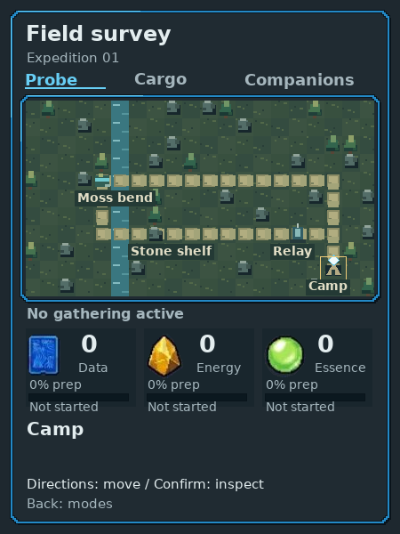
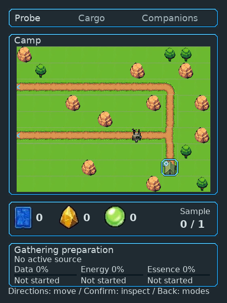
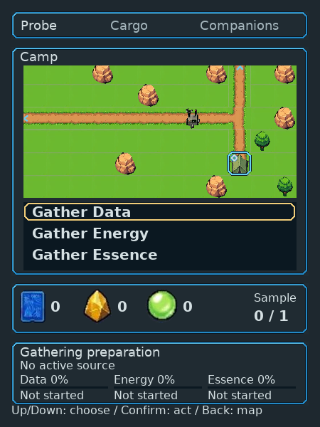
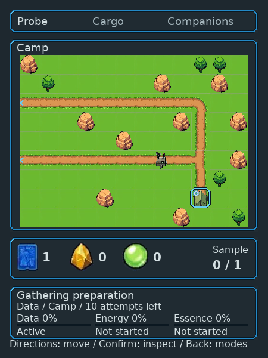
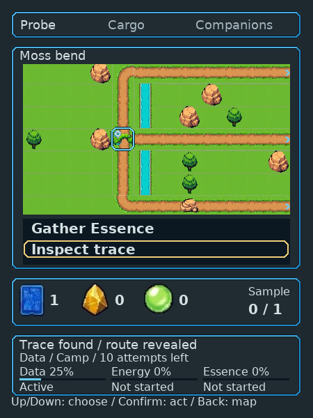
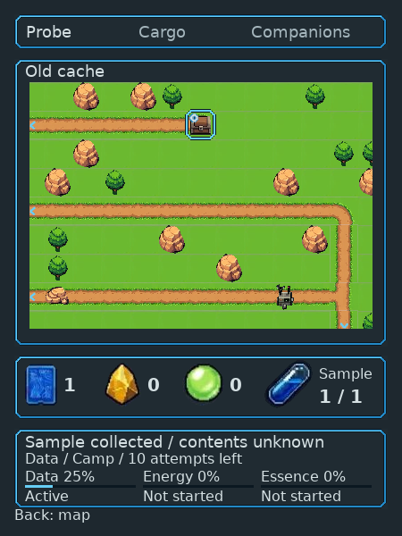
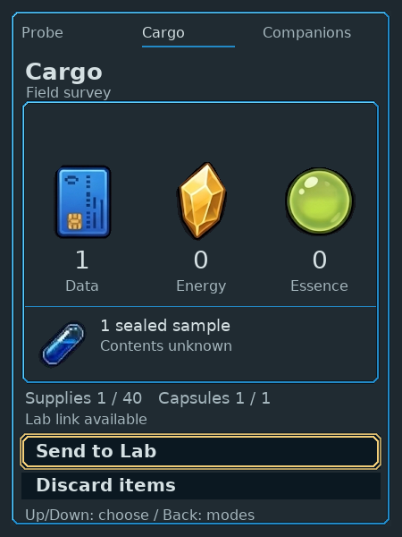
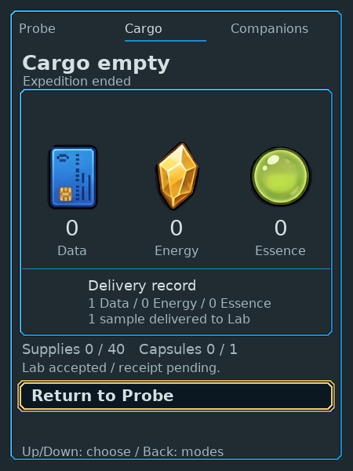
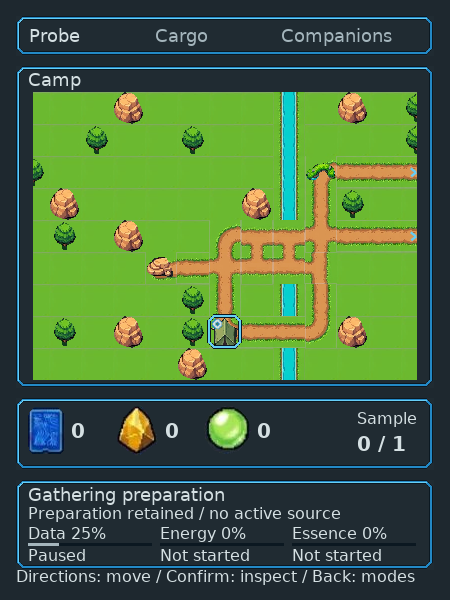

# Native Companion Probe composition

The current [timer-free collection proof](timer-free/README.md) supersedes the
preparation behavior below. This page preserves its exact earlier checked
revision; [current architecture coverage](../../../native/ui/README.md#screen-coverage-and-target-evidence) owns renderer status.

Actual450×600 host-native LVGL output from clean pushed source
`59870e53450156d94e590bbce7f276f40f623eec`. Existing physical controls drive the
game; these are native frames, not browser UI cards. Cargo and Probe share one
display/context. Lab, Companions and Dock keep their existing renderers.

## Visible change

Probe now uses a384×288 player-following local map with native32px illustrations,
only disclosed routes and visible locations, a small tile-corner player marker
and a reached-place frame. Inspection keeps the location visible with its actual
choices. Earned whole supplies and the sealed sample remain beneath the map;
preparation toward the next unit stays separate. Collected-cache inspection is
completion status without another focused acquisition action. Entry/sent/ended/
unavailable phases cannot present a receipt as a live map.

Prior renderer on the same copied no-gathering field:

Current renderer at the same player/location:

Prior source is`ae93a07c73d643cc296cb802f425b881e139566f`. Its loader resumed at
modes; one ordinary Confirm opened the map. No movement or acquisition changed
the comparison field.

## Actual player journey

1. Enter Probe and choose Field survey. Confirm at Camp opens all three gathering
   choices; select Data and Back returns to the map.
2. Gathering awards a real whole Data unit. Walk disclosed paths to Moss bend,
   inspect the trace, then follow the newly revealed route to the cache.
3. Explicitly collect the sealed sample. Cargo becomes1/1; cache completion shows
   Back to the map without offering a false second action.
4. Preview Send in Cargo and cancel safely. Explicitly Send, then accept at Lab.
   Current Companion supplies/sample become zero; the delivery record stays
   separate. Dock records accepted stock.
5. Back exits Cargo. Choose Garden forage; its saved route/site layout differs.
   Retained preparation is current Companion progress, never reconstructed from
   a delivery receipt.

## Verification and limits

Correction source2708ff7 passed all five native suites on the existing toolchain.
Copy-fit source59870e5 passed focused Probe/Cargo checks and the actual
isolated control journey above. Regression checks verify Cargo paints beyond
LVGL's default130px root, as well as exact mode-switch restoration. Initial
review found and withdrew acceptance for a clipped Cargo root; these frames
show the corrected output.
Final source`d2f62e80dedd33c5f2778719a5448ea251dd2086` only corrects the unavailable
footer to Back and adds its guard assertion. Its focused Probe check and refreshed
native fixtures passed; successful journey frames are unchanged and retain their
59870e5 provenance. No unchanged full journey was repeated for that final label.

Final retained pool:103,000bytes used,103,920 peak,141,600 free of244,600 reported
bytes; two contexts205,600 used of230,344 reported bytes. Repeated mode switches
do not accumulate allocations. These host measurements do not establish embedded
RAM/DMA, frame rate, power or physical readability. Native sprite channel/alpha
fidelity checks remain intact.

[manifest.json](manifest.json) pins each image's hash, dimensions and evidence
class. Seven corner/action/full/unavailable images are **synthetic presentation
fixtures**, not legal movement, earned capacity or reproduced failure evidence.
The remaining images are actual isolated native play.

[Gemini source and extraction](../../../design/core-v1-art/field/README.md) retain
exact provenance. Individual subjects/routes are usable provisional assets.
Environmental depth is **not approved**: flat lime ground, hard tile boundaries
and isolated objects fall short of the HiBit references. The expedition chooser
is sparse; Companions has not been re-laid out. Waiting/chance cadence, return
gesture cost and research discovery remain in
[issue44](https://github.com/PacoCotera/critter-lab/issues/44).

Acceptance requires independent technical, game/UX and art inspection of changed
outputs. Repaired bounded composition/control correctness is distinct from the
open environmental art judgment and human enjoyment. The sandbox release
endpoint identifies the running deployment; this packet is source-pinned proof.
