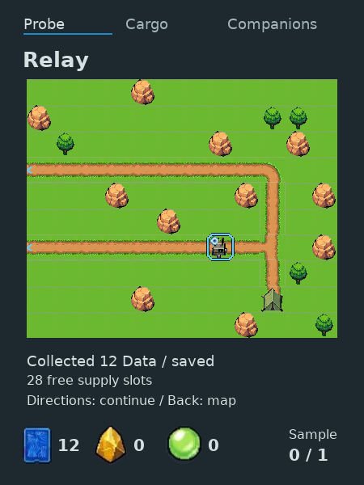
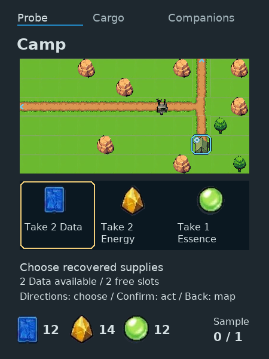
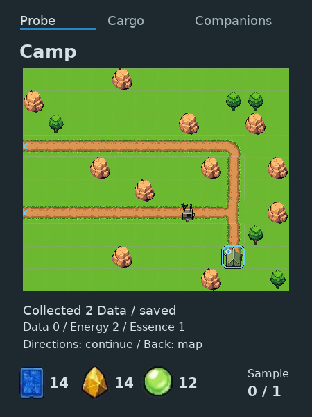
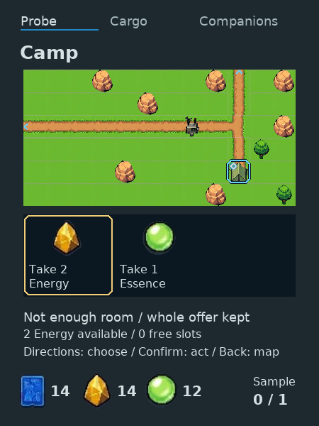
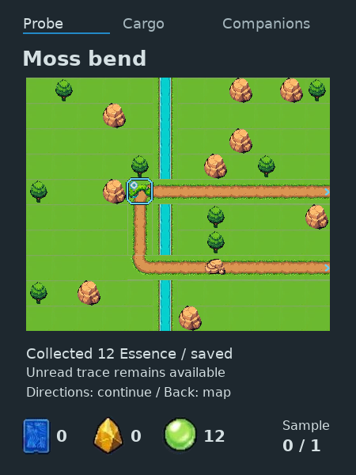
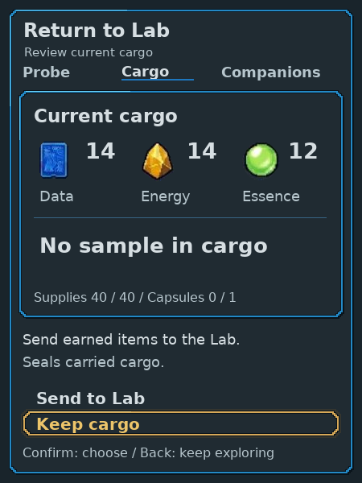

# Timer-free field collection proof

Actual 450×600 host-native LVGL frames, driven through semantic console controls
in an isolated saved world. [Frame manifest](frames.json) pins each image to its
checked source and SHA256. These are exported native frames, not browser-composed
game screens. This bounded proof is not the deployed sandbox or ESP32 runtime.

Immediate finite whole offers replace preparation and repeated chance claims.
Actual source counts stay distinct from carried cargo. The chooser appears for
real alternatives; one available offer collects directly. Source depletion and
inventory are saved together. Counts remain provisional balance.

The played quantity sequence reaches 38 units, then Camp's 2 Data reaches 40.
The subsequent Energy attempt actually rejects: cargo remains 14 Data, 14 Energy,
12 Essence and the source remains 0 Data, 2 Energy, 1 Essence. It does not split,
discard, reroll or credit a partial unit. The separate sample capsule is unaffected.

Collecting 12 Essence does not read the trace. The corrected caption agrees with
the saved unread state and discloses no connector/direction. Send review starts
on Keep cargo. The native ownership/HTTP journey separately checked explicit
Send, Lab acceptance once, zero current Companion cargo and separate history.

Focused game-design, UX and art assessments consumed the actual choice, result,
capacity rejection and corrected Moss frames. The technical boundary and native
quantity/ownership checks also pass. Back recovery was exercised; these checks
do not establish every unseen branch, human enjoyment, balance or hardware use.
Adding “Here:” before source-remainder counts is a nonblocking next refinement.

Environmental art, free terrain movement, expedition variety and broad game
craft remain open. Existing road constraints persist.

screen families still use manual composition; [architecture coverage](../../../../native/ui/README.md#screen-coverage-and-target-evidence)

has not passed all-device architecture or final visual acceptance.
