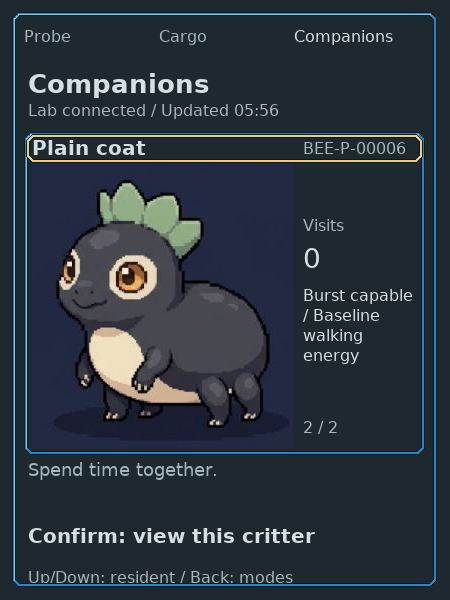
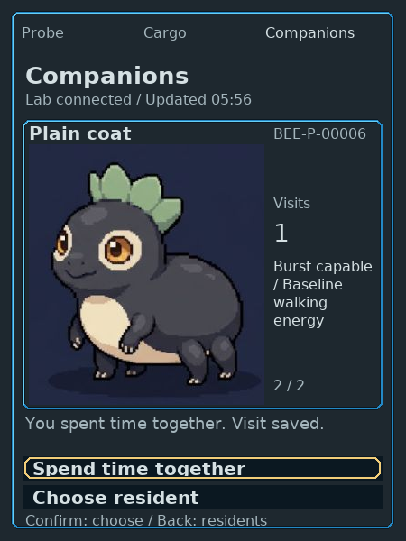
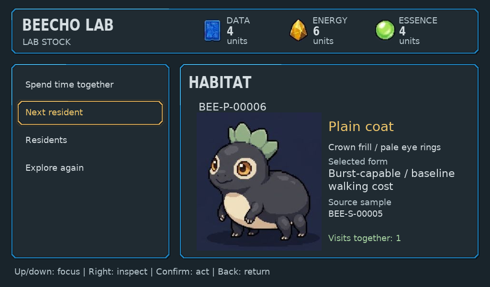
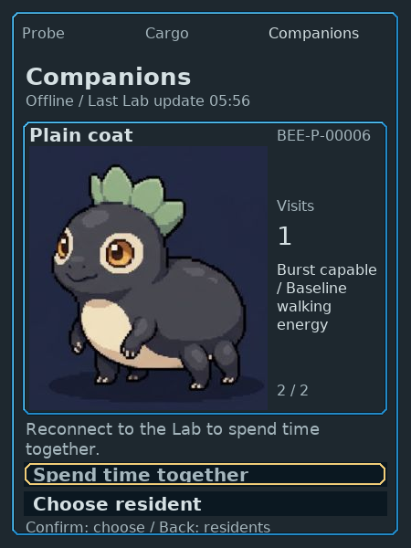

# Companion resident list and visits: native LVGL proof

The selected resident, existing portrait, saved property and visit count now remain
in the same retained LVGL composition while choosing a resident or visiting it.
This completes the known Companion host screen families.

current Companion ESP-IDF UI compilation remain open; this is not whole-product,
MCU, physical-performance or human-fun acceptance.

Source: `a81e3cc94cbef3be4e4983572663f0569e331c8f`. The existing toolchain built
the exact clean pushed Git revision. [Native validation](native-validation.txt)
records four affected suites, bounded partial drawing and warm memory. [Manifest](manifest.json)
distinguishes19 actual physical-control captures from24 synthetic native state
fixtures. [Controls](controls.json) retains178 commands from two isolated worlds;
the live sandbox was not deployed or reset.

## Actual controls and ownership

Empty-list Confirm returns to Probe. In the existing accepted A0/B1 world copy,
Up/Down selects the exact saved resident. Confirm opens the two-row visit screen;
Choose resident and Back restore selection without saving a visit. A stale Confirm
does not commit. Fresh Confirm down shows the pressed state without changing the
count; release saves exactly one visit for BEE-P-00006,0→1. The other resident
stays at2, and stock and carried cargo are unchanged.

The same resident and visit1 appear on Lab through its existing Next resident
action. Dock's accepted total becomes3. Those are current state projections,
not extra visits. Offline Confirm changes feedback only; Choose resident/Back
remain usable. Restart of the same isolated save retains offline inspection and
the saved count. Existing list controls reselect the second resident after restart;
the selected screen/index itself is not claimed to persist. Reconnect updates
the snapshot without queuing a visit.

## Projection and presentation cases

Native fixtures cover0/1/8 residents, selected last resident, both visit rows,
pressed/online/offline/pending-transfer/255-visit-limit, stale cache after an
accepted world save, and independent Kit/Lab global storage failures. They are
synthetic presentation cases, not claims that new critters were born in play.
Existing marked/plain/B1/provenance cases remain in the same exported family.

List focus belongs to the selected resident header; visit focus belongs to an
action row. Unavailable Spend time together retains its focus outline and muted
label; the domain rejects the action. Global storage errors close actions and
show recovery. A saved-at-Lab/stale-snapshot acknowledgment remains explicit;
later rejected actions follow the existing Kit message, without invented durable
state. Empty invalid selection/focus is rejected before layout.

No widget invokes game commands. Kit retains input, save and identity authority.
The host uses copied plain views, native assets, the existing lazy tree and a
bounded shared LVGL display. No manual Companion screen renderer or fallback
remains. Current Lab and target coverage belongs to the UI guide linked below.

## Independent acceptance

Independent technical and focused interaction/legibility reviews passed the final
source and native packet. A separate native craft review passed eight focused
control captures and all fourteen new list/visit fixtures at original450×600.
Both rows, unavailable focus, saved/stale feedback,255 visits and8/8 selection
fit without clipping. No blocking correction remains in this family.
CI186 passed native and existing target jobs; the Companion job still checks
the legacy scaffold plus the current shared Dock UI, not current Companion UI.
These reviews do not approve full HiBit art, game enjoyment,
all-device target builds or physical controls. The [architecture coverage](../../../specs/architecture.md#native-ui-foundation)
is authoritative for remaining migration gates.
