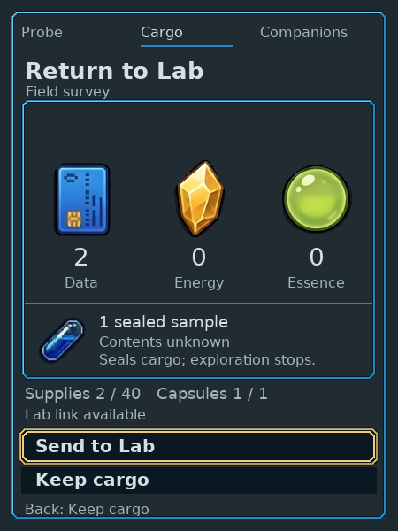
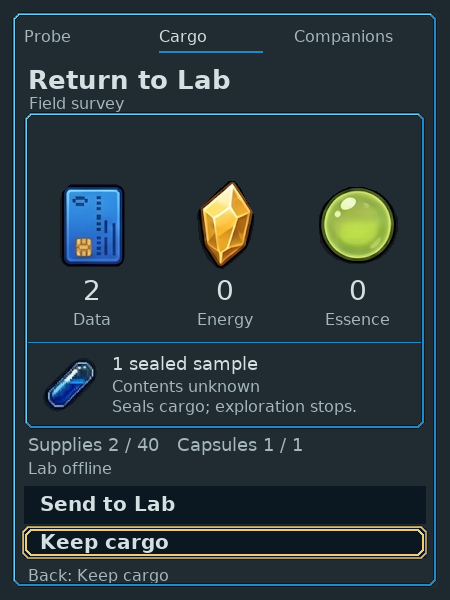
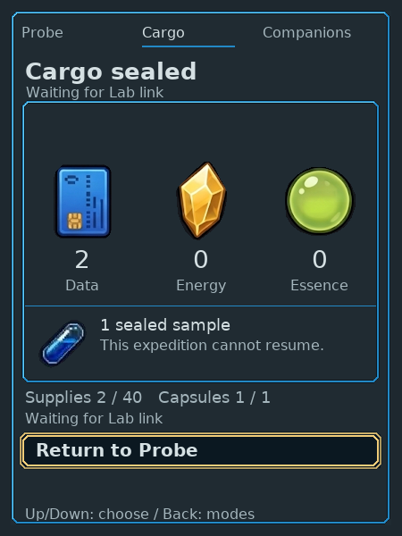
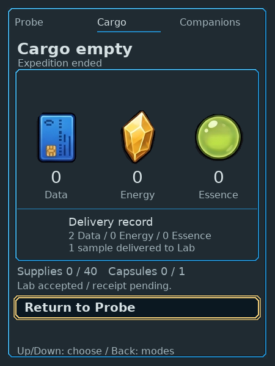
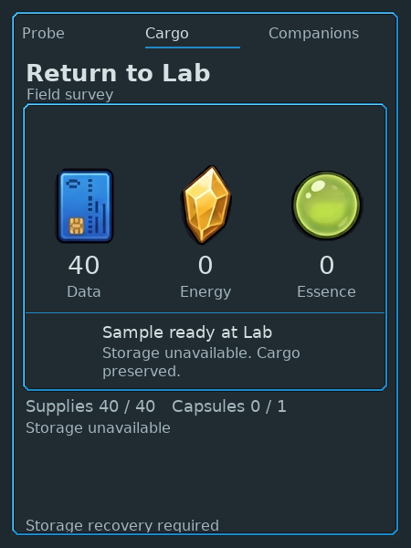

# Native Companion Send/Keep confirmation

Changed application source `0224a2858b5df17040d60021c2e9abcb56af5182` and
fixture-only source `e24fd35416aa8d2a2e6d726145dba044ae2efaa7` were pushed to
GitHub, retrieved through Git and checked in a clean existing native checkout.
The affected Cargo, Probe, Dock and physical-control suites passed. Current source
[CI run169](https://github.com/PacoCotera/critter-lab/actions/runs/36840956458)
also passed. A changed persistent three-device HTTP/native frame, handoff and
link-recovery check passed. [Frame manifest](frames.json) pins each image/hash.

## Player journey

Two isolated native worlds exercised supplies-only and genuinely collected
unknown-sample cargo. Physical inputs opened review with Keep selected; default
Confirm returned to unchanged Cargo. Explicit Send while offline sealed locally
and returned to Cargo waiting for the Lab. Reconnection opened Lab reception;
fresh acceptance credited once and cleared current Companion supplies/sample.
The read-only delivery record remains separate. No live sandbox state was changed.

Send seals cargo and stops exploration. Lab acceptance is the expedition-ending
moment. The review cannot spend Lab stock, inspect sample contents or acknowledge
the frame as painted. The UI mirrors Kit's physical focus and issues no commands.

## Rendering and ownership

Cargo and Send use one retained LVGL tree in `native/ui/companion_cargo_ui.c`,
with the existing resource/sample images, source fonts, geometry and stepped
focus frames. Copied plain views have no Kit/file/storage dependencies. Kit's
adapter projects owned facts; the host wrapper owns image/font backing and
optional frame export. Source branches for both old manual Send paths were
removed. A failed migrated projection/render returns an error before BMP output.

The same retained module also passed with only a bounded partial-display sink,
without host full-frame storage. Caller-overwrite, invalid view, repeated warm
updates and unchanged game/journal checks passed. These establish a host boundary,
not current Companion ESP32 compilation, panel output or runtime heap fit.

## Recovery and legacy disclosure

Both Kit and independent Lab storage errors close actions with recovery feedback.
A completed legacy outing may record a sample on Lab acceptance; its expected
sample caption is distinct from carried capsules, which remains zero. Early and
full-shelf legacy cases do not promise that result. Presentation fixtures below
are synthetic native output, not fabricated play sessions.

Independent source review found and closed the storage-flag and legacy-sample
disclosure defects. Independent technical and focused UI/UX review then consumed
the actual source, clean revision record, four-suite log, both native control
traces, all 20 capture hashes and three fixture hashes: both bounded assessments
passed. Normal/offline/unknown-sample/receipt/recovery text fits at native size;
the safe focus and current versus expected/delivered quantities remain distinct.
This packet does not approve broad environmental art, enjoyment,
complete Companion/Lab migration or physical device behavior. All remaining
routes are explicit in [architecture coverage](../../../native/ui/README.md#screen-coverage-and-target-evidence).
The reception images retain the manual composition used at this checked
revision. They do not describe current Lab composition or deployment.
