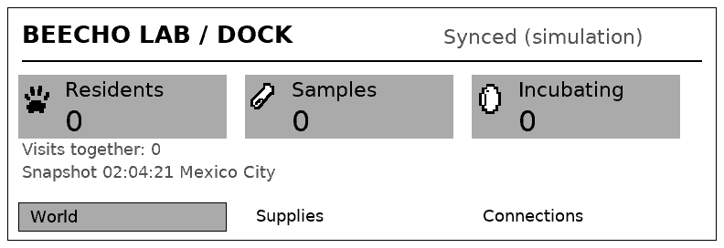
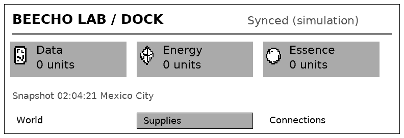
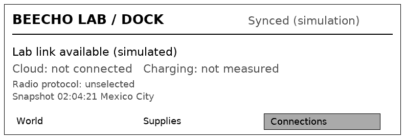
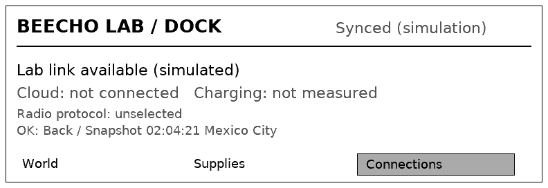
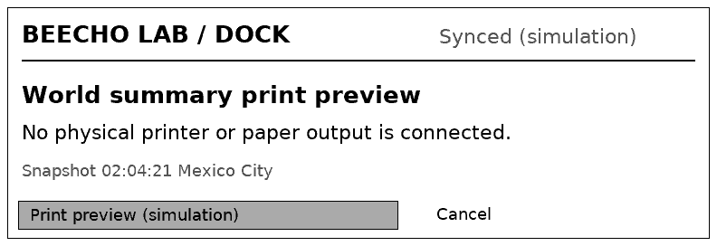
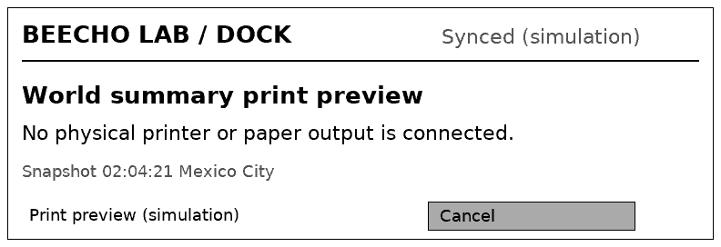
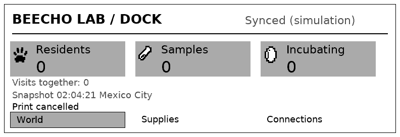
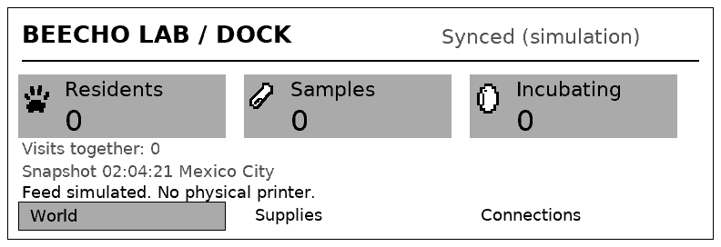
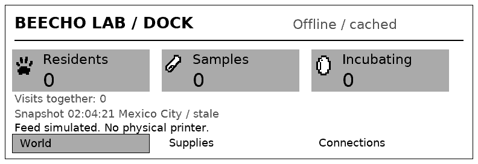

# Complete native Dock LVGL proof

Checked source: `5431f44d5f9e7f75ce91289d1cac4b57867bd6c1`.
The clean exact GitHub revision was retrieved through Git and built with the
established Linux toolchain. Six native suites and the changed three-device HTTP
journey passed. This is host software evidence, not ESP32 firmware or hardware.

Every Dock page now composes retained LVGL labels, images, buttons and focus:
World, Supplies, Connections, opened content, Print review, offline/cache and
storage failures. There is no old Dock raster fallback. The copied view owns
accepted cached counts, exact whole stock, timestamp and supported actions.
The UI cannot invoke domain commands. Partial buffer release is separate from
visible-frame acknowledgement. Full RGB frame storage belongs to host export.

Independent technical review consumed exact source, results and actual controls.
Art direction inspected these native792×272 frames at1×; focused Dock hierarchy,
type, focus, margins and error-copy acceptance passed. This does not approve all
game art, every nonzero/long-data case, ESP firmware or physical readability.

## Actual console journey

The isolated fresh native world used semantic physical button edges and frame
readiness. Previous/Next changes section; OK opens it. Print opens review;
Cancel returns to World. Feed reports simulation. Disconnection retains cached
counts and a stale timestamp. It never creates a second inventory.

Ten additional `fixtures/` frames exercise representative unavailable/suspended
and presentation states. They are synthetic native fixtures, not additional
control playthroughs. [Manifest](manifest.json) identifies both classes and hashes.
All Dock exports retain grayscale values0,85,170,255.

## Measured software boundary

The actual check reports Companion+Dock LVGL pool107312used /244192available
pool bytes. Partial draw buffers are81000 and142560bytes. Thirty repeated
Dock updates retain the same free pool size. These figures exclude optional
host RGB frames, separately allocated assets and physical driver/radio stacks;
they do not establish MCU fit. Area/stride/channel/capacity and asynchronous
buffer release checks pass, including a valid narrow/tall partial region.

[Same-source headless ESP-IDF compilation](ESP32.md) passes atc3c8a6d.

remaining Companion routes are still manual and remain required migrations.
See [architecture](../../../specs/architecture.md#native-ui-foundation) and
[portable UI boundary](../../../native/ui/README.md).
