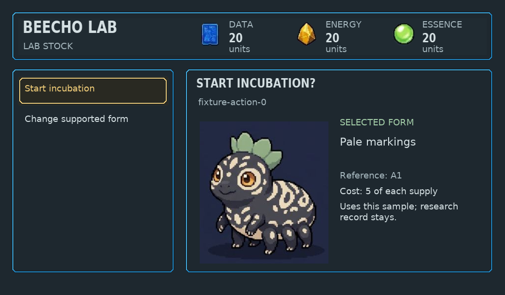
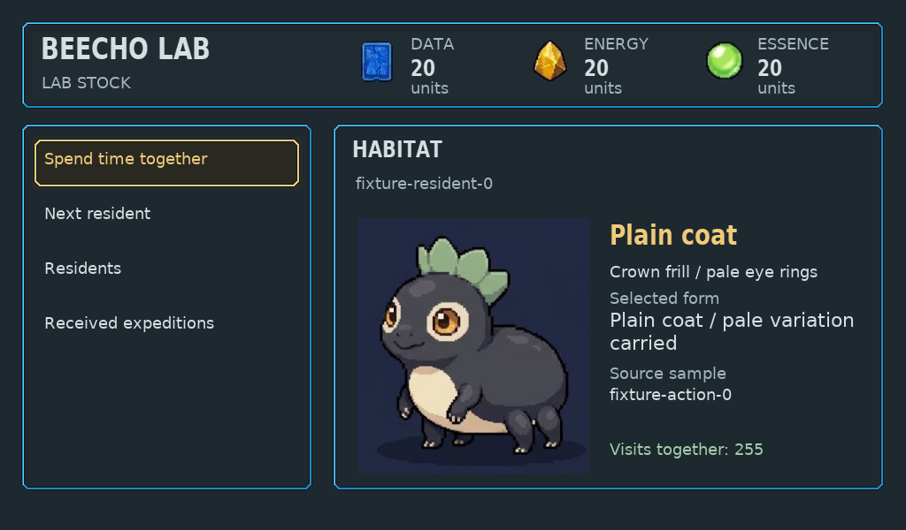

# Native Lab creation, incubation and residents

Six existing pages now compose through a copied portable view and one retained LVGL family: Create, explicit creation review, incubation, reveal, Habitat and residents. All standalone, generic and persistent native routes use it. Replaced manual compositors are removed; malformed input fails before BMP output.

Final source `dbfed3bc7f5528b0869ec60f9131407394b94ba5` was pushed, fetched through Git to the clean established build checkout, and passed focused native checks. Separate architecture/technical and actual frame art/UX/game-preservation review cover this bounded migration. This is host framebuffer/control evidence, not Raspberry Pi/ESP32 runtime or physical-device approval.

## Behavior and evidence

- Complete supported research alone permits candidate previews. Partial/unknown samples and closed ready incubation disclose no creature. Review pins the existing draft; stale review never falls back to another candidate.
- Costs remain5 whole units of each resource. Actual fresh physical input checks preserve cancellation, one deliberate Start, single sample use, retained research, explicit Open/Meet, passive inspection and deliberate care. Save/reload preserves resident/genome/art identity.
- Original opaque261×289 portrait pixels are checked unchanged. Unsupported art provenance shows Portrait pending while keeping saved identity/source/form. The UI owns all borrowed-label text and retains four short Habitat actions or three long resident rows.
- Copied-state guards, route output equality, zero-byte rejection, caller-view lifetime and200 warmed cycles passed. Four Lab roots plus Companion resident and Dock use214016 bytes, peak215776, effective230736, with free16720 before/after both100-cycle halves. Raw256KiB configuration is unchanged; host RGB/assets/draw buffers are separate.
- The19 unique initial frames plus any explicitly named connected-label frames are controlled presentation fixtures. Maximum8 residents/39-character IDs and stock10000 test layout boundaries; they do not claim a played eight-birth history. A separate valid physical/save journey verifies one creation/reveal/visit/care path.

## Open limits

The cyan/purple canister is rejected provisional art. It is preserved here as an honest current render, not an approved incubator. A concealed empty/developing/ready chamber source study is pending actual Gemini output. Native framework acceptance does not approve final art, discovery enjoyment or canonical balance. Standalone legacy acquisition routes have separate retirement/migration review; connected acquisition remains Companion-owned.

PNG files are format conversions of native BMP output, without painted overlays. [Frame hashes/provenance](frames.json). [Shared architecture](../../../native/ui/README.md#screen-coverage-and-target-evidence).
