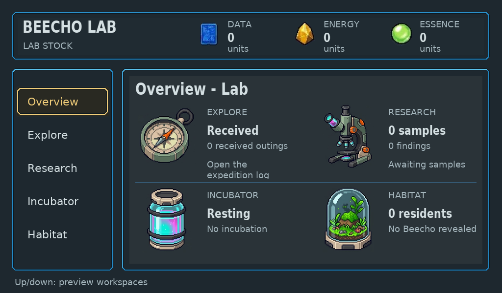
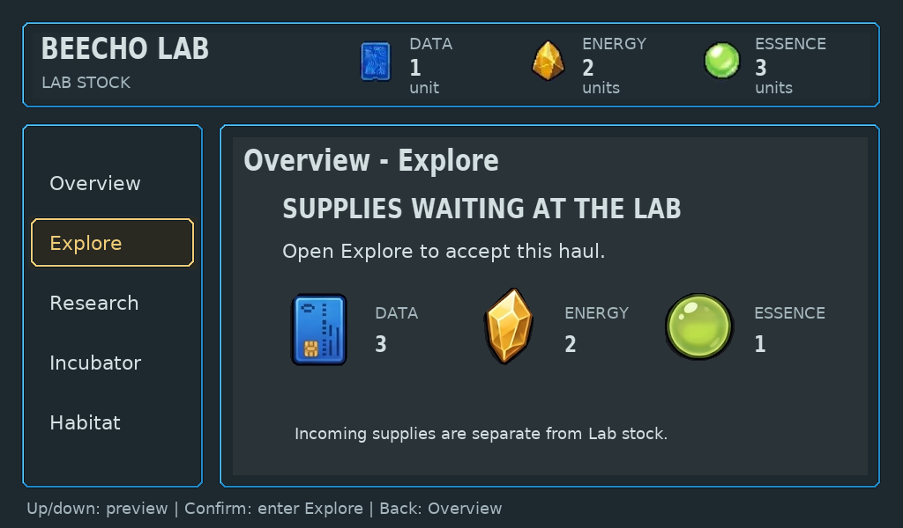

# Native Lab Home and workspace previews

Bounded implementation and independent technical/craft review passed on source
`5bd03dfbeac318d12c7ae4408fceb5d54d01a6e1`. The source was pushed, then fetched through Git and built
from a clean checkout using the existing native toolchain. This is host evidence,
not Raspberry Pi GPIO/display, MCU runtime or physical hardware validation.

Home and all five focused workspace previews now compose through retained LVGL.
A plain copied view separates game/save/transfer authority from widgets. Native
anti-aliased fonts, exact destination/resource/resident assets, bounded text,
connected contours and a quiet warm selection replace Home's manual compositor.
Connected device frames, generic Kit frames and standalone exports use the same
tree. Malformed or failed migrated Home output has no manual fallback.

## Changed behavior and evidence

- Existing stock, incoming/accepted ownership, research totals, incubation,
  saved resident identity and visits are retained. Preview/enter/Back/Home cannot
  spend, send, reveal or perform care. Input and game authority are unchanged.
- The received-expedition illustration clears its guidance; long IDs and counts
  wrap within allocated fields. A missing/corrupt original remains Portrait pending.
- `lab_home_ui_checks`, `selected_lab_native_checks` and `three_device_kit_checks`
  passed. Checks cover projection immutability, malformed state, original-art
  guards, equivalent frame routes, physical fresh gestures and display lifetime.
- Actual fresh `serve` and `kit-serve` sessions each exported all five Home
  previews through directional inputs. See [CLI trace](cli-trace.json).
- Companion including its lazy resident tree, Dock and Home stayed alive together.
  Two identical full-device 100-update cycles reached the same allocation level.
  Reported used payload was 147,744 bytes, peak 149,280; initial full-cycle difference
  was 16 bytes and the next was 0. The configured raw LVGL pool remains 256KiB;
  reported effective pool accounting is distinct. No named cache or hardware fit
  is inferred. [Native check output](lab-home-checks.txt).

The [frame manifest](manifest.json) distinguishes synthetic retained-fact fixtures
from actual fresh navigation. Fixture births, hauls and maximum values are not
claims of played acquisition. Nineteen fixture exports were inspected, then the
corrected maximum/empty Overview frames were checked again. Independent review
accepted this bounded composition, hierarchy and technical slice.

## Remaining boundaries

Current [route coverage](../../../native/ui/README.md#screen-coverage-and-target-evidence)
owns remaining migration status; the subsequent [reception/log proof](../native-lab-reception/README.md)
records that family. This Home increment does not
claim all-device framework completion. Final C18 fidelity, richer art, exploration
and research engagement, human playability and hardware remain separate gates.
The live sandbox was not redeployed or reset for this branch proof.
