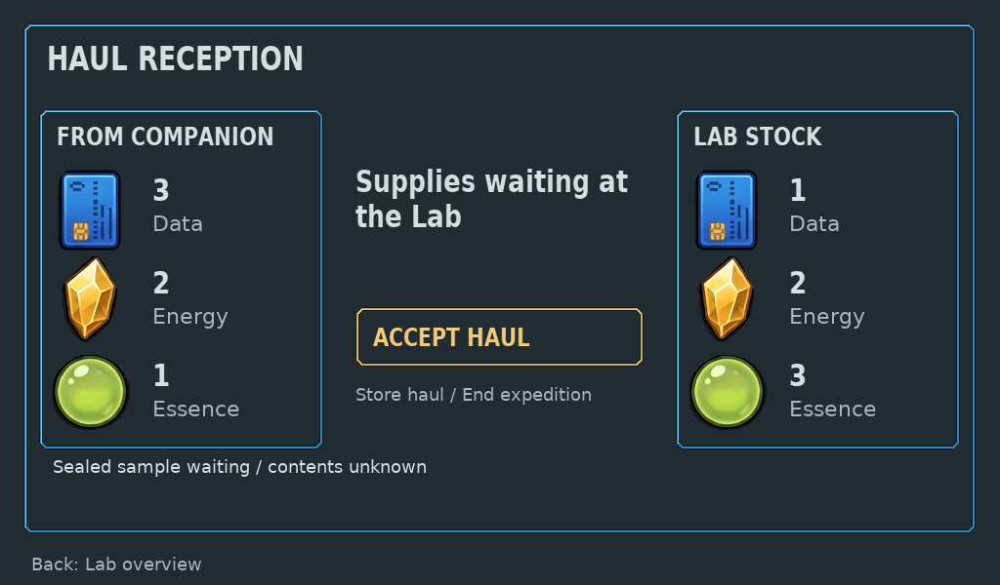
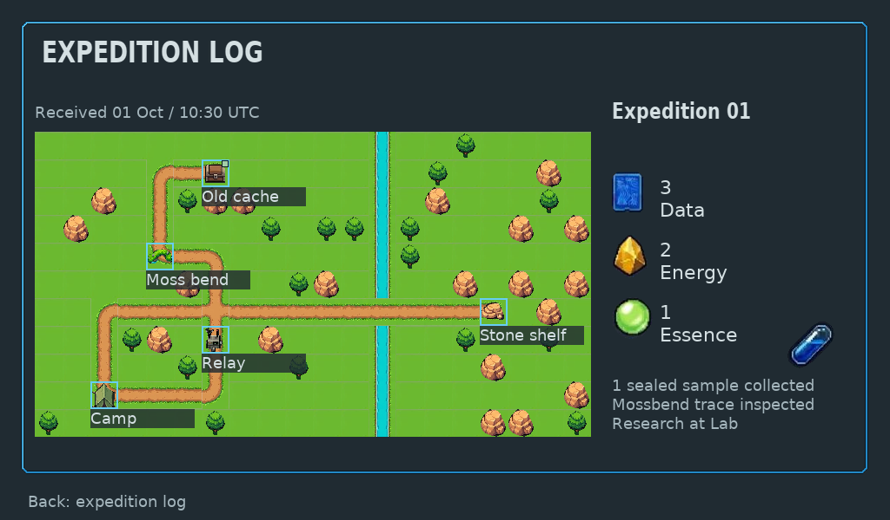

# Native Lab reception and received expedition records

Source `3690de760fc35bf3dbd7fe6ea4345f6d8bcaf831` was pushed to Git,
retrieved into a clean checkout and checked with the established native toolchain.
This is host rendering/control evidence, not Raspberry Pi or ESP32 runtime proof.
Independent technical and focused native art/UX reviews passed this bounded
family. GitHub Actions native target run205 passed the verified source.

The Companion return → Lab arrival → explicit acceptance → received expedition
history journey now uses a copied reception view and retained LVGL composition.
Connected device and generic frame routes use the same tree; missing or malformed
output fails without a manual compositor fallback. The old connected arrival and
received-log row renderers have been removed. Input, game and save authority stay
in their existing modules.

## Checks and scope

- Independent checks exercised actual Kit transfer, once-only acceptance,
  receipt completion and safe caller return. Saved stock is credited once;
  incoming delivery evidence never grants additional stock.
- COMMITTING recovery displays the actually saved sample when the game commit
  succeeded before receipt storage failed. Unaccepted sample contents remain
  unknown. Storage failures close acceptance while preserving visible facts.
- Invalid source counts, identifiers, recorded maps and copied-view contradictions
  are rejected before unsafe projection or image drawing. Hidden places carry no
  copied coordinates; the received map shows recorded walked paths and visited
  places, never a live Companion avatar or current expedition status.
- Generic and persistent native BMP outputs match. Actual fresh CLI navigation
  opened the empty received log using depicted directional/Confirm inputs, returned
  with Back, and rendered both peer devices. [Trace](cli-trace.json). CLI evidence
  uses `b5887e9ff472ce1fd15ba5ff0ad6d6f7a2a5a9f3`; the final revision adds only the
  all-visited synthetic map check.
- Reception checks passed at final source. Changed interaction/Kit suites passed
  at `4746fecf341a249d6f994cff9d57b286883ffe59`; subsequent changes only repair
  label-strip spacing, preserve empty guidance and add the map fixture.
- Two identical 100-cycle update blocks kept Lab Home/reception, a populated
  Companion resident and Dock alive. Used LVGL payload was 168,456 bytes, peak
  169,976; both blocks ended with 68,072 free bytes. Raw configured pool stays
  256KiB; reported effective allocator payload was 236,528 bytes. Host RGB frames,
  decoded images and draw buffers are separate allocations. Destroy/recreate
  preserved the other device outputs. [Check summary](checks.txt).

Ten synthetic exports cover list/detail/empty, pending arrival, failures,
committed recovery, pending/confirmed receipt, maximum identifiers and all five
recorded places/path joins. They are retained-fact fixtures, not played acquisition
or births. Five played CLI frames cover navigation and peer output. The
[manifest](manifest.json) records provenance, original file hashes and dimensions.

The map uses original 32px Gemini field images through LVGL draw-image primitives;
detail is native 640×352, while the list uses an explicit nearest 0.75 thumbnail
at 480×264 without cropping cells. Native compact resource images and anti-aliased
fonts preserve their source footprints/coverage. Distinct inspection outlines and
collection badges can coexist. Visible place names remain available. The resource
strip was widened after actual-frame review caught wrapping.

## Remaining boundaries

This bounded family does not approve final HiBit environmental art, canonical
composition or human enjoyment.

resident/habitat Lab actions still need migration; standalone legacy expedition
gameplay is excluded debt. [Current route coverage](../../../native/ui/README.md#screen-coverage-and-target-evidence)
owns current status. Physical adapters, radio and hardware performance remain
unvalidated. This candidate has not been deployed to or reset the live sandbox.
