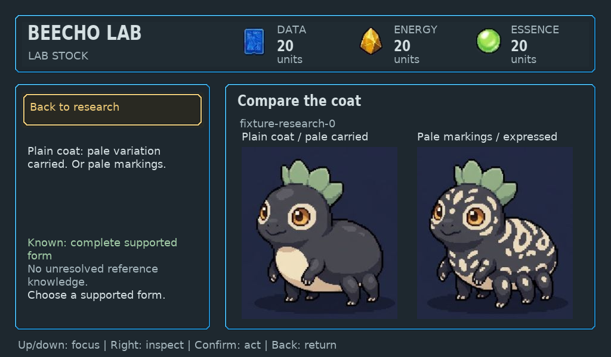
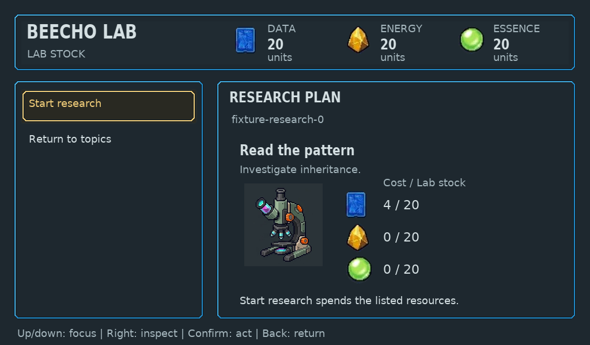

# Native Lab research and Library

Sample collection → sample/topic investigation → explicit research review →
disclosed finding → read-only Library → Back/Home now uses copied presentation
facts and one retained LVGL family. All six existing pages use that tree across
standalone, connected generic and persistent device frame routes. The old manual
research compositors were removed; malformed views fail before any BMP output.
Game, input and save authority remain in their existing modules.

Final source `5a529f92c8ce88c29e83d1b3a8d355d45bb4d971` was pushed, retrieved
through Git into a clean checkout and built with the established native toolchain.
This is host framebuffer/control evidence, not Raspberry Pi or ESP32 runtime proof.
Independent architecture/technical and focused native art/UX/game reviews passed
the bounded migration. Final visual quality and human enjoyment remain open.

## Knowledge and controls

- Unknown samples and partial pale inheritance do not disclose an adult portrait.
  The current complete coat finding requires both supported candidates before
  showing the original 261×289 carried and expressed portraits. Every opaque source
  portrait pixel is checked in the native frame. No screen-sized screenshot is
  used as the composition.
- B's effort discovery keeps the same-action walking conditions and resolves
  Movement for free inspection. Its complete finding remains the existing neutral
  context and disclosed text; the migration does not substitute A's coat portraits.
- Five-topic legacy records, current variable research, used records and Library
  remain readable. Each sample keeps its own known/missing topics and next step.
  Whole-unit costs are separate from stock. Library rows preserve the full
  maximum-length sample identifier and topic without clipping.
- Actual physical inputs exercised safe review cancellation, fresh explicit
  research spending, free inspection, Back/Library return and save reload. Rendering
  did not mutate sample knowledge, inventory or Kit state. Invalid counts,
  unterminated source/copied strings, unsupported early candidate disclosure and
  contradictory portrait permissions fail closed.
- Source `4ec6fedf79c67ff31e3e806fa99ad82453578055` passed the changed research,
  Lab input and three-device Kit suites (3/3). The final revision adds the maximum
  stock/full-message fixture and the reviewed feedback inset; its research checks
  passed again. No unchanged broad suite was repeated locally.
- Fresh connected CLI inputs opened Research and empty Library, returned with
  Home/Back, produced identical generic/device native frames and rendered both
  peers. [Trace](cli-trace.json). This navigation proof uses `4ec6fed`; it does not
  claim played sample acquisition or birth.

## Native composition and lifetime

The tree borrows the Lab context's immutable original art and anti-aliased font
descriptors. Neutral research tools, crown/eye-ring references and complete coat
portraits keep their original footprints. The selected original frame contour and
quiet focus treatment remain shared with Home and reception. Findings, costs and
feedback have reserved regions; the full 95-character recovery message fits in
two lines with roughly 8px bottom clearance.

Lab Home, reception and research roots remained alive alongside a populated
Companion resident and Dock for two 100-cycle blocks. LVGL used 195,096 bytes,
peaked at 197,072, and ended both blocks with 38,024 free bytes. The raw 256KiB
configuration is unchanged; measured effective allocator payload was 233,120 bytes.
Host RGB frames, decoded images and partial draw buffers are separate allocations.
Lab destroy/recreate preserved both peers. This does not establish MCU fit.
[Check summary](checks.txt), [native output](native-checks.txt).

Fifteen synthetic retained-sample exports cover collection, unknown/topic/review,
partial/incomplete/complete A, complete B, legacy, used records, Library, maximum
identifiers and maximum stock/feedback. Six real CLI frames cover fresh navigation.
The [manifest](manifest.json) records exact sources, hashes and dimensions.

## Remaining boundaries

gameplay still need migration. The [route inventory](../../../native/ui/README.md#screen-coverage-and-target-evidence)
owns current coverage. This change preserves existing discovery rules; it does
not approve a new discovery minigame, canonical HiBit art, hardware, radio or full
Core V1 enjoyment. The candidate has not been deployed to or reset the sandbox.
