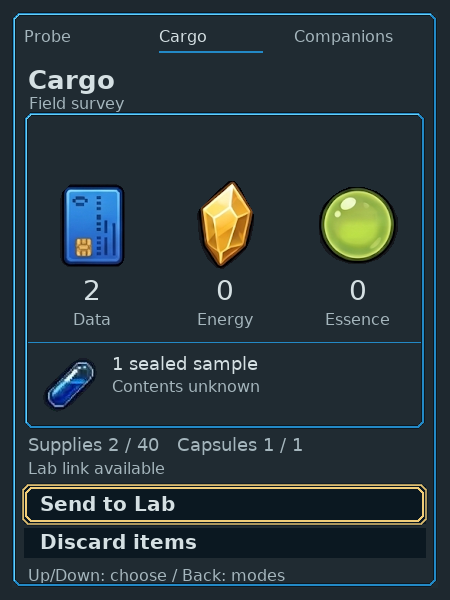
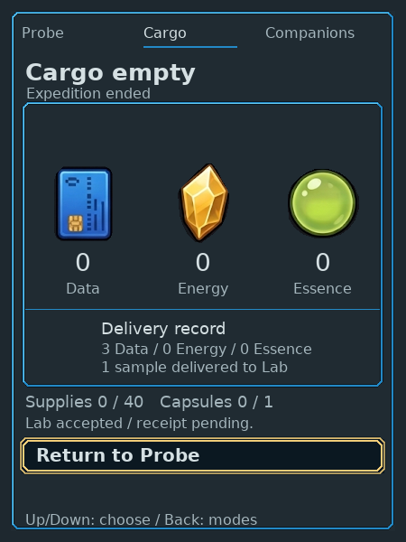

# Native UI foundation — Companion Cargo

Bounded host proof of LVGL 9.6.0, using the actual Companion Cargo page at 450×600.
Native code owns the pixels: retained labels, images, buttons, grid/flex and stepped
line frames. The presenter displays the resulting bitmap; this is not an HTML
screen painted over the game. This packet records the first Cargo increment.
The [subsequent Probe composition](../native-companion-probe/README.md) now shares
its retained display/context. Lab, Companions and Dock retain existing renderers.

## Player journey and evidence

Exact clean/pushed source `ae93a07c73d643cc296cb802f425b881e139566f` built on the
existing build machine. Domain, Cargo UI, Lab and Kit checks passed; all native target
CI 36810823393 passed. Prior source d3e536c also passed the existing seven presenter
bridge checks and real HTTP/native handoff/link/endpoint checks; final correction
changes only retained frame composition and representative exports.

The automated walkthrough covered the fresh isolated native journey with existing depicted
controls. Final acceptance delivered 3 Data and one sample, then current Companion
supplies/capsules became zero and Back returned to mode selection. Frame/fixture
exports in [manifest.json](manifest.json) have exact hashes and evidence labels.
Opaque sprite pixels were compared at their four actual native origins: zero RGB
mismatches. Independent technical review passed the final delta, lifecycle/pool
and exact runtime results. Independent art/UX output review passed this bounded
Cargo composition: connected stepped frames, safe focus/footer gap, current-zero
capsule visibility and full/error text fit. Visual inspection covered the same frames.
This is not approval of whole-game art or enjoyment.

Measured final ELF: text 3,976,705, data 6,208, bss 263,520; total 4,246,433 bytes.
Two-context LVGL pool: 39,984 used / 254,152 total bytes. Controlled actual-save
export process peak RSS 6,500KiB, elapsed 0.10s. Original save/Kit/required hashes
matched before/after copied-save export. Process timing is not a frame-rate claim.
Deployment status is reported by the sandbox release endpoint.

The intended proof is actual gathering and sample collection → Cargo with whole
counts and a carried capsule → Send review and safe cancellation → explicit Send
→ Lab acceptance → current supplies/capsules zero with a separate delivery record
→ Back to mode selection. Read-only current facts drive the UI; render/animation
cannot acquire, transfer, tick game time or spend resources.

Representative full 40 and storage-error exports are layout fixtures, not earned
play or a storage-failure reproduction. Actual-save still and 0/60/120ms focus
exports use a copied save with unchanged original hashes. They establish a
controlled presentation clock only: live host intentionally renders still focus,
with no continuous animation or audio backend claimed.

## Reusable boundary and limits

Kit remains the sole input/focus/action authority, including fresh-gesture,
visible-frame and held/suspended safety. UI receives copied facts and owns its
widget tree, point arrays, label buffers, assets and display buffers. Source-exact
primary material sprites remain native 1×; the font adapter uses retained Vera
coverage. Vendor source is unchanged and hash-pinned with its MIT license.

One live host context, two-context lifecycle checks and single-context controlled
motion are the validation scope. Host pool/RSS measurements cannot establish
Companion memory/DMA/frame rate, RPi display drivers, power or physical readability.
Arbitrary internal LVGL allocation failure is not a validated recovery path.
This is a framework and bounded Cargo craft proof, not final HiBit game art,
whole-family migration or human enjoyment/comprehension acceptance.

Design review permits complete re-layout. The considered [Companion direction](../../../specs/experience.md#visual-meaning-accessibility-and-device-adaptation)
uses shared orientation with distinct workpieces, not one mandatory dashboard.
Next composition should reclaim useful subject space and test physical return
paths; importing a framework does not create richer terrain, discovery or creatures.

## Native screen walkthrough

Carried items and a real sealed sample:

After Lab acceptance, current counts are zero; the delivery record is subordinate:

Full40 and storage recovery are separately labeled presentation fixtures. They
check fit, not earned capacity or a reproduced storage failure. Send review and
Lab reception exports retain the old renderer in this slice; cross-page visual
continuity remains a subsequent migration task.

## Earlier compiler baseline

On26September2026 an Ubuntu26.04 x86-64 host with isolated Python3.12 built the
earlier Lab, nRF Probe and Companion scaffolds. Five native and five HTTP checks
passed; the browser completed expedition/offload, Structure study and a saved
finding reload through HTTPS. Probe linked105,228 bytes flash/13,496 bytes RAM;
the old Companion image was222,736 bytes. These historical row-demo measurements
are not current Companion UI size or application-capacity forecasts. No MCU boot
or panel operation was observed. Toolchain pins matched the manifest.
