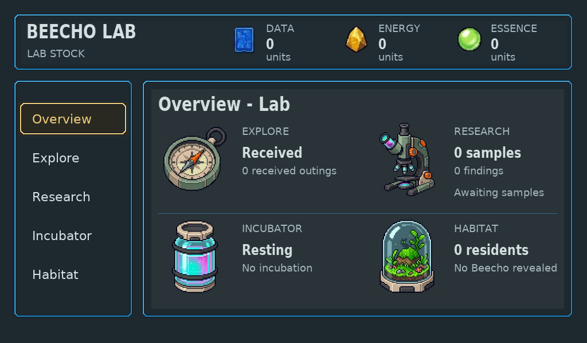

# Device copy: focus instead of repeated tutorials

Routine Up/Down/Confirm/Back and workspace-preview instructions are removed across all three device families. Actual costs, committed consequences, state/progress, reception ownership and recovery errors remain. Focus and depicted-control feedback carry navigation.

Seven fresh connected depicted-control exports were captured from pushed source79369f0658d8024ef65c9e317016fdd33629ddb3. The [trace](trace.json) exercises Home/Research/workspace preview, Companion Probe/Cargo/Companions and Dock. Independent actual native art/UX inspection passed this copy delta; it is not approval of every pictured artwork. Existing rejected incubation art remains visible and unresolved.

PNG conversion only; no browser composition or painted annotations. [Hashes and exact provenance](frames.json). Later action screens follow the same rule; [creation/incubation evidence](../native-lab-actions/README.md).
