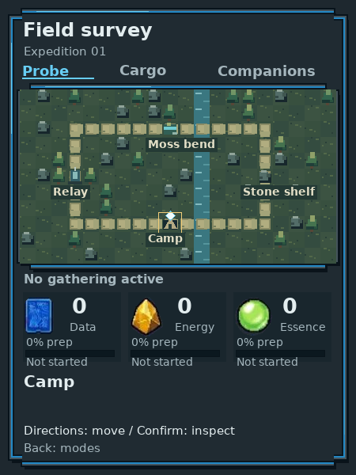
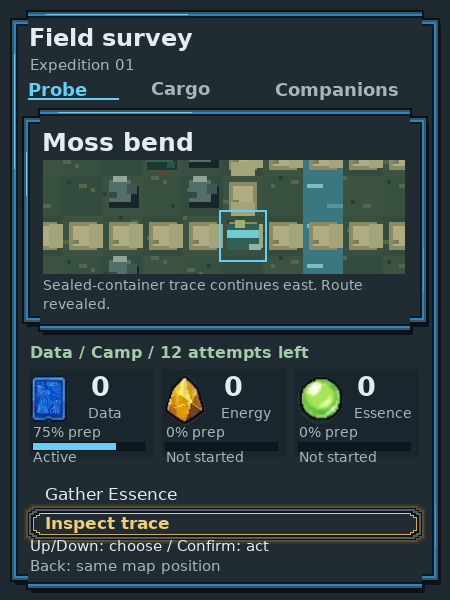
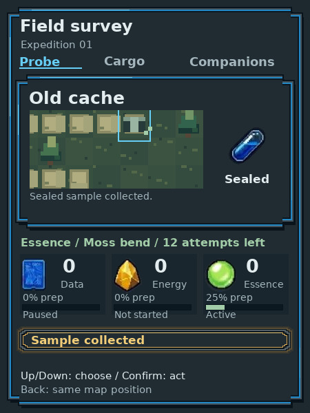
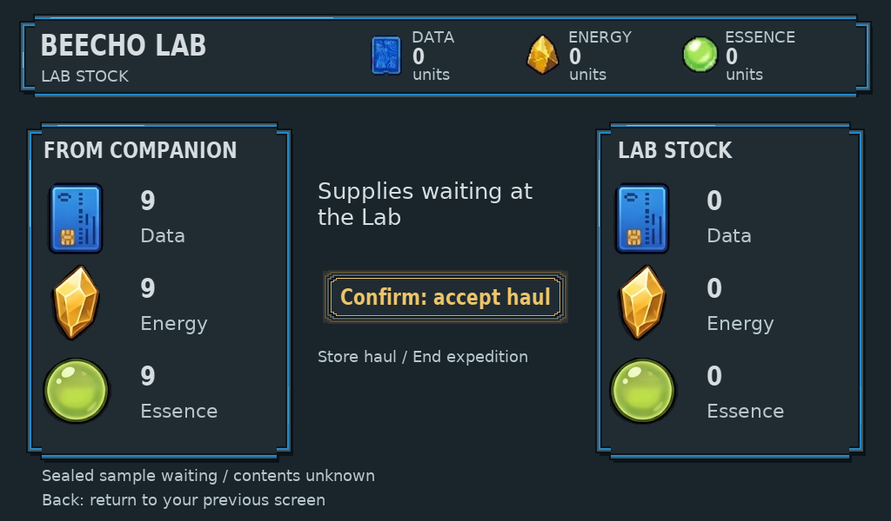
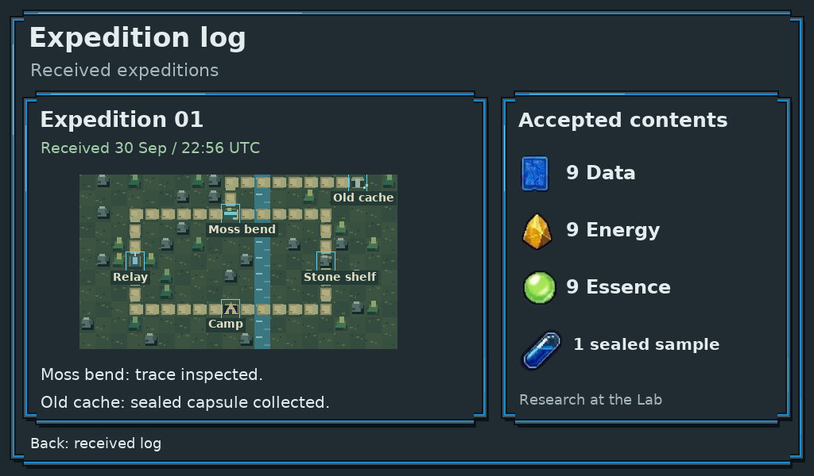
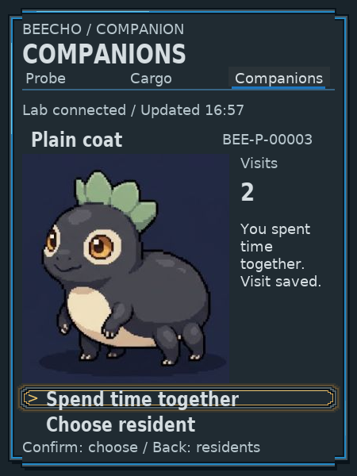
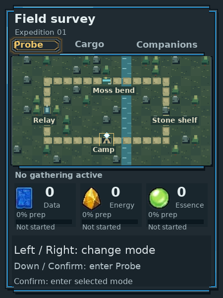

# Playable Companion expeditions

Actual native frames from an isolated fresh three-device save. Inputs used the
depicted buttons, with real gathering/incubation time and no resource grants.
[Image hashes and exact sources](manifest.json) distinguish the complete journey
from the later focused mode-label correction. Existing domain/input checks and
changed HTTP projection checks passed on clean pushed revisions.

## Steer, gather and investigate

Directions move along legal paths. Confirm at a named place opens actions.
Camp offers three resources; one source works while the player explores.
Switching retains each class's preparation and finite source budget.

Inspecting the trace reveals a route, without awarding supplies or a sample.
The player walks to the Cache and explicitly collects its sealed capsule.

## Return and receive once

Return review defaults to Keep. Cancellation and process restart retained map
position, trace, capsule and source budgets. The real-time sequence earned9 Data,
9 Energy and9 Essence, sealed them and credited them once on Lab acceptance.

Lab Explore shows only received records. Its ordinary overview/status/frame do
not expose away cargo, preparation or hidden map content. Post-acceptance Back
restored the caller; Home and the mode rail remained usable.

## Continue the same world

The accepted sample completed three paid investigations, retained its findings,
used a reversible form draft and separate creation commitment, incubated and
revealed one resident. One Lab visit and one Companion visit reached the same
saved individual; Dock showed one resident, one sample and two visits.

A second Garden forage supplied one Data without another sample: two received
expeditions, one sample. Probe was reusable after the matching receipt.

## Evidence limits

game/UX review covered the complete journey and focused mode-label correction;
the producer's fidelity checks are separate from that acceptance. The original
Gemini sprites and approved map study remain the visual sources, not new mockups.

Two topology families, three outing labels,12 attempts per source,4-second
preparation and75% awards are provisional fixtures. No GPS, capture, training,
ecology, cloud play, physical radio or hardware performance is established.
Human enjoyment, comprehension and balance require player observation.
Sandbox activation is separate from these source-level results; its release
endpoint identifies the actual running version.
