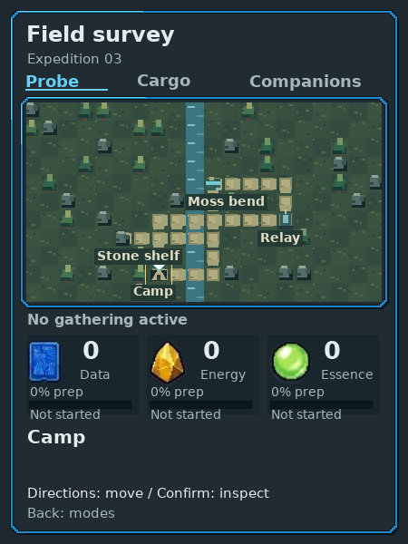
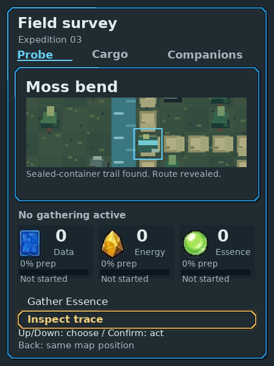
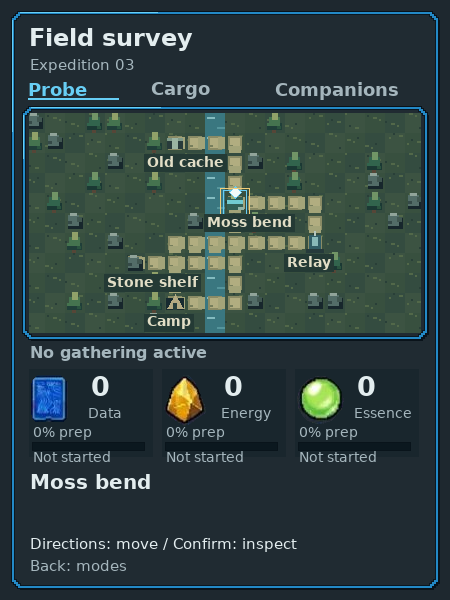

# Saved procedural expeditions

Actual native control proof for [PR55](https://github.com/PacoCotera/critter-lab/pull/55),
production source `e89c2dbc139899aa3a561081916cbdaa6a9a00ec`.
The automated walkthrough exercised the native device protocol with the depicted directions,
Confirm and Back. These are native450×600 exports, not concept art or browser cards.
No developer grant, time warp, map rewrite or screen-click shortcut was used.
[Capture hashes/revisions](manifest.json) distinguish the first pre-copy-correction
walk from the corrected second walk; their generator and art are identical.

## One connected journey

1. Start a new outing. Camp, sources, corridors and terrain are generated from its
   saved seed. Here Camp is(17,9), Moss(4,4), Relay(15,7), Stone(7,7).
2. Walk actual arrows from Camp to Relay, then Stone and Moss. Movement earns no
   supplies; named places expose the existing deliberate actions.
3. At Moss choose Inspect trace. The previously concealed route becomes visible.
   Follow it to Cache(12,1), inspect and explicitly collect its neutral capsule.
4. Review Cargo and choose Send. Lab opens reception. Accept once there; the
   Companion's current capsule clears while its delivery record remains. Dock
   shows the accepted sample. The source expedition ends.
5. Start another outing. Its Camp(7,9), Moss(10,4), Relay(14,6), Stone(5,7) form a
   different route. At Moss the corrected trail text makes no false compass claim.
   Walk north then west to Cache(7,1) and explicitly collect the next capsule.

[First Relay](outing-one-relay.png), [first revealed route](outing-one-map-revealed.png),
[first capsule](outing-one-sample.png), [Lab acceptance](lab-sample-accepted.png),
[empty current Companion Cargo](companion-empty-receipt.png), [accepted Dock](dock-accepted.png),
[second capsule](outing-two-cache.png).

## Validation and limits

Exact clean pushed source was built with the established native toolchain.
All three native suites and actual HTTP/native frame, handoff, link-recovery and
endpoint checks passed.64generated seeds check distinct geometry, essential
reachability, cache concealment and save stability without consuming gathering
chance state. Frozen actual legacy odd/even maps and a pending sealed receipt
retain version1 geometry, credit once and permit a new version2 outing. Unknown
versions/edited geometry are rejected. Save/journal layouts are unchanged.

The architect checked version/save boundaries before coding; an independent
technical/domain reviewer checked generation, legacy records and once-only
transfer. Actual output review by UX/art caught a false fixed-east message;
neutral feedback was corrected and re-exported before delivery. Final review
results are recorded at the PR. These checks are automated functional and
visual evidence, not human enjoyment or physical-display validation.

This closes fixed-template geometry for new outings. Place roles, source chance
work, sample A/B content and trace-to-cache structure still repeat. Interactive
map events, richer sample acquisition, research workpiece and broader Gemini/C18
art fidelity remain open. No new art masters, radio, hardware or service was added.
