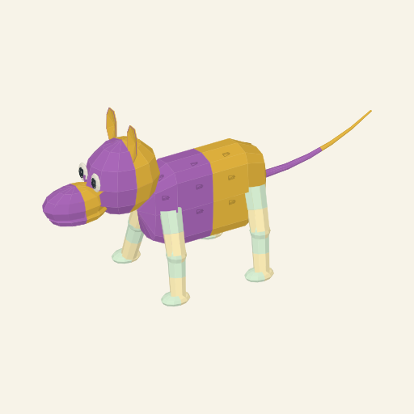
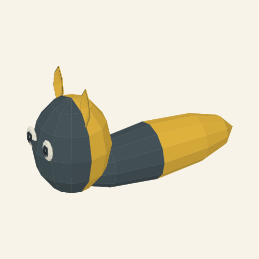

# Copied ears, continuous tail and primary-coat source

Actual workbench evidence from 3 October 2026. Functional source
`993cda7de55cc5849bea23cd491cf43f51b452d0` includes the anatomical increment
`7be1cce0649848a0033bb6898565c8b71b76a62f` and the inspected pigment-owner wording
correction. Normal production builds and unchanged automatic CI passed
([source run](https://github.com/PacoCotera/critter-lab/actions/runs/37118196604),
[wording run](https://github.com/PacoCotera/critter-lab/actions/runs/37118884374)).
No new tests, batteries, discretionary test runs or CI expansion were added.

Catalogue3/rule3/source5/material3/reference5 requires **111 explicit copied
pairs**, including seven new optional ear/tail contributors. Six drafts remain
unsupported; eleven branch headings do not establish complete genomic loci or
working phenotype coverage. The five empty branches remain open.

## Authored input and source

The Compendium saved fork `7ac2b1bbd319463f`, revision1, selected it, explicitly
loaded the complete starting copies and resolved `compositional-1e68c54653ef683767f2`.
This is a new parent3 input, not an upgrade of an older104-pair creature.
[Exact record](authored.record.json) retains the parent, all111 copies, versions
and digests; [the manifest](retained-inputs.json) indexes the contributors.

The source shows one barrel primary, head/muzzle/eyes, two head-rooted ear
sheets, one continuous tail and four contact chains. Plum/marigold body fields
and milk mint/butter leg fields retain copied ownership. The primary has the
expressed fur field; head, ears, tail and legs stay smooth. [Displayed SVG](authored.svg)
and [actual bench](authored-workbench.png) are retained. PNG rasterizes that SVG
without artwork changes.

The exact [copied final Gemini prompt](authored.prompt.txt) is:

> Turn the attached critter into a cute pet, shown alone in rich high-bit pixel art. A creature with one softly squared, barrel-shaped body region and one smooth head, one projecting muzzle, two eyes, two rounded smooth ears, one smooth tapered tail and four jointed legs with rounded ends. Its body has plum-and-marigold fur; its smooth jointed legs have milk mint-and-butter local colour fields.

[Initial wording](authored.initial.prompt.txt) used "smooth appendages" too
broadly for leg-owned colours. Actual art/production inspection identified the
ambiguity; source5 now names the actual secondary-palette chain/flap owners.
Geometry, inputs and scene identity did not change. Source3/4 literal wording
stays on its original path.

## One ordinary Generate draw

One Generate action on the same definitions produced `compositional-929af950f521d6ee2319`,
seed **4212583450**, attempt **1**. No appearance ranking, curated replacement
or second draw was used. [Exact record](ordinary.record.json), [SVG](ordinary.svg),
[copied prompt](ordinary.prompt.txt) and [bench](ordinary-workbench.png) are retained.

This draw has a smooth charcoal/marigold primary, head and two pointed ears;
legs, tail and fur are absent. Its brief describes those actual roles. This
shows optional parts in this draw, not accepted broad animal range.

## Recovery and actual disposition

After corrected-revision activation and reload, both new source5 records
verified from inputs under their parent3 rules. Older authored104-pair source4
`compositional-3d0b154a2ee771514d17` and published catalogue2/source4
`compositional-4247afaaa32148297977` reopened under their original identities.
[New authored](authored-replay.txt), [ordinary](ordinary-replay.txt),
[old authored](previous-authored-replay.txt) and [old published](previous-stock-replay.txt)
recovery retain visible results. [Eight older saves](preserved-saves.png) were
preserved; no Save action replaced them.

Independent source/domain inspection accepted the bounded implementation and
colour-noun repair. Art direction and pixel production inspected the authored
image and conferred directly; art direction also inspected the ordinary image:

- **Tail: narrow source-readability pass.** One attached continuous taper is readable.
- **Ears: provisional / craft HOLD.** Count/root are clear, but narrow blade-like
  sheets communicate little bowl/fold depth.
- **Coat: HOLD.** Isolated rectangular/scratch clusters do not read as continuous
  coat or fringe. The ordinary draw has no fur and supplies no new coat evidence.

The next boundary is owner-scale coat continuity and meaningful auricular
breadth/depth, rather than more contrast or dash duplication. Full eleven-layer
locus authoring, missing consumers, rich terminals, markings/partial coats,
accepted bear/cat/cow/firefly range, linked returned pet art and animation remain
unfinished. No external pet image was requested; these are static source references.

The art-reset link in this folder's snapshots was re-pointed on 2026-10-09 to [art-reset/README.md](https://github.com/PacoCotera/miniaturebeasts/blob/main/v1/prototype/generator-workbench/evidence/art-reset/README.md) in this repository; the snapshots are otherwise as captured.
