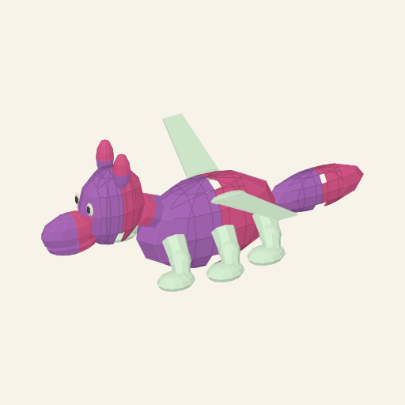

# Retained anatomical V1 — rejected fixed-family output

These are actual local browser Generate results from fb355f8a63da9ce94ae3e958e5ba5c2ecfb86524, not authored design tuples. Their retained inputs are linked below. Design review rejects their repeated head/neck/core, four/six supports, optional posterior and wings. Dimensions, pigments and module switches derive from copies, but the main organization is hardcoded. These images establish the observed implementation failure, not broad variability, useful illustration quality or accepted pet art.

| Actual generation | Retained compact input | Browser image |
| --- | --- | --- |
| anatomical-d762d8a0ec2a70214686; seed3013481804, first candidate | [record 1](generated-01.record.json) | [actual workbench 1](workbench-01.png), [complete SVG](generated-01.svg), [PNG preview](generated-01.png) |
| anatomical-272a7945cad61b841ae5; seed1571417441, first candidate | [record 2](generated-02.record.json) | [actual workbench 2](workbench-02.png), [complete current SVG](generated-02.svg), [PNG preview](generated-02.png) |

The second SVG extraction initially reached the browser's 200,000-character text-return limit. It was read again in DOM chunks and assembled outside the page to preserve its complete XML. Both complete SVGs were rasterized directly for PNG previews; their screenshots and compact inputs remain intact. No genome or expression was regenerated to create those previews.

The practical prompt was exactly:

> Turn the attached critter into a cute digital pet, shown alone in rich high-bit pixel art.

The PNG control displayed a completion notice, but the in-app browser returned no download file. The notice alone does not establish download success. No new provider image, animation, native/game activation or hardware evidence is present here. The separately versioned compositional correction is documented in the [current guide](../../README.md#current-construction-and-evidence).
