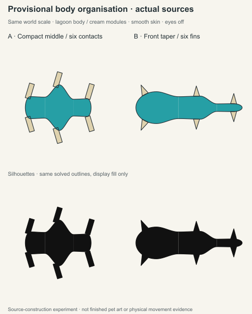
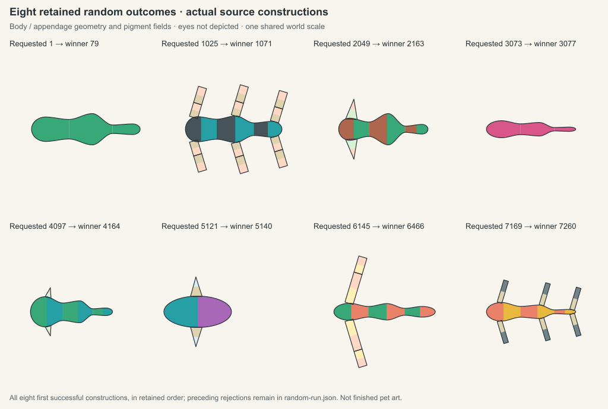

# Inherited body organization experiment

Design review rejected the repeated chained bulb creatures. Equal station lengths,
symmetric width growth and a fixed .65 neck between every region were forcing
that silhouette. Shorter prompts and different pigments did not correct it.

This separately versioned source experiment adds two inherited contributors:
regional growth allocates unequal lengths and widths before roots are built;
join ratio controls the throat between adjacent regions. Both act through one
shared constructor. A species or specimen label never selects a body template.
The catalogue contains 50 executable records and six unchanged drafts. Its
content and proportions remain provisional.



At the same 256px scale, A has a compact dominant middle with six short contact
appendages; B has a broad leading region, progressively tapered rear and three
fin pairs. The black row changes display fill only. Both coloured sources use
actual inherited lagoon body and cream appendage pigments with smooth skin.
Eyes, markings, membranes and axial deformation are explicitly off in these
worked inputs. Rectangular contacts and pointed fins remain construction
envelopes, not finished organic limbs or pet art.

Art direction and the production artist inspected this actual sheet: the
organization difference survives removal of pigments, all six roots are visibly
attached and no clipping is visible. That is a source-organization pass only.
These images are the body-only proof. The separate [full-scene workbench
integration](../regional-scene-workbench/README.md) connects the same inherited
geometry to Generate, actual optional eyes and skin/scales; it preserves these
body-only records unchanged.

## Retained inputs and uncurated generation

[manifest.json](manifest.json) identifies four complete worked source records:
A, B, an A variant changing only inherited growth, and a single-body control
where growth and join copies are carried but inactive. The paired packet and
construction files retain the entire input, resolved facts, geometry, root
frames, material domains and identities. No worked input required repair.

[random-run.json](random-run.json) retains eight predetermined non-overlapping
search windows starting at `1 + i * 1024`, for `i = 0…7`, using the unchanged
1024-draw ceiling. Every attempted seed, rejection stage and error is retained,
with the complete winning source. No quota, replacement winner or attractive
result selection was used.

| Requested seed | Winning seed | Draws |
| --- | --- | --- |
| 1 | 79 | 79 |
| 1025 | 1071 | 47 |
| 2049 | 2163 | 115 |
| 3073 | 3077 | 5 |
| 4097 | 4164 | 68 |
| 5121 | 5140 | 20 |
| 6145 | 6466 | 322 |
| 7169 | 7260 | 92 |

There were 748 draws: 291 genetic rejections, 449 construction rejections and
eight winners. Construction still excludes radial organization, membranes,
deformation, marks and invalid roots. These results do not establish broad
creature coverage, a population distribution or full visual expression of every
retained fact. Body-only construction does not depict the retained ocular and
covering modules.



The [random-sheet manifest](random-comparison-manifest.json) retains each
construction identity and the input/output hashes. One shared camera preserves
relative size; neither the artist nor the compositor selects results. The
actual sheet has seven three-region bodies, one single-region body and two
appendage-free outcomes. Several remain thin axial forms. This is evidence of
changed proportion fields, not acceptance of the wider creature-diversity brief.

## Reproduce and inspect

Use the existing host Node runtime from the workbench directory:

```sh
node --test body-organization.test.mjs
node construct-body-organization-proof.mjs --out evidence/body-organization
node evidence/body-organization/draw-comparison.mjs
node evidence/body-organization/draw-random-comparison.mjs
```

The compositor uses the existing installed Sharp library. It consumes the solved
source outlines directly, at one camera and scale; it does not redraw anatomy.
[comparison-manifest.json](comparison-manifest.json) retains the input and output
hashes. One final regeneration reproduced all ten JSON exports and the comparison
SVG, PNG and manifest byte-for-byte.
The added eight-source sheet also reproduced its SVG, PNG and manifest exactly
in one regeneration, leaving the retained random inputs unchanged.

Seven focused checks passed on the held source, including unequal length
allocation, five-station interpolation, mixed inherited growth, join effects,
inactive single-body controls, malformed source rejection and oversized fin
rejection without repair. Literal historical result, construction and SVG
hashes remain unchanged for graph-source/1. Independent review passed the held
source and all retained identities/accounting. Node22 host-proof and the existing
framework build passed in [CI37090499527](https://github.com/PacoCotera/critter-lab/actions/runs/37090499527)
on clean pushed source revision `ceba203c8840e25f7fa86eba59e5507a32d37ac6`.

The next use of an accepted source image keeps the same creative instruction:

> Turn the attached critter into a cute digital pet, shown alone in rich high-bit pixel art.

No new renderer request or pet illustration was made for this source proof.
Historical records remain unchanged. This experiment does not approve canonical
anatomy, physics, movement, animation, hardware or game integration.
