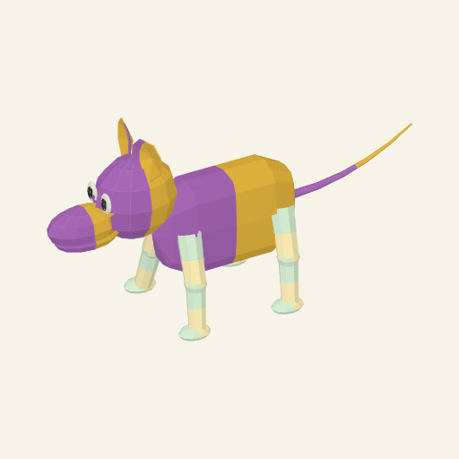
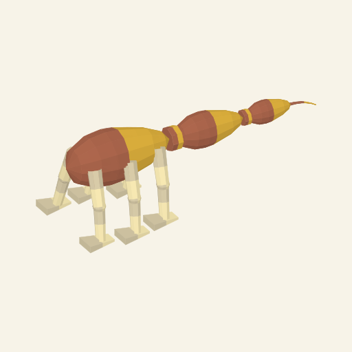
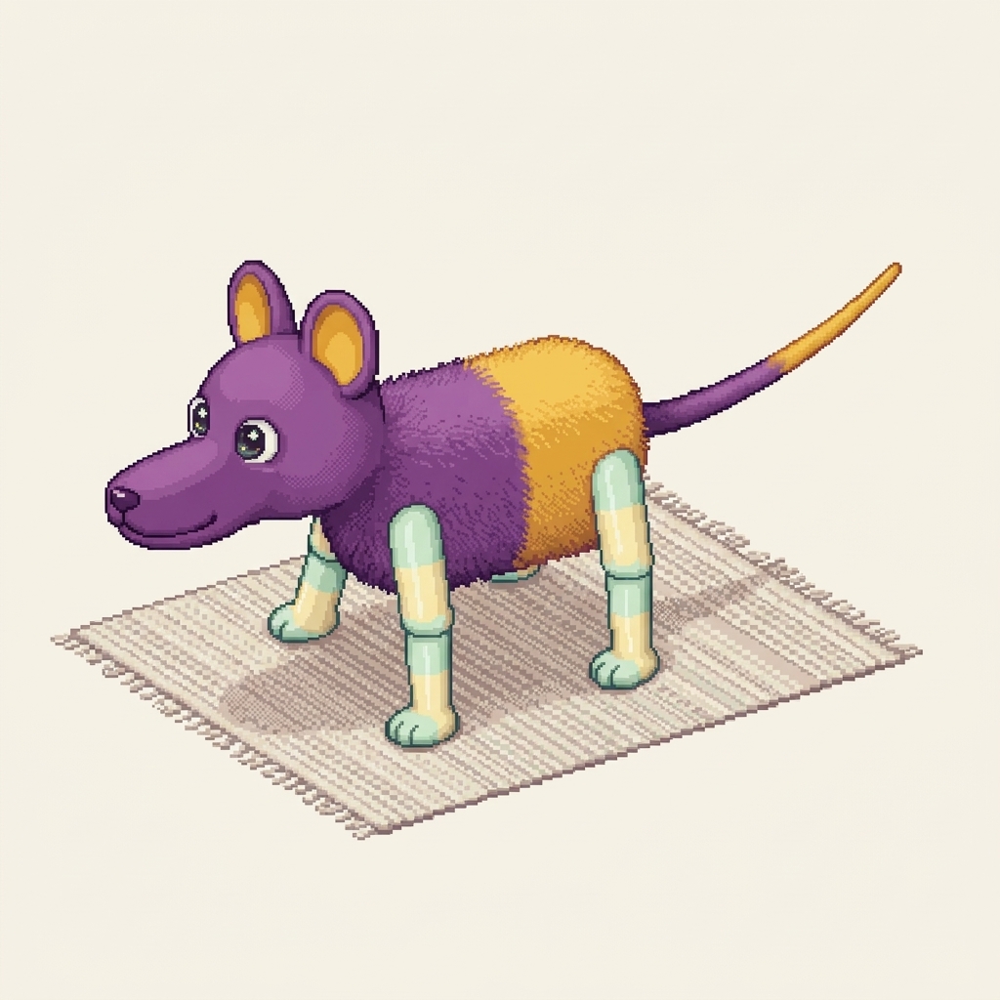

# Connected primary covering and one returned pet proposal

Actual workbench use on 3 October 2026. Source construction is committed at
`8736d219c05c4dfea45a89d2333a3fca16f70bbb`; its unchanged existing
[automatic CI](https://github.com/PacoCotera/critter-lab/actions/runs/37123463516)
passed. Catalogue4/rule4/source6/material4/reference6 adds a connected primary
mantle and broader concave ears. Previous profiles remain available unchanged.
No new tests, batteries, discretionary test runs or CI expansion were added.

## Exact source input and brief

The authored fork `5bdd6136b60d4b2e`, revision 1, carries the same
111 ordered allele pairs as the [previous authored source](../anatomical-roles/authored.record.json).
It uses a new, explicitly pinned parent4 representation foundation; it is not
the same whole versioned input. Resolve produced `compositional-91f86f3171bd1bca11d5`.
The [record](authored.record.json) and [manifest](retained-inputs.json) retain
copied inputs, versions and source/result digests.

[The original SVG](authored.svg) and [actual bench](authored-workbench.png)
are retained. PNG rasterizes the original SVG without art edits. The exact
[copied brief](authored.prompt.txt), attached with this source image, was:

> Turn the attached critter into a cute pet, shown alone in rich high-bit pixel art. A creature with one softly squared, barrel-shaped body region and one smooth head, one projecting muzzle, two eyes, two rounded smooth ears, one smooth tapered tail and four jointed legs with rounded ends. Its body has plum-and-marigold fur; its smooth jointed legs have milk mint-and-butter local colour fields.

## One ordinary draw

One Generate action on these definitions produced `compositional-f1ed857973efd7310d71`,
seed **2719714476**, attempt **1**. No replacement draw or appearance ranking.
The [record](ordinary.record.json), [SVG](ordinary.svg), [prompt](ordinary.prompt.txt)
and [bench](ordinary-workbench.png) retain this actual headless three-region,
six-leg, smooth-tail result.

This draw and the authored source expose optional roles; they do not establish
broad animal range. Art direction and pixel production both found the new
mantle still smooth rather than clearly furry, and ears still blade-like with
weak bowl depth. **Source coat and ear craft remain HOLD.** Tail retains its
narrow static readability result. [Old source5 input recovery](source5-replay.txt)
verified under its original identity. Existing saved genomes were not replaced.

## One actual Gemini return

Exactly one Gemini Pro request used the authored PNG and the exact brief above.
There was no correction, retry, new source, genotype repair or provider switch.
The native copied PNG is retained unchanged; a full-size download was not confirmed.

Art direction and pixel production agree this is useful narrow pet craft:
fur reads on the primary body, smooth head/ears/legs/tail remain distinguishable,
and the ears have visible interiors. The output remains **a proposal**:

- Head/muzzle gold fields were lost or relocated; ears gained a new inner/outer
  pigment partition.
- Nose, smile/oral line and toe-like divisions are proposed added details.
- Three complete legs are visible; an occluded fourth chain is unverified.
- A rug was added despite the pet-alone request.
- Exact proportions, ocular pigments, repeatability and native sprite/animation
  craft have not been established.

This positive drawing result does not approve the procedural source coat/ears
or silently change inherited traits. The [manual retention contract](../../rendering-contract.md#manual-proposal-retention)
keeps returned bitmaps beside exact source/prompt bindings, always as proposals.
The clean pushed panel at `1ee9cbc6f75d90fed0562837239c411276e61040`
retained the native image as proposal
`pet-proposal-b7dac63cb31933d1a03f8ff2a02d249b8d1478b5e9984fad0e1f627fbbf89b79`.
After a fresh page load and exact-input replay, the same source recovered the
same linked proposal. [Retained panel](pet-retained-workbench.png) and
[reopened state](pet-reopened-state.txt) preserve that actual journey.
The browser did not confirm its native metadata download; the panel's copy
control supplies the same linked JSON without changing this proposal.
The final copy control at `370fd7cf6269d2e060341b9c23b634555596ff64`
passed its unchanged [automatic CI](https://github.com/PacoCotera/critter-lab/actions/runs/37134953239).
[Actual copied metadata](pet-proposal.metadata.json), [visible copy result](pet-copied-state.txt)
and [reopened panel](pet-reopened-workbench.png) retain exact prompt/source/recipe,
PNG hash, 1024×1024 dimensions and proposal status. Stored bytes match the native
copied provider PNG. This establishes local retention and metadata copying;
native file downloads, cross-browser import and accepted phenotype are not confirmed.

111 carried pairs, six unsupported drafts and eleven branch headings remain a
limited experiment. Five genomic branches lack contracts; other consumers are
missing. Full eleven-layer authoring, accepted bear/cat/cow/firefly range,
complete-genome sharing, accepted pet masters and animation remain unfinished.
