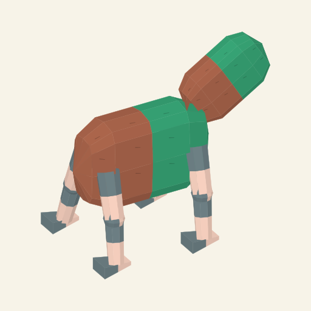
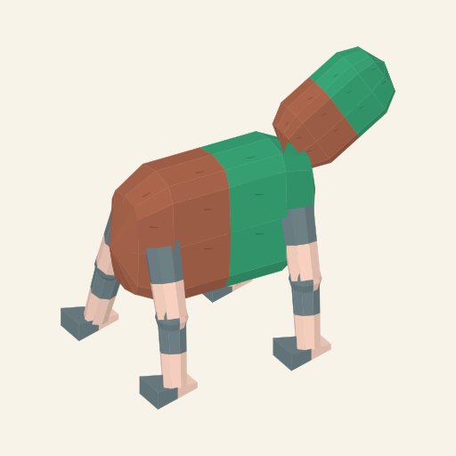
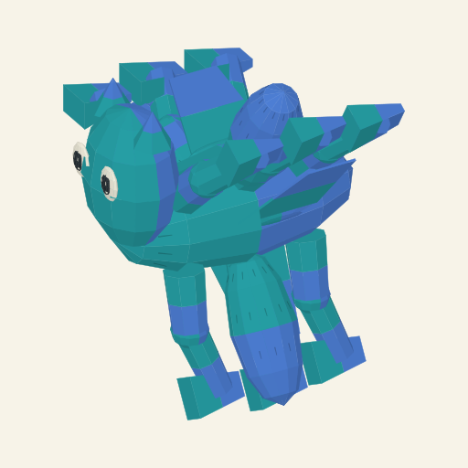

# Compatible genome authoring — actual workbench evidence

The existing compendium now saves a separate versioned definition fork, explicitly selects it, and feeds its contributions to Resolve and Generate. This is bounded authoring for the current experimental union:104 copied pairs, six unsupported drafts and eleven genomic branches. It does not complete the project genome, add new anatomical roles or establish finished pet art.

Functional source: `fb78f44f659f1b400ef8b09f3000095ace30b250`, following the authoring implementation `cfe25de872ecf38344167b1c81e356ab414db5e3`. Normal installed-runtime Vite build and unchanged automatic CI37112599262 passed. Actual UI use exposed a missing-catalogue request crash; the functional revision fixes it and completed the journey below. No new tests, batteries, discretionary test runs, CI changes or provider requests were made.

## Definition edit reaching actual geometry

The explicit starting dictionary comes from the retained current4 input, with only `organization.region-depth` changed to `two/two` and `organization.region-layout` to `serial/serial`. The compendium saved that complete input as authored revision1. It was selected, its starting copies deliberately loaded, and Resolve constructed the source. Then the actual `growth.region-taper` definition's `gentle` contribution changed from .85 to .70 in the editor. Save produced record version2/authored revision2; Use selected those definitions while keeping all104 copy pairs unchanged. Resolve consumed the changed mean in the child body's geometry.

| Actual field | Before | After |
| --- | --- | --- |
| Catalogue | `genomic-compositional-source-draft-96985f03084e4d18@1` | same fork, revision2 |
| Taper definition version | 1 | 2 |
| Gentle contribution | .85 | .70 |
| Ordered taper copies | strong / gentle | strong / gentle |
| UI expressed child-scale ratio | .65 | .575 |
| Actual consuming body owners | 1 | 1 |
| Source record | `compositional-5b0e0b9f0166220432a9` | `compositional-3d0b154a2ee771514d17` |

The reference camera fits each source; apparent pixel sizes are not measurements of the ratio. The UI expression and consuming-owner trace retain the numeric cause. [Definition editor](definition-editor.png), [after trace](after-trace-workbench.png), [before visible trace](before-visible-trace.txt) and [after visible trace](after-visible-trace.txt) retain the actual interface. [Before record](before.record.json), [after record](after.record.json) and [authored delta](authored.delta.json) retain complete copies, parent/new pins and edited-definition provenance. Their SVG files are the actual displayed markup; PNGs are512×512 native rasterizations of that markup, without art edits or provider generation.

## One ordinary Generate result

One ordinary Generate request on the active authored revision2 produced its first eligible draw: seed3753154903, attempt1, record `compositional-817164ec8748afc0cc0c`. Its taper copies are gentle/strong and its recipe retains the edited .70 definition. Generate sampled all104 pairs; it did not return the saved starting dictionary. The source has four branched radial ovoid primary regions, optional smooth head/eyes/projections, nine jointed limbs and three flat flaps, with lagoon/cobalt fields. This is uncurated static construction evidence, not accepted animal range, collision-free motion or pet art.

[Generated record](generated.record.json), [displayed SVG](generated.svg), [actual prompt](generated.prompt.txt) and [workbench](generated-workbench.png) retain that draw. No generation campaign or external model request was performed.

## Prompt and recovery

The controlled after-source's actual visible/copyable text is retained in [after.prompt.txt](after.prompt.txt):

> Turn the attached critter into a cute pet, shown alone in rich high-bit pixel art. A headless creature with two linked softly squared, barrel-shaped body regions and four jointed legs with wedge-shaped ends. Each body region has russet-and-jade fur; its smooth appendages have slate-and-peach local colour fields.

The actual clipboard text matched the visible text. The after replay export is25453 bytes including formatting, below the existing64KiB transport boundary. A page reload returned to the published package; importing the before export reconstructed its original source ID and .65 expression. Importing the unchanged published current4 recipe verified `compositional-4247afaaa32148297977`. Importing the after export then reconstructed the same authored revision2/source ID, which remains open. [Stock recovery](stock-recovered.txt), [authored recovery](authored-recovered.txt) and [recovered workbench](authored-recovered-workbench.png) retain those actual results. This was page-reload/import evidence; the server-restart property follows from the stateless retained-recipe compiler and was not a separate runtime exercise.

The [eight older saved records](saved-records-preserved.txt) remain present; no new creature Save was used. Compositional drafts have a separate storage slot from legacy catalogue drafts. Unsupported branch/consumer states remain visible. Runtime operators, pigment values/maps and construction budgets are fixed in this editor. The earlier coherent-fur craft HOLD remains; ears, tails, rich limb roles, partial coats/markings, five unauthored genomic branches, broader consumers, linked pet-art acceptance, integrated whole-genome sharing and animation remain unfinished.

The [authoring contract](../../../../design/anatomical-source-prototype/compositional-contract.md#compatible-authored-foundations) owns the allowed edit domains and pipeline boundary.

The art-reset link in this folder's snapshots was re-pointed on 2026-10-09 to [art-reset/README.md](https://github.com/PacoCotera/miniaturebeasts/blob/main/v1/prototype/generator-workbench/evidence/art-reset/README.md) in this repository; the snapshots are otherwise as captured.
