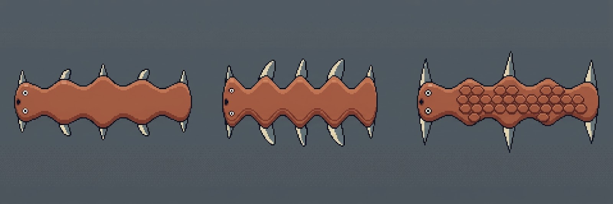
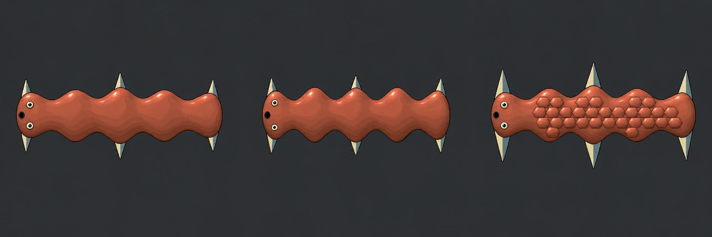

# Coherent genome-derived family: test battery

A bounded adult authoring experiment, separate from the game and hardware simulator. One retained individual and two controlled genomic variants exercise versioned continuous anatomy, explicit features, source inspection and a matched art-generation comparison. The specific construction grammar is provisional. Old content and records must remain reproducible.

## Acceptance questions

| Domain | Question answered by the battery |
| --- | --- |
| Genetics | Do complete inherited copies produce deterministic expression, and can each changed anatomical feature be traced to its contributors? |
| Construction | Does a continuous exterior connect the resolved stations, with real exterior-rooted appendages and contained, non-overlapping explicit facial features? |
| Related variation | Do two recorded copy edits produce visible differences while preserving shared organization and honest provenance? |
| Failure behavior | Do unsupported topology, malformed content and impossible placement reject without changing copies or repairing anatomy? |
| Compatibility | Do retained old content/results/replay and the legacy Pip suite remain unchanged? |
| Authoring UX | Can the actual framework show a whole subject, selected sources, full baseline/inherited/expression fields, comparison, rejection and replay? |
| Art | With the same prompt and attachments, do the actual generated originals preserve anatomy, masks and related identity while improving HiBit craft? |

This evidence distinguishes software/source checks, actual browser interaction, mediated visual review and generated artwork. It does not establish human fun, physical biology, target-device performance, production animation or full genomic breadth.

## Results

The new `continuous-static/1` package contains 58 provisional records: 50 executable and eight drafts. Skin and scales have actual construction; fur and feathers remain detailed drafts. The three examples are a base input and two controlled copy edits, not offspring or approved species.

- **Host validation:** 34/34 relevant tests pass. All 13 retained legacy cases reproduce exactly, including the rejected case's reasons. Independent genetics/technical inspection passes the bounded construction, source tracing and projection boundary.
- **Seeded generation:** [The retained battery](seed-battery.json) evaluates seeds 0–99 twice with at most 128 whole-genome draws each. 93 generated valid constructions; seven exhausted the bound. Mean draw count is 56.75, maximum 128. Of the 93 valid results, 38 reject art projection because its prompt exceeds the existing limit. Valid genomes survive this failure; there is no silent truncation or gene repair. These numbers measure this profile's viability, not broad creature diversity or an unbiased population.
- **Framework:** React/Mantine build passes. Actual browser interaction verified the three controlled inputs, stale-output clearing, same-profile comparison, ocular selection/highlighting, baseline/inherited/expression fields, new and legacy input-authoritative replay, package switching and malformed/unsupported topology rejection. The [comparison](browser-comparison.png) and [ocular selection](browser-ocular-locus.png) retain actual captures. Art's UX assessment is mediated visual inspection, not independent navigation playtesting.
- **Source:** Every subject retains five stations, four tissue joins, six fins, two ocular modules and one oral aperture. The first two use skin; the third has 30 actual scale plates. The [engine-derived sheet](family-reference.png), [SVG](family-reference.svg) and [affine placement manifest](family-reference.json) use one shared world scale. Art rejected the initial angular silhouette; the retained corrected profile uses monotone rounded transitions that also govern roots, face containment and covering placement.

## Matched art outputs

Both workflows received the same frozen [3,040-character prompt](prompt.txt), engine-derived sheet and preserved [C18 craft reference](../../../../design/game-art-proposals/35-vault-composition/18-c-refined.png). One call per workflow; no adaptive retries or output edits. The shared prompt is a bounded calibration request grounded in three retained results, not a general procedural creature generator.

| Workflow | Actual result | Review |
| --- | --- | --- |
| Gemini web Images / Pro | [Original PNG](gemini-family-01.png), [run metadata](gemini-family-01.json) | **Anatomy FAIL:** left and middle have ten fins rather than six. Intermediate roots and swept fin shapes are invented; the middle contour becomes angular. Broad skin/skin/scales and facial roles remain, but do not override that failure. |
| GPT-6.1 Sol High-directed built-in image tool | [Original PNG](builtin-family-01.png), [run metadata](builtin-family-01.json) | **Broad source-semantic PASS:** intended part counts, related proportions and skin/scales contrast survive. Exact registered geometry is unmeasured. Stronger contour/material hierarchy in this pair, but glossy skin and tiny faces do not establish the desired pet mood. |

The web workflow exposes Pro, not a verified raster backend model. Sol High directed the built-in tool; the raster backend is also unverified. Built-in tool wall time was 20.004 seconds; Gemini was first observed complete within 109.152 seconds. These different observation methods are not comparable provider latency benchmarks. Costs are unavailable, and one pair cannot establish a general quality ranking.

## Learnings and issues to fix

1. **Pet character starts in source construction.** Rounded joins improved organic coherence, but narrow triangular fins, weak leading-body distinction and tiny fixed face proportions constrain appeal. The art director must shape an explicit, genome-controlled facial/material grammar before another taste review. A provider may depict the genome; it may not repair it.
2. **Facial breadth is missing.** Current eye presence/placement and aperture presence do not provide snouts, noses, jaws, teeth, gills, varied eyes, feeding, olfaction or respiration. Build dependency-aware clusters rather than decorative feature labels.
3. **Covering breadth is missing.** Fur needs strand/tuft/clump geometry, density, length and flow. Feathers need rooted rachis/vanes, overlap and orientation. Both must remain tied to anatomy and pigments, with no automatic flight/insulation claims. Skin/scales are provisional static implementations.
4. **Generation is inefficient.** Seven exhausted seeds and many whole-draw rejections call for a better constraint-aware generation design. Retrying or quietly fixing genes is not a solution.
5. **Art projection coverage is insufficient.** 38 valid cases overflow. Separate compact visual facts from the complete review trace while preserving provenance; do not silently drop anatomy.
6. **Authoring causality needs clearer presentation.** Raw horizontally scrolling JSON and long output tables obscure the useful affected-output/source summary. This is an adult workbench issue, not permission to add explanation text to device navigation.
7. **Production remains open.** Exact art registration, wider body organizations, actual parent-derived family examples for this profile, expression/behavior depth, sprites, animation, incubation and game integration are not delivered here. The original diagnostic comparison also retains a known generic clip-ID risk when displaying two old-profile SVGs together; new-family comparisons use disjoint IDs.

The bounded engine proof is accepted. Both artwork originals are retained as benchmark evidence; neither is approved production pet art. This result does not change the deployed game or establish physical motion, hardware performance or human enjoyment.
