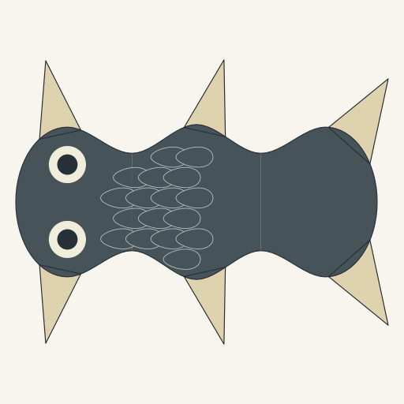
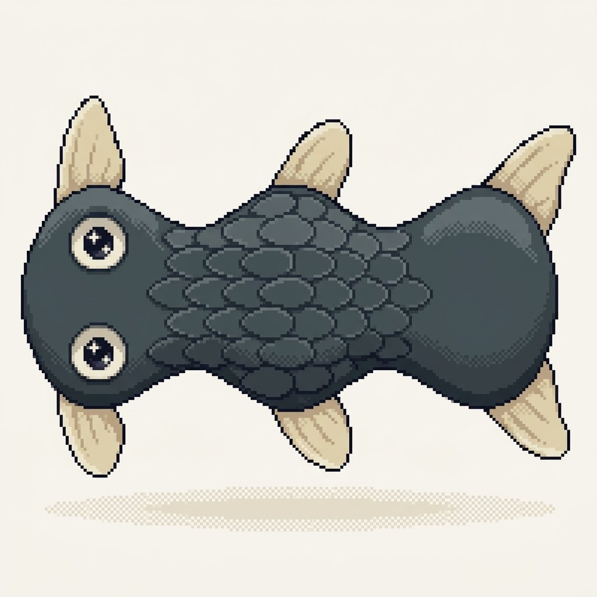
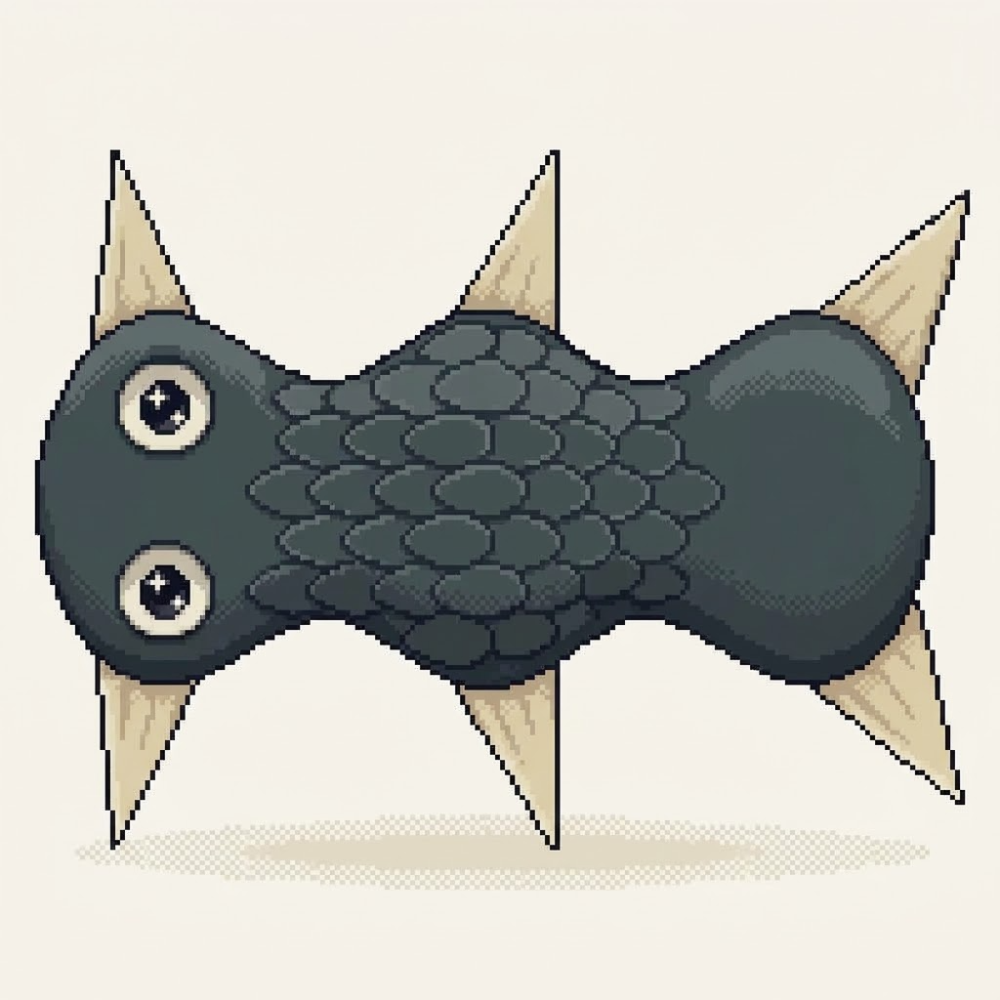
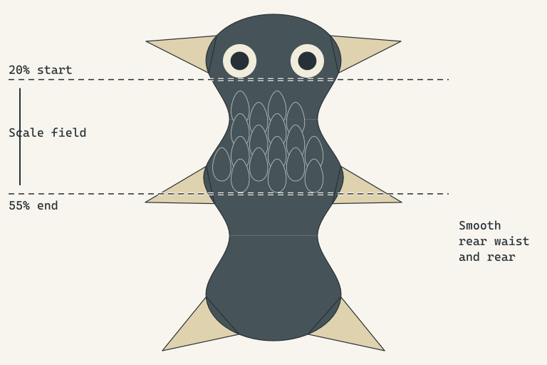

# Source-to-pet depiction experiment

Question: can one combined illustration/pet pass make an existing resolved creature companionable while preserving its source identity? This is an actual Gemini Images result from the art director's positive brief, using the retained axial-scales construction. It is not a host-rendered illustration or a model's textual claim of producing an image.

| Retained source preview | Actual first returned raster | Actual controlled correction |
| --- | --- | --- |
|  |  |  |

[Submitted prompt](prompt.txt), [manifest and file hashes](manifest.json), [browser image evidence](browser-result.png), and [original source packet](../module-scene-workbench/axial-scales.packet.json) remain inspectable. The source PNG is an unchanged rasterization of its retained SVG. The output is the 1024px PNG returned by Gemini's ordinary Copy image control; full-size download did not complete. Images mode and Pro were visible; backend model, cost and maximum original resolution are unverified.

## First actual result: retain learning, faithful-source HOLD

Art direction and genomics independently inspected the returned pixels and discussed the same defects. Three connected regions, six fins, two eyes, mouth absence and broad charcoal/cream pigment ownership remain recognizable. Modeled volume, pixel contours and eye reflections improve the construction drawing. This is useful depiction evidence, not accepted pet art.

Two changes break faithful same-expression use: scales extend across the posterior waist toward roughly three-quarters of body length rather than remaining in the original 20–55% field; all six pointed fins become rounded paddles. These are material/shape changes, not merely selective pixel detail. Exact eye/pupil ratios are unmeasured, and seventeen outlined glyphs are not required to portray the retained plate field.

The art director finds pet appeal still weak: the horizontal body and vertical eye pair read as a polished specimen, with dense scale outlines dominating the character focus. Fidelity and appeal are separate findings; the imperfect source match prevents a clean craft-only success or failure conclusion.

## Controlled correction: fin success, overall HOLD

The director and genomics agreed one92word positive correction brief. The original source was attached first as form/material authority; the first returned raster was attached second for pixel craft. The request combined a whole-subject90° clockwise rotation, the original pointed fins and the actual body-local20–55% scale field. [Exact correction prompt](correction-prompt.txt) and [actual browser result](browser-correction.png) are retained.

Both independent assessments examined the actual second image and agreed:

- **Pointed fin signatures restored:** all six remain in their recognizable opposed root groups.
- **Requested presentation missed:** the body remains horizontal and its eye pair vertical. This is a presentation failure, not a hereditary change.
- **Material fidelity still HOLD:** scales still cross the rear waist toward the posterior, visually around75% rather than stopping at55%. The exact source field is unchanged.
- Connected three-region body, supplied eyes, mouth absence and broad charcoal/cream pigment ownership remain recognizable. Exact ocular ratios, proportions and plate counts are unmeasured.

The correction does not deliver the desired readable face presentation. Texture continues dominating character focus; returned volume, contours and reflections remain useful craft. Neither image is an accepted faithful pet master, resolved new expression or production sprite. Source#G/#E identify the input; they do not certify these images as matching it.

Generation stopped after one first pass and one correction. No third call or animation is part of this experiment. The next bounded methodological task is a clearer single source handoff: preorient actual source geometry, visibly expose the covering domain in a separate inspection guide, and subordinate craft reference to source authority. This is a reversible design task within the approved generator exploration, not a canonical trait change. Its purpose is to remove competing reference authority before selecting another experiment; the two images alone do not establish why the provider missed the constraints.

## Prepared reference handoff

| Clean upright source | Separate inspection guide |
| --- | --- |
|  |  |

The [clean SVG](upright-source.svg) preserves the exact inner content of the original SVG under one common90° clockwise rotation and padding translation. The leading region is now at the top and the existing eye pair reads horizontally. The [guide SVG](covering-guide.svg) uses the identical frame and source, adding dashed20%/55% boundaries and outside labels. Those annotations are inspection ink, not inherited pigment or a pet illustration.

[Reference manifest](reference-manifest.json) records the original/derivative hashes, transform, retained world span and boundary coordinates. Original SVG bytes remain unchanged; each PNG was regenerated once with matching SHA256. Source geometry, roots, pigment fragments and17 plate records were preserved. This input preparation does not establish that a future image model will follow it. No further provider call was made; pixel-craft guidance must remain subordinate to this source rather than supply a competing full-body template.

**Reference handoff PASS:** art direction inspected both actual768×512 exports and384×256 views. The top leading region, horizontal eye pair, three regions/two waists, six pointed fins and separate field guide are readable. Independent genomics checked exact inner-SVG preservation, hashes and the common rigid mapping. Body-local20–55% correctly becomes pageY111.5984–271.8956. The field denotes the allowed covering domain; it does not authorize adding plates everywhere inside it. The independent assessments agreed. This passes construction/reference preparation only; the generated-pet HOLD remains.
