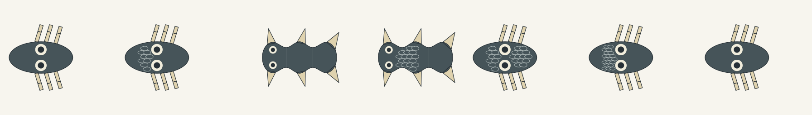

# Broad body-local skin/scales consumer

This provisional static XY experiment adds three inherited covering contributors
to the broad ocular catalogue: skin/scales kind, field extent and element scale.
One complete 54-record catalogue retains48 executable contributors and six drafts.
It does not choose a species or use the PET topology gate. Fur and feathers
require distinct rooted material operators and remain pending for the broad scene.

`developmental-covering/1` declares its actual source rule separately from the
preserved analytic body convention, opt-in `ocular-module/2` and `body-covering/1`.
The ocular profile keeps the same geometry constants and gives the new source its
true identity; prior ocular and other packages stay exact. The covering consumer
reconstructs and verifies the full body and ocular binding before consuming them.

Scales use actual overlapping rounded footprints with retained roots, pitch and
orientation in a deterministic body-local field. The whole footprints stay in
the declared field/exterior and clear eye rims and attachment-root regions.
Source station ownership and pigment masks remain mapped across each footprint.
Declared exclusions can omit placement candidates; empty placement or budget
overflow rejects atomically without repair or truncation. Candidate/exclusion
counts distinguish the permitted interval from actual realized plate coverage.
It is not an exact body-percentage or protection/physiology claim.

Skin constructs no plates and leaves extent/size inactive. The full inherited
copies and facts remain inspectable; changes to inactive parameters preserve
visible geometry. Material-only comparisons preserve body, eyes and appendages.

Reproduce from the workbench directory with the existing Node host runtime:

```sh
node --test graph-covering.test.mjs
node construct-covering-proof.mjs --out evidence/graph-covering-proof
```

The seven comparison inputs are skin/scales on each of the two body organizations,
extent-only and element-size-only scale variants, and a skin latent-parameter
variant. They are selected inherited inputs, not organism generation presets.
Packets, constructors, scene identities and common-camera 256px SVGs retain their
full source. PNGs are direct rasterizations of those SVGs, adding no anatomy or
illustration. Scale plate boundaries use neutral diagnostic inspection ink; the
ink is a presentation aid, not inherited pigment or production material shading.



Left to right: contact-body skin, contact-body scales, axial-fin skin, axial-fin
scales, extent-only scales, element-size-only scales, and skin with different
inactive covering parameters. Accepted plate counts are respectively 0, 9, 0, 17,
23, 20 and 0. The last skin image has the same visible geometry as the first.

The first raster's dark thin plate outlines failed intended-size material
legibility. The correction changes diagnostic edge ink only, retaining all
plate footprints, pigment fragments, body, eyes and appendages. This is a
construction comparison, not a pet illustration or style approval.

Seven focused checks and all seven CLI exports passed after the causal and
malformed-input corrections. Independent actual 256px inspection passed the
corrected material field, extent and element-size contrasts on both organizations.
Eye and root gaps remained readable. Skin and skin-latent PNGs are byte-identical.
The final comparison PNG SHA256 is
`BBEC676721D65445D7BA450C9D6256F580D9595050806310DBE7A4F21133077D`.

Scales retain eye presence as an exclusion cause both when eyes are present and
when absent; dormant eye size/placement do not participate. Skin consumes only
covering kind. Independent technical review passed seven new full replays,
four selected legacy replays, constructor/scene parity, whole footprints,
eye/root clearances, original pigment partitions and atomic invalid-state,
empty-field and budget rejection. Exact-source CI is recorded in the PR.

No default UI package change or provider/native/game evidence follows from this
host proof. Generic diagnostic, geometry-reference and Gemini prompt consumers
explicitly defer for the new rule until faithful scene projections exist.
Fur/feather breadth, general random scene eligibility, 3D tissue, motion,
finished pet-art/pet-appeal and game integration remain open.
