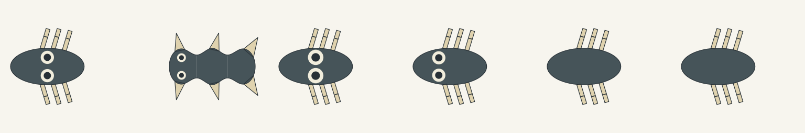

# Ocular module on the broad body graph



This provisional static XY experiment extends the broad genomic catalogue with
three inherited contributors: optional eye-pair presence, placement and relative
size. It does not choose a species or apply the narrow PET topology gate. One
complete51-record catalogue/genome retains45 executable contributors and six
drafts; the three existing packages remain separately replayable.

The new `developmental-ocular/1` result explicitly retains the body convention
`developmental-analytic/1` and module version `ocular-module/1`. The unchanged
`graph-source/1` body constructor consumes that convention. The separate module
constructor verifies its source binding and constructs declared circles/pupils in
the leading volume's actual local domain.

Presence uses the existing dominant-enable rule. Placement and size use copy
means; absent presence retains those parameters as inactive. Radius is inherited
size times the smaller leading full width/length. Longitudinal placement is local
to the leading volume; lateral spacing, cream/pupil pigments and pupil ratio are
declared provisional profile content. Invalid containment, rim clearance, pair or
root overlap rejects without shrinking, moving or changing inherited copies.

The comparison cases are selected genomic inputs, not organism presets:

| Input | Comparison purpose |
| --- | --- |
| Single volume with contact chains | Module on a broad contact body |
| Joined axial volumes with fins | Same module on a different organization |
| Size-only variant | Causal radius change, body unchanged |
| Placement-only variant | Causal center change, body unchanged |
| Two absent-eye inputs | Different latent parameters, identical visible geometry |

Reproduce from the workbench directory with the existing Node host runtime:

```sh
node --test graph-module.test.mjs
node construct-module-proof.mjs --out evidence/graph-ocular-proof
```

The CLI retains full input/result packets, body and module constructions, scene
identities and SVGs at one common camera/256px scale. PNG previews are direct
rasterizations of those SVGs; they add no features or illustration.

The generic diagnostic, geometry reference and Gemini prompt defer for the new package;
neither currently consumes this scene. It is not added to the default browser
package list. Genetic random generation does not guarantee eligibility for the
narrow static scene constructor. Full generation/UI integration, coverings, oral
features, sensing physiology, 3D tissue, animation, finished pet art and native
game/device evidence remain open.

## Validation and visual disposition

Seven focused checks passed, including retained legacy packet replay, causal size
and placement changes, inactive parameters, source-binding/invalid geometry
rejection and the new-only unsupported projection guards. A controlled axial-spacing
change verifies its indirect contribution to the local half-width and paired Y
positions; radius and X stay fixed. The CLI exported six
complete cases. `rejected-maximum-size.json` separately retains the explicit
0.24-radius-ratio input and root-overlap rejection; the accepted size comparison
uses 0.18→0.21. This is selection of valid test inputs, not a solver repair.

Art and integration assessments inspected the actual1536×256 comparison and
relevant256px individuals. Both eye pairs remain distinct; the axial pair is
smaller. Size and placement changes are visible; the absent-eye cases match.
The XY view puts the features vertically on the page. It establishes local
eye-like feature legibility, not an engaging frontal face or pet-appeal approval.
Independent technical and exact-source CI disposition are recorded in the PR.
