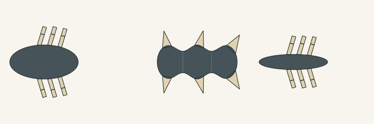

# Shared graph exterior proof

This is a provisional **static XY construction experiment**, not game art, a
3D tissue mesh, animation, physics or game/device integration. The same
`graph-source/1` constructor consumes three actual resolved genomic inputs;
organism classes do not select a body template.



Left to right:

| Input | Retained structural result |
| --- | --- |
| Single volume with contacts | One exterior; six two-link contact chains |
| Axial volumes with fins | Three joined regions; six rooted fins |
| Width-only variant | Same contact organization; narrower inherited body |

All three use one camera and scale; each reference is 256×256. `manifest.json`
retains input/result/construction identities and the comparison relationship.
The `.packet.json` files preserve complete inputs and prior resolution. The
`.construction.json` files retain solved exterior vertices, local frames,
appendages, material domains and node/edge/locus traces.

Rounded caps, a 0.65 midpoint neck ratio, static appendage geometry and
nearest-station material ownership are explicit provisional profile rules.
Inherited longitudinal roots stay at their source positions. Each original
surface maps once; source graphs and result digests remain unchanged.
Unknown profiles or invalid geometry reject atomically. Radial, membrane,
branched, deformed and marked bodies are unsupported in this first slice.
Height and Z coordinates remain retained facts; their 3D construction is absent.
Faces and coverings still require subsequent operators.

Reproduce with the existing Node host runtime:

```sh
node --test graph-source.test.mjs
node construct-source-proof.mjs --out evidence/graph-source-proof
```

The seven focused checks passed. Independent source/geometry review passed three
exact packet replays, serialized construction/SVG parity and source preservation.
Its boundary probe confirmed rejection of a fin chord outside its owning station,
intersecting appendages, marked input and an unknown source rule. Final CI
disposition is recorded in the pull request. PNG previews are direct
rasterizations of the exported SVGs using the bundled Sharp runtime; they add
no anatomy or illustration. Visual inspection covered the actual 768×256
comparison. No existing evaluator, renderer prompt or default workbench UI path
was changed.
