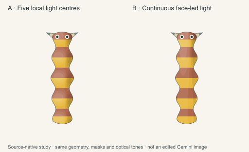

# Controlled light and edge study

One matched **source-native** comparison at256px per source viewport. It is not a paintover of the retained Gemini image, which remains unchanged. [Editable SVG](comparison.svg), [source/hash manifest](manifest.json) and [export recipe](render.mjs) are retained.

Both panels use the exact [upright source](../semantic-candidate-pet/upright-source.svg): same geometry, proportions, position, scale, roots, fins, oculars, local pigment masks, smooth skin, contour technique and background. A repeats optical light/shadow around five source region centres. B redistributes the same tones into one continuous face-led field, quieter toward the rear. Both use white/black optical overlays at8%,16%,24% opacity; neither adds texture, eye glints or feature changes. The source256px viewports are identical; complete comparison canvas is512×312.

Actual inspection finds B reduces the repeated hotspot/cushion lighting and gives the body a more connected light rhythm. Both remain thin, striped source diagrams with tiny supplied eyes; pet appeal is weak. The unchanged five-region/four-waist structure and russet/golden-yellow bands remain dominant. Neither panel is polished companionable art or a production master. This separates a depiction contribution without proving that the morphology cannot work under any portrayal. The study tests a lighting/edge treatment bundle, not one physical lighting parameter or an exact improvement to the provider raster.

One deterministic regeneration matched SVG, PNG and manifest hashes exactly. Final PNG SHA256 is `f292d8c36b1d4869a51448aba8c594b2e72ac43f6d5adf8a2837b74a0ae5dd0c`. Source SHA256 remains `95f4c7111cb15d46db2577d7ea76990494fb62e11fa5bcfa8b9730d9ffd4ef3f`. Art direction inspected the actual final512×312 export at1× and independently matched its hash: study PASS, pet-master/polished game-art HOLD. The controls are fair for the treatment-distribution bundle; B looks quieter but flatter and does not materially strengthen the tiny-face focus. This is not equal-energy lighting physics or proof that morphology must change.

The bounded comparison stops here: no provider retry, new traits/pigments, animation, canonical promotion or game integration.
