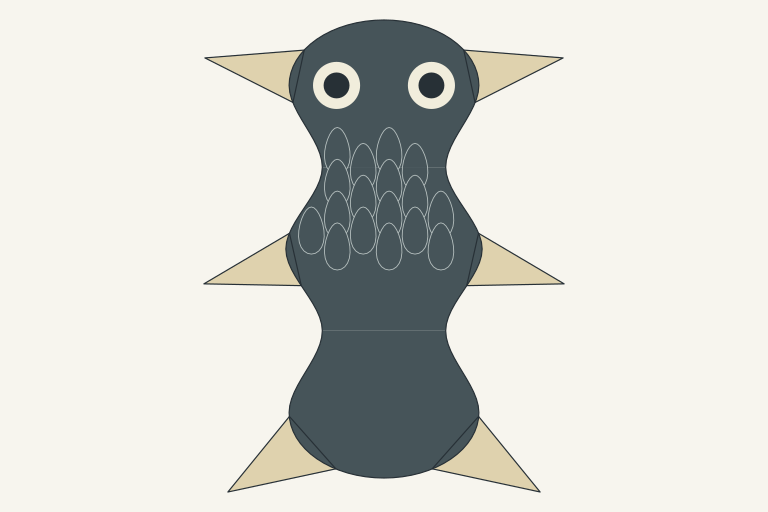
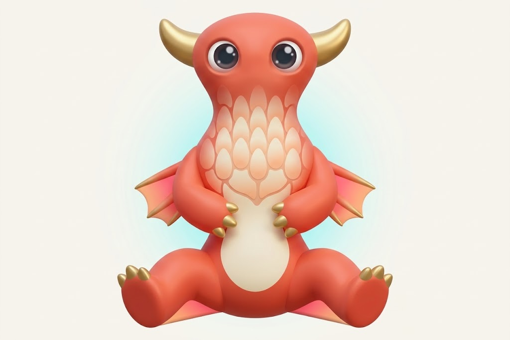

# Reference example: finish form and communicate skin

The reference submission includes this diagram, the exact [Gemini prompt](owner-prompt.txt),
and the returned illustration on 2 October 2026. These original files are
retained unchanged; the [manifest](manifest.json) records their hashes and
reported provenance. This result was supplied separately from the recorded experiment.

| Diagnostic source | returned illustration |
| --- | --- |
|  |  |

The design identifies three required improvements: describe appendages more
clearly, distinguish material indications from surface objects, and communicate
expressed colours and textures explicitly. Art direction, pixel art and
genomics inspected these actual images and considered the same requirements.

The returned pet demonstrates integrated volume, comfortable form hierarchy,
readable eyes and skin pattern belonging to the body. Its smooth shaded finish
does not demonstrate intentional HiBit pixel clusters. Horn-like upper parts,
arms/digits, feet, membranes and coral/cream/gold/pink pigment domains are useful
proposed design changes; they are not resolved traits of the fin-only source.
There is no visible mouth in this result.

## Active handoff correction

Describe the continuous body and characteristic proportions; actual appendage
roles, counts, root groups and available span/chord/taper or connected sections;
covering kind, field, scale, flow and pigment ownership. A diagnostic triangle
locates a fin construction, and a scale outline samples a covering field.
Neither is automatically the finished exterior of the illustration.

Material depiction can use coherent optical relief, curvature and selected edge
detail. Missing appendage roles, physical root depth, joints or pigment domains
remain upstream choices, available for explicit art proposals. Inspectable
construction coordinates and sample counts stay in the source record.

The current pigmentation locus offers only charcoal and russet. Clear colour
names and ownership improve faithful communication; a later versioned inherited
pigment proposal is needed for broader generated palettes.

See the [current art contract](../../art-template.md) for the production handoff
and separate source-fidelity, character and pixel-craft acceptance gates.
