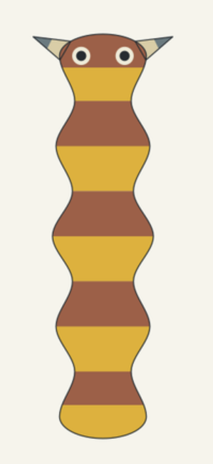
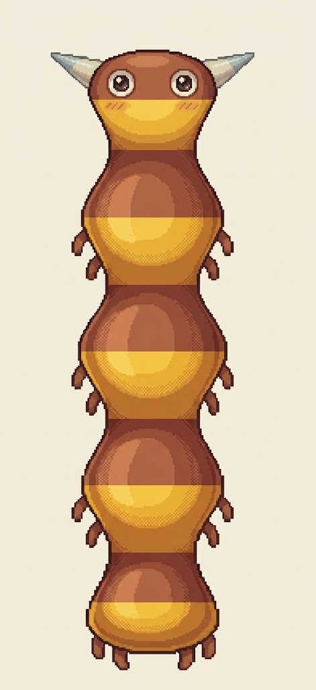

# Image-led pet example

The reference submission includes this source, returned pet image and exact submitted text on
2 October 2026. These are retained original attachment bytes, not a new provider
call or a controlled comparison performed by the workbench.

| Input reference | Supplied result |
| --- | --- |
|  |  |

Exact [reference submission](owner-prompt.txt):

> Turn the attached critter into an cute digital pet, shown alone in rich high-bit pixel art.

The practical workbench handoff corrects only the article to **a cute**. One
reference image and this sentence give the model room to portray an appealing
pet. Full genome, geometry, pigment and semantic records remain separately
available for inspection and a post-output audit; they are not automatically
appended to the creative instruction.

Art direction and genomics inspected both actual images. Reflective eyes, cheek
accents, warm modeled volume and small side projections give the output stronger
pet presence. Five-region continuity, russet/gold repetition and the leading
eye/fin pair preserve recognizable ancestry. Repeated highlights and dense
dithering remain craft limitations; this example does not isolate prompt length
as the cause or approve a finished game sprite.

New brown middle/rear projections are useful proposed anatomy absent from the
shown source, rather than inherited limbs already supplied by that genome.
Exact proportions, ocular geometry and pigment mask fidelity are unmeasured.
The curved golden facial shade alone does not establish a mouth. No locomotion,
new trait, resolved expression identity, animation or hardware performance is
inferred. Retain these observations after generation rather than adding model
prohibitions or discarding creative value.

The supplied screenshot/reference is not an exact exported genome packet. No
full G/E identity is guessed from its appearance. [Hashes](manifest.json) preserve
the two original files and exact recorded text.
