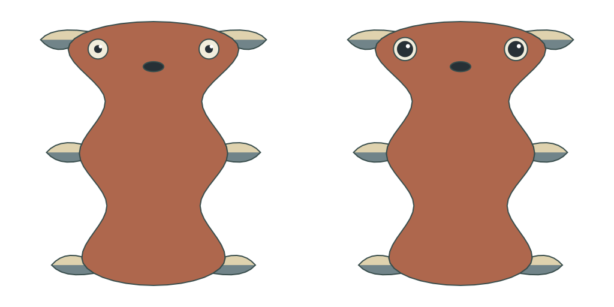
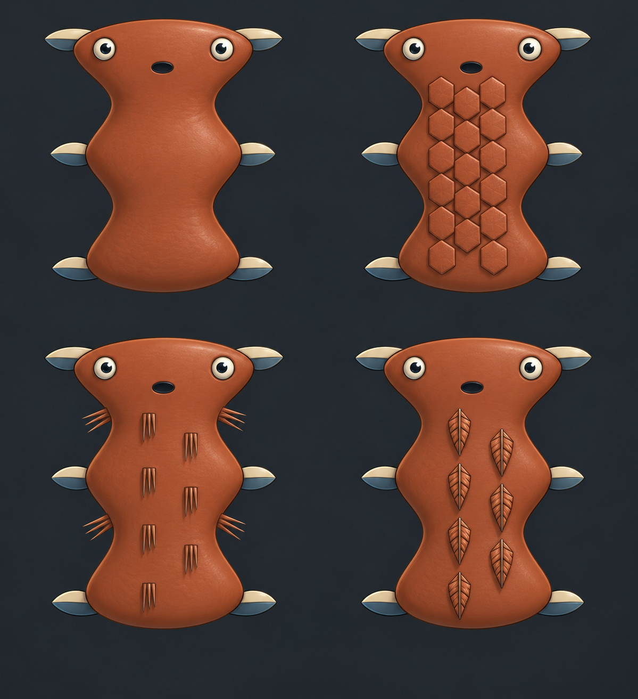
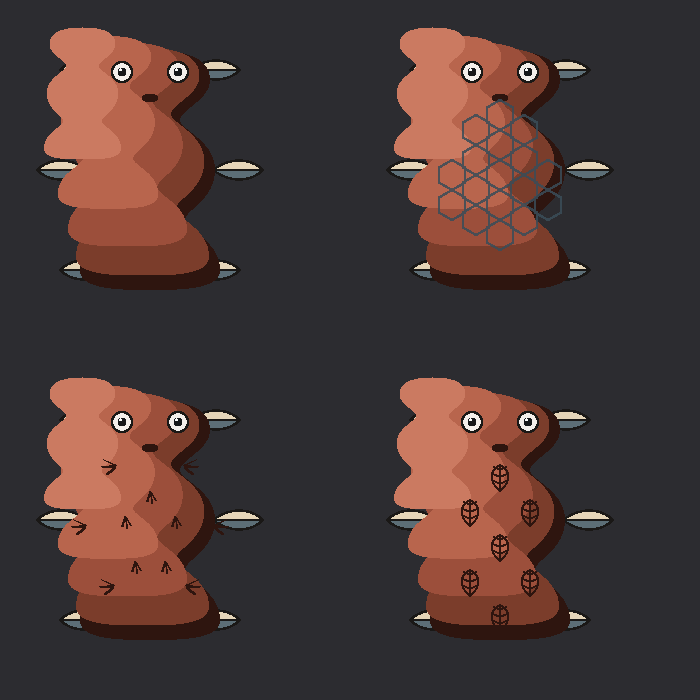

# Pet face and covering experiment

**Game-art outcome: rejected in design review.** The face comparison is a diagram, not desirable pet art. Bigger pupils, valid construction and matching component counts are insufficient. This proof retains useful authoring diagnostics and failed art calibration; it is not a production asset library or a game release. The [content contract](../../../../design/genome-starter-content.md) and [art realization proposal](../../art-template.md#renderer-and-workbench-responsibilities) record the next design boundary.

## Source and actual authoring UI

`genomic-pet-study@1` / `continuous-pet/1` supplies 62 provisional records, 54 executable and eight drafts. Four controlled material cases share body and facial copies; a fifth changes only ocular-size/pupil copies. They are authoring edits, not offspring or species presets. All eleven families remain inspectable; empty families are disclosed rather than treated as implemented physiology.

The [manifest](manifest.json) identifies exact inputs/results. Each named case retains JSON, canonical XY geometry, diagnostic SVG, genome field, fact description and engine-derived prompt. The [shared reference](pet-material-reference-vertical.png), [small proof](pet-material-small-vertical.png), [face comparison](pet-face-comparison-vertical.png) and [camera manifest](pet-sheet-vertical.json) use one scale and a true +90° rotation. No anatomy was repaired in presentation. Skin, 17 scales, 11 fur tufts/33 filaments and seven feather shafts/14 vanes/42 barbs are constructed upstream.

The actual React/Mantine browser checks cover initial unresolved state, skin resolution/pinning, face-only comparison and output deltas, ocular contributor highlighting, baseline/inherited/expression views, fur resolution and clearing current output/export after inherited edits while retaining the pin. [Integration evidence](integration.json), [face capture](workbench-face-comparison.jpg) and [fur capture](workbench-fur.jpg) separate those observations from unchanged earlier UI journeys. The authoring comparison allocates too much white space to a small subject; no independent browser or physical-device acceptance is implied.

## Validation

43 host tests passed and the Vite production build passed. Existing Mantine `use client` and large-chunk warnings remain. [Validation](validation.json) reproduces 16 retained previous cases/results/rejection reasons exactly and verifies all five new packets replay with nonrejected prompts. Independent architecture/genetics/projection review passed the bounded source implementation, including lossless dictionary reconstruction, malformed references, inactive contributor handling and canonical/presentation separation.

The fur prompt uses 32,356 of 32,768 characters: only 412 characters of headroom. This demonstrates five selected cases, not population-wide prompt reliability. The prior measured generation/prompt-overflow gaps remain in the [family evidence](../critter-family/README.md); that unchanged population sweep was not repeated.

## One matched provider attempt each

Both requests used the same [frozen 3,236-character prompt](prompt.txt), source sheet and preserved C18 craft reference. The request's literal contour/stroke lock is part of the failed experiment and remains unchanged. Originals and hashes are retained. No adaptive retries or output edits occurred.

| Workflow | Actual result | Assessment |
| --- | --- | --- |
| Sol High-directed built-in image tool | [Original raster](builtin-pet-01.png), [metadata](builtin-pet-01.json) | Broad anatomy/material groups retained; extra feather subdivisions. Smooth painted shading fails requested HiBit craft; repeats weak source contour. Exact registration unmeasured. |
| Gemini web Images / Pro | [Original SVG response](gemini-pet-01.svg), [metadata](gemini-pet-01.json), [browser capture](gemini-web-response.jpg) | Returned code instead of raster. Matches totals but rewrites body/root/material placement. Strict source fidelity and requested modality fail. |

The Gemini PNG above is a host rasterization of the returned SVG for inspection, not a generated raster or repaired output. Host SVG transform handling also exposes offset nested fills. Neither workflow establishes acceptable pet art. Backend identities, cost and comparable model latency are unverified; this single pair cannot rank image models.

## Proposed next review

Art and genetics agree that both morphology and depiction need redesign. Resolve a meaningful leading/support/posterior mass hierarchy, connective tissue, face surface and covering fields from contributors. Developmental stations need not become visible bead-shaped segments. Preserve genomic authority over topology, expressed exterior, proportions, roles/counts, attachment domains, palette, coverage/flow/exclusions and supported movement. Explicit realization rules may govern pixel clusters, light and deterministic micro detail; they may not invent organs, erase expressed structure or replace sparse tufts with a full coat.

The next design review should compare one cohesive game-art silhouette/face/material realization and two traceable variants before another coding or provider round. C18 supplies pixel craft but lacks a complete pet-character reference. A reviewed calibration master should define reusable generative operators, not become hand-authored content for each genome. These are proposals, not approved anatomy or a species selector.

No game/native deployment, save reset, animation, broad anatomy expansion, provider migration, purchase or new infrastructure occurred. [Artifact hashes](artifact-hashes.json) retain the evidence identity.
