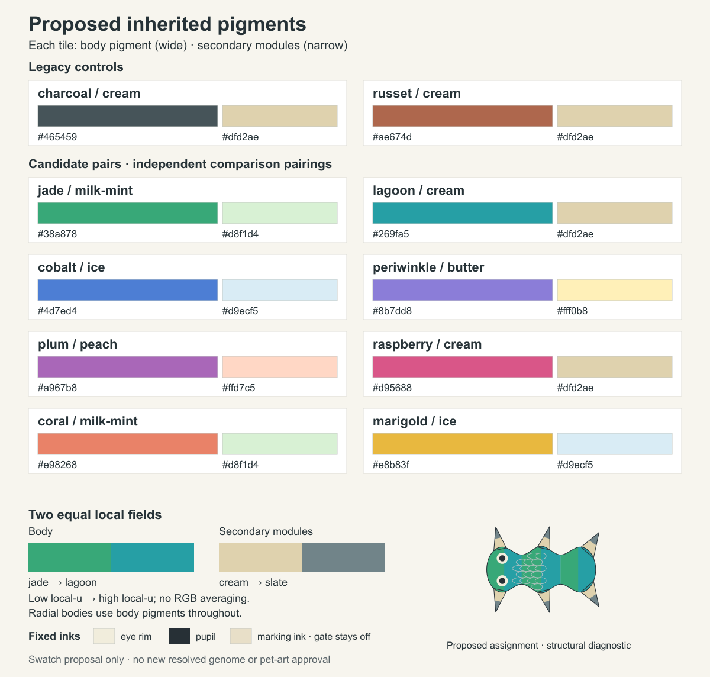

# Proposed inherited pigment comparison

2 October 2026. A bounded colour-content proposal for design direction: two legacy controls and eight candidate comparison pairings. These are flat swatches, not finished game art, newly executable alleles, a resolved genome or approved canonical colours. Runtime catalogue, inheritance, source anatomy and renderer prompts are unchanged.

[Editable SVG](comparison.svg), [exact candidate/ownership metadata and hashes](proposal.json), [grayscale comparison](comparison-grayscale.png), and [small hypothetical paint diagnostic](mixed-domain.svg) are retained. The canvas is1200×1144 for chat comparison; it is not a device screen or a native pixel-art master.

## Content and meaning

The eight proposed body IDs are jade, lagoon, cobalt, periwinkle, plum, raspberry, coral and marigold. Four proposed secondary IDs are milk-mint, ice, butter and peach. Old charcoal/russet body pigments and cream/slate secondary pigments remain exact. The metadata records every lower-case hex string.

Each tile shows a uniform body assignment and uniform secondary assignment, representing matching copies at each proposed locus. The displayed pairings are independent examples rather than linked families, species presets or combination restrictions. A future versioned catalogue needs explicit expression maps before these values become executable; this sheet does not supply new genotype/expression identities.

The lower strips show two equal ordered local-u fields: jade then lagoon for body surfaces, cream then slate for secondary surfaces. They are not RGB averages or global halves of an entire organism. The small inset uses the actual retained [axial-scales source packet](../module-scene-workbench/axial-scales.packet.json), with a hypothetical pigment assignment on the existing surfaces. Nodes, roots, source camera, geometry/material constructors and fixed ocular pigments remain unchanged. Covering fragments follow the same body pigment masks. No modified genome/result record or resulting `#G/#E` is emitted.

Bilateral body volume/join surfaces own body pigments; actual non-volume modules own secondary pigments. Radial surfaces use body pigments throughout, with secondary copies inactive. The inset does not create a belly, face patch, digit or new material domain. Eye-rim/pupil pigments remain fixed. The marking-ink chip is a reference only; markings remain off.

The [starter-content proposal](../../../../design/genome-starter-content.md) and [genetics specification](../../../../specs/genetics.md) own source meaning. This evidence shows prospective pigment vocabulary without changing their inherited rules.

## Inspection and limits

Production inspected the actual colour and grayscale exports for readable names/hex, consistent chip size, clear body/secondary ownership, local-field boundaries and clipping. Art direction inspected the same composed sheet: colour-comparison craft PASS. Candidate hues are visibly distinct from the legacy controls; jade/lagoon and periwinkle/plum can be distinguished in colour. Jade/lagoon nearly merge in grayscale, and several pale secondary colours do too. These hues must not become sole encodings for knowledge, operation or selection. No hue adjustment is needed to present this colour-only proposal.

One deterministic regeneration of the five generated artifacts produced identical SHA256 values. The final colour PNG is `ea126b3fa4c67c9fd47e902de828401a64f90a163bcdd60d2b9dd4ce39d03d9f`; all generated hashes are in the metadata. This verifies export reproducibility for the retained recipe, not display calibration, human preference, physical-screen contrast or genetic replay of new pigments.

The outcome stops at this comparable colour proposal. Design steering precedes canonical palette integration. Separately versioned candidate-enabled host experiments can proceed within existing authorization; they do not canonize these hues. No provider call, reference-art recolouring, new anatomy/material, animation, game deployment or accepted pet master is included.
