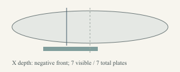

# Radial source scene in the workbench

This provisional host slice consumes the existing 50-contributor regional
foundation without changing its loci, sampler or inherited results. Eligible
radial anatomy selects `module-scene/3`; axial sources stay on scene2. The source
combines one central body, three rooted contact chains, optional diagnostic eye
modules and skin/scales. It is a construction reference, not finished pet art.

The controlled pair retains the same body, roots, eyes and expressed pigments.
Only covering-kind copies change. Bare skin has no plates; scales produces seven
plates from 72 candidates. Two eye circles preserve inherited radius and X depth.
A height-only change from .7 to .3 rejects on eye clearance; its complete source
is retained in `radial-low-height-rejected.packet.json`. No eye relocation,
shrinking or gene replacement makes it pass. The pair does not establish the
distribution of ordinary Generate results.

The clean reference looks along negative X into YZ. Ocular placement and covering
extent still mean longitudinal X. `ocular-radial-slice/1` is an explicitly
declared diagnostic module slice, not exterior eye tissue. Scale footprints in
`covering-radial-surface/1` retain X/theta, XYZ, local frames and body pigment
domains. Only front fragments are drawn; rear geometry remains inspectable.

This inspector shows the inherited eye plane and coverage interval. It is inside
Advanced inspection, separate from the model attachment. Candidate exclusions
use conservative whole-patch XYZ bounds and can exclude safe patches. They do
not establish physical collision or exhaustive surface coverage. The 24-vertex
contour is a retained sampling convention. Candidate, plate and vertex limits
remain unchanged; excess geometry rejects atomically.

The practical renderer prompt is exactly the 90 UTF-8 characters in
[pet-renderer.prompt.txt](pet-renderer.prompt.txt):

> Turn the attached critter into a cute digital pet, shown alone in rich high-bit pixel art.

Attach the clean source image separately. The per-case `*.prompt.txt` files are
full semantic audits retained with the packets; they are not this short renderer
instruction. No provider output was requested for this source integration.

Each case retains complete inputs/results and compact verified replay. The two
resolved compact payloads measure 60,943 and 60,947 bytes under the existing
64 KiB HTTP limit. [manifest.json](manifest.json) records scene identities,
sources and artifact hashes. [image-manifest.json](image-manifest.json) records
exact SVG-to-PNG raster hashes; `draw-references.mjs` uses the existing Sharp
runtime without changing shape or colour.

Coder validation passed eight focused checks, including real HTTP evaluate and
replay, oversized-request rejection/recovery, retained scene1/2 recipes, depth,
pigment ownership, tamper and stale publication. One exact source regeneration
and an isolated existing Vite build passed. A measured transparent depth-canvas
defect was corrected and its targeted replay check passed; clean source images,
prompts and scene identities stayed unchanged. Independent review, pushed CI and
actual browser activation are separate delivery gates, not established by this
coder evidence. Independent technical review passed after a misleading
mixed-projection comparison caption was corrected; the affected check and
replacement isolated build passed. Final architecture, remote CI and browser
activation remain open. The source is held and design review rejects the current
diagrams as illustration references; this is technical evidence only.

Fin/membrane/branched or multiple-volume radial bodies remain unsupported.
Extensive scales may exceed unchanged vertex budgets. Broader random creature
variety, physical eyes, pet illustration, animation and game/device integration
remain unfinished. Old saved records retain their original versions.
