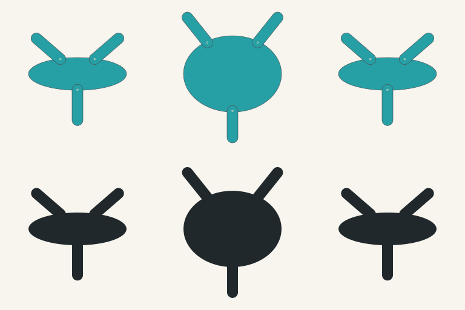

# Central radial source proof

This separately versioned `graph-radial/1` consumer uses the existing complete
regional-scene result. One inherited central volume and three actual contact
chains provide a source organization outside the axial bulb chain. This is a
controlled static construction proof, not random breadth or finished pet art.

Columns: baseline; only body-height copies changed; only inactive secondary
pigment copies changed. The upper row shows inherited lagoon pigments; the lower
row is a diagnostic silhouette. Every cell is 256px with one shared world scale.
Baseline and secondary-control PNGs are byte-identical. Height changes from
0.3 to 0.7, changing the body envelope and actual source-derived contact
directions; contact count and inherited segment lengths remain unchanged.

The source looks along X: Y is horizontal and Z points down. Original XYZ
positions, depth, exact segment lengths and solved ellipsoid roots remain in the
construction. Roots at an internal X slice legitimately project inside the full
body outline. Body-first contacts/root rings are an inspection overlay, not
physical depth sorting. Contact primitives are neutral rounded swept segments,
not a biological tissue or joint specification.

Every radial role inherits the body palette. The secondary copies remain
retained but inactive. New local atlases belong to the construction version:
body u follows projected Y; contact u follows root-to-tip distance. Unlike
palette values occupy ordered local fields; they are not averaged. Neutral
outline/root ink is identified separately from inherited pigment.

Each named `.packet.json` retains complete inputs, all resolved facts/copies and
source identity. Each `.construction.json` retains new geometry, atlas, causal
traces and a separate construction digest. `manifest.json` records the shared
camera, identities, controlled differences and exact artifact hashes.
`image-manifest.json` binds each PNG to its canonical SVG. Short #G/#E codes are
lookup references; they are not reversible genome strings or proof of ownership.

Run `node construct-radial-proof.mjs --out evidence/radial-source-proof` from the
workbench directory using the existing host runtime. The coder's focused
`node --test graph-radial.test.mjs` passed 7/7. One exact regeneration reproduced
all 11 generated JSON/SVG files. The focused checks cover actual roots/lengths,
height causality, latent/mixed/reversed pigments, conditional distal links,
explicit unprojected modules, malformed/bounded rejection, digest/camera guards
and exact historical source/replay retention. Independent technical review also
passed 7/7, checked all four held source hashes and ten generated artifact
hashes, and verified complete packet/construction binding. Final architecture
inspection found no boundary correction. The pixel artist viewed the comparison
and all three actual 256px PNGs: one continuous central mass, three countable
contacts, causal height contrast and no clipping pass the source-proof gate.
Uniform colours do not visually prove mixed-field order; focused checks cover
that case. Full creature and pet-master acceptance remain HOLD. These checks
do not establish physical performance.

Eyes and covering facts are explicitly **not projected**, including ON/scales
inputs. This is not biological absence. Fins, membranes, deformation, branching
and marked surfaces reject without repairing copies. Model, catalogue, sampler,
current Generate path and saved records are unchanged. A complete radial scene
with readable inherited features remains unfinished.

The practical creative handoff remains one matching reference and:

> Turn the attached critter into a cute digital pet, shown alone in rich high-bit pixel art.

No provider output was requested for this proof. Its diagram is not promoted as
the complete creature reference for pet production.
