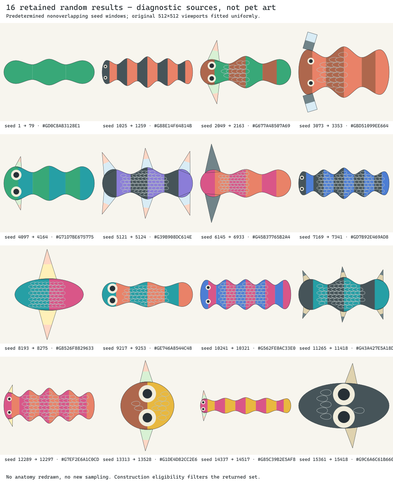

# Retained random diversity diagnosis

One predetermined batch at `ec37c77ed3dfe5f077b793187b7b6db604d8742d`
uses the existing experimental pigment catalogue and unchanged 1,024-attempt
limit. Requested seeds are `1 + i * 1024`, for i=0…15, avoiding overlapping
search windows. Each window retains its first scene-eligible result. No source
feature was edited and no extra draw was made to improve the sheet.

The [editable sheet](contact-sheet.svg) fits each original 512×512 viewport
uniformly. It does not establish a shared physical size. The sixteen source SVGs
are exact packet reference bytes; panel clip IDs are namespaced to avoid overlap.
[Retained inputs](retained-inputs.json) share one byte-equivalent catalogue and
include every accepted genome, context, expression seed, generation accounting
and expected identities. [Measured data](summary.json) and [file hashes](manifest.json)
retain the findings. This packaging is evidence, not a new genome transport format.

| Measurement | Result |
| --- | ---: |
| Accepted / exhausted windows | 16 / 0 |
| Attempted draws | 2,563 |
| Genetic-stage failures | 992 |
| Genetically resolved draws rejected by scene construction | 1,555 |
| One / three / five-region winners | 3 / 8 / 5 |
| Distinct inherited and expressed full identities | 16 each |
| Retained executable loci / traced facts per winner | 48 / 48 |
| Copy mismatches | 0 |

Eight winners have one fin pair, two have three fin pairs, one has a contact-link
pair and five have no appendages. Eleven have paired eyes and five have none;
twelve have scales and four have skin. Fifteen body pigment arrays are distinct,
but fourteen winners repeat two local pigment fields on every region.

The existing inherited axial pair map supplies only 1, 3 or 5 regions. Construction
divides body length equally between regions, aligns them on one axis and uses
symmetric center-bulge widths. The selected consumer rejects resolved deformation,
membranes/other unsupported roles, radial organization and expressed markings.
The largest first-reported post-validity errors were unsupported deformation
(1,087) and unsupported roles (362). First-error counts can mask later errors;
they are not independent feature prevalence. Collision and containment guards
also reject some candidates and must not simply be disabled for variety.

The bounded result supports narrow construction vocabulary and eligibility
filtering as causes of sameness. It does not establish a fixed five-region bug
or omitted inherited copies. Carried ocular, covering or limb contributors can
be inactive, while movement, energy and height need different consumers. The
six draft loci are not implemented operators. Retention alone does not prove
complete visual expression.

The next implementation boundary is to distinguish valid resolved genomes from
unsupported visual consumers, preserving their reason and version. Broader
source construction needs its own bounded increment; it is not supplied by
prompt or palette changes. Neither that increment nor canonical anatomy is
implemented by this evidence. One sheet regeneration reproduced its hashes.
