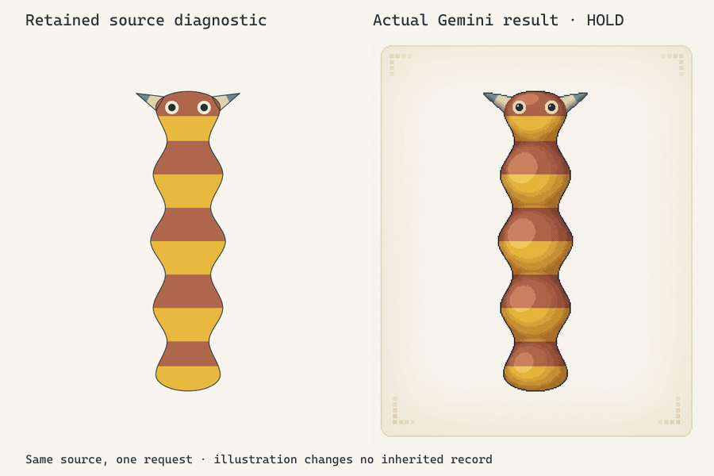

# Semantic candidate pet calibration

One actual Gemini image tests the current semantic handoff on the first random
candidate retained in [the workbench flow](../candidate-workbench-flow/README.md).
The experiment preserves its inherited record; it does not select canonical
anatomy, colours, a production sprite or animation.

## Exact input and operation

The source is `experiment-9e4730866d4cdb11b1e5`, accepted seed1062691442,
`genomic-covering-pigment-candidate@2`, with lookup references
**#GC0D1A46357E2 / #E8A030577944F**. The exact embedded reference SVG was extracted
from [first.replay.json](../candidate-workbench-flow/first.replay.json).
[Upright source](upright-source.svg) carries its complete unchanged inner content
through one common rigid rotation and padding transform. All parts and local
colour masks move together; no feature is independently reshaped or recoloured.
The pixel artist inspected it; one regeneration matched all eight prepared
source/prompt artifacts. Art direction accepted that exact input.

The [136-word submitted brief](submitted-prompt.txt) combines illustration and pet
treatment. It clarifies that russet/yellow repeats within **each** body region,
and cream/slate belongs to each fin's root/tip fields. The original
[emitted prompt](emitted-prompt.txt) remains separately retained; the two texts
are not claimed identical. Genomics considered the source and local-field
clarification before submission. Bare skin needs no additional covering guide.

One clean source PNG and that brief were submitted through Gemini web Images,
displayed Pro mode. No earlier pet raster, outline call, correction or animation
was used. The backend image model is not established by the mode label.

## Actual result and acceptance

The [returned PNG](gemini-pet.png), [256px review aid](gemini-pet-256.png),
[conversation capture](browser-conversation.png) and
[lightbox](browser-lightbox.png) retain actual pixels. The PNG is820×1024,
obtained through ordinary **Copy image** in the lightbox. A full-size download
event was not captured; native generation resolution is not claimed.

The raster visibly has five connected regions and four waists, despite the
provider's text claiming four regions. Two front fins, supplied eyes, mouth
absence, bare skin and repeated local colours remain recognizable. Provider
self-description is not acceptance evidence; exact dimensions, masks, ocular
ratios and shade-to-hex fidelity require separate measurement.

**Pixel artist and art director: pet-master and polished game-art HOLD.**
Repeated oval highlights and dense dither bands make the body read as separately
shaded cushions. The eyes lose priority at256px high; fins remain wedge-like,
and the added ornamental frame reinforces a specimen presentation. Stepped
contours and repeated local-colour ownership are useful improvements, but they
do not establish an inviting companion or production craft.

The one-output experiment is stopped. A subsequent controlled light/edge study
would distinguish portrayal's contribution from source repetition before any
explicit morphology proposal. It is not a provider retry or permission to
silently enlarge eyes, shorten the body, remove colour fields or add organs.
Independent genomics supports observable macro fidelity; exact
construction-to-raster correspondence remains unmeasured. The short codes
identify the source rather than certify a same-expression raster.

[Manifest](manifest.json) retains input/output hashes and the distinction between
exact source, presentation derivatives, submitted text and returned pixels.
Short lookup codes identify the input; they do not certify generated-image
fidelity, encode the whole genome or grant ownership/breeding permission.
