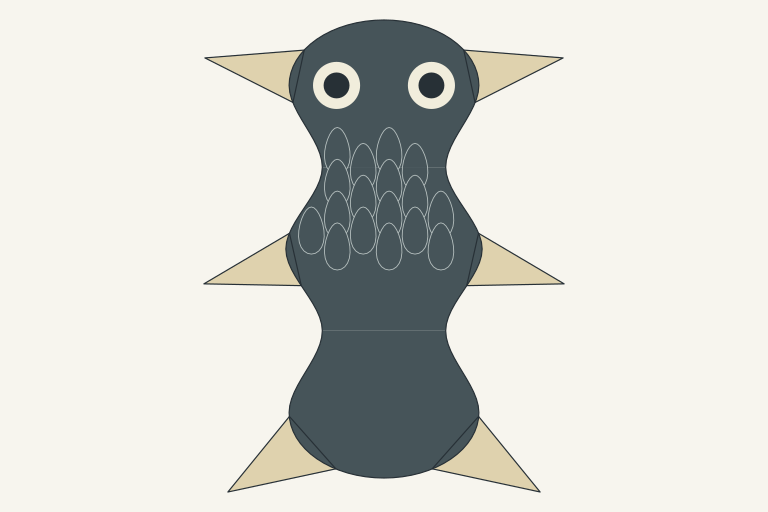
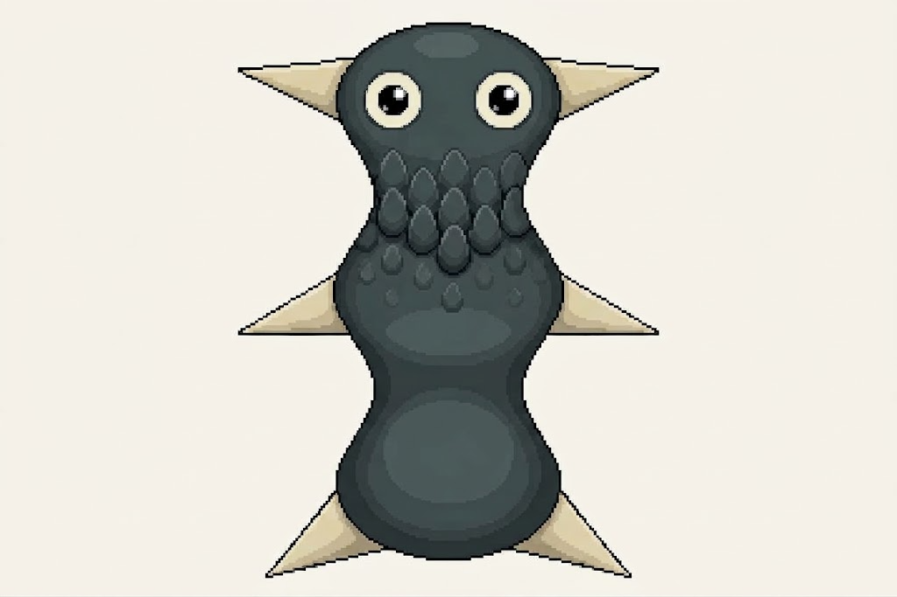

# Upright source and material-guide experiment

Question: can an already oriented source plus its matching material guide preserve presentation/covering identity while improving pet focus? This is one fresh Gemini Images request. The earlier [two-pass experiment](../faithful-pet/README.md) remains stopped; its prior generated images were not attached.

| Clean source supplied first | Actual returned image |
| --- | --- |
|  |  |

The matching [covering guide](../faithful-pet/covering-guide.png) was supplied second. Both references represent one unchanged phenotype with the same geometry/camera. Art direction and genomics resolved the input roles directly; pixel craft supported the frozen112word brief and guide tradeoff. Reference annotation was kept outside creature requirements and checked on the result, rather than expanding a prohibition wall.

[Exact submitted prompt](prompt.txt), [input/output hashes and dimensions](manifest.json), [browser image evidence](browser-result.png) and the [retained source packet](../module-scene-workbench/axial-scales.packet.json) are inspectable. Images mode and Pro were visible. The actual1024×683 PNG was acquired through the ordinary Copy image control; backend model, cost and maximum original resolution are unverified. Source#GAA74F886E586/#E1495F780380B are input lookup references, not artwork-fidelity certificates.

One request, no correction. The new method changes input orientation, adds a same-source material guide and removes a competing prior whole-body illustration together. Any improvement belongs to that combined handoff; this single result cannot identify which factor caused it. No canonical art, new expression identity, production sprite, rig, animation, biological or hardware acceptance is claimed.

## Actual craft finding

Art direction inspected the actual1024×683 raster and384×256 view. Upright presentation and the horizontal eye pair are clear; six pointed fin groups remain visible, scales are concentrated above the middle-region center and the lower waist/posterior read smooth. No guide labels/lines or new mouth are visible. Eye focus and material selectivity improve the earlier results. Exact plate, proportion and ocular fidelity receive a separate genomic assessment.

**Pet-master acceptance remains HOLD.** Three similarly weighted padded masses and repeated waist pinches give the complete body little gesture or hierarchy. Better face presentation improves character focus but does not make the whole organism sufficiently inviting. At review time the proposed next art question was an explicit body-hierarchy study: dominant leading/support volume, tapered lower region and less repetitive neck emphasis while retaining unfamiliar six-fin organization and pigments. Its changed relationships are proposed phenotype values, not a hidden correction to the original expression or proof that the source anatomy can never be appealing.

## Independent genomic finding

Observable macro source fidelity improves: leading region/top eye pair, continuous three-region organization, six pointed fins/root groups, source pigment roles and mouth/marking absence remain recognizable. Scales end around the middle-region center, before the lower waist, with posterior smooth. The earlier obvious paddle and posterior-covering defects are absent. No visible guide annotation became a creature marking.

Exact plate profile/count, ocular/pupil ratios and relative body registration remain unverified. This is a visual source-anchor finding, not a pixel-level pass for every resolved value or whole-genome certification. The proposed body-hierarchy route must record changed morphology separately and leave its resulting expression ID absent until a defined source can be resolved.

The subsequent [form/skin example](../owner-semantic-surface/README.md) redirected the active work to semantic appendage/material/colour communication. The uncalled body-hierarchy generation is held; it is not the next provider request.
